# Talend对接FusionInsight

## 试用场景

>Talend 7.0.1 <--> FusionInsight HD V100R002C80SPC200(HDFS,HBase组件)
>
>Talend 6.4.1 <--> FusionInsight HD V100R002C80SPC200(hive组件)
>
>注：因为Talend 7.0.1版本bug，HIve组件无法在版本7.0.1中通过，对接hive组件使用Talend 6.4.1版本

## 安装Talend

### 操作场景
安装Talend 7.0.1


### 前提条件
- 已完成FusionInsight HD客户端的安装(可参考产品文档->应用开发指南->安全模式->配置客户端文件)

### 操作步骤

- 配置环境变量JAVA_HOME,Path

  

- 配置Kerberos认证
向FusionInsight HD集群管理员获取集群Kerberos的krb5.conf文件,把相应的krb5.conf文件重命名为
krb5.ini,并放到`C:\ProgramData\Kerberos`目录中，同时将krb5.ini文件放到`C:\Windows`目录下（Talend默认从此目录下查找）

  

- 下载TOS并修改TOS启动参数
在`https://www.talend.com/products/big-data/big-data-open-studio/`下载TOS，创建连接zookeeper的jaas配置文件（如`C:\developuser\jaas.conf`），内容格式如下：
```
Client {
com.sun.security.auth.module.Krb5LoginModule required
useKeyTab=true
keyTab="c:/developuser/user.keytab"
principal="developuser@HADOOP.COM"
useTicketCache=false
storeKey=true
debug=true;
};
```
- 启动TOS_BD，运行TOS_BD-win-x86_64.exe
  

  安装必需的第三方库

  

  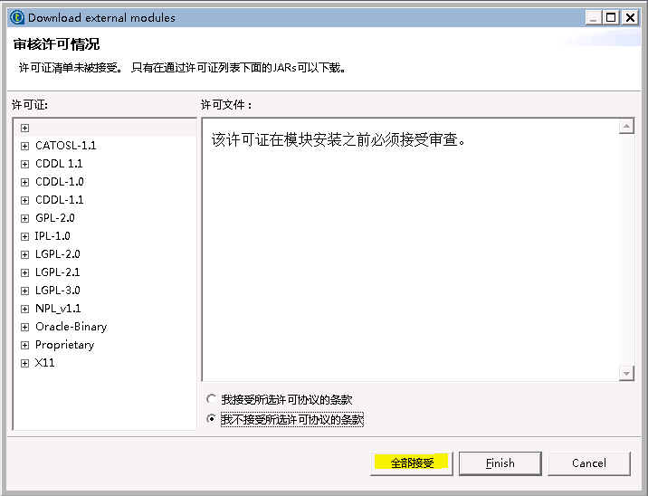


## Talend连接HDFS

### 操作场景

Talend中配置HDFS解析器，对的FI HD HDFS接口

### 前提条件

  - 已经完成Talend 7.0.1的安装

  - 已完成FusionInsight HD和客户端的安装，包含HDFS组件

### HDFS Connection 操作步骤

  - 添加tHDFSConnection组件，配置如下:

  

  具体配置：
  ```
  1: 选择Cloudera，版本为Cloudera CDH 5.8(YARN mode)
  2: "hdfs://172.21.3.103:25000"
  3: "hdfs/hadoop.hadoop.com@HADOOP.COM"
  4: "developuser"
  5: "C:/developuser/user.keytab"
  6: "hadoop.security.authentication" ->  "kerberos"
       "hadoop.rpc.protection"          ->  "privacy"
  ```
  - 测试结果：

  

### HDFS Get 操作步骤  
  - 整个流程如图所示:

  

  - tHDFSConnection组件配置不变

  - tHDFSGet组件配置如下：

  

  注意：测试前在集群HDFS文件系统上 `/tmp/talend_test`路径下已经传入文件`out.csv`，`C:/SOFT`为本地输出文件路径

  

  - 测试结果：

  

  到本地路径`C:/SOFT`下查看测试结果

  

  

### HDFS Put 操作步骤

  - 整个流程如图所示:

  - tHDFSConnection组件配置不变

  - tHDFSPut组件配置如下

  

  注意：测试前在本地目录`C:/SOFT`下创建文件`HDFSPut.txt`, 内容如下：

  ```
  It is create on local PC.
  ```

  

  - 测试结果：

  

  登录到集群查看测试结果：

  


## Talend连接Hive

### 操作场景

Talend中配置JDBC解析器，对的FI HD Hive接口

### 前提条件

- 已经完成Talend 6.4.1的安装

- 已完成FusionInsight HD和客户端的安装，包含Hive组件

### Hive Connection 操作步骤
  - 对接Hive组件Talend版本需要6.4.1

  

  - 整个流程如图所示:

  

  - tHiveConnection组件配置如下
  
  ```
  1: Custom-Unsuported
  2: Hive2
  3: "172.21.3.103:24002,172.21.3.101:24002,172.21.3.102"
  4: "24002"
  5: "default"
  6: "developuser"
  7: ";serviceDiscoveryMode=zooKeeper;zooKeeperNamespace=hiveserver2;sasl.qop=auth-conf;auth=KERBEROS;principal=hive/hadoop.hadoop.com@HADOOP.COM;user.principal=developuser;user.keytab=C:/SOFT/cfg/user.keytab"
  ```
  注意：需要点击Distritution旁边的按钮来导入FusionInsight HD客户端Hive样例代码中的所有jar包，如果还有缺失的jar包，可用Talend自带的类库进行自动补全，或者也可以手动导入

  

  - 测试结果：

  

### Hive Create Table & Load 操作步骤
  - tHiveConnection组件配置保持不变

  - tHiveCreateTable组件配置如下

  

  注意：需要点击编辑架构旁边的按钮来配置需要导入hive表的结构

  

  - tHiveCreateTable组件配置如下：

  

  注意：提前需要向hdfs文件存储系统`/tmp/talend_test/`路径下传入文件`out.csv`

  

  `out.csv`文件内容如下：
  ```
  1;EcitQU
  2;Hyy6RC
  3;zju1jR
  4;R9fex9
  5;EU2mVq
  ```


  - tHiveClose组件配置如下:

  

  - 测试结果：

  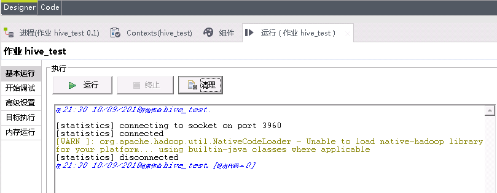

  在集群上检查传入的表`createdTableTalend`

  


### Hive Input 操作步骤
  - 整个流程如图所示:

  

  - tHiveConnection组件配置保持不变

  - tHiveInput组件配置如下：

  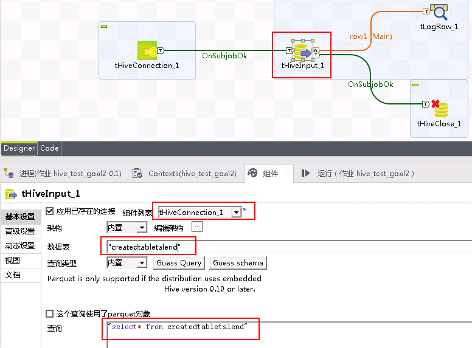

  注意：需要点击编辑架构旁边的按钮来配置hive表的结构

  

  - tLogRow组件使用默认配置

  - tHiveClose组件配置如下

  

  - 测试结果：

  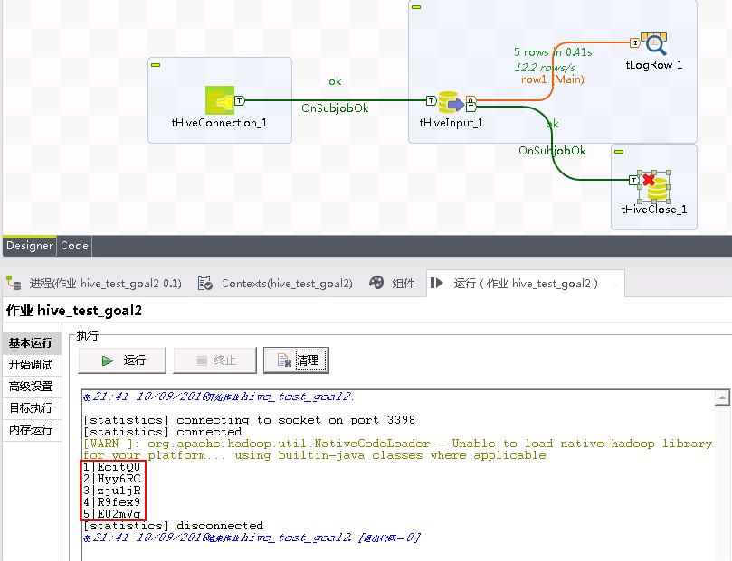

### Hive Row 操作步骤

  - 整个流程如图所示:

  

  - tHiveConnection组件配置保持不变

  - tHiveRow组件配置如下

  

  注意：需要点击编辑架构旁边的按钮来配置hive表的结构

  

  - 测试结果：

  

  连接到集群查看测试结果

  

## Talend连接HBase

### 操作场景

Talend中配置HBase解析器，对的FI HD HBase接口

### 前提条件

- 已经完成Talend 7.0.1的安装

- 已完成FusionInsight HD和客户端的安装，包含HBase组件

### HBase Connection 操作步骤
  - 整个流程如图所示:
  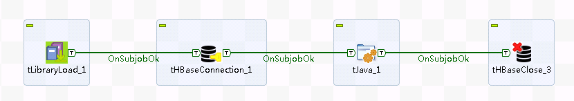
  - 用eclipse导出FusionInsight HD客户端中Hbase样例代码中的LoginUtil类（样例代码路径如`C:\FusionInsightHD\FusionInsight_Services_ClientConfig\HBase\hbase-example`）

  

  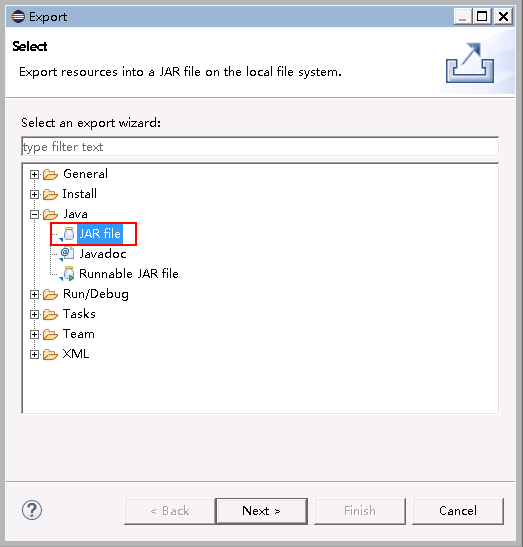

  

  - 在Talend里插入tHbaseConnection组件，点击组件进行设置

    

  - 首先点击tHBaseConnection图标下面的组件按钮，选择版本为`Custom - Unsupported`和`Hadoop 2`，再点击版本旁边的按钮导入jar包，需要导入的是上一步导出的hbase_loginUtil.jar以及FusionInsight HD客户端中Hbase样例代码`hbase-example`中引用的所有jar包，如果还有缺失的jar包，可用Talend自带的类库进行自动补全，或者也可以手动导入

  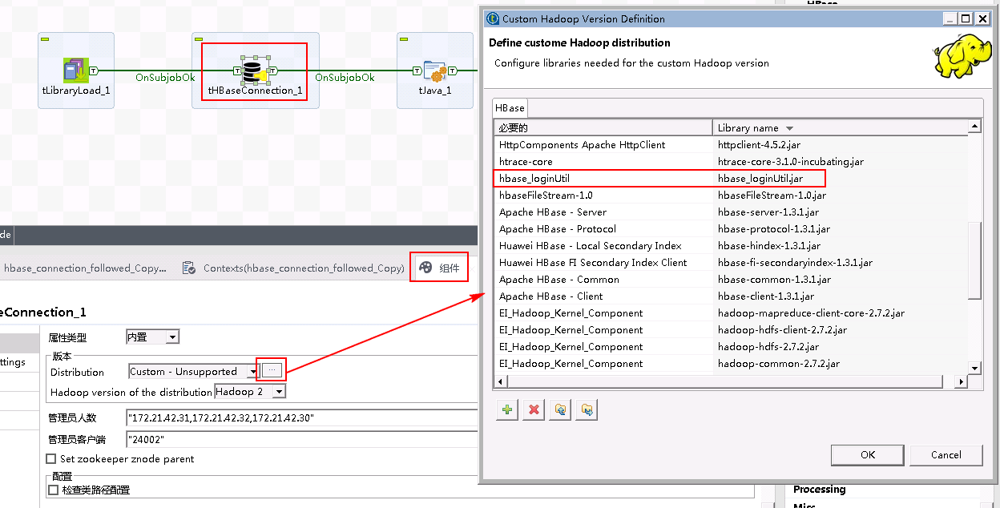

  `hbase-example`样例代码中lib目录下所有的jar包如下：

  

  - 使用tLibraryLoad组件导入hbase_loginUtil.jar
  

  点击 `Advanced settings`在Import中增加`import com.huawei.hadoop.security.LoginUtil;`

  

  - tHBaseConnection配置如下:
    

  - 引入tJava组件用定制代码替代Connection组件
  

  代码内容如下：
```
  org.apache.hadoop.conf.Configuration conf = org.apache.hadoop.hbase.HBaseConfiguration.create();

  System.setProperty("java.security.krb5.conf", "C:\\developuser\\krb5.conf");
  conf.set("hadoop.security.authentication","Kerberos");

  conf.addResource(new org.apache.hadoop.fs.Path("C:/SOFT/cfg/core-site.xml"));
  conf.addResource(new org.apache.hadoop.fs.Path("C:/SOFT/cfg/hdfs-site.xml"));
  conf.addResource(new org.apache.hadoop.fs.Path("C:/SOFT/cfg/hbase-site.xml"));

  System.out.println("=====");
  System.out.println(org.apache.hadoop.hbase.security.User.isHBaseSecurityEnabled(conf));

  System.setProperty("java.security.auth.login.config", "C:/developuser/jaas.conf");

  LoginUtil.setJaasConf("developuser", "developuser", "C:\\developuser\\krb5.conf");
  LoginUtil.setZookeeperServerPrincipal("zookeeper.server.principal", "zookeeper/hadoop.hadoop.com");

  LoginUtil.login("developuser", "C:/developuser/user.keytab", "C:/developuser/krb5.conf", conf);

  globalMap.put("conn_tHbaseConnection_1", conf);
```
  - 测试结果

  

### HBase Input Output 操作步骤
  - 整个流程如图所示:

    

  - tLibraryLoad，tHBaseConnection，tJava配置不变

  - 加入tFileInputDelimited组件配置如下：

    注意需要点击编辑架构旁边的按钮，根据需要存入文件(out.csv)的格式定义列和类型

    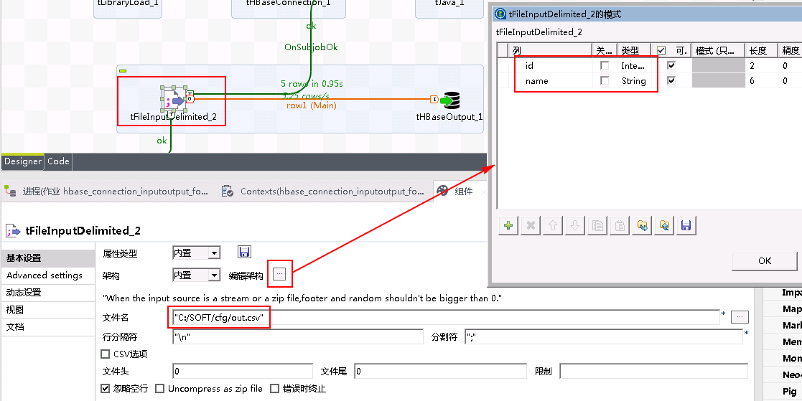

    `out.csv`测试数据如下：
    ```
    1;EcitQU
    2;Hyy6RC
    3;zju1jR
    4;R9fex9
    5;EU2mVq
    ```
  - 加入tHBaseOutput组件配置如下：

  

  注意需要点击编辑架构旁边的按钮编辑表的架构：

  

  - tHBaseInput组件配置如下，需要注意的是同样需要点击编辑架构旁边的按钮配置表的结构
  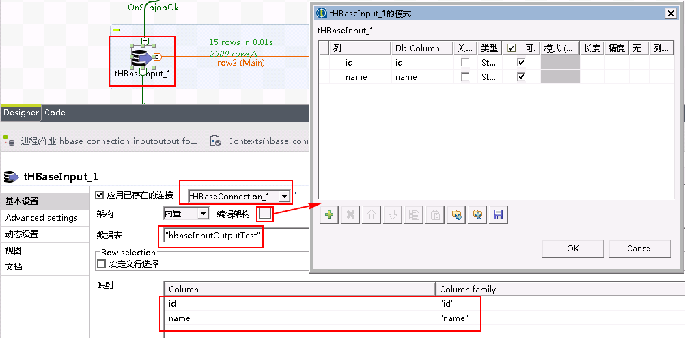

  - tLogRow组件使用默认配置

  - 测试结果

  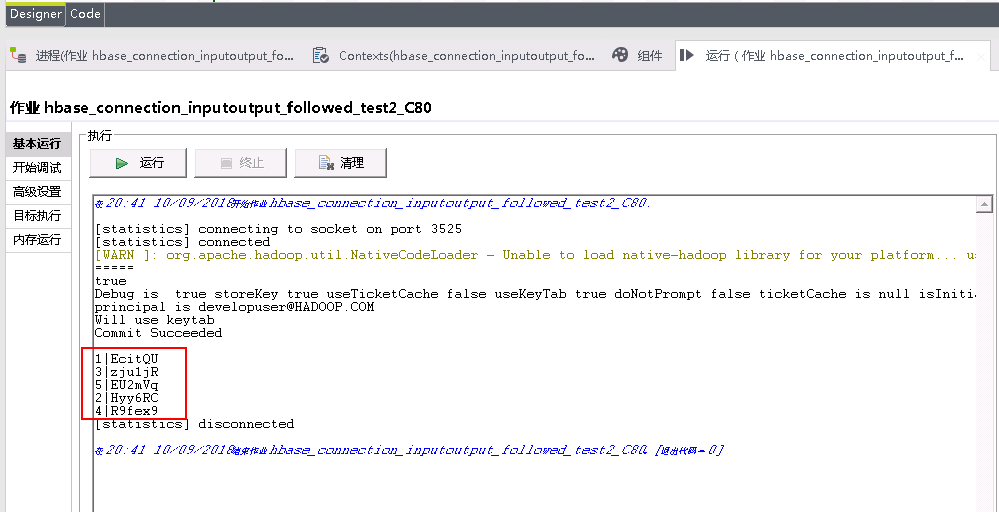

  检查集群创建的HBase表`hbaseInputOutputTest`

  在集群上使用代码
  ```
  hbase shell
  scan 'hbaseInputOutputTest'
  ```

  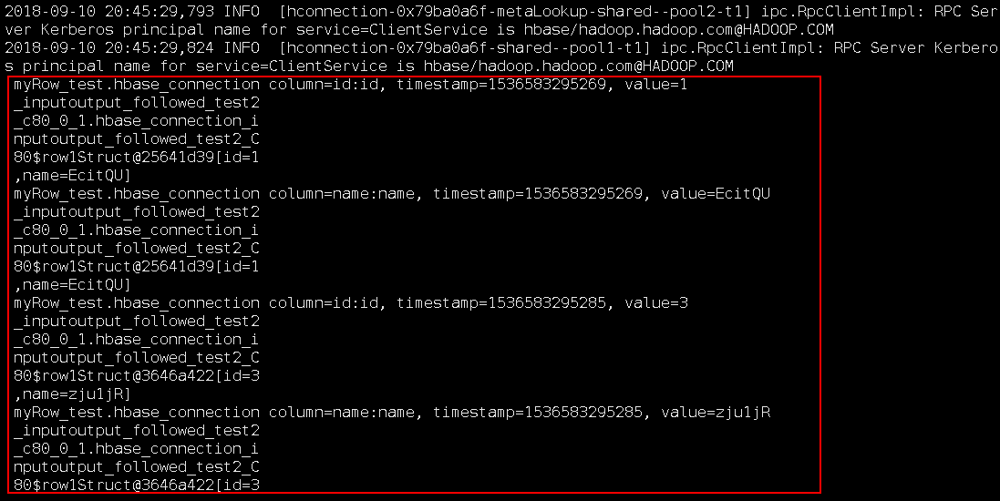

  
