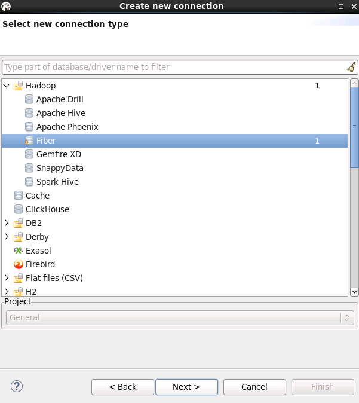
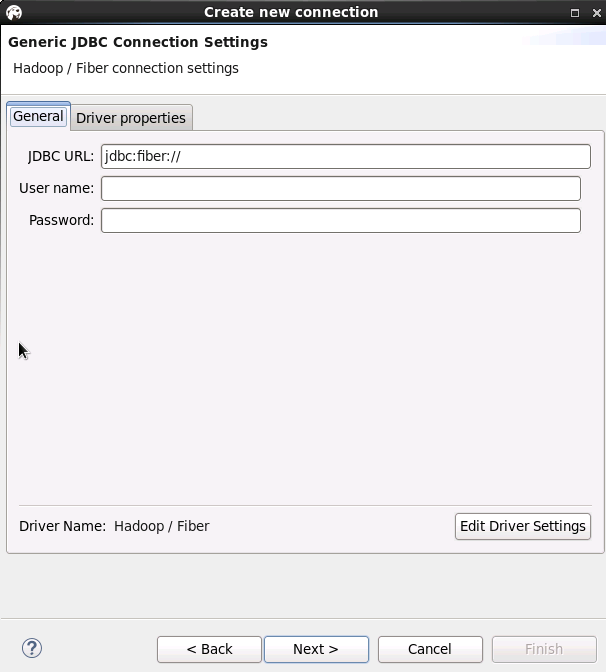
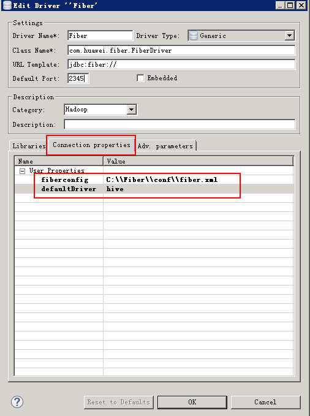

# DBeaver对接FusionInsight

## 适用场景

> DBeaver4.0.8  <--> FusionInsight V100R002C60U20

## 说明

SQL开发工具，如DbVisualizer、DBeaver、Squirrel是数据库开发的常用选择，虽然这些工具大多不提供原生Hive、SparkSQL、Phoenix的支持，但是通过它们支持的自定义JDBC的能力，我们可以与FusionInsignt提供的Fiber组件的JDBC接口进行对接，实现这Hive、SparkSQL、Phoenix组件的统一SQL查询。

* Fiber架构图

  

本文介绍了DBeaver与FusionInsight的Fiber对接的操作步骤

## Linux下DBeaver连接Fiber

### 操作场景

以安全模式为例，使用DBeaver通过Fiber访问Hive、Spark、Phoenix

### 前提条件

- 已经安装好Linux（Redhat Linux Enterprise 6.5 64bit）Desktop操作系统；
- 已经安装好的Linux机器的时间与FusionInsight HD集群的时间要保持一致，时间差小于5分钟。
- 已完成FusionInsight HD V100R002C60U20安全集群的安装，已安装好Fiber客户端。

### 操作步骤

- 安装jdk1.8，DBeaver4.0.8需要jdk1.8以上版本
  ```
  tar -xvf jdk-8u112-linux-x64.tar.gz
  ```

- 配置环境变量/etc/profile，加入如下内容，source环境变量
  ```
  #configure java
  export JAVA_HOME=/opt/jdk1.8.0_112
  export CLASSPATH=.:$JAVA_HOME/lib/dt.jar:$JAVA_HOME/lib/tools.jar
  export PATH=$JAVA_HOME/bin:$PATH
  ```

- 下载地址：[http://dbeaver.jkiss.org/download/](http://dbeaver.jkiss.org/download/), 软件`dbeaver-ce-4.0.8-linux.gtk.x86_64.tar.gz`，安装DBeaver
  ```
  tar -xvf dbeaver-ce-4.0.8-linux.gtk.x86_64.tar.gz
  ```

- 安装FusionInsight客户端，具体请参见《FusionInsight HD 产品文档》的 **安装客户端** 章节，客户端安装目录为`/opt/hadoopclient/`，其中Fiber客户端目录`/opt/hadoopclient/Fiber/`。

-	修改Fiber的配置文件`/opt/hadoopclient/Fiber/conf/fiber.xml`，将其中hive、spark、phoenix的认证方式改为安全模式keytab认证方式，具体配置方法参考 **产品文档** -> **管理员指南** -> **业务操作指南** -> **统一SQL(Fiber)** -> **客户端配置** 章节。

  Hive JDBC连接配置
  ```
  <jdbc>
    <identify>hive</identify>
    <describe>hive jdbc configuration</describe>
    <driverClass>org.apache.hive.jdbc.HiveDriver</driverClass>
    <securityClass>com.huawei.fiber.DefaultAuthenticationCallback</securityClass>
    <classPath>/opt/hadoopclient/Hive/config:/opt/hadoopclient/Hive/Beeline/lib:/opt/hadoopclient/Hive/Beeline/conf</classPath>     <jdbcUrl>jdbc:hive2://162.1.93.103:24002,162.1.93.102:24002,162.1.93.101:24002/;serviceDiscoveryMode=zooKeeper;zooKeeperNamespace=hiveserver2;sasl.qop=auth-conf;auth=KERBEROS;principal=hive/hadoop.hadoop.com@HADOOP.COM;user.principal=test;user.keytab=/opt/user.keytab</jdbcUrl>
    <properties>
      <property>
        <name>java.security.krb5.conf</name>
        <value>/opt/hadoopclient/Hive/../KrbClient/kerberos/var/krb5kdc/krb5.conf</value>
      </property>
      <property>
        <name>java.security.auth.login.config</name>
        <value>/opt/jaas.conf</value>
      </property>
      <property>
        <name>zookeeper.server.principal</name>
        <value>{HIVE_CLIENT_ZK_PRINCIPAL}</value>
      </property>
      <property>
        <name>zookeeper.kinit</name>
        <value>/opt/hadoopclient/Hive/../KrbClient/kerberos/bin/kinit</value>
      </property>
    </properties>
  </jdbc>
  ```

  Spark连接配置
  ```
  <jdbc>
    <identify>spark</identify>
    <describe>spark jdbc configuration</describe>
    <driverClass>org.apache.hive.jdbc.HiveDriver</driverClass>
    <securityClass>com.huawei.fiber.DefaultAuthenticationCallback</securityClass>
    <classPath>/opt/hadoopclient/Spark/spark/conf:/opt/hadoopclient/Spark/spark/lib</classPath>
    <jdbcUrl>jdbc:hive2://ha-cluster/default;saslQop=auth-conf;auth=KERBEROS;principal=spark/hadoop.hadoop.com@HADOOP.COM;user.principal=test;user.keytab=/opt/user.keytab</jdbcUrl>
    <properties>
      <property>
        <name>java.security.krb5.conf</name>
        <value>/opt/hadoopclient/KrbClient/kerberos/var/krb5kdc/krb5.conf</value>
      </property>
      <property>
        <name>java.security.auth.login.config</name>
        <value>/opt/jaas.conf</value>
      </property>
      <property>
        <name>zookeeper.server.principal</name>
        <value>zookeeper/hadoop.hadoop.com</value>
      </property>
      <property>
        <name>zookeeper.kinit</name>
        <value>/opt/hadoopclient/KrbClient/kerberos/bin/kinit</value>
      </property>
    </properties>
  </jdbc>
  ```

  Phoenix连接配置
  ```
  <jdbc>
    <identify>phoenix</identify>
    <describe>phoenix jdbc configuration</describe>
    <driverClass>org.apache.phoenix.jdbc.PhoenixDriver</driverClass>
    <securityClass>com.huawei.fiber.DefaultAuthenticationCallback</securityClass>
    <classPath>/opt/hadoopclient/HBase/hbase/lib:/opt/hadoopclient/HBase/hbase/conf</classPath>
    <jdbcUrl>jdbc:phoenix:162.1.93.101,162.1.93.102,162.1.93.103:24002:/hbase:test:/opt/user.keytab</jdbcUrl>
    <properties>
      <property>
        <name>java.security.krb5.conf</name>
      <value>/opt/hadoopclient/HBase/../KrbClient/kerberos/var/krb5kdc/krb5.conf</value>
      </property>
      <property>
        <name>java.security.auth.login.config</name>
        <value>/opt/jaas.conf</value>
      </property>
      <property>
        <name>zookeeper.server.principal</name>
        <value>zookeeper/hadoop.hadoop.com</value>
      </property>
      <property>
        <name>zookeeper.kinit</name>
        <value>/opt/hadoopclient/HBase/../KrbClient/kerberos/bin/kinit</value>
      </property>
    </properties>
  </jdbc>
  ```

  jaas.conf文件：
  ```
  Client {
    com.sun.security.auth.module.Krb5LoginModule required
    useKeyTab=true
    keyTab="/opt/user.keytab"
    principal="test"
    useTicketCache=false
    storeKey=true
    debug=true;
  };
  ```

- 打开DBeaver，进入DBeaver的安装目录执行`./dbeaver`，启动dbeaver
- 进入DBeaver界面，菜单选择 **Database** -> **新建DriverManager**，在弹出的对话框中点击 **New**

  

-	填写如下信息，点击 **OK**
  - Driver Name：`Fiber（自定义）`
  - Class Name：`com.huawei.fiber.FiberDriver`
  - URL Template：`jdbc:fiber://`
  - Default Port：`2345（可随便写）`
  - Category：`Hadoop`

- 点击 **Add File** 按钮，将Fiber客户端`/opt/hadoopclient/Fiber/lib/`下的jar包添加进来
  - commons-cli-1.2.jar
  - commons-logging-1.1.3.jar
  - fiber-jdbc-1.0.jar
  - hadoop-common-2.7.2.jar
  - hive-beeline-1.2.1.spark.jar
  - hive-common-1.2.1.spark.jar
  - jline-2.12.jar
  - log4j-1.2.17.jar
  - slf4j-api-1.7.10.jar
  - slf4j-log4j12-1.7.10.jar
  - super-csv-2.2.0.jar

  

- 在Connection Properties中加入以下属性：

  

- 菜单栏选择 **File** -> **New** -> **Database Connection**, 类型选择Fiber

  

  

  User name和Password可不填写

  

  配置Driver properties里面的defaultDirver，可按需求填写hive或spark或phoenix，点击next

  

  Network页面保持默认，点击 **next**

  

  输入自定义Connection name后，点击 **finish**, 连接建立完成

  

- 测试hive链接

  

  查看Hive表中数据

  


- 测试spark链接, 把driver切换为spark，连接右键选择 **Edit Connection**

  

  

  

  使用spark driver查看表中数据

  

- 测试phoenix连接，把driver切换为phoenix，连接右键选择 **Edit Connection**

  

  查看phoenix表中数据

  

## Windows下DBeaver连接Fiber

### 操作场景
以安全模式为例，使用DBeaver通过Fiber访问Hive、Spark、Phoenix

### 前提条件

- Windows上已经安装好jdk1.8以上版本，并完成jdk环境变量配置
- 客户端机器的时间与FusionInsight HD集群的时间要保持一致，时间差小于5分钟。
- 从[http://dbeaver.jkiss.org/download/](http://dbeaver.jkiss.org/download/)下载DBeaver软件，完成windows上的安装
- 已完成FusionInsight HD V100R002C60U20安全集群的安装，已安装好Fiber客户端。
- 已将集群的节点主机名与IP的映射关系加入到windows的hosts文件中`C:\Windows\System32\drivers\etc\hosts`

### 操作步骤
Fiber的安全认证可以用kinit和keytab两种方式，具体参数配置说明可参考 **产品文档** -> **管理员指南** -> **业务操作指南** -> **统一SQL(Fiber)** -> **客户端配置** 章节。kinit认证的有效期是24小时，keytab认证方式长期有效
- 使用kinit认证方式配置
- 使用keytab认证方式配置

#### 使用kinit认证方式配置
- 下载对应操作系统架构的MIT Kerberos，并安装 [http://web.mit.edu/kerberos/dist/#kfw-4.0](http://web.mit.edu/kerberos/dist/#kfw-4.0)
- 确认客户端机器的时间与FusionInsight HD集群的时间一致，时间差要小于5分钟
- 设置Kerberos的配置文件

  在FusionInsight Manager创建角色和人机用户，具体请参见 **产品文档** -> **管理员指南** -> **系统设置** -> **权限管理** -> **用户管理** -> **创建用户** 章节。角色需要根据业务需要授予Hive的访问权限，并将用户加入角色，创建用户“test”

  下载对应的keytab文件`user.keytab`以及`krb5.conf`文件，把`krb5.conf`文件重命名为`krb5.ini`，并放到`C:\ProgramData\MIT\Kerberos5`目录中

- 设置Kerberos票据的缓存文件

  创建存放票据的目录，例如`C:\temp`
  设置Windows的系统环境变量，变量名为`KRB5CCNAME`，变量值为`C:\temp\krb5cache`

  

- 在Windows上进行认证

  打开MIT Kerberos，单击 **get Ticket** ，在弹出的MIT Kerberos: Get Ticket窗口中，**Pricipal** 输入用户名(如：test@HADOOP.COM)，**Password** 输入密码，单击 **OK**

  

- 在本地PC机上新建一个目录，将FusionInsight客户端下的fiber客户端文件夹Fiber拷贝至本地，例如`C:\Fiber`
- 将FusionInsight客户端下`jaas.conf`文件和`krb5.conf`拷贝到`C:\Fiber\conf`目录下，文档内容如下
  ```
  Client {
    com.sun.security.auth.module.Krb5LoginModule required
    useKeyTab=false
    useTicketCache=true
    debug=true;
  };
  ```
- 修改`fiber.xml`文件，位置`C:\Fiber\conf\fiber.xml`

  Hive的JDBC连接
  ```
  <jdbc>
    <identify>hive</identify>
    <describe>hive jdbc configuration</describe>
    <driverClass>org.apache.hive.jdbc.HiveDriver</driverClass>
    <securityClass>com.huawei.fiber.DefaultAuthenticationCallback</securityClass>     <classPath>C:\\Fiber\\Hive\\config;C:\\Fiber\\Hive\\Beeline\\lib;C:\\Fiber\\Hive\\Beeline\\conf</classPath>
    <jdbcUrl>jdbc:hive2://162.1.93.103:24002,162.1.93.102:24002,162.1.93.101:24002/;serviceDiscoveryMode=zooKeeper;zooKeeperNamespace=hiveserver2;sasl.qop=auth-conf;auth=KERBEROS;principal=hive/hadoop.hadoop.com@HADOOP.COM</jdbcUrl>
    <properties>
      <property>
        <name>java.security.krb5.conf</name>
        <value>C:\\Fiber\\conf\\krb5.conf</value>
      </property>
      <property>
        <name>java.security.auth.login.config</name>
        <value>C:\\Fiber\\conf\\jaas.conf</value>
      </property>
      <property>
        <name>zookeeper.server.principal</name>
        <value>zookeeper/hadoop.hadoop.com</value>
      </property>
      <property>
        <name>zookeeper.kinit</name>
        <value>C:\\Program Files (x86)\\Java\\jdk1.8.0_112\\jre\\bin\\kinit.exe</value>
      </property>
    </properties>
  </jdbc>
  ```

  Spark的JDBC连接
  ```
  <jdbc>
    <identify>spark</identify>
    <describe>spark jdbc configuration</describe>
    <driverClass>org.apache.hive.jdbc.HiveDriver</driverClass>
    <securityClass>com.huawei.fiber.DefaultAuthenticationCallback</securityClass>
    <classPath>C:\\Fiber\\Spark\\spark\\conf;C:\\Fiber\\Spark\\spark\\lib</classPath>
    <jdbcUrl>jdbc:hive2://ha-cluster/default;saslQop=auth-conf;auth=KERBEROS;principal=spark/hadoop.hadoop.com@HADOOP.COM</jdbcUrl>
    <properties>
      <property>
        <name>java.security.krb5.conf</name>
        <value>C:\\Fiber\\conf\\krb5.conf</value>
      </property>
      <property>
        <name>java.security.auth.login.config</name>
        <value>C:\\Fiber\\conf\\jaas.conf</value>
      </property>
      <property>
        <name>zookeeper.server.principal</name>
        <value>zookeeper/hadoop.hadoop.com</value>
      </property>
      <property>
        <name>zookeeper.kinit</name>
        <value>C:\\Program Files (x86)\\Java\\jdk1.8.0_112\\jre\\bin\\kinit.exe</value>
      </property>
    </properties>
  </jdbc>
  ```

  Phoenix的JDBC连接
  ```
  <jdbc>
    <identify>phoenix</identify>
    <describe>phoenix jdbc configuration</describe>
    <driverClass>org.apache.phoenix.jdbc.PhoenixDriver</driverClass>
    <securityClass>com.huawei.fiber.DefaultAuthenticationCallback</securityClass>
    <classPath>C:\\Fiber\\HBase\\hbase\\lib;C:\\Fiber\\HBase\\hbase\\conf</classPath>
    <jdbcUrl>jdbc:phoenix</jdbcUrl>
    <properties>
      <property>
        <name>java.security.krb5.conf</name>
        <value>C:\\Fiber\\conf\\krb5.conf</value>
      </property>
      <property>
        <name>java.security.auth.login.config</name>
        <value>C:\\Fiber\\conf\\jaas.conf</value>
      </property>
      <property>
        <name>zookeeper.server.principal</name>
        <value>zookeeper/hadoop.hadoop.com</value>
      </property>
      <property>
        <name>zookeeper.kinit</name>
        <value>C:\\Program Files (x86)\\Java\\jdk1.8.0_112\\jre\\bin\\kinit.exe</value>
      </property>
    </properties>
  </jdbc>
  ```

- DBeaver连接前确认kerberos认证有效

  

#### 使用keytab认证方式配置

- 在本地PC机上新建一个目录，将FusionInsight客户端下的fiber客户端文件夹Fiber拷贝至本地，例如`C:\Fiber`
- 将FusionInsight客户端下`jaas.conf`文件和`krb5.conf`拷贝到`C:\Fiber\conf`目录下，文档内容如下，principal和keytab按实际填写
  ```
  Client {
    com.sun.security.auth.module.Krb5LoginModule required
    useKeyTab=true
    keyTab="C:\\Fiber\\conf\\user.keytab"
    principal="test"
    useTicketCache=false
    storeKey=true
    debug=true;
  };
  ```

- 修改fiber.xml文件配置，位置`C:\Fiber\conf\fiber.xml`

  Hive的JDBC连接
  ```
  <jdbc>
    <identify>hive</identify>
    <describe>hive jdbc configuration</describe>
    <driverClass>org.apache.hive.jdbc.HiveDriver</driverClass>
    <securityClass>com.huawei.fiber.DefaultAuthenticationCallback</securityClass>

    <classPath>C:\\Fiber\\Hive\\config;C:\\Fiber\\Hive\\Beeline\\lib;C:\\Fiber\\Hive\\Beeline\\conf</classPath> <jdbcUrl>jdbc:hive2://162.1.93.103:24002,162.1.93.102:24002,162.1.93.101:24002/;serviceDiscoveryMode=zooKeeper;zooKeeperNamespace=hiveserver2;sasl.qop=auth-conf;auth=KERBEROS;principal=hive/hadoop.hadoop.com@HADOOP.COM;user.principal=test;user.keytab=C:/Fiber/conf/user.keytab</jdbcUrl>
    <properties>
      <property>
        <name>java.security.krb5.conf</name>
        <value>C:\\Fiber\\conf\\krb5.conf</value>
      </property>
      <property>
        <name>java.security.auth.login.config</name>
        <value>C:\\Fiber\\conf\\jaas.conf</value>
      </property>
      <property>
        <name>zookeeper.server.principal</name>
        <value>zookeeper/hadoop.hadoop.com</value>
      </property>
      <property>
        <name>zookeeper.kinit</name>
        <value>C:\\Program Files (x86)\\Java\\jdk1.8.0_112\\jre\\bin\\kinit.exe</value>
      </property>
    </properties>
  </jdbc>
  ```

  Spark的JDBC连接
  ```
  <jdbc>
    <identify>spark</identify>
    <describe>spark jdbc configuration</describe>
    <driverClass>org.apache.hive.jdbc.HiveDriver</driverClass>
    <securityClass>com.huawei.fiber.DefaultAuthenticationCallback</securityClass>
    <classPath>C:\\Fiber\\Spark\\spark\\conf;C:\\Fiber\\Spark\\spark\\lib</classPath>
    <jdbcUrl>jdbc:hive2://ha-cluster/default;saslQop=auth-conf;auth=KERBEROS;principal=spark/hadoop.hadoop.com@HADOOP.COM;user.principal=test;user.keytab=C:/Fiber/conf/user.keytab</jdbcUrl>
    <properties>
      <property>
        <name>java.security.krb5.conf</name>
        <value>C:\\Fiber\\conf\\krb5.conf</value>
      </property>
      <property>
        <name>java.security.auth.login.config</name>
        <value>C:\\Fiber\\conf\\jaas.conf</value>
      </property>
      <property>
        <name>zookeeper.server.principal</name>
        <value>zookeeper/hadoop.hadoop.com</value>
      </property>
      <property>
        <name>zookeeper.kinit</name>
        <value>C:\\Program Files (x86)\\Java\\jdk1.8.0_112\\jre\\bin\\kinit.exe</value>
      </property>
    </properties>
  </jdbc>
  ```

  Phoenix的JDBC连接，需要增加属性hbase.myclient.keytab和hbase.myclient.principal
  ```
  <jdbc>
    <identify>phoenix</identify>
    <describe>phoenix jdbc configuration</describe>
    <driverClass>org.apache.phoenix.jdbc.PhoenixDriver</driverClass>
    <securityClass>com.huawei.fiber.DefaultAuthenticationCallback</securityClass>
    <classPath>C:\\Fiber\\HBase\\hbase\\lib;C:\\Fiber\\HBase\\hbase\\conf</classPath>
    <jdbcUrl>jdbc:phoenix:162.1.93.101,162.1.93.102,162.1.93.103:24002:/hbase</jdbcUrl>
    <properties>
      <property>
        <name>java.security.krb5.conf</name>
        <value>C:\\Fiber\\conf\\krb5.conf</value>
      </property>
      <property>
        <name>java.security.auth.login.config</name>
        <value>C:\\Fiber\\conf\\jaas.conf</value>
      </property>
  <property>
        <name>hbase.myclient.keytab</name>
        <value>C:\\Fiber\\conf\\user.keytab</value>
      </property>
  <property>
        <name>hbase.myclient.principal</name>
        <value>test</value>
      </property>
      <property>
        <name>zookeeper.server.principal</name>
        <value>zookeeper/hadoop.hadoop.com</value>
      </property>
      <property>
        <name>zookeeper.kinit</name>
        <value>C:\\Program Files (x86)\\Java\\jdk1.8.0_112\\jre\\bin\\kinit.exe</value>
      </property>
    </properties>
  </jdbc>
  ```

#### DBeaver连接Fiber
- 将Hive、Spark、Phoenix的JDBC配置中classPath中的文件拷贝至Fiber文件夹中

  

- 进入DBeaver界面，菜单选择 **Database** -> **新建DriverManager**，在弹出的对话框中点击 **New**

  

- 填写如下信息，点击 **OK**
  - Driver Name：`Fiber（自定义）`
  - Class Name：`com.huawei.fiber.FiberDriver`
  - URL Template：`jdbc:fiber://`
  - Default Port：`2345（可随便写）`
  - Category：`Hadoop`

- 点击 **Add File** 按钮，将Fiber客户端（`/opt/hadoopclient/Fiber/lib/`）下的jar包添加进来

  

  

- 在Connection Properties中加入以下属性

  

- 菜单栏选择 **File** -> **New** -> **Database Connection**

  

  

  User name和Password可不填写

  

  确认defaultDirver，可按需求填写hive或spark或phoenix。

  

  Network保持默认，点击 **next**

  

  自定义Connection name，点击finish

  

  连接建立完成

  

- 测试hive连接

  

  查看Hive表中数据

  

- 测试spark连接, 把driver切换为spark，连接右键选择 **Edit Connection**

  

  

  

  

  使用spark driver查看表中数据

  

- 测试phoenix连接，把driver切换为phoenix，连接右键选择 **Edit Connection**

  

  查看phoenix表中数据

  

## DBeaver对接Fiber功能验证

### Hive增加查看数据
- 将JDBC的defaultDrive切换至Hive
- Hive查询数据：菜单栏选择 **SQL Editor** -> **New SQL Editor**，编辑脚本，点击左上角执行按钮。
  ```
  SELECT * FROM workers_info
  ```

  

- Hive增加数据：

  编辑数据文件`data_input.txt`，上传至集群的hdfs目录中，例如`/tmp/`下，文本内容如下：

  

  编辑脚本，点击左上角执行按钮。

  

  查看更新后数据：

  

### Spark增加查看数据
- 将JDBC 的defaultDriver切换至Spark
- Spark查询数据：编辑脚本，点击左上角执行按钮。
  ```
  SELECT * FROM workers_info
  ```

  

- Spark增加数据：

  编辑数据文件data_input.txt，上传至Spark的JDBCServer(主)实例所在的节点的/opt/目录下

  

  文本内容如下：

  

  编辑脚本，点击左上角执行按钮。
  ```
  LOAD DATA LOCAL INPATH '/opt/data_input.txt' OVERWRITE INTO TABLE workers_info
  ```

  

  查看结果：

  

### Phoenix增删改查数据
- 将JDBC 的defaultDrive切换至Phoenix
- Phoenix增加数据

  菜单栏选择 **SQL Editor** -> **New SQL Editor**，编辑脚本，点击左上角 **执行** 按钮。
  ```
  UPSERT INTO TB_PHOENIX(Id, Name,Company) values (104,'phoenix_user4','company4')
  ```

  

  查看增加的数据：

  

- Phoenix删除数据

  页面上删除：选择待删除的列，然后点击下方 **删除** 按钮，然后点击 **save** 按钮：

  

  脚本删除：编辑脚本，点击左上方 **执行** 按钮
  ```
  delete from TB_PHOENIX where ID=104;
  ```

  

  查看输出后的数据

  

- Phoenix更新数据, 编辑更新脚本，点击左上方 **执行** 按钮
  ```
  UPSERT INTO TB_PHOENIX(Id, Name,Company) values (103,'phoenix_user3_up','company3_up')
  ```

  

  查看更新后的数据：

  

- 查看数据：编辑查询脚本，点击左上方 **执行** 按钮。
  ```
  SELECT * FROM TB_PHOENIX
  ```

  
