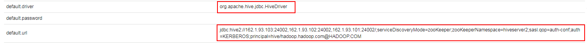
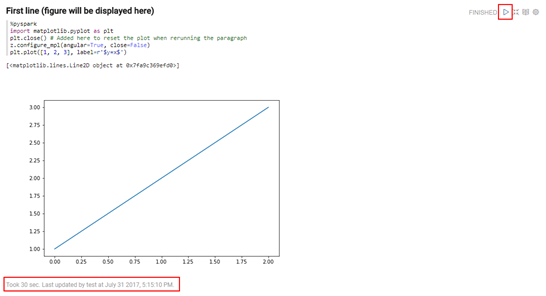

# Zeppelin对接FusionInsight HD

## 适用场景

> Zeppelin-0.7.2  <--> FusionInsight V100R002C60U20

## 安装Zepplin

### 操作场景

安装Zepplin0.7.2

### 前提条件

- 已完成FusionInsight HD客户端的安装。

### 操作步骤

  - 将软件包zeppelin-0.7.2-bin-all.tgz上传至/opt目录下，解压生成zeppelin-0.7.2-bin-all目录。
    ```
     tar -zxvf zeppelin-0.7.2-bin-all.tgz
    ```

  - 启动和停止Zepplin
    ```
    bin/zeppelin-daemon.sh start
    bin/zeppelin-daemon.sh stop
    ```

    

- 配置Zeppelin环境变量，在profile文件中加入如下变量
  ```
  vi /etc/profile
  export ZEPPELIN_HOME=/opt/zeppelin-0.7.2-bin-all
  export PATH=$ZEPPELIN_HOME/bin:$PATH
  ```

- 编辑zeppelin-env.sh文件，位置/opt/zeppelin-0.7.2-bin-all/conf
  ```
  cd /opt/zeppelin-0.7.2-bin-all/conf/
  cp zeppelin-env.sh.template zeppelin-env.sh
  vi zeppelin-env.sh
  ```

  加入如下内容：
  ```
  export JAVA_HOME=/opt/jdk1.7.0_51/
  ```

  编辑zeppelin-site.xml文件，位置/opt/zeppelin-0.7.2-bin-all/conf/
  ```
  cp zeppelin-site.xml.template zeppelin-site.xml
  ```

  将zeppelin-site.xml中端口8080替换成18081（可自定义，也可以不改）
  ```
  sed -i 's/8080/18081/' zeppelin-site.xml
  ```
  

- 运行zeppelin
  ```
  cd /opt/zeppelin-0.7.2-bin-all/
  ./bin/zeppelin-daemon.sh start
  ```

- 在浏览器中输入地址zeppelin_ip:18081登陆，zeppelin_ip为安装zeppelin的虚拟机IP。

  

- 根据产品文档创建用户test，并赋予足够权限，下载用户test的keytab文件user.keytab，上传至/opt/目录下。

- 编辑zeppelin-site.xml文件，将zeppelin.anonymous.allowed参数的true修改为false。

  

- 编辑shiro.ini文件，位置/opt/zeppelin-0.7.2-bin-all/conf/shiro.ini
  ```
  cp shiro.ini.template shiro.ini
  vi shiro.ini
  ```

  [urls]authc表示对任何url访问都需要验证

  

  [users]下增加用户test，密码Huawei@123

  

- 重启zeppelin。
  ```
  cd /opt/zeppelin-0.7.2-bin-all/
  ./bin/zeppelin-daemon.sh restart
  ```
- 使用test用户登陆Zeppelin

## Zeppelin连接Hive

### 操作场景

Zepplin中配置JDBC解析器，对接Hive的JDBC接口。

### 前提条件

- 已经完成Zeppelin 0.7.2的安装；

- 已完成FusionInsight HD客户端的安装，包含Hive组件。

### 操作步骤

- 将`/opt/hadoopclient/Hive/Beeline/lib/`下的jar包拷贝至`/opt/zeppelin-0.7.2-bin-all/ interpreter/jdbc/`目录下。

- 将从新拷贝过来的jar包的属主和权限修改为和/opt/zeppelin-0.7.2-bin-all/ interpreter/jdbc/下原有的jar包相同
  ```
  chown 501:wheel *.jar
  chmod 644 *.jar
  ```

- 编辑zeppelin-env.sh文件，位置/opt/zeppelin-0.7.2-bin-all/conf，加入以下三个配置内容
  ```
  export JAVA_HOME=/opt/hadoopclient/JDK/jdk
  export ZEPPELIN_INTP_JAVA_OPTS="-Djava.security.krb5.conf=/etc/krb5.conf -Djava.security.auth.login.config=/opt/zeppelin-0.7.2-bin-all/conf/jaas.conf -Dzookeeper.server.principal=zookeeper/hadoop.hadoop.com -Dzookeeper.request.timeout=120000"
  export HADOOP_CONF_DIR=/opt/hadoopclient/HDFS/hadoop/etc/hadoop
  ```

- 从FusionInsight客户端下载用户test的user.keytab和krb5.conf文件，将krb5.conf文件放在/etc/下
- 使用`vi /opt/zeppelin-0.7.2-bin-all/conf/`新建hbase的认证文件jaas.conf，内容如下:
  ```
  Client {
  com.sun.security.auth.module.Krb5LoginModule required
  useKeyTab=true
  keyTab="/opt/user.keytab"
  principal="test"
  useTicketCache=false
  storeKey=true
  debug=true;
  };
  ```
  > 其中用户为在FusionInsight Manager中创建的test用户，将test的keytab文件user.key放在/opt/目录下

- 登陆Zepplin，选择右上角菜单中的 Interpreter

    

- 选择JDBC，点击 **edit** 编辑，修改default.driver和default.url参数，点击 **save** 保存
  ```
  default.driver：org.apache.hive.jdbc.HiveDriver
  default.url：jdbc:hive2://162.1.93.103:24002,162.1.93.102:24002,162.1.93.101:24002/;serviceDiscoveryMode=zooKeeper;zooKeeperNamespace=hiveserver2;sasl.qop=auth-conf;auth=KERBEROS;principal=hive/hadoop.hadoop.com@HADOOP.COM
  ```

  

- 重启zeppelin。
  ```
  source /opt/hadoopclient/bigdata_env
  kinit –kt /opt/user.keytab test
  cd /opt/zeppelin-0.7.2-bin-all/bin
  ./zeppelin-daemon.sh restart
  ```

- 页面选择Notebook -> Create new note

  

- 自定义note名称，例如hive

  

- 编辑note，点击右侧“执行”按钮。
  ```
  %jdbc
  Show tables;
  Select * from workers_info;
  ```

- 查看结果

  


## Zeppelin连接HBase

### 操作场景

Zeppelin中配置Hbase解析器，对接Hbase

### 前提条件

- 已经完成Zeppelin 0.7.2的安装；

- 已完成FusionInsight HD客户端的安装，包含HBase组件。

### 操作步骤

- 将`/opt/hadoopclient/HBase/hbase/lib/`以下的jar包拷贝至`/opt/zeppelin-0.7.2-bin-all/interpreter/hbase/`目录下，overwrite选择n

  

- 在/opt/zeppelin-0.7.2-bin-all/interpreter/hbase/下新建目录zeppelin_hbase_jar
  ```
  mkdir /opt/zeppelin-0.7.2-bin-all/interpreter/hbase/zeppelin_hbase_jar
  ```

- 将/opt/zeppelin-0.7.2-bin-all/interpreter/hbase/下与FusionInsight冲突的38个jar包移动到zeppelin_hbase_jar目录中
  - commons-codec-1.5.jar
  - commons-collections-3.2.1.jar
  - commons-configuration-1.9.jar
  - commons-lang-2.5.jar
  - commons-logging-1.1.1.jar
  - guava-15.0.jar
  - hadoop-annotations-2.6.0.jar
  - hadoop-auth-2.5.1.jar
  - hadoop-client-2.5.1.jar
  - hadoop-common-2.5.1.jar
  - hadoop-hdfs-2.5.1.jar
  - hadoop-mapreduce-client-app-2.5.1.jar
  - hadoop-mapreduce-client-common-2.5.1.jar
  - hadoop-mapreduce-client-core-2.5.1.jar
  - hadoop-mapreduce-client-jobclient-2.5.1.jar
  - hadoop-mapreduce-client-shuffle-2.5.1.jar
  - hadoop-yarn-api-2.6.0.jar
  - hadoop-yarn-client-2.5.1.jar
  - hadoop-yarn-common-2.6.0.jar
  - hadoop-yarn-server-common-2.5.1.jar
  - hbase-annotations-1.0.0.jar
  - hbase-client-1.0.0.jar
  - hbase-common-1.0.0.jar
  - hbase-common-1.0.0-tests.jar
  - hbase-hadoop2-compat-1.0.0.jar
  - hbase-hadoop-compat-1.0.0.jar
  - hbase-prefix-tree-1.0.0.jar
  - hbase-protocol-1.0.0.jar
  - hbase-server-1.0.0.jar
  - httpclient-4.5.1.jar
  - httpcore-4.4.1.jar
  - jettison-1.1.jar
  - netty-3.6.2.Final.jar
  - slf4j-api-1.7.10.jar
  - slf4j-log4j12-1.7.10.jar
  - xmlenc-0.52.jar
  - zookeeper-3.4.6.jar

- 最终/opt/zeppelin-0.7.2-bin-all/interpreter/hbase/有152个jar包

  

- 编辑zeppelin-env.sh文件，位置/opt/zeppelin-0.7.2-bin-all/conf，加入以下三个配置内容
  ```
  export JAVA_HOME=/opt/hadoopclient/JDK/jdk
  export ZEPPELIN_INTP_JAVA_OPTS="-Djava.security.krb5.conf=/etc/krb5.conf -Djava.security.auth.login.config=/opt/zeppelin-0.7.2-bin-all/conf/jaas.conf -Dzookeeper.server.principal=zookeeper/hadoop.hadoop.com -Dzookeeper.request.timeout=120000"
  export HBASE_HOME=/opt/hadoopclient/HBase/hbase
  ```

- 从FusionInsight客户端下载用户test的user.keytab和krb5.conf文件，将krb5.conf文件放在/etc/下
- 使用`vi /opt/zeppelin-0.7.2-bin-all/conf/`新建hbase的认证文件jaas.conf，内容如下:
  ```
  Client {
  com.sun.security.auth.module.Krb5LoginModule required
  useKeyTab=true
  keyTab="/opt/user.keytab"
  principal="test"
  useTicketCache=false
  storeKey=true
  debug=true;
  };
  ```
  > 其中用户为在FusionInsight Manager中创建的test用户，将test的keytab文件user.key放在/opt/目录下

- 登陆Zepplin，选择右上角菜单中的 Interpreter

    

- 选择hbase，点击 **edit** 编辑，修改hbase.home参数，点击 **save** 保存
  ```
  hbase.home：/opt/hadoopclient/HBase/hbase
  ```
  

- 重启zeppelin
  ```
  source /opt/hadoopclient/bigdata_env
  kinit –kt /opt/user.keytab test
  cd /opt/zeppelin-0.7.2-bin-all/bin
  ./zeppelin-daemon.sh restart
  ```

- 页面选择Notebook -> Create new note

  

- 自定义note名称，例如hbase

  


- 编辑note，点击右侧 **执行** 按钮
  ```
  %hbase
  create 'test2', 'cf'
  put 'test2', 'row1', 'cf:a', 'value1'
  ```

  

- 在FusionInsight的客户端下可以看到创建的hbase表test2和数据

  


## Zeppelin连接Spark

### 操作场景

Zepplin中配置Spark解析器

### 前提条件

- 完成Zeppelin0.7.2的安装；
- 已完成FusionInsight HD V100R002C60U20和客户端的安装，包含Spark组件。
- 参考[http://zeppelin.apache.org/docs/latest/interpreter/spark.html](http://zeppelin.apache.org/docs/latest/interpreter/spark.html)

### 操作步骤

- 将`/opt/zeppelin-0.7.2-bin-all/lib/`目录下的原有的相关的jar包删除
  - hadoop-auth-2.6.0.jar
  - hadoop-common-2.6.0.jar
  - scala-compiler-2.11.7.jar
  - scala-library-2.11.7.jar
  - scala-parser-combinators_2.11-1.0.4.jar
  - scala-reflect-2.11.7.jar
  - scala-xml_2.11-1.0.2.jar

- 将`/opt/hadoopclient/Spark/adapter/dev_lib/`下的以下jar包拷贝到`/opt/zeppelin-0.7.2-bin-all/lib/`目录下
  - hadoop-auth-2.7.2.jar
  - hadoop-common-2.7.2.jar
  - scala-compiler-2.10.4.jar
  - scala-library-2.10.4.jar
  - scala-reflect-2.10.4.jar

- 将`/opt/zeppelin-0.7.2-bin-all/lib/`下的jackson的相关jar包删除
  - jackson-annotations-2.5.0.jar
  - jackson-core-2.5.3.jar
  - jackson-core-asl-1.9.13.jar
  - jackson-databind-2.5.3.jar
  - jackson-mapper-asl-1.9.13.jar

- 将`/opt/hadoopclient/Spark/adapter/dev_lib/`下的jackson相关的jar包拷贝到`/opt/zeppelin-0.7.2-bin-all/lib/`下
  - jackson-annotations-2.4.0.jar
  - jackson-core-2.4.4.jar
  - jackson-core-asl-1.9.13.jar
  - jackson-databind-2.4.4.jar
  - jackson-jaxrs-1.9.13.jar
  - jackson-mapper-asl-1.9.13.jar
  - jackson-module-scala_2.10-2.4.4.jar
  - jackson-xc-1.9.13.jar

- 将步骤1和步骤2所有从spark客户端拷贝过来的jar包的属主和权限修改为和`/opt/zeppelin-0.7.2-bin-all/lib/`下原有的jar包相同
  ```
  chown 501:wheel *.jar
  chmod 644 *.jar
  ```

- 编辑zeppelin-env.sh文件，位置`/opt/zeppelin-0.7.2-bin-all/conf`，加入以下内容
  ```
  export MASTER=yarn-client
  export SPARK_HOME=/opt/hadoopclient/Spark/spark
  export HADOOP_CONF_DIR=/opt/hadoopclient/HDFS/hadoop/etc/hadoop
  ```

- 登陆Zepplin，选择右上角菜单中的 Interpreter

  

- 选择Spark，点击 **edit** 编辑，将 Master 参数改为 yarn-client，点击 **save** 保存

  

- 重启zeppelin
  ```
  source /opt/hadoopclient/bigdata_env
  kinit –kt /opt/user.keytab test
  cd /opt/zeppelin-0.7.2-bin-all/bin
  ./zeppelin-daemon.sh restart
  ```

- 执行zeppelin的spark样例代码zeppelin Tutorial -> Basic Features(Spark)
  > 样例代码需要访问Internet上的资源，所以保证zeppelin所在的节点可以联网，检测是否能打开以下链接

  

  

- 执行zeppelin的spark样例代码Zeppelin Tutorial -> Matplotlib (Python • PySpark)

  安装python-matplotlib
  ```
  yum install python-matplotlib
  ```
  安装Anaconda2-4.4
  ```
  wget https://repo.continuum.io/archive/Anaconda2-4.4.0-Linux-x86_64.sh
  sh Anaconda2-4.4.0-Linux-x86_64.sh
  ```
  配置环境变量PATH，将python换成安装Anaconda安装目录中的python
  ```
  export PATH=/root/anaconda2/bin/:$PATH
  ```
  在zeppelin的界面中，选择右上角的 Interpreter

  选择Spark，点击 **edit** 编辑，将 zeppelin.pyspark.python 参数改为Anaconda安装目录中的python，点击 **save** 保存

  

  执行zeppelin的pyspark样例代码Zeppelin Tutorial -> Matplotlib

  

## Zeppelin连接SparkR

### 操作场景

Zepplin中配置Spark解析器，连接SparkR

### 前提条件

- 完成Zeppelin0.7.2的安装；
- 已完成FusionInsight HD V100R002C60U20和客户端的安装，包含Spark组件。
- 参考[http://zeppelin.apache.org/docs/latest/interpreter/spark.html](http://zeppelin.apache.org/docs/latest/interpreter/spark.html)

### 操作步骤

- 安装R，通过yum源安装所需rpm包
  ```
  yum install gcc-c++ gcc-gfortran zlib zlib-devel bzip2 bzip2-devel perl openssl-devel
  yum install xz-devel.x86_64 pcre pcre-devel libcurl libcurl-devel readline-devel libXt-devel
  ```

- 安装curl-7.47.1（安装R需要curl版本高于7.22.0）
  ```
    wget --no-check-certificate https://curl.haxx.se/download/curl-7.47.1.tar.gz
    tar -zxvf curl-7.47.1.tar.gz
    cd curl-7.47.1
    ./configure
    make
    make install
  ```

- 下载并解压R-3.4.1
  ```
  cd /root
  wget http://cran.stat.nus.edu.sg/src/base/R-3/R-3.4.1.tar.gz
  tar -zxvf R-3.4.1.tar.gz
  ```

- 编译安装R-3.4.1
  ```
  mkdir /opt/R-3.4.1
  ./configure --prefix /opt/R-3.4.1 --enable-R-shlib --with-x --with-cairo --with-libpng
  make
  make install
  ```
  > configure的过程中，可能会有各种不同的错误，针对报错信息网上搜索解决方法，另外make的过程耗时较多

- 配置R的环境变量: `vi /etc/profile` 在文件最后一行增加 `export PATH=/opt/R-3.4.1/bin:$PATH`
- 检查R是否可用
  ```
  source /etc/profile
  ./R
  ```
- 正常启动如下图所示

  

- FusionInsight客户端下测试是否可以使用sparkR
  ```
  source /opt/hadoopclient/bigdata_env
  kinit test
  sparkR
  ```
- 正常启动如下图所示

  

- 参考[http://zeppelin.apache.org/docs/0.7.2/interpreter/r.html#using-the-r-interpreter ](http://zeppelin.apache.org/docs/0.7.2/interpreter/r.html#using-the-r-interpreter )在R的命令行中安装sparkR样例需要的R的libraries

  ```
  install.packages('devtools')
  install.packages('knitr')
  install.packages('ggplot2')
  install.packages(c('devtools','mplot','googleVis'))
  install.packages('data.table')
  install.packages('sqldf')
  install.packages('glmnet')
  install.packages('pROC')
  install.packages('caret')
  install.packages('sqldf')
  install.packages('wordcloud')
  ```
- 在zeppelin的界面中，选择右上角的 Interpreter
- 选择Spark，点击 **edit** 编辑，将 zeppelin.R.cmd 参数改为R的启动文件，点击 **save** 保存

  

- 重启zeppelin
  ```
  cd /opt/zeppelin-0.7.2-bin-all/bin/
  ./zeppelin-daemon.sh restart
  ```

- 在Zeppelin中执行Zeppelin Tutorial -> R (SparkR)样例

  

## FAQ

- 连接hbase出现AuthFialed for /hwbackup/hbase

  

  原因：zeppelin的原理hbase的jar包与从FusionInsight客户端下拷贝过来的jar冲突。

  解决：将zeppelin中原有的重名jar包移走或删除，全部用FusionInsight客户端下的相关jar包。

- Zeppelin连接spark是报如下NoSuchMethodError

  

  原因：jar包冲突

  解决：删除`/opt/zeppelin-0.7.2-bin-all/lib/`下原有jar包scala-reflect-2.11.7.jar，替换为FusionInsight客户端下的jar包，重启zeppelin

- Zeppelin执行Spark样例代码时报GC overhead limit exceeded

  

  原因：内存不够

  解决：安装Zeppelin的节点的内存需要16G以上

- 执行zeppelin的样例代码Zeppelin Tutorial/Matplotlib (Python PySpark)报如下错误

  

  原因：python版本问题

  解决：安装Anaconda2-4.4
