# FineBI对接FusionInsight

## 适用场景

> FineBI 5.1 <--> FusionInsight HD 6.5 (Hive)

> FineBI 5.1 <--> FusionInsight MRS 8.0 (Hive/hetu)

## 安装FineBI

- 安装FineBI, 以路径`C:\soft\fineBI\FineBI5.1`为例

## 配置JDBC接口对接Hive

- 将对接集群（版本6.5.1）的认证文件下载到`C:\651client`文件夹下，包括user.keytab和krb5.conf

  说明：如果是对接mrs 8.0版本，根据上步把对应客户端，认证文件下载到本地

- 在FineBI的bin目录下找到配置文件finebi.vmoptions

  

  并在该文件中添加配置：

  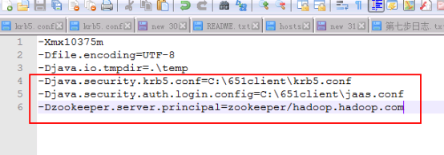

  jaas.conf文件内容为：

  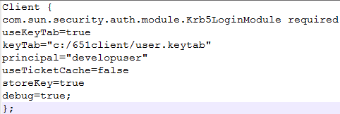


- 下载FI HD6.5.1的客户端到本地，补全jar包，找到Hive\Beeline\lib路径可以看到相关的jar包

  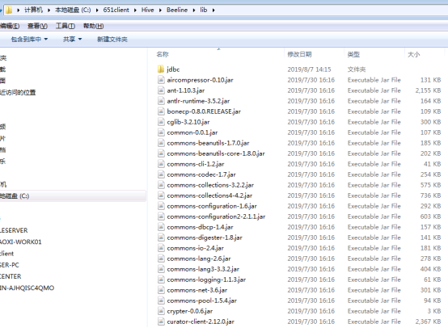

  说明： 如果是mrs 8.0版本，则需要的驱动jar包为 客户端路径\Hive\jdbc下所有jar包加上如下额外三个jar包（如果缺少的话）
  ```
  commons-lang-2.6.jar
  zookeeper-jute-3.5.6-hw-ei-302002.jar
  commons-collections-3.2.2.jar
  ```

- 找到并进入FineBI相关依赖路径，具体为`C:\soft\fineBI\FineBI5.1\webapps\webroot\WEB-INF\lib`, 需要做以下三个操作
  1.  找到jar包fine-bi-engine-third-5.1.jar，右键使用winRAR打开

    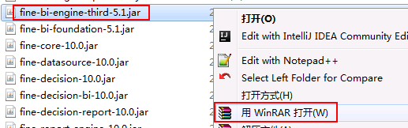

    进入org/apache目录，找到并删除zookeeper文件夹

    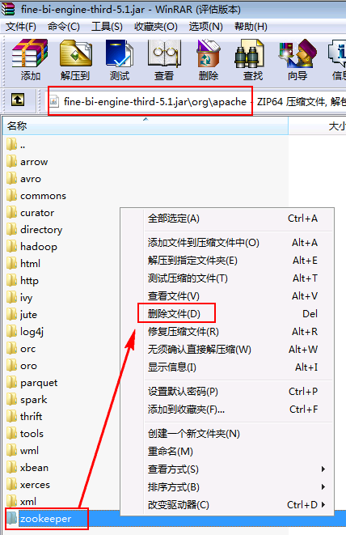

  2.  删除FineBI自带的zookeeper-3.4.6.jar

    

  3.  将上一步集群客户端Hive\Beeline\lib路径下所有的jar包拷贝到当前文件夹（`C:\soft\fineBI\FineBI5.1\webapps\webroot\WEB-INF\lib`）

- 找到FineBI路径`C:\soft\fineBI\FineBI5.1\webapps\webroot\WEB-INF\resources`,将认证相关文件user.keytab, krb5.conf, krb5.ini拷贝到改目录下

- 启动FineBI，找到管理系统 -> 数据连接 -> 新建数据连接 -> 更多数据连接 找到fusioninsight hd 选中点确定

  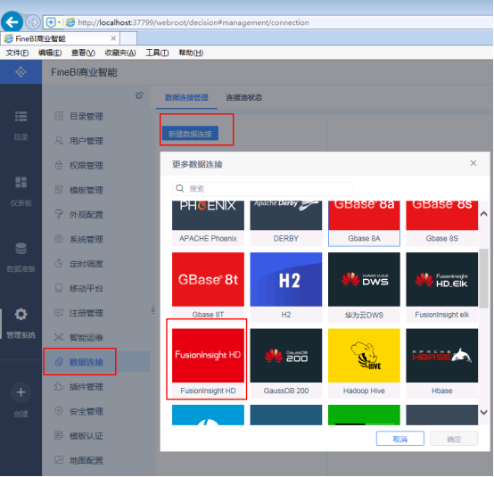

- （hd 6.5对接）参考下图配置连接参数

  URL: `jdbc:hive2://172.16.4.21:24002,172.16.4.22:24002,172.16.4.23:24002/;serviceDiscoveryMode=zooKeeper;zooKeeperNamespace=hiveserver2;sasl.qop=auth-conf;auth=KERBEROS;principal=hive/hadoop.hadoop.com@HADOOP.COM;user.principal=developuser;user.keytab=C:/651client/user.keytab`

  

  需要注意的是user.principal和user.keytab需要同实际情况匹配

  点击测试连接测试

  

- （mrs 8.0对接）参考下图配置连接参数

  

  ```
  1： ,172.16.10.132:24002,172.16.10.133:24002/default;serviceDiscoveryMode=zooKeeper;zooKeeperNamespace=hiveserver2;sasl.qop=auth-conf;auth=KERBEROS;principal=hive/hadoop.hadoop.com@HADOOP.COM;

  2： 172.16.10.131
  3： 24002
  4： jdbc:hive2://172.16.10.131:24002,172.16.10.132:24002,172.16.10.133:24002/default;serviceDiscoveryMode=zooKeeper;zooKeeperNamespace=hiveserver2;sasl.qop=auth-conf;auth=KERBEROS;principal=hive/hadoop.hadoop.com@HADOOP.COM;
  ```

  说明（重要）： 配置1 + 配置2 + 配置3 会生成配置4的连接url,要时刻保持着4个配置的正确性，否则对接失败

  点击测试连接测试：

  

- 点击创建 -> 添加添加数据库表

  

  选择一张表，如果已经选择配置过则为灰色,选择需要导入的数据列表路径

  

  在数据准备->对应的数据列表路径中找到之前配置好的表test

  


## 配置JDBC接口对接Hetu

- 参考上述hive配置步骤完成基础配置

- 准备hetu对接配置文件，比如

  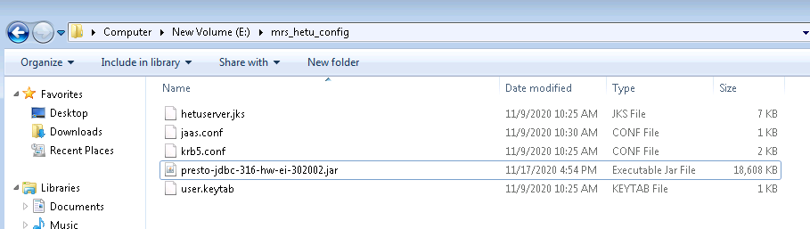

- 在FineBI的bin目录下找到配置文件finebi.vmoptions

  

- 找到并进入FineBI相关依赖路径，具体为`C:\soft\fineBI\FineBI5.1\webapps\webroot\WEB-INF\lib`，将hetu驱动Jar包 presto-jdbc-316-hw-ei-302002.jar 导入到该路径下

  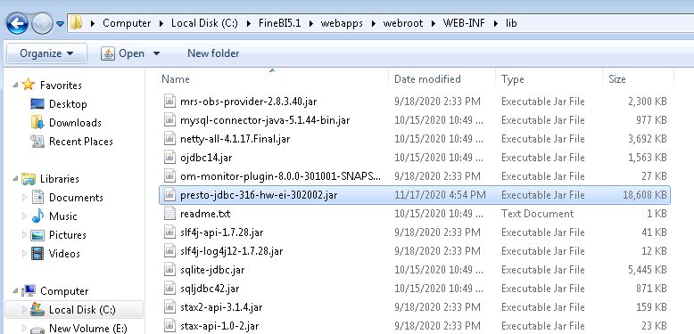

- 启动FineBI,选择other jdbc做如下配置

  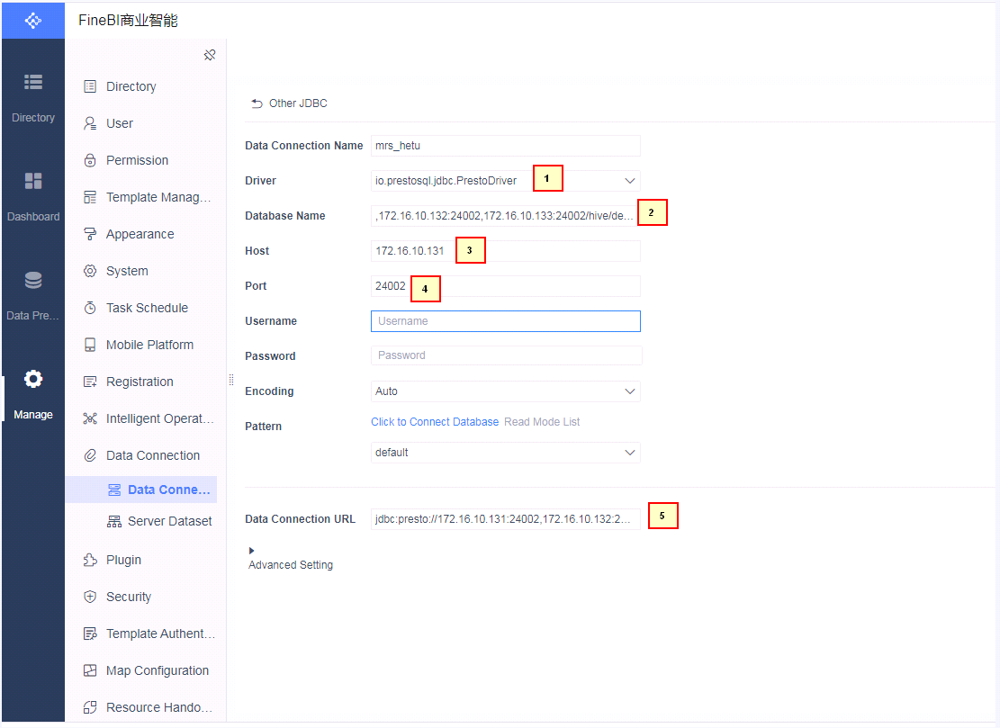

  ```
  1: io.prestosql.jdbc.PrestoDriver
  2: ,172.16.10.132:24002,172.16.10.133:24002/hive/default?serviceDiscoveryMode=zooKeeper&zooKeeperNamespace=hsbroker&deploymentMode=on_yarn&user=developuser&SSL=true&SSLTrustStorePath=E:/mrs_hetu_config/hetuserver.jks&KerberosConfigPath=E:/mrs_hetu_config/krb5.conf&KerberosPrincipal=developuser&KerberosKeytabPath=E:/mrs_hetu_config/user.keytab&KerberosRemoteServiceName=HTTP&KerberosServicePrincipalPattern=%24%7BSERVICE%7D%40%24%7BHOST%7D
  3: 172.16.10.131
  4: 24002
  5: jdbc:presto://172.16.10.131:24002,172.16.10.132:24002,172.16.10.133:24002/hive/default?serviceDiscoveryMode=zooKeeper&zooKeeperNamespace=hsbroker&deploymentMode=on_yarn&user=developuser&SSL=true&SSLTrustStorePath=E:/mrs_hetu_config/hetuserver.jks&KerberosConfigPath=E:/mrs_hetu_config/krb5.conf&KerberosPrincipal=developuser&KerberosKeytabPath=E:/mrs_hetu_config/user.keytab&KerberosRemoteServiceName=HTTP&KerberosServicePrincipalPattern=%24%7BSERVICE%7D%40%24%7BHOST%7D
  ```

  说明（重要）： 配置2 + 配置3 + 配置4 会生成配置5的连接url,要时刻保持着4个配置的正确性，否则对接失败

- 测试连接：

  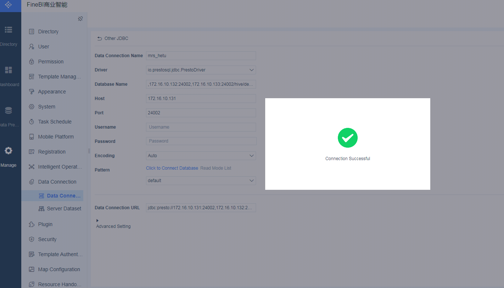

- 查询结果：

  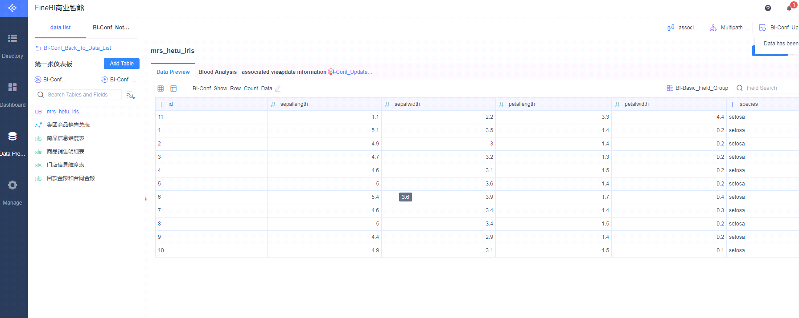
