# MicroStrategy对接FusionInsight

## 适用场景

> MicroStrategy 11.1.4 <--> FusionInsight HD 6.5 (Hive/Spark2x)

> MicroStrategy 11.1.4 <--> FusionInsight MRS 8.0 (Hive/Spark2x)

## 简介

MicroStrategy Desktop是一款功能强大的数据发现工具。使用MicroStrategy Desktop来创建自定义的交互式达析报告，用于探索您的业务数据。您可从许多不同的来源导入业务数据，包括本地文件、数据库等。

本文档主要描述在Window操作系统，MicroStrategy Desktop通过Fiber方式对接FusionInsight HD的Hive、Spark2x组件。

## 准备工作

* 登录FusionInsight Manager创建一个“人机”用户，例如：developuser，具体请参见FusionInsight HD产品文档的`管理员指南->系统设置->权限设置->用户管理->创建用户`章节。给developuser用户授予所有访问权限，包含但不限于Hive、Spark2x。

* 已完成FusionInsight HD客户端安装，具体请参见FusionInsight HD产品文档的`应用开发指南->安全模式->安全认证->配置客户端文件`章节。

* （重要）完成MIT KERBEROS认证，具体参见usionInsight HD产品文档的`应用开发指南->安全模式->Hive开发指南->环境准备->配置ODBC样例工程->Windows环境`章节。

* 已将集群的节点主机名与IP的映射关系加入到windows的hosts文件中`C:\Windows\System32\drivers\etc\hosts`。

* 客户端机器的时间与FusionInsight HD集群的时间要保持一致，时间差小于5分钟。

* Windows上已经安装好jdk1.8或者以上版本，并完成jdk环境变量配置。

* Hive数据库已存在表student，可使用beeline客户端创建：

  **示例如下：**

  ```
  CREATE TABLE IF NOT EXISTS student(id INT, first_name STRING, last_name STRING, subject_id INT, score FLOAT);
  INSERT INTO student VALUES (1,'Tom','Zhang',1,80);
  INSERT INTO student VALUES (2,'Sandy','Li',2,75);
  INSERT INTO student VALUES (3,'Benny','Chow',3,76);
  INSERT INTO student VALUES (4,'Tina','Wang',1,60);
  INSERT INTO student VALUES (5,'Tracy','Zhang',1,80);
  INSERT INTO student VALUES (6,'Andy','Li',2,79);
  INSERT INTO student VALUES (7,'Manson','Chow',3,86);
  INSERT INTO student VALUES (8,'Aurora','Wang',1,90);
  ```

* 本地已存在Subject.xlsx，内容如下所示：

  

## Fiber认证方式配置

### 操作场景

Fiber的安全认证有kinit和keytab两种方式。本文使用keytab方式。具体参数配置说明可参考FusionInsight HD产品文档的`业务操作指南->统一SQL(Fiber)->客户端配置`章节。

### 前提条件

* 已完成准备工作。

* 将FusionInsight HD客户端的Fiber、Hive、Spark2x客户端文件夹，拷贝至本地新建目录`C:\ecotesting`。假设FusionInsight HD客户端安装于`/opt/hadoopclient`目录，则：

  * 将`/opt/hadoopclient/Fiber`拷贝至本地`C:\ecotesting`目录。

  * 将`/opt/hadoopclient/Hive`拷贝至本地`C:\ecotesting\Fiber`目录。

  * 将`/opt/hadoopclient/Spark2x`拷贝至本地`C:\ecotesting\Fiber`目录。

  

* 登录FusionInsight Manager的`系统->用户->更多（developuser）->下载认证凭证`，下载developuser对应的认证凭证。将用户的 **krb5.conf** 和 **user.keytab** 文件拷贝到`C:\ecotesting\Fiber\conf`目录下。

### 操作步骤 ~ keytab认证方式配置

- 在`C:\ecotesting\Fiber\conf`目录下新建 **jaas.conf** 文件，示例如下：
  ```
  Client {
    com.sun.security.auth.module.Krb5LoginModule required
    useKeyTab=true
    keyTab="C:\\ecotesting\\Fiber\\conf\\user.keytab"
    principal="developuser"
    useTicketCache=false
    storeKey=true
    debug=true;
  };
  ```

- 修改配置文件`C:\ecotesting\Fiber\conf\fiber.xml`。

  **Hive的JDBC配置示例：**

  ```
  <jdbc>
    <identify>hive</identify>
    <describe>hive jdbc configuration</describe>
    <driverClass>org.apache.hive.jdbc.HiveDriver</driverClass>
    <securityClass>com.huawei.fiber.DefaultAuthenticationCallback</securityClass>     
    <classPath>C:\\ecotesting\\Fiber\\Hive\\config;C:\\ecotesting\\Fiber\\Hive\\Beeline\\lib;C:\\ecotesting\\Fiber\\Hive\\Beeline\\conf</classPath>
    <jdbcUrl>jdbc:hive2://172.16.4.21:24002,172.16.4.22:24002,172.16.4.23:24002/;serviceDiscoveryMode=zooKeeper;zooKeeperNamespace=hiveserver2;sasl.qop=auth-conf;auth=KERBEROS;principal=hive/hadoop.hadoop.com@HADOOP.COM;user.principal=developuser;user.keytab=C:/ecotesting/Fiber/conf/user.keytab</jdbcUrl>
     <properties>
      <property>
        <name>java.security.krb5.conf</name>
        <value>C:\\ecotesting\\Fiber\\conf\\krb5.conf</value>
      </property>
      <property>
        <name>java.security.auth.login.config</name>
        <value>C:\\ecotesting\\Fiber\\conf\\jaas.conf</value>
      </property>
      <property>
        <name>zookeeper.server.principal</name>
        <value>zookeeper/hadoop.hadoop.com</value>
      </property>
    </properties>
  </jdbc>
  ```

  **Spark2x的JDBC配置示例：**
  ```
  <jdbc>
    <identify>Spark2x</identify>
    <describe>Spark2x jdbc configuration</describe>
    <driverClass>org.apache.hive.jdbc.HiveDriver</driverClass>
    <securityClass>com.huawei.fiber.DefaultAuthenticationCallback</securityClass>
    <classPath>C:\\ecotesting\\Fiber\\Spark2x\\spark\\conf;C:\\ecotesting\\Fiber\\Spark2x\\spark\\jars</classPath>
    <jdbcUrl>jdbc:hive2://172.16.4.21:24002,172.16.4.22:24002,172.16.4.23:24002/;serviceDiscoveryMode=zooKeeper;zooKeeperNamespace=sparkthriftserver2x;saslQop=auth-conf;auth=KERBEROS;principal=spark2x/hadoop.hadoop.com@HADOOP.COM;user.principal=developuser;user.keytab=C:/ecotesting/Fiber/conf/user.keytab</jdbcUrl>
    <properties>
  	<property>
  	  <name>java.security.krb5.conf</name>
  	  <value>C:\\ecotesting\\Fiber\\conf\\krb5.conf</value>
  	</property>
  	<property>
  	  <name>java.security.auth.login.config</name>
  	  <value>C:\\ecotesting\\Fiber\\conf\\jaas.conf</value>
  	</property>
  	<property>
  	  <name>zookeeper.server.principal</name>
  	  <value>zookeeper/hadoop.hadoop.com</value>
  	</property>
    </properties>
  </jdbc>
  ```

## MicroStrategy Desktop对接Fiber

### 操作场景

MicroStrategy Desktop通过Fiber方式对接FusionInsight的Hive、Spark2x组件。

### 前提条件

* 从<https://www.microstrategy.com/us/get-started/desktop>下载MicroStrategy Desktop软件，并完成安装。

### 操作步骤

* 打开MicroStrategy Desktop界面，点击 **新达析报告**。

  

* 点击“达析报告”界面的菜单栏 **文件->保存** 将报告保存为 **FusionInsight.mstr**。

  

* 点击达析报告“FusionInsight”界面的 **新数据** 按钮添加数据。

  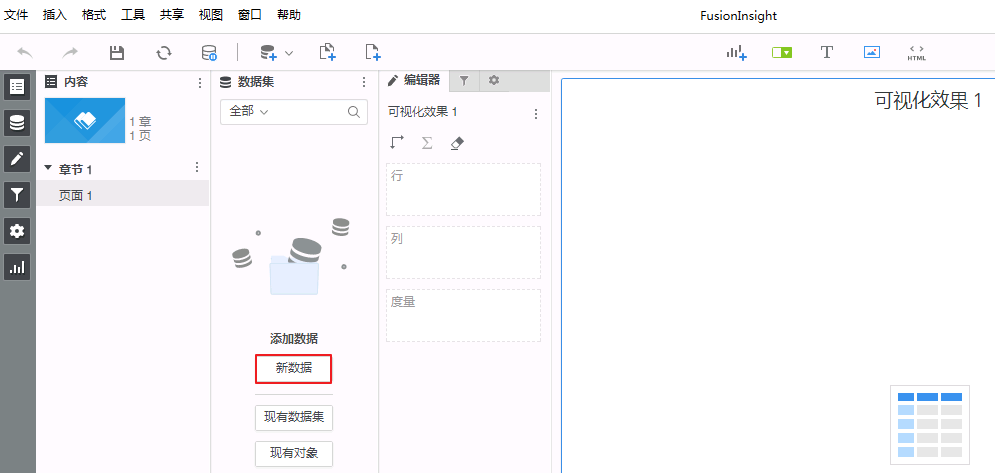

* 在数据源中选择 **数据库**。

  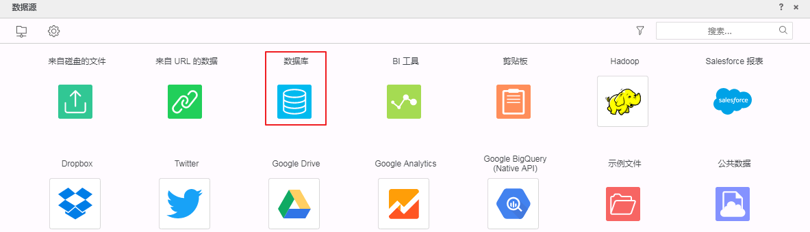

* 导入选项选择 **键入查询**，点击 **下一步**。

  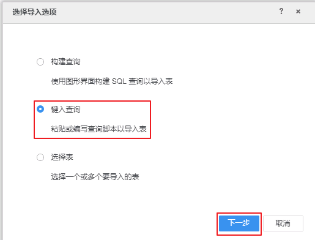

* 点击“+”按钮增加数据源。

  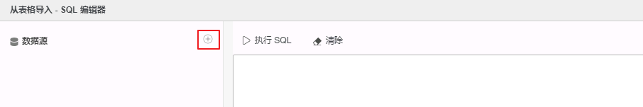

* 勾选 **无需DSN的数据源**，点击 **显示连接字符串** 并 **编辑连接字符串**。填写连接信息后点击 **保存**。

  **Hive的连接信息示例如下：**

  ```
  数 据 库：Generic
  版    本：Generic DBMS
  驱动程序：默认，不影响连接
  连 接 串：JDBC;DRIVER={com.huawei.fiber.FiberDriver};MSTR_JDBC_JAR_FOLDER=C:\ecotesting\Fiber\lib;URL={jdbc:fiber://fiberconfig=C:\ecotesting\Fiber\conf\fiber.xml;defaultDriver=hive};
  用     户：不能为空，但是不用于连接验证，随意写，例如“A”
  密     码：不能为空，但是不用于连接验证，随意写，例如“test”
  数据源名称：fi_fiber_hive_jdbc，可自定义
  ```

  **Spark2x的连接信息示例如下：**

  ```
  数 据 库：Generic
  版    本：Generic DBMS
  驱动程序：默认，不影响连接
  连 接 串：JDBC;DRIVER={com.huawei.fiber.FiberDriver};MSTR_JDBC_JAR_FOLDER=C:\ecotesting\Fiber\lib;URL={jdbc:fiber://fiberconfig=C:\ecotesting\Fiber\conf\fiber.xml;defaultDriver=spark2x};
  用     户：不能为空，但是不用于连接验证，随意写，例如“A”
  密     码：不能为空，但是不用于连接验证，随意写，例如“test”
  数据源名称：fi_fiber_spark2x_jdbc，可自定义
  ```

  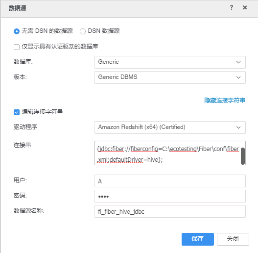

  >说明：
  >
  > * 上面截图显示的是对接Hive的连接信息。
  >
  > * 连接信息中，主要是“连接串”信息影响是否能连接成功，其他信息不影响。
  >
  > * Hive、Spark2x连接信息的唯一区别在于defaultDrive的取值。

* **以下指导步骤以Hive为例，Spark2x类似。**

* 单击数据源 **fi_fiber_hive_jdbc**，连接成功则返回FusionInsight的所有命名空间。

  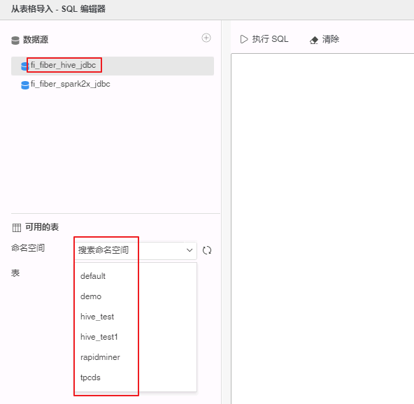

* 选择表Student存在的命名空间 **default**，双击表 **Student**，点击 **完成**。

  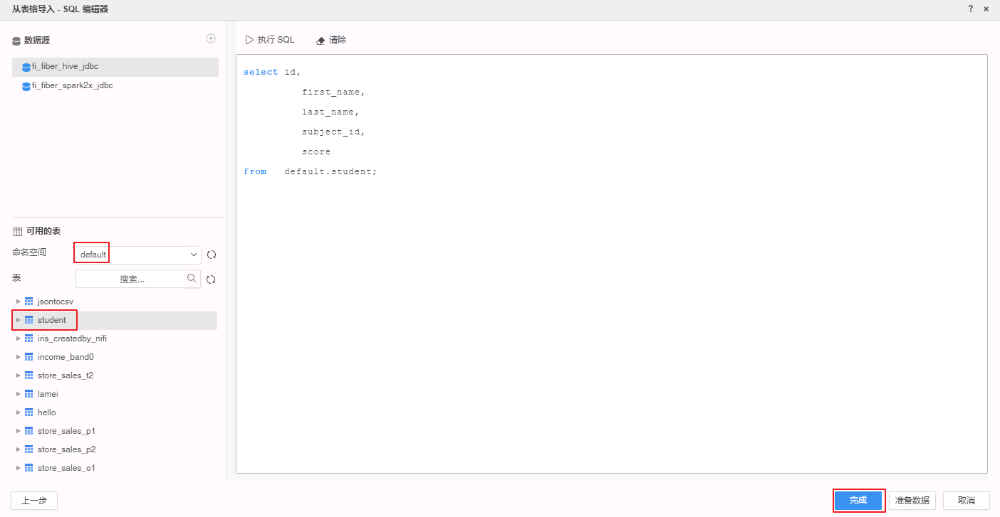

* 选择 **以内存中数据集的形式导入**。

  

* 右击 **自定义查询**，选择 **重命名** 为 “Student_Hive”。从Spark2x导入的查询重命名为 “Student_Spark2x”。

  

  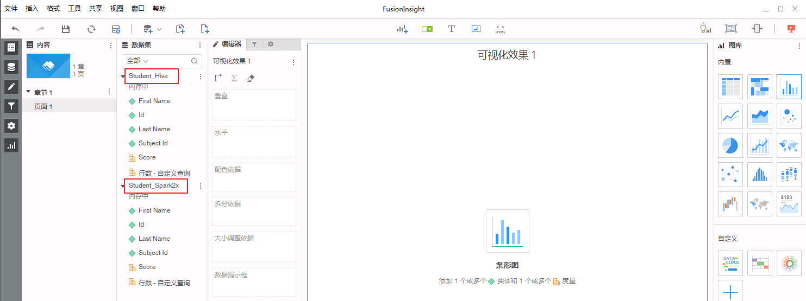

## MicroStrategy Desktop编辑数据

### 操作场景

使用MicroStrategy Desktop合并从Hive/Spark、Excel导入的多个数据源，输出报表。以下以合并Hive和Excel数据源为例，统计Student各个科目成绩的平均值、最小值、最大值。合并Spark2x和Excel数据源操作类似。

### 前提条件

* MicroStrategy Desktop成功对接FusionInsight HD的Hive、Spark2x组件并已从Hive或者Sparkx导入表“Student”的数据到MicroStrategy Desktop。

### 操作步骤

* 导入Excel数据源。

  * 点击达析报告“FusionInsight”界面的 **添加数据** 按钮选择 **新建数据**。在数据源中选择 **来自磁盘的文件**。

    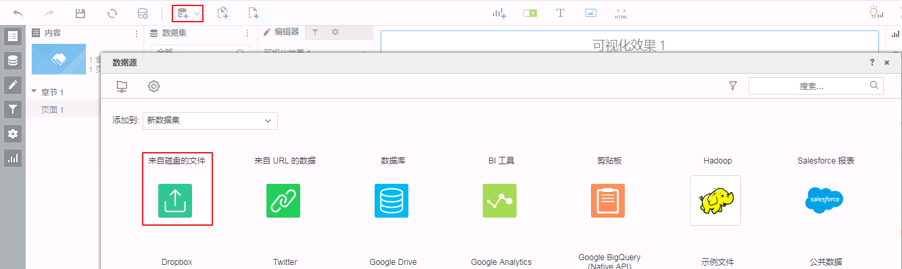

  * 点击 **选择文件** 选择本地文件 **Subject.xlsx**，点击 **完成**。

    

    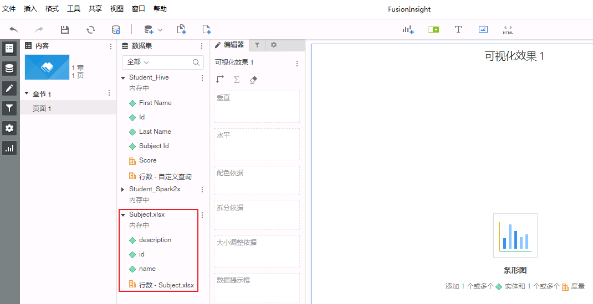

* 建立两个数据源的链接。“Student_Hive”的“Subject_id”链接到“Subject.xlsx”的“id”。

  * 右键“Student_Hive”的 **Subject_id** 选择 **链接到其他数据集**。

    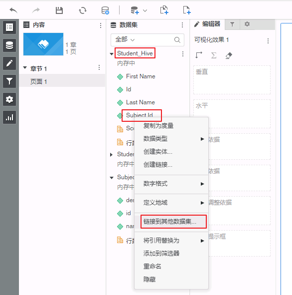

  * 选择“Subject.xlsx”的 **id**，点击 **确定**。

    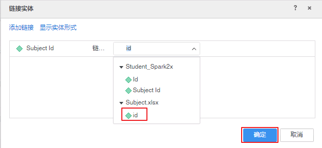

    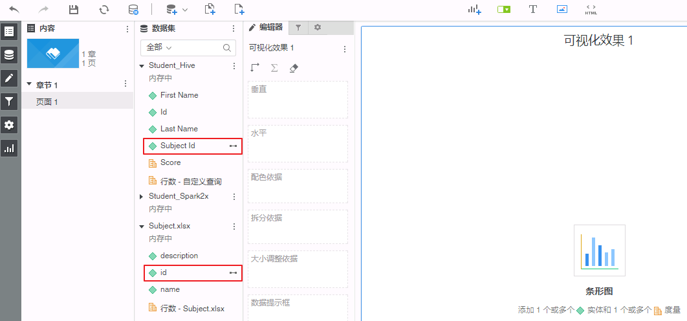

* 在右侧“图库”中选择 **条形图**，将“Student_Hive”的 **Score** 拖曳至“垂直”框中，将“Subject.xlsx”的 **name** 拖曳至“水平”框中。右键“垂直”框中的 **Score** 分别选择 **聚合依据->平均**、**聚合依据->最小**、**聚合依据->最大**。则图表的可视化效果如下图所示:

  

## FAQ

  * **安装完MicroStrategy Desktop后，提示使用前需要安装.NET。**

    **【问题描述】**

    安装完MicroStrategy Desktop后，提示“The installation process is complete. However, you need to install .NET before running Desktop on this machine. Click here for a step by step guide.”。

    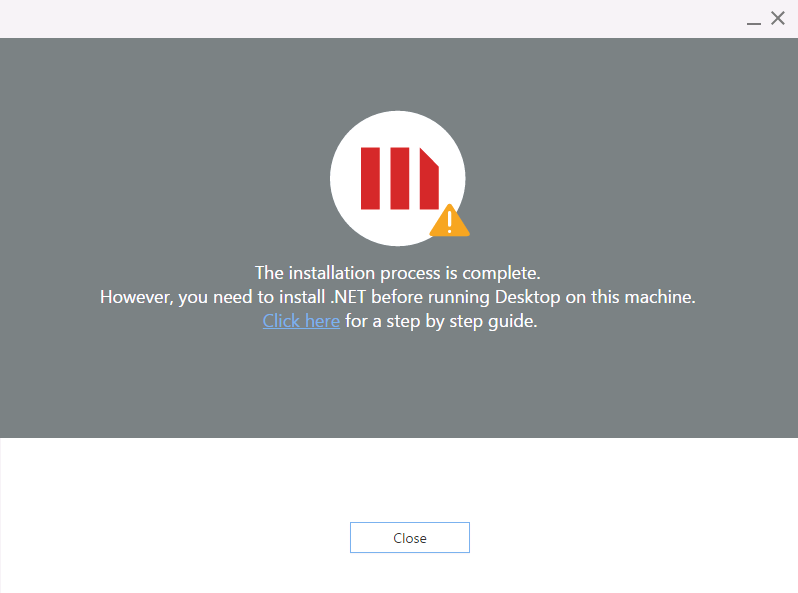

    如果没安装.NET直接启动MicroStrategy Desktop则会返回“This application requires one of the following versions of the .NET Framework”

    

    **【解决方法】**

    * 点击提示信息的 **Click here** 跳转至“Microsoft .NET Framework 4.7”的下载界面<https://www.microsoft.com/en-us/download/details.aspx?id=55167>，点击 **Download** 按钮下载 **NDP47-KB3186497-x86-x64-AllOS-ENU.exe**。

      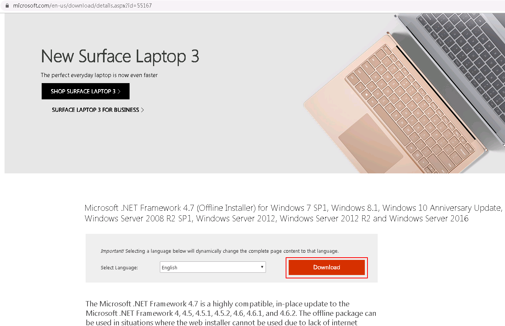

    * 安装 **NDP47-KB3186497-x86-x64-AllOS-ENU.exe**。安装的过程中，如果提示“Setup cannot continue because a dependent update needs to be installed before you can install this product on Windows 7, Windows Server 2008 R2, Windows 8 or Windows Server 2012.”

      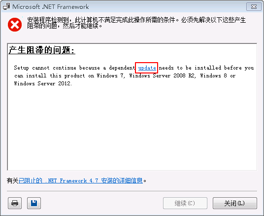

    * 点击提示信息中的 **update** 跳转至<https://support.microsoft.com/zh-cn/help/4020302/the-net-framework-4-7-installation-is-blocked-on-windows-7-windows-ser>，在该页面的“解决方法”中，根据操作系统的版本下载并安装对应版本的d3dcompiler更新。

      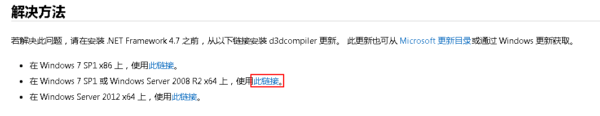

    * Window 7 64位操作系统下载并安装 **Windows6.1-KB4019990-x64.msu** 后，再重新安装 **NDP47-KB3186497-x86-x64-AllOS-ENU.exe**。之后则可以成功启动MicroStrategy Desktop。
