# Oracle BIEE对接FusionInsight

## 适用场景

> Oracle BIEE 11g <--> FusionInsight HD V100R002C60U20 (Hive/SparkSQL)
>
> Oracle BIEE 11g <--> FusionInsight HD V100R002C70SPC200 (Hive/SparkSQL/ELK/GaussDB)
>
> Oracle BIEE 12c <--> FusionInsight HD V100R002C60U20 (Hive/SparkSQL)
>
> Oracle BIEE 12c <--> FusionInsight HD V100R002C70SPC200 (Hive/SparkSQL/ELK/GaussDB)
>
> Oracle BIEE 12c <--> FusionInsight HD 6.5 (Hive/SparkSQL/ELK/GaussDB)

## Linux环境安装OBIEE

### 安装OS

* 安装RedHat6.5操作系统，desktop版
* 创建用户oracle

### 安装jdk8

* 获取jdk8安装包，执行安装

  

### 安装Weblogic

* 创建oracle home目录：
  ```shell
  umask 027
  mkdir -p /Oracle/Middleware/Oracle_Home
  chown -R oracle:oracle /Oracle/
  ```

* 上传weblogic安装包，解压

* 以oracle用户登录图形界面

  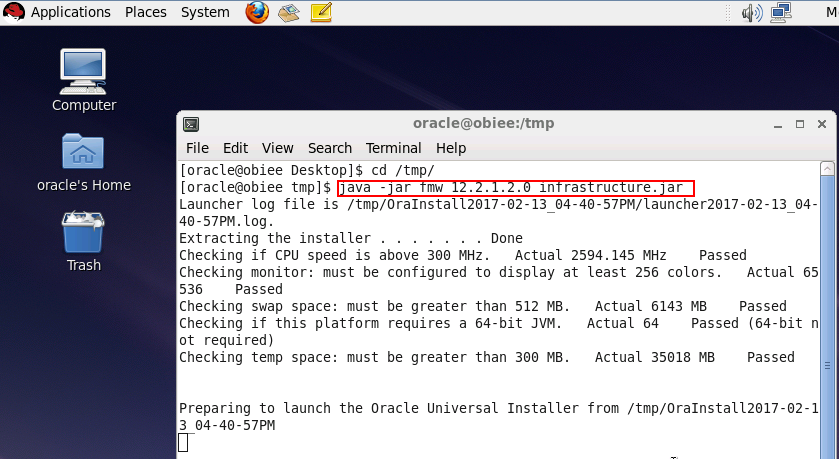

  

  

  

  

### 安装BI Server

* 上传OBIEE安装包，解压
  ```shell
  chmod 755 bi_platform-12.2.1.2.0_linux64.bin
  ```

* 以oracle用户登录图形界面
  ```shell
  ./bi_platform-12.2.1.2.0_linux64.bin
  ```

  

  

  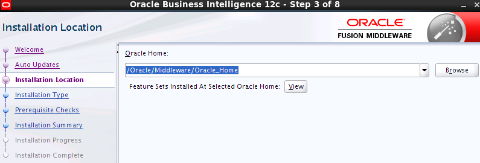

  

  

  

* 补齐lib包
  ```
  yum install -y compat-libcap1 compat-libstdc++-33 libstdc++-devel gcc gcc-c++ libaio-devel
  ```

* 取消当前安装，重新运行安装程序

  

  

### 安装Oracle Database 12c

* 安装数据库软件

  创建数据库安装目录
  ```shell
  mkdir -p /Oracle/database
  chown -R oracle:oracle /Oracle
  ```

  下载Oracle Database 12c安装包，解压得到database文件夹
  ```shell
  chmod -R 755 database/
  cd database/
  su oracle
  ./runInstaller
  ```

  只安装单实例数据库软件

  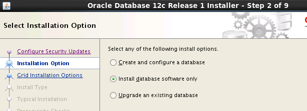

  

  

  

* 创建数据库实例
  ```shell
  cd /Oracle/database/product/12.1.0/dbhome_1/bin/
  ./dbca
  ```

  

  字符集选择AL32UTF8，不勾选“create as container database”

  

  

* 配置环境变量`vi ~/.bash_profile`
  ```bash
  ORACLE_BASE=/Oracle/database
  ORACLE_HOME=$ORACLE_BASE/product/12.1.0/dbhome_1
  ORACLE_SID=orcl
  ORACLE_TERM=xterm
  PATH=$PATH:$ORACLE_HOME/bin
  export ORACLE_BASE
  export ORACLE_HOME
  export ORACLE_SID
  export ORACLE_TERM
  export PATH
  ```

  导入环境变量
  ```
  source ~/.bash_profile
  ```

* 配置监听程序和网络服务名
  ```
  netca
  ```

  Listener端口设为默认值1521

  网络服务名配置为 ORCL

* 启动数据库和监听程序

  主机重启后，需要重新执行以下命令启动数据库和监听程序
  ```shell
  su oracle
  source ~/.bash_profile
  lsnrctl start
  sqlplus / as sysdba
  ```

  sqlplus界面执行`startup`

### 使用RCU创建Schema

* 启动rcu
  ```
  cd /Oracle/Middleware/Oracle_Home/oracle_common/bin/
  ./rcu
  ```

  

  

  

  

  

  

  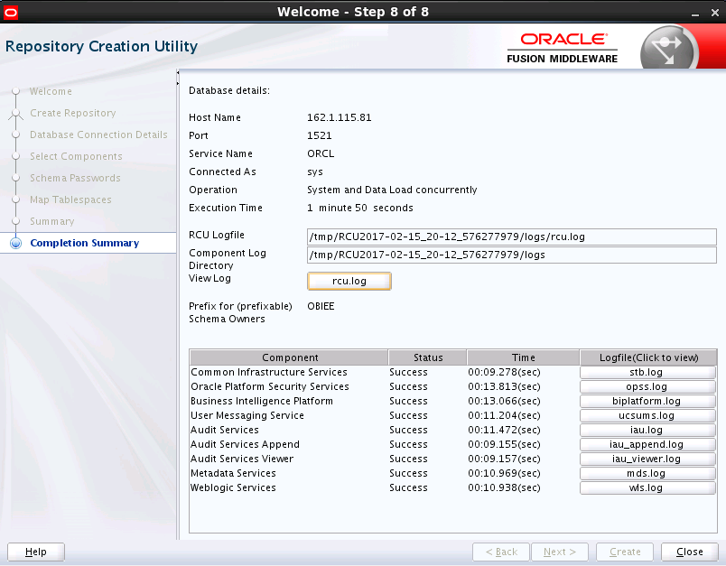

### 配置BI Server

* 执行配置
  ```
  cd /Oracle/Middleware/Oracle_Home/bi/bin
  ./config.sh
  ```

  

  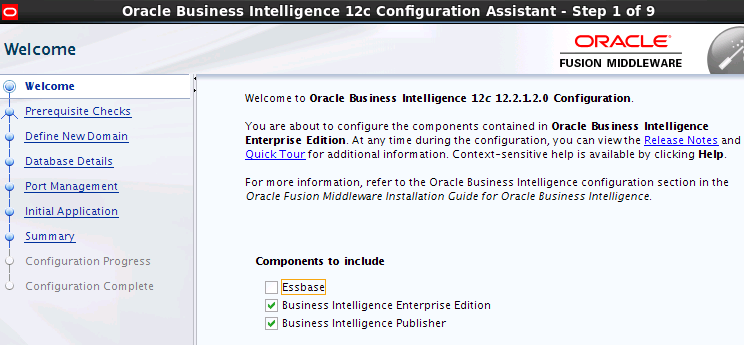

  

  

  

  

  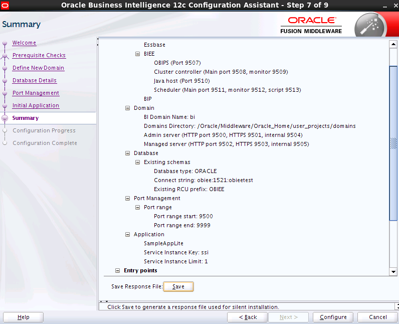

  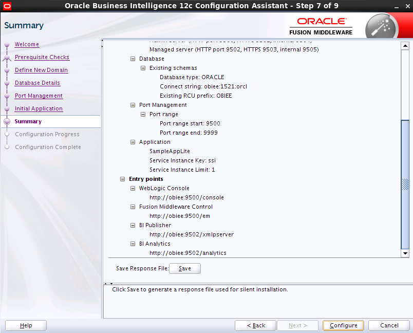

  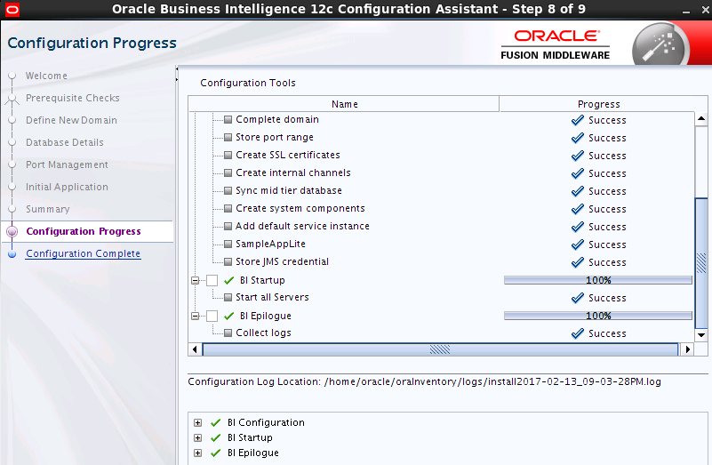

### 安装BI Client

* 在Win7(64 bit)系统上安装BI Client

  

  

  

  

## 对接Hive

### 配置客户端系统DSN

* 配置Kerberos认证

  从[http://web.mit.edu/kerberos/](http://web.mit.edu/kerberos/)下载安装kfw-4.1

  

  

* 安装配置Hive ODBC Driver

  下载安装Hive ODBC Driver（Windows版本），[下载地址](https://www.cloudera.com/downloads/connectors/hive/odbc/2-5-5.html)

  在BI客户端所在的Windows机器上配置系统DSN

  

  测试ODBC连接

  

### BI 管理工具新建RDP

* Client端打开Oracle BI 管理工具

  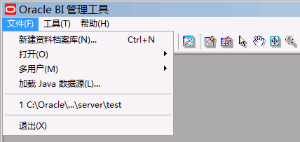

  

* 选择上一步配置的DSN，用户名口令任意输入，但不能为空

  

  

  

  

  

  

  

  

  

  

  

  

  

  

  

  

  

### 禁用BI Server高速缓存

* 登录Weblogic域管理界面[http://162.1.115.81:9500/em](http://162.1.115.81:9500/em)

  

  

  

  

* 配置中禁用高速缓存

  

  

  

### 上传RPD文件到服务端

* 客户端 cmd 切换到`E:\Oracle\Middleware\Oracle_Home\bi\bitools\bin`目录
* 执行命令上传RPD
  ```
  datamodel.cmd uploadrpd -U weblogic -P Huawei123 -I E:\Oracle\Middleware\Oracle_Home\bi\bifoundation\server\obiee-hive.rpd -W Huawei@123 -S 162.1.115.81 -N 9502 -SI ssi
  ```

  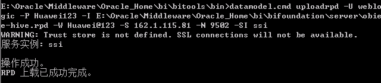

### 配置服务端系统DSN

* 配置Kerberos认证

  ```
  mv /etc/krb5.conf /etc/krb5.conf.bak
  ```

  将FusionInsight集群的krb5.conf上传到/etc目录下

  kerberos认证
  ```
  su oracle
  kinit test_cn
  ```

  

* 安装配置Cloudera Hive ODBC Driver

  ```
  yum install -y unixODBC
  ```

  下载Hive ODBC Driver（Linux版本）[下载地址](https://www.cloudera.com/downloads/connectors/hive/odbc/2-5-5.html)

  安装Hive ODBC Driver
  ```
  rpm -Uvh ClouderaHiveODBC-2.5.5.1006-1.el6.x86_64.rpm
  ```

  

  修改DSN配置，与Client端生成的RPD文件的DSN名称和配置保持一致
  ```
  mv /etc/odbc.ini /etc/odbc.ini.bak
  cp /opt/cloudera/hiveodbc/Setup/odbc.ini /etc/
  vi /etc/odbc.ini
  ```

  

  修改odbc配置文件
  ```
  vi /opt/cloudera/hiveodbc/Setup/cloudera.hiveodbc.ini
  ```

  

  ```
  mv /etc/odbcinst.ini /etc/odbcinst.ini.bak
  cp /opt/cloudera/hiveodbc/Setup/odbcinst.ini /etc/
  ```

  配置环境变量`vi /etc/profile`
  ```
  export LD_LIBRARY_PATH=/usr/lib64:/opt/cloudera/hiveodbc/lib/64
  export ODBCINI=/etc/odbc.ini
  export ODBCSYSINI=/etc
  export SIMBAINI=/opt/cloudera/hiveodbc/Setup/cloudera.hiveodbc.ini
  ```

  导入环境变量`source /etc/profile`

  测试ODBC连接
  ```
  su oracle
  isql -v 'Sample Cloudera Hive DSN'
  ```

  

* BI域配置系统ODBC
  ```
  cd /Oracle/Middleware/Oracle_Home/user_projects/domains/bi/config/fmwconfig/bienv/core
  cp odbc.ini odbc.ini.bak
  vi odbc.ini
  ```

  

  重启OBIS
  ```
  su oracle
  cd /Oracle/Middleware/Oracle_Home/user_projects/domains/bi/bitools/bin
  ./stop.sh
  ./start.sh
  ```

### 服务端分析Hive数据

* 打开BI Analytics界面[http://162.1.115.81:9502/analytics](http://162.1.115.81:9502/analytics)

* 创建分析

  

  

  选择待分析的列拖到右侧区域

  

  点击“结果”页签，检索所选列数据

  

  

  点击右上角的保存按钮，保存查询结果

  

* 创建可视分析器项目

  

  添加数据源

  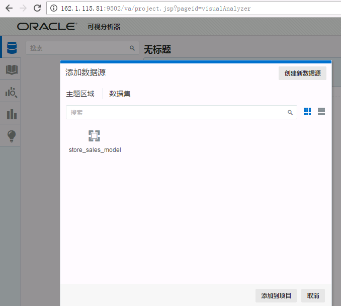

  选取数据显示形式

  

  

  

  添加计算

  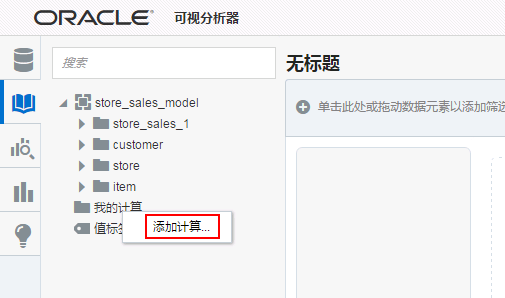

## 对接Spark SQL

### 配置客户端系统DSN

* Kerberos认证

  Kerberos获取认证票据

  

* 安装配置Simba Spark ODBC Driver

  下载安装 Simba Spark ODBC Driver：[下载地址](https://downloads.tableausoftware.com/drivers/simba/SimbaSparkODBC64.msi)

  配置DSN：

  

  测试ODBC连接：

  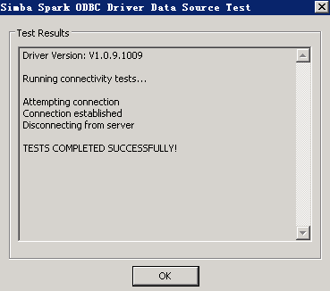

### BI管理工具新建RDP

* 新建obiee-spark.rdp，DSN选择上一步配置的 Sample Simba Spark DSN

  

### 上传RDP文件到服务端

* 上传RDP

  

### 配置服务端系统DSN

* Kerberos认证
  ```
  su oracle
  kinit test_cn
  ```

  

* 安装配置Simba Spark ODBC Driver

  下载Simba Spark ODBC Driver：[下载地址](https://databricks.com/spark/odbc-driver-download)
  ```
  rpm -Uvh SimbaSparkODBC-1.2.2.1002-1.el6.x86_64.rpm
  ```

  

  修改DSN配置，增加Sample Simba Spark DSN，与Client端配置相同 `vi /etc/odbc.ini`

  

  修改odbcinst.ini，`vi /etc/odbcinist.ini`

  

  配置环境变量 `vi /etc/profile`

  

  导入环境变量 `source /etc/profile`

  测试ODBC连接
  ```
  su oracle
  isql -v 'Sample Simba Spark DSN'
  ```

  

* BI域配置系统ODBC
  ```
  cd /Oracle/Middleware/Oracle_Home/user_projects/domains/bi/config/fmwconfig/bienv/core
  vi odbc.ini
  ```

  

  重启OBIS
  ```
  su oracle
  cd /Oracle/Middleware/Oracle_Home/user_projects/domains/bi/bitools/bin
  ./stop.sh
  ./start.sh
  ```

### 服务端分析Spark数据

参考[服务端分析Hive数据](#服务端分析hive数据)

## 对接LibrA/ELK

配置LibrA与ELK的方式没有区别，以下以对接ELK为例进行操作

### 配置客户端系统DSN

* 配置obiee客户端的ODBC驱动

  按照ELK的产品文档的指导安装配置ELK的windows驱动

  配置DSN，测试ODBC连接，保存ODBC连接

  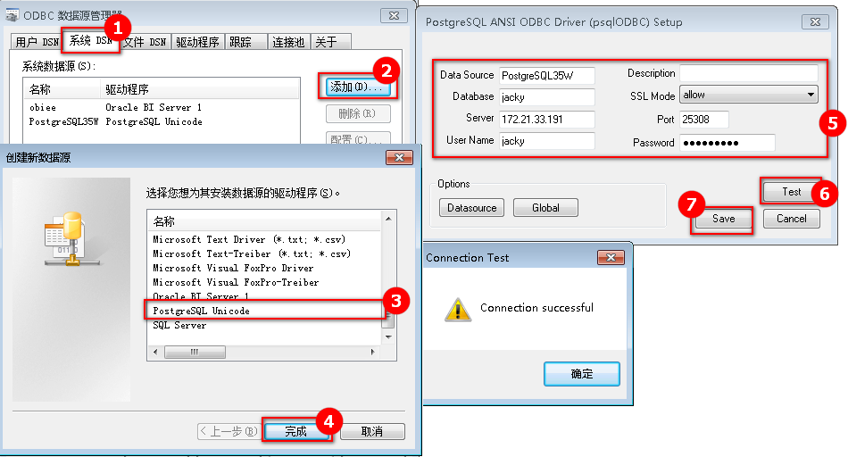

### BI管理工具新建RDP

* 新建obiee-elk.rdp，DSN选择上一步配置的 PostgreSQL35W

  

### 上传RDP文件到服务端

* 上传RDP

  

### 配置服务端系统DSN

* 参考LibrA/ELK的产品文档的Linux下配置数据源章节，完成obiee节点下的ODBC驱动的安装

  

  测试ODBC连接，确保ODBC驱动安装成功
  ```
  isql -v PostgreSQL35W
  ```

  

* BI域配置系统ODBC
  ```
  cd /Oracle/Middleware/Oracle_Home/user_projects/domains/bi/config/fmwconfig/bienv/core
  vi odbc.ini
  ```

  在ODBC Data Sources部分增加PostgreSQL35W的DSN

  

  在文件末尾增加PostgreSQL35W的DSN的详细配置

  

  > PostgreSQL35W的DSN的详细配置最后一行DriverUnicodeType=1需要加上，否则obiee查询的时候会报错[nQSError: 12010] Communication error connecting to remote end point: address = obiee; port = 9514. (HY000)

  重启OBIS
  ```
  su oracle
  cd /Oracle/Middleware/Oracle_Home/user_projects/domains/bi/bitools/bin
  ./stop.sh
  ./start.sh
  ```

### 服务端分析Spark数据

参考[服务端分析Hive数据](#服务端分析hive数据)
