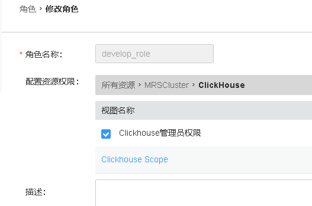

# PowerBI对接FusionInsight

## 适用场景

> Power BI 2.75.5649.861 <--> FusionInsight HD 6.5 (Hive/Spark2x/FTP-Server)

> Power BI 2.75.5649.861 <--> FusionInsight MRS 8.0 (Hive/FTP-Server/Hetu/ClickHouse)

## 简介

## 准备工作

* 登录FusionInsight Manager创建一个“人机”用户，例如：developuser，具体请参见FusionInsight HD产品文档的`管理员指南->系统设置->权限设置->用户管理->创建用户`章节。给developuser用户授予所有访问权限，包含但不限于Hive、Spark2x。

* 已完成FusionInsight HD客户端安装，具体请参见FusionInsight HD产品文档的`应用开发指南->安全模式->安全认证->配置客户端文件`章节。

* 客户端机器的时间与FusionInsight HD集群的时间要保持一致，时间差小于5分钟。

* Hive数据库已存在表student：

  **示例如下：**

  ```
  CREATE TABLE IF NOT EXISTS student(id INT, first_name STRING, last_name STRING, subject_id INT, score FLOAT);
  INSERT INTO student VALUES (1,'Tom','Zhang',1,80);
  INSERT INTO student VALUES (2,'Sandy','Li',2,75);
  INSERT INTO student VALUES (3,'Benny','Chow',3,76);
  INSERT INTO student VALUES (4,'Tina','Wang',1,60);
  INSERT INTO student VALUES (5,'Tracy','Zhang',1,80);
  INSERT INTO student VALUES (6,'Andy','Li',2,79);
  INSERT INTO student VALUES (7,'Manson','Chow',3,86);
  INSERT INTO student VALUES (8,'Aurora','Wang',1,90);
  ```

* 本地已存在Subject.xlsx，内容如下所示：

  

* 从<https://www.microsoft.com/en-us/download/details.aspx?id=58494>下载对应操作系统的Power BI Desktop并安装。本文版本为 **PBIDesktopSetup_x64.exe**。

  

  >说明：只在本地创建报表，不需要注册账号。如果需要发布报表与他人共享，则需要注册账号。

## 配置Windows的kerberos认证

* 从<http://web.mit.edu/kerberos/dist/#kfw-4.0>下载对应操作系统架构的MIT Kerberos并安装。本文版本为 **kfw-4.1-amd64.msi**。

* 设置Kerberos的配置文件。登录FusionInsight Manager的`系统->用户->更多（developuser）->下载认证凭证`，下载developuser对应的认证凭证。将krb5.conf文件重命名为 **krb5.ini** 放在`C:\ProgramData\MIT\Kerberos5`目录下。

  >说明：`C:\ProgramData`一般属于隐藏文件夹，在“文件夹和搜索选项->查看”中设置“显示隐藏的文件、文件夹或驱动器”或者使用搜索功能即可解决问题。

* 设置Kerberos票据的缓存文件

  * 在本地创建存放票据的目录，例如`C:\temp`。

  * 设置Windows的系统环境变量，变量名为`KRB5CCNAME`，变量值为`C:\temp\krb5cache`。

    

* 重启机器让新增的环境变量生效。

* 在Windows上进行认证

  * 使用上述创建的用户名密码登录，用户名的格式为：用户名@Kerberos域名。

  * 打开MIT Kerberos，单击 **get Ticket** ，在弹出的MIT Kerberos: Get Ticket窗口中，**Pricipal** 输入用户名`developuser@HADOOP.COM`，**Password** 输入密码，单击 **OK**。

    

    >说明：票据过期后需要重新获取。

## 配置Hive数据源

Power BI中配置Hive数据源，对接Hive的ODBC接口。

* 从<https://www.microsoft.com/en-us/download/details.aspx?id=40886>下载Microsoft Hive ODBC Driver并安装。本文版本为 **HiveODBC64.msi**。

* 配置ODBC驱动

  * 创建DSN(Data Source Name)：选择 **开始** -> **Microsoft Hive ODBC Driver** -> **64-bit ODBC Administrator**。

  * 选择 **User DSN** -> **Add** -> **Microsoft Hive ODBC Driver** -> **Finish**

    **配置示例如下（其余选项为默认值）：**

    ```
    Data Source Name: ms_hive_odbc，可自定义。
    Host(s): 172.16.4.21，Hive Service主节点
    Port：21066，Hive Service端口
    Database: default
    Mechanism：Kerberos
    Host FQDN：hadoop.hadoop.com
    Service Name：hive
    Realm：留空
    Thrift Transport: SASL
    SSL Options: 取消勾选“Enable SSL”
    ```

    

    > 说明：Advanced Options不需要进行配置默认的参数即可连接成功。

  * 点击 **Test** 按钮测试连接，如返回“SUCCESS”，则表示ODBC连接Hive成功。

    

## Power BI对接Hive

  * Power BI启动后点击 **Get data** 或者 **home->Get Data->More**。

    

  * 在搜索框输入 **odbc** 后选择 **ODBC**，点击 **Connect**。

    

  * “Data source name (DSN)” 选择 **ms_hive_odbc**，点击 **OK**。

    

  * 选择 **Windows**，点击 **Connect**。

    

  * 勾选 **default** 数据库的表 **student**，点击 **Load**。

    

  * 选择 **Data** 视图即可预览表的数据。

    

## 配置Spark数据源

* 从<https://www.microsoft.com/en-us/download/details.aspx?id=49883>下载Microsoft Spark ODBC Driver并安装。本文版本为 **SparkODBC64.msi**。

* 配置ODBC驱动

  * 创建DSN(Data Source Name)：选择 **开始** -> **Microsoft Spark ODBC Driver** -> **64-bit ODBC Administrator**。

  * 选择 **User DSN** -> **Add** -> **Microsoft Spark ODBC Driver** -> **Finish**

    **配置示例如下（其余选项为默认值）：**

    ```
    Data Source Name: ms_spark2x_odbc，可自定义。
    Spark Serve Type: SparkThriftServer(Spark1.1 and later)
    Host(s): 172.16.4.22，Spark2x的JDBCServer2x主节点
    Port：22550，为属性hive.sever2.thrift.port的值
    Database: default
    Mechanism：Kerberos
    Host FQDN：hadoop.hadoop.com
    Service Name：spark2x
    Realm：留空
    Thrift Transport: SASL
    SSL Options: 取消勾选“Enable SSL”
    ```

    

    > 说明：Advanced Options不需要进行配置默认的参数即可连接成功。

  * 点击 **Test** 按钮测试连接，如返回“SUCCESS”，则表示ODBC连接Spark2x成功。

    

## Power BI对接Spark2x

Power BI对接Spark2x有两种方式。可以选择通过Spark ODBC对接，或者通过Power BI提供的Spark方式对接。

### ODBC

  * Power BI启动后，点击 **Get data** 或者 **home->Get Data->More**。

    

  * 在搜索框输入 **odbc** 后选择 **ODBC**，点击 **Connect**。

    

  * “Data source name (DSN)” 选择 **ms_spark2x_odbc**，点击 **OK**。

    

  * 选择 **Windows**，点击 **Connect**。

    

  * 勾选 **default** 数据库的表 **student**，点击 **Load**。

    

  * 选择 **Data** 视图即可预览表的数据。

    

### Spark

* Power BI启动后，点击 **Get data** 或者 **home->Get Data->More**。

  

* 在搜索框输入 **spark** 后选择 **Spark**，点击 **Connect**。

  

* “Server”输入Spark2x的JDBCServer2x主节点IP，例如 **172.16.4.22**，“Protocol”选择 **Standard**，点击 **OK**。

  

* 点击 **Windows**，选择 **Use my current credentials**，“Realm”输入 **HADOOP.COM**，“Host FQDN”输入 **hadoop.hadoop.com**，“Service Name”输入 **spark2x**，点击 **Connect**。

  

* 勾选表 **student**，点击 **Load**。

  

* 选择 **Data** 视图即可预览表的数据。

  

## Power BI对接FTP-Server

* 登录FusionInsight Manger，修改FTP-Server的配置 **ftp-enabled=true** 保存后，点击 **更多->重启** 重启FTP-Server。

  

* 登录FusionInsight客户端，创建文件powerbi_hdfs.txt并上传至HDFS文件系统。

  ```
  vi /opt/powerbi_hdfs.txt
  hdfs dfs -put /opt/powerbi_hdfs.txt /tmp
  ```

  

* Power BI启动后，点击 **Get data** 或者 **home->Get Data->More**。

  

* 在搜索框输入 **web** 后选择 **Web**，点击 **Connect**。

  

* 选择 **Basic**，“URL”输入 **ftp://172.16.4.21:22021/tmp/powerbi_hdfs.txt** 。

  

* 点击 **FTP**，输入FusionInsight用户名 **developuser** 和对应的密码，点击 **Connect**。

  

* 点击 **Load** 加载数据。

  

* 选择 **Data** 视图即可预览数据。

  

## Power BI调整和合并多个数据源。

使用Power BI调整和合并从Hive/Spark、Excel导入的多个数据源，输出报表。以下以调整、合并Hive和Excel数据源为例。调整、合并Spark、FTP-Server和Excel数据源操作类似。

* 导入Excel数据源。

  * 点击 **home->Get Data->Excel** 导入本地文件Subject.xlsx。

    

  * 勾选 **Subject**，点击 **Load**。

    

    

* 点击 **home->Edit Queries** 进入Power Query编辑器进行调整和组合操作。

  

  * **合并列：** 在Power Query编辑器中，按下Ctrl键选中查询student的first_name和last_name列，然后点击 **Transform->Merge Columns** 将这两列合并，并命名为 **name**。

    

    

  * **合并查询：**

    * 在Power Query编辑器中，选中查询student，点击 **home->Merge Queries**，

      

    * 选中 **student.subject_id** 和 **Subject.id**，“Join Kind”选择 **Left Outer**，点击 **OK**。

      

    * 点击按钮可展开隐藏的列。

      

      

   * **删除列：** 点击 **home->Remove Cloumns** 可将不需要的列删除。将id、subject_id、subject.id、subject.description删除。

   * **重命名列：** 双击列名“subject.name”重命名为“subject_name”。

   * 点击 **Close & Apply** 关闭Power Query编辑器并应用修改。

      

* 创建报表。选择 **报表** 视图。依次勾选查询student的 **Subject_name**、**score**。“值”选择 **Average of score**，并点击图表右上角的 **...** 按钮选择 **Show data**。报表显示如下：

  


## Hetu对接
### odbc配置

- 安装hetu-odbc-win64.msi

  安装地址：https://openlookeng.io/download.html

  

  下载完成后，双击安装，选默认配置即可，一直next，直到finish

- 配置数据源驱动

  - 先停止自动启动的odbc服务

    a. 以管理员身份进入`C:\Program Files\openLooKeng\openLooKeng ODBC Driver 64-bit\odbc_gateway\mycat\bin` 目录

    b.	执行启动停止自动启动命令: `mycat.bat stop`

    

    注意： 需要以管理员身份启动cmd，到相应路径执行stop命令，否则会报拒绝访问的错误

  - 替换hetu的jdbc驱动

    a. 从HETU客户端获取驱动jar包，比如 presto-jdbc-316-hw-ei-302002.jar

    b. 将presto-jdbc-316-hw-ei-302002.jar 拷贝到`C:\Program Files\openLooKeng\openLooKeng ODBC Driver 64-bit\odbc_gateway\mycat\lib`目录下，并删除该目录下之前的hetu-jdbc-1.0.1.jar包

  - 准备hetu对接配置文件

    a. 从Manager获取对接用户user.keytab以及krb5.conf文件

    b. 使用WinSCP工具以omm用户登录FusionInsight Hetu集群中部署了HSBroker角色的节点，进入`${BIGDATA_HOME}/FusionInsight_Hetu_8.0.2.1/xxx_HSBroker/etc/`目录，下载“jaas-zk.conf”和“hetuserver.jks”文件到本地

    c. 参考如下修改jaas-zk.conf文件，keyTab为访问HetuEngine用户的keytab文件路径

      ```
      Client {
      com.sun.security.auth.module.Krb5LoginModule required
      useKeyTab=true
      keyTab="C:/hetu/user.keytab"
      principal="developuser@HADOOP.COM"
      useTicketCache=false
      storeKey=true
      debug=true;
      };
      ```
  - 编辑ODBC的wrapper.conf配置

    进入`C:\Program Files\openLooKeng\openLooKeng ODBC Driver 64-bit\odbc_gateway\mycat\conf`目录下，编辑wrapper.conf文件

    增加JVM参数：

    ```
    wrapper.java.additional.13=-Djava.security.auth.login.config=C:\\hetu\\jaas-zk.conf
    wrapper.java.additional.14=-Djava.security.krb5.conf=C:\\hetu\\krb5.conf
    wrapper.java.additional.15=-Dzookeeper.auth.type=kerberos
    wrapper.java.additional.16=-Dzookeeper.server.principal=
    zookeeper/hadoop.hadoop.com
    wrapper.java.additional.17=-Dzookeeper.sasl.clientconfig=Client
    ```

  - 编辑ODBC的server.xml

    进入`C:\Program Files\openLooKeng\openLooKeng ODBC Driver 64-bit\odbc_gateway\mycat\conf`目录下，编辑server.xml中的协议前缀。

    将server.xml文件中属性值<property name="jdbcUrlPrefix">jdbc:lk://</property>修改为
<property name="jdbcUrlPrefix">jdbc:presto://</property>

    

  - 准备jdbc连接配置文件jdbc_param.properties：

    新建jdbc_param.properties文件，并添加如下内容进行配置

    ```
    #注意事项：
    #1、文件路径分隔符请使用"\\"或“/”

    #关键字列表如下：
    # url: “<catalog>”、"<schema>" 分别是JDBC客户端要连接的catalog和schema名称。“<zkNode_IP>:<zkNode_Port>”是ZooKeeper的URL，多个URL以逗号隔开。例如：“192.168.81.37:24002,192.168.195.232:24002,192.168.169.84:24002”。样例：jdbc:presto://<zkNode1_IP>:<zkNode1_Port>,<zkNode2_IP>:<zkNode2_Port>,<zkNode3_IP>:<zkNode3_Port>/<catalog>/<schema>?serviceDiscoveryMode=zooKeeper&zooKeeperNamespace=hsbroker
    # user: 访问数据库用户名
    # password: 访问数据库密码
    # :
    # :
    # :
    user=developuser

    #password=123456

    # SOCKS 代理服务器，如 localhost:1080
    #socksProxy

    # HTTP 代理服务器地址，如 localhost:8888
    #httpProxy

    # 要附加到任何指定的ApplicationName客户端信息属性的前辍，该属性用于设置Presto查询的源名称，如果既未设置此属性也未设置ApplicationName，则查询的源将为presto-jdbc
    #applicationNamePrefix

    # 基于令牌的身份验证令牌
    #accessToken

    # 是否使用HTTPS连接，默认false
    SSL=true

    # Java Keystore文件路径
    #SSLKeyStorePath

    # Java KeyStore密码
    #SSLKeyStorePassword

    # Java TrustStore文件路径，SSLTrustStorePath=path，path里的路径分隔符使用"\\"或"/"
    SSLTrustStorePath=C:\\hetu\\hetuserver.jks
    SSLTrustStorePassword=Changeme_123

    # Java TrustStore密码
    #SSLTrustStorePassword

    # Kerberos服务名称，固定为HTTP
    KerberosRemoteServiceName=HTTP

    # Kerberos principal，KerberosKeytabPath指定的keytab对应的用户名
    KerberosPrincipal=developuser

    # 是否使用规范化主机名，默认为false
    #KerberosUseCanonicalHostname

    # Coordinator节点Kerberos service principal匹配模式，默认值为 ${SERVICE}@${HOST}。如果启用KerberosUseCanonicalHostname后，${SERVICE} 将替换为KerberosRemoteServiceName 的值，而${HOST}将替换为 coordinator 节点机器的主机名。
    KerberosServicePrincipalPattern=${SERVICE}@${HOST}

    # 访问数据源用户的krb5配置文件，参考准备安全认证获取
    KerberosConfigPath=C:\\hetu\\krb5.conf

    # 访问数据源用户的keytab配置文件，参考准备安全认证获取
    KerberosKeytabPath=C:\\hetu\\user.keytab

    # Kerberos credential 缓存路径
    #KerberosCredentialCachePath

    # 用于连接外部的额外凭据。extraCredentials是键值对的列表，如foo:bar;abc:xyz将创建凭据abc = xyz和foo = bar
    #extraCredentials

    # jaas-zk.conf配置文件的路径，用于访问安全模式下的ZooKeeper
    #java.security.auth.login.config=C:\\hetu\\jaas-zk.conf

    # krb5配置文件，参考准备安全认证获取
    #java.security.krb5.conf=C:\\hetu\\krb5.conf

    # ZooKeeper的认证方式，安全模式下取值为kerberos
    #zookeeper.auth.type=kerberos

    # 指定ZooKeeper服务端principal，配置参数“zookeeper.server.principal”可以确保客户端即使不能从服务端获取服务端principal，也可以成功连接到ZooKeeper服务端。格式为：zookeeper/hadoop.<系统域名的小写>，其中域名为krb5.conf文件中的default_realm字段值
    #zookeeper.server.principal=zookeeper/hadoop.hadoop.com

    # jaas-zk.conf配置文件中的条目名称
    #zookeeper.sasl.clientconfig=Client

    # 用户所属的租户
    tenant=default

    # 只支持on_yarn
    deploymentMode=on_yarn

    # 固定为${SERVICE}@${HOST}
    KerberosServicePrincipalPattern=${SERVICE}@${HOST}
    ```    
  说明：当前登录方式采用keytab方式登录，如果使用用户名/密码方式登录，则解开password注释，同时注释KerberosKeytabPath参数项。

  - 重启odbc服务
      a.	进入`C:\Program Files\openLooKeng\openLooKeng ODBC Driver 64-bit\odbc_gateway\mycat\bin`目录

      b.	执行启动命令`mycat.bat restart`

      

      注意：每次修改配置时都需要停止odbc服务，修改完毕后再重启服务。

- 配置数据源连接

  在window 系统的控制面板中输入odbc搜索odbc的管理程序，如图：

  

  应用程序中点击 “添加” ->  “openLooKeng ODBC 1.1 Driver”-> ”完成”

  

  填写名称和描述

  

  点击Next后，填写URL， 选择JDBC配置文件，填写User Name

    

  ```
  172.16.10.131:24002,172.16.10.132:24002,172.16.10.133:24002?serviceDiscoveryMode=zooKeeper&zooKeeperNamespace=hsbroker
  ```

- 测试连接：

  

### Power BI配置:


成功：


## ClickHouse对接

### 准备clickhouse测试数据

- 可参考下面部分了解如何创建clickhouse测试数据，如果已有数据可跳过此部分

  - 首先查看clickhouseserver实例ip

    

  - 检查测试用户是否有clickhouse的权限

    

  - 登录客户端，登录所有的clickhouseserver，创建表

    ```
    Kinit developuser

    登录第一个clickhouseserver: clickhouse client --host 172.16.5.53 --port 21423

    建表：CREATE TABLE ceshi_TinyLog(uid Int64,uname String,wid Int64,word String,pv Int64,click Int64,cost float,date Date,time String) ENGINE=TinyLog;

    登录另一个clickhouseserver: clickhouse client --host 172.16.5.52 --port 21423

    建表：CREATE TABLE ceshi_TinyLog(uid Int64,uname String,wid Int64,word String,pv Int64,click Int64,cost float,date Date,time String) ENGINE=TinyLog;
    ```

  - 使用命令传数据

    ```
    clickhouse client -m --host 172.16.5.53 --port 21423 --database="default" --query="insert into default.ceshi_TinyLog FORMAT CSV" < /opt/clickhousenew.csv

    clickhouse client -m --host 172.16.5.52 --port 21423 --database="default" --query="insert into default.ceshi_TinyLog FORMAT CSV" < /opt/clickhousenew.csv
    ```

    样例数据clickhousenew.csv

    ```
    27,花信风,22,图片,6,0,568.1720730083482,2020-03-16,10:07:01
    38,侯振宇,3,官网,4,8,539.9461401800766,2020-03-23,18:11:31
    31,韩浩月,9,儿童,5,3,473.69330165688615,2020-04-14,00:43:02
    61,恭小兵,10,阅读网,5,9,694.1459730283839,2020-04-03,23:17:17
    0,李公明,13,全集观看,18,10,837.9050944474849,2020-04-22,08:35:21
    74,傅光明,3,官网,20,0,526.4335879041444,2020-03-02,02:38:17
    63,高远,17,房屋租赁,17,8,487.0733326823028,2020-03-17,03:37:22
    8,李轶男,11,查询网,8,3,275.12075933899723,2020-04-03,06:38:30
    81,杜仲华,6,查询电话,12,5,90.02009064670109,2020-03-18,11:55:54
    65,郭妮,0,网站大全,18,9,840.7250869772428,2020-03-01,21:32:25
    15,洁尘,26,六年,11,8,529.7926355483769,2020-04-01,12:05:25
    ```

- clickhouse客户端检查数据：  

  ```
  Kinit developuser

  clickhouse client --host 172.16.5.53 --port 21423
  ```

  

### 获取clickhouse ODBC驱动

- 登录：https://github.com/ClickHouse/clickhouse-odbc/releases

  本文选择1.1.9驱动

- 使用安装好的clickhouse驱动添加一个系统DSN，名字为mrs311

  


- 打开poweBI,获取数据选择 odbc数据源

  

- 选择提前配置好的系统DSN,名字叫mrs311

  

- 填写用户名密码

  

- 点击下一步到测试数据预览

  

- 测试结果

  
