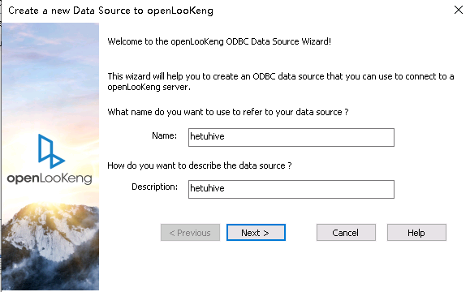

# QlikView对接FusionInsight

## 适用场景

> QlikView 12 <--> FusionInsight HD V100R002C60U20 (Hive/SparkSQL)
>
> QlikView 12 <--> FusionInsight HD V100R002C70SPC200 (Hive/SparkSQL)
>
> QlikView 12 <--> FusionInsight HD V100R002C80SPC100 (Hive/SparkSQL)
>
> QlikView 12 <--> FusionInsight HD 6.5 (Hive/SparkSQL)
>
> QlikView 12 <--> FusionInsight MRS 8.0 (Hive/SparkSQL/Hetu)

## 配置Windows的kerberos认证

* 下载并安装MIT Kerberos，地址：<http://web.mit.edu/kerberos/dist/#kfw-4.0>

* 版本与操作系统位数保持一致，本文版本kfw-4.1-amd64.msi。

* 确认客户端机器的时间与FusionInsight HD集群的时间一致，时间差要小于5分钟

* 设置Kerberos的配置文件

  在FusionInsight Manager创建一个角色与“机机”用户，具体请参见《FusionInsight HD管理员指南》的**创建用户**章节。角色需要根据业务需要授予Hive的访问权限，并将用户加入角色。例如，创建用户“sparkdemo”并下载对应的keytab文件user.keytab以及krb5.conf文件，把krb5.conf文件重命名为krb5.ini，并放到C:\ProgramData\MIT\Kerberos5目录中。

* 设置Kerberos票据的缓存文件

  * 创建存放票据的目录，例如`C:\temp`。

  * 设置Windows的系统环境变量，变量名为“KRB5CCNAME”，变量值为`C:\temp\krb5cache`

    

  * 重启机器。

* 在Windows上进行认证

  * 使用命令行进入到MIT Kerberos安装路径，找到可执行文件kinit.exe，例如本文路径为：`C:\Program Files\MIT\Kerberos\bin`

  * 执行如下命令：
    ```
    kinit -k -t /path_to_userkeytab/user.keytab UserName
    ```

    其中path_to_userkeytab为存放用户keytab文件的路径，user.keytab为用户的keytab，UserName为用户名。


## 配置Hive数据源

QlikView中配置Hive数据源，对接Hive的ODBC接口

### 下载安装Hive ODBC驱动

  从以下地址下载驱动根据操作系统类型选择对应的ODBC版本，下载并安装： [下载地址](http://www.cloudera.com/content/cloudera/en/downloads/connectors/hive/odbc/hive-odbc-v2-5-15.html)

### 配置用户DSN

* 在OBDC数据源管理器页面的用户DSN标签页中，点击添加，配置用户数据源。

  

* 在 **创建数据源** 页面，找到 **Cloudera ODBC Driver for Apache Hive**，选中后点击 **完成**。

  

* 配置Hive数据源。

    * Data Source Name：为自定义参数
    * Host(s)： HiveServer的业务ip
    * Port： Hive Service端口，21066
    * Mechanism： Kerberos
    * Host FQDN： hadoop.hadoop.com
    * Service Name： hive
    * Realm： 留空

    

* 点击 **Test** 连接成功则表示配置成功，点击 **OK**

    

### 连接Hive数据源

* 打开QlikView 12，**新建** 一个文档

  

* 关闭弹出的入门向导

  

* 在工具栏中打开 **编辑脚本** 按钮

  

* 在弹出的 **编辑脚本** 页面下方，点击 **数据** 标签页，在 **数据库** 的下拉栏中找到 **OCBC**，点击 **连接**；

  

* 在**连接到数据源**页面，选择上面配置的数据源hive_odbc，然后点击**确定**；

  

* 在 **编辑脚本** 页面的 **数据** 标签页中，点击 **选择** 按钮

  

* 在 **创建Select语句** 页面中，选择想要导入的 **数据库表格**，在 **字段** 中选择*，则导入完整表格，其余选项则导入其对应的表格，然后点击 **确定**（示例中选择*）；

  

* 回到 **编辑脚本** 页面，点击 **确定**

  

* 回到QlikView工作表页面，点击 **重新加载**，则可以将数据库表格导入到QlikView中。

  

* 然后可以对数据进行制图制表分析等处理，具体步骤可以参考QlikView官网的使用指南。

  


## 配置Spark数据源

QlivView中配置Spark数据源，对接SparkSQL的thrift接口。

### 下载安装Spark的ODBC驱动

* 在Simba官网下载Spark ODBC驱动，根据用户自身操作系统选择32bit或64bit，Data Source选择Spark
    SQL，地址：<http://www.tableau.com/support/drivers>

* 根据安装客户端提示安装客户端。

### 配置用户DSN

* 在 **OBDC数据源管理器** 页面的 **用户DSN** 标签页中，点击 **添加**，配置用户数据源。

  

* 在 **创建数据源** 页面，找到 **Simba Spark ODBC Driver**，选中后点击 **完成**。

  

* 在 **Simba Spark ODBC Driver DSN Setup** 页面中配置Spark数据源。

    * Data Source Name： 自定义
    * Mechanism： Kerberos
    * Host FQDN： hadoop.hadoop.com
    * Service Name： spark
    * Realm： 留空，
    * Host(s)： JDBCServer(主)的业务ip，
    * Port： SparkThriftServer客户端端口号23040。

    

* 设置完毕后点击 **Advanced Options**，在弹出的 **Advanced Options** 页面中，勾选 **Use Native Query** 和 **Get Tables With Query**，然后点击 **OK**

    

* 回到 **Simba Spark ODBC Driver DSN Setup**，点击 **Test** 连接成功，点击 **OK** 退出页面，否则将弹出失败对话框。

  

* 回到 **Simba Spark ODBC Driver DSN Setup** 页面，点击 **OK**，回到 **ODBC数据源管理器** 页面，点击 **确定** 完成并退出配置。

  

### 连接Spark数据源

* 打开QlikView 12，**新建** 一个文档

  

* 关闭弹出的入门向导

  

* 在工具栏中打开 **编辑脚本** 按钮

  

* 在弹出的 **编辑脚本** 页面下方，点击 **数据** 标签页，在 **数据库** 的下拉栏中找到 **OCBC**，点击 **连接**；

  

* 在 **连接到数据源** 页面，选择上面配置的数据源spark_odbc，然后点击 **确定**；

  

* 在 **编辑脚本** 页面的 **数据** 标签页中，点击 **选择** 按钮

  

* 在 **创建Select语句** 页面中，选择想要导入的 **数据库表格**，在 **字段** 中选择*，则导入完整表格，其余选项则导入其对应的表格，然后点击 **确定** （示例中选择*）；

  

* 回到 **编辑脚本** 页面，点击 **确定**

  

* 回到QlikView工作表页面，点击 **重新加载**，则可以将数据库表格导入到QlikView中。

  

* 然后可以对数据进行制图制表分析等处理，具体步骤可以参考QlikView官网的使用指南。

  


## Hetu对接
### odbc配置

- 安装hetu-odbc-win64.msi

  安装地址：https://openlookeng.io/download.html

  

  下载完成后，双击安装，选默认配置即可，一直next，直到finish

- 配置数据源驱动

  - 先停止自动启动的odbc服务

    a. 以管理员身份进入`C:\Program Files\openLooKeng\openLooKeng ODBC Driver 64-bit\odbc_gateway\mycat\bin` 目录

    b.	执行启动停止自动启动命令: `mycat.bat stop`

    

    注意： 需要以管理员身份启动cmd，到相应路径执行stop命令，否则会报拒绝访问的错误

  - 替换hetu的jdbc驱动

    a. 从HETU客户端获取驱动jar包，比如 presto-jdbc-316-hw-ei-302002.jar

    b. 将presto-jdbc-316-hw-ei-302002.jar 拷贝到`C:\Program Files\openLooKeng\openLooKeng ODBC Driver 64-bit\odbc_gateway\mycat\lib`目录下，并删除该目录下之前的hetu-jdbc-1.0.1.jar包

  - 准备hetu对接配置文件

    a. 从Manager获取对接用户user.keytab以及krb5.conf文件

    b. 使用WinSCP工具以omm用户登录FusionInsight Hetu集群中部署了HSBroker角色的节点，进入`${BIGDATA_HOME}/FusionInsight_Hetu_8.0.2.1/xxx_HSBroker/etc/`目录，下载“jaas-zk.conf”和“hetuserver.jks”文件到本地

    c. 参考如下修改jaas-zk.conf文件，keyTab为访问HetuEngine用户的keytab文件路径

      ```
      Client {
      com.sun.security.auth.module.Krb5LoginModule required
      useKeyTab=true
      keyTab="C:/hetu/user.keytab"
      principal="developuser@HADOOP.COM"
      useTicketCache=false
      storeKey=true
      debug=true;
      };
      ```
  - 编辑ODBC的wrapper.conf配置

    进入`C:\Program Files\openLooKeng\openLooKeng ODBC Driver 64-bit\odbc_gateway\mycat\conf`目录下，编辑wrapper.conf文件

    增加JVM参数：

    ```
    wrapper.java.additional.13=-Djava.security.auth.login.config=C:\\hetu\\jaas-zk.conf
    wrapper.java.additional.14=-Djava.security.krb5.conf=C:\\hetu\\krb5.conf
    wrapper.java.additional.15=-Dzookeeper.auth.type=kerberos
    wrapper.java.additional.16=-Dzookeeper.server.principal=
    zookeeper/hadoop.hadoop.com
    wrapper.java.additional.17=-Dzookeeper.sasl.clientconfig=Client
    ```

  - 编辑ODBC的server.xml

    进入`C:\Program Files\openLooKeng\openLooKeng ODBC Driver 64-bit\odbc_gateway\mycat\conf`目录下，编辑server.xml中的协议前缀。

    将server.xml文件中属性值<property name="jdbcUrlPrefix">jdbc:lk://</property>修改为
<property name="jdbcUrlPrefix">jdbc:presto://</property>

    

  - 准备jdbc连接配置文件jdbc_param.properties：

    新建jdbc_param.properties文件，并添加如下内容进行配置

    ```
    #注意事项：
    #1、文件路径分隔符请使用"\\"或“/”

    #关键字列表如下：
    # url: “<catalog>”、"<schema>" 分别是JDBC客户端要连接的catalog和schema名称。“<zkNode_IP>:<zkNode_Port>”是ZooKeeper的URL，多个URL以逗号隔开。例如：“192.168.81.37:24002,192.168.195.232:24002,192.168.169.84:24002”。样例：jdbc:presto://<zkNode1_IP>:<zkNode1_Port>,<zkNode2_IP>:<zkNode2_Port>,<zkNode3_IP>:<zkNode3_Port>/<catalog>/<schema>?serviceDiscoveryMode=zooKeeper&zooKeeperNamespace=hsbroker
    # user: 访问数据库用户名
    # password: 访问数据库密码
    # :
    # :
    # :
    user=developuser

    #password=123456

    # SOCKS 代理服务器，如 localhost:1080
    #socksProxy

    # HTTP 代理服务器地址，如 localhost:8888
    #httpProxy

    # 要附加到任何指定的ApplicationName客户端信息属性的前辍，该属性用于设置Presto查询的源名称，如果既未设置此属性也未设置ApplicationName，则查询的源将为presto-jdbc
    #applicationNamePrefix

    # 基于令牌的身份验证令牌
    #accessToken

    # 是否使用HTTPS连接，默认false
    SSL=true

    # Java Keystore文件路径
    #SSLKeyStorePath

    # Java KeyStore密码
    #SSLKeyStorePassword

    # Java TrustStore文件路径，SSLTrustStorePath=path，path里的路径分隔符使用"\\"或"/"
    SSLTrustStorePath=C:\\hetu\\hetuserver.jks
    SSLTrustStorePassword=Changeme_123

    # Java TrustStore密码
    #SSLTrustStorePassword

    # Kerberos服务名称，固定为HTTP
    KerberosRemoteServiceName=HTTP

    # Kerberos principal，KerberosKeytabPath指定的keytab对应的用户名
    KerberosPrincipal=developuser

    # 是否使用规范化主机名，默认为false
    #KerberosUseCanonicalHostname

    # Coordinator节点Kerberos service principal匹配模式，默认值为 ${SERVICE}@${HOST}。如果启用KerberosUseCanonicalHostname后，${SERVICE} 将替换为KerberosRemoteServiceName 的值，而${HOST}将替换为 coordinator 节点机器的主机名。
    KerberosServicePrincipalPattern=${SERVICE}@${HOST}

    # 访问数据源用户的krb5配置文件，参考准备安全认证获取
    KerberosConfigPath=C:\\hetu\\krb5.conf

    # 访问数据源用户的keytab配置文件，参考准备安全认证获取
    KerberosKeytabPath=C:\\hetu\\user.keytab

    # Kerberos credential 缓存路径
    #KerberosCredentialCachePath

    # 用于连接外部的额外凭据。extraCredentials是键值对的列表，如foo:bar;abc:xyz将创建凭据abc = xyz和foo = bar
    #extraCredentials

    # jaas-zk.conf配置文件的路径，用于访问安全模式下的ZooKeeper
    #java.security.auth.login.config=C:\\hetu\\jaas-zk.conf

    # krb5配置文件，参考准备安全认证获取
    #java.security.krb5.conf=C:\\hetu\\krb5.conf

    # ZooKeeper的认证方式，安全模式下取值为kerberos
    #zookeeper.auth.type=kerberos

    # 指定ZooKeeper服务端principal，配置参数“zookeeper.server.principal”可以确保客户端即使不能从服务端获取服务端principal，也可以成功连接到ZooKeeper服务端。格式为：zookeeper/hadoop.<系统域名的小写>，其中域名为krb5.conf文件中的default_realm字段值
    #zookeeper.server.principal=zookeeper/hadoop.hadoop.com

    # jaas-zk.conf配置文件中的条目名称
    #zookeeper.sasl.clientconfig=Client

    # 用户所属的租户
    tenant=default

    # 只支持on_yarn
    deploymentMode=on_yarn

    # 固定为${SERVICE}@${HOST}
    KerberosServicePrincipalPattern=${SERVICE}@${HOST}
    ```    
  说明：当前登录方式采用keytab方式登录，如果使用用户名/密码方式登录，则解开password注释，同时注释KerberosKeytabPath参数项。

  - 重启odbc服务
      a.	进入`C:\Program Files\openLooKeng\openLooKeng ODBC Driver 64-bit\odbc_gateway\mycat\bin`目录

      b.	执行启动命令`mycat.bat restart`

      

      注意：每次修改配置时都需要停止odbc服务，修改完毕后再重启服务。

- 配置数据源连接

  在window 系统的控制面板中输入odbc搜索odbc的管理程序，如图：

  

  应用程序中点击 “添加” ->  “openLooKeng ODBC 1.1 Driver”-> ”完成”

  

  填写名称和描述

  

  点击Next后，填写URL， 选择JDBC配置文件，填写User Name

    

  ```
  172.16.10.131:24002,172.16.10.132:24002,172.16.10.133:24002?serviceDiscoveryMode=zooKeeper&zooKeeperNamespace=hsbroker
  ```

- 测试连接：

  

### qlickview 配置

成功：


脚本要手动写，自动不识别：


其中hetuhive是user odbc的名字：


然后参考文档点击编辑脚本图标


成功之后再点击绘图图标：


## FAQ

* 找不到C:\ProgramData\MIT\Kerberos5文件夹

  C:\ProgramData一般属于隐藏文件夹，设置文件夹隐藏可见或者使用搜索功能即可解决问题。

* 连接成功无数据库权限

  连接所使用的用户需要有数据库的权限，否则将导致ODBC连接成功却无法读取数据库内容。

* ODBC连接失败

  常见情况是 **Host(s)** 、 **Port** 、 **Host FQDN** 的输入数据有误，请根据实际情况进行录入
