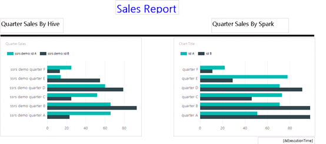
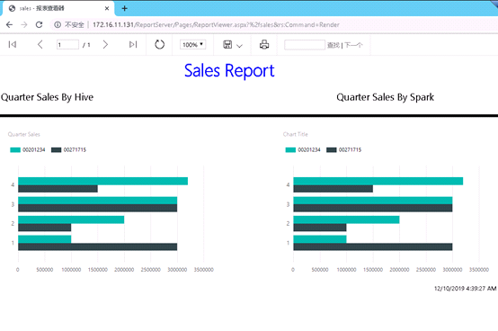

# SSRS对接FusionInsight

## 适用场景

> SSRS 2017 <--> FusionInsight HD 6.5 (Hive/SparkSQL)

## SSRS对接指导
* 下载和安装32bit 和64 bit的Microsoft ODBC驱动:

  * Microsoft Hive ODBC  Driver下载：
  [点击下载](https://www.microsoft.com/en-us/download/details.aspx?id=40886)

  * Microsoft Spark ODBC  Driver下载地址：
  [点击下载](https://www.microsoft.com/en-us/download/details.aspx?id=49883)

* 下载和安装MIT Kerberos认证客户端: [点击下载](http://web.mit.edu/ker)

* 配置Kerberos认证

  1. 下载并安装MIT Kerberos。请记住安装路径，例如：“C:\Program Files\MIT\Kerberos”。

  2. 	参考FusionInsight HD 6.5 文档，“应用开发指南->安全模式->安全认证”配置对接账号及相关权限。

  3. 	使用对接账号登录FusionInsight管理界面，鼠标停留在右上角显示用户处，在下拉显示框中选择“下载用户凭据”，选择集群并确认下载，下载解压后包括krb5.conf和user.keytab两个文件。

  4.	重命名krb5.conf文件为krb5.ini，并拷贝到“C:\ProgramData\MIT\Kerberos5”目录下。“C:\ProgramData”目录一般是隐藏的，需要设置显示隐藏文件。

  5.	设置Kerberos票据的缓存文件。创建存放票据的目录，例如“C:\temp”。

  6.	设置Windows的系统环境变量，变量名为“KRB5CCNAME”，变量值为“C:\temp\krb5cache”。设置Windows的系统环境变量，变量名为“KRB5_CONFIG”，变量值为“C:\ProgramData\MIT\Kerberos5\krb5.ini”。
重启服务器。

  7. 在Windows上进行认证。打开MIT Kerberos，单击“get Ticket”，在弹出的“MIT Kerberos: Get Ticket”窗口中，“Pricipal”输入用户名，“Password”输入密码，单击“OK”。

* 配置Spark和Hive ODBC DSN

  * 配置Spark ODBC　DSN

    打开Windows ODBC配置工具，在System DSN中，分别配置“Sample Microsoft Hive DSN”和“Sample Microsoft Spark DSN”，相关配置参考下图，根据实际环境替换HOST地址。

    

    在“SSL OPTIONS”中关闭SSL校验，设置如下图：
    

  * 配置HIVE ODBC DSN

    HIVE DSN 配置参考下图，根据实际环境替换HOST地址

    

* 功能验证

  * 准备测试数据

    通过beeline创建数据库和数据表，并插入部分测试数据。本测试场景中，创建销售测试表，包括员工ID，姓名，季度，销售额等，插入了部分测试数据，通过SSRS报表来显示员工每个季度的销售额以及对比直方图。

  * 创建Hive数据源

    打开Report Builder，右键“Data Sources”，设置 Data Source Name，选择“use a connection embedded in my report ”，选择Connection Type 为ODBC，点击“build”，在弹出框中，“Data Source Specification”中选择“use connection string”，点击“build”按钮，弹出框中选择“Machine Data Source”，选择“Sample Microsoft Hive DSN”，点击“OK”完成配置.

  * 创建Spark 数据源

    打开Report Builder，右键“Data Sources”，设置 Data Source Name，选择“use a connection embedded in my report ”，选择Connection Type 为ODBC，点击“build”，在弹出框中，“Data Source Specification”中选择“use connection string”，点击“build”按钮，弹出框中选择“Machine Data Source”，选择“Sample Microsoft Spark DSN”，点击“OK”完成配置.

  * 创建数据集

    在Report Builder左侧视图中，右键“Data Sets”添加数据集，设置数据集名称，选择“use a dataset embedded in my report”，选择data sources为之前配置的Hive或者Spark Data Sources。在Query中输入SQL语句筛选数据列，例如“select * from database.table”,点击“OK”,完成配置。完成该操作以后，将在左侧出现数据集的列，用于后续的数据分析。

  * 设计报表

    根据需求设计报表，本测试设计的图标如下，分别基于Hive和Spark设计了两个数据表格，如下图：

    

    点击左上解“RUN”按钮测试，测试结果如下：

    

  * 发布到SSRS

      测试完成后，选择左上角“File->Publish to Report Server”，Report Server地址为http:{ip}/ReportServer，上传完成后，打开Report Server网站http:{ip}/ReportServer,选择对应的路径，查看报表结果如下，可在浏览器中查看到报表数据。

      

  * 验证完成，SSRS报表通过Hive和Spark ODBC获取数据并正确呈现。
