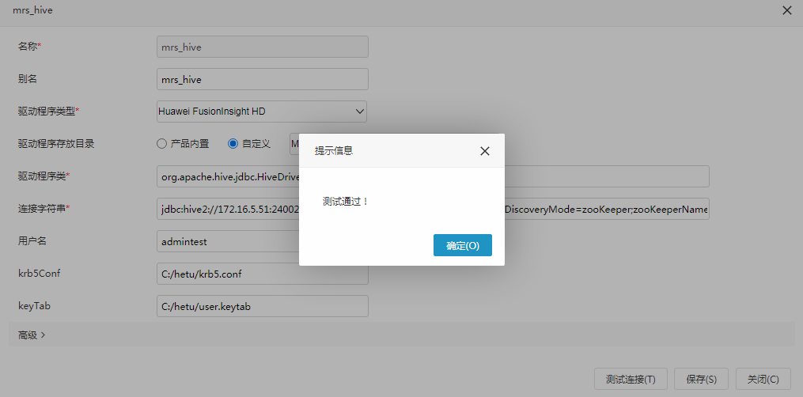
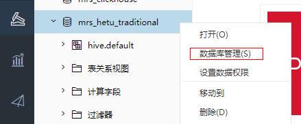

# SmartBI对接FusionInsight

## 适用场景
>
> SmartBI 9.5.64075.21175 <--> FusionInsight MRS 8.1.0 (Hive/Hetu/Clickhouse)

## Smartbi配置

- 修改smartbi主机的hosts文件将对接集群主机名加入

  

- 修改`C:\Smartbi\Tomcat\bin\startup.cmd`配置文件增加jvm启动参数

  

  ```
  -Djava.security.krb5.conf=C:/hetu/krb5.conf -Djava.security.auth.login.config=C:/hetu/jaas-zk.conf -Dzookeeper.server.principal=zookeeper/hadoop.hadoop.com -Dzookeeper.sasl.clientconfig=Client -Dzookeeper.auth.type=kerberos
  ```

- 对应的jaas-zk.conf文件内容为

  ```
  Client {
  com.sun.security.auth.module.Krb5LoginModule required
  useKeyTab=true
  keyTab="C:/hetu/user.keytab"
  principal="admintest@HADOOP.COM"
  useTicketCache=false
  storeKey=true
  debug=true;
  };
  ```

- 重启smartbi使jvm配置生效

## 对接hive(zk模式)

- 进入smartbi安装目录C:\Smartbi\Tomcat\bin\dynamicLibraryPath，新建驱动存放路径，例如MRS_Hive，并将hive的JDBC驱动放置于该目录下，如下图所示

  

  注意：从MRS客户端（/opt/client/Hive/Beeline/lib/jdbc）获取jar包本地上传，注意要删除该路径下的jdbc_pom.xml文件

- 启动smartbi，创建数据连接

  

  ```
  1. Huwei FusionInsight HD
  2. 选择自定义驱动  Hive_Hive
  3. org.apache.hive.jdbc.HiveDriver
  4. jdbc:hive2://172.16.5.51:24002,172.16.5.52:24002,172.16.5.53:24002/;serviceDiscoveryMode=zooKeeper;zooKeeperNamespace=hiveserver2;sasl.qop=auth-conf;auth=KERBEROS;principal=hive/hadoop.hadoop.com@HADOOP.COM;user.principal=admintest;user.keytab=C:/hetu/user.keytab
  5. admintest
  6. C:/hetu/krb5.conf
  7. C:/hetu/user.keytab
  ```

- 测试数据连接

  

- 创建数据集

  

  

- 查看数据结果

  

    

## 对接hetu(zk模式)

- 进入smartbi安装目录C:\Smartbi\Tomcat\bin\dynamicLibraryPath，新建驱动存放路径，例如MRS_Hetu，并将hetu的JDBC驱动放置于该目录下，如下图所示

  

- 准备连接hetu的配置文件

  

  其中hetuserver.jks请从hetu broker节点获取（比如：/opt/huawei/Bigdata/FusionInsight_Hetu_8.1.0/1_6_HSBroker/etc/hetuserver.jks）

- 启动smartbi，创建数据连接

  

  ```
  1：Presto
  2: 选择自定义 MRS_Hetu
  3: io.prestosql.jdbc.PrestoDriver
  4: jdbc:presto://172.16.5.51:24002,172.16.5.52:24002,172.16.5.53:24002?serviceDiscoveryMode=zooKeeper&zooKeeperNamespace=hsbroker&deploymentMode=on_yarn&SSL=true&KerberosConfigPath=C:/hetu/krb5.conf&KerberosPrincipal=admintest&KerberosKeytabPath=C:/hetu/user.keytab&KerberosRemoteServiceName=HTTP&KerberosServicePrincipalPattern=%24%7BSERVICE%7D%40%24%7BHOST%7D
  5: admintest
  ```

  注意：密码可以留空

- 测试数据连接

  

- 创建数据集

  

  

- 查看数据结果

  

    

## 对接hetu(用户名密码模式)

- 进入smartbi安装目录C:\Smartbi\Tomcat\bin\dynamicLibraryPath，新建驱动存放路径，例如MRS_Hetu，并将hetu的JDBC驱动放置于该目录下，如下图所示

  

- 准备连接hetu的配置文件

  

  其中hetuserver.jks请从hetu broker节点获取（比如：/opt/huawei/Bigdata/FusionInsight_Hetu_8.1.0/1_6_HSBroker/etc/hetuserver.jks）

- 启动smartbi，创建数据连接

  

  ```
  1：Presto
  2: 选择自定义 MRS_Hetu
  3: io.prestosql.jdbc.PrestoDriver
  4: jdbc:presto://172.16.5.51:29860,172.16.5.52:29860/hive/default?serviceDiscoveryMode=hsbroker
  5: 登录用户
  6：登录用户密码
  ```

- 测试数据连接

  

- 创建数据集

  

  


- 查看数据结果

  

  

## 对接clickhouse

- 准备clickhouse测试数据

  - 首先查看clickhouseserver实例ip

    

  - 检查测试用户是否有clickhouse的权限

    

  - 登录客户端，登录所有的clickhouseserver，创建表

    ```
    Kinit developuser

    登录第一个clickhouseserver: clickhouse client --host 172.16.5.53 --port 21423

    建表：CREATE TABLE ceshi_TinyLog(uid Int64,uname String,wid Int64,word String,pv Int64,click Int64,cost float,date Date,time String) ENGINE=TinyLog;

    登录另一个clickhouseserver: clickhouse client --host 172.16.5.52 --port 21423

    建表：CREATE TABLE ceshi_TinyLog(uid Int64,uname String,wid Int64,word String,pv Int64,click Int64,cost float,date Date,time String) ENGINE=TinyLog;
    ```

  - 使用命令传数据

    ```
    clickhouse client -m --host 172.16.5.53 --port 21423 --database="default" --query="insert into default.ceshi_TinyLog FORMAT CSV" < /opt/clickhousenew.csv

    clickhouse client -m --host 172.16.5.52 --port 21423 --database="default" --query="insert into default.ceshi_TinyLog FORMAT CSV" < /opt/clickhousenew.csv
    ```

    样例数据clickhousenew.csv

    ```
    27,花信风,22,图片,6,0,568.1720730083482,2020-03-16,10:07:01
    38,侯振宇,3,官网,4,8,539.9461401800766,2020-03-23,18:11:31
    31,韩浩月,9,儿童,5,3,473.69330165688615,2020-04-14,00:43:02
    61,恭小兵,10,阅读网,5,9,694.1459730283839,2020-04-03,23:17:17
    0,李公明,13,全集观看,18,10,837.9050944474849,2020-04-22,08:35:21
    74,傅光明,3,官网,20,0,526.4335879041444,2020-03-02,02:38:17
    63,高远,17,房屋租赁,17,8,487.0733326823028,2020-03-17,03:37:22
    8,李轶男,11,查询网,8,3,275.12075933899723,2020-04-03,06:38:30
    81,杜仲华,6,查询电话,12,5,90.02009064670109,2020-03-18,11:55:54
    65,郭妮,0,网站大全,18,9,840.7250869772428,2020-03-01,21:32:25
    15,洁尘,26,六年,11,8,529.7926355483769,2020-04-01,12:05:25
    ```

- clickhouse客户端检查数据：  

  ```
  Kinit developuser

  clickhouse client --host 172.16.5.53 --port 21423
  ```

    

- 启动smartbi，创建数据连接

  

  ```
  1. Clickhouse
  2. 产品内置
  3. ru.yandex.clickhouse.ClickHouseDriver
  4. jdbc:clickhouse://172.16.5.53:21421
  5. clickhouse用户
  6. clickhouse用户密码
  ```

- 测试数据连接

  

- 创建数据集

  

  

- 查看数据结果

  

  

## FAQ

问题1 使用zk方式连接hetu的时候遇到如下报错：


`failed to connect zookeeper `

问题原因：连接MRS ZK遇到问题

解决方法：

1. 检查hetu jdbc url的正确性
2. 检查jvm配置（C:\Smartbi\Tomcat\bin\startup.cmd）参数是否正确配置

问题2 使用zk方式连接hetu的时候遇到如下报错：


问题原因：smartbi主机hosts文件未配置对接集群主机名

解决办法：

检查配置文件C:\Windows\System32\drivers\etc\hosts 添加集群主机名


问题3 使用zk方式连接hetu的时候遇到如下报错：


`client is not started`

问题原因: zk连接失败，跟问题1属于同一类问题

解决方法：

1. 检查hetu jdbc url的正确性
2. 检查jvm配置（C:\Smartbi\Tomcat\bin\startup.cmd）参数是否正确配置

问题4 使用zk方式连接hetu的时候遇到如下报错：


`cannot locate default realm`

问题原因:  krb5文件未被正常获取

解决办法：

1. 将krb5.conf文件重命名为krb5.ini放置在smartbi主机C:\Windows 目录下
2. 仔细检查hetu jdbc url， 着重检查KerberosConfigPath配置项是否正确

问题5 使用zk方式连接hetu的时候遇到如下报错：


`schema must be specified`

问题原因：配置连接的时候要选择驱动类型为Presto而不是Other

解决办法：更改驱动类型为Presto

问题6 使用用户名密码方式连接hetu的时候遇到如下报错：


`failed to connect xxx:29860`

问题原因：改主机没有部署hsbroker实例

解决办法： 登录manager查看hetu的hsbroker实例之后再填写url


问题7 使用用户名密码方式连接hetu的时候遇到如下报错：


`Get cluster failed for Internal error`

解决办法：检查用户名，密码是否填写正确
