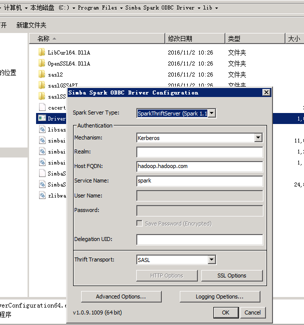
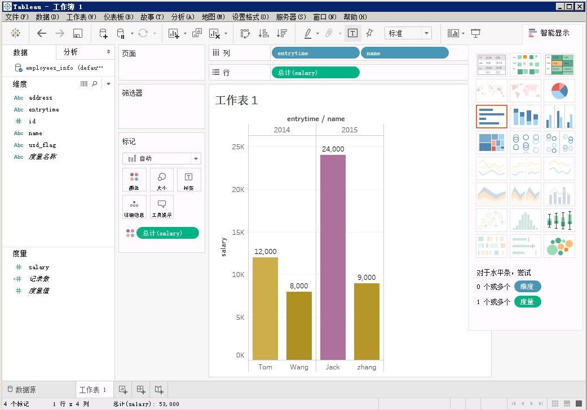
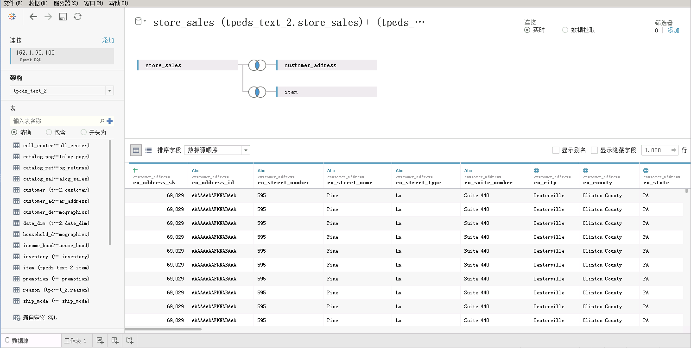
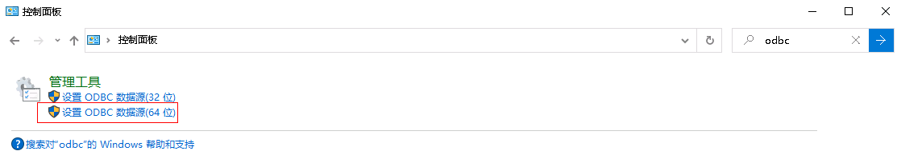

# Tableau对接FusionInsight

## 适用场景

> Tableau 10.0.0 <--> FusionInsight HD V100R002C30 (Hive/SparkSQL)
>
> Tableau 10.0.0 <--> FusionInsight HD V100R002C50 (Hive/SparkSQL)
>
> Tableau 10.1.4 <--> FusionInsight HD V100R002C60U20 (Hive/SparkSQL)
>
> Tableau 10.3.2 <--> FusionInsight HD V100R002C70SPC200 (Hive/SparkSQL)
>
> Tableau 10.5.0 <--> FusionInsight HD V100R002C80SPC100 (Hive/SparkSQL)
>
> Tableau 10.5.0 <--> FusionInsight HD 6.5 (Hive/SparkSQL)
>
> Tableau 10.5.0 <--> FusionInsight MRS 8.0 (Hive/SparkSQL/Hetu)


## 配置Windows的kerberos认证

* 下载并安装MIT Kerberos

  下载网址：<http://web.mit.edu/kerberos/dist/#kfw-4.0>

  版本与操作系统位数保持一致，本文版本kfw-4.1-amd64.msi。

* 确认客户端机器的时间与FusionInsight HD集群的时间一致，时间差要小于5分钟

* 设置Kerberos的配置文件

  在FusionInsight Manager创建一个角色与“人机”用户，具体请参见《FusionInsight HD 管理员指南》的创建用户章节。角色需要根据业务需要授予Hive的访问权限，并将用户加入角色。例如，创建用户“tableau”并下载对应的keytab文件user.keytab以及krb5.conf文件，把krb5.conf文件重命名为krb5.ini，并放到`C:\ProgramData\MIT\Kerberos5`目录中。

* 设置Kerberos票据的缓存文件

  * 创建存放票据的目录，例如“C:\temp”。
  * 设置Windows的系统环境变量，变量名为“KRB5CCNAME”，变量值为“C:\temp\krb5cache”。

    

* 重启机器。

* 在Windows上进行认证

  * 使用上述创建的用户名密码登录，用户名的格式为：用户名@Kerberos域名。

  * 打开MIT Kerberos，单击“get Ticket”，在弹出的“MIT Kerberos: Get Ticket”窗口中，“Pricipal”输入用户名，“Password”输入密码，单击“OK”。

    


## 配置Hive数据源

Tableau中配置Hive数据源，对接Hive的ODBC接口。

* 下载并安装ODBC驱动：[下载地址](http://www.cloudera.com/content/cloudera/en/downloads/connectors/hive/odbc/hive-odbc-v2-5-15.html)

  根据操作系统类型选择对应的ODBC版本，下载并安装。

* 配置ODBC驱动

  * 创建DSN(Data Source Name)：选择 **开始** -> **Simba Spark ODBC Driver** -> **ODBC Administrator**。
  * 选择 **User DSN** -> **Add** -> **Cloudera ODBC Driver for Apache Hive** -> **Finish**

    按实际配置相应的变量，

    * Host(s): Hive Service主节点
    * Port：Hive Service端口21066
    * Mechanism：Kerberos
    * Host FQDN：hadoop.hadoop.com
    * Service Name：hive
    * Realm：留空

    如下图

    

    > Advanced Options不需要进行配置默认的参数即可连接成功。

  * 点击中的Test进行测试连接，如果出现下图，则表示ODBC连接Hive成功。

    

* Tableau使用数据源

  * Tableau启动后会进入连接选择界面，点击“更多服务器”，再点击“其他数据库（ODBC）”；

  * DSN选择hive_odbc（上一步中设置ODBC的名称），点击连接，如下图所示，点击“连接”，然后登陆。

    

  * 查询百万级数据表数据

    

  * 查询多表数据

    

## 配置Spark数据源

* 下载并安装spark的ODBC驱动
  ODBC驱动下载地址：<http://www.tableau.com/support/drivers>

  

* 创建DSN（Data Source Name）

* 打开`C:\Program Files\Simba Spark ODBC Driver\lib\DriverConfiguration64.exe`

* 按实际配置相应的变量
  * Mechanism：Kerberos
  * Host FQDN：hadoop.hadoop.com
  * Service Name：spark
  * Realm：留空

  如下图：

  

* 点击“Advanced Options”，勾选如下选项：

  

* 点击OK，保存配置。

* Tableau使用Spark数据源

  * Tableau启动后会进入连接选择界面，点击“更多服务器”，再点击“Spark SQL”，作如下配置：

    

  * 其中服务器为JDBCServer(主)的业务IP。

    

  * 端口为FusionInsight中Spark服务配置，导出服务配置文件，其中<name>hive.server2.thrift.port</name>对应值。

  

  * 点击“登录”，进入tableau页面，选择架构和表，结果如下。

    

  * 用Tableau做实时连接，打开工作簿，对该表进行图形化分析。

    

  * 性能测试

    * 查询包含百万条数据的表web_sales

      

    * 多表关联查询：store_sales和item表做关联查询

      

      

      增加customer_address表

      

      查询结果：

      

## Hetu对接配置

## odbc配置

- 安装hetu-odbc-win64.msi

  安装地址：https://openlookeng.io/download.html

  

  下载完成后，双击安装，选默认配置即可，一直next，直到finish

- 配置数据源驱动

  - 先停止自动启动的odbc服务

    a. 以管理员身份进入`C:\Program Files\openLooKeng\openLooKeng ODBC Driver 64-bit\odbc_gateway\mycat\bin` 目录

    b.	执行启动停止自动启动命令: `mycat.bat stop`

    

    注意： 需要以管理员身份启动cmd，到相应路径执行stop命令，否则会报拒绝访问的错误

  - 替换hetu的jdbc驱动

    a. 从HETU客户端获取驱动jar包，比如 presto-jdbc-316-hw-ei-302002.jar

    b. 将presto-jdbc-316-hw-ei-302002.jar 拷贝到`C:\Program Files\openLooKeng\openLooKeng ODBC Driver 64-bit\odbc_gateway\mycat\lib`目录下，并删除该目录下之前的hetu-jdbc-1.0.1.jar包

  - 准备hetu对接配置文件

    a. 从Manager获取对接用户user.keytab以及krb5.conf文件

    b. 使用WinSCP工具以omm用户登录FusionInsight Hetu集群中部署了HSBroker角色的节点，进入`${BIGDATA_HOME}/FusionInsight_Hetu_8.0.2.1/xxx_HSBroker/etc/`目录，下载“jaas-zk.conf”和“hetuserver.jks”文件到本地

    c. 参考如下修改jaas-zk.conf文件，keyTab为访问HetuEngine用户的keytab文件路径

      ```
      Client {
      com.sun.security.auth.module.Krb5LoginModule required
      useKeyTab=true
      keyTab="C:/hetu/user.keytab"
      principal="developuser@HADOOP.COM"
      useTicketCache=false
      storeKey=true
      debug=true;
      };
      ```
  - 编辑ODBC的wrapper.conf配置

    进入`C:\Program Files\openLooKeng\openLooKeng ODBC Driver 64-bit\odbc_gateway\mycat\conf`目录下，编辑wrapper.conf文件

    增加JVM参数：

    ```
    wrapper.java.additional.13=-Djava.security.auth.login.config=C:\\hetu\\jaas-zk.conf
    wrapper.java.additional.14=-Djava.security.krb5.conf=C:\\hetu\\krb5.conf
    wrapper.java.additional.15=-Dzookeeper.auth.type=kerberos
    wrapper.java.additional.16=-Dzookeeper.server.principal=
    zookeeper/hadoop.hadoop.com
    wrapper.java.additional.17=-Dzookeeper.sasl.clientconfig=Client
    ```

  - 编辑ODBC的server.xml

    进入`C:\Program Files\openLooKeng\openLooKeng ODBC Driver 64-bit\odbc_gateway\mycat\conf`目录下，编辑server.xml中的协议前缀。

    将server.xml文件中属性值<property name="jdbcUrlPrefix">jdbc:lk://</property>修改为
<property name="jdbcUrlPrefix">jdbc:presto://</property>

    

  - 准备jdbc连接配置文件jdbc_param.properties：

    新建jdbc_param.properties文件，并添加如下内容进行配置

    ```
    #注意事项：
    #1、文件路径分隔符请使用"\\"或“/”

    #关键字列表如下：
    # url: “<catalog>”、"<schema>" 分别是JDBC客户端要连接的catalog和schema名称。“<zkNode_IP>:<zkNode_Port>”是ZooKeeper的URL，多个URL以逗号隔开。例如：“192.168.81.37:24002,192.168.195.232:24002,192.168.169.84:24002”。样例：jdbc:presto://<zkNode1_IP>:<zkNode1_Port>,<zkNode2_IP>:<zkNode2_Port>,<zkNode3_IP>:<zkNode3_Port>/<catalog>/<schema>?serviceDiscoveryMode=zooKeeper&zooKeeperNamespace=hsbroker
    # user: 访问数据库用户名
    # password: 访问数据库密码
    # :
    # :
    # :
    user=developuser

    #password=123456

    # SOCKS 代理服务器，如 localhost:1080
    #socksProxy

    # HTTP 代理服务器地址，如 localhost:8888
    #httpProxy

    # 要附加到任何指定的ApplicationName客户端信息属性的前辍，该属性用于设置Presto查询的源名称，如果既未设置此属性也未设置ApplicationName，则查询的源将为presto-jdbc
    #applicationNamePrefix

    # 基于令牌的身份验证令牌
    #accessToken

    # 是否使用HTTPS连接，默认false
    SSL=true

    # Java Keystore文件路径
    #SSLKeyStorePath

    # Java KeyStore密码
    #SSLKeyStorePassword

    # Java TrustStore文件路径，SSLTrustStorePath=path，path里的路径分隔符使用"\\"或"/"
    SSLTrustStorePath=C:\\hetu\\hetuserver.jks
    SSLTrustStorePassword=Changeme_123

    # Java TrustStore密码
    #SSLTrustStorePassword

    # Kerberos服务名称，固定为HTTP
    KerberosRemoteServiceName=HTTP

    # Kerberos principal，KerberosKeytabPath指定的keytab对应的用户名
    KerberosPrincipal=developuser

    # 是否使用规范化主机名，默认为false
    #KerberosUseCanonicalHostname

    # Coordinator节点Kerberos service principal匹配模式，默认值为 ${SERVICE}@${HOST}。如果启用KerberosUseCanonicalHostname后，${SERVICE} 将替换为KerberosRemoteServiceName 的值，而${HOST}将替换为 coordinator 节点机器的主机名。
    KerberosServicePrincipalPattern=${SERVICE}@${HOST}

    # 访问数据源用户的krb5配置文件，参考准备安全认证获取
    KerberosConfigPath=C:\\hetu\\krb5.conf

    # 访问数据源用户的keytab配置文件，参考准备安全认证获取
    KerberosKeytabPath=C:\\hetu\\user.keytab

    # Kerberos credential 缓存路径
    #KerberosCredentialCachePath

    # 用于连接外部的额外凭据。extraCredentials是键值对的列表，如foo:bar;abc:xyz将创建凭据abc = xyz和foo = bar
    #extraCredentials

    # jaas-zk.conf配置文件的路径，用于访问安全模式下的ZooKeeper
    #java.security.auth.login.config=C:\\hetu\\jaas-zk.conf

    # krb5配置文件，参考准备安全认证获取
    #java.security.krb5.conf=C:\\hetu\\krb5.conf

    # ZooKeeper的认证方式，安全模式下取值为kerberos
    #zookeeper.auth.type=kerberos

    # 指定ZooKeeper服务端principal，配置参数“zookeeper.server.principal”可以确保客户端即使不能从服务端获取服务端principal，也可以成功连接到ZooKeeper服务端。格式为：zookeeper/hadoop.<系统域名的小写>，其中域名为krb5.conf文件中的default_realm字段值
    #zookeeper.server.principal=zookeeper/hadoop.hadoop.com

    # jaas-zk.conf配置文件中的条目名称
    #zookeeper.sasl.clientconfig=Client

    # 用户所属的租户
    tenant=default

    # 只支持on_yarn
    deploymentMode=on_yarn

    # 固定为${SERVICE}@${HOST}
    KerberosServicePrincipalPattern=${SERVICE}@${HOST}
    ```    
  说明：当前登录方式采用keytab方式登录，如果使用用户名/密码方式登录，则解开password注释，同时注释KerberosKeytabPath参数项。

  - 重启odbc服务
      a.	进入`C:\Program Files\openLooKeng\openLooKeng ODBC Driver 64-bit\odbc_gateway\mycat\bin`目录

      b.	执行启动命令`mycat.bat restart`

      

      注意：每次修改配置时都需要停止odbc服务，修改完毕后再重启服务。

- 配置数据源连接

  在window 系统的控制面板中输入odbc搜索odbc的管理程序，如图：

  

  应用程序中点击 “添加” ->  “openLooKeng ODBC 1.1 Driver”-> ”完成”

  

  填写名称和描述

  

  点击Next后，填写URL， 选择JDBC配置文件，填写User Name

    

  ```
  172.16.10.131:24002,172.16.10.132:24002,172.16.10.133:24002?serviceDiscoveryMode=zooKeeper&zooKeeperNamespace=hsbroker
  ```

- 测试连接：

  

## 配置tableau hetu odbc

  - 打开tableau选择其他数据库(ODBC)

    

  - 选择配置好的dsn,点击连接，然后点击登录

    

  - 查看结果

    


## FAQ

* 找不到C:\ProgramData\MIT\Kerberos5文件夹

  C:\ProgramData一般属于隐藏文件夹，设置文件夹隐藏可见或者使用搜索功能即可解决问题。

* 连接成功无数据库权限

  连接所使用的用户需要有数据库的权限，否则将导致ODBC连接成功却无法读取数据库内容。

* ODBC连接失败

  常见情况是Host(s)、Port、Host FQDN等的输入数据有误，请根据实际情况进行输入

* 票据24小时后过期，无法再访问数据

  在windows上新增定时任务，定时执行kinit命令，刷新kerberos票据
