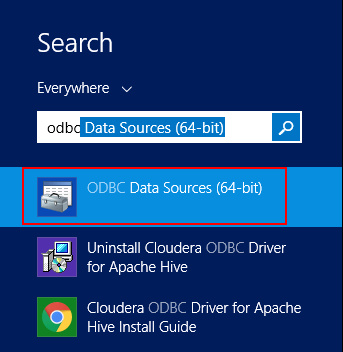
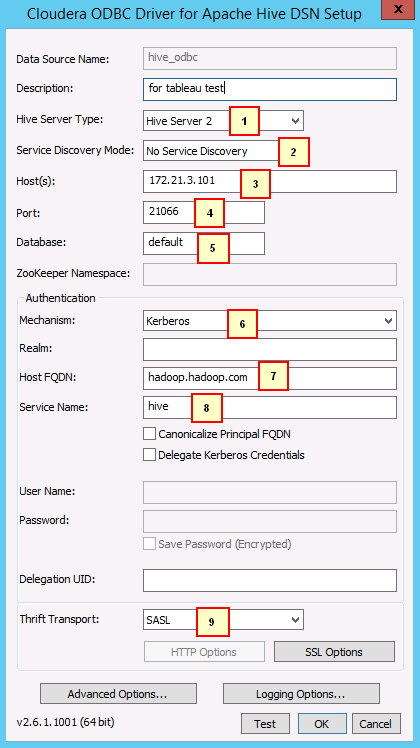
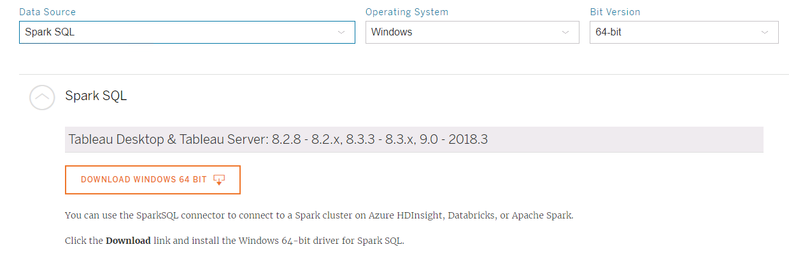
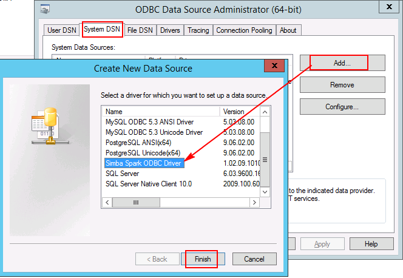

# Connection Instruction between Tableau and FusionInsight

## Succeeded Case

> Tableau 10.0.0 <-> FusionInsight HD V100R002C30
>
> Tableau 10.0.0 <-> FusionInsight HD V100R002C50
>
> Tableau 10.0.0 <-> FusionInsight HD V100R002C60U10
>
> Tableau 10.1.4 <-> FusionInsight HD V100R002C60U20
>
> Tableau 10.3.2 <-> FusionInsight HD V100R002C70SPC200
>
> Tableau 10.5.0 <-> FusionInsight HD V100R002C80SPC100


## Configure the Kerberos on Windows


- Download and install **MIT Kerberos** from the following URL `http://web.mit.edu/kerberos/dist/#kfw-4.0`


- Make sure the time differences between FusionInsight clusters and Tableau client is no longer than 5 minutes.

- Configure required Kerberos filesystem

  Created a user with "Human-Machine" as its type( For detail, take product documentation as a reference ), grant the Hive privileges to this user. For example, create a user named **developuser**, download the **user.keytab** and **krb5.conf** files on the Tableau client, rename the **krb5.conf** file into **krb5.ini** and save it into the following directory `C:\ProgramData\MIT\Kerberos5`

  


- Configure Kerberos cache file

  - Create a directory to save the Kerberos cache file, for example, `C:\temp`

  - Configure the Environment Variables, Variable name is **KRB5CCNAME**, Variable value is **C:\temp\krb5cache**

    

- restart the Tableau client

- Start Kerberos Authentication on Windows

  - use the created username and password to log in, the **Principal** is equal to username@Kerberos Realm name

  - Open **MIT Kerberos**, click on Get Ticket, and type in the right **Principal** and **Password** for authentication

    

    


## Connecting Tableau to Hive

Configure the ODBC interface to connect FusionInsight HiveDriver

  - Download and install the ODBC driver

  Download URL: <http://www.cloudera.com/content/cloudera/en/downloads/connectors/hive/odbc/hive-odbc-v2-5-15.html>

    and choose the right one depends on the OS and bit version

  - Configure ODBC drivers

    Open **ODBC Data Sources(64-bit)** by searching the keyword ODBC on Windows

    

    

    click on **User DSN** tab, click on Add button, choose **Cloudera ODBC Driver for Apache Hive** and click on **Finish** to start to configure

    

    

    ```
    In detail:
    1: Hive Server 2
    2: No Service Discovery
    3: 172.21.3.101
    4: 21006
    5: default
    6: Kerberos
    7: hadoop.hadoop.com
    8: hive
    9: SASL
    ```

  - click on Test button to test the connection

    


- Open Tableau

  Click on More option, and choose ODBC by search in keyword

  

  Connection Configuration shown as bellow:

  

  click on **Connect** and then click on **Sign In**


* Search the Data

    

* Search the data from multiple tables

    


## Connecting Tableau to Spark

- Download and install the ODBC driver for Spark
  Download url<http://www.tableau.com/support/drivers>

  

- Created DSN （Data Source Name）

  Open **ODBC Data Sources(64-bit)**

  Click on **System DSN** tab, click on Add, choose Simba Spark ODBC Driver and click on Finish

  

- Open the installed Driver directory, for example, `C:\Program Files\Simba Spark ODBC Driver\lib` and open the **DriverConfiguration64.exe** to Configure

  

  

  ```
  In detail:
  1：SparkThriftServer (Spark 1.1 and later)
  2: Kerberos
  3: hadoop.hadoop.com
  4: spark
  5: SASL
  ```

  click on **Advanced Options** and choose "Driver Config Take Precedence"

  

  Click on ok to save the configuration

- Open Tableau

  Click on More option, and choose Spark SQL by search in keyword

  

  Connection Configuration shown as bellow:

  

  Server info can be got from FusionInsight Manager Web UI

  

  Port info can be got from FusionInsight Manager Web UI as well

  

  Click on **Sign In** , to come into a new Page, choose **Schema** and **Table** shown as bellow

  


- Open **Sheet** to visulize the data

    

- Performance test


  - Search the table **web_sales** which contains millions of records

    


  - Search the table by multiple tables whose names are store_sales and item

    

    

    Add customer_address table

    

    Test outcome：

    

## FAQ

- Cannot find `C:\ProgramData\MIT\Kerberos5`

  This Folder is hidden, configure the windows can solve it

- Connection succeeded but permission denied

  Use the user who has the privilege to DATABASE
