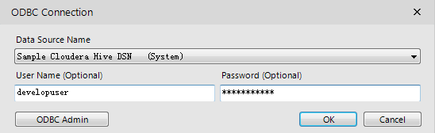
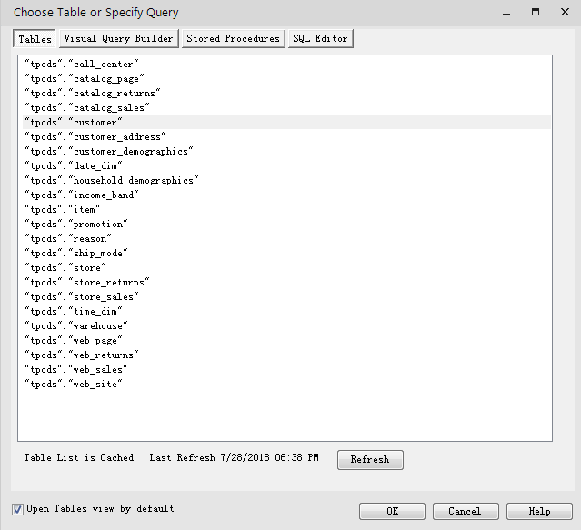

# Alteryx对接FusionInsight

## 适用场景

> Alteryx 2018.2.5.48994 <-> FusionInsight HD V100R002C80SPC200
> Alteryx 2018.2.5.48994 <-> FusionInsight HD 6.5.0

## 配置Windows的kerberos认证

* 下载并安装MIT Kerberos

  下载网址：<http://web.mit.edu/kerberos/dist/#kfw-4.0>

  版本与操作系统位数保持一致，本文版本kfw-4.1-amd64.msi。

* 确认客户端机器的时间与FusionInsight HD集群的时间一致，时间差要小于5分钟

* 设置Kerberos的配置文件

  在FusionInsight Manager创建一个角色与“人机”用户，具体请参见《FusionInsight HD 管理员指南》的创建用户章节。角色需要根据业务需要授予Spark，Hive，HDFS的访问权限，并将用户加入角色。例如，创建用户“developuser”并下载对应的keytab文件user.keytab以及krb5.conf文件，把krb5.conf文件重命名为krb5.ini，并放到`C:\ProgramData\MIT\Kerberos5`目录中。

* 设置Kerberos票据的缓存文件

  * 创建存放票据的目录，例如“C:\temp”。
  * 设置Windows的系统环境变量，变量名为“KRB5CCNAME”，变量值为“C:\temp\krb5cache”。

    

* 重启机器。

* 在Windows上进行认证

  * 使用Kerbers认证的用户名密码登录，用户名的格式为：用户名@Kerberos域名。

  * 打开MIT Kerberos，单击“get Ticket”，在弹出的“MIT Kerberos: Get Ticket”窗口中，“Pricipal”输入用户名，“Password”输入密码，单击“OK”。

    

## 配置Spark ODBC 连接

* 在操作系统中配置Spark ODBC驱动

  * 下载并安装ODBC驱动：<https://www.tableau.com/support/drivers>

    根据操作系统类型选择对应的ODBC版本，下载并安装。

  * 创建DSN(Data Source Name)：选择 **开始** -> **Simba Spark ODBC Driver** -> **ODBC Administrator**。
  * 选择 **System DSN** -> **Add** -> **Simba Spark ODBC Driver** -> **Finish**

    按实际配置相应的变量，

    * Mechanism：Kerberos
    * Host FQDN：hadoop.hadoop.com
    * Service Name：spark2x
    * Realm：留空

           

    * 点击“Advanced Options”，勾选如下选项：    

      

    * 点击OK，保存配置。

    * 点击Test进行测试连接，如果出现下图，则表示Spark ODBC连接成功。

      

* 在Alteryx使用Spark数据源

  * Alteryx启动后选择Options->Advanced Options->Manage In-DB Connections

  * 在弹出的界面中填写配置：    

    * DataSource：Apache Spark ODBC
    * COnnection Type：System
    * Connections: 首次使用选new
    * Connection Name: 自定义
    * Read->Driver：Apache Spark ODBC
    * Write->Driver: 默认
    * Connection String：New database connection，选择Spark DSN填写用户名密码

    

    

  * 新建一个workflow，拖入Input Data工具，在左侧Connect a file or database 中点击下拉菜单，选择Other Databases->ODBC->Simba Spark

    

  * Data Source Name 选择在配置ODBC驱动时新建的Spark DSN：Simba Spark （System），填入用户名密码：

    

  * 点击OK，Alteryx会连接至集群,在弹出的对话框中显示的是集群中Spark中的数据表，选择一个数据表作为输入，例如Customer

    

  * 导入成功后显示如下,Refresh之后在左侧可以看到数据预览：

    

  * 再添加一个数据源，执行join操作，成功后结果如下：

    

## 配置Hive ODBC数据源

* 下载并安装Hive的ODBC驱动
  ODBC驱动下载地址：[下载地址](http://www.cloudera.com/content/cloudera/en/downloads/connectors/hive/odbc/hive-odbc-v2-5-15.html)

* 创建DSN(Data Source Name)：选择 **开始** -> **Simba Spark ODBC Driver** -> **ODBC Administrator**。
* 选择 **System DSN** -> **Add** -> **Cloudera ODBC Driver for Apache Hive** -> **Finish**

* 按实际配置相应的变量

* Host(s): Hive Service主节点
  - Port：Hive Service端口21066
  - Mechanism：Kerberos
  - Host FQDN：hadoop.hadoop.com
  - Service Name：hive
  - Realm：留空

  如下图：

  

> Advanced Options不需要进行配置默认的参数即可连接成功。

 * 点击Test进行测试连接，如果出现下图，则表示ODBC连接Hive成功。

    

* Alteryx使用Hive数据源

  * Alteryx启动后选择Options->Advanced Options->Manage In-DB Connections

  * 在弹出的界面中填写配置：    

    * DataSource：Hive
    * Connection Type：System
    * Connections: 首次使用选new
    * Connection Name: 自定义
    * Read->Driver：Hive ODBC
    * Write->Driver: Hive ODBC
    * Connection String：New database connection，选择Hive DSN，填写用户名密码

    

    

  * 在主界面新建一个workflow，拖入Input Data工具，在左侧Connect a file or database 中点击下拉菜单，选择Other Databases->ODBC

    

  * Data Source Name 选择在配置ODBC驱动时新建的Hive DSN：Sample Cloudera Hive DSN(System)，填入用户名密码：

    

  * 点击OK，Alteryx会连接至集群,在弹出的对话框中显示的是集群中Hive中的数据表，选择一个数据表作为输入，例如Customer：

    

  * 导入成功后显示如下,Refresh之后在左侧可以看到数据预览：

    

   * 再添加一个数据源，执行join操作，成功后结果如下：

    

##配置HDFS数据源

  * HDFS是通过WebHDFS连接，前提条件是获取MIT Kerberos Ticket，并在Manager中修改HDFS的配置：
    dfs.http.policy 修改为HTTP_AND_HTTPS，重启HDFS。

  * 在Alteryx主界面新建一个workflow，拖入Input Data工具，在左侧Connect a file or database 中点击下拉菜单，选择Hadoop

  * 在弹出的界面中填写配置：    

    * Server：WebHDFS
    * Host： HDFS所在服务器IP
    * Port: 配置文件中dfs.namenode.http.port对应端口
    * User Name & Password： Kerberos 认证用户名及密码
    * Kerberos: Kerberos MIT

    

  * 点击Test，出现Connection successful 表明连接成功。

    

  * 弹出集群中的HDFS文件系统内容，目前支持Avro和CSV格式的文件，需上传至HDFS文件系统中。

    

  * 选择相应文件，连接成功，Refresh之后左侧菜单显示文件内容预览：

    

  * Join 操作成功后显示如下:

    

## FAQ

* 找不到C:\ProgramData\MIT\Kerberos5文件夹

  C:\ProgramData一般属于隐藏文件夹，设置文件夹隐藏可见或者使用搜索功能即可解决问题。

* 连接成功无数据库权限

  连接所使用的用户需要有数据库的权限，否则将导致ODBC连接成功却无法读取数据库内容。

* 测试连接时出现Default Kerberos ticket is expired

  Kerberos MIT ticket 过期，需要重新获得，获取一次有效期为10h.
