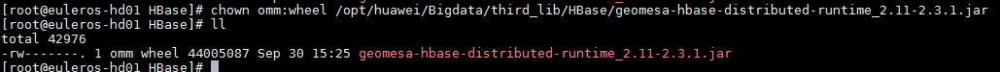
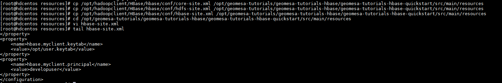
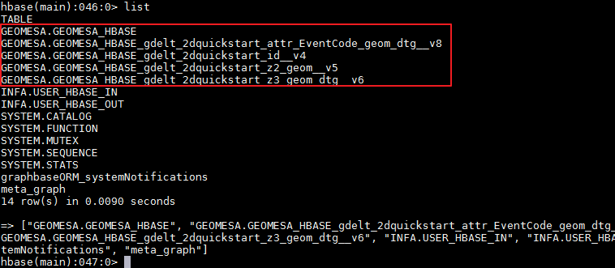
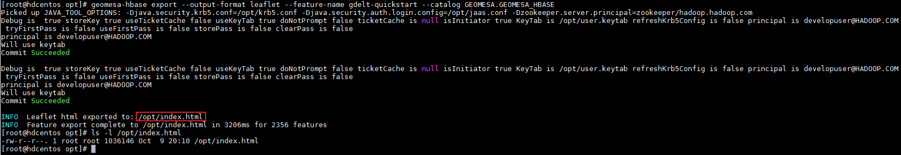
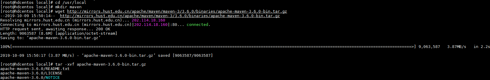
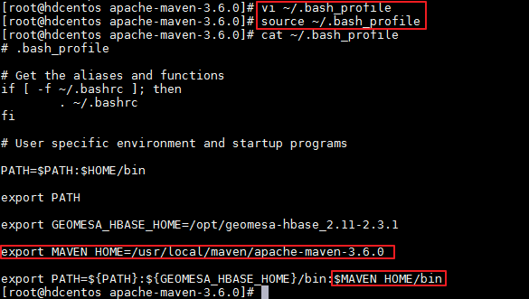
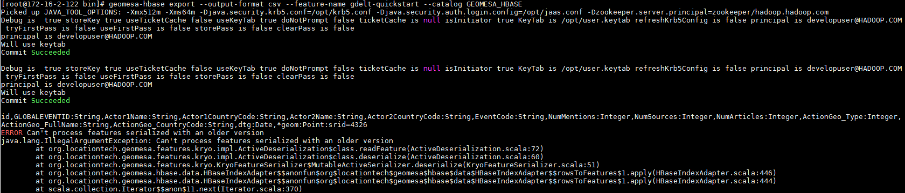

# GeoMesa对接FusionInsight

## 适用场景

> GeoMesa 2.3.1  <--> FusionInsight HD 6.5 (HBase)

## 简介

GeoMesa是Apache开源工具套件，可在分布式计算系统上进行大规模地理空间分析，使您可以管理和分析巨大时空数据集，例如IoT，社交媒体，跟踪和移动电话等应用程序。

GeoMesa在流行的分布式数据库之上提供时空数据持久性来实现对点，线和面数据的大规模存储。它允许通过充分利用地理属性来指定距离和区域的查询来快速访问此数据。通过诸如GeoServer之类的地理信息服务器，GeoMesa通过支持通过标准OGC（开放地理空间联盟）API和协议（例如WFS和WMS）访问其数据库和流功能，从而促进了与现有地图客户端的集成。这些界面还使GeoMesa可以驱动地图用户界面并提供数据以进行分析，例如查询，直方图，热图和时间序列分析。

本文档主要描述在Linux操作系统，GeoMesa HBase对接FusionInsight HD的HBase组件。

## 准备工作

* 登录FusionInsight Manager创建一个“人机”用户，例如：developuser，具体请参见FusionInsight HD产品文档的`管理员指南->系统设置->权限设置->用户管理->创建用户`章节。给developuser用户授予所有访问权限，包含但不限于HBase。

* 已完成FusionInsight HD客户端安装，具体请参见FusionInsight HD产品文档的`应用开发指南->安全模式->安全认证->配置客户端文件`章节。本文使用的安装目录为`/opt/hadoopclient`。

* 客户端机器的时间与FusionInsight HD集群的时间要保持一致，时间差小于5分钟。

* 登录FusionInsight Manager的`系统->用户->更多（developuser）->下载认证凭证`，下载developuser对应的认证凭证。将用户的 **krb5.conf** 和 **user.keytab** 文件拷贝到`/opt`目录下。

* 在`/opt`目录下新建 **jaas.conf** 文件，示例如下：
  ```
  Client {
    com.sun.security.auth.module.Krb5LoginModule required
    useKeyTab=true
    keyTab="/opt/user.keytab"
    principal="developuser"
    useTicketCache=false
    storeKey=true
    debug=true;
  };
  ```

## 安装部署GeoMesa HBase

### 操作场景

在已安装FusionInsight HD客户端的节点安装部署GeoMesa HBase。

### 前提条件

* 已完成准备工作。

### 操作步骤

* 从Github下载已经编译好的二进制文件，例如：`wget "https://github.com/locationtech/geomesa/releases/download/geomesa_2.11-$VERSION/geomesa-hbase_2.11-$VERSION-bin.tar.gz"`，解压至目标目录`/opt`。

  ```
  cd /opt
  wget "https://github.com/locationtech/geomesa/releases/download/geomesa_2.11-2.3.1/geomesa-hbase_2.11-2.3.1-bin.tar.gz"
  tar -xvf geomesa-hbase_2.11-2.3.1-bin.tar.gz
  ```
  >说明：
  >
  > * 如果wget未安装，可以执行“yum install wget”进行安装。
  >
  > * 本文使用的“$VERSION”为 2.3.1。
  >
  > * 可以选择从<https://github.com/locationtech/geomesa/releases>下载相应版本的geomesa-hbase_2.11-$VERSION-bin.tar.gz再上传至安装节点的`/opt`目录。

* 部署GeoMesa Distributed Runtime JAR

  * 将`/opt/geomesa-hbase_2.11-2.3.1/dist/hbase/geomesa-hbase-distributed-runtime_2.11-2.3.1.jar`拷贝至FusionInsight的HBase组件的每个RegionServer节点的HBase第三方jar包管理目录，示例如下所示：

    ```
     scp /opt/geomesa-hbase_2.11-2.3.1/dist/hbase/geomesa-hbase-distributed-runtime_2.11-2.3.1.jar root@172.16.4.21:/opt/huawei/Bigdata/third_lib/HBase/
     scp /opt/geomesa-hbase_2.11-2.3.1/dist/hbase/geomesa-hbase-distributed-runtime_2.11-2.3.1.jar root@172.16.4.22:/opt/huawei/Bigdata/third_lib/HBase/
     scp /opt/geomesa-hbase_2.11-2.3.1/dist/hbase/geomesa-hbase-distributed-runtime_2.11-2.3.1.jar root@172.16.4.23:/opt/huawei/Bigdata/third_lib/HBase/
    ```

    >说明：FusionInsight的HBase组件的RegionServer节点的IP分别为172.16.4.21、172.16.4.22、172.16.4.23。

    

  * 登录FusionInsight的HBase组件的每个RegionServer节点，修改“geomesa-hbase-distributed-runtime_2.11-2.3.1.jar”的所有者和组为 **omm:wheel**。

    **其中一个集群节点修改示例如下：**

    ```
    chown omm:wheel /opt/huawei/Bigdata/third_lib/HBase/geomesa-hbase-distributed-runtime_2.11-2.3.1.jar
    ```

    

  * 登录FusionInsight Manage重启HBase服务。

    

* 配置GeoMesa、Hadoop和HBase的环境变量以便能够使用HBase命令行工具 **geomesa-hbase**。

  ```
  vi ~/.bash_profile
  ```
  **增加的环境变量示例如下：**

  ```
  export GEOMESA_HBASE_HOME=/opt/geomesa-hbase_2.11-2.3.1
  export PATH=${PATH}:${GEOMESA_HBASE_HOME}/bin
  export JAVA_TOOL_OPTIONS="-Djava.security.krb5.conf=/opt/krb5.conf -Djava.security.auth.login.config=/opt/jaas.conf -Dzookeeper.server.principal=zookeeper/hadoop.hadoop.com"
  ```

  执行 **source** 命令使GeoMesa、Hadoop和HBase的环境变量生效。
  ```
  source ~/.bash_profile
  source /opt/hadoopclient/bigdata_env
  echo $GEOMESA_HBASE_HOME $HADOOP_HOME $HBASE_HOME $JAVA_TOOL_OPTIONS
  ```

  

## 调试GeoMesa样例脚本

### 操作场景

在安装部署GeoMesa HBase的节点调试GeoMesa的样例脚本geomesa-tutorials-hbase-quickstart。

### 前提条件

* 已完成安装部署GeoMesa HBase。

* 已安装Maven。

### 操作步骤

* 下载GeoMesa的样例脚本。**必须下载与GeoMesa版本相对应的版本。**

  ```
  cd /opt
  git clone https://github.com/geomesa/geomesa-tutorials.git
  cd geomesa-tutorials
  git checkout tags/geomesa-tutorials-2.3.1 -b geomesa-tutorials-2.3.1
  ```

  

  >说明：如果git未安装，可以执行“yum install git”进行安装。

* 修改`/opt/geomesa-tutorials/pom.xml`的zookeeper版本为FusionInsight使用的相同版本，例如 **<zookeeper.version>3.5.1</zookeeper.version>**。

  

* 将FusionInsight的HBase组件相关的core-site.xml、hdfs-site.xml和hbase-site.xml拷贝至`/opt/geomesa-tutorials/geomesa-tutorials-hbase/geomesa-tutorials-hbase-quickstart/src/main/resources`目录。

  ```
  cp /opt/hadoopclient/HBase/hbase/conf/core-site.xml /opt/geomesa-tutorials/geomesa-tutorials-hbase/geomesa-tutorials-hbase-quickstart/src/main/resources
  cp /opt/hadoopclient/HBase/hbase/conf/hdfs-site.xml /opt/geomesa-tutorials/geomesa-tutorials-hbase/geomesa-tutorials-hbase-quickstart/src/main/resources
  cp /opt/hadoopclient/HBase/hbase/conf/hbase-site.xml /opt/geomesa-tutorials/geomesa-tutorials-hbase/geomesa-tutorials-hbase-quickstart/src/main/resources
  vi /opt/geomesa-tutorials/geomesa-tutorials-hbase/geomesa-tutorials-hbase-quickstart/src/main/resources/hbase-site.xml

  ```

* 在`/opt/geomesa-tutorials/geomesa-tutorials-hbase/geomesa-tutorials-hbase-quickstart/src/main/resources/hbase-site.xml`新增属性 **hbase.geomesa.principal** 和 **hbase.geomesa.keytab**。

  ```
  <property>
      <name>hbase.geomesa.principal</name>
      <value>developuser</value>
  </property>
  <property>
      <name>hbase.geomesa.keytab</name>
      <value>/opt/user.keytab</value>
  </property>
  ```

  

* 运行以下命令构建“geomesa-tutorials-hbase”工程。

  ```
  cd /opt/geomesa-tutorials
  mvn clean install -pl geomesa-tutorials-hbase/geomesa-tutorials-hbase-quickstart -am
  ```

  

  >说明：必须在`/opt/geomesa-tutorials`目录执行“mvn clean install”命令，否则会返回“[ERROR] Could not find the selected project in the reactor: geomesa-tutorials-hbase/geomesa-tutorials-hbase-quickstart”
  >
  >

* 如果构建过程中返回“Failed to execute goal on project geomesa-tutorials-hbase: Could not resolve dependencies for project org.geomesa.example:geomesa-tutorials-hbase:pom:2.3.1: Could not find artifact org.apache.zookeeper:zookeeper:jar:3.5.1 in locationtech-releases (https://repo.locationtech.org/content/groups/releases) ”，则
  将`/opt/hadoopclient/HBase/hbase/lib/zookeeper-3.5.1.jar`拷贝至`/root/.m2/repository/org/apache/zookeeper/zookeeper/3.5.1`再重新构建“geomesa-tutorials-hbase-quickstart”工程。

  ```
  mkdir -p /root/.m2/repository/org/apache/zookeeper/zookeeper/3.5.1
  cp /opt/hadoopclient/HBase/hbase/lib/zookeeper-3.5.1.jar /root/.m2/repository/org/apache/zookeeper/zookeeper/3.5.1
  mvn clean install -pl geomesa-tutorials-hbase/geomesa-tutorials-hbase-quickstart -am

  ```

  

  >说明：如果构建过程中没有返回错误，也需要操作此步骤。

* 构建工程成功则返回如下结果：

  

* 执行以下命令运行“geomesa-tutorials-hbase”工程。

  ```
  java -cp /opt/geomesa-tutorials/geomesa-tutorials-hbase/geomesa-tutorials-hbase-quickstart/target/geomesa-tutorials-hbase-quickstart-2.3.1.jar org.geomesa.example.hbase.HBaseQuickStart --namespace GEOMESA --hbase.catalog GEOMESA.GEOMESA_HBASE
  ```

  返回结果如下则表示成功：

  

* 登录FusionInsight客户端，使用hbase shell查询新建五张表。

  ```
  hbase shell
  list
  ```

  

## GeoMesa数据可视化

### 操作场景

使用GeoMesa HBase工具发行版的 **geomesa-hbase export** 命令显示GeoMesa样例脚本提取的数据。

### 前提条件

* GeoMesa样例脚本已调试成功。

### 操作步骤

* 执行以下命令

  ```
  cd /opt
  geomesa-hbase export --output-format leaflet --feature-name gdelt-quickstart --catalog GEOMESA.GEOMESA_HBASE
  ```

  

* 下载 **geomesa-hbase export** 命令产生的`/opt/index.html`文件，并用浏览器打开。

  

## FAQ

* **如何安装Maven**

    **【问题描述】**

    执行`mvn clean install -pl geomesa-tutorials-hbase/geomesa-tutorials-hbase-quickstart -am`时返回“mvn: command not found”。

    

    **【解决方法】**

    * 执行以下命令在`/usr/local`目录下安装maven。

      ```
      cd /usr/local
      wget http://mirrors.hust.edu.cn/apache/maven/maven-3/3.6.0/binaries/apache-maven-3.6.0-bin.tar.gz
      tar -xvf apache-maven-3.6.0-bin.tar.gz
      ```

      

    * 配置Maven的环境变量。

      ```
      vi ~/.bash_profile
      ```

      **增加的环境变量示例如下：**

      ```
      export MAVEN_HOME=/usr/local/apache-maven-3.6.0
      export PATH=${PATH}:${GEOMESA_HBASE_HOME}/bin:$MAVEN_HOME/bin
      ```

      执行 **source** 命令使环境变量生效。
      ```
      source ~/.bash_profile
      ```

      

* **运行`org.geomesa.example.hbase.HBaseQuickStart`时返回java.lang.NoClassDefFoundError: org/apache/zookeeper/Watcher**

  **【问题描述】**

  执行`java -Djava.security.krb5.conf=/opt/krb5.conf -Djava.security.auth.login.config=/opt/jaas.conf -Dzookeeper.server.principal=zookeeper/hadoop.hadoop.com -cp geomesa-tutorials-hbase/geomesa-tutorials-hbase-quickstart/target/geomesa-tutorials-hbase-quickstart-2.3.1.jar org.geomesa.example.hbase.HBaseQuickStart --namespace GEOMESA --hbase.catalog GEOMESA.GEOMESA_HBASE`时返回“java.lang.NoClassDefFoundError: org/apache/zookeeper/Watcher”。

  **【解决方法】**

  不能使用开源的zookeeper.jar包，必须使用FusionInsight使用的zookeeper的jar包。将`/opt/hadoopclient/HBase/hbase/lib/zookeeper-3.5.1.jar`拷贝至`/root/.m2/repository/org/apache/zookeeper/zookeeper/3.5.1`再重新构建“geomesa-tutorials-hbase-quickstart”工程。操作示例如下所示：

  ```
  mkdir -p /root/.m2/repository/org/apache/zookeeper/zookeeper/3.5.1
  cp /opt/hadoopclient/HBase/hbase/lib/zookeeper-3.5.1.jar /root/.m2/repository/org/apache/zookeeper/zookeeper/3.5.1
  cd /opt/geomesa-tutorials
  mvn clean install -pl geomesa-tutorials-hbase/geomesa-tutorials-hbase-quickstart -am

  ```

* **运行`geomesa-hbase export`命令时返回Can't process features serialized with an older version**

  **【问题描述】**

  GeoMesa版本的版本为2.3.1，GeoMesa HBase的样例脚本的版本为2.4.0。执行`geomesa-hbase export --output-format leaflet --feature-name gdelt-quickstart --catalog GEOMEA_HBASE`时返回java.lang.IllegalArgumentException: Can't process features serialized with an older version。

  

  **【解决方法】**

  下载GeoMesa的样例脚本时确保下载与GeoMesa HBase版本相对应的版本。如果不是相同版本，执行 **git checkout** 命令切换样例脚本版本与GeoMesa HBase版本一致。

  ```
  cd /opt/geomesa-tutorials
  git checkout tags/geomesa-tutorials-2.3.1 -b geomesa-tutorials-2.3.1
  ```
