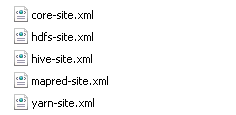
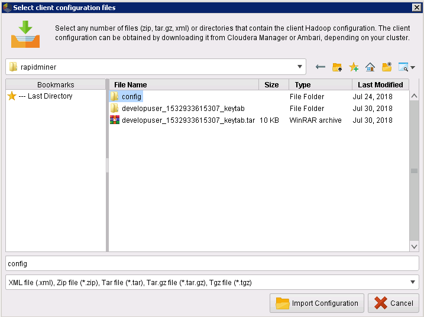
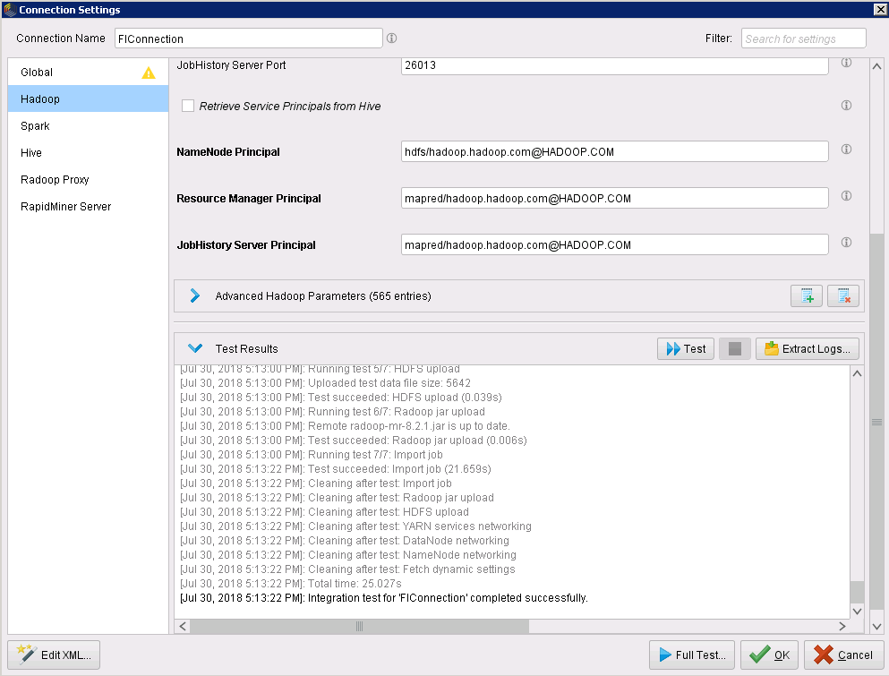
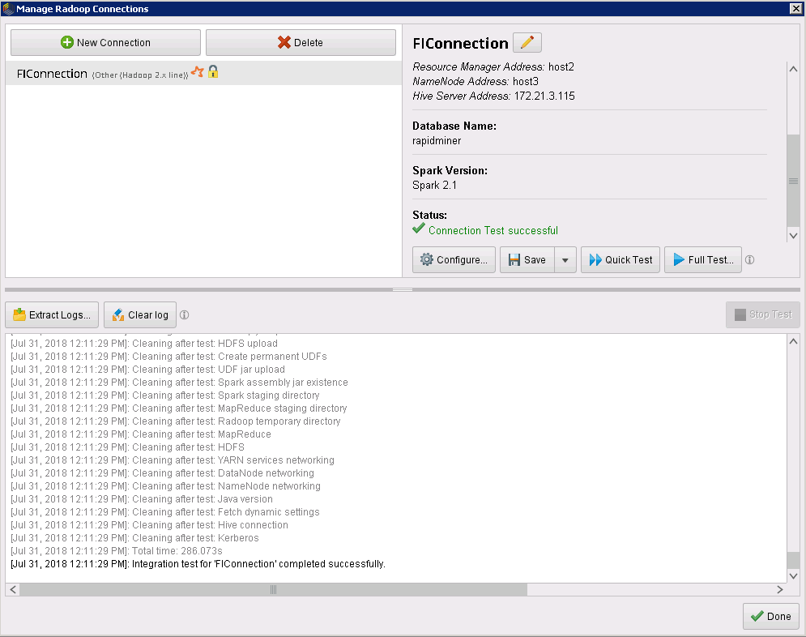

# Connection between RapidMiner with FusionInsightHD

##  Succeeded Case

> Rapidminer Studio 8.2.001 <--> FusionInsight HD V100R002C80SPC200 (HDFS/Hive/MapReduce/Spark)

##preparation

  * Download and install RapidMiner Studio, download site <https://rapidminer.com/>
  * Start rapidminer, on the top of the main menu, choose `Extensions->Marketplace`,type `radoop`,install it and restart rapidminer
  * Configure the local host file，file path is `C:\Windows\System32\drivers\etc`，add the cluster node ip and host name and save the file.
  * Configure Kerberos file

    Created a user with "Human-Machine" as its type( For detail, take product documentation as a reference ), grant the Hive, Spark,HDFS privileges to this user. For example, create a user named **developuser**, download the **user.keytab** and **krb5.conf** of the user and save them in your computer.

  * Prepare the FusionInsight client configuration filesystem and jar files

    * In the Manager GUI，choose `Service->Download Client->Only Configuration File`

      

    * Unzip the file,find the following files,copy them into a directory,like `../config`.

      

     - Open `yarn-site.xml`,delete the following property:
     ```
     <property>
     <name>audit.service.name</name>
     <value>Yarn</value>
     </property>
     ```
    * Login to one of the cluster nodes, go to the following path`\FusionInsight_Services_ClientConfig\Spark2x\FusionInsight-Spark2x-2.1.0.tar.gz\spark\jars`,download the file directory `/jars`,save it in your computer,like`C:/jars`。

##Configure the cluster

  * Bind the UDP port

    - Download the UDP port bind tool `uredir`,website is <https://github.com/troglobit/uredir>
    - After building and installing, we get the executing file `uredir`,upload it to the KDC server nodes in the cluster,and run the following command,here IP refers to the node ip.
      ```
      ./uredir IP:88 IP:21732
      ```

  * Configure Radoop Jars
    - Download Radoop jars in this address<https://docs.rapidminer.com/latest/radoop/installation/operation-and-maintenance.html>,get the correct version。

      

    - Upload the jar files to each node of the cluster,eg,`/usr/local/lib/radoop/`

    - In the HiveServer node of the cluster,uplaod the Radoop jar files to the following path and change their owner and execution authority
      ```
      cd /opt/huawei/Bigdata/FusionInsight_HD_V100R002C80SPC200/install/FusionInsight-Hive-1.3.0/hive-1.3.0/lib
      chown omm:wheel radoop_hive-v4.jar
      chown omm:wheel rapidminer_libs-8.2.0.jar
      chmod 700 radoop_hive-v4.jar
      chmod 700 rapidminer_libs-8.2.0.jar

      cd /opt/huawei/Bigdata/FusionInsight_HD_V100R002C80SPC200/install/FusionInsight-Hadoop-2.7.2/hadoop/share/hadoop/mapreduce/lib
      chown omm:ficommon radoop_hive-v4.jar
      chown omm:ficommon rapidminer_libs-8.2.0.jar
      chmod 750 radoop_hive-v4.jar
      chmod 750 rapidminer_libs-8.2.0.jar
     ```
  * In the FusionInsight Manager GUI, choose `Service->Hive->Service Configuration`add the following configuration

    ```
    radoop\.operation\.id|mapred\.job\.name|hive\.warehouse\.subdir\.inherit\.perms|hive\.exec\.max\.dynamic\.partitions|hive\.exec\.max\.dynamic\.partitions\.pernode|spark\.app\.name
    ```
    
    - Notice that there should be a `|` as seperater

   * Save the configuration，restart HiveServer

  * Create Radoop UDF functions

    - Run the following command in the client node, login to the Hive database
        ```
        source /opt/hadoopclient、bigdata_env
        kinit developuser
        beeline
        ```

    -   create a database in Hive, for example `rapidminer`, and create functions,run the following commands in beeline mode
        ```
        create database rapidminer;
        use rapidminer;
        DROP FUNCTION IF EXISTS r3_add_file;
        DROP FUNCTION IF EXISTS r3_apply_model;
        DROP FUNCTION IF EXISTS r3_correlation_matrix;
        DROP FUNCTION IF EXISTS r3_esc;
        DROP FUNCTION IF EXISTS r3_gaussian_rand;
        DROP FUNCTION IF EXISTS r3_greatest;
        DROP FUNCTION IF EXISTS r3_is_eq;
        DROP FUNCTION IF EXISTS r3_least;
        DROP FUNCTION IF EXISTS r3_max_index;
        DROP FUNCTION IF EXISTS r3_nth;
        DROP FUNCTION IF EXISTS r3_pivot_collect_avg;
        DROP FUNCTION IF EXISTS r3_pivot_collect_count;
        DROP FUNCTION IF EXISTS r3_pivot_collect_max;
        DROP FUNCTION IF EXISTS r3_pivot_collect_min;
        DROP FUNCTION IF EXISTS r3_pivot_collect_sum;
        DROP FUNCTION IF EXISTS r3_pivot_createtable;
        DROP FUNCTION IF EXISTS r3_score_naive_bayes;
        DROP FUNCTION IF EXISTS r3_sum_collect;
        DROP FUNCTION IF EXISTS r3_which;
        DROP FUNCTION IF EXISTS r3_sleep;
        CREATE FUNCTION r3_add_file AS 'eu.radoop.datahandler.hive.udf.GenericUDFAddFile';
        CREATE FUNCTION r3_apply_model AS 'eu.radoop.datahandler.hive.udf.GenericUDTFApplyModel';
        CREATE FUNCTION r3_correlation_matrix AS 'eu.radoop.datahandler.hive.udf.GenericUDAFCorrelationMatrix';
        CREATE FUNCTION r3_esc AS 'eu.radoop.datahandler.hive.udf.GenericUDFEscapeChars';
        CREATE FUNCTION r3_gaussian_rand AS 'eu.radoop.datahandler.hive.udf.GenericUDFGaussianRandom';
        CREATE FUNCTION r3_greatest AS 'eu.radoop.datahandler.hive.udf.GenericUDFGreatest';
        CREATE FUNCTION r3_is_eq AS 'eu.radoop.datahandler.hive.udf.GenericUDFIsEqual';
        CREATE FUNCTION r3_least AS 'eu.radoop.datahandler.hive.udf.GenericUDFLeast';
        CREATE FUNCTION r3_max_index AS 'eu.radoop.datahandler.hive.udf.GenericUDFMaxIndex';
        CREATE FUNCTION r3_nth AS 'eu.radoop.datahandler.hive.udf.GenericUDFNth';
        CREATE FUNCTION r3_pivot_collect_avg AS 'eu.radoop.datahandler.hive.udf.GenericUDAFPivotAvg';
        CREATE FUNCTION r3_pivot_collect_count AS 'eu.radoop.datahandler.hive.udf.GenericUDAFPivotCount';
        CREATE FUNCTION r3_pivot_collect_max AS 'eu.radoop.datahandler.hive.udf.GenericUDAFPivotMax';
        CREATE FUNCTION r3_pivot_collect_min AS 'eu.radoop.datahandler.hive.udf.GenericUDAFPivotMin';
        CREATE FUNCTION r3_pivot_collect_sum AS 'eu.radoop.datahandler.hive.udf.GenericUDAFPivotSum';
        CREATE FUNCTION r3_pivot_createtable AS 'eu.radoop.datahandler.hive.udf.GenericUDTFCreatePivotTable';
        CREATE FUNCTION r3_score_naive_bayes AS 'eu.radoop.datahandler.hive.udf.GenericUDFScoreNaiveBayes';
        CREATE FUNCTION r3_sum_collect AS 'eu.radoop.datahandler.hive.udf.GenericUDAFSumCollect';
        CREATE FUNCTION r3_which AS 'eu.radoop.datahandler.hive.udf.GenericUDFWhich';
        CREATE FUNCTION r3_sleep AS 'eu.radoop.datahandler.hive.udf.GenericUDFSleep';
        ```

##RapidMiner Configuration

  * In RapidMiner sStadio，choose `Connections->Manage Radoop Connections` in the top menu.
  * choose `New Connections->Import Hadoop Configuration Files`,choose the configuration files downloaded from the cluster,click `Import Configuration`

    

  * After the import, click `Next`, go to the Connection settings window,configure ad following:

    * Global：
      - Hadoop Version：Other（Hadoop 2X line）
      - Additional Libraries Directory: Spark jar files downloaded from the cluster
      - Client Principal: `Kerberos user name`@HADOOP.com
      - Keytab File: the keytab file downloaded from manager
      - KDC Address: the KDC server IP(see the krb5.conf file)
      - REALM: HADOOP.COM
      - Kerberos Config File: the krb5 file downloaded from manager

      

    * Hadoop：
      - At the filter in upper right corner, search `split` , uncheck `mapreduce.input.fileinputformat.split.maxsize`

        

      - Search `classpath`,uncheck`mapreduce.application.classpath`

        

    * Spark：
      - Spark Version：Spark2.1
      - Spark Archive(or libs)Path: local:///opt/huawei/Bigdata/FusionInsight_Spark2x_V100R002C80SPC200/install/FusionInsight-Spark2x-2.1.0/spark/jars
      - Spark Resource Allocation Policy：Static，Default Configuration
      - Advanced Spark Parameters：add the following two parameters for spark:`park.driver.extraJavaOptions` and `spark.executor.extraJavaOptions`

        

      - The value can be found in manager GUI, choose `Services->Spark2X Configuration->type all`，search `extraJavaOptions` in the search bar, choose the parameters in `Spark2x->SparkResource2x`
        

      - Copy the values into a text file, replace the relative path `./`in the value with absolute path in the cluster, like `/opt/huawei/Bigdata/FusionInsight_Spark2x_V100R002C80SPC200/1_21_SparkResource2x/etc`, then copy the values into rapidminer spark configuration

        

    * Hive:
      - Hive Version: Hive Server2
      - Hive Server Address：Hive Server IP
      - Hive Port: 21066
      - Database Name: the database name created in Hive,here is rapidminer
      - Customer database for UDFs: same as before

      

    * click `OK->Proced Anyway->Save`

##Test the Connection

  * Click Configure, in Global tab, click Test，Test Results show as following:

    

  * In Hadoop tab，click Test,Test Results show as following:

    

  * In Spark tab,click Test,Test Results show as following:

    

  * In Hive tab, click Test, Test Results show as following:

    

  * Click Full test,Test Results show as following:

    

##Radoop Demo
  * In RapidMiner Studio main menu,choose `Help->Tutorials->User Hadoop->Rapidminer Radoop`
    - Run the demo accordding to the Tutorials, get the follwing results

    
