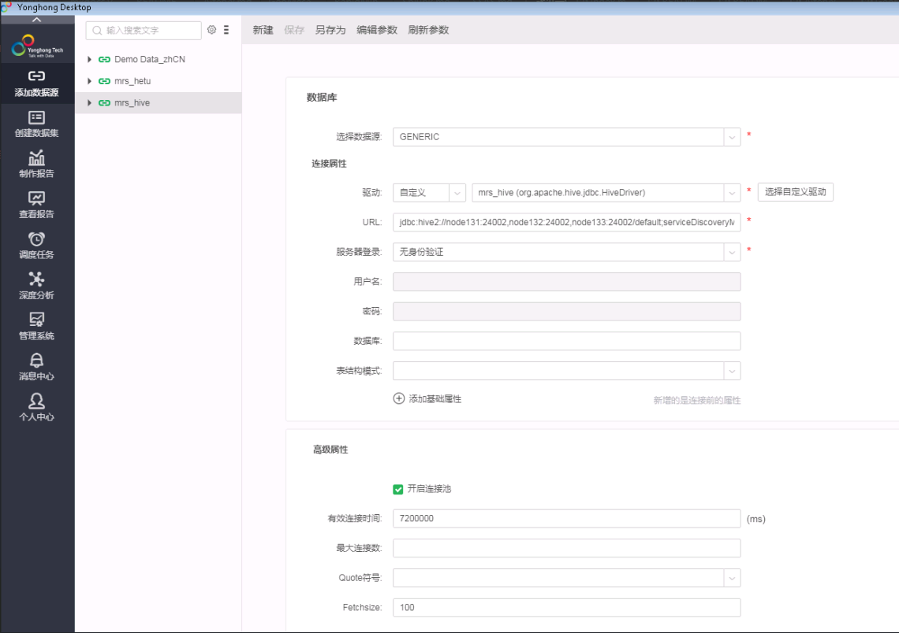
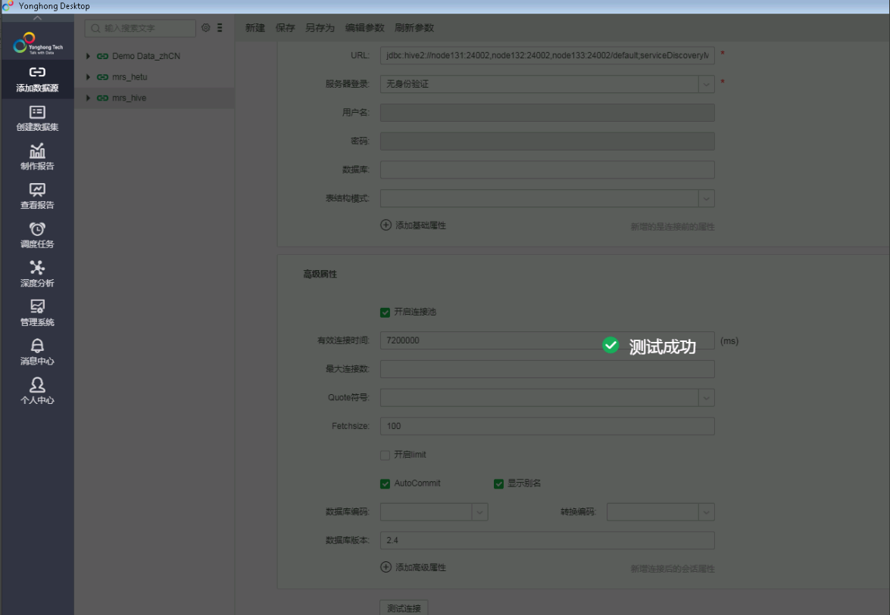

# 永洪一站式大数据分析平台对接FusionInsight

## 适用场景

> 永洪一站式大数据分析平台 7.1 <--> FusionInsight HD V100R002C60U20 (Hive/SparkSQL)
>
> 永洪一站式大数据分析平台 8.7 <--> FusionInsight MRS 8.0 (Hive)

说明： 永洪BI本文使用windows部署模式，如果是使用Linux部署模式需要官方License，没有测试

## 对接参数配置

  

  jdbc连接url为：
  ```
  jdbc:hive2://node131:24002,node132:24002,node133:24002/default;serviceDiscoveryMode=zooKeeper;zooKeeperNamespace=sparkthriftserver2x;saslQop=auth-conf;auth=KERBEROS;principal=spark2x/hadoop.hadoop.com@HADOOP.COM;user.principal=developuser;user.keytab=E:/ecotesting_mrs/Fiber/conf/user.keytab
  ```

  如果是mrs 8.0版本，则需要的驱动jar包为 客户端路径\Hive\jdbc下所有jar包加上如下额外三个jar包（如果缺少的话）
  ```
  commons-lang-2.6.jar
  zookeeper-jute-3.5.6-hw-ei-302002.jar
  commons-collections-3.2.2.jar
  ```

  连接测试：

  

## HIVE查询结果

  
