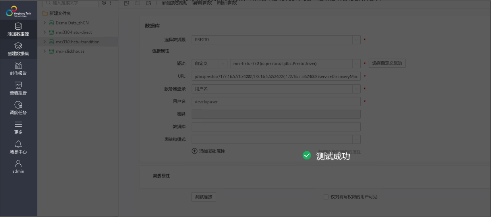
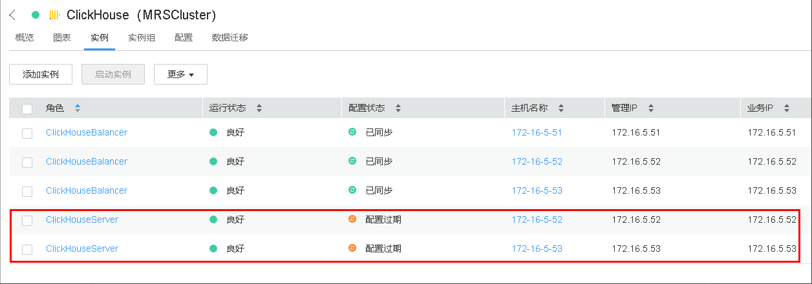

# 永洪一站式大数据分析平台对接FusionInsight

## 适用场景

> 永洪一站式大数据分析平台 7.1 <--> FusionInsight HD V100R002C60U20 (Hive/SparkSQL)
>
> 永洪一站式大数据分析平台 8.7 <--> FusionInsight MRS 8.0 (Hive/Hetu)
>
> 永洪一站式大数据分析平台 9.2.1 <--> FusionInsight MRS 8.1.0 (Hive/Hetu/Clickhouse)

## 永洪配置（需要链接zk的情况）

- 确保永洪主机同mrs集群时间差不超过5分钟

- 修改永洪主机/etc/hosts文件，将对接集群加入主机名配置

  

- 修改配置文件`/opt/Yonghong_z-Suite/tomcat/bin/catalina.sh`

  

  增加的jvm配置参数为

  ```
  -Djava.security.krb5.conf=/optM/hetu/krb5.conf -Djava.security.auth.login.config=/opt/hetu/jaas.conf -Dzookeeper.server.principal=zookeeper/hadoop.hadoop.com -Dzookeeper.sasl.clientconfig=Client -Dzookeeper.auth.type=kerberos
  ```

  其中/opt/hetu/jaas.conf配置文件内容：

  ```
  Client {
  com.sun.security.auth.module.Krb5LoginModule required
  useKeyTab=true
  keyTab="/opt/hetu/user.keytab"
  principal="developuser"
  useTicketCache=false
  storeKey=true
  debug=true;
  };
  ```

- 重启永洪bi
  ```
  cd /opt/Yonghong_z-Suite/tomcat/bin
  sh shutdown.sh
  sh startup.sh
  ```

## 配置对接hive

前提条件：完成第一部分《永洪配置（需要链接zk的情况）》配置

- 登录永洪界面配置链接：

  

  ```
  1: GENERIC
  2: 选择自定义驱动，上传MRS hive客户端jdbc驱动包，具体配置见说明
  3： jdbc:hive2://172.16.5.51:24002,172.16.5.52:24002,172.16.5.53:24002/;serviceDiscoveryMode=zooKeeper;zooKeeperNamespace=hiveserver2;sasl.qop=auth-conf;auth=KERBEROS;principal=hive/hadoop.hadoop.com@HADOOP.COM;user.principal=developuser;user.keytab=/opt/hetu/user.keytab
  4： 无身份验证
  ```

  说明：
  1. user.keytab, krb5.conf文件为对应用户的认证文件，请从MRS manager下载

  2. hive自定义驱动包配置如下

    

    从MRS客户端（/opt/client/Hive/Beeline/lib/jdbc）获取jar包本地上传，注意要删除该路径下的jdbc_pom.xml文件

- 测试连接：

  

- 查看数据：

  

## 对接HetuEngine(zk模式)

前提条件：完成第一部分《永洪配置（需要链接zk的情况）》配置

- 登录永洪界面配置链接：

  

  ```
  1: PRESTO
  2: 选择自定义驱动，上传MRS hetu客户端jdbc驱动包，具体配置见说明
  3: jdbc:presto://172.16.5.51:24002,172.16.5.52:24002,172.16.5.53:24002?serviceDiscoveryMode=zooKeeper&zooKeeperNamespace=hsbroker&deploymentMode=on_yarn&SSL=true&SSLTrustStorePath=/opt/hetu/hetuserver.jks&KerberosConfigPath=/opt/hetu/krb5.conf&KerberosPrincipal=developuser&KerberosKeytabPath=/opt/hetu/user.keytab&KerberosRemoteServiceName=HTTP&KerberosServicePrincipalPattern=%24%7BSERVICE%7D%40%24%7BHOST%7D
  4: 用户名
  5： developuser
  ```

  说明：

  1. url中的hetuserver.jks请从hetu broker节点获取（比如：/opt/huawei/Bigdata/FusionInsight_Hetu_8.1.0/1_6_HSBroker/etc/hetuserver.jks）

  2. user.keytab, krb5.conf文件为对应用户的认证文件，请从MRS manager下载

  3. hetu自定义驱动包配置如下

    

    从MRS客户端（/opt/client/HetuEngine/hetuserver/bin）获取jar包本地上传

- 测试连接：

  

- 查看数据：

  


## 对接HetuEngine（用户名密码方式）

说明：使用新方式可以不做第一部分《永洪配置（需要链接zk的情况）》配置

- 登录永洪界面配置链接：

  

  ```
  1: PRESTO
  2: 选择自定义驱动，上传MRS hetu客户端jdbc驱动包，具体配置见说明
  3: jdbc:presto://172.16.5.51:29860,172.16.5.52:29860/hive/default?serviceDiscoveryMode=hsbroker
  4: 用户名和密码
  5: developuser
  6: 对应密码
  ```
  说明：

  1. url中的ip为hetu hsbroker实例对应的业务ip

  2. hetu自定义驱动包配置如下

    

    从MRS客户端（/opt/client/HetuEngine/hetuserver/bin）获取jar包本地上传

- 测试连接

  

- 查看数据

  

## 对接Clickhouse

- 准备clickhouse测试数据

  - 首先查看clickhouseserver实例ip

    

  - 检查测试用户是否有clickhouse的权限

    

  - 登录客户端，登录所有的clickhouseserver，创建表

    ```
    Kinit developuser

    登录第一个clickhouseserver: clickhouse client --host 172.16.5.53 --port 21423

    建表：CREATE TABLE ceshi_TinyLog(uid Int64,uname String,wid Int64,word String,pv Int64,click Int64,cost float,date Date,time String) ENGINE=TinyLog;

    登录另一个clickhouseserver: clickhouse client --host 172.16.5.52 --port 21423

    建表：CREATE TABLE ceshi_TinyLog(uid Int64,uname String,wid Int64,word String,pv Int64,click Int64,cost float,date Date,time String) ENGINE=TinyLog;
    ```

  - 使用命令传数据

    ```
    clickhouse client -m --host 172.16.5.53 --port 21423 --database="default" --query="insert into default.ceshi_TinyLog FORMAT CSV" < /opt/clickhousenew.csv

    clickhouse client -m --host 172.16.5.52 --port 21423 --database="default" --query="insert into default.ceshi_TinyLog FORMAT CSV" < /opt/clickhousenew.csv
    ```

    样例数据clickhousenew.csv

    ```
    27,花信风,22,图片,6,0,568.1720730083482,2020-03-16,10:07:01
    38,侯振宇,3,官网,4,8,539.9461401800766,2020-03-23,18:11:31
    31,韩浩月,9,儿童,5,3,473.69330165688615,2020-04-14,00:43:02
    61,恭小兵,10,阅读网,5,9,694.1459730283839,2020-04-03,23:17:17
    0,李公明,13,全集观看,18,10,837.9050944474849,2020-04-22,08:35:21
    74,傅光明,3,官网,20,0,526.4335879041444,2020-03-02,02:38:17
    63,高远,17,房屋租赁,17,8,487.0733326823028,2020-03-17,03:37:22
    8,李轶男,11,查询网,8,3,275.12075933899723,2020-04-03,06:38:30
    81,杜仲华,6,查询电话,12,5,90.02009064670109,2020-03-18,11:55:54
    65,郭妮,0,网站大全,18,9,840.7250869772428,2020-03-01,21:32:25
    15,洁尘,26,六年,11,8,529.7926355483769,2020-04-01,12:05:25
    ```

- clickhouse客户端检查数据：  

  ```
  Kinit developuser

  clickhouse client --host 172.16.5.53 --port 21423
  ```

  

- 登录永洪界面配置链接：

  

  ```
  1: GENERIC
  2: 选择自定义驱动，上传clickhouse jdbc驱动包，具体配置见说明
  3: jdbc:clickhouse://172.16.5.53:21421
  4: 用户名和密码
  5：developuser
  6：对应密码
  7：default
  ```

  说明：

  1. clickhouse自定义驱动配置如下：

    

    参考clickhouse官网： https://github.com/ClickHouse/clickhouse-jdbc

    使用版本为0.2.4的clickhouse jdbc驱动

- 测试连接

  

- 查看数据

  

  注意：如果在连接界面配置了数据库参数的话只能通过查询sql的方式来查看clickhouse数据，其他方式暂不能直接预览数据

  


## FAQ

问题1： 传统连接方式连hetu的时候遇到报错


后台日志报错（/opt/Yonghong_z-Suite/Yonghong/log/bi.log)）：

```
[2021-05-17 15:25:56.532] |-[ERROR] |-[79d33323f04b477a9ff6015dd05b7de4] |-[admin] |-[g5.sv.qry.QueryProc.procReq(QueryProc.java:197)] |-[QUERY: [未命名-0<未命名-0>][ErrCode: 0]  无法连接数据库，具体原因：“Client is not started”。]
g5.util.RTWrappedException: 无法连接数据库，具体原因：“Client is not started”。
        at g5.qry.sql.impl.SQLConnBuilder.build0(SQLConnBuilder.java:73) ~[product.jar:?]
        at g5.qry.sql.impl.JDBCConnBuilder.build(JDBCConnBuilder.java:64) ~[product.jar:?]
        at jdk.internal.reflect.NativeMethodAccessorImpl.invoke0(Native Method) ~[?:?]
        at jdk.internal.reflect.NativeMethodAccessorImpl.invoke(NativeMethodAccessorImpl.java:62) ~[?:?]
        at jdk.internal.reflect.DelegatingMethodAccessorImpl.invoke(DelegatingMethodAccessorImpl.java:43) ~[?:?]
        at java.lang.reflect.Method.invoke(Method.java:566) ~[?:?]
        at g5.qry.driver.ConnectionProvider.getConn(ConnectionProvider.java:99) ~[product.jar:?]
        at g5.sv.qry.req.TestQryReq$CreateConnRunable.run(TestQryReq.java:237) ~[product.jar:?]
        at g5.thread.ThreadPoolWithChecker$GThread.run0(ThreadPoolWithChecker.java:214) ~[product.jar:?]
        at g5.thread.AbsThreadPool$PThread.run(AbsThreadPool.java:319) ~[product.jar:?]
Caused by: java.sql.SQLException: Client is not started
        at io.prestosql.jdbc.PrestoDriverUri.parseZkDriverUrl(PrestoDriverUri.java:322) ~[?:?]
        at io.prestosql.jdbc.PrestoDriverUri.parseDriverUrl(PrestoDriverUri.java:443) ~[?:?]
        at io.prestosql.jdbc.PrestoDriverUri.<init>(PrestoDriverUri.java:110) ~[?:?]
        at io.prestosql.jdbc.PrestoDriver.connect(PrestoDriver.java:104) ~[?:?]
        at java.sql.DriverManager.getConnection(DriverManager.java:677) ~[java.sql:?]
        at java.sql.DriverManager.getConnection(DriverManager.java:189) ~[java.sql:?]
        at g5.qry.sql.impl.SQLConnBuilder.build0(SQLConnBuilder.java:68) ~[product.jar:?]
```

解决思路：

1. 确认永洪主机同mrs集群在同一时区并且时间相差不超过5分钟

2. 参考章节《永洪配置（需要链接zk的情况）》配置jvm启动参数以及认证参数
