# Apache NiFi对接FusionInsight

## 适用场景


>Apache NiFi 1.9.2 <--> FusionInsight HD 6.5 (HDFS/HBase/Hive/Spark/Kafka/Solr)

## 安装Apache NiFi
环境：172.16.2.121

### 操作场景

安装Apache NiFi 1.9.2

### 前提条件

  - 已完成FusionInsight HD和客户端的安装。

### 操作步骤
  - 执行source命令到客户端，获取java配置信息
  ```
  source /opt/hadoopclient/bigdata_env
  echo $JAVA_HOME
  ```

  

  - 安装NiFi，在网址`https://nifi.apache.org/download.html`下载安装包，使用WinSCP导入主机并用命令`unzip nifi-1.9.2-bin.zip`解压安装生成nifi-1.9.2目录，安装目录为`/opt/nifi/nifi-1.9.2`


  - 执行`vi /opt/nifi/nifi-1.9.2/conf/nifi.properties`配置NiFi服务器ip和端口如下：
    ```
    nifi.web.http.host=172.16.2.121
    nifi.web.http.port=8085
    ```

    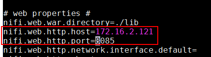

  - 启动和停止NiFi
    ```
    cd /opt/nifi/nifi-1.9.2
    bin/nifi.sh start
    bin/nifi.sh stop
    ```

    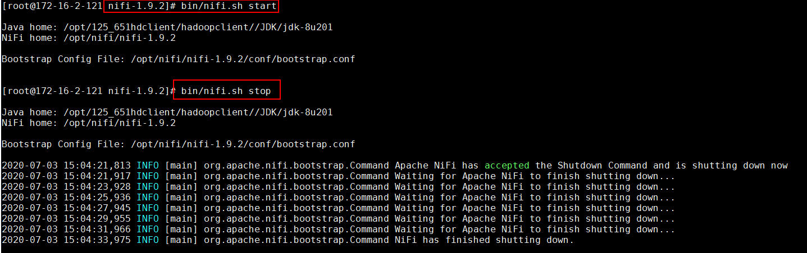

  - 运行NiFi

    `bin/nifi.sh start`

    


## NiFi配置Kerberos认证

### 操作场景
NiFi配置并保存Kerberos认证信息，供以后使用

### 前提条件

  - 已经完成Nifi 1.9.2的安装

  - 已完成FusionInsight HD和客户端的安装并创建测试用户developuser (参考产品文档->应用开发指南->安全模式->安全认证)

### 操作步骤
  - 在FusionInsight HD Manager上下载认证用户的配置文件`user.keytab`，`krb5.conf`，并一起存入路径`/opt/developuser`

  - 执行命令`vi /opt/nifi/nifi-1.9.2/conf/nifi.properties`配置Kerberos认证
    ```
    具体配置：
    nifi.kerberos.krb5.file=/opt/developuser/krb5.conf
    nifi.kerberos.service.principal=developuser
    nifi.kerberos.service.keytab.location=/opt/developuser/user.keytab
    ```

    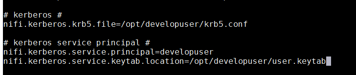


  - 重启NiFi  

  - 登录NiFi网页界面，右键选择**Configure**

    

    点击**加号**按钮添加服务

    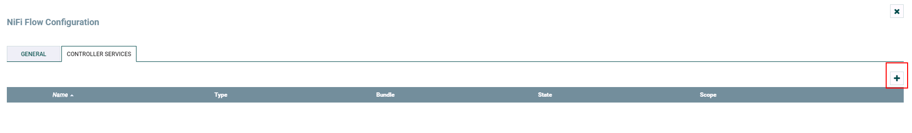

    选择`KeytabCredentialsService`，点击**ADD**添加

    

    点击**齿轮**图标进行配置

    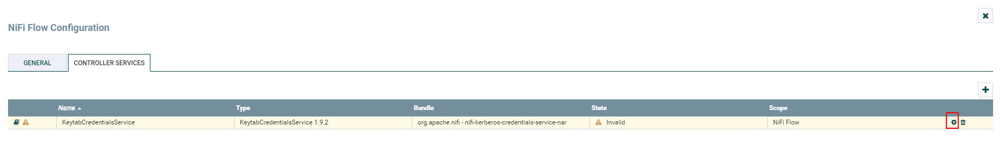

    

    点击**闪电**图标生效并保存KeytabCredentialsService

    

    

  - 完成

    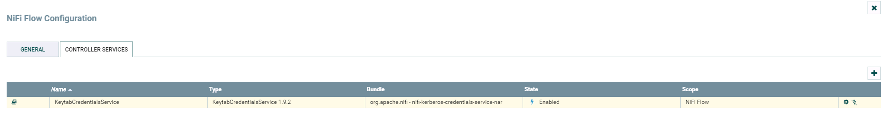


## NiFi连接HDFS

### 操作场景

NiFi中配置HDFS相关处理器，对接HDFS

### 前提条件

  - 已经完成NiFi 1.9.2的安装

  - 已完成FusionInsight HD和客户端的安装，包含HDFS组件

  - 已完成 NiFi Kerberos认证配置

### PutHDFS 操作步骤


  - 将FusionInsight HD客户端中关于HDFS的配置文件`hdfs-site.xml`，`core-site.xml`导入路径`/opt/nifi/nifi-1.9.2/conf`

  - 修改`hdfs-site.xml`内容，删除如下配置项
    ```
    <property>
    <name>dfs.client.failover.proxy.provider.hacluster</name>
    <value>org.apache.hadoop.hdfs.server.namenode.ha.AdaptiveFailoverProxyProvider</value>
    </property>

    ```
  - 修改`core-site.xml`内容，修改如下配置项中hacluster改为namenode主节点ip加端口号
    ```
    <property>
    <name>fs.defaultFS</name>
    <value>hdfs://172.16.4.123:25000</value>
    </property>
    ```

  - 将FI客户端的`hadoop-plugins-1.0.jar`拷贝到nifi hadoop相关依赖路径

    `cp /opt/125_651hdclient/hadoopclient/HDFS/hadoop/share/hadoop/common/lib/hadoop-plugins-1.0.jar /opt/nifi/nifi-1.9.2/work/nar/extensions/nifi-hadoop-nar-1.9.2.nar-unpacked/NAR-INF/bundled-dependencies`

    说明：否则会报依赖错误

  - 整个过程的流程图所示：

  

  - 处理器GetFile的配置如下：

  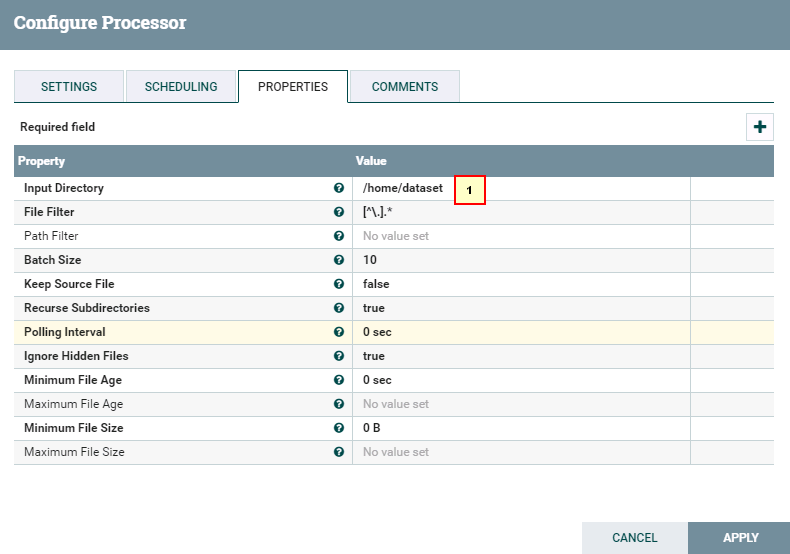

  ```
  具体配置：
  1: /home/dataset
  ```
  - 处理器PutHDFS配置如下

  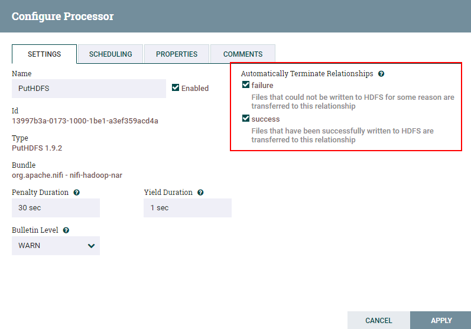

  

  ```
  具体配置：
  1: /opt/nifi/nifi-1.9.2/conf/hdfs-site.xml,/opt/nifi/nifi-1.9.2/conf/core-site.xml
  2: 选择NiFi配置Kerberos认证这一节中创建的 KeytabCredentialsService
  3: /tmp/nifitest
  ```

  - 两个处理器的连接配置如下：

  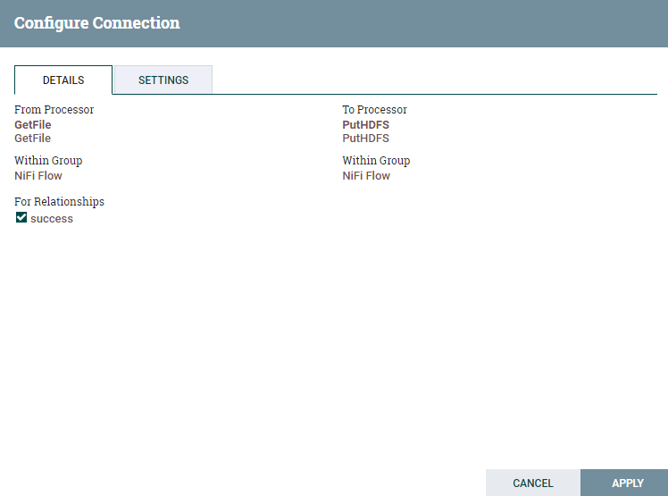

  - 测试前将测试文件`nifiHDFS.csv`放入路径`/home/dataset`

  

  文件内容如下：
  ```
  1;EcitQU
  2;Hyy6RC
  3;zju1jR
  4;R9fex9
  5;EU2mVq
  ```
  - 测试后

  

  登录集群HDFS文件系统查看测试结果

  `hdfs dfs -cat /tmp/nifitest/nifiHDFS.csv`

  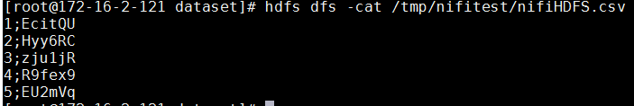

### GetHDFS 操作步骤

  - 整个过程的流程如图所示：

  

  - 处理器GetHDFS配置如下

  

  ```
  具体配置：
  1: /opt/nifi/nifi-1.9.2/conf/hdfs-site.xml,/opt/nifi/nifi-1.9.2/conf/core-site.xml
  2: 选择NiFi配置Kerberos认证这一节中创建的 KeytabCredentialsService
  3: /tmp/nifitest/HDFS
  ```
  - 处理器PutFile配置如下

  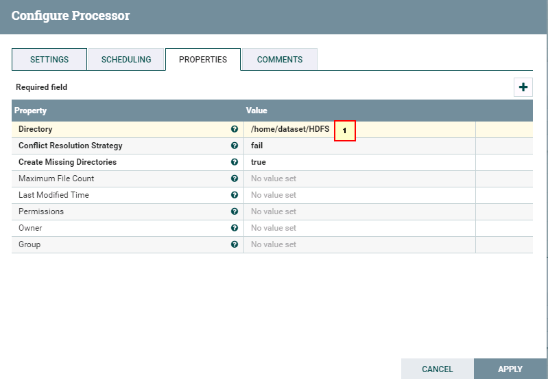

  ```
  具体配置：
  1: /home/dataset/HDFS
  ```

  - 测试后

  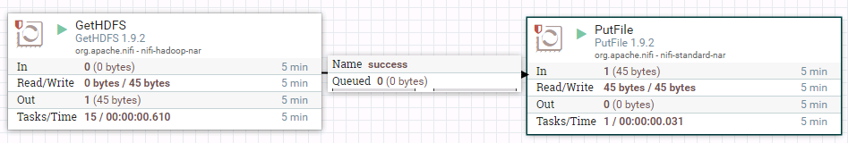

  登录安装 FusionInsight HD客户端主机路径`/home/dataset/HDFS`查看结果

  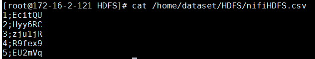


## NiFi连接Hive

### 操作场景

NiFi中配置JDBC解析器，对的FI HD Hive接口

### 前提条件

  - 已经完成NiFi 1.9.2的安装

  - 已完成FusionInsight HD和客户端的安装，包含Hive组件

  - 已完成 NiFi Kerberos认证配置

### HiveConnectionPool 配置操作步骤
- 登录NiFi网页界面，右键选择**Configure**

  

- 点击**加号**按钮添加服务
    

- 选择`HiveConnectionPool`，点击**ADD**添加

  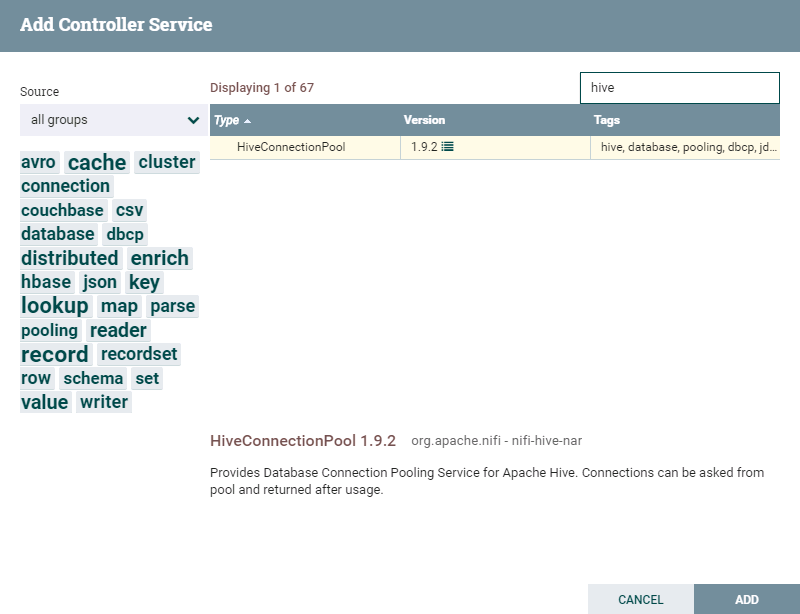

- 点击**齿轮**图标进行配置

 

 

 ```
 具体配置为
 1: jdbc:hive2://172.16.4.121:24002,172.16.4.122:24002,172.16.4.123:24002/;serviceDiscoveryMode=zooKeeper;principal=hive/hadoop.hadoop.com@HADOOP.COM
 2: KeytabCredentialsService
 ```
- 点击**闪电**图标点击闪电图标生效并保存`HiveConnectionPool`

  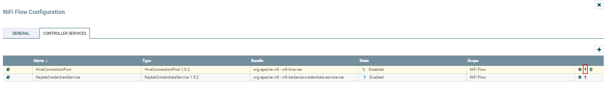

  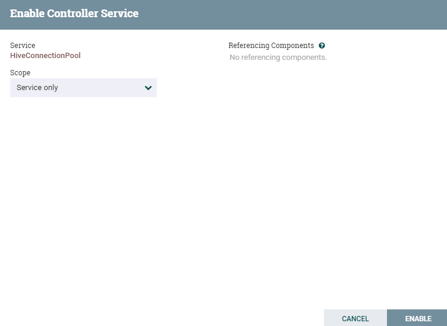

- 完成

  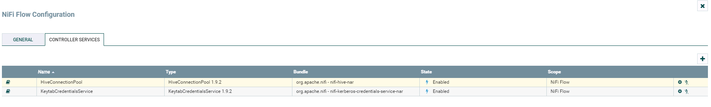

- 在路径`/opt/nifi/nifi-1.9.2/conf`下创建`jaas.conf`文件内容如下：
  ```
  Client {
  com.sun.security.auth.module.Krb5LoginModule required
  useKeyTab=true
  keyTab="/opt/developuser/user.keytab"
  principal="developuser"
  useTicketCache=false
  storeKey=true
  debug=true;
  };
  ```
- 执行命令`vi /opt/nifi/nifi-1.9.2/conf/bootstrap.conf`配置`bootstrap.conf`文件如下:

  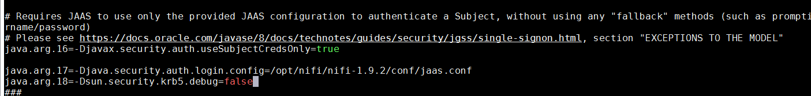

  ```
  java.arg.17=-Djava.security.auth.login.config=/opt/nifi/nifi-1.9.2/conf/jaas.conf
  java.arg.18=-Dsun.security.krb5.debug=false
  ```

- 执行命令`vi /opt/nifi/nifi-1.9.2/conf/nifi.properties`配置`nifi.properties`文件如下：

  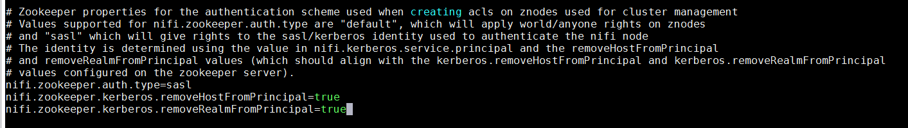

  ```
  nifi.zookeeper.auth.type=sasl
  nifi.zookeeper.kerberos.removeHostFromPrincipal=true
  nifi.zookeeper.kerberos.removeRealmFromPrincipal=true
  ```

- 执行命令`cd /opt/nifi/nifi-1.9.2/work/nar/extensions/nifi-hive-nar-1.9.2.nar-unpacked/NAR-INF/bundled-dependencies`到NiFi Hive类库中，将原有的`zookeeper-3.4.6.jar`替换为FusionInsight HD客户端中的`zookeeper-3.5.1.jar`

  


### SelectHiveQL 读取Hive表 操作步骤

 - 整个过程的流程如图所示：

 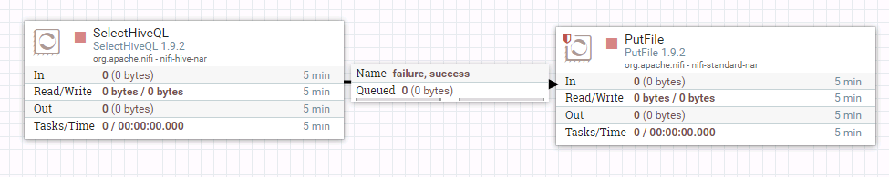

 - 处理器SelectHiveQL配置如下：

 

 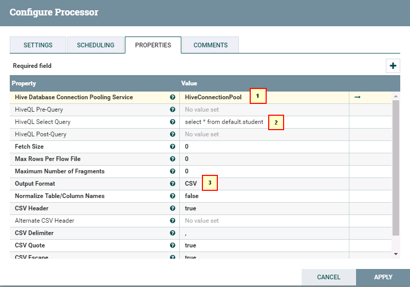

 ```
  具体配置如下：
  1: HiveConnectionPool
  2: select * from default.student
  3. CSV
 ```

 - 处理器PutFile配置如下：

 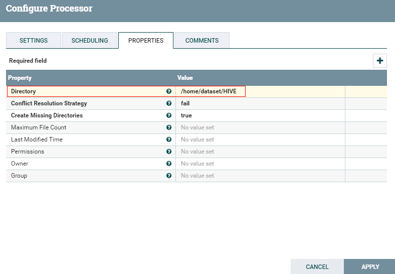

 - 运行前登录集群查看hive表student:

 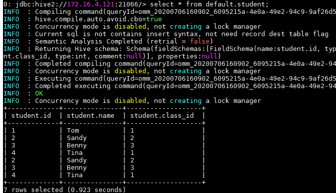

 - 运行后：

 

 登录路径`/home/dataset/HIVE`查看结果：

 


### PutHiveQL 整表导入 操作步骤
  - 整个过程的流程如图所示：

  

  - 处理器GetFile的配置如下

  

  ```
    具体配置如下：
    1： /home/dataset/
    2: iris.txt
  ```

  数据文件`iris.txt`的内容如下:
  ```
  1,5.1,3.5,1.4,0.2,setosa
  2,4.9,3,1.4,0.2,setosa
  3,4.7,3.2,1.3,0.2,setosa
  4,4.6,3.1,1.5,0.2,setosa
  5,5,3.6,1.4,0.2,setosa
  6,5.4,3.9,1.7,0.4,setosa
  7,4.6,3.4,1.4,0.3,setosa
  8,5,3.4,1.5,0.2,setosa
  9,4.4,2.9,1.4,0.2,setosa
  10,4.9,3.1,1.5,0.1,setosa
  ```

  - 处理器PutHDFS的配置如下

  

  ```
    具体配置如下：
    1： /opt/nifi/nifi-1.9.2/conf/hdfs-site.xml,/opt/nifi/nifi-1.9.2/conf/core-site.xml
    2： KeytabCredentialsService
    3: /tmp/nifitest/loadhive
  ```

  - 处理器ReplaceText配置如下

  

  ```
    具体配置如下：
    1: CREATE TABLE IF NOT EXISTS iris_createdBy_NiFi ( ID string, sepallength FLOAT, sepalwidth FLOAT, petallength FLOAT, petalwidth FLOAT, species string ) ROW FORMAT DELIMITED FIELDS TERMINATED BY ',' STORED AS TEXTFILE;LOAD DATA INPATH "hdfs:///tmp/nifitest/loadhive/iris.txt" into table iris_createdBy_NiFi;

  ```

  - 处理器PutHiveQL配置如下

  

  - 运行前将数据文件`iris.txt`导入路径`/home/dataset/`

  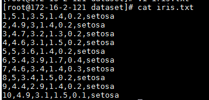


  - 运行后：

  

  登录HIVE查看测试结果:

  


## NiFi连接HBase

### 操作场景

NiFi中配置HBase解析器，对的FI HD HBase接口

### 前提条件

  - 已经完成NiFi 1.9.2的安装

  - 已完成FusionInsight HD和客户端的安装，包含HBase组件

  - 已完成 NiFi Kerberos认证配置


### HBase_1_1_2_ClientService 配置操作步骤
  - 将FusionInsight HD客户端中关于HBase的配置文件`hbase-site.xml`导入路径`/opt/nifi/nifi-1.9.2/conf`

  - 更换路径`/opt/nifi/nifi-1.9.2/work/nar/extensions/nifi-hbase_1_1_2-client-service-nar-1.9.2.nar-unpacked/NAR-INF/bundled-dependencies`下面的`zookeeper-3.4.6.jar`为FusionInsight HD客户端自带的`zookeeper-3.5.1.jar`

    

  - 登录NiFi网页界面，右键选择**Configure**

    

  - 点击**加号**按钮添加服务

    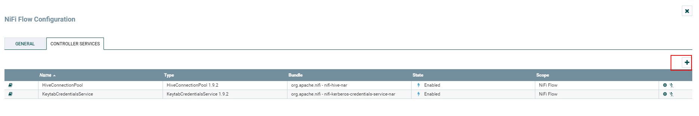

  - 选择`HBase_1_1_2_ClientService`，点击**ADD**添加

    

  - 点击**齿轮**图标进行配置

    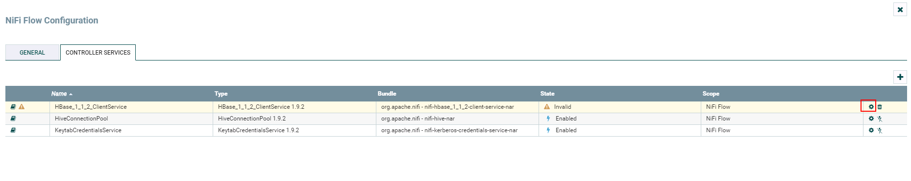

    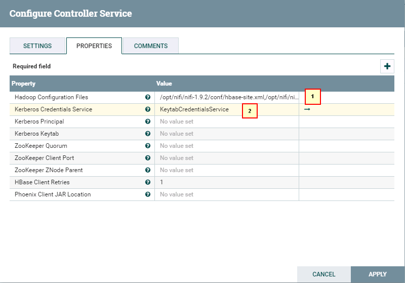

  ```
    具体配置如下：
    1： /opt/nifi/nifi-1.9.2/conf/hbase-site.xml,/opt/nifi/nifi-1.9.2/conf/core-site.xml
    2： KeytabCredentialsService
  ```

  - 点击**闪电**图标点击闪电图标生效并保存`HBase_1_1_2_ClientService`

    

    

  - 完成

    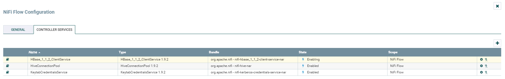

### PutHBaseJSON 向HBase导入表

 - 整个过程的流程如图所示：

 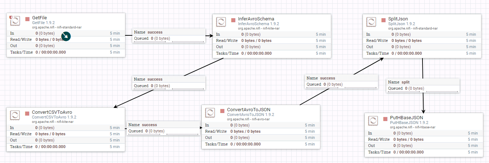

 - 处理器GetFile的配置如下:

 

 数据文件`hbase_test.csv`的内容如下:
  ```
  1,5.1,3.5,setosa
  2,6.1,3.6,versicolor
  3,7.1,3.7,virginica
  ```

- 处理器InverAvroSchema配置如下：

  

  ```
    具体配置如下：
    1: flowfile-attribute
    2: csv
    3: false
    4: hbase_test_data
  ```

- 处理器ConvertCSVToAvro配置如下:

  

  `${inferred.avro.schema}`

- 处理器ConvertAvroToJSON配置如下：

  

- 处理器SplitJson配置如下：

  

- 处理器PutHBaseJSON配置如下：

  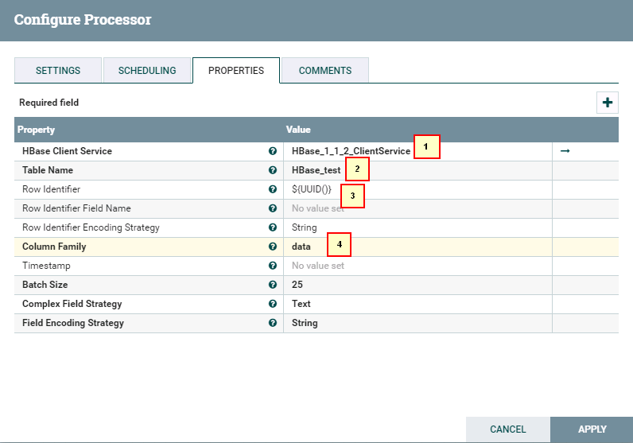

  ```
    具体配置如下:
    1: HBase_1_1_2_ClientService
    2: hbase_test
    3: ${UUID()}
    4: data
  ```

- 测试前需要将数据文件`hbase_test.csv`导入路径`/home/dataset/HBASE`

  

  并且需要在集群里面建一个hbase表，执行命令

  ```
  hbase shell
  create 'HBase_test','data'
  ```


- 运行后：

  

  登录集群查看结果：

  

### GetHbase 操作步骤

- 整个过程的流程如图所示：

  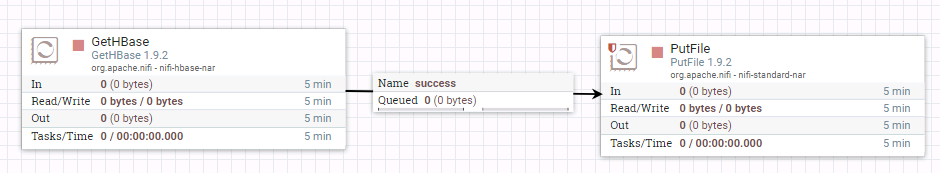

- 驱动器GetHBase的配置如下：

  

- 驱动器PutFile的配置如下：

  


- 测试后

  

  登录到路径`/home/dataset/GetHBase_test`查看结果：

  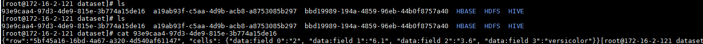

## NiFi连接Spark

### 操作场景

NiFi中配置Livy解析器，对的FI HD HBase接口

### 前提条件

  - 已经完成NiFi 1.7.1的安装

  - 已完成FusionInsight HD和客户端的安装，包含Spark2x组件

  - 已完成 NiFi Kerberos认证配置

  - 已完成Apache Livy 0.5.0的安装 （Livy可安装在FI HD客户端主机，也可以安装在其他主机但是需要保证安装Livy主机能够和FI HD客户端主机以及集群网络互通）

  >可参考《Apache Livy对接FusionInsight》对接文档完成Apache Livy的安装

### 配置LivySessionController操作步骤

- 登录NiFi网页界面，右键选择**Configure**


- 点击**加号**按钮添加服务

  

- 选择`LivySessionController`，点击**ADD**添加

  

- 点击**齿轮**图标进行配置

  

  

  ```
  具体配置如下：
  1: 172.21.3.43 (已安装Apache Livy的主机ip)
  2: 8998 (Livy默认端口，可更改)
  3: spark
  4：KeytabCredentialsService
  ```

- 继续点击**加号**按钮添加服务

  

- 选择`LivySessionController`，点击**ADD**添加

- 点击**齿轮**图标进行配置

  

  更改Controller名字为 LivySessionController_PySpark

  

  

  ```
  具体配置如下：
  1: 172.21.3.43 (已安装Apache Livy的主机ip)
  2: 8998 (Livy默认端口，可更改)
  3: pysaprk
  4：KeytabCredentialsService
  ```

- 继续点击**加号**按钮添加服务

- 选择`LivySessionController`，点击**ADD**添加

- 点击**齿轮**图标进行配置

  

  更改Controller名字为 LivySessionController_SparkR

  

  

  ```
  具体配置如下：
  1: 172.21.3.43 (已安装Apache Livy的主机ip)
  2: 8998 (Livy默认端口，可更改)
  3: sparkr
  4：KeytabCredentialsService
  ```

- 点击**闪电**图标选择`Service and referencing components`生效并保存`LivySessionController`,`LivySessionController_PySpark`,`LivySessionController_SparkR`

  

- 完成

  

### 运行Spark样例操作步骤

- 整个过程的流程如图所示：

  

- 处理器GetFile配置如下：

  

  ```
  具体配置如下：
  1: /home/dataset/sparkTest
  2: code1.txt
  ```

  代码内容文件`code1.txt`的内容如下：
  ```
  1+2
  ```

- 处理器ExtractText配置如下：

  需要点击**加号**按钮，Property项命名为`code1`，Value项赋值为`$`

  

- 处理器ExecuteSparkInteractive配置为：

  

  ```
  具体配置如下：
  1: LivySessionController
  2: ${code1}
  ```

- 测试前将代码文件`code1.txt`上传至安装nifi主机的路径`/home/dataset/sparkTest`下：

  

  在已安装Livy的主机上启动Livy：

  

  

- 测试后：

  

  登录Livy sever查看测试结果

  

  

### 运行PySpark样例操作步骤

- 整个过程的流程如图所示：

  

- 处理器GetFile配置如下：

  
  ```
  具体配置如下：
  1: /home/dataset/sparkTest
  2: code2.txt
  ```

  代码内容文件`code2.txt`的内容如下：
  ```
  import random
  NUM_SAMPLES = 100000
  def sample(p):
    x, y = random.random(), random.random()
    return 1 if x*x + y*y < 1 else 0

  count = sc.parallelize(xrange(0, NUM_SAMPLES)).map(sample).reduce(lambda a, b: a + b)
  print "Pi is roughly %f" % (4.0 * count / NUM_SAMPLES)
  ```

- 处理器ExtractText配置如下：

  需要点击**加号**按钮，Property项命名为`code2`，Value项赋值为`$`

  

- 处理器ExecuteSparkInteractive配置为：

  

  ```
  具体配置如下：
  1: LivySessionController_PySpark
  2: ${code2}
  ```

- 测试前将代码文件`code2.txt`上传至安装nifi主机的路径`/home/dataset/sparkTest`下：

  

  在已安装Livy的主机上启动Livy

- 测试后

  

  登录Livy sever查看测试结果

  

  

### 运行SparkR样例操作步骤

  - 整个过程的流程如图所示：

  

  注意：在测试过程中如果与Spark，PySpark样例不完全一样

  - 处理器GetFile配置如下：

    

    ```
    具体配置如下：
    1: /home/dataset/sparkTest
    2: code3.txt
    ```

    代码内容文件`code3.txt`的内容如下：
    ```
    piR <- function(N) {
        x <- runif(N)
        y <- runif(N)
        d <- sqrt(x^2 + y^2)
        return(4 * sum(d < 1.0) / N)
    }

    set.seed(5)
    cat("Pi is roughly ",piR(1000000) )
    ```


  - 处理器ExecuteSparkInteractive配置为：

    
  ```
  具体配置如下：
  1: /home/dataset/sparkTest
  2: code3.txt里的代码内容
  ```

  - 测试前将代码文件`code3.txt`上传至安装nifi主机的路径`/home/dataset/sparkTest`下：

    

    在已安装Livy的主机上启动Livy

- 测试后

  

  登录Livy sever查看测试结果

  

  

## NiFi连接Kafka普通模式

### 操作场景

NiFi中配置kafka解析器，对的FI HD kafka 21005端口

### 前提条件

  - 已经完成NiFi 1.7.1的安装

  - 已完成FusionInsight HD和客户端的安装，包含kafka组件

  - 已完成 NiFi Kerberos认证配置

### GetHTTP & PutKafka 操作步骤

 - 整个过程的流程如图所示：

  


 - 驱动器GetHTTP的配置如下：

  

  ```
  具体配置如下：
  1: http://vincentarelbundock.github.io/Rdatasets/csv/datasets/iris.csv
  2: iris.csv
  ```
 - 驱动器PutKafka配置如下：

  

  ```
  具体配置如下：
  1： 172.21.3.102:21005,172.21.3.101:21005,172.21.3.103:21005
  2： nifi-kafka-test-demo
  3： nifi
  ```

- 测试前：

  登录FI客户端kafak组件，创建Topic **nifi-kafka-test-demo**
  ```
    cd /opt/hadoopclient/Kafka/kafka/bin
    kafka-topics.sh --create --topic nifi-kafka-test-demo --zookeeper 172.21.3.101:24002,172.21.3.102:24002,172.21.3.103:24002/kafka --partitions 1 --replication-factor 1
  ```  

  

- 测试后：

  

  登录FI客户端kafak组件，查看结果：
  ```
  cd /opt/hadoopclient/Kafka/kafka/bin
  kafka-console-consumer.sh --zookeeper 172.21.3.101:24002,172.21.3.102:24002,172.21.3.103:24002/kafka --topic nifi-kafka-test-demo --from-beginning
  ```

  

  

### PublishKafka_0_11样例操作步骤
- 整个工作流为：

  

- 驱动器GetHTTP的配置如下：

  

  ```
  具体配置如下：
  1: http://vincentarelbundock.github.io/Rdatasets/csv/datasets/iris.csv
  2: iris.csv
  ```
- 驱动器PublishKafka_0_11的配置如下：

  

  ```
  1: 172.16.6.10:21005,172.16.6.11:21005,172.16.6.12:21005
  2: SASL_PLAINTEXT
  3: wikipedia21005
  6: Guarantee Replicated Delivery
  ```

- 启动整个工作流:

  

- 登陆FI HD kafka客户端检查结果：

  

### ConsumeKafka_0_11 操作步骤

  - 整个过程的流程如图所示：
  

  - 处理器ConsumeKafka_0_11配置如下：

  

  ```
  1: 172.21.3.101:21005,172.21.3.102:21005,172.21.3.103:21005
  2: PLAINTEXT
  3: KeytabCredentialsService
  4: Kafka
  5: example-metric1
  6: DemoConsumer
  ```

  - 处理器PutFile配置如下：

  

  - 测试前：

    用eclipse打开客户端自带的kafka样例代码`kafka-examples`，调试使得样例代码能够正常运行`NewProducer.java`

    

    由于ConsumeKafka是实时获取日志信息的，所以在测试的时候需要先运行`NewProducer.java`往Kafka上传日志文件，再同时开启nifi的驱动器ConsumeKafka_0_11进行读取日志的测试

  - 测试后：

    

    登录路径`/home/dataset/Kafka`查看测试结果：

    

    


## NiFi连接Kafka安全模式

### 操作场景

NiFi中配置kafka解析器，对的FI HD kafka 21007端口

### 前提条件

- 已经完成NiFi 1.9.2的安装

- 已完成FusionInsight HD和客户端的安装，包含kafka组件

- 已完成 NiFi Kerberos认证配置

- nifi主机ip: 172.16.2.121, FI HD三节点ip: 172.16.4.121-123

### 认证相关操作步骤

- 在nifi主机/opt/nifi/nifi-1.9.2/conf/jaas.conf文件下新增内容：

  ```
  KafkaClient {
  com.sun.security.auth.module.Krb5LoginModule required
  useKeyTab=true
  principal="developuser@HADOOP.COM"
  keyTab="/opt/developuser/user.keytab"
  useTicketCache=false
  serviceName="kafka"
  storeKey=true
  debug=true;
  };
  ```

  


- 使用命令bin/nifi.sh stop停止nifi

- 在FI HD的kafka客户端中找到对应的kafka client jar包，比如/opt/125_651hdclient/hadoopclient/Kafka/kafka/libs/kafka-clients-1.1.0.jar

    

- 将nifi主机下`/opt/nifi/nifi-1.9.2/work/nar/extensions/nifi-kafka-1-0-nar-1.9.2.nar-unpacked/NAR-INF/bundled-dependencies`路径中原来的kafka client jar包kafka-clients-1.0.2.jar 使用重命名命令命名为 kafka-clients-1.0.2.jar.org 并且把上一步在 FI HD kafka客户端中找到的kafka-clients-1.1.0.jar复制到此路径下：

  


- 登陆nifi主机，修改配置文件`/opt/nifi/nifi-1.9.2/conf/bootstrap.conf`添加新的jvm参数，保存：

  


- 使用命令bin/nifi.sh start启动nifi:


### PublishKafka_1_0样例操作步骤

- 整个工作流为：

  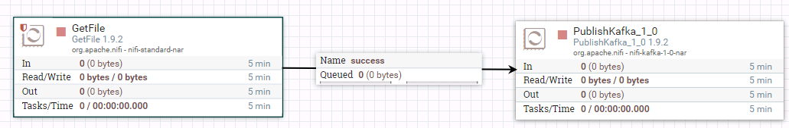  

- 驱动器GetFile的配置如下：

  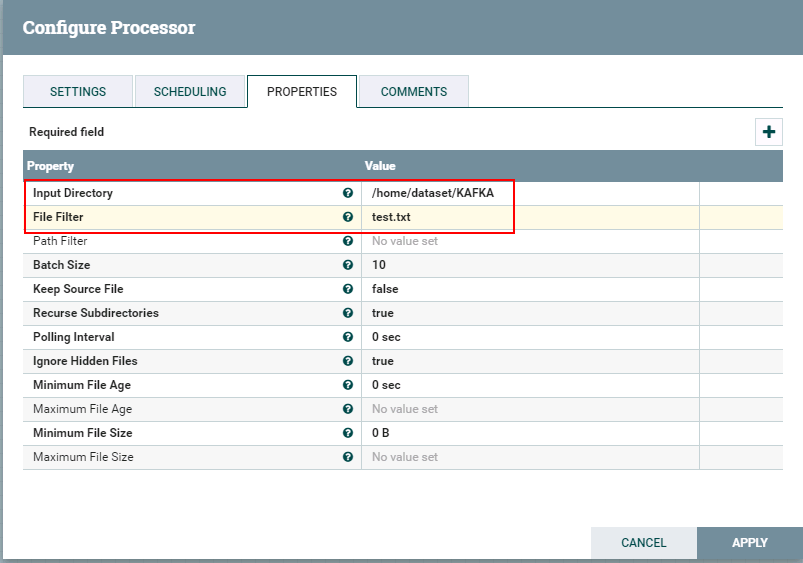

  ```
  具体配置如下：
  1: /home/dataset/KAFKA
  2: test.txt
  ```

  test.txt文件内容

  ```
  id,name,class_id
  1,"Tom",1
  2,"Sandy",2
  3,"Benny",3
  4,"Tina",1
  2,"Sandy",2
  3,"Benny",3
  4,"Tina",1
  ```

- 驱动器PublishKafka_1_0的配置如下：

  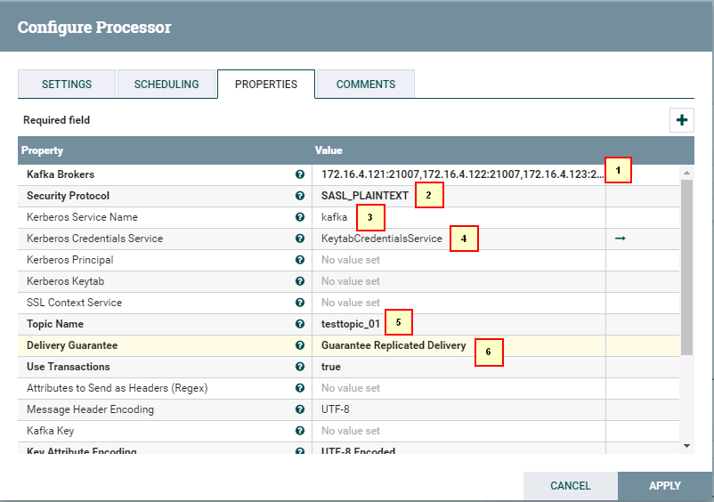

  ```
  1: 172.16.4.121:21007,172.16.4.122:21007,172.16.4.123:21007
  2: SASL_PLAINTEXT
  3: kafka
  4: KeytabCredentialsService
  5: testtopic_01
  6: Guarantee Replicated Delivery
  ```

- 运行整个工作流：  

  

- 去集群kafka客户端检查：

  

### ConsumeKafka_1_0样例操作步骤

- 整个工作流为：

  

- 驱动器ConsumeKafka_1_0的配置如下：

  

  ```
  1: 172.16.4.121:21007,172.16.4.122:21007,172.16.4.123:21007
  2: SASL_PLAINTEXT
  3: kafka
  4: KeytabCredentialsService
  5: testtopic01
  6: Demo
  ```

- 驱动器PutFile配置如下：

  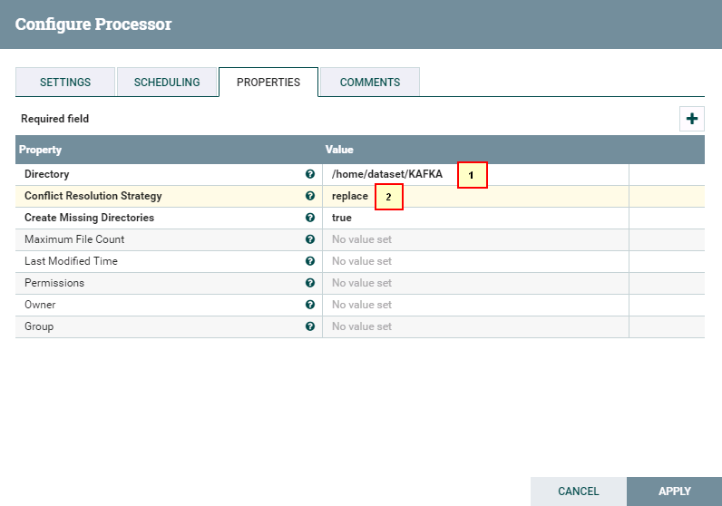

- 启动整个工作流

  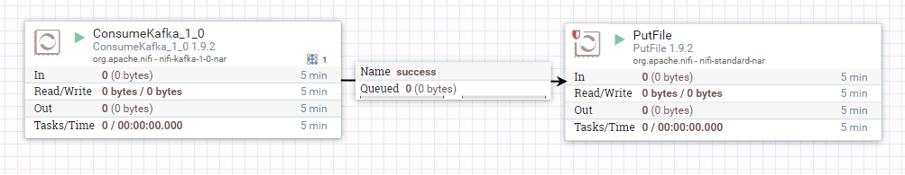

- 使用FI HD producer传数据：

  

- 登陆druid主机检查结果

  


## FAQ

问题：
连hive的时候遇到问题：

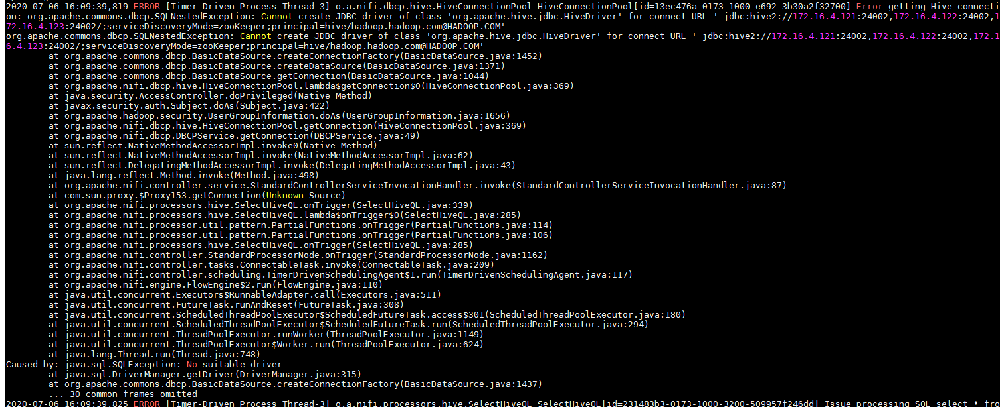

```
2020-07-06 16:09:39,819 ERROR [Timer-Driven Process Thread-3] o.a.nifi.dbcp.hive.HiveConnectionPool HiveConnectionPool[id=13ec476a-0173-1000-e692-3b30a2f32700] Error getting Hive connection: org.apache.commons.dbcp.SQLNestedException: Cannot create JDBC driver of class 'org.apache.hive.jdbc.HiveDriver' for connect URL ' jdbc:hive2://172.16.4.121:24002,172.16.4.122:24002,172.16.4.123:24002/;serviceDiscoveryMode=zooKeeper;principal=hive/hadoop.hadoop.com@HADOOP.COM'
org.apache.commons.dbcp.SQLNestedException: Cannot create JDBC driver of class 'org.apache.hive.jdbc.HiveDriver' for connect URL ' jdbc:hive2://172.16.4.121:24002,172.16.4.122:24002,172.16.4.123:24002/;serviceDiscoveryMode=zooKeeper;principal=hive/hadoop.hadoop.com@HADOOP.COM'
        at org.apache.commons.dbcp.BasicDataSource.createConnectionFactory(BasicDataSource.java:1452)
        at org.apache.commons.dbcp.BasicDataSource.createDataSource(BasicDataSource.java:1371)
        at org.apache.commons.dbcp.BasicDataSource.getConnection(BasicDataSource.java:1044)
        at org.apache.nifi.dbcp.hive.HiveConnectionPool.lambda$getConnection$0(HiveConnectionPool.java:369)
        at java.security.AccessController.doPrivileged(Native Method)
        at javax.security.auth.Subject.doAs(Subject.java:422)
        at org.apache.hadoop.security.UserGroupInformation.doAs(UserGroupInformation.java:1656)
        at org.apache.nifi.dbcp.hive.HiveConnectionPool.getConnection(HiveConnectionPool.java:369)
        at org.apache.nifi.dbcp.DBCPService.getConnection(DBCPService.java:49)
        at sun.reflect.NativeMethodAccessorImpl.invoke0(Native Method)
        at sun.reflect.NativeMethodAccessorImpl.invoke(NativeMethodAccessorImpl.java:62)
        at sun.reflect.DelegatingMethodAccessorImpl.invoke(DelegatingMethodAccessorImpl.java:43)
        at java.lang.reflect.Method.invoke(Method.java:498)
        at org.apache.nifi.controller.service.StandardControllerServiceInvocationHandler.invoke(StandardControllerServiceInvocationHandler.java:87)
        at com.sun.proxy.$Proxy153.getConnection(Unknown Source)
        at org.apache.nifi.processors.hive.SelectHiveQL.onTrigger(SelectHiveQL.java:339)
        at org.apache.nifi.processors.hive.SelectHiveQL.lambda$onTrigger$0(SelectHiveQL.java:285)
        at org.apache.nifi.processor.util.pattern.PartialFunctions.onTrigger(PartialFunctions.java:114)
        at org.apache.nifi.processor.util.pattern.PartialFunctions.onTrigger(PartialFunctions.java:106)
        at org.apache.nifi.processors.hive.SelectHiveQL.onTrigger(SelectHiveQL.java:285)
        at org.apache.nifi.controller.StandardProcessorNode.onTrigger(StandardProcessorNode.java:1162)
        at org.apache.nifi.controller.tasks.ConnectableTask.invoke(ConnectableTask.java:209)
        at org.apache.nifi.controller.scheduling.TimerDrivenSchedulingAgent$1.run(TimerDrivenSchedulingAgent.java:117)
        at org.apache.nifi.engine.FlowEngine$2.run(FlowEngine.java:110)
        at java.util.concurrent.Executors$RunnableAdapter.call(Executors.java:511)
        at java.util.concurrent.FutureTask.runAndReset(FutureTask.java:308)
        at java.util.concurrent.ScheduledThreadPoolExecutor$ScheduledFutureTask.access$301(ScheduledThreadPoolExecutor.java:180)
        at java.util.concurrent.ScheduledThreadPoolExecutor$ScheduledFutureTask.run(ScheduledThreadPoolExecutor.java:294)
        at java.util.concurrent.ThreadPoolExecutor.runWorker(ThreadPoolExecutor.java:1149)
        at java.util.concurrent.ThreadPoolExecutor$Worker.run(ThreadPoolExecutor.java:624)
        at java.lang.Thread.run(Thread.java:748)
Caused by: java.sql.SQLException: No suitable driver
        at java.sql.DriverManager.getDriver(DriverManager.java:315)
        at org.apache.commons.dbcp.BasicDataSource.createConnectionFactory(BasicDataSource.java:1437)
        ... 30 common frames omitted
```

仔细查看报错

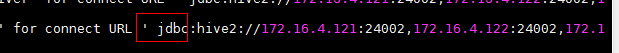

发现连接的url前面有一个空格，在界面上连接串前面多了个空格，去掉问题解决