# Apache NiFi对接FusionInsight

## 适用场景

> Apache NiFi 1.7.1 <--> FusionInsight HD V100R002C80SPC200 (HDFS/HBase/Hive/Spark/Kafka/Solr)
>
> Apache NiFi 1.9.2 <--> FusionInsight HD 6.5 (HDFS/HBase/Hive/Spark/Kafka)

## 安装Apache NiFi

### 操作场景

安装Apache NiFi 1.7.1

### 前提条件

  - 已完成FusionInsight HD和客户端的安装。

### 操作步骤
  - 执行source命令到客户端，获取java配置信息
  ```
  source /opt/hadoopclient/bigdata_env
  echo $JAVA_HOME
  ```
  

  - 安装NiFi，在网址<https://nifi.apache.org/download.html>下载安装包，使用WinSCP导入主机并用命令`unzip nifi-1.7.1-bin.zip`解压安装生成nifi-1.7.1目录，安装目录为`/usr/nifi/nifi-1.7.1`

  

  - 执行`vi /usr/nifi/nifi-1.7.1/conf/nifi.properties`配置NiFi服务器ip和端口如下：
    ```
    nifi.web.http.host=172.16.52.190
    nifi.web.http.port=8085
    ```
    

  - 启动和停止NiFi
    ```
    cd /usr/nifi/nifi-1.7.1
    bin/nifi.sh start
    bin/nifi.sh stop
    ```
    

  - 运行NiFi

    `bin/nifi.sh start`

    


## NiFi配置Kerberos认证

### 操作场景
NiFi配置并保存Kerberos认证信息，供以后使用

### 前提条件

  - 已经完成Nifi 1.7.1的安装

  - 已完成FusionInsight HD和客户端的安装并创建测试用户developuser (参考产品文档->应用开发指南->安全模式->安全认证)

### 操作步骤
  - 在FusionInsight HD Manager上下载认证用户的配置文件`user.keytab`，`krb5.conf`，并一起存入路径`/opt/developuser`

  - 执行命令`vi /usr/nifi/nifi-1.7.1/conf/nifi.properties`配置Kerberos认证
    ```
    具体配置：
    nifi.kerberos.krb5.file=/opt/developuser/krb5.conf
    nifi.kerberos.service.principal=developuser
    nifi.kerberos.service.keytab.location=/opt/developuser/user.keytab
    ```

    

  - 登录NiFi网页界面，右键选择**Configure**
    

    点击**加号**按钮添加服务
    

    选择`KeytabCredentialsService`，点击**ADD**添加

    

    点击**齿轮**图标进行配置

    

    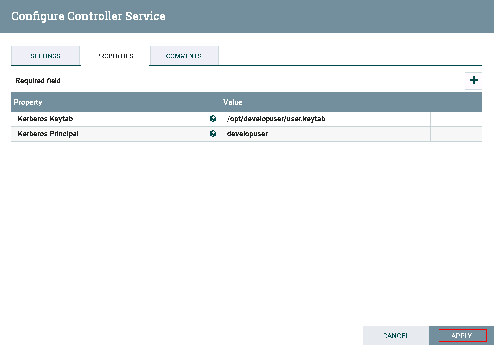

    点击**闪电**图标生效并保存KeytabCredentialsService

    

    

  - 完成
  


## NiFi连接HDFS

### 操作场景

NiFi中配置HDFS相关处理器，对接HDFS

### 前提条件

  - 已经完成NiFi 1.7.1的安装

  - 已完成FusionInsight HD和客户端的安装，包含HDFS组件

  - 已完成 NiFi Kerberos认证配置

### PutHDFS 操作步骤


  - 将FusionInsight HD客户端中关于HDFS的配置文件`hdfs-site.xml`，`core-site.xml`导入路径`/usr/nifi/nifi-1.7.1/conf`

  - 修改`hdfs-site.xml`内容，删除如下配置项
    ```
    <property>
    <name>dfs.client.failover.proxy.provider.hacluster</name>
    <value>org.apache.hadoop.hdfs.server.namenode.ha.BlackListingFailoverProxyProvider</value>
    </property>
    ```
  - 修改`core-site.xml`内容，修改如下配置项中hacluster改为节点ip加端口号
    ```
    <property>
    <name>fs.defaultFS</name>
    <value>hdfs://172.21.3.102:25000</value>
    </property>
    ```


  - 整个过程的流程图所示：
  

  - 处理器GetFile的配置如下：
  
  ```
  具体配置：
  1: /home/dataset
  ```
  - 处理器PutHDFS配置如下

  

  
  ```
  具体配置：
  1: /usr/nifi/nifi-1.7.1/conf/hdfs-site.xml,/usr/nifi/nifi-1.7.1/conf/core-site.xml
  2: 选择NiFi配置Kerberos认证这一节中创建的 KeytabCredentialsService
  3: /tmp/nifitest
  ```

  - 两个处理器的连接配置如下：

  

  - 测试前将测试文件`nifiHDFS.csv`放入路径`/home/dataset`

  

  文件内容如下：
  ```
  1;EcitQU
  2;Hyy6RC
  3;zju1jR
  4;R9fex9
  5;EU2mVq
  ```
  - 测试后

  

  登录集群HDFS文件系统查看测试结果

  `hdfs dfs -cat /tmp/nifitest/nifiHDFS.csv`

  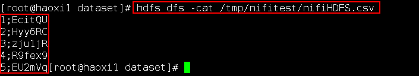

### GetHDFS 操作步骤
  - 整个过程的流程如图所示：

  

  - 处理器GetHDFS配置如下

  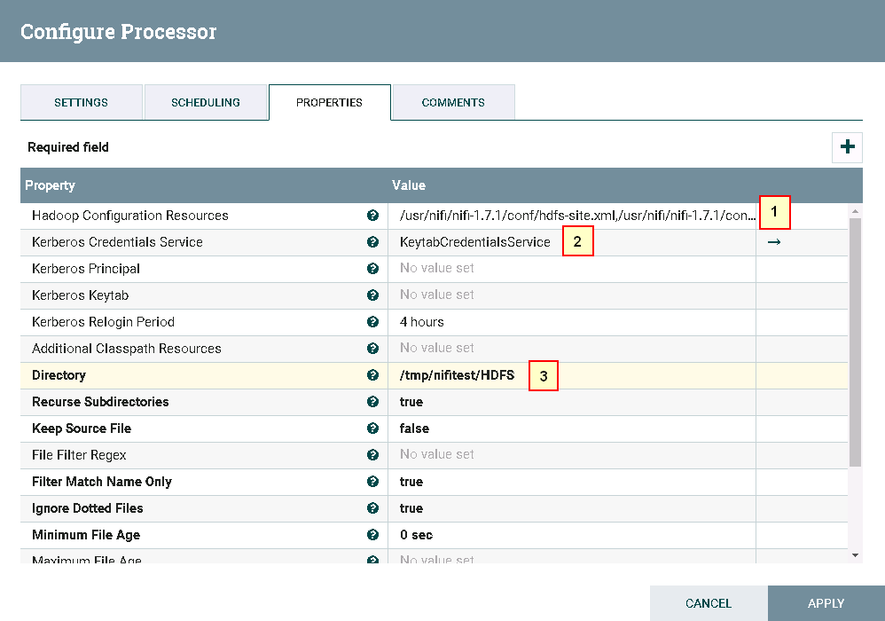

  ```
  具体配置：
  1: /usr/nifi/nifi-1.7.1/conf/hdfs-site.xml,/usr/nifi/nifi-1.7.1/conf/core-site.xml
  2: 选择NiFi配置Kerberos认证这一节中创建的 KeytabCredentialsService
  3: /tmp/nifitest/HDFS
  ```
  - 处理器PutFile配置如下

  

  ```
  具体配置：
  1: /home/dataset/HDFS
  ```

  

  - 测试前将测试文件`nifiHDFS.csv`放到HDFS文件系统的`/tmp/nifitest/HDFS`路径下

  

  - 测试后

  

  登录安装 FusionInsight HD客户端主机路径`/home/dataset/HDFS`查看结果

  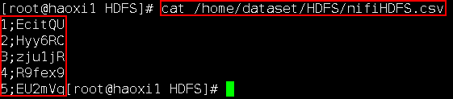

### ListHDFS & FetchHDFS 操作步骤

  - 整个过程的流程如图所示：
  

  - 处理器ListHDFS配置如下：
  
  ```
    具体配置为：
    1. /usr/nifi/nifi-1.7.1/conf/hdfs-site.xml,/usr/nifi/nifi-1.7.1/conf/core-site.xml
    2. KeytabCredentialsService
    3. /tmp/nifitest
  ```

  - 处理器RouteOnAttribute具体配置如下：

  

  注意：需要点击**加号**图标增加一条配置，**Property** 配置为`requiredfilenames`，**Value** 配置为`${filename:matches('sanguo.*')}`

  ```
    具体配置为：
    1. Route to Property name
    2. requiredfilenames
    3. ${filename:matches('sanguo.*')}
  ```
  - 处理器RouteOnAttribute和上、下处理器FetchHDFS的连接配置分别对应为`requiredfilenames`和`unmatched`，如图：

  

  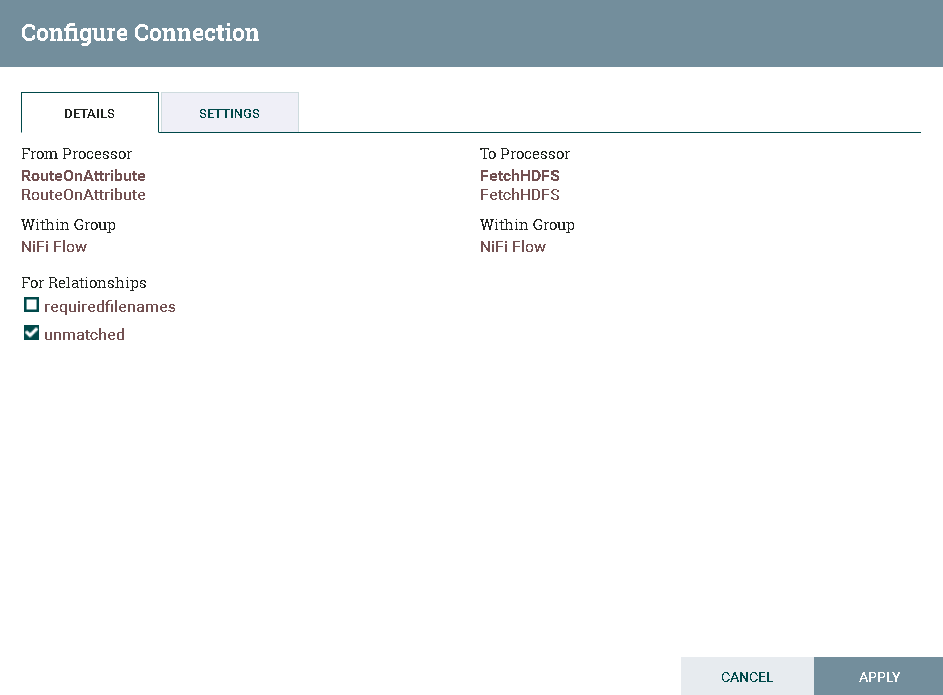

  - 两个处理器FetchHDFS的配置如下：

  
  ```
    具体配置为：
    1. /usr/nifi/nifi-1.7.1/conf/hdfs-site.xml,/usr/nifi/nifi-1.7.1/conf/core-site.xml
    2. KeytabCredentialsService
  ```

  - 上、下处理器PutFile配置分别如下：

  

  

  - 测试前，执行命令`hdfs dfs -ls /tmp/nifitest`登录集群HDFS文件系统`/tmp/nifitest`查看文件

  

  - 测试后

  

  登录FusionInsight HD客户端主机路径`/home/dataset/HDFS/matchedFiles`和`/home/dataset/HDFS/unmatchedFiles`分别查看结果：

  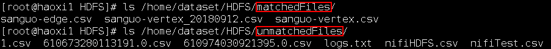


## NiFi连接Hive

### 操作场景

NiFi中配置JDBC解析器，对的FI HD Hive接口

### 前提条件

  - 已经完成NiFi 1.7.1的安装

  - 已完成FusionInsight HD和客户端的安装，包含Hive组件

  - 已完成 NiFi Kerberos认证配置

### HiveConnectionPool 配置操作步骤
- 登录NiFi网页界面，右键选择**Configure**


- 点击**加号**按钮添加服务
    

- 选择`HiveConnectionPool`，点击**ADD**添加

 

- 点击**齿轮**图标进行配置

 

 

 ```
 具体配置为
 1: jdbc:hive2://172.21.3.103:24002,172.21.3.101:24002,172.21.3.102:24002/;serviceDiscoveryMode=zooKeeper;principal=hive/hadoop.hadoop.com@HADOOP.COM
 2: KeytabCredentialsService
 ```
- 点击**闪电**图标点击闪电图标生效并保存`HiveConnectionPool`

  

  

- 完成
  

- 在路径`/usr/nifi/nifi-1.7.1/conf`下创建`jaas.conf`文件内容如下：
  ```
  Client {
  com.sun.security.auth.module.Krb5LoginModule required
  useKeyTab=true
  keyTab="/opt/developuser/user.keytab"
  principal="developuser"
  useTicketCache=false
  storeKey=true
  debug=true;
  };
  ```
- 执行命令`vi /usr/nifi/nifi-1.7.1/conf/bootstrap.conf`配置`bootstrap.conf`文件如下:
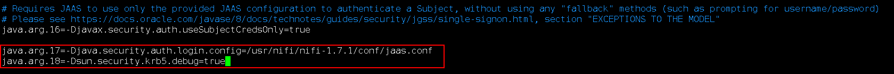
```
java.arg.17=-Djava.security.auth.login.config=/usr/nifi/nifi-1.7.1/conf/jaas.conf
java.arg.18=-Dsun.security.krb5.debug=true
```

- 执行命令`vi /usr/nifi/nifi-1.7.1/conf/nifi.properties`配置`nifi.properties`文件如下：

  

  ```
  nifi.zookeeper.auth.type=sasl
  nifi.zookeeper.kerberos.removeHostFromPrincipal=true
  nifi.zookeeper.kerberos.removeRealmFromPrincipal=true
  ```
- 执行命令`cd /usr/nifi/nifi-1.7.1/work/nar/extensions/nifi-hive-nar-1.7.1.nar-unpacked/META-INF/bundled-dependencies`到NiFi Hive类库中，将原有的`zookeeper-3.4.6.jar`替换为FusionInsight HD客户端中的`zookeeper-3.5.1.jar`

  


### SelectHiveQL 读取Hive表 操作步骤

 - 整个过程的流程如图所示：
 

 - 处理器SelectHiveQL配置如下：

 

 

 ```
  具体配置如下：
  1: HiveConnectionPool
  2: select * from default.t2
  3. CSV
 ```

 - 处理器PutFile配置如下：

 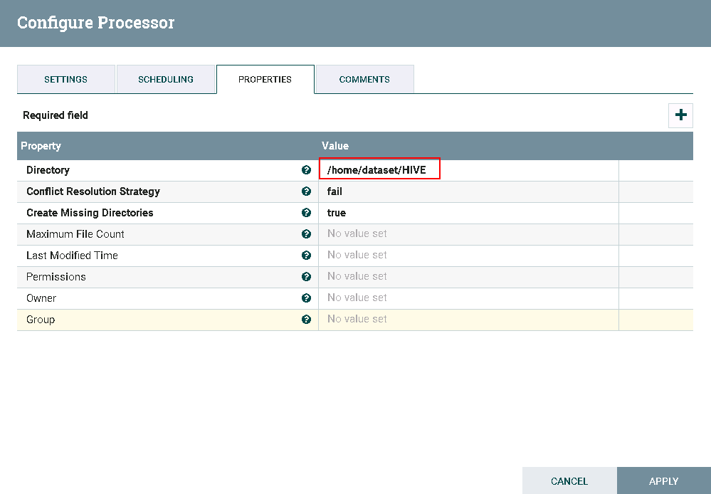

 - 运行前登录集群查看hive表t2:

 

 - 运行后：

 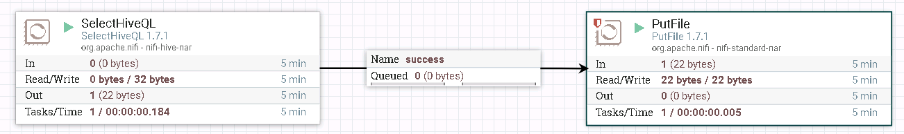

 登录路径`/home/dataset/HIVE`查看结果：

 

### PutHiveQL 整表导入 操作步骤
  - 整个过程的流程如图所示：

  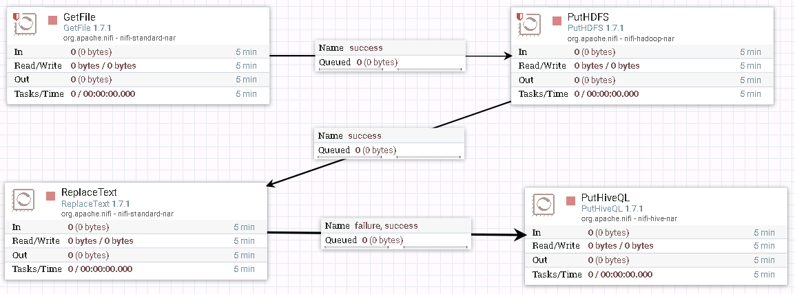

  - 处理器GetFile的配置如下

  

  ```
    具体配置如下：
    1： /home/dataset/
    2: iris.txt
  ```

  数据文件`iris.txt`的内容如下:
  ```
  1,5.1,3.5,1.4,0.2,setosa
  2,4.9,3,1.4,0.2,setosa
  3,4.7,3.2,1.3,0.2,setosa
  4,4.6,3.1,1.5,0.2,setosa
  5,5,3.6,1.4,0.2,setosa
  6,5.4,3.9,1.7,0.4,setosa
  7,4.6,3.4,1.4,0.3,setosa
  8,5,3.4,1.5,0.2,setosa
  9,4.4,2.9,1.4,0.2,setosa
  10,4.9,3.1,1.5,0.1,setosa
  ```

  - 处理器PutHDFS的配置如下

  

  ```
    具体配置如下：
    1： /usr/nifi/nifi-1.7.1/conf/hdfs-site.xml,/usr/nifi/nifi-1.7.1/conf/core-site.xml
    2： KeytabCredentialsService
    3: /tmp/nifitest/loadhive
  ```

  - 处理器ReplaceText配置如下

  

  ```
    具体配置如下：
    1: CREATE TABLE IF NOT EXISTS iris_createdBy_NiFi ( ID string, sepallength FLOAT, sepalwidth FLOAT, petallength FLOAT, petalwidth FLOAT, species string ) ROW FORMAT DELIMITED FIELDS TERMINATED BY ',' STORED AS TEXTFILE;LOAD DATA INPATH "hdfs:///tmp/nifitest/loadhive/iris.txt" into table iris_createdBy_NiFi;

  ```

  - 处理器PutHiveQL配置如下

  

  - 运行前将数据文件`iris.txt`导入路径`/home/dataset/`

  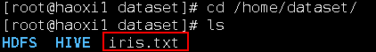


  - 运行后：

  

  登录HIVE查看测试结果:

  

### PutHiveQL 单行导入 操作步骤
  - 整个过程的流程如图所示：

  

  - 处理器GetFile的配置如下:
  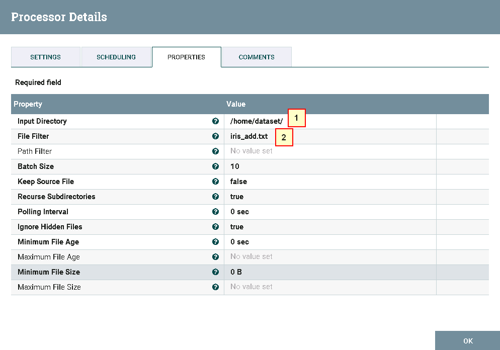

  ```
    具体配置如下：
    1： /home/dataset/
    2： iris_add.txt
  ```

  数据文件`iris_add.txt`的内容如下:
  ```
  "11",5.8,2.8,5.1,2.4,"virginica"
  "12",6.4,3.2,5.3,2.3,"virginica"
  "13",6.5,3,5.5,1.8,"virginica"
  "14",5.7,3,4.2,1.2,"versicolor"
  "15",5.7,2.9,4.2,1.3,"versicolor"
  ```

  - 处理器SplitText配置如下：

  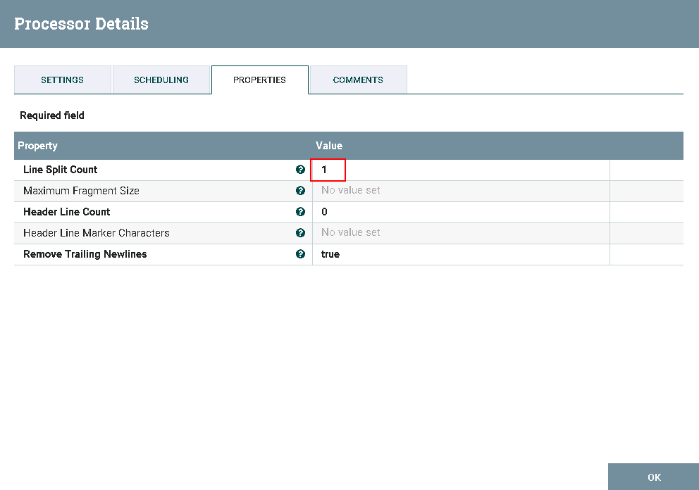

  - 处理器ExtractText配置保持默认配置

  - 处理器ReplaceText配置如下:

  

  - 处理器PutHiveQL配置如下:

  


  - 运行前将数据文件`iris_add.txt`导入路径`/home/dataset/`

  

  - 运行后：

  

  登录HIVE查看测试结果：

  


## NiFi连接HBase

### 操作场景

NiFi中配置HBase解析器，对的FI HD HBase接口

### 前提条件

  - 已经完成NiFi 1.7.1的安装

  - 已完成FusionInsight HD和客户端的安装，包含HBase组件

  - 已完成 NiFi Kerberos认证配置


### HBase_1_1_2_ClientService 配置操作步骤
  - 将FusionInsight HD客户端中关于HBase的配置文件`hbase-site.xml`导入路径`/usr/nifi/nifi-1.7.1/conf`

  - 更换路径`/usr/nifi/nifi-1.7.1/work/nar/extensions/nifi-hbase_1_1_2-client-service-nar-1.7.1.nar-unpacked/META-INF/bundled-dependencies`下面的`zookeeper-3.4.6.jar`为FusionInsight HD客户端自带的`zookeeper-3.5.1.jar`

  

  - 登录NiFi网页界面，右键选择**Configure**
  

  - 点击**加号**按钮添加服务

  

  - 选择`HBase_1_1_2_ClientService`，点击**ADD**添加

  

  - 点击**齿轮**图标进行配置

  

  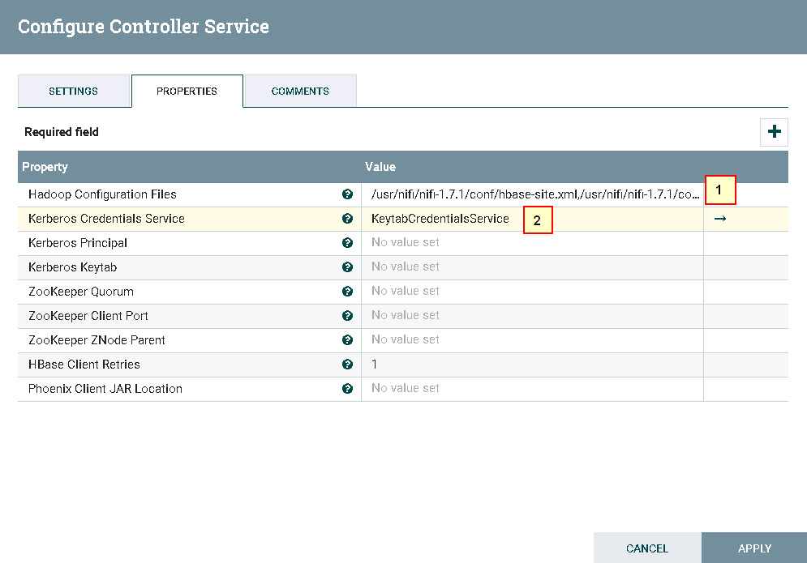

  ```
    具体配置如下：
    1： /usr/nifi/nifi-1.7.1/conf/hbase-site.xml,/usr/nifi/nifi-1.7.1/conf/core-site.xml
    2： KeytabCredentialsService
  ```

  - 点击**闪电**图标点击闪电图标生效并保存`HBase_1_1_2_ClientService`

  

  

  - 完成

  

### PutHBaseJSON 向HBase导入表

 - 整个过程的流程如图所示：

 

 - 处理器GetFile的配置如下:

 

 数据文件`hbase_test.csv`的内容如下:
  ```
  1,5.1,3.5,setosa
  2,6.1,3.6,versicolor
  3,7.1,3.7,virginica
  ```

- 处理器InverAvroSchema配置如下：

  

  ```
    具体配置如下：
    1: flowfile-attribute
    2: csv
    3: false
    4: hbase_test_data
  ```

- 处理器ConvertCSVToAvro配置如下:

  

- 处理器ConvertAvroToJSON配置如下：

  

- 处理器SplitJson配置如下：

  

- 处理器PutHBaseJSON配置如下：

  

  ```
    具体配置如下:
    1: HBase_1_1_2_ClientService
    2: hbase_test
    3: ${UUID()}
    4: data
  ```

- 测试前需要将数据文件`hbase_test.csv`导入路径`/home/dataset/HBASE`

  

  并且需要在集群里面建一个hbase表，执行命令

  ```
  hbase shell
  create 'HBase_test','data'
  ```

  

- 运行后：

  

  登录集群查看结果：

  

### GetHbase 操作步骤

- 整个过程的流程如图所示：

  

- 驱动器GetHBase的配置如下：

  

- 驱动器PutFile的配置如下：

  


- 测试后

  

  登录到路径`/home/dataset/GetHBase_test`查看结果：

  

  

## NiFi连接Spark

### 操作场景

NiFi中配置Livy解析器，对的FI HD HBase接口

### 前提条件

  - 已经完成NiFi 1.7.1的安装

  - 已完成FusionInsight HD和客户端的安装，包含Spark2x组件

  - 已完成 NiFi Kerberos认证配置

  - 已完成Apache Livy 0.5.0的安装 （Livy可安装在FI HD客户端主机，也可以安装在其他主机但是需要保证安装Livy主机能够和FI HD客户端主机以及集群网络互通）

  >可参考《Apache Livy对接FusionInsight》对接文档完成Apache Livy的安装

### 配置LivySessionController操作步骤

- 登录NiFi网页界面，右键选择**Configure**


- 点击**加号**按钮添加服务

  

- 选择`LivySessionController`，点击**ADD**添加

  

- 点击**齿轮**图标进行配置

  

  

  ```
  具体配置如下：
  1: 172.21.3.43 (已安装Apache Livy的主机ip)
  2: 8998 (Livy默认端口，可更改)
  3: spark
  4：KeytabCredentialsService
  ```

- 继续点击**加号**按钮添加服务

  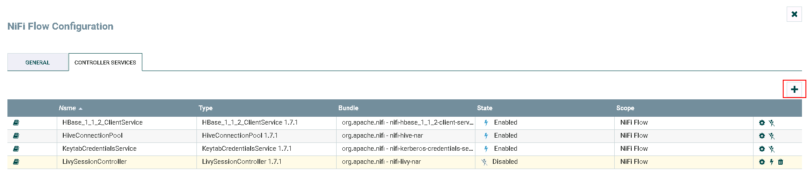

- 选择`LivySessionController`，点击**ADD**添加

- 点击**齿轮**图标进行配置

  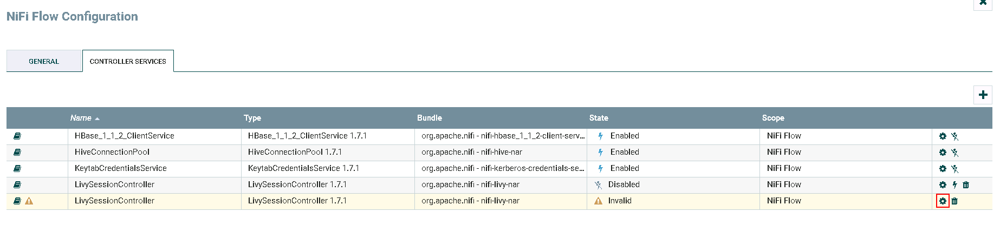

  更改Controller名字为 LivySessionController_PySpark

  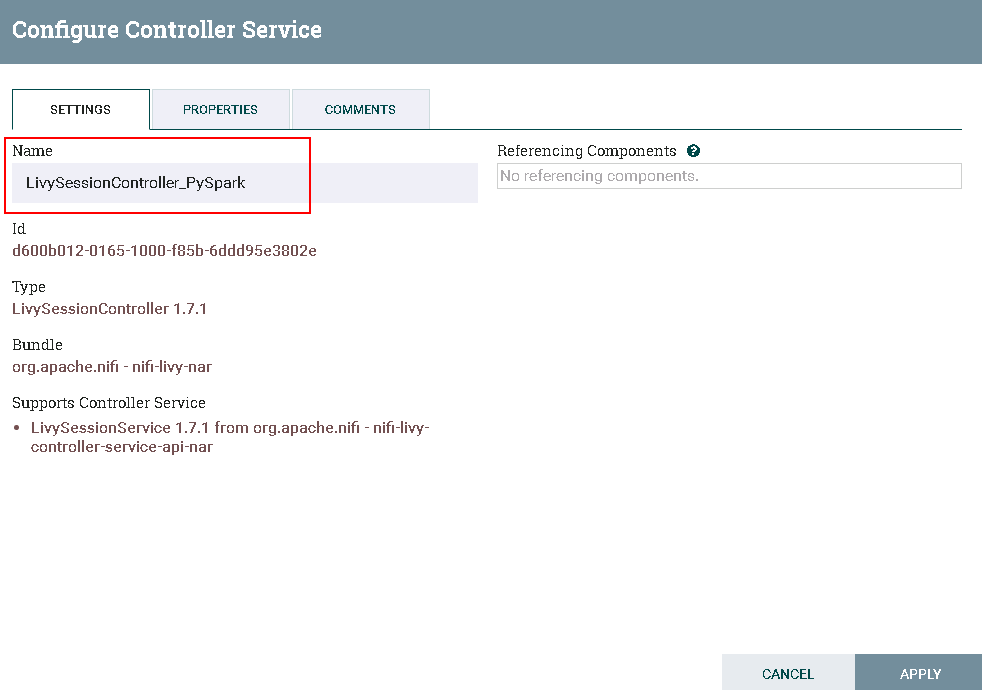

  

  ```
  具体配置如下：
  1: 172.21.3.43 (已安装Apache Livy的主机ip)
  2: 8998 (Livy默认端口，可更改)
  3: pysaprk
  4：KeytabCredentialsService
  ```

- 继续点击**加号**按钮添加服务

- 选择`LivySessionController`，点击**ADD**添加

- 点击**齿轮**图标进行配置

  

  更改Controller名字为 LivySessionController_SparkR

  

  

  ```
  具体配置如下：
  1: 172.21.3.43 (已安装Apache Livy的主机ip)
  2: 8998 (Livy默认端口，可更改)
  3: sparkr
  4：KeytabCredentialsService
  ```

- 点击**闪电**图标选择`Service and referencing components`生效并保存`LivySessionController`,`LivySessionController_PySpark`,`LivySessionController_SparkR`

  

- 完成

  

### 运行Spark样例操作步骤

- 整个过程的流程如图所示：

  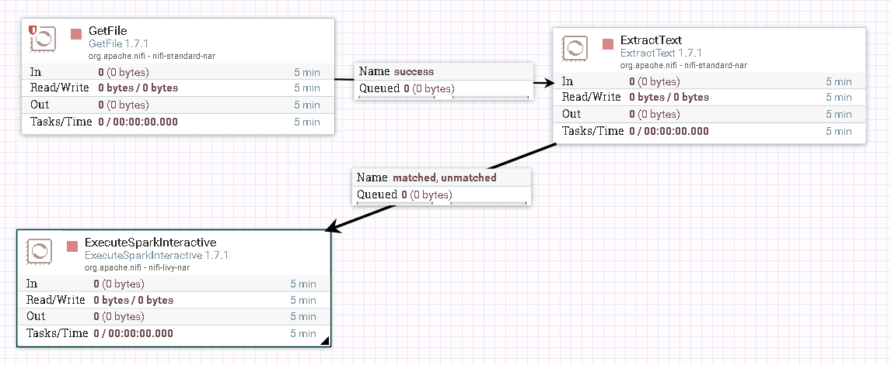

- 处理器GetFile配置如下：

  

  ```
  具体配置如下：
  1: /home/dataset/sparkTest
  2: code1.txt
  ```

  代码内容文件`code1.txt`的内容如下：
  ```
  1+2
  ```

- 处理器ExtractText配置如下：

  需要点击**加号**按钮，Property项命名为`code1`，Value项赋值为`$`

  

- 处理器ExecuteSparkInteractive配置为：

  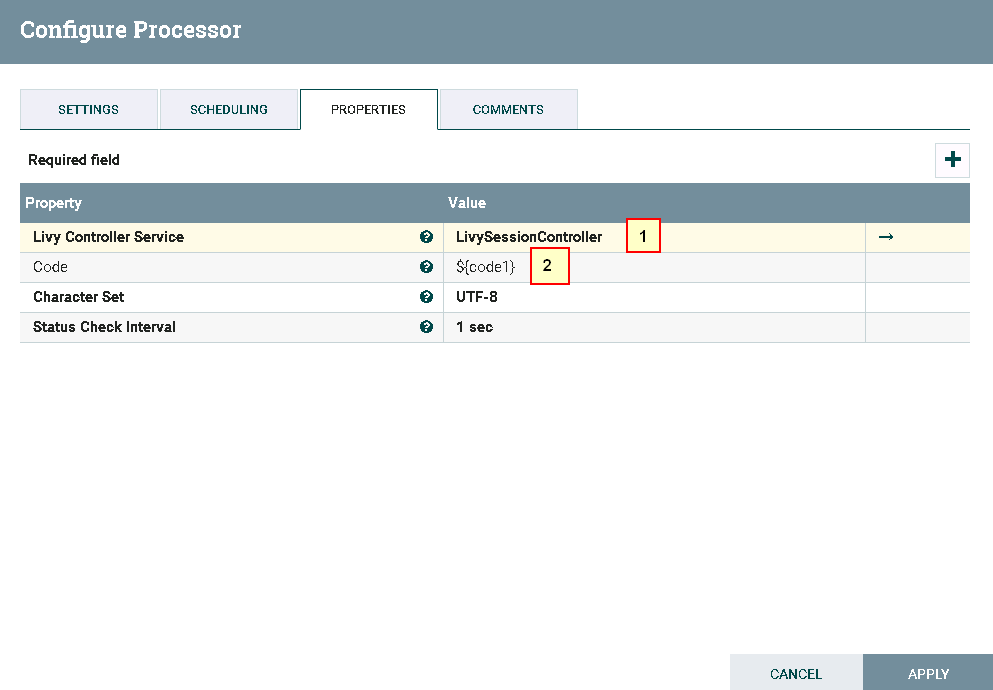

  ```
  具体配置如下：
  1: LivySessionController
  2: ${code1}
  ```

- 测试前将代码文件`code1.txt`上传至安装nifi主机的路径`/home/dataset/sparkTest`下：

  

  在已安装Livy的主机上启动Livy：

  

  

- 测试后：

  

  登录Livy sever查看测试结果

  

  

### 运行PySpark样例操作步骤

- 整个过程的流程如图所示：

  

- 处理器GetFile配置如下：

  
  ```
  具体配置如下：
  1: /home/dataset/sparkTest
  2: code2.txt
  ```

  代码内容文件`code2.txt`的内容如下：
  ```
  import random
  NUM_SAMPLES = 100000
  def sample(p):
    x, y = random.random(), random.random()
    return 1 if x*x + y*y < 1 else 0

  count = sc.parallelize(xrange(0, NUM_SAMPLES)).map(sample).reduce(lambda a, b: a + b)
  print "Pi is roughly %f" % (4.0 * count / NUM_SAMPLES)
  ```

- 处理器ExtractText配置如下：

  需要点击**加号**按钮，Property项命名为`code2`，Value项赋值为`$`

  

- 处理器ExecuteSparkInteractive配置为：

  

  ```
  具体配置如下：
  1: LivySessionController_PySpark
  2: ${code2}
  ```

- 测试前将代码文件`code2.txt`上传至安装nifi主机的路径`/home/dataset/sparkTest`下：

  

  在已安装Livy的主机上启动Livy

- 测试后

  

  登录Livy sever查看测试结果

  

  

### 运行SparkR样例操作步骤

  - 整个过程的流程如图所示：

  

  注意：在测试过程中如果与Spark，PySpark样例不完全一样

  - 处理器GetFile配置如下：

    

    ```
    具体配置如下：
    1: /home/dataset/sparkTest
    2: code3.txt
    ```

    代码内容文件`code3.txt`的内容如下：
    ```
    piR <- function(N) {
        x <- runif(N)
        y <- runif(N)
        d <- sqrt(x^2 + y^2)
        return(4 * sum(d < 1.0) / N)
    }

    set.seed(5)
    cat("Pi is roughly ",piR(1000000) )
    ```


  - 处理器ExecuteSparkInteractive配置为：

    
  ```
  具体配置如下：
  1: /home/dataset/sparkTest
  2: code3.txt里的代码内容
  ```

  - 测试前将代码文件`code3.txt`上传至安装nifi主机的路径`/home/dataset/sparkTest`下：

    

    在已安装Livy的主机上启动Livy

- 测试后

  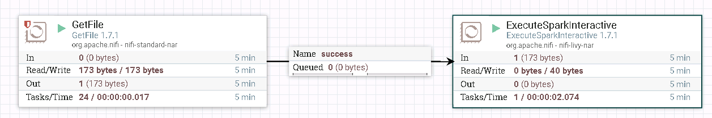

  登录Livy sever查看测试结果

  

  

## NiFi连接Kafka普通模式

### 操作场景

NiFi中配置kafka解析器，对的FI HD kafka 21005端口

### 前提条件

  - 已经完成NiFi 1.7.1的安装

  - 已完成FusionInsight HD和客户端的安装，包含kafka组件

  - 已完成 NiFi Kerberos认证配置

### GetHTTP & PutKafka 操作步骤

 - 整个过程的流程如图所示：

  


 - 驱动器GetHTTP的配置如下：

  

  ```
  具体配置如下：
  1: http://vincentarelbundock.github.io/Rdatasets/csv/datasets/iris.csv
  2: iris.csv
  ```
 - 驱动器PutKafka配置如下：

  

  ```
  具体配置如下：
  1： 172.21.3.102:21005,172.21.3.101:21005,172.21.3.103:21005
  2： nifi-kafka-test-demo
  3： nifi
  ```

- 测试前：

  登录FI客户端kafak组件，创建Topic **nifi-kafka-test-demo**
  ```
    cd /opt/hadoopclient/Kafka/kafka/bin
    kafka-topics.sh --create --topic nifi-kafka-test-demo --zookeeper 172.21.3.101:24002,172.21.3.102:24002,172.21.3.103:24002/kafka --partitions 1 --replication-factor 1
  ```  

  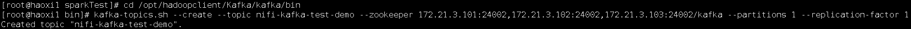

- 测试后：

  

  登录FI客户端kafak组件，查看结果：
  ```
  cd /opt/hadoopclient/Kafka/kafka/bin
  kafka-console-consumer.sh --zookeeper 172.21.3.101:24002,172.21.3.102:24002,172.21.3.103:24002/kafka --topic nifi-kafka-test-demo --from-beginning
  ```

  

  

### PublishKafka_0_11样例操作步骤
- 整个工作流为：

  

- 驱动器GetHTTP的配置如下：

  

  ```
  具体配置如下：
  1: http://vincentarelbundock.github.io/Rdatasets/csv/datasets/iris.csv
  2: iris.csv
  ```
- 驱动器PublishKafka_0_11的配置如下：

  

  ```
  1: 172.16.6.10:21005,172.16.6.11:21005,172.16.6.12:21005
  2: SASL_PLAINTEXT
  3: wikipedia21005
  6: Guarantee Replicated Delivery
  ```

- 启动整个工作流:

  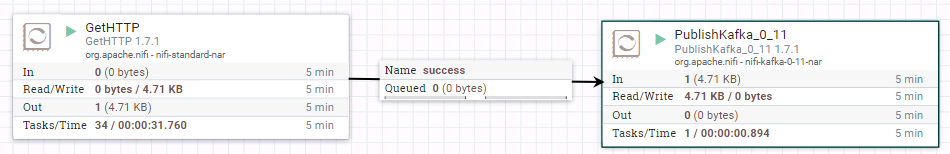

- 登陆FI HD kafka客户端检查结果：

  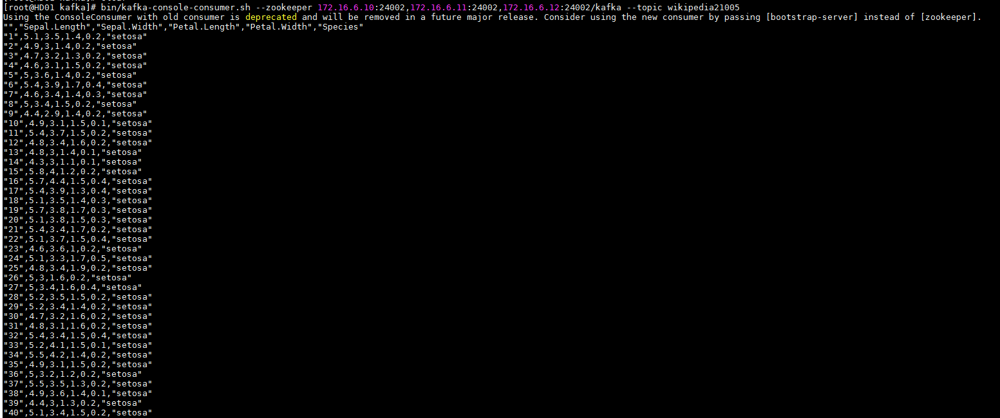

### ConsumeKafka_0_11 操作步骤

  - 整个过程的流程如图所示：
  

  - 处理器ConsumeKafka_0_11配置如下：

  

  ```
  1: 172.21.3.101:21005,172.21.3.102:21005,172.21.3.103:21005
  2: PLAINTEXT
  3: KeytabCredentialsService
  4: Kafka
  5: example-metric1
  6: DemoConsumer
  ```

  - 处理器PutFile配置如下：

  

  - 测试前：

    用eclipse打开客户端自带的kafka样例代码`kafka-examples`，调试使得样例代码能够正常运行`NewProducer.java`

    

    由于ConsumeKafka是实时获取日志信息的，所以在测试的时候需要先运行`NewProducer.java`往Kafka上传日志文件，再同时开启nifi的驱动器ConsumeKafka_0_11进行读取日志的测试

  - 测试后：

    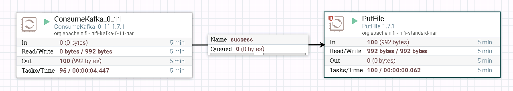

    登录路径`/home/dataset/Kafka`查看测试结果：

    

    


## NiFi连接Kafka安全模式

### 操作场景

NiFi中配置kafka解析器，对的FI HD kafka 21007端口

### 前提条件

- 已经完成NiFi 1.7.1的安装

- 已完成FusionInsight HD和客户端的安装，包含kafka组件

- 已完成 NiFi Kerberos认证配置

- nifi主机ip: 172.16.2.119, FI HD三节点ip: 172.16.6.10-12

### 认证相关操作步骤

- 在nifi主机/opt路径下新建jaas.conf文件，内容为：
  ```
  KafkaClient {
  com.sun.security.auth.module.Krb5LoginModule required
  useKeyTab=true
  principal="developuser@HADOOP.COM"
  keyTab="/opt/user_keytabs/101keytab/user.keytab"
  useTicketCache=false
  serviceName="kafka"
  storeKey=true
  debug=true;
  };
  ```

  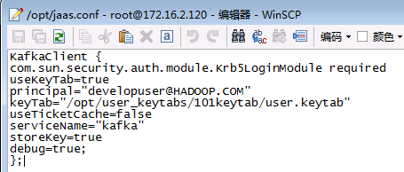

- 使用命令bin/nifi.sh stop停止nifi

- 在FI HD的kafka客户端中找到对应的kafka client jar包，比如/opt/hadoopclient/Kafka/kafka/libs/kafka-clients-1.1.0.jar

- 将nifi主机下`/opt/nifi/nifi-1.7.1/work/nar/extensions/nifi-kafka-0-11-nar-1.7.1.nar-unpacked/META-INF/bundled-dependencies`路径中原来的kafka client jar包kafka-clients-0.11.0.1.jar 使用重命名命令命名为 kafka-clients-0.11.0.1.jar.org 并且把上一步在 FI HD kafka客户端中找到的kafka-clients-1.1.0.jar复制到此路径下。

- 登陆nifi主机，先使用`source /opt/hadoopclient/bigdata_env`加载运行的环境变量，然后再使用如下命令加载java运行的jvm参数:`export JAVA_TOOL_OPTIONS="-Xmx512m -Xms64m -Djava.security.auth.login.config=/opt/jaas.conf -Dsun.security.krb5.debug=true -Dkerberos.domain.name=hadoop.hadoop.com -Djava.security.krb5.conf=/etc/krb5.conf"`

  其中/etc/krb5.conf为对应对接集群的认证krb5.conf文件

  完成上述步骤后可以使用命令`java -version`检查jvm参数是否加载成功：

  

- 使用命令bin/nifi.sh start启动nifi:

  

### PublishKafka_0_11样例操作步骤

- 整个工作流为：

  

- 驱动器GetHTTP的配置如下：

  

  ```
  具体配置如下：
  1: http://vincentarelbundock.github.io/Rdatasets/csv/datasets/iris.csv
  2: iris.csv
  ```
- 驱动器PublishKafka_0_11的配置如下：

  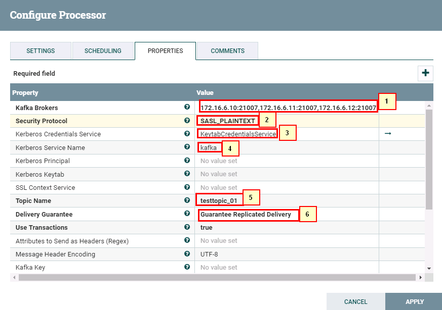

  ```
  1: 172.16.6.10:21007,172.16.6.11:21007,172.16.6.12:21007
  2: SASL_PLAINTEXT
  3: KeytabCredentialsService
  4: Kafka
  5: testtopic_01
  6: Guarantee Replicated Delivery
  ```

- 运行整个工作流：  

  

- 去集群kafka客户端检查：

  

### ConsumeKafka_0_11样例操作步骤

- 整个工作流为：

  

- 驱动器ConsumeKafka_0_11的配置如下：

  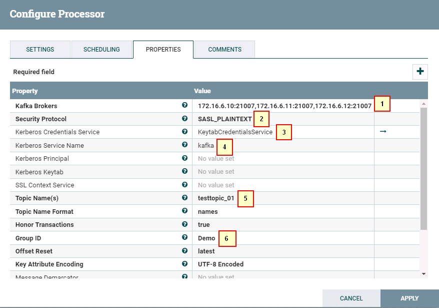

  ```
  1: 172.16.6.10:21007,172.16.6.11:21007,172.16.6.12:21007
  2: SASL_PLAINTEXT
  3: KeytabCredentialsService
  4: Kafka
  5: testtopic_01
  6: Demo
  ```

- 驱动器PutFile配置如下：

  

- 启动整个工作流

  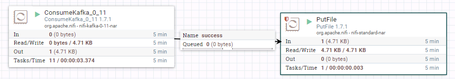

- 使用FI HD样例代码使用producer传数据：

  

- 登陆nifi主机/opt/nifikafka21007路径检查结果

  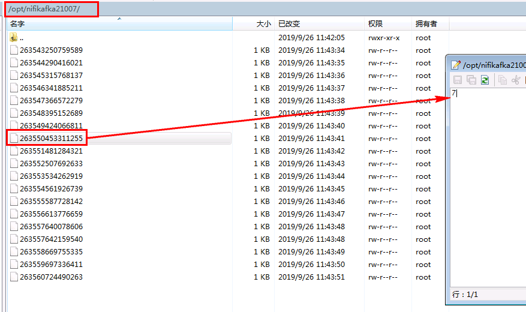


## NiFi对接Solr安全模式

### 环境说明

FI HD: 172.16.4.121-123
NIFI: 172.17.2.124

### FI HD相关配置:

1. 参考产品文档solr部分，做如下配置（可不做）：

  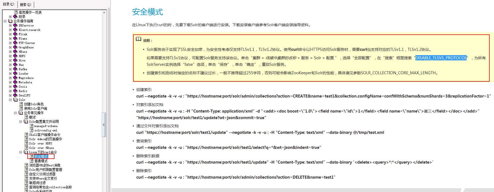

2. 使用如下curl命令在对接集群solr创建一个collection，名字叫做nifi_test

  `curl --negotiate -k -v -u : "https://172.16.4.122:21101/solr/admin/collections?action=CREATE&name=nifi_test&collection.configName=confWithSchema&numShards=3&replicationFactor=1"`


3. 登陆客户端，按照如下截图方式登陆kadmin，增加3个节点的HTTP服务principal

  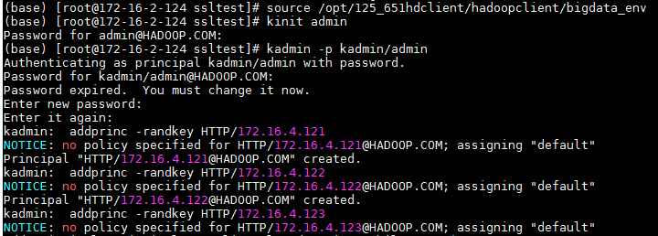

  注意：执行kadmin –p kadmin/admin命令时初始密码Admin@123，修改后需严格牢记新密码

4.  登陆oracle官网获取jce，并适配到对接FI HD集群中

  由于kerberos校验和加解密用到密钥长度远超出jre默认的安全字符长度，所以需要到java官网上下载Java Cryptography Extension (JCE)：https://www.oracle.com/technetwork/java/javase/downloads/jce8-download-2133166.html，然后解压到`%JAVA_HOME%/jre/lib/security`中替换相应的文件。

  具体将下载好jce解压，并将解压后的两个jar包`US_export_policy.jar`，`local_policy.jar`拷贝到三台服务器172.16.4.121,122,123的`/opt/huawei/Bigdata/common/runtime0/jdk-8u201/jre/lib/security/`路径下,并且重启solr服务

  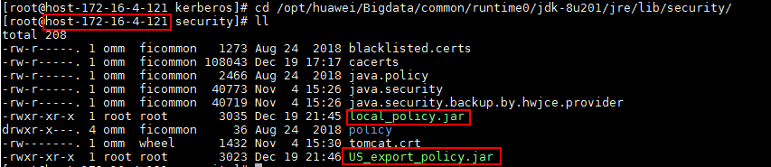

  

  

### NiFi kerberos相关配置

1.  nifi.properties配置文件：

    - web properties部分做如下更改：

      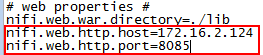

      - kerberos部分：

      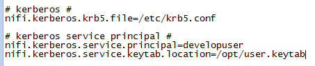

      - 增加sasl配置：

      ```
      nifi.zookeeper.auth.type=sasl
      nifi.zookeeper.kerberos.removeHostFromPrincipal=true
      nifi.zookeeper.kerberos.removeRealmFromPrincipal=true
      ```


2.    bootstrap.conf配置文件：

  - 增加一个jvm参数： `java.arg.17=-Djava.security.auth.login.config=/opt/jaas.conf`

  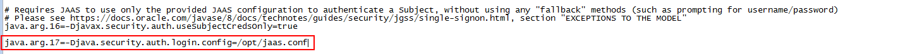

3.   因为对接solr，所以找到nifi关于solr的依赖包路径，以本机为例：`/opt/nifi/nifi-1.7.1/work/nar/extensions/nifi-solr-nar-1.7.1.nar-unpacked/META-INF/bundled-dependencies
`

  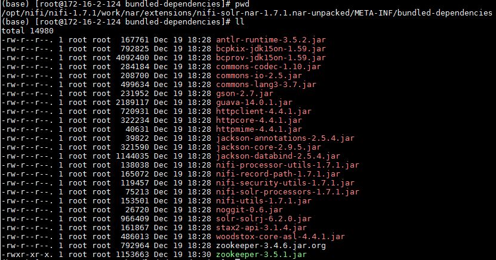

    将原有的zookeeper-3.4.6.jar重命名zookeeper-3.4.6.jar.org，再将FI HD的匹配zookeeper-3.5.1.jar拷贝过来


### SSL证书相关配置

说明：因为对接solr部署在安全模式上，使用rest接口进行交互的时候是要通过ssl层的认证，需要创建对应的证书（truststore），完成后还要使用spnego同集群solr进行交互。下面将介绍两种认证证书获取的方式，分别对应solr两种对接方法CLOUD和HTTPS

1.  huawei-huawei证书

    - 登陆linux后台（需要安装openssl），使用如下命令`openssl s_client -host 172.16.4.122 -port 21101 -prexit -showcerts\`

      会有三段证书，分别为huawei-huawei, huawei-FusionInsight, FusionInsight-172.16.4.122

      

      将huawei-huawei部分内容复制，拷贝到一个文件`/opt/ssltest/huawei-huawei.pem`文件中

      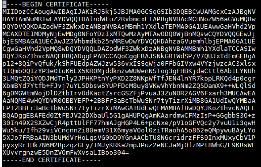

    - 使用命令`keytool -import -alias gca -file /opt/ssltest/huawei-huawei.pem -keystore /opt/ssltest/truststore`将上一步生成的`huawei-huawei.pem`证书内容加入`/opt/ssltest/truststore`文件中，过程中输入的密码为`changeit`，完成后输入yes

      

2. 证书链，因为由上已经知道了会生成一个证书链，包含三段，此步骤就是将整个证书链生成一个新的truststore_huawei文件

  - 使用命令`echo "" | openssl s_client -host 172.16.4.122 -port 21101 -showcerts | awk '/BEGIN CERT/ {p=1} ; p==1; /END CERT/ {p=0}' > /opt/ssltest/allcerts122.pem`将整个证书链重定向到`/opt/ssltest/allcerts122.pem`文件中

    

  - 使用命令`keytool -import -alias gca -file /opt/ssltest/allcerts122.pem -keystore /opt/ssltest/truststore_chain`将上一步生成的`allcerts122.pem`证书内容加入`/opt/ssltest/truststore_chain`文件中，过程中输入的密码为`changeit`，完成后输入yes

    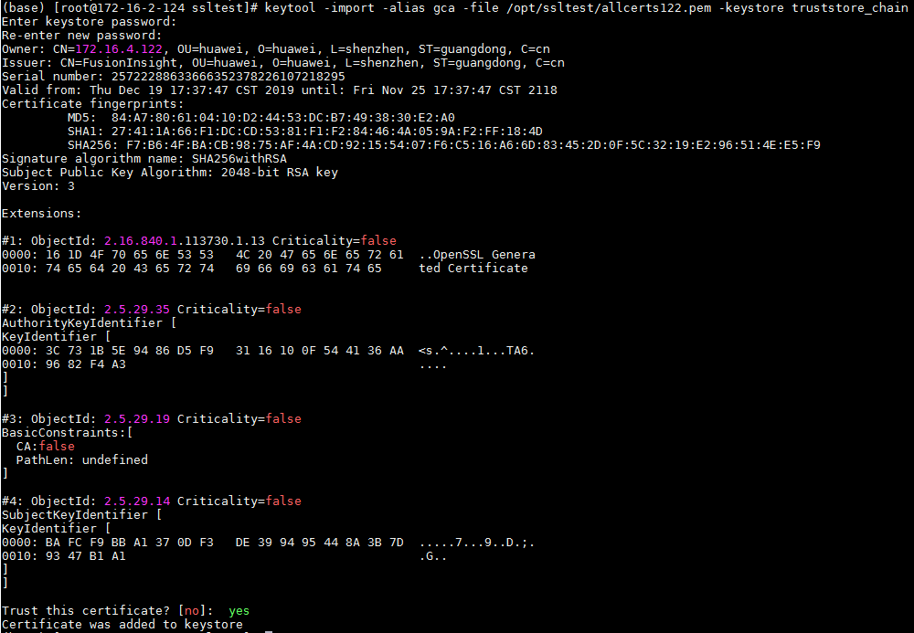


### NiFi PutSolrContentStream STANDARD模式工作流相关配置

说明：Standard模式直接通过HTTPS方式连接solr服务，SSL需要证书链truststore_chain

1.  配置 KeytabCredentialsService

  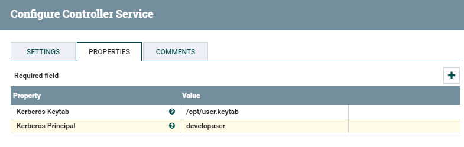

2.  配置 StandardRestrictedSSLContextService

  将这个contoller改名为CHAINStandardRestrictedSSLContextService便于区分

  ```
  1.  /opt/ssltest/truststore_chain
  2.  changeit
  3.  JKS
  4.  TLS
  ```

  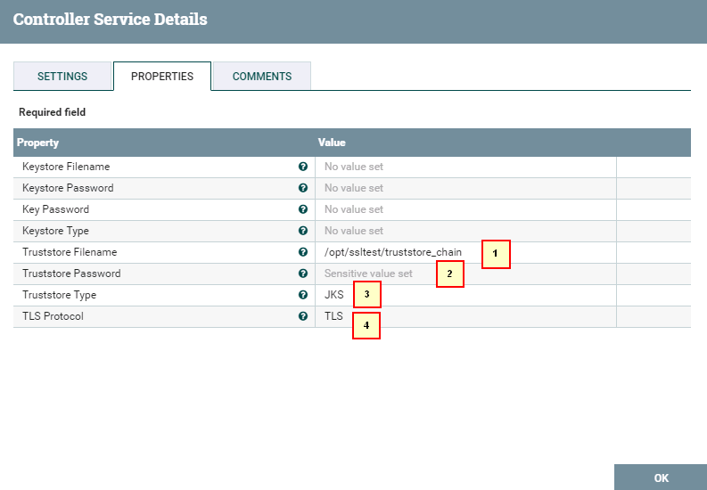


3.  整个PutSolrContentStream工作流如图：

  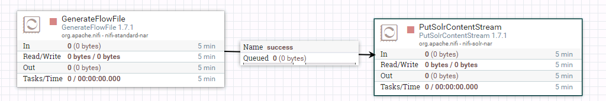


4.  GenerateFlowFile配置如下:

  ```
  {
  	"id":"${UUID()}",
  	"message":"The time is ${now()}"
  }
  ```

  

5.  PutSolrContentStream配置如下：

  

  ```
  1. Standard
  2. https://172.16.4.122:21101/solr/nifi_test
  3. nifi_test
  4. KeytabCredentialsService
  5. CHAINStandardRestrictedSSLContextService
  ```

6.  启动工作流

  

7.  登陆集群Manager界面，登陆solradmin webUI查看结果：

  


### NiFi PutSolrContentStream CLOUD模式工作流相关配置

说明：Cloud模式先连接集群zookeeper服务然后再读取solr连接信息连接solr服务，SSL只需要huawei-huawei证书truststore即可。

1.  配置 KeytabCredentialsService

  

2.  配置 StandardRestrictedSSLContextService

  ```
  1.  /opt/ssltest/truststore
  2.  changeit
  3.  JKS
  4.  TLS
  ```

  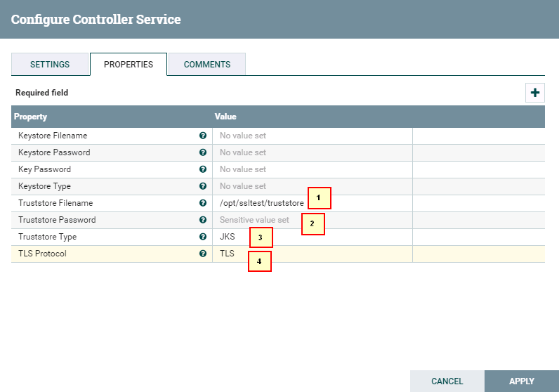


3.  整个PutSolrContentStream工作流如图：

    


4.  GenerateFlowFile配置如下:

    ```
    {
    	"id":"${UUID()}",
    	"message":"The time is ${now()}"
    }
    ```

    

5.  PutSolrContentStream配置如下：

    

    ```
    1. Cloud
    2. 172.16.4.122:24002/solr
    3. nifi_test
    4. KeytabCredentialsService
    5. StandardRestrictedSSLContextService
    ```

6.  启动工作流

    

7.  登陆集群Manager界面，登陆solradmin webUI查看结果：

    


### NIFI QuerySolr 工作流相关配置

说明：QuerySolr连接solr方式也可以选择Standard或者Cloud模式，区别就是请求的链接，以及SSL证书配置不一样，其他一样，链接信息参考上面的配置

- 整个工作流如下：

  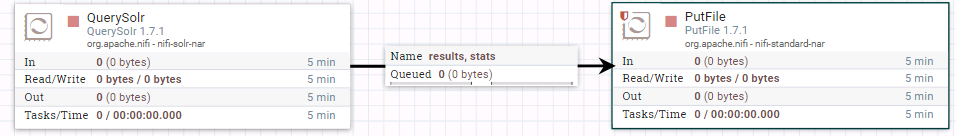

- QuerySolr Standard配置如下：

  

  ```
  1. Standard
  2. https://172.16.4.122:21101/solr/nifi_test
  3. nifi_test
  4. KeytabCredentialsService
  5. CHAINStandardRestrictedSSLContextService
  ```

- QuerySolr Cloud配置如下：

  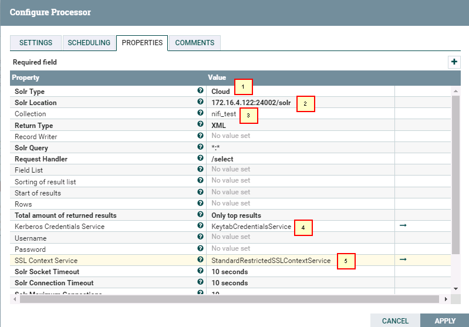

  ```
  1. Cloud
  2. 172.16.4.122:24002/solr
  3. nifi_test
  4. KeytabCredentialsService
  5. StandardRestrictedSSLContextService
  ```

- PutFile配置如下：

  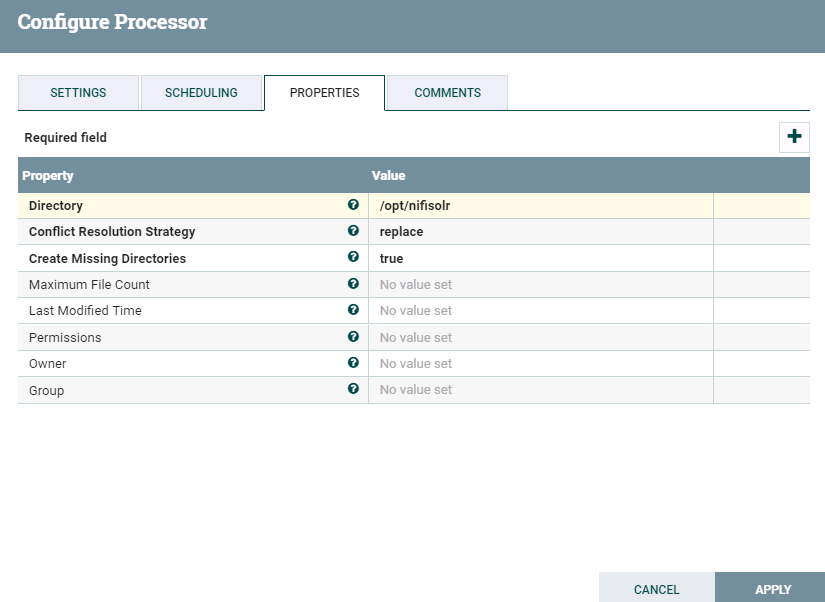

- 启动工作流：

  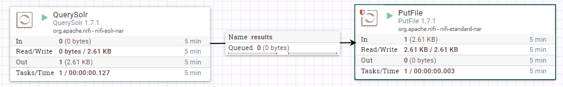

- 登陆后台查看结果：

  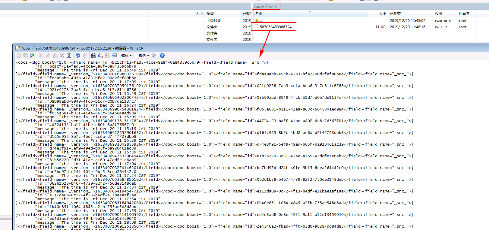
