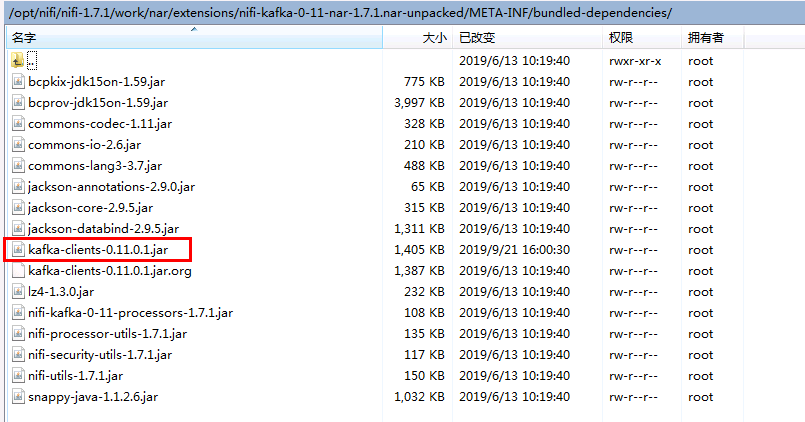
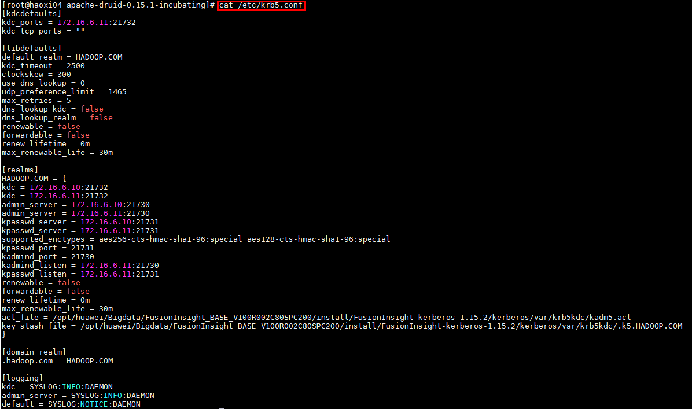

## NiFi connection to Kafka with security mode

### Operational scenario

Configure kafka processor in NiFi, connect FI HD kafka with port 21007

### Precondition

- Completed the installation of NiFi 1.7.1

- Completed FusionInsight HD and client installation, including kafka components

- Completed NiFi Kerberos authentication configuration

- nifi host ip: 172.16.2.119, FI HD three server ip: 172.16.6.10-12

### Authentication related configure steps

- Create a new jaas.conf file in the nifi host `/opt` path. The content is:
  ```
  KafkaClient {
  com.sun.security.auth.module.Krb5LoginModule required
  useKeyTab=true
  principal="developuser@HADOOP.COM"
  keyTab="/opt/user_keytabs/101keytab/user.keytab"
  useTicketCache=false
  serviceName="kafka"
  storeKey=true
  debug=true;
  };
  ```

  

- Stop nifi with the command `bin/nifi.sh stop`

- Find the corresponding kafka client jar package in the FI HD kafka client.，eg: `/opt/hadoopclient/Kafka/kafka/libs/kafka-clients-0.11.0.1.jar`

  

- Come to nifi host's directory: `/opt/nifi/nifi-1.7.1/work/nar/extensions/nifi-kafka-0-11-nar-1.7.1.nar-unpacked/META-INF/bundled-dependencies`. Replace the original kafka-clients-0.11.0.1.jar with the FI HD client's kafka-clients-0.11.0.1.jar covered on last step

  

  Note：Huawei FI HD kafka client's kafka-clients-0.11.0.1.jar is larger

- Come to nifi host. Load the running environment variable first with `source /opt/hadoopclient/bigdata_env`. Then use the following command to load the jvm parameter of the java run:`export JAVA_TOOL_OPTIONS="-Xmx512m -Xms64m -Djava.security.auth.login.config=/opt/jaas.conf -Dsun.security.krb5.debug=true -Dkerberos.domain.name=hadoop.hadoop.com -Djava.security.krb5.conf=/etc/krb5.conf"`

  Where /etc/krb5.conf is the authentication krb5.conf file for the corresponding FI HD cluster.

  

  After completing the above steps, you can use the command `java -version` to check if the jvm parameter is loaded successfully:

  

- Start nifi with the command `bin/nifi.sh start`:

  

### PublishKafka_0_11 sample operation steps

- Overall workflow:

  

- The configuration of the processor GetHTTP is as follows:

  

  ```
  In detail:
  1: http://vincentarelbundock.github.io/Rdatasets/csv/datasets/iris.csv
  2: iris.csv
  ```
- The configuration of the processor PublishKafka_0_11 is as follows:

  

  ```
  1: 172.16.6.10:21007,172.16.6.11:21007,172.16.6.12:21007
  2: SASL_PLAINTEXT
  3: KeytabCredentialsService
  4: Kafka
  5: testtopic_01
  6: Guarantee Replicated Delivery
  ```

- Running workflow：  

  

- Come to kafka client to check the outcome：

  

### ConsumeKafka_0_11 sample operation steps

- Overall workflow：

  

- The configuration of the processor ConsumeKafka_0_11 is as follows：

  

  ```
  1: 172.16.6.10:21007,172.16.6.11:21007,172.16.6.12:21007
  2: SASL_PLAINTEXT
  3: KeytabCredentialsService
  4: Kafka
  5: testtopic_01
  6: Demo
  ```

- The configuration of the processor PutFile is as follows：

  

- Running workflow

  

- Use the FI HD sample code to use the produce the data:

  

- Come to the druid host `/opt/nifikafka21007` directory to check result

  
