# Confluent对接FusionInsight

## 使用场景

> Confluent 4.1.0 <--> FusionInsight HD V100R002C80SPC200 (HDFS/Kafka)
>
> Confluent 4.1.0 <--> FusionInsight HD 6.5 (HDFS/Kafka)

## 安装Confluent

### 操作步骤

- 登录Confluent官方网站下载页面：<https://www.confluent.io/previous-versions/?_ga=2.102961223.611794173.1561088831-1783953529.1561088831>

  找到相应的版本下载

  

- 将下载的开源压缩包使用WinSCP工具上传至linux主机，使用`tar -xvf confluent-oss-4.1.0-2.11.tar`解压

  

- 增加confluent环境变量

  使用命令`vi ~/.bashrc`，增加confluent bin目录到PATH环境变量中，完成后使用`source ~/.bashrc`使之生效

  

## 配置Confluent

说明：Confluent启动时会起自己的zookeeper和kafka服务，这里不做修改。需要更改的是connect， schema-registry以及ksql服务配置，使得这些服务直接对接FusionInsight HD安全模式的zookeeper和kafka服务

### 操作步骤

- 在confluent安装目录\share\java下新建路径，名为huawei

  

- 到FusionInsight 6.5.1的kafka客户端下获取 kafka-clients-1.1.0.jar， 注意即使对接FI HD 2.8版版本也需要对应于FI HD 6.5.1的 kafka-clients-1.1.0.jar 包，否则会报kafka版本匹配相关问题

- 将kafka-clients-1.1.0.jar拷贝至第一步新建的huawei路径下

  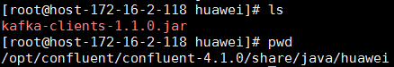


- 在路径/opt/confluent/confluent-4.1.0/bin下找到connect-distributed文件，进行如下编辑：

  在适当位置添加KAFKA_OPTS的启动JVM参数

  

  具体内容为：

  `export KAFKA_OPTS="-Dzookeeper.server.principal=zookeeper/hadoop.hadoop.com -Djava.security.krb5.conf=/opt/user_keytabs/101keytab/krb5.conf -Dkerberos.domain.name=hadoop.hadoop.com"`

  其中-Djava.security.krb5.conf=/opt/user_keytabs/101keytab/krb5.conf为对接集群认证的krb5.conf文件，可在集群 anager页面上获取

  另外还可以添加 -Dsun.security.krb5.debug=true 打开kerberos认证日志开关，进行错误定位、排查

- 在前面位置将huawei路径引进去

    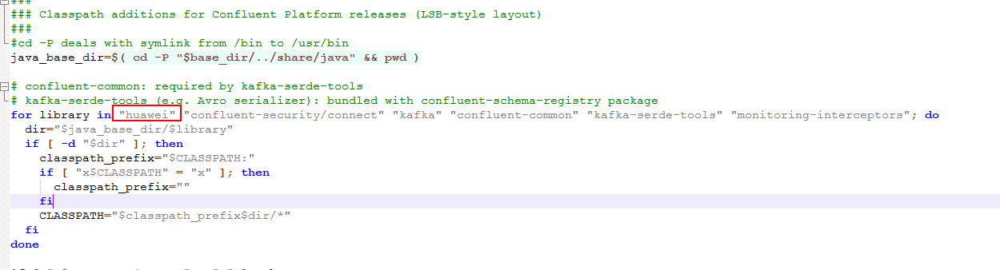


- 修改/opt/confluent/confluent-4.1.0/etc/kafka/connect-distributed.properties配置文件

  1.  修改bootstrap.servers为对接FI HD集群kafka地址

    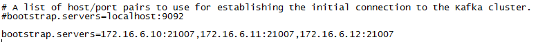

  2.  在配置文件最后增加内容如下,配置Kerberos认证相关参数：

    ```
      sasl.mechanism=GSSAPI
      sasl.kerberos.service.name=kafka
      kerberos.domain.name=hadoop.hadoop.com
      security.protocol=SASL_PLAINTEXT
      sasl.jaas.config=com.sun.security.auth.module.Krb5LoginModule required \
         useKeyTab=true \
         storeKey=true \
         keyTab="/opt/user_keytabs/101keytab/user.keytab" \
         principal="developuser@HADOOP.COM";

      producer.sasl.mechanism=GSSAPI
      producer.sasl.kerberos.service.name=kafka
      kerberos.domain.name=hadoop.hadoop.com
      # Configure SASL_SSL if SSL encryption is enabled, otherwise configure SASL_PLAINTEXT
      producer.security.protocol=SASL_PLAINTEXT
      producer.sasl.jaas.config=com.sun.security.auth.module.Krb5LoginModule required \
         useKeyTab=true \
         storeKey=true \
         keyTab="/opt/user_keytabs/101keytab/user.keytab" \
         principal="developuser@HADOOP.COM";

      consumer.sasl.mechanism=GSSAPI
      consumer.sasl.kerberos.service.name=kafka
      kerberos.domain.name=hadoop.hadoop.com
      # Configure SASL_SSL if SSL encryption is enabled, otherwise configure SASL_PLAINTEXT
      consumer.security.protocol=SASL_PLAINTEXT
      consumer.sasl.jaas.config=com.sun.security.auth.module.Krb5LoginModule required \
         useKeyTab=true \
         storeKey=true \
         keyTab="/opt/user_keytabs/101keytab/user.keytab" \
         principal="developuser@HADOOP.COM";
    ```

    

- 修改/opt/confluent/confluent-4.1.0/etc/schema-registry/connect-avro-distributed.properties配置文件，与上一步类似：

  1.  修改bootstrap.servers为对接FI HD集群kafka地址

    

  2.  在配置文件最后增加内容如下,配置Kerberos认证相关参数：

    ```
    sasl.mechanism=GSSAPI
    sasl.kerberos.service.name=kafka
    kerberos.domain.name=hadoop.hadoop.com
    security.protocol=SASL_PLAINTEXT
    sasl.jaas.config=com.sun.security.auth.module.Krb5LoginModule required \
       useKeyTab=true \
       storeKey=true \
       debug=true \
       keyTab="/opt/user_keytabs/101keytab/user.keytab" \
       principal="developuser@HADOOP.COM";

    producer.sasl.mechanism=GSSAPI
    producer.sasl.kerberos.service.name=kafka
    producer.kerberos.domain.name=hadoop.hadoop.com
    # Configure SASL_SSL if SSL encryption is enabled, otherwise configure SASL_PLAINTEXT
    producer.security.protocol=SASL_PLAINTEXT
    producer.sasl.jaas.config=com.sun.security.auth.module.Krb5LoginModule required \
       useKeyTab=true \
       storeKey=true \
       debug=true \
       keyTab="/opt/user_keytabs/101keytab/user.keytab" \
       principal="developuser@HADOOP.COM";

    consumer.sasl.mechanism=GSSAPI
    consumer.sasl.kerberos.service.name=kafka
    consumer.kerberos.domain.name=hadoop.hadoop.com
    # Configure SASL_SSL if SSL encryption is enabled, otherwise configure SASL_PLAINTEXT
    consumer.security.protocol=SASL_PLAINTEXT
    consumer.sasl.jaas.config=com.sun.security.auth.module.Krb5LoginModule required \
       useKeyTab=true \
       storeKey=true \
       debug=true \
       keyTab="/opt/user_keytabs/101keytab/user.keytab" \
       principal="developuser@HADOOP.COM";
    ```

    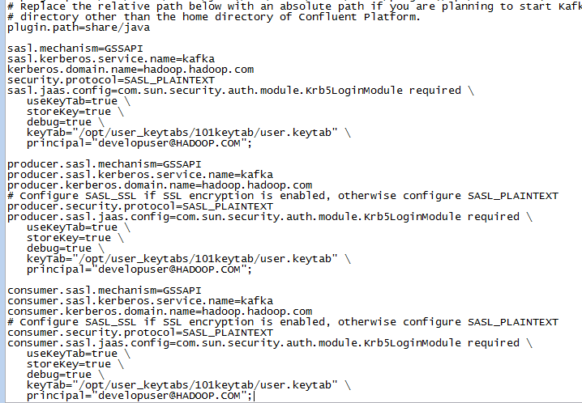

- 修改/opt/confluent/confluent-4.1.0/bin/ksql-run-class文件如下，目的是在起ksql-server服务的时候能够在classpath里加载到之前导入的华为kafka jar包：

  

- 修改/opt/confluent/confluent-4.1.0/etc/ksql/ksql-server.properties配置文件

  ```
  #bootstrap.servers=localhost:9092
  security.protocol = SASL_PLAINTEXT
  bootstrap.servers=172.16.6.10:21007,172.16.6.11:21007,172.16.6.12:21007
  kerberos.domain.name = hadoop.hadoop.com
  listeners=http://localhost:8088
  ksql.server.ui.enabled=true
  sasl.mechanism=GSSAPI
  sasl.kerberos.service.name=kafka
  sasl.jaas.config=com.sun.security.auth.module.Krb5LoginModule required \
  	useKeyTab=true \
  	storeKey=true \
  	debug=true \
  	keyTab="/opt/user_keytabs/101keytab/user.keytab" \
  	principal="developuser@HADOOP.COM";
  ```

  

- 使用命令confluent start启动

  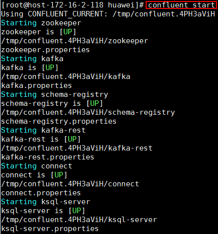


## 使用Confluent KSQL服务查询FI HD集群Kafka的Topic

### 前提条件

完成 FI HD Kafka样例代码调试，具体参考 https://support-it.huawei.com/solution-fid-gw/#/Intelligent_Data_Developer_Platform 下载，调试kafka样例代码

### 操作步骤

- 使用如下命令启动KSQL CLI

  `LOG_DIR=/opt/confluent/confluent-4.1.0/ksql_logs /opt/confluent/confluent-4.1.0/bin/ksql http://localhost:8088`

  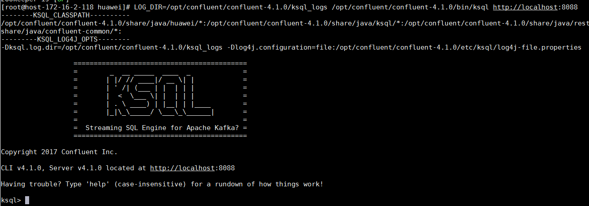

- 在KSQL CLI中使用如下命令创建一个STREAM

  ```
  CREATE STREAM TEST_01 (id BIGINT) \
  WITH (KAFKA_TOPIC='testtopic_01', VALUE_FORMAT='DELIMITED', KEY = 'id');
  ```

  

- 配置KAFKA样例代码中的producer代码,使用21007端口的安全模式：

  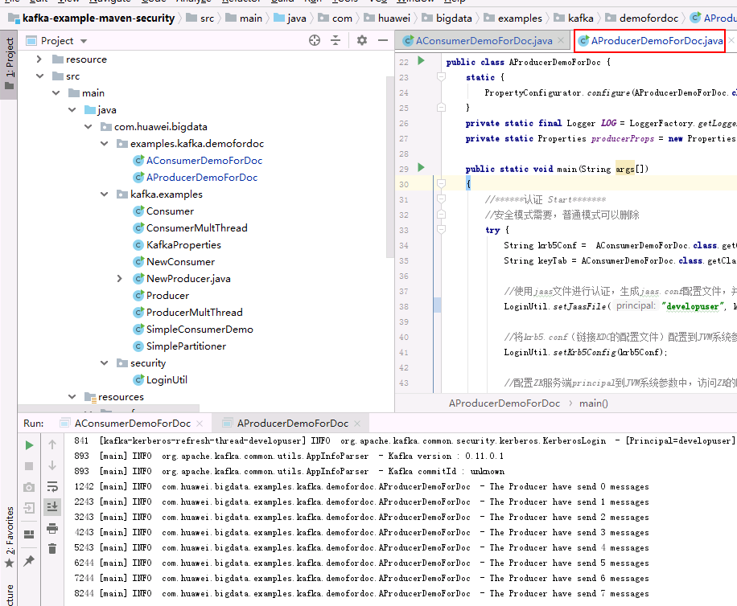

- 同时在KSQL CLI中使用如下命令查询，检查结果：

  `select ID from TEST_01;`

  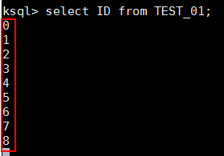

## 使用Confluent connect服务同步本地文件信息

### 前提条件

完成Confluent安装，配置

### 操作步骤

- 配置/opt/confluent/confluent-4.1.0/etc/kafka/connect-file-source.properties文件：

  

- 配置/opt/confluent/confluent-4.1.0/etc/kafka/connect-file-sink.properties文件：
  

- 在路径/opt/confluent/confluent-4.1.0下新建空文件test.txt

- 使用confluent start命令启动confluent

  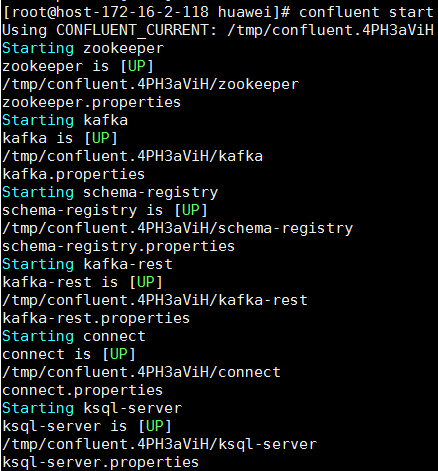

- 使用如下命令添加file-source, file-sink， 完成后查看connector状态

  ```
  confluent load file-source
  confluent load file-sink
  confluent status connectors
  ```

  

- 在test.txt空文件中输入信息，保存，在生成的test.sink.txt文件中查看信息同步情况

  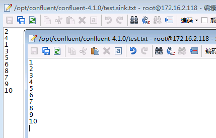

- 登录对接集群kafka客户端，使用命令`bin/kafka-console-consumer.sh --topic connect-test --bootstrap-server 172.16.6.10:21007,172.16.6.11:21007,172.16.6.12:21007 --consumer.config config/consumer.properties -from-beginning`查看同步kafka的topic

  


## 使用Confluent connect服务同步本地文件到FusionInsight HDFS

### 前提条件

完成Confluent安装，配置

### 操作步骤

- 登录对接FusionInsight HD集群，查看hdfs配置：

  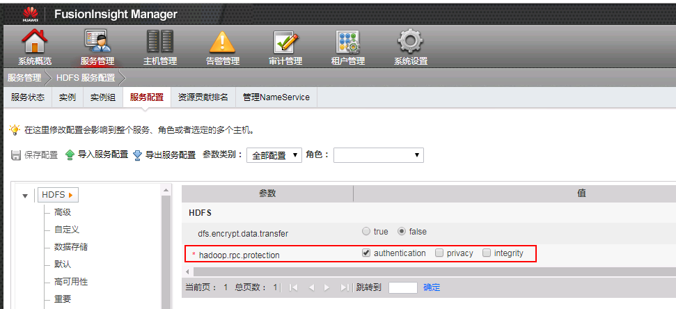

- 安装kafka-connect-hdfs connector, 参考：https://docs.confluent.io/current/connect/managing/install.html

  

  在Confluent Hub上下载版本匹配的plugin包：

  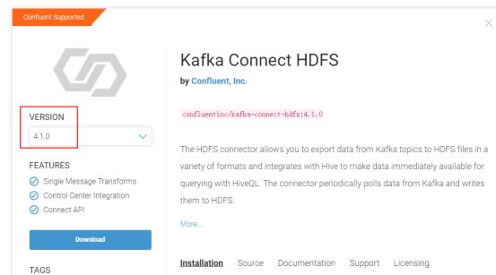

- 将下载好的confluentinc-kafka-connect-hdfs-4.1.0.zip压缩包本地解压，并使用WinSCP上传到/opt/confluent/confluent-4.1.0/share/java路径下

  


- 修改/opt/confluent/confluent-4.1.0/etc/kafka/connect-distributed.properties配置文件中的plugin.path

  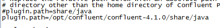

- 修改/opt/confluent/confluent-4.1.0/etc/schema-registry/connect-avro-distributed.properties配置文件中的plugin.path

  

- 配置/opt/confluent/confluent-4.1.0/etc/kafka-connect-hdfs/quickstart-hdfs.properties

  

- 修改/opt/confluent/confluent-4.1.0/etc/kafka/connect-file-source.properties文件同步的topic为test_hdfs:

  

- 在/opt/confluent/confluent-4.1.0路径下新建test_hdfs.txt的空文件

- 在对接集群的hdfs上查看/tmp路径是否存在,没有需要创建

  

- 重启confluent, 启动之后检查`file-source`是否为跟新后的配置，如果不是，使用`confluent unload file-source`卸载重新`confluent load file-source`加载

  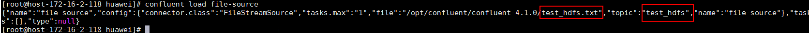

- 使用如下命令加载hdfs-sink

  `confluent load hdfs-sink -d /opt/confluent/confluent-4.1.0/etc/kafka-connect-hdfs/quickstart-hdfs.properties`

  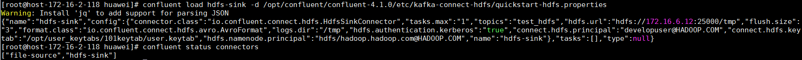

- 打开/opt/confluent/confluent-4.1.0/test_hdfs.txt文件,输入以下信息

  

- 到对接集群kafka端消费用于传输的topic test_hdfs

  

- 登录到对接集群的hdfs上/tmp路径下查看结果

  

  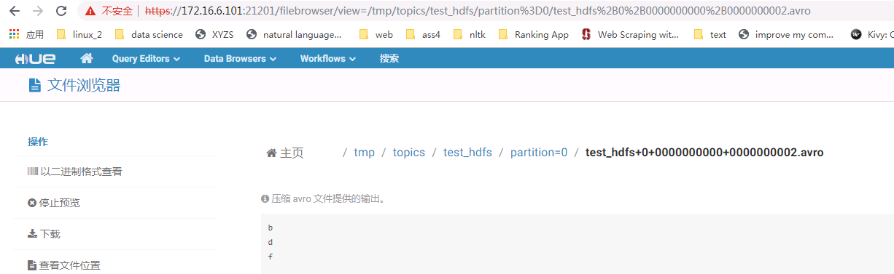

  
