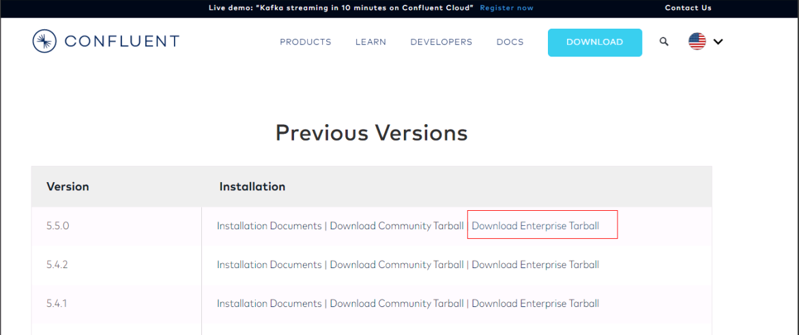
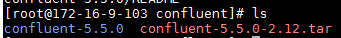
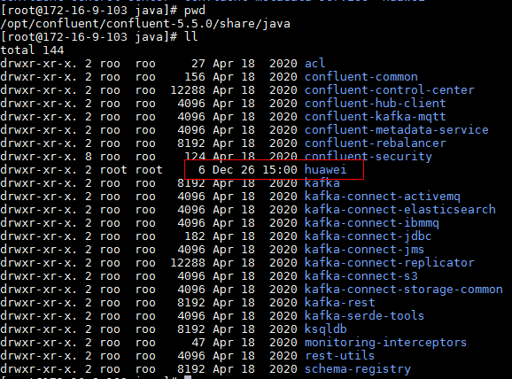
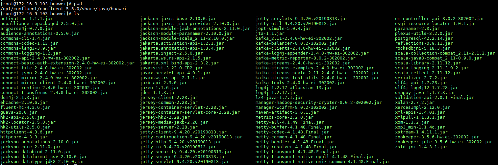
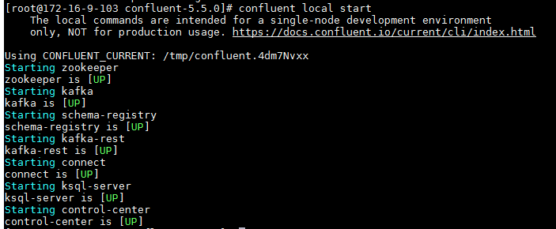
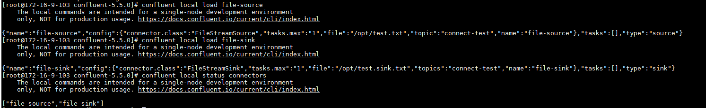
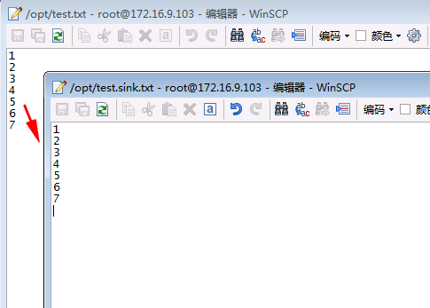
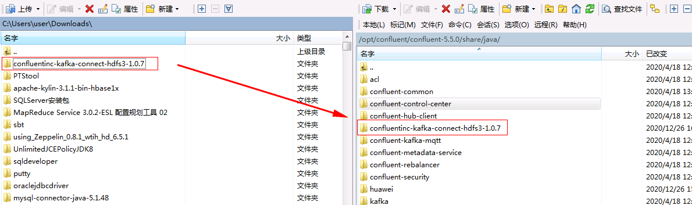
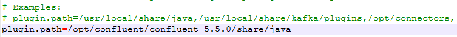
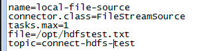

# Confluent对接FusionInsight

## 使用场景

> Confluent 4.1.0 <--> FusionInsight HD V100R002C80SPC200 (HDFS/Kafka)
>
> Confluent 4.1.0 <--> FusionInsight HD 6.5 (HDFS/Kafka)
>
> Confluent 5.5.0 <--> FusionInsight MRS 8.0 (HDFS/Kafka)

## MRS 8.0 对接说明

说明： Confluent 5.5.0对接FusionInsight MRS 8.0时KSQL功能不支持

## 安装Confluent

### 操作步骤

- 登录Confluent官方网站下载页面：<https://www.confluent.io/previous-versions/?_ga=2.102961223.611794173.1561088831-1783953529.1561088831>

  找到相应的版本下载

  

- 将下载的开源压缩包使用WinSCP工具上传至linux主机，使用`tar -xvf confluent-5.5.0-2.12.tar`解压

  

- 增加confluent环境变量

  使用命令`vi ~/.bashrc`，增加confluent bin目录到PATH环境变量中，完成后使用`source ~/.bashrc`使之生效

  

## 配置Confluent

说明：Confluent启动时会起自己的zookeeper和kafka服务，这里不做修改。需要更改的是connect， schema-registry以及ksql服务配置，使得这些服务直接对接FusionInsight MRS安全模式的zookeeper和kafka服务

### 操作步骤

- 在confluent安装目录\share\java下新建路径，名为huawei

  

- 到FusionInsight 8.0的kafka客户端下的Jar包拷贝至上述创建的huawei路径中

  `cp /opt/115_hadoopclient/hadoopclient/Kafka/kafka/libs/*.jar /opt/confluent/confluent-5.5.0/share/java/huawei/`

  

- 在路径/opt/confluent/confluent-5.5.0/bin下找到connect-distributed文件，进行如下编辑：

  在适当位置添加KAFKA_OPTS的启动JVM参数

  

  具体内容为：

  `export KAFKA_OPTS="-Dzookeeper.server.principal=zookeeper/hadoop.hadoop.com -Djava.security.krb5.conf=/opt/115_hadoopclient/krb5.conf -Dkerberos.domain.name=hadoop.hadoop.com"`

  其中-Djava.security.krb5.conf=/opt/115_hadoopclient/krb5.conf为对接集群认证的krb5.conf文件，可在集群 Manager页面上获取

  另外还可以添加 -Dsun.security.krb5.debug=true 打开kerberos认证日志开关，进行错误定位、排查

- 在前面位置将huawei路径引进去

    


- 修改/opt/confluent/confluent-5.5.0/etc/kafka/connect-distributed.properties配置文件

  1.  修改bootstrap.servers为对接FI HD集群kafka地址

      

  2.  在配置文件最后增加内容如下,配置Kerberos认证相关参数：

    ```
    sasl.mechanism=GSSAPI
    sasl.kerberos.service.name=kafka
    kerberos.domain.name=hadoop.hadoop.com
    security.protocol=SASL_PLAINTEXT
    sasl.jaas.config=com.sun.security.auth.module.Krb5LoginModule required \
       useKeyTab=true \
       storeKey=true \
       keyTab="/opt/115_hadoopclient/user.keytab" \
       principal="developuser@HADOOP.COM";

    producer.sasl.mechanism=GSSAPI
    producer.sasl.kerberos.service.name=kafka
    kerberos.domain.name=hadoop.hadoop.com
    # Configure SASL_SSL if SSL encryption is enabled, otherwise configure SASL_PLAINTEXT
    producer.security.protocol=SASL_PLAINTEXT
    producer.confluent.monitoring.interceptor.security.protocol=SASL_PLAINTEXT
    producer.sasl.jaas.config=com.sun.security.auth.module.Krb5LoginModule required \
       useKeyTab=true \
       storeKey=true \
       keyTab="/opt/115_hadoopclient/user.keytab" \
       principal="developuser@HADOOP.COM";

    consumer.sasl.mechanism=GSSAPI
    consumer.sasl.kerberos.service.name=kafka
    kerberos.domain.name=hadoop.hadoop.com
    # Configure SASL_SSL if SSL encryption is enabled, otherwise configure SASL_PLAINTEXT
    consumer.security.protocol=SASL_PLAINTEXT
    consumer.confluent.monitoring.interceptor.security.protocol=SASL_PLAINTEXT
    consumer.sasl.jaas.config=com.sun.security.auth.module.Krb5LoginModule required \
       useKeyTab=true \
       storeKey=true \
       keyTab="/opt/115_hadoopclient/user.keytab" \
       principal="developuser@HADOOP.COM";
    ```

    

- 修改/opt/confluent/confluent-5.5.0/etc/schema-registry/connect-avro-distributed.properties配置文件，与上一步类似：

  1.  修改bootstrap.servers为对接FI MRS集群kafka地址

    

  2.  在配置文件最后增加内容如下,配置Kerberos认证相关参数：

    ```
    sasl.mechanism=GSSAPI
    sasl.kerberos.service.name=kafka
    kerberos.domain.name=hadoop.hadoop.com
    security.protocol=SASL_PLAINTEXT
    sasl.jaas.config=com.sun.security.auth.module.Krb5LoginModule required \
       useKeyTab=true \
       storeKey=true \
       keyTab="/opt/115_hadoopclient/user.keytab" \
       principal="developuser@HADOOP.COM";

    producer.sasl.mechanism=GSSAPI
    producer.sasl.kerberos.service.name=kafka
    kerberos.domain.name=hadoop.hadoop.com
    # Configure SASL_SSL if SSL encryption is enabled, otherwise configure SASL_PLAINTEXT
    producer.security.protocol=SASL_PLAINTEXT
    producer.confluent.monitoring.interceptor.security.protocol=SASL_PLAINTEXT
    producer.sasl.jaas.config=com.sun.security.auth.module.Krb5LoginModule required \
       useKeyTab=true \
       storeKey=true \
       keyTab="/opt/115_hadoopclient/user.keytab" \
       principal="developuser@HADOOP.COM";

    consumer.sasl.mechanism=GSSAPI
    consumer.sasl.kerberos.service.name=kafka
    kerberos.domain.name=hadoop.hadoop.com
    # Configure SASL_SSL if SSL encryption is enabled, otherwise configure SASL_PLAINTEXT
    consumer.security.protocol=SASL_PLAINTEXT
    consumer.confluent.monitoring.interceptor.security.protocol=SASL_PLAINTEXT
    consumer.sasl.jaas.config=com.sun.security.auth.module.Krb5LoginModule required \
       useKeyTab=true \
       storeKey=true \
       keyTab="/opt/115_hadoopclient/user.keytab" \
       principal="developuser@HADOOP.COM";
    ```

    


- 使用命令confluent local start启动

  


## 使用Confluent connect服务同步本地文件信息

### 前提条件

完成Confluent安装，配置

### 操作步骤

- 配置/opt/confluent/confluent-5.5.0/etc/kafka/connect-file-source.properties文件：

  

- 配置/opt/confluent/confluent-5.5.0/etc/kafka/connect-file-sink.properties文件：

  

- 在路径/opt/下新建空文件test.txt

- 使用confluent start命令启动confluent

  

- 使用如下命令添加file-source, file-sink， 完成后查看connector状态

  ```
  confluent local load file-source
  confluent local load file-sink
  confluent local status connectors
  ```

  

- 在test.txt空文件中输入信息，保存，在生成的test.sink.txt文件中查看信息同步情况

  

- 同时登录对接集群kafka客户端，使用命令`bin/kafka-console-consumer.sh --topic connect-test --bootstrap-server 172.16.4.111:21007,172.16.4.112:21007,172.16.4.113:21007 --consumer.config config/consumer.properties`查看同步kafka的topic

  


## 使用Confluent connect服务同步本地文件到FusionInsight HDFS

### 前提条件

完成Confluent安装，配置

### 操作步骤

- 安装kafka-connect-hdfs connector, 参考：https://docs.confluent.io/current/connect/managing/install.html

  

  在Confluent Hub上下载版本匹配的plugin包, https://www.confluent.io/hub/confluentinc/kafka-connect-hdfs3：

  

- 将下载好的confluentinc-kafka-connect-hdfs3-1.0.7.zip压缩包本地解压，并使用WinSCP上传到/opt/confluent/confluent-5.5.0/share/java路径下

  


- 修改/opt/confluent/confluent-5.5.0/etc/kafka/connect-distributed.properties配置文件中的plugin.path

  

- 修改/opt/confluent/confluent-5.5.0/etc/schema-registry/connect-avro-distributed.properties配置文件中的plugin.path

  

- 配置/opt/confluent/confluent-5.5.0/etc/kafka-connect-hdfs/quickstart-hdfs.properties

  没有文件创建需要提前创建

  ```
  mkdir -p /opt/confluent/confluent-5.5.0/etc/kafka-connect-hdfs/
  cd /opt/confluent/confluent-5.5.0/etc/kafka-connect-hdfs/
  vi quickstart-hdfs.properties
  ```

  配置文件内容

  ```
  name=hdfs-sink
  connector.class=io.confluent.connect.hdfs3.Hdfs3SinkConnector
  tasks.max=1
  hdfs.url=hdfs://172.16.4.113:25000/tmp
  flush.size=3
  topics=connect-hdfs-test
  #format.class=io.confluent.connect.hdfs.avro.AvroFormat
  logs.dir=/tmp
  confluent.topic.bootstrap.servers=172.16.4.111:21007,172.16.4.112:21007,172.16.4.113:21007
  hdfs.authentication.kerberos=true
  connect.hdfs.principal=developuser@HADOOP.COM
  connect.hdfs.keytab=/opt/115_hadoopclient/user.keytab
  hdfs.namenode.principal=hdfs/hadoop.hadoop.com@HADOOP.COM
  format.class=io.confluent.connect.hdfs3.string.StringFormat
  hadoop.conf.dir=/opt/115_hadoopclient/hadoopclient/HDFS/hadoop/etc/hadoop
  ```

  其中172.16.4.113为集群主namenode

- 修改/opt/confluent/confluent-5.5.0/etc/kafka/connect-file-source.properties文件同步的topic为connect-hdfs-test，文件为/opt/hdfstest.txt:

  

- 在/opt路径下新建hdfstest.txt的空文件

- 在对接集群的hdfs上查看/tmp路径是否存在,没有需要创建

- 重启confluent, 启动之后检查`file-source`是否为跟新后的配置，如果不是，使用`confluent local unload file-source`卸载重新`confluent local load file-source`加载

  

- 使用如下命令加载hdfs-sink

  `confluent local load hdfs-sink`

  

- 打开/opt/hdfstest.txt文件,输入以下信息

  ```
  aa1
  bb2
  cc3
  ```

- 到对接集群kafka端消费用于传输的topic test_hdfs

  

- 登录到对接集群的hdfs上/tmp路径下查看结果

  
