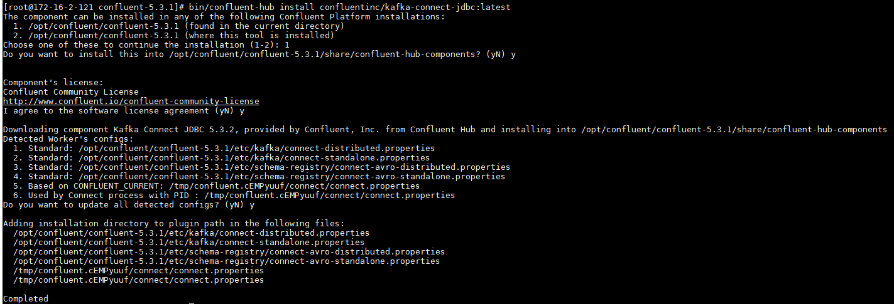
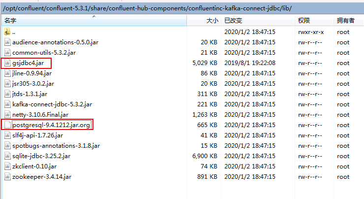
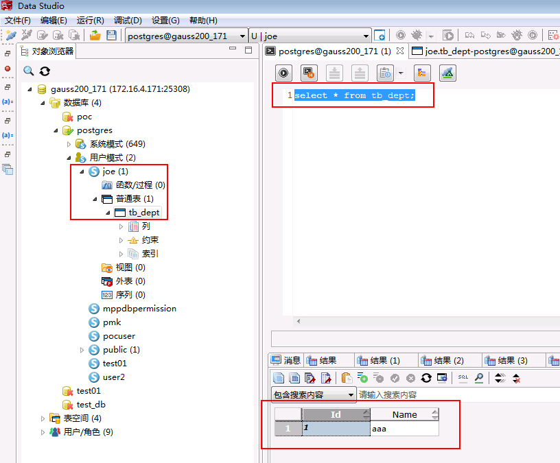
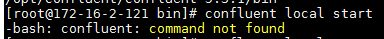
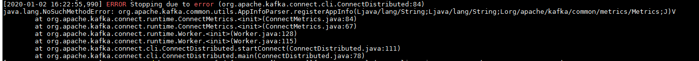
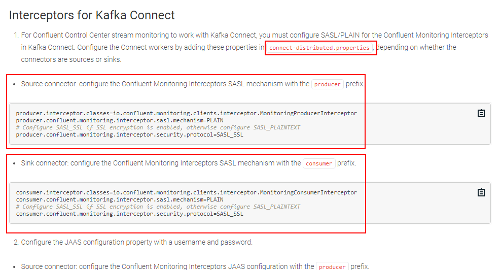
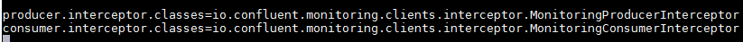
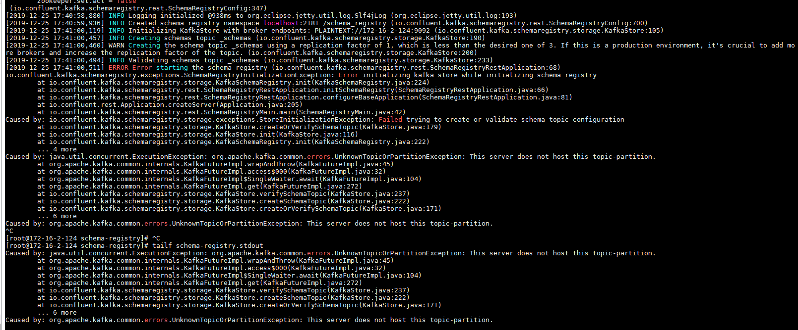
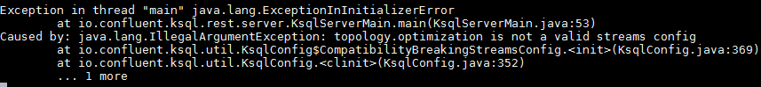

## 使用confluent中的debezium connector对接

测试环境说明：

FI HD: 6.5.1 (kafka安全模式)
GaussDB 200: 6.5.1

confluent: 5.3.1
debezium: 1.0.0

场景说明：confluent最新版本5.3.1能够直接下载debezium 1.0.0最新版本的 database connector，这里以mysql为例作为源端，同步后的数据传入huawei kafka中（安全模式），在通过confluent提供的jdbc connector将源端mysql数据库变更操作同步到目标端中 GaussDB200


### 安装confluent

### 操作步骤

- 登录Confluent官方网站下载页面：https://www.confluent.io/previous-versions/?_ga=2.102961223.611794173.1561088831-1783953529.1561088831

  下载最新版本5.3.1

- 将下载的开源压缩包使用WinSCP工具上传至linux主机，使用`tar -xvf confluent-5.3.1-2.12.tar.gz`解压

- 增加confluent环境变量

  使用命令`vi ~/.bashrc`，增加confluent bin目录到PATH环境变量中，完成后使用`source ~/.bashrc`使之生效

  

## 配置Confluent

说明：Confluent启动时会起自己的zookeeper和kafka服务，这里不做修改。需要更改的是connect， schema-registry服务配置，使得这些服务直接对接FusionInsight HD安全模式的zookeeper和kafka服务

### 操作步骤

- 在`confluent安装目录\share\java`下新建路径，名为huawei

  

- 到FusionInsight 6.5.1的kafka客户端下所有kafka相关jar包拷贝到huawei路径下

  `cp /opt/125_651hdclient/hadoopclient/Kafka/kafka/libs/*.jar /opt/confluent/confluent-5.3.1/share/java/huawei/`

- 在路径`/opt/confluent/confluent-5.3.1/bin`下找到connect-distributed文件，进行如下编辑：

  1.  在适当位置添加KAFKA_OPTS的启动JVM参数

    

    具体内容为：

    `export KAFKA_OPTS="-Dzookeeper.server.principal=zookeeper/hadoop.hadoop.com -Djava.security.krb5.conf=/opt/krb5.conf -Dkerberos.domain.name=hadoop.hadoop.com"`

    其中-Djava.security.krb5.conf=/opt/krb5.conf为对接集群认证的krb5.conf文件，可在集群Manager页面上获取

    另外还可以添加 -Dsun.security.krb5.debug=true 打开kerberos认证日志开关，进行错误定位、排查

  2.  在前面位置将huawei路径引进去

    

- 修改`/opt/confluent/confluent-5.3.1/etc/kafka/connect-distributed.properties`配置文件

  1.  修改bootstrap.servers为对接FI HD集群kafka地址

    

  2.  在配置文件最后增加内容如下,配置Kerberos认证相关参数：

  ```
  sasl.mechanism=GSSAPI
  sasl.kerberos.service.name=kafka
  kerberos.domain.name=hadoop.hadoop.com
  security.protocol=SASL_PLAINTEXT
  sasl.jaas.config=com.sun.security.auth.module.Krb5LoginModule required \
     useKeyTab=true \
     storeKey=true \
     keyTab="/opt/user.keytab" \
     principal="developuser@HADOOP.COM";

  producer.sasl.mechanism=GSSAPI
  producer.sasl.kerberos.service.name=kafka
  kerberos.domain.name=hadoop.hadoop.com
  # Configure SASL_SSL if SSL encryption is enabled, otherwise configure SASL_PLAINTEXT
  producer.security.protocol=SASL_PLAINTEXT
  producer.sasl.jaas.config=com.sun.security.auth.module.Krb5LoginModule required \
     useKeyTab=true \
     storeKey=true \
     keyTab="/opt/user.keytab" \
     principal="developuser@HADOOP.COM";

  consumer.sasl.mechanism=GSSAPI
  consumer.sasl.kerberos.service.name=kafka
  kerberos.domain.name=hadoop.hadoop.com
  # Configure SASL_SSL if SSL encryption is enabled, otherwise configure SASL_PLAINTEXT
  consumer.security.protocol=SASL_PLAINTEXT
  consumer.sasl.jaas.config=com.sun.security.auth.module.Krb5LoginModule required \
     useKeyTab=true \
     storeKey=true \
     keyTab="/opt/user.keytab" \
     principal="developuser@HADOOP.COM";
  ```

  

- 修改`/opt/confluent/confluent-5.3.1/etc/schema-registry/connect-avro-distributed.properties`配置文件，与上一步类似：

  1.  修改bootstrap.servers为对接FI HD集群kafka地址

    

  2.  

  ```
  sasl.mechanism=GSSAPI
  sasl.kerberos.service.name=kafka
  kerberos.domain.name=hadoop.hadoop.com
  security.protocol=SASL_PLAINTEXT
  sasl.jaas.config=com.sun.security.auth.module.Krb5LoginModule required \
     useKeyTab=true \
     storeKey=true \
     keyTab="/opt/user.keytab" \
     principal="developuser@HADOOP.COM";

  producer.sasl.mechanism=GSSAPI
  producer.sasl.kerberos.service.name=kafka
  kerberos.domain.name=hadoop.hadoop.com
  # Configure SASL_SSL if SSL encryption is enabled, otherwise configure SASL_PLAINTEXT
  producer.security.protocol=SASL_PLAINTEXT
  producer.sasl.jaas.config=com.sun.security.auth.module.Krb5LoginModule required \
     useKeyTab=true \
     storeKey=true \
     keyTab="/opt/user.keytab" \
     principal="developuser@HADOOP.COM";

  consumer.sasl.mechanism=GSSAPI
  consumer.sasl.kerberos.service.name=kafka
  kerberos.domain.name=hadoop.hadoop.com
  # Configure SASL_SSL if SSL encryption is enabled, otherwise configure SASL_PLAINTEXT
  consumer.security.protocol=SASL_PLAINTEXT
  consumer.sasl.jaas.config=com.sun.security.auth.module.Krb5LoginModule required \
     useKeyTab=true \
     storeKey=true \
     keyTab="/opt/user.keytab" \
     principal="developuser@HADOOP.COM";

  producer.interceptor.classes=io.confluent.monitoring.clients.interceptor.MonitoringProducerInterceptor
  producer.confluent.monitoring.interceptor.sasl.mechanism=GSSAPI
  producer.confluent.monitoring.interceptor.security.protocol=SASL_PLAINTEXT
  producer.confluent.monitoring.interceptor.jaas.config=org.apache.kafka.common.security.plain.PlainLoginModule required \
     useKeyTab=true \
     storeKey=true \
     keyTab="/opt/user.keytab" \
     principal="developuser@HADOOP.COM";

  consumer.interceptor.classes=io.confluent.monitoring.clients.interceptor.MonitoringConsumerInterceptor
  consumer.confluent.monitoring.interceptor.sasl.mechanism=GSSAPI
  consumer.confluent.monitoring.interceptor.security.protocol=SASL_PLAINTEXT
  consumer.confluent.monitoring.interceptor.jaas.config=org.apache.kafka.common.security.plain.PlainLoginModule required \
     useKeyTab=true \
     storeKey=true \
     keyTab="/opt/user.keytab" \
     principal="developuser@HADOOP.COM";

  ```

  

- 参考confluent官方文档：https://docs.confluent.io/current/quickstart/ce-quickstart.html#ce-quickstart

  

  使用如下命令在confluent的bin目录下引入confluent执行文件

  `curl -L https://cnfl.io/cli | sh -s -- -b /opt/confluent/confluent-5.3.1/bin`

  


- 使用命令`bin/confluent local start`start命令启动confluent

  注意：同之前的confluent 4.1.0版本相比 之前的`confluent start`命令改为了`conflueng local start`

  


## 场景1. 源端mysql数据实时同步到Gauss200

### 配置源端mysql

具体安装过程参考druid文档

说明：做实时数据库同步的时候需要mysql打开bin日志（binary log）

- 参考confluent官方文档：https://docs.confluent.io/current/connect/debezium-connect-mysql/index.html

  核心配置如下，在Mysql主机的/etc/my.cnf的mysqld下添加如下配置,打开mysql bin日志

  ```
  [mysqld]
  server-id         = 223344
  log_bin           = mysql-bin
  binlog_format     = row
  binlog_row_image  = full
  expire_logs_days  = 10
  ```

  然后，重启一下Mysql以使得binlog生效。

  `systemctl start mysqld.service`

- 使用命令`mysql -u root -p`登陆mysql，需要输入登陆密码

- 使用如下命令创建database名字叫做`test`

  `CREATE DATABASE test;`

- 使用如下建表语句，创建表tb_dept

  ```
  create table tb_dept(
       Id int primary key,
       Name varchar(18)

   );
  ```


### 配置debezium mysql connector

同样参考confluent官方文档：https://docs.confluent.io/current/connect/debezium-connect-mysql/index.html

- 安装最新版本的debezium mysql connector:

  使用如下命令：`bin/confluent-hub install debezium/debezium-connector-mysql:1.0.0`

  

  重启confluent使用命令查看debezium mysql connector是否安装成功：

  `curl -sS localhost:8083/connector-plugins | grep mysql`

  

- confluent 5.3.1版本加载新的connector都是以curl命令通过rest的方式进行的，首先现在confluent本机的/opt路径下创建debezium mysql connector的配置json文件，名字叫register-mysql-huawei2.json：

内容如下：
```
{
 "name": "inventory-connector2",
 "config": {
     "connector.class": "io.debezium.connector.mysql.MySqlConnector",
     "tasks.max": "1",
     "key.converter.schema.registry.url": "http://172-16-2-124:8081",
     "value.converter.schema.registry.url": "http://172-16-2-124:8081",
     "database.hostname": "172-16-2-124",
     "database.port": "3306",
     "database.user": "root",
     "database.password": "Huawei@123",
     "database.server.id": "223344",
     "database.server.name": "dbserver1",
     "database.whitelist": "test",
     "table.whitlelist" : "tb_dept",
     "database.history.producer.security.protocol": "SASL_PLAINTEXT",
     "database.history.consumer.security.protocol":"SASL_PLAINTEXT",
     "database.history.kafka.bootstrap.servers": "172.16.4.121:21007,172.16.4.122:21007,172.16.4.123:21007",
     "database.history.kafka.topic": "schema-changes.test",
     "key.converter": "org.apache.kafka.connect.json.JsonConverter",
     "value.converter": "org.apache.kafka.connect.json.JsonConverter",
     "value.converter.schemas.enable": "true",
     "transforms": "unwrap",
     "transforms.unwrap.type": "io.debezium.transforms.UnwrapFromEnvelope",
     "transforms": "route",
     "transforms.route.type": "org.apache.kafka.connect.transforms.RegexRouter",
     "transforms.route.regex": "([^.]+)\\.([^.]+)\\.([^.]+)",
     "transforms.route.replacement": "$3"

     }
}
```

- 使用如下命令将上述配置的debezium mysql connector装载到confluent 上去

  `curl -i -X POST -H "Accept:application/json" -H  "Content-Type:application/json" http://localhost:8083/connectors/ -d @/opt/register-mysql-huawei2.json`

  登陆confluent /tmp目录下，在对应的confluent日志路径下查看connect.stout日志检查是否装载成功：

  

- 在mysql源端使用`insert into tb_dept values(1,'aaa');`插入一条数据，登陆对接集群kafka客户端，消费对应同步topic名字叫做tb_dept:

  

- 在mysql源端使用`UPDATE test.tb_dept SET Name='Anne Marie' WHERE id=1;`对第一条数据做update操作，登陆对接集群kafka客户端，消费对应同步topic名字叫做tb_dept:

  

- 在mysql源端使用`delete from tb_dept where Id=1;`对第一条数据做delete操作，登陆对接集群kafka客户端，消费对应同步topic名字叫做tb_dept:

  

证明使用debezium mysql connector可以将Mysql源端数据库增、删、改操作记录下来并发到对应的FI hd的kafka中

- 使用命令`bin/confluent local status connectors` 查看装载成功的connector状态

- 使用命令`bin/confluent local unload inventory-connector2`将暂时不需要的connector移除


### 配置jdbc sink connector对接GAUSS DB200 目的端

参考confluent官方文档：https://docs.confluent.io/current/connect/kafka-connect-jdbc/index.html

安装jdb connctor

- 输入命令：`bin/confluent-hub install confluentinc/kafka-connect-jdbc:latest`安装最新版本的jdbc connector

  

- 登陆`/opt/confluent/confluent-5.3.1/share/confluent-hub-components/confluentinc-kafka-connect-jdbc/lib`,将里面自带的postgres驱动注销掉，导入gauss db 200的驱动`gsjdbc4.jar`

  

- 同样的在confluent主机/opt/路径下创建一个jdbc-sink5.json文件，内容为：

  ```
  {
      "name": "jdbc-sink5",
      "config": {
          "connector.class": "io.confluent.connect.jdbc.JdbcSinkConnector",
          "tasks.max": "1",
          "table.name.format": "${topic}",
          "key.converter.schema.registry.url": "http://172-16-2-121:8081",
          "value.converter.schema.registry.url": "http://172-16-2-121:8081",
          "topics": "tb_dept",
          "connection.url": "jdbc:postgresql://172.16.4.171:25308/postgres?user=joe&password=Bigdata@123",
          "transforms": "unwrap",                                              
          "transforms.unwrap.type": "io.debezium.transforms.UnwrapFromEnvelope", 	
          "connection.user": "joe",
          "connection.password": "Bigdata@123",
          "auto.create": "true",
          "auto.evolve":"true",
          "insert.mode": "insert",
          "pk.mode": "record_value",
          "pk.fields": "Id",
          "key.converter": "org.apache.kafka.connect.storage.StringConverter",    
          "value.converter": "org.apache.kafka.connect.json.JsonConverter",
          "value.converter.schemas.enable": "true",
          "delete.enabled": "false"
      }
  }
  ```

- 需要在目的端gausdb 200将confluent主机添加白名单，配置远程登陆，详细配置过程参考gaussdb 200产品文档

- 重启confluent

- 使用命令`curl -i -X POST -H "Accept:application/json" -H  "Content-Type:application/json" http://localhost:8083/connectors/ -d @/opt/jdbc-sink5.json`装载jdbc sink connector

- 再使用命令`curl -i -X POST -H "Accept:application/json" -H  "Content-Type:application/json" http://localhost:8083/connectors/ -d @/opt/register-mysql-huawei2.json`装载debezium mysql connector捕捉源端数据

- 在mysql源端使用命令`insert into tb_dept values(1,'aaa');`插入数据，在gaussdb 200使用查询语句检查是否同步：

  


注意： update, delete操作暂时没对通


## confluent对接过程中遇到的问题

问题1. 按照老版本4.1.0配置的时候使用命令`confluent local start`报错：



command not found， 原因就是confluent 5.3.1新版本改版了，bin目录下面开始是没有confluent可执行文件的，需要用命令下载才行


问题2. 按照老版本4.1.0配置完成后，启动confluent的时候在connect日志 connect.stout下面看到报错：



```
java.lang.NoSuchMethodError: org.apache.kafka.common.utils.AppInfoParser.registerAppInfo(Ljava/lang/String;Ljava/lang/String;Lorg/apache/kafka/common/metrics/Metrics;J)V
        at org.apache.kafka.connect.runtime.ConnectMetrics.<init>(ConnectMetrics.java:84)
        at org.apache.kafka.connect.runtime.ConnectMetrics.<init>(ConnectMetrics.java:67)
        at org.apache.kafka.connect.runtime.Worker.<init>(Worker.java:128)
        at org.apache.kafka.connect.runtime.Worker.<init>(Worker.java:115)
        at org.apache.kafka.connect.cli.ConnectDistributed.startConnect(ConnectDistributed.java:111)
        at org.apache.kafka.connect.cli.ConnectDistributed.main(ConnectDistributed.java:78)
```

依赖问题，之前是在huawei路径下只放了kafka-client-1.1.0那个jar包，现在把客户端kafka下面所有的jar包拷贝到huawei路径下重启confluent 这个问题解决

问题3： 在使用命令`curl -i -X POST -H "Accept:application/json" -H  "Content-Type:application/json" http://localhost:8083/connectors/ -d @/opt/register-mysql-huawei2.json` 提交debezium mysql connector的时候，遇到报错：


原因就是配置的时候mysql填的是houstname没有在/etc/hosts下面配，报这个连接失败的错误，重新配上问题解决

## debezium对接笔记

首先验证debezium的时候参考帖子：http://www.luyixian.cn/news_show_17625.aspx
只用的confluent配合来做的对接，并且在confluent官网上也能够查询到相关的信息：https://docs.confluent.io/current/connect/debezium-connect-mysql/index.html

confluent相关的配置暂时不计

问题1：

下面是在对接成功后,意味着mysql做的增、删、改操作能够同步到华为kafka安全模式中，但是connect日志()一段时间后还是会报错:


下面是详细的报错：

```
[2019-12-25 16:31:34,337] INFO creating interceptor (io.confluent.monitoring.clients.interceptor.MonitoringProducerInterceptor:74)
[2019-12-25 16:31:34,338] INFO MonitoringInterceptorConfig values:
        confluent.monitoring.interceptor.publishMs = 15000
        confluent.monitoring.interceptor.topic = _confluent-monitoring
 (io.confluent.monitoring.clients.interceptor.MonitoringInterceptorConfig:279)
[2019-12-25 16:31:34,340] INFO ProducerConfig values:
        acks = all
        batch.size = 16384
        bootstrap.servers = [172.16.4.121:21007, 172.16.4.122:21007, 172.16.4.123:21007]
        buffer.memory = 33554432
        client.id = confluent.monitoring.interceptor.producer-6
        compression.type = lz4
        connections.max.idle.ms = 540000
        enable.idempotence = false
        interceptor.classes = []
        kerberos.domain.name = hadoop.hadoop.com
        key.serializer = class org.apache.kafka.common.serialization.ByteArraySerializer
        linger.ms = 500
        max.block.ms = 60000
        max.in.flight.requests.per.connection = 1
        max.request.size = 10485760
        metadata.max.age.ms = 300000
        metric.reporters = []
        metrics.num.samples = 2
        metrics.recording.level = INFO
        metrics.sample.window.ms = 30000
        partitioner.class = class org.apache.kafka.clients.producer.internals.DefaultPartitioner
        producer.flush.timeout.second = 300
        receive.buffer.bytes = 32768
        reconnect.backoff.max.ms = 1000
        reconnect.backoff.ms = 50
        request.timeout.ms = 30000
        retries = 10
        retry.backoff.ms = 500
        sasl.jaas.config = null
        sasl.kerberos.kinit.cmd = kinit
        sasl.kerberos.min.time.before.relogin = 60000
        sasl.kerberos.service.name = null
        sasl.kerberos.ticket.renew.jitter = 0.05
        sasl.kerberos.ticket.renew.window.factor = 0.8
        sasl.mechanism = GSSAPI
        security.protocol = PLAINTEXT
        send.buffer.bytes = 131072
        ssl.cipher.suites = null
        ssl.enabled.protocols = [TLSv1.2, TLSv1.1, TLSv1]
        ssl.endpoint.identification.algorithm = null
        ssl.key.password = null
        ssl.keymanager.algorithm = SunX509
        ssl.keystore.location = null
        ssl.keystore.password = null
        ssl.keystore.type = JKS
        ssl.protocol = TLS
        ssl.provider = null
        ssl.secure.random.implementation = null
        ssl.trustmanager.algorithm = PKIX
        ssl.truststore.location = null
        ssl.truststore.password = null
        ssl.truststore.type = JKS
        transaction.timeout.ms = 60000
        transactional.id = null
        value.serializer = class org.apache.kafka.common.serialization.ByteArraySerializer
 (org.apache.kafka.clients.producer.ProducerConfig:279)
[2019-12-25 16:31:34,341] INFO Updated cluster metadata version 1 to Cluster(id = null, nodes = [172.16.4.123:21007 (id: -3 rack: null), 172.16.4.122:21007 (id: -2 rack: null), 172.16.4.121:21007 (id: -1 rack: null)], partitions = []) (org.apache.kafka.clients.Metadata:270)
[2019-12-25 16:31:34,343] INFO Kafka version : 1.1.0 (org.apache.kafka.common.utils.AppInfoParser:109)
[2019-12-25 16:31:34,344] INFO Kafka commitId : unknown (org.apache.kafka.common.utils.AppInfoParser:110)
[2019-12-25 16:31:34,344] INFO interceptor=confluent.monitoring.interceptor.producer-6 created for client_id=producer-6 client_type=PRODUCER session= cluster=8LD5a4YcQweiqWg8ztIXUg (io.confluent.monitoring.clients.interceptor.MonitoringInterceptor:153)
[2019-12-25 16:31:49,352] WARN [Producer clientId=confluent.monitoring.interceptor.producer-6] Bootstrap broker 172.16.4.121:21007 (id: -1 rack: null) disconnected (org.apache.kafka.clients.NetworkClient:862)
[2019-12-25 16:31:49,354] WARN [Producer clientId=confluent.monitoring.interceptor.producer-6] Bootstrap broker 172.16.4.123:21007 (id: -3 rack: null) disconnected (org.apache.kafka.clients.NetworkClient:862)
[2019-12-25 16:31:49,354] WARN [Producer clientId=confluent.monitoring.interceptor.producer-6] Bootstrap broker 172.16.4.122:21007 (id: -2 rack: null) disconnected (org.apache.kafka.clients.NetworkClient:862)
[2019-12-25 16:31:49,407] WARN [Producer clientId=confluent.monitoring.interceptor.producer-6] Bootstrap broker 172.16.4.122:21007 (id: -2 rack: null) disconnected (org.apache.kafka.clients.NetworkClient:862)
....
```


仔细查看可以发现，是在起`confluent.monitoring.interceptor.topic = _confluent-monitoring`这个topic的producer的时候报错，错误原因就是，我配置的bootstrap.servers是21007安全端口，但是配置的security.protocol还是PLAINTEXT，不匹配报的这个错。

上confluent官网寻找解决办法：https://docs.confluent.io/current/kafka/authentication_sasl/authentication_sasl_plain.html#sasl-plain-interceptors



将这个链接的说明看了之后，指到应该写如下的内容来加这个认证
```
producer.interceptor.classes=io.confluent.monitoring.clients.interceptor.MonitoringProducerInterceptor
producer.confluent.monitoring.interceptor.sasl.mechanism=GSSAPI
producer.confluent.monitoring.interceptor.security.protocol=SASL_PLAINTEXT
producer.confluent.monitoring.interceptor.jaas.config=org.apache.kafka.common.security.plain.PlainLoginModule required \
   useKeyTab=true \
   storeKey=true \
   keyTab="/opt/user.keytab" \
   principal="developuser@HADOOP.COM";

consumer.interceptor.classes=io.confluent.monitoring.clients.interceptor.MonitoringConsumerInterceptor
consumer.confluent.monitoring.interceptor.sasl.mechanism=GSSAPI
consumer.confluent.monitoring.interceptor.security.protocol=SASL_PLAINTEXT
consumer.confluent.monitoring.interceptor.jaas.config=org.apache.kafka.common.security.plain.PlainLoginModule required \
   useKeyTab=true \
   storeKey=true \
   keyTab="/opt/user.keytab" \
   principal="developuser@HADOOP.COM";
```

我按照文档要求，把这两段配置加载了connect-distributed.properties文件里面，发现问题并没有解决，在/tmp/confluent.7d5TJ4uC/connect/connect.properties文件可以看到每次起confluent时候加载connect服务的配置具体情况。发现一直都是如下两条：



说明我配置的内容没有读进去，我又用grep -R 命令搜了一下这两条，发现其实默认配置在`/opt/confluent/confluent-5.3.1/etc/schema-registry/connect-avro-distributed.properties`这个配置文件里面，我把上面这两条加进这个配置文件，重启confluent问题解决

问题2：
在配置confluent 之后启动的时候会遇到confluent的schema-registry服务起不来的情况


去tmp下面的日志查看schema-registry日志：



```
[2019-12-25 17:41:00,511] ERROR Error starting the schema registry (io.confluent.kafka.schemaregistry.rest.SchemaRegistryRestApplication:68)
io.confluent.kafka.schemaregistry.exceptions.SchemaRegistryInitializationException: Error initializing kafka store while initializing schema registry
        at io.confluent.kafka.schemaregistry.storage.KafkaSchemaRegistry.init(KafkaSchemaRegistry.java:224)
        at io.confluent.kafka.schemaregistry.rest.SchemaRegistryRestApplication.initSchemaRegistry(SchemaRegistryRestApplication.java:66)
        at io.confluent.kafka.schemaregistry.rest.SchemaRegistryRestApplication.configureBaseApplication(SchemaRegistryRestApplication.java:81)
        at io.confluent.rest.Application.createServer(Application.java:205)
        at io.confluent.kafka.schemaregistry.rest.SchemaRegistryMain.main(SchemaRegistryMain.java:42)
Caused by: io.confluent.kafka.schemaregistry.storage.exceptions.StoreInitializationException: Failed trying to create or validate schema topic configuration
        at io.confluent.kafka.schemaregistry.storage.KafkaStore.createOrVerifySchemaTopic(KafkaStore.java:179)
        at io.confluent.kafka.schemaregistry.storage.KafkaStore.init(KafkaStore.java:116)
        at io.confluent.kafka.schemaregistry.storage.KafkaSchemaRegistry.init(KafkaSchemaRegistry.java:222)
        ... 4 more
Caused by: java.util.concurrent.ExecutionException: org.apache.kafka.common.errors.UnknownTopicOrPartitionException: This server does not host this topic-partition.
        at org.apache.kafka.common.internals.KafkaFutureImpl.wrapAndThrow(KafkaFutureImpl.java:45)
        at org.apache.kafka.common.internals.KafkaFutureImpl.access$000(KafkaFutureImpl.java:32)
        at org.apache.kafka.common.internals.KafkaFutureImpl$SingleWaiter.await(KafkaFutureImpl.java:104)
        at org.apache.kafka.common.internals.KafkaFutureImpl.get(KafkaFutureImpl.java:272)
        at io.confluent.kafka.schemaregistry.storage.KafkaStore.verifySchemaTopic(KafkaStore.java:237)
        at io.confluent.kafka.schemaregistry.storage.KafkaStore.createSchemaTopic(KafkaStore.java:222)
        at io.confluent.kafka.schemaregistry.storage.KafkaStore.createOrVerifySchemaTopic(KafkaStore.java:171)
        ... 6 more
Caused by: org.apache.kafka.common.errors.UnknownTopicOrPartitionException: This server does not host this topic-partition.

```

尝试着重启confluent之后，问题就解决了，并没有做什么配置


问题3：在kafka客户端接收数据库实时同步信息的时候，过了一晚上遇到报错：


记得confluent是有一个地方配这个的


或者有一劳永逸的办法是把创个这个软连接，指到集群客户端的kinit就行

`ln -s /opt/125_651hdclient/hadoopclient/KrbClient/kerberos/bin/kinit  /usr/bin/kinit`


问题4：confluent 5.3.1版本启动时ksql服务挂掉的问题：


在/tmp后台日志看到报错：



这是因为使用kafka的一个stream api功能，使用ksql服务的时候要求这必须是一个有效的stream配置，感觉跟jar包有关，如果我保持默认配置 ，使用confluent本身的kafka, zk服务就不会报这个错，我是因为需要使用ksql连我们的集群，在confluent bin目录下的ksql-run-class改了这个参数：


先去读huawei的kafka相关jar包就会报上面这个错，如果我把这行注释掉，让confluent起ksql服务的时候去读自己的jar包就不会报错，但是ksql服务也用不了了。暂时可以这样来规避问题，但是还是需要进一步研究


问题5： 在做debezium数据库实时同步的时候，起jdbc-sink-connector的时候会在confluent的connect日志报错：


```
[2019-12-30 10:35:03,618] ERROR WorkerSinkTask{id=jdbc-sink5-0} Task threw an uncaught and unrecoverable exception (org.apache.kafka.connect.runtime.WorkerTask:172)
org.apache.kafka.connect.errors.DataException: JsonConverter with schemas.enable requires "schema" and "payload" fields and may not contain additional fields. If you are trying to deserialize plain JSON data, set schemas.enable=false in your converter configuration.
        at org.apache.kafka.connect.json.JsonConverter.toConnectData(JsonConverter.java:338)
        at org.apache.kafka.connect.runtime.WorkerSinkTask.convertMessages(WorkerSinkTask.java:468)
        at org.apache.kafka.connect.runtime.WorkerSinkTask.poll(WorkerSinkTask.java:301)
        at org.apache.kafka.connect.runtime.WorkerSinkTask.iteration(WorkerSinkTask.java:205)
        at org.apache.kafka.connect.runtime.WorkerSinkTask.execute(WorkerSinkTask.java:173)
        at org.apache.kafka.connect.runtime.WorkerTask.doRun(WorkerTask.java:170)
        at org.apache.kafka.connect.runtime.WorkerTask.run(WorkerTask.java:214)
        at java.util.concurrent.Executors$RunnableAdapter.call(Executors.java:511)
        at java.util.concurrent.FutureTask.run(FutureTask.java:266)
        at java.util.concurrent.ThreadPoolExecutor.runWorker(ThreadPoolExecutor.java:1149)
        at java.util.concurrent.ThreadPoolExecutor$Worker.run(ThreadPoolExecutor.java:624)
        at java.lang.Thread.run(Thread.java:748)

```
关于该错误的详细概述，可以参考如下两个帖子：
1.  https://blog.csdn.net/D55dffdh/article/details/84929263
2.  https://www.confluent.io/blog/kafka-connect-deep-dive-converters-serialization-explained/

都是同一篇，第一个为中文翻译，详细介绍了上述错误发生的原因。

这里我记录一下实际情况。就是需要入库的那个topic tb_dept，创建之后，我测试的时候是手动往这个topic里面produce数据的，所以按快了，可能入了几条信息没有遵照规定格式的json信息记录，所以会报这个错误，其实jdbc-sink-connector的配置是对的，原因就是每次启动connector的时候，connector会从上次失败的那条kafka记录开始往下，但是因为上次的记录本身是有问题的，所以还是会报错，解决办法就是，首先unload jdbc-sink-connector，然后把需要读取记录的这个topic删除，然后在重新装载jdbc-sink-connector（配置好的话会自动创建那个topic）。然后再手动produce json格式的数据，问题解决。或者通过配置group略掉上次错误的那条kafka 记录

这里的背景信息是：根据confluent jdbc sink的特点，同步的kafka topic必须要带schema， 而带schema有两种形式：第一种是在schema-registry里面定义，第二种是topic信息里面自己自带相关信息，所以需要topic形如：

`{"schema":{"type":"struct","fields":[{"type":"int32","optional":false,"field":"Id"},{"type":"string","optional":true,"field":"Name"}],"optional":true,"name":"tb_dept.Value"},"payload":{"Id":22,"Name":"twentytwo"}}`

要有schema以及plaload两个field， 然后jdbc connector会根据schema里面的信息在目标端创建对应的表，会包括字段以及字段类型，然后根据playload里面的信息往里面塞数据。而且据网上的说法是，confluent的jdbc connector只支持第二种形式，所以所有要同步的topic record都要形如上面这样。并且研究下来还有一个约束就是同步的这个kafka topic不能有脏数据，意思就是如果这个topic里面之前有一条同步数据不是上面这种形式，那么到jdbc connect这里就会报错，不会继续进行下去，并且下一次如果接着在这个topic后面加新的同步信息的时候，会卡在之前错误的那条topic 信息，不会继续往下走，所以会一直报错，就像这个问题表现的这样。

遇到这个问题要根据这篇帖子：https://rmoff.net/2019/10/15/skipping-bad-records-with-the-kafka-connect-jdbc-sink-connector/

想办法把脏数据的这一条信息跳过，才能解决。


下面是成功的connector信息

1.  debezium mysql源端connector配置：
```
{
 "name": "inventory-connector2",
 "config": {
     "connector.class": "io.debezium.connector.mysql.MySqlConnector",
     "tasks.max": "1",
     "key.converter.schema.registry.url": "http://172-16-2-124:8081",
     "value.converter.schema.registry.url": "http://172-16-2-124:8081",
     "database.hostname": "172-16-2-124",
     "database.port": "3306",
     "database.user": "root",
     "database.password": "Huawei@123",
     "database.server.id": "223344",
     "database.server.name": "dbserver1",
     "database.whitelist": "test",
     "table.whitlelist" : "tb_dept",
     "database.history.producer.security.protocol": "SASL_PLAINTEXT",
     "database.history.consumer.security.protocol":"SASL_PLAINTEXT",
     "database.history.kafka.bootstrap.servers": "172.16.4.121:21007,172.16.4.122:21007,172.16.4.123:21007",
     "database.history.kafka.topic": "schema-changes.test",
     "key.converter": "org.apache.kafka.connect.json.JsonConverter",
     "value.converter": "org.apache.kafka.connect.json.JsonConverter",
     "value.converter.schemas.enable": "true",
     "transforms": "unwrap",
     "transforms.unwrap.type": "io.debezium.transforms.UnwrapFromEnvelope",
     "transforms": "route",
     "transforms.route.type": "org.apache.kafka.connect.transforms.RegexRouter",
     "transforms.route.regex": "([^.]+)\\.([^.]+)\\.([^.]+)",
     "transforms.route.replacement": "$3"

     }
}
```

2. gaussdb 200目的端jdbc connector配置：
```
{
    "name": "jdbc-sink5",
    "config": {
        "connector.class": "io.confluent.connect.jdbc.JdbcSinkConnector",
        "tasks.max": "1",
        "table.name.format": "${topic}",
        "key.converter.schema.registry.url": "http://172-16-2-124:8081",
        "value.converter.schema.registry.url": "http://172-16-2-124:8081",
        "topics": "tb_dept",
        "connection.url": "jdbc:postgresql://172.16.4.171:25308/postgres?user=joe&password=Bigdata@123",
        "transforms": "unwrap",                                              
        "transforms.unwrap.type": "io.debezium.transforms.UnwrapFromEnvelope", 	
        "connection.user": "joe",
        "connection.password": "Bigdata@123",
        "auto.create": "true",
        "auto.evolve":"true",
        "insert.mode": "insert",
        "pk.mode": "record_value",
        "pk.fields": "Id",
        "key.converter": "org.apache.kafka.connect.storage.StringConverter",
        "value.converter": "org.apache.kafka.connect.json.JsonConverter",
        "value.converter.schemas.enable": "true",
        "delete.enabled": "false"
    }
}
```

mysql源端建表语句：

```
create table tb_dept(
     Id int primary key,
     Name varchar(18)
 );
```
可以看到Id字段是主键
