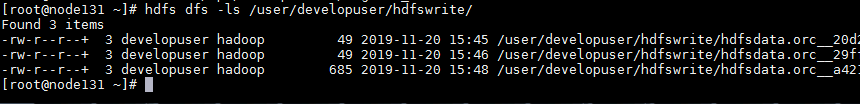

# DataX 对接FusionInsight

## 适用场景

> DataX 0.1 <--> FusionInsight HD 6.5 (HDFS)
>
> DataX 0.1 <--> FusionInsight MRS 8.0 (HDFS)
## 环境准备

  * 下载解压安装DataX

    ```
    wget http://datax-opensource.oss-cn-hangzhou.aliyuncs.com/datax.tar.gz
    tar -zxvf datax.tar.gz
    ```

  * 在FusionInsight下载用户的认证信息，将krb5.conf放入/etc下
  * 在FusionInsight下载用户的认证信息，将user.keytab放入/opt下

## 读取HDFS

  * 新增hdfsread.json文件，内容如下：

    ```json
    {
      "job": {
        "setting": {
          "speed": {
            "channel": 3
          }
        },
        "content": [
          {
            "reader": {
              "name": "hdfsreader",
              "parameter": {
                "path": "/user/developuser/datax/*",
                "defaultFS": "hdfs://hacluster",
                "column": [
                     {
                    "index": 0,
                    "type": "string"
                     },
                     {
                    "index": 1,
                    "type": "string"
                     },
                     {
                    "type": "string",
                    "value": "hello"
                     },
                     {
                    "index": 2,
                    "type": "string"
                     }
                ],
                "fileType": "csv",
                "encoding": "UTF-8",
                "fieldDelimiter": ",",
                "haveKerberos": "true",
                "kerberosKeytabFilePath": "/opt/user.keytab",
                "kerberosPrincipal": "developuser@HADOOP.COM",
                "hadoopConfig":{
                   "dfs.nameservices": "hacluster",
                   "dfs.ha.namenodes.hacluster": "15,16",
                   "dfs.namenode.rpc-address.hacluster.15": "172.16.10.132:25000",
                   "dfs.namenode.rpc-address.hacluster.16": "172.16.10.133:25000",
                   "dfs.client.failover.proxy.provider.hacluster": "org.apache.hadoop.hdfs.server.namenode.ha.ConfiguredFailoverProxyProvider",
                   "hadoop.security.authentication": "Kerberos",
                   "hadoop.rpc.protection": "privacy"
                 }
              }

            },
            "writer": {
              "name": "streamwriter",
              "parameter": {
                "print": true
              }
            }
          }
        ]
      }
    }
    ```

    其中几个重要的参考配置方式如下：

    | 参数名称                                     | 说明                                                                              |
    | -------------------------------------------- | --------------------------------------------------------------------------------- |
    | defaultFS                                    | FusionInsight集群默认为hacluster                                                  |
    | haveKerberos                                 | true                                                                              |
    | kerberosKeytabFilePath                       | keytab文件路径，如：/opt/user.keytab                                              |
    | kerberosPrincipal                            | kerberos用户，如：developuser@HADOOP.COM                                          |
    | hadoop.security.authentication               | 参考集群的HDFS服务的参数配置，如：Kerberos                                        |
    | hadoop.rpc.protection                        | 参考集群的HDFS服务的参数配置，如：privacy                                         |
    | dfs.nameservices                             | 参考集群客户端的hdfs-site.xml进行配置，如hacluster                                |
    | dfs.ha.namenodes.hacluster                   | 参数名称和值都要参考hdfs-site.xml进行配置，每套集群这里的值都不一样               |
    | dfs.namenode.rpc-address.hacluster.15        | 参数名称和值都要参考hdfs-site.xml进行配置，每套集群这里的值都不一样               |
    | dfs.namenode.rpc-address.hacluster.16        | 参数名称和值都要参考hdfs-site.xml进行配置，每套集群这里的值都不一样               |
    | dfs.client.failover.proxy.provider.hacluster | 默认填写org.apache.hadoop.hdfs.server.namenode.ha.ConfiguredFailoverProxyProvider |

  * 执行DataX的任务

    ```
    python datax.py ../hdfs_read.json
    ```

  * 能够读取出HDFS中文件的内容

    

## 写入HDFS

  * 新增hdfswrite.json文件，内容如下：

    ```json
    {
      "setting": {},
      "job": {
        "setting": {
          "speed": {
            "channel": 2
          }
        },
        "content": [
          {
            "reader": {
              "name": "txtfilereader",
              "parameter": {
                "path": ["/opt/data.csv"],
                "encoding": "UTF-8",
                "column": [
                  {
                    "index": 0,
                    "type": "long"
                  },
                  {
                    "index": 1,
                    "type": "DOUBLE"
                  },
                  {
                    "index": 2,
                    "type": "STRING"
                  },
                  {
                    "index": 3,
                    "type": "BOOLEAN"
                  },
                  {
                    "index": 4,
                    "type": "date"
                  }
                ],
                "fieldDelimiter": ","
              }
            },
            "writer": {
              "name": "hdfswriter",
              "parameter": {
                "defaultFS": "hdfs://hacluster",
                "fileType": "orc",
                "path": "/user/developuser/hdfswrite",
                "fileName": "hdfsdata.orc",
                "column": [
                  {
                    "name": "col1",
                    "type": "TINYINT"
                  },
                  {
                    "name": "col2",
                    "type": "DOUBLE"
                  },
                  {
                    "name": "col3",
                    "type": "CHAR"
                  },
                  {
                    "name": "col4",
                    "type": "BOOLEAN"
                  },
                  {
                    "name": "col5",
                    "type": "DATE"
                  }
                ],
                "writeMode": "append",
                "fieldDelimiter": ",",
                "compress":"NONE",
                            "haveKerberos": "true",
                  "kerberosKeytabFilePath": "/opt/user.keytab",
                  "kerberosPrincipal": "developuser@HADOOP.COM",
                  "hadoopConfig":{
                    "dfs.nameservices": "hacluster",
                    "dfs.ha.namenodes.hacluster": "15,16",
                    "dfs.namenode.rpc-address.hacluster.15": "172.16.10.132:25000",
                    "dfs.namenode.rpc-address.hacluster.16": "172.16.10.133:25000",
                    "dfs.client.failover.proxy.provider.hacluster": "org.apache.hadoop.hdfs.server.namenode.ha.ConfiguredFailoverProxyProvider",
                    "hadoop.security.authentication": "Kerberos",
                    "hadoop.rpc.protection": "privacy"
                  }
              }
            }
          }
        ]
      }
    }
    ```

    其中几个重要的参考配置方式如下：

    | 参数名称                                     | 说明                                                                              |
    | -------------------------------------------- | --------------------------------------------------------------------------------- |
    | defaultFS                                    | FusionInsight集群默认为hacluster                                                  |
    | haveKerberos                                 | true                                                                              |
    | kerberosKeytabFilePath                       | keytab文件路径，如：/opt/user.keytab                                              |
    | kerberosPrincipal                            | kerberos用户，如：developuser@HADOOP.COM                                          |
    | hadoop.security.authentication               | 参考集群的HDFS服务的参数配置，如：Kerberos                                        |
    | hadoop.rpc.protection                        | 参考集群的HDFS服务的参数配置，如：privacy                                         |
    | dfs.nameservices                             | 参考集群客户端的hdfs-site.xml进行配置，如hacluster                                |
    | dfs.ha.namenodes.hacluster                   | 参数名称和值都要参考hdfs-site.xml进行配置，每套集群这里的值都不一样               |
    | dfs.namenode.rpc-address.hacluster.15        | 参数名称和值都要参考hdfs-site.xml进行配置，每套集群这里的值都不一样               |
    | dfs.namenode.rpc-address.hacluster.16        | 参数名称和值都要参考hdfs-site.xml进行配置，每套集群这里的值都不一样               |
    | dfs.client.failover.proxy.provider.hacluster | 默认填写org.apache.hadoop.hdfs.server.namenode.ha.ConfiguredFailoverProxyProvider |

  * 执行DataX的任务

    ```
    python datax.py ../hdfs_write.json
    ```

  * 数据能够正常写入HDFS

    
    
