# Denodo对接FusionInsight

## 适用场景

> Denodo Platform 7.0 <--> FusionInsight HD V100R002C80SPC100 (Hive/Spark2x)
>
> Denodo Platform 7.0 <--> FusionInsight HD 6.5 (Hive/Spark2x)

## 准备工作

* 下载并安装Denodo Platform 7.0

  - Denodo是一个数据虚拟化系统，允许应用程序使用来自多个异构数据源的数据，并为应用程序提供统一的访问接口。通过分布式数据源实时地访问和集成数据，而不需要从数据源复制或移动数据。应用程序使用在虚拟层中定义的语义组件，独立于存储数据的物理源。

    

  - 从<https://community.denodo.com/express/download>下载Denodo Platform 7.0的“Denodo Express Installer”和“Denodo Express License”。下载选择版本与操作系统位数保持一致，本文版本是Windows 64 bits。

    

  - 下载完成后安装于本地`C:\Denodo\`。

* FusionInsight HD相关配置（已完成FusionInsight HD的安装）

  - 登录FusionInsight Manager创建一个“人机”用户，例如：developuser，具体请参见《FusionInsight HD 管理员指南》的`系统设置->权限设置->用户管理->创建用户`章节。给developuser用户授予Hive和Spark2x的所有访问权限。

  - 登录FusionInsight Manager的`系统->用户->更多（developuser）->下载认证凭证`，下载developuser对应的认证凭证。解压后，将user.keytab放在`C:\developuser\`目录下(developuser文件夹不存在则创建)，将krb5.conf文件重命名为krb5.ini，并放在`C:\Windows\`目录下。

    

  - 登录FusionInsight Manager `主机->更多->下载客户端`，下载FusionInsight HD客户端到本地。

    

    - **对接Hive需要准备的jar包**

      将解压后的客户端`..\FusionInsight_Services_Client\FusionInsight_Services_ClientConfig\Hive\jdbc\`目录下所有jar包拷贝至`C:\Denodo\DenodoPlatform7.0\extensions\thirdparty\lib\hive\`，如果hive文件夹不存在则创建。

    - **对接Spark2x需要准备的jar包**

      将解压后的客户端`..\FusionInsight_Services_Client\FusionInsight_Services_ClientConfig\Spark2x\jdbc\`目录下所有jar包拷贝至`C:\Denodo\DenodoPlatform7.0\extensions\thirdparty\lib\spark2x\`，如果spark2x文件夹不存在则创建。

      如果是FusionInsight HD 6.5.X版本，还需要将`..\FusionInsight_Services_Client\FusionInsight_Services_ClientConfig\Spark2x\FusionInsight-Spark2x-2.3.2.tar.gz\spark\jars\woodstox-core-5.0.3.jar`拷贝至`C:\Denodo\DenodoPlatform7.0\extensions\thirdparty\lib\spark2x\`。如果是FusionInsight HD V100R002C80SPC100版本，则不需要。

* 准备数据

  - Hive数据库已存在表student，数据类似于：

    

    **示例如下：**

    ```
    CREATE TABLE IF NOT EXISTS student(id INT, name STRING, class_id INT);
    INSERT INTO student VALUES (1,'Tom',1);
    INSERT INTO student VALUES (2,'Sandy',2);
    INSERT INTO student VALUES (3,'Benny',3);
    INSERT INTO student VALUES (4,'Tina',1);
    INSERT INTO student VALUES (5,'Vina',2);
    INSERT INTO student VALUES (6,'Manson',3);
    INSERT INTO student VALUES (7,'Summy',1);
    INSERT INTO student VALUES (8,'Peter',2);
    INSERT INTO student VALUES (9,'Wendy',3);
    INSERT INTO student VALUES (10,'Andy',1);
    INSERT INTO student VALUES (11,'Miki',2);
    INSERT INTO student VALUES (12,'Aurora',3);
    INSERT INTO student VALUES (13,'Carina',1);
    INSERT INTO student VALUES (14,'Hely',1);
    INSERT INTO student VALUES (15,'Tracy',2);
    ```

  - 创建与student.class_id相关的数据存放于excel表中。例如创建`C:\developuser\Class.xlsx`，sheet命名为“Class”，包含两列，分别是id和name，id列的取值必须存在于student.class_id中。

    

* JDBC连接需要查询Zookeeper，Zookeeper的Kerberos认证需要指定jaas配置文件。创建连接Zookeeper的jaas配置文件（如`C:\developuser\jaas.conf`），内容格式如下：
  ```
  Client {
  com.sun.security.auth.module.Krb5LoginModule required
  useKeyTab=true
  keyTab="c:/developuser/user.keytab"
  principal="developuser@HADOOP.COM"
  useTicketCache=false
  storeKey=true
  debug=true;
  };
  ```
## 启动并配置Denodo

* 点击`开始->Denodo Platform->Denodo Platform 7.0`启动Denodo Platform Control Center。

  

* 配置并启动Virtual DataPort Server。

  - 点击`Virtual DataPort->Configure`。

    

  - 点击`JVM Options`。

    

  - Virtual DataPort Server新增`-Djava.security.auth.login.config=c:/developuser/jaas.conf`，两个Options之间用空格隔开。点击`Ok`。

    

  - 点击`Virtual DataPort`返回主界面，点击`Start`启动Virtual DataPort Server。

    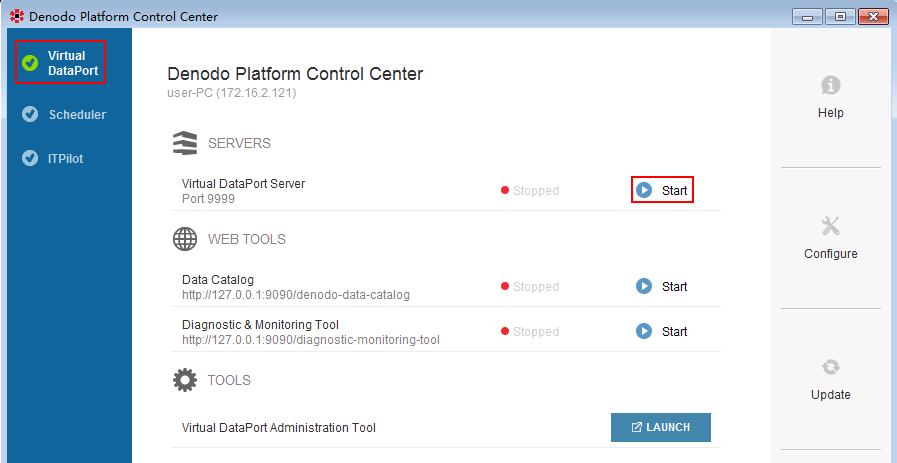

* 启动Virtual DataPort Administration Tool。

  - Virtual DataPort Server启动成功后状态显示为Running，点击`LAUNCH`启动Virtual DataPort Administration Tool。

    

  - 输入默认的用户名`admin`和密码`admin`，点击`Connect`登录。

    

  - 成功登录Virtual DataPort Administration Tool。

    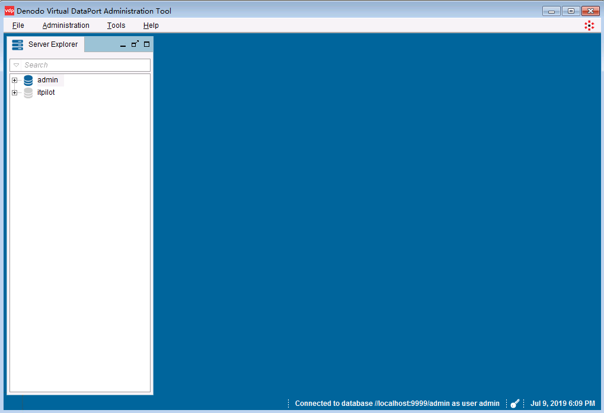

## 对接Hive或者Spark2x

### 创建JDBC连接的Data source

* 右键`admin->Big Data`选择`New->Data source->JDBC`。

  

* 配置连接信息：

  Name：自命名的新建的Data Source名称。

  Driver class path：Hive或者Spark2x的Jar包所在的位置。具体配置路径参考本文`准备工作->已完成FusionInsight HD的安装`章节。

  Database URI：Hive或者Spark2x连接的URL。

  Authentication：选择Kerberos认证。

  **对接Hive具体配置信息如下：**
  ```
  Name: hive_ds
  Database adapter: Hive 2.0.0(HiveServer2)
  Dirver class path: 'C:\Denodo\DenodoPlatform7.0\extensions\thirdparty\lib\hive'
  Dirver class: org.apache.hive.jdbc.HiveDriver
  Database URI: jdbc:hive2://172.16.4.21:24002,172.16.4.22:24002,172.16.4.23:24002/;serviceDiscoveryMode=zooKeeper;zooKeeperNamespace=hiveserver2;sasl.qop=auth-conf;auth=KERBEROS;principal=hive/hadoop.hadoop.com@HADOOP.COM;user.principal=developuser;user.keytab=C:/developuser/user.keytab
  Transaction Isolation: Database default
  Authentication: Use Kerberos
                  Kerberos login: deverlopuser
                  选择Use Key tab
                  keytab file: C:/developuser/user.keytab
  ```
  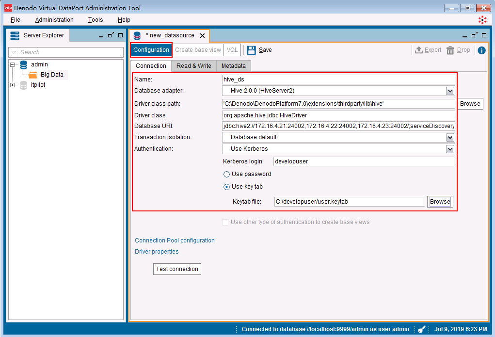

  **对接Spark2x具体配置信息如下：**
  ```
  Name: spark2x_ds
  Database adapter: Hive 2.0.0(HiveServer2)
  Dirver class path: 'C:\Denodo\DenodoPlatform7.0\extensions\thirdparty\lib\spark2x'
  Dirver class: org.apache.hive.jdbc.HiveDriver
  Database URI: jdbc:hive2://172.16.4.21:24002,172.16.4.22:24002,172.16.4.23:24002/;serviceDiscoveryMode=zooKeeper;zooKeeperNamespace=sparkthriftserver2x;saslQop=auth-conf;auth=KERBEROS;principal=spark2x/hadoop.hadoop.com@HADOOP.COM;user.principal=developuser;user.keytab=C:/developuser/user.keytab
  Transaction Isolation: Database default
  Authentication: Use Kerberos
                  Kerberos login: deverlopuser
                  选择Use Key tab
                  keytab file: C:/developuser/user.keytab
  ```

  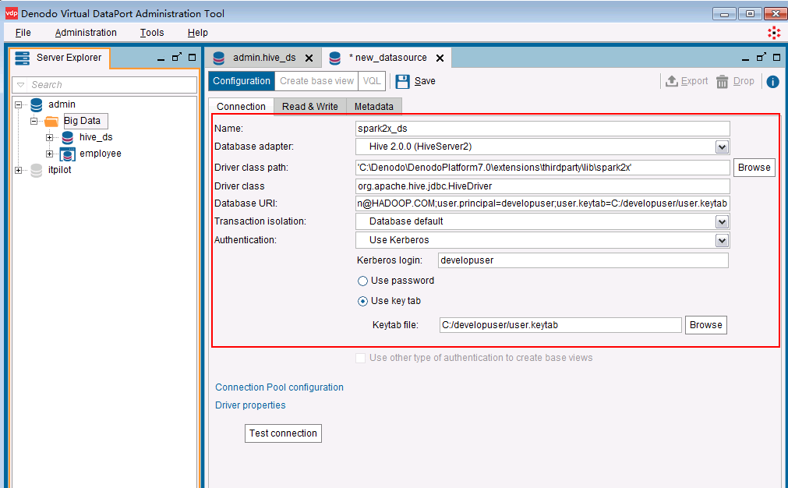

* 点击`Test connection`，返回`JDBC connection tested successfully`。如果返回失败，可在`C:\Denodo\DenodoPlatform7.0\logs\vdp\vdp.log`查看详细的失败日志。点击`Ok`关闭成功提示。

  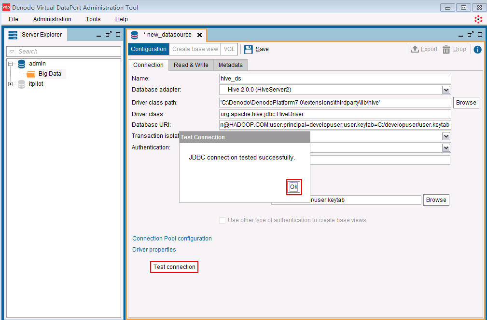

* 点击`Save`保存hive_ds。

  

* 保存成功后，左边显示的`admin->Big Data->hive_ds`即为新增的Data Source。

  

### 创建Hive数据源

* 为了更好观察，右键Big Data文件夹`New->Folder`新建三个文件夹分别存在Data source(01_data source)、base views(02_base views)、集成数据(03_reports)，并把已创建的data sources移入文件夹01_data source。

  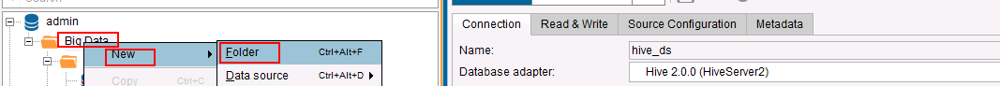

  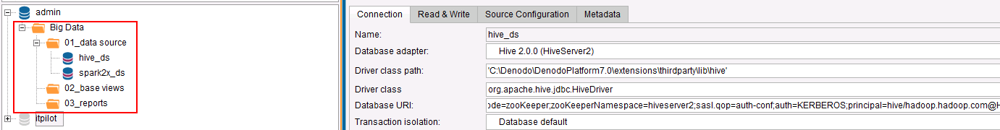

* 在左边列表点击选择保存后的Data Source `hive_ds`，右边框点击`Create base view`。选择employee表`default->Tables->student`，再点击`Create selected`。

  

* View name命名为`student`，点击保存。

  

* 在左边列表点击选择保存后的View `student`，右边框点击`Execution panel->Execute`。

  

* 等待返回查询结果后，`Query Results->Results`，可查看返回的student表的数据。

  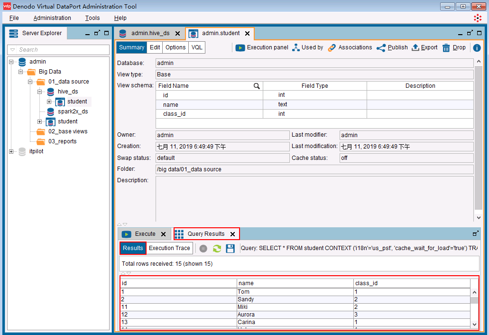

### 创建Excel表数据源
* 右键文件夹01_data source，选择`New->Data source->Excel`。

  

* 选择导入已准备好存放于`C:\developuser\`的`Class.xlsx`。点击保存。

  **具体输入信息如下：**
  ```
  Name: class
  Type of file: 根据准备的Excel表的版本选择
  File location: 下拉框选择Local后，再点击Configure选择C:\developuser\Class.xlsx
  Worksheets: 输入准备数据对应的Sheet名称Class
  Start cell: 准备数据开始的单元格
  End cell: 准备数据结束的单元格
  Has headers: 勾选
  Stream tuples: 勾选
  ```

  

* 选择Data source `class`，点击`Create base view`。

  

* 点击保存。

  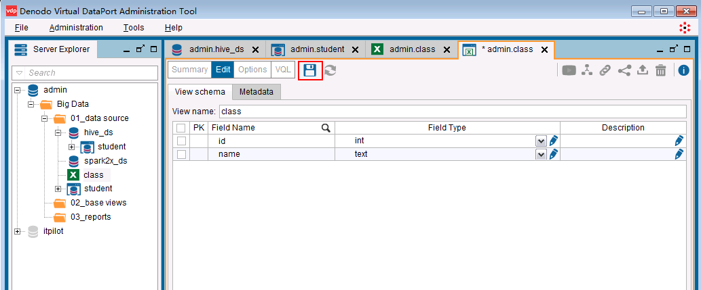

* 在左边列表点击选择保存后的View `class`，右边框点击`Execution panel->Execute`。

  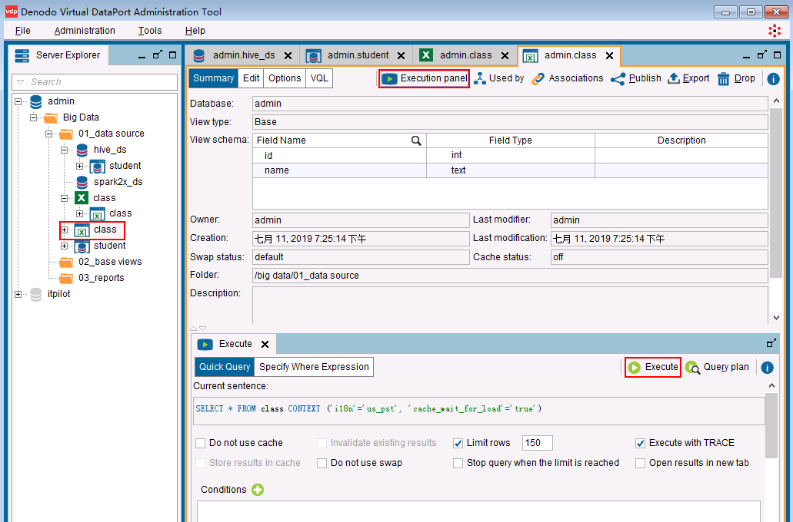

* 等待返回查询结果后，`Query Results->Results`，可查看返回Excel的Class的数据。

  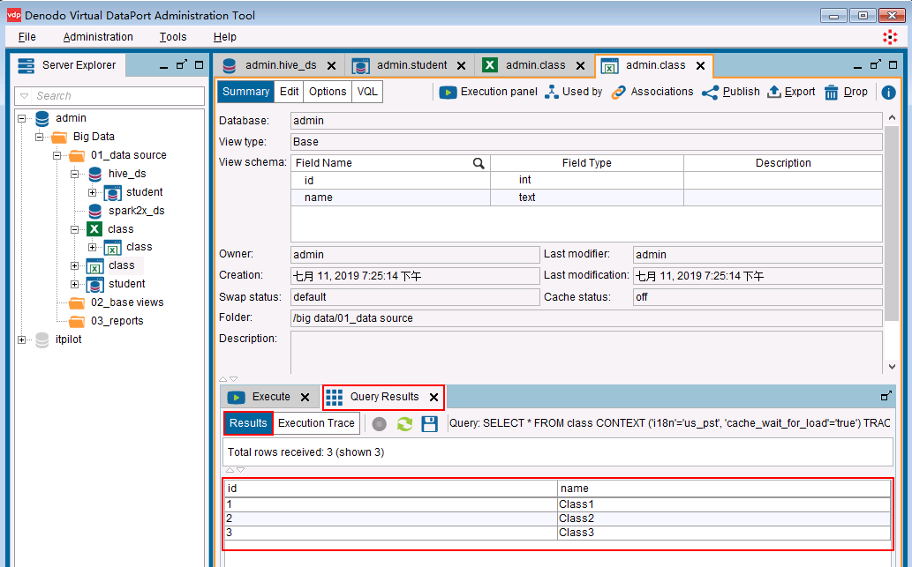

* 将View `class`和`student`移入文件夹02_base views。

  

### 组合Hive和Excel的数据
* 右键文件夹03_reports，选择`New->Join`。

  

* 分别将文件夹02_base views下的student、class拖至右边编辑框，连接student.class_id和class.id。

  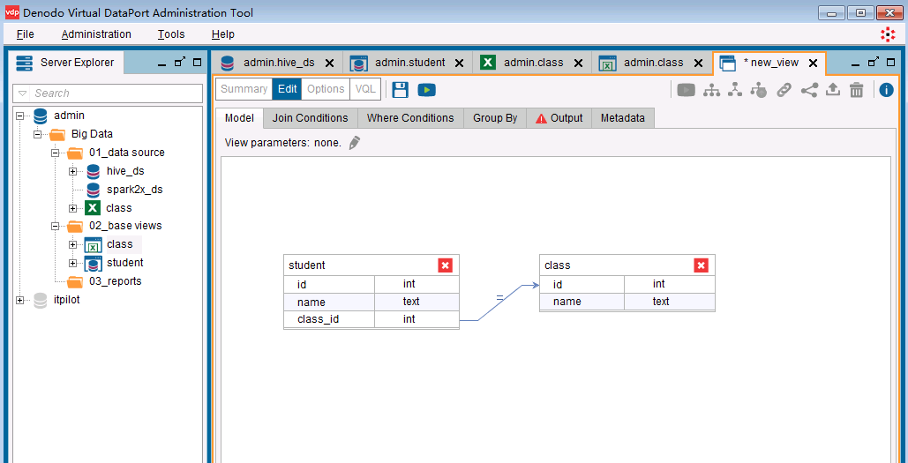

* 移至`Output`将View name设置为“student_class”，将student的class_id和class的id删除。

  

* 重命名class的name为class_name。

  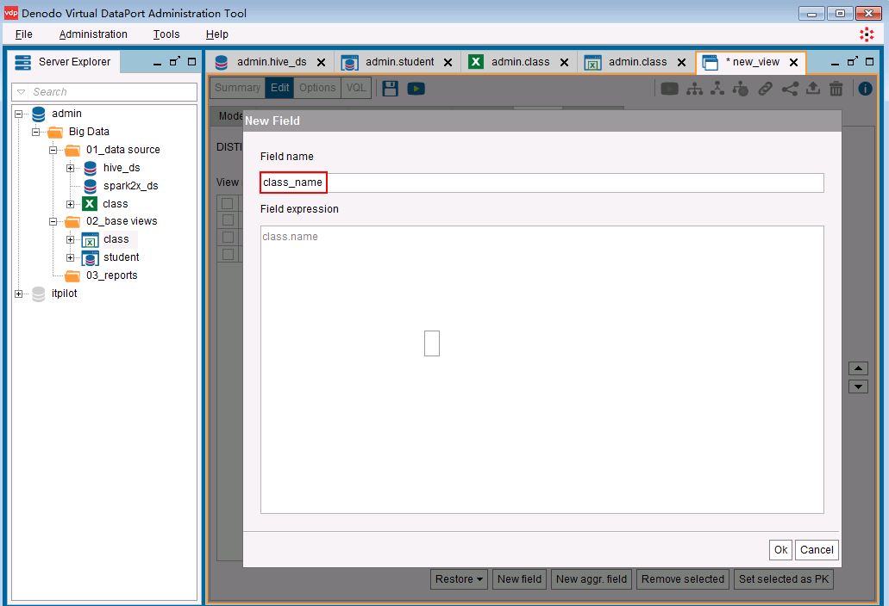

* 点击保存。

  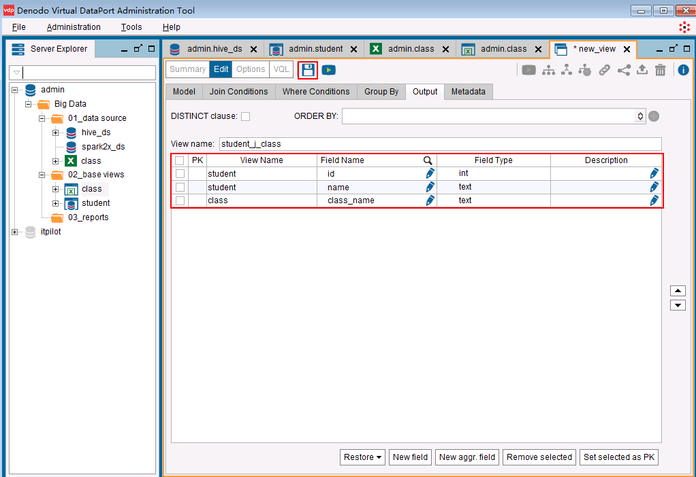

* 选择`student_class`，点击`Execution panel->Execute`。

  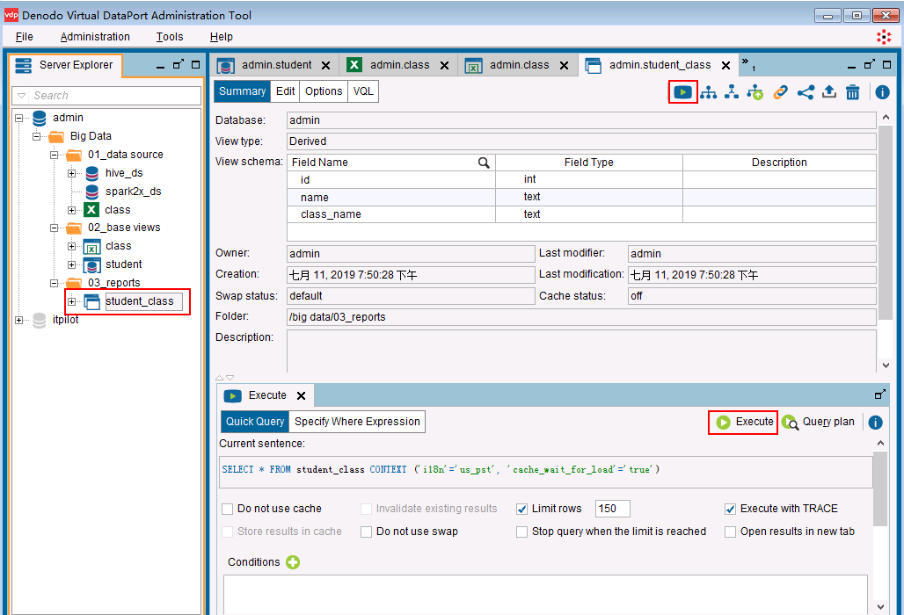

* 等待返回查询结果后，`Query Results->Results`，可查看返回Hive和Excel组合后的数据。

  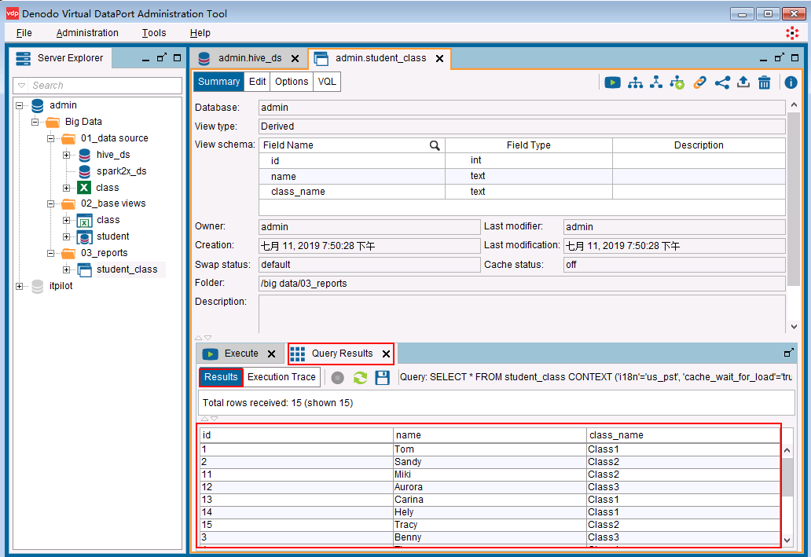

### 使用DbVisualizer查看Denodo Views的数据

* 从<https://www.dbvis.com/download/>下载DbVisualizer并安装于本地。

  

* 打开DbVisualizer，选择`Tools->Driver Manager`。

  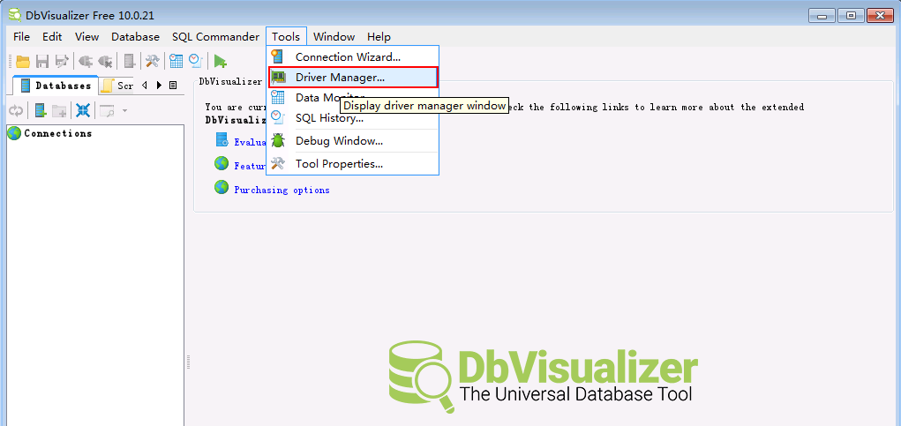

* 选择`Drive->Create Driver`。

  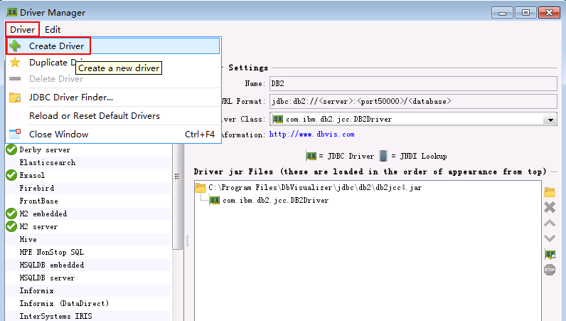

* 输入以下配置信息后关闭该界面：
  ```
  Name: Denodo 7.0
  URL Format: jdbc:vdb://host:port/database
  Drive Class: 点击文件夹导入Denodo自带的JDBC jar包，例如C:\Denodo\DenodoPlatform7.0\tools\client-drivers\jdbc\denodo-vdp-jdbcdriver.jar，再在下拉框中选择com.denodo.vdp.jdbc.Driver
  ```
  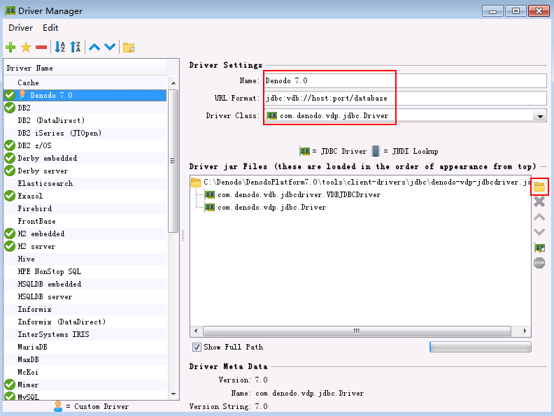

* 返回主界面后，选择`Database->Create Database Connection`。

  

* 选择`Use Wizard`。

  

* 选择`Denodo 7.0`，点击`Next`。

  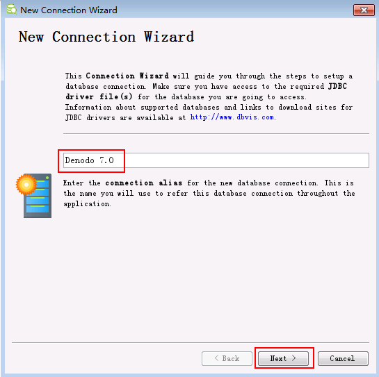

* 输入连接信息后点击`Finish`。

  **连接信息如下：**
  ```
  Database URL: jdbc:vdb://localhost:9999/admin
  Database Userid: admin
  Database Password: admin
  ```

  

* 连接Denodo默认的admin数据库成功。

  

* 双击`VIEW->student_class`，选择`Open Object`。

  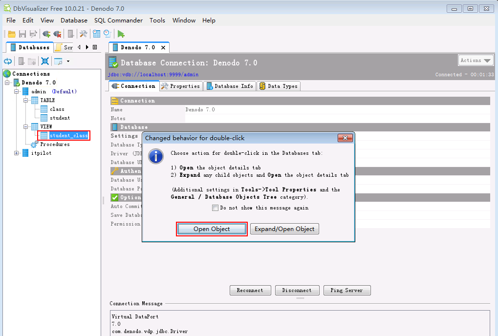

* 点击`Data`查询返回数据正确。

  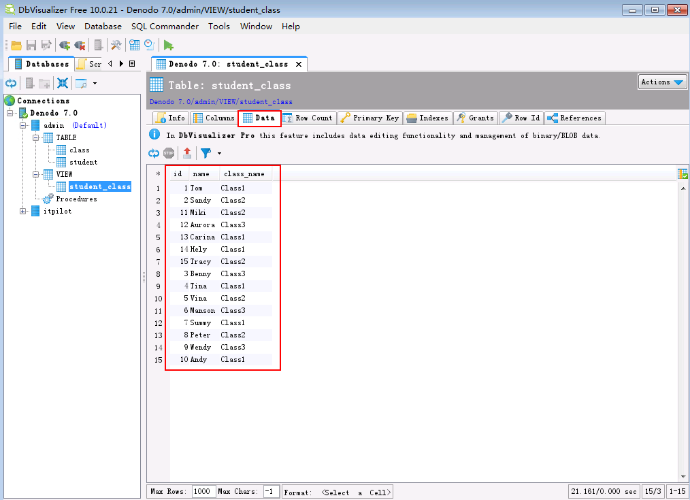

### 登录RESTful Web service查看Associations

* 创建student和class的Association

  - 右键文件夹03_reports，选择`New Association`。

    

  - 分别将文件夹02_base views下的student、class拖至右边编辑框，并连接student.class_id和class.id。

    

  - 移至`Output`将“Association name”设置为`student_class`，“End point 'student'”为`Principal`且“Role name”为`class`，“End point 'class'”为`Dependent`且“Role name”为`belongs_to_student`。点击保存。

    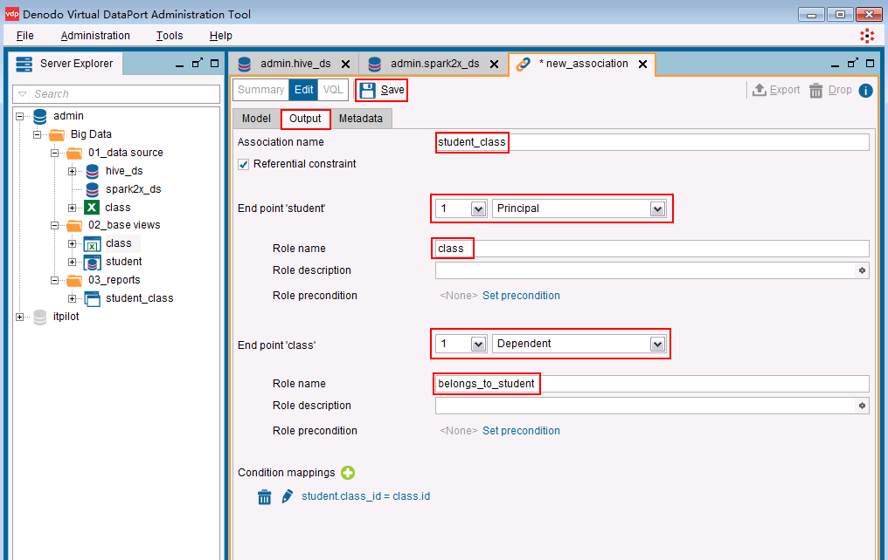

  - 保存后可以在文件夹03_reports下面看到Association student_class。

    

  * 登录Denodo的RESTful Web service查看Association student_class

    - 登录<http://localhost:9090/denodo-restfulws/admin/>，用户名为`admin`，密码为`admin`。

      

    - 点击`class`，返回该view的相关信息。

      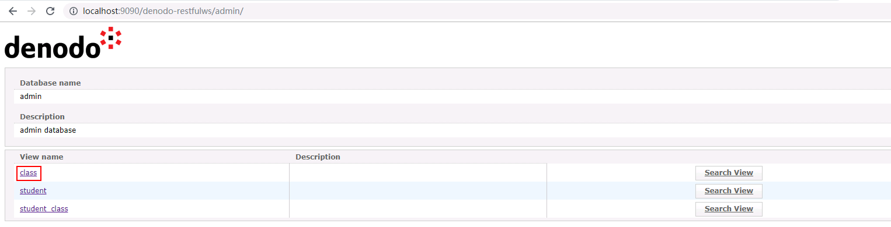

      

    - 点击`belongs_to_student`，返回属于该class的所有student。

      

      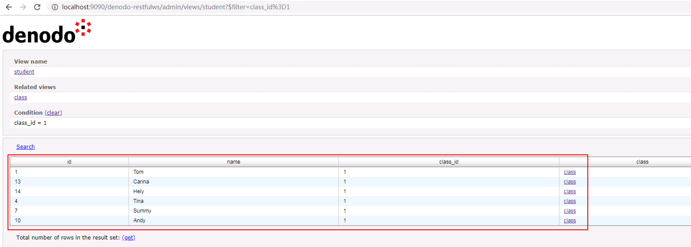

### 登录Data Catalog查看Views

* 在主界面点击`Denodo Platform Control Center->Virtual DataPort->Start`启动Data Catalog服务。

  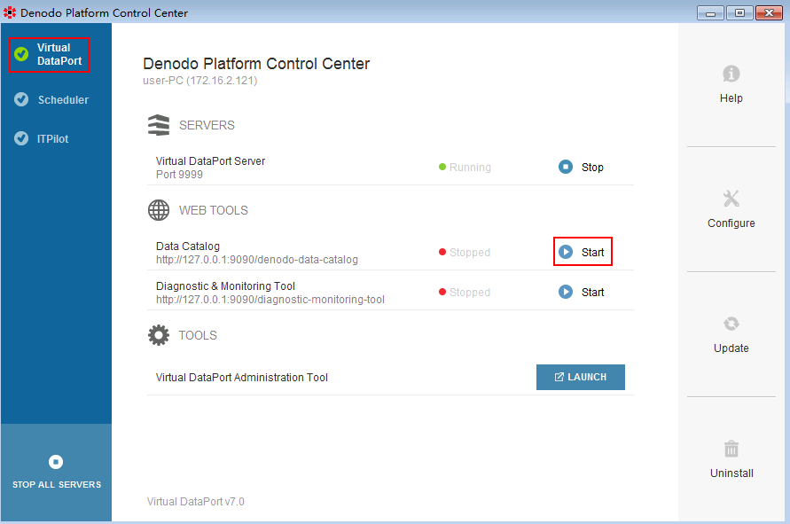

* 状态显示为Running，Data Catalog服务启动成功。

  

* 使用浏览器访问<http://127.0.0.1:9090/denodo-data-catalog>，输入默认的用户名`admin`和密码`admin`，点击`Sign In`登录。

  

* 选择`Browser->DB/Folders`。

  

* 选择`admin->Big Data->02_base views->student->Query`查询视图student的数据。

  

* 点击Output columns的`Add->New Field`添加输出列。

  

* 输入Name=`id`，Expression=`id`，点击`Save`。

  

* id列成功保存在Output columns。

  

* 采用同样的操作，点击Output columns的`Add->New Field`添加其他输出列，例如name。

  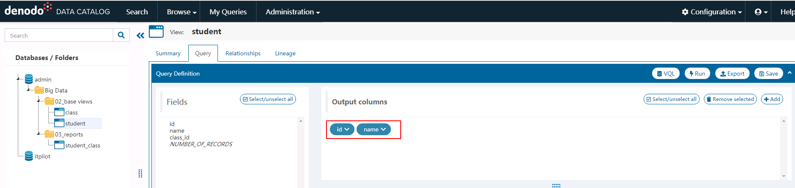

* 点击`Run`查询成功返回student表的id、name、两列的值。

  

## FAQ

  * 点击`Test connection`返回错误Unable to establish connection: javax.security.auth.login.LoginException: KrbException: Cannot locate default realm

    

    **解决办法：**

     将developuser用户的认证凭证krb5.conf文件重命名为krb5.ini并放在`C:\Windows\`目录后，再点击`Test connection`重试。

  * 对接Spar2x时，点击`Test connection`返回错误Unable to establish connection: java.lang.SecurityException: class "com.ctc.wstx.io.SystemId"'s signer information does not match signer information of other classes in the same package

    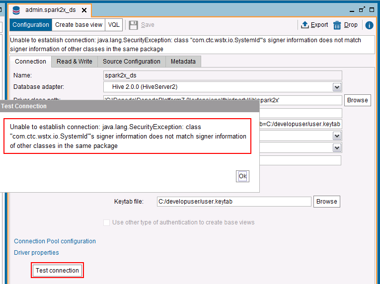

    **解决办法：**

    检查是否已经将`woodstox-core-5.0.3.jar`包拷贝至`Drive class path`对应的目录，例如将`..\FusionInsight_Services_Client\FusionInsight_Services_ClientConfig\Spark2x\FusionInsight-Spark2x-2.3.2.tar.gz\spark\jars\woodstox-core-5.0.3.jar`拷贝至`C:\Denodo\DenodoPlatform7.0\extensions\thirdparty\lib\spark2x\`，再点击`Test connection`重试。

  * 对接Spark2x时，点击`Test connection`返回错误Unable to establish connection: java.sql.SQLException: org.apache.hive.jdbc.ZooKeeperHiveClientException: Unable to read HiveServer2 uri from ZooKeeper

    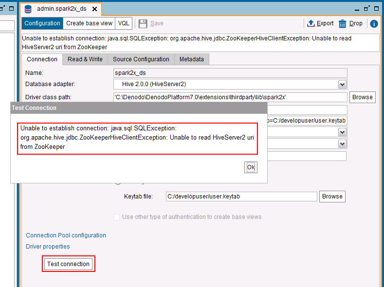

    **解决办法：**

     - 检查是否已经创建连接Zookeeper的jaas配置文件（如`C:\developuser\jaas.conf`），如果没有，则创建，内容格式如下：
       ```
       Client {
       com.sun.security.auth.module.Krb5LoginModule required
       useKeyTab=true
       keyTab="c:/developuser/user.keytab"
       principal="developuser@HADOOP.COM"
       useTicketCache=false
       storeKey=true
       debug=true;
       };
       ```
      - 检查是否已经配置Virtual DataPort Server的JVM Options新增`-Djava.security.auth.login.config=c:/developuser/jaas.conf`。如果没有，则先停止Virtual DataPort Server，再在Virtual DataPort Server的JVM Options中新增jaas.conf的配置。详细操作可参考本文的`启动并配置Denodo->配置并启动Virtual DataPort Server`章节。

  * 点击`Test connection`返回错误Unable to establish connection: javax.security.auth.login.LoginException: Clock skew too great (37) - PREAUTH_FAILED

      

      **解决办法：**

      检查客户端机器（本地）时间与FusionInsight HD集群时间的时间差是否小于5分钟。如果不是，建议修改客户端机器的时间保持与FusionInsight HD集群时间小于5分钟，再点击`Test connection`重试。
