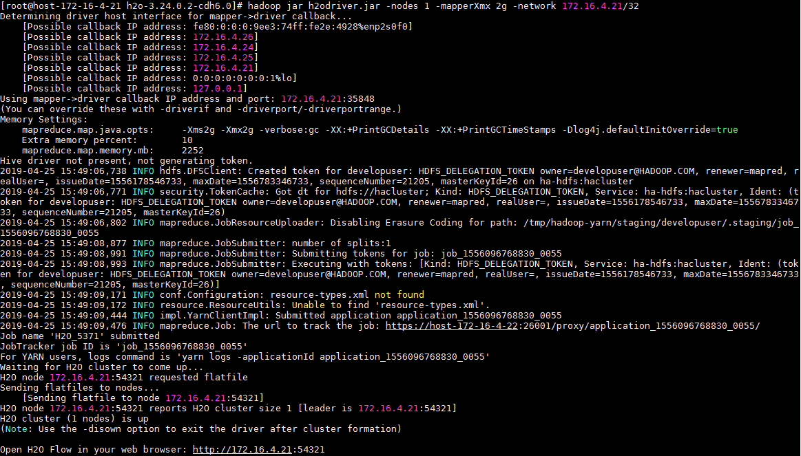
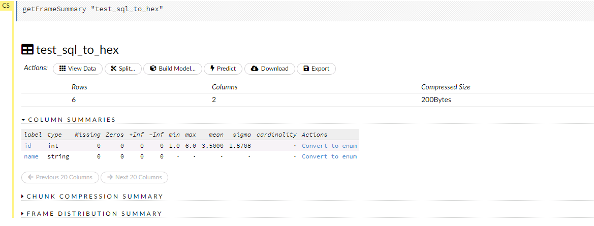

# H2O.ai 对接FusionInsight

## 适用场景

> H2O.ai 3.24.0.2 <--> FusionInsight HD 6.5 (HDFS/GaussDB)
>
> H2O.ai 3.24.0.2 <--> FusionInsight MRS 8.0 (HDFS)

## 环境准备

  * 下载H2O.ai安装包
    下载地址为
    http://h2o-release.s3.amazonaws.com/h2o/rel-yates/2/h2o-3.24.0.2-cdh6.0.zip
    解压后得到安装目录h2o-3.24.0.2-cdh6.0

  * 安装FusionInsight客户端，安装目录为/opt/hadoopclient

  * h2o要放到集群其中一个节点上


## H2o使用
  * 启动H2O
  ```
    cd /opt/h2o-3.24.0.2-cdh6.0
    hadoop jar h2odriver.jar -Dmapreduce.map.log.level=DEBUG -JJ "-Djava.security.krb5.conf=/opt/huawei/Bigdata/common/runtime/krb5.conf" -nodes 1 -mapperXmx 8g -network 172.16.4.131/24
  ```
    > -nodes 指定H2o集群中节点数量
    > -mapperXmx 指定H2O集群使用内存大小
    > -network 指定H2Oweb界面访问的IP地址范围

  

  * 在浏览器地址栏输入http://172.16.4.21:54321，即可访问H2O

   

## 连接HDFS
  * 在H2O的web界面上，使用`Import Files`，填入HDFS文件的路径，点击`import`即可

    

  * 在下面可以看到执行结果

    
  * 可以对文件进行一些转换，预处理

    

<!-- ## 连接Hive
  * 获取Hive的驱动包，在客户端的Hive/Beeline/lib目录下，上传至节点，例如`/opt/h2o-3.24.0.2-cdh6.0/hive/jdbc`目录下
  * 在启动H2O集群时指定相关依赖包,使用以下语句启动H2O集群
  ```
  cd /opt/h2o-3.24.0.2-cdh6.0
  hadoop jar h2odriver.jar -libjars hivejdbc/gsjdbc4.jar -nodes 1 -mapperXmx 2g -network 172.16.4.21/32
  ```
  -->

## 连接GaussDB
  * 获取GaussDB的驱动包gsjdbc4.jar，上传至节点，例如`/opt/h2o-3.24.0.2-cdh6.0`目录下
  * 连接GaussDB 需要加载JDBC驱动包，需在启动H2O集群时指定,使用以下语句启动H2O集群

    ```
    cd /opt/h2o-3.24.0.2-cdh6.0
    hadoop jar h2odriver.jar -libjars gsjdbc4.jar -nodes 1 -mapperXmx 2g -network 172.16.4.21/32
    ```
  * 在H2O的web界面，使用`import SQL Table`，填入以下信息,点击`import`

    
    
    

  * 点击`view Data`，可以预览表中的数据

    
