# IBM InfoSphere DataStage对接FusionInsight

## 适用场景

> IBM InfoSphere DataStage 11.3.1.0 <--> FusionInsight HD V100R002C50
>
> IBM InfoSphere DataStage 11.5.0.2 <--> FusionInsight HD V100R002C60U20

## 前提条件

* 已完成IBM InfoSphere DataStage 11.5.0.2的安装部署（本文部署在Centos7.2上）
* 已完成FusionInsight集群的部署，版本FusionInsight HD V100R002C60U20

## 准备工作

### 配置域名解析

* 使用`vi /etc/hosts`命令修改DataStage Server和Client的hosts文件，添加FI集群节点信息，如：

  ```
  162.1.61.42 FusionInsight2
  162.1.61.41 FusionInsight1
  162.1.61.43 FusionInsight3
  ```

### 配置Kerberos认证

* 在FI管理界面创建DataStage对接用户，并赋予该用户所需权限，下载认证凭据

  

* 解压下载的tar文件，得到Kerberos配置文件krb5.conf和用户的keytab文件。

* 以root登录DataStage Server节点，将FI集群的krb5.conf文件复制到`/etc`目录。

* 将用户的user.keytab文件上传到DataStage Server节点的任意目录，如`/home/dsadm`。

### 安装FusionInsight客户端

参考FI产品文档，在FI服务管理界面下载完整客户端，上传到DataStageServer，安装至自定义目录，如`/opt/ficlient`。

## 对接HDFS

### 导入FI集群的SSL证书

* 浏览器导出FI集群的根证书

  浏览器打开FI管理界面，查看证书，点击“证书路径”页签，选择根路径，查看根证书，在“详细信息”页签下，点击“复制到文件”，导出为cer格式

  

* 证书导入DataStage的keystore文件

  将导出的FI根证书fi-root-ca.cer上传到DataStage服务端，如`/home/dsadm`路径下，将证书导入到keystore文件，命令参考：
  ```
  /opt/IBM/InformationServer/jdk/bin/keytool -importcert -file /home/dsadm/fi-root-ca.cer -keystore /home/dsadm/iis-ds-truststore_ssl.jks -alias fi-root-ca.cer -storepass Huawei@123 -trustcacerts -noprompt
  chown dsadm:dstage /home/dsadm/iis-ds-truststore_ssl.jks
  ```

* 生成并保存加密后的keystore密码

  

  使用`vi /home/dsadm/authenticate.properties`命令新建配置文件，保存上一步骤生成的密文：

  ```
  password={iisenc}SvtJ2f/uNTrvbuh26XDzag==
  ```

  执行`chown dsadm:dstage /home/dsadm/ authenticate.properties`修改配置文件的属主

* 导出truststore环境变量

  使用`vi /opt/IBM/InformationServer/Server/DSEngine/dsenv`编辑DSEngine的环境变量，在最后添加

  ```
  export DS_TRUSTSTORE_LOCATION=/home/dsadm/iis-ds-truststore_ssl.jks
  export DS_TRUSTSTORE_PROPERTIES=/home/dsadm/authenticate.properties
  ```

* 重启DSEngine，参考命令

  ```
  su - dsadm
  cd $DSHOME
  bin/uv -admin -stop
  bin/uv -admin -start
  ```


### 读取HDFS文件

* 创建作业

  新建并行作业，保存为hdfs2sf

  添加File_Connector组件和Sequential File组件，以及File_Connector到Sequential File链接

  

* 参考下图修改配置

  

  

  

* 编译运行

  保存配置后，编译，运行

  

  在菜单 **Tools** -> **Run Director** 中打开Director客户端，查看作业日志

  

* 查看读取的数据

  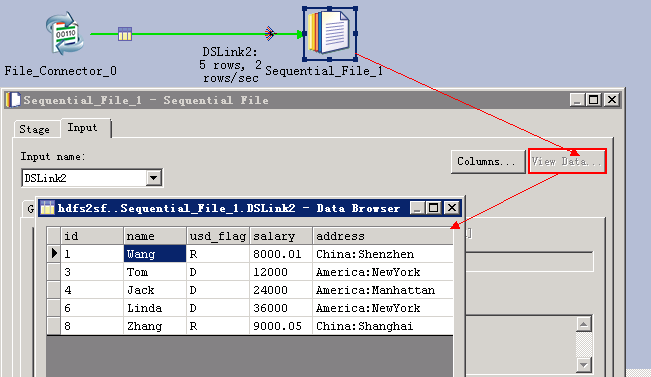

  

### 写入HDFS文件

* 创建作业

  新建并行作业，保存为hdfswrite

  添加Row Generator组件和File Connector组件，以及Row Generator到File Connector链接

  

* 参考下图修改配置

  

  

  

  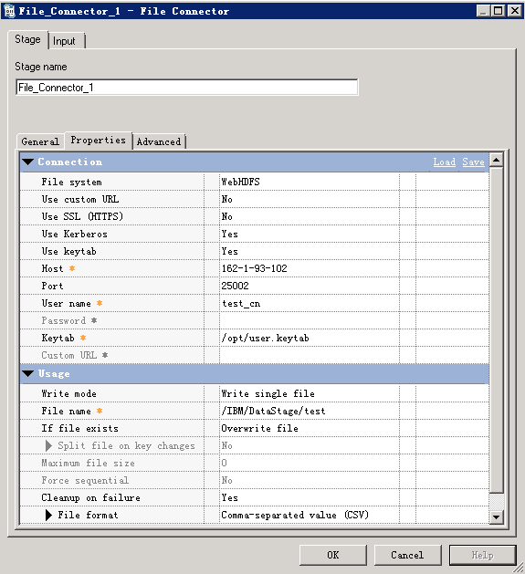

* 编译运行

  **保存** — **编译** — **运行** ，查看作业日志：

  

* 查看写入数据

  

## 对接Hive

### 使用Hive Connector

> 说明：Hive Connector官方认证过的Hive JDBC Driver只有DataDirect Hive Driver(IShive.jar)，用DataStage 11.5.0.2中自带的IShive.jar连接FusionInsight的hive时，会有thrift protocol报错，需要咨询IBM技术支持提供的最新的IShive.jar

#### 设置JDBC Driver配置文件

* 在$DSHOME路径下创建isjdbc.config文件，CLASSPATH变量中添加DataDirect Hive Driver (IShive.jar)的路径，CLASS_NAMES变量中添加com.ibm.isf.jdbc.hive.HiveDriver，参考命令：

  ```
  su - dsadm
  cd $DSHOME
  vi isjdbc.config
  ```

  在isjdbc.config中添加如下信息:
  ```
  CLASSPATH=/opt/IBM/InformationServer/ASBNode/lib/java/IShive.jar
  CLASS_NAMES=com.ibm.isf.jdbc.hive.HiveDriver
  ```


* 配置Kerberos认证信息：

  在IShive.jar所在目录下创建JDBCDriverLogin.conf

  ```
  cd /opt/IBM/InformationServer/ASBNode/lib/java/
  vi JDBCDriverLogin.conf
  ```

  文件内容如下：
  ```
  JDBC_DRIVER_test_cache{
        com.ibm.security.auth.module.Krb5LoginModule required
        credsType=initiator
        principal="test@HADOOP.COM"
        useCcache="FILE:/tmp/krb5cc_1004";
  };
  JDBC_DRIVER_test_keytab{
        com.ibm.security.auth.module.Krb5LoginModule required
        credsType=both
        principal="test@HADOOP.COM"
        useKeytab="/home/dsadm/user.keytab";
  };
  ```

#### 读取Hive数据

* 创建作业

  

* 修改配置

  URL参考如下进行配置：
  ```
  jdbc:ibm:hive://162.1.61.41:21066;DataBaseName=default;AuthenticationMethod=kerberos;ServicePrincipalName=hive/hadoop.hadoop.com@HADOOP.COM;loginConfigName=JDBC_DRIVER_test_keytab;
  ```

  其中JDBC_DRIVER_test_keytab为上一步指定的鉴权信息

  

  

  

* 编译运行

  **保存** — **编译** — **运行** ，查看作业日志：

  

  * 查看读取的数据

  

#### 数据写入Hive表

* 创建作业

  

* 修改配置

  

  

  

* 编译运行

  **保存** — **编译** — **运行** ，查看作业日志，写入10条数据，用时2’11”

  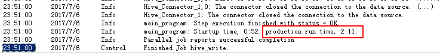

* 查看Hive表数据：

  

> Hive Connector向Hive表写数据使用Insert语句，每插入一条数据会起一个MR任务，效率特别低，不推荐使用这种方式。可以将数据直接写入HDFS文件。

### 使用JDBC Connector

如果要使用FusionInsight的Hive JDBC驱动， 用isjdbc.config文件CLASSPATH中添加jdbc驱动和依赖包的方式，在运行作业时会有如下报错，此时需要用导出CLASSPATH环境变量的方式加载


而且只能用JDBC Connector，不能用Hive Connector，否则会有如下报错


#### 设置CLASSPATH环境变量

* Hive jdbc驱动包及依赖包位于Hive客户端lib目录下`/opt/ficlient/Hive/Beeline/lib`，若未安装客户端，也可单独上传这些jar包到任意目录。

* 设置CLASSPATH环境变量，添加上述jar包的完整路径，参考命令：
  ```
  su - dsadm
  vi $DSHOME/dsenv
  ```

* 文件最后添加相关的jar包（具体路径根据实际环境调整）

  ```
  export CLASSPATH=/opt/ficlient/Hive/Beeline/lib/commons-cli-1.2.jar:/opt/ficlient/Hive/Beeline/lib/commons-collections-3.2.1.jar:/opt/ficlient/Hive/Beeline/lib/commons-configuration-1.6.jar:/opt/ficlient/Hive/Beeline/lib/commons-lang-2.6.jar:/opt/ficlient/Hive/Beeline/lib/commons-logging-1.1.3.jar:/opt/ficlient/Hive/Beeline/lib/curator-client-2.7.1.jar:/opt/ficlient/Hive/Beeline/lib/curator-framework-2.7.1.jar:/opt/ficlient/Hive/Beeline/lib/curator-recipes-2.7.1.jar:/opt/ficlient/Hive/Beeline/lib/guava-14.0.1.jar:/opt/ficlient/Hive/Beeline/lib/hadoop-auth-2.7.2.jar:/opt/ficlient/Hive/Beeline/lib/hadoop-common-2.7.2.jar:/opt/ficlient/Hive/Beeline/lib/hadoop-mapreduce-client-core-2.7.2.jar:/opt/ficlient/Hive/Beeline/lib/hive-beeline-1.3.0.jar:/opt/ficlient/Hive/Beeline/lib/hive-cli-1.3.0.jar:/opt/ficlient/Hive/Beeline/lib/hive-common-1.3.0.jar:/opt/ficlient/Hive/Beeline/lib/hive-exec-1.3.0.jar:/opt/ficlient/Hive/Beeline/lib/hive-jdbc-1.3.0.jar:/opt/ficlient/Hive/Beeline/lib/hive-metastore-1.3.0.jar:/opt/ficlient/Hive/Beeline/lib/hive-serde-1.3.0.jar:/opt/ficlient/Hive/Beeline/lib/hive-service-1.3.0.jar:/opt/ficlient/Hive/Beeline/lib/hive-shims-0.23-1.3.0.jar:/opt/ficlient/Hive/Beeline/lib/hive-shims-common-1.3.0.jar:/opt/ficlient/Hive/Beeline/lib/httpclient-4.5.2.jar:/opt/ficlient/Hive/Beeline/lib/httpcore-4.4.jar:/opt/ficlient/Hive/Beeline/lib/jline-2.12.jar:/opt/ficlient/Hive/Beeline/lib/libfb303-0.9.3.jar:/opt/ficlient/Hive/Beeline/lib/libthrift-0.9.3.jar:/opt/ficlient/Hive/Beeline/lib/log4j-1.2.17.jar:/opt/ficlient/Hive/Beeline/lib/slf4j-api-1.7.5.jar:/opt/ficlient/Hive/Beeline/lib/slf4j-log4j12-1.7.5.jar:/opt/ficlient/Hive/Beeline/lib/super-csv-2.2.0.jar:/opt/ficlient/Hive/Beeline/lib/xercesImpl-2.9.1.jar:/opt/ficlient/Hive/Beeline/lib/zookeeper-3.5.1.jar
  ```

* 导入环境变量
  ```
  source $DSHOME/dsenv
  ```

* 重启DSEngine

  ```
  cd $DSHOME
  bin/uv -admin -stop
  bin/uv -admin -start
  ```

#### 读取Hive数据

* 创建作业

  

* 修改配置

  

  其中URL为：
  ```
  jdbc:hive2://162.1.61.41:21066/default;sasl.qop=auth-conf;auth=KERBEROS;principal=hive/hadoop.hadoop.com@HADOOP.COM;user.principal=test@HADOOP.COM;user.keytab=/home/dsadm/user.keytab;
  ```

  

  

* 编译运行

  

  

#### 数据写入Hive表

* 创建作业

  

* 修改配置

  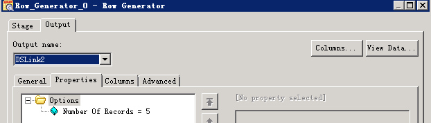

  

  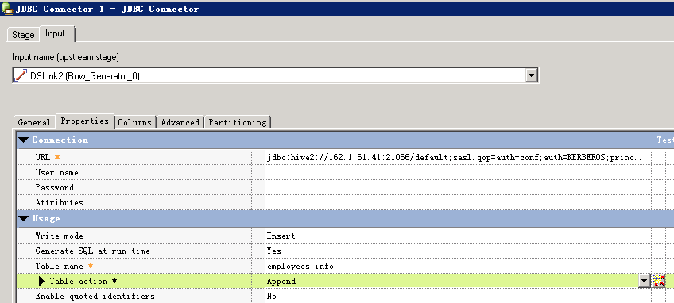

* 编译运行

  写入5条数据，用时1’49”

  

  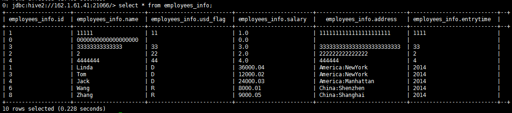

### 数据导入Hive表的HDFS文件

* 创建作业

  

* 修改配置

  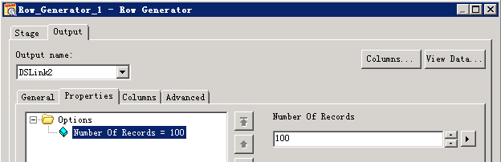

  

* 编译运行

  

* 查看写入数据

  

  hive表数据增量100

  

### 增量数据定期自动导入Hive表的HDFS文件

增量数据可以新增HDFS文件的方式导入hive，如果要定期自动化执行，导入的文件名中需要包含可变参数进行设置和区分，然后以命令或脚本方式运行作业，给该参数赋值。

* 创建作业

  

* 设置作业参数

  点击“job properties”按钮，设置参数如下

  

* 修改配置

  

  File Connector配置导出文件的名称，以“#”引用设置的参数

  

* dsjob命令运行作业

  保存编译作业，在DataStage Server上执行dsjob -run命令，格式为：

  > dsjob -run [-mode <NORMAL | RESET | VALIDATE>] -param <name>=<value> -jobstatus PROJECT_NAME  JOB_NAME

  命令参考:
  ```
  su - dsadm
  cd $DSHOME/bin
  ./dsjob -run -param jobruntime=`date +'%Y-%m-%d-%H-%M-%S'` -jobstatus dstage1 hive_append
  ```

  

* 查看HDFS文件：

  

* 查看Hive数据增量为200条

  

## 对接SparkSQL

与使用FI Hive JDBC驱动类似，可以用SparkSQL JDBC驱动连接Hive，同样需要导出CLASSPATH环境变量来加载驱动包及依赖包。

> SparkSQL jdbc不支持insert into语句，只能用来读hive数据，不能插入数据到hive表。

### 设置CLASSPATH环境变量

* SparkSQL jdbc驱动包及依赖包位于Spark客户端lib目录下`/opt/ficlient/Spark/spark/lib/`，若未安装客户端，也可单独上传所需jar包到任意目录。

* 设置CLASSPATH环境变量，添加上述jar包的完整路径，以及spark客户端配置文件路径（SparkSQL jdbc连接hive时需要读取hive-site.xml中的配置）：

  ```
  su - dsadm
  vi $DSHOME/dsenv
  ```

  配置如下内容：
  ```
  export CLASSPATH= /opt/ficlient/Spark/spark/lib/commons-collections-3.2.2.jar:/opt/ficlient/Spark/spark/lib/commons-configuration-1.6.jar:/opt/ficlient/Spark/spark/lib/commons-lang-2.6.jar:/opt/ficlient/Spark/spark/lib/commons-logging-1.1.3.jar:/opt/ficlient/Spark/spark/lib/curator-client-2.7.1.jar:/opt/ficlient/Spark/spark/lib/curator-framework-2.7.1.jar:/opt/ficlient/Spark/spark/lib/guava-12.0.1.jar:/opt/ficlient/Spark/spark/lib/hadoop-auth-2.7.2.jar:/opt/ficlient/Spark/spark/lib/hadoop-common-2.7.2.jar:/opt/ficlient/Spark/spark/lib/hadoop-mapreduce-client-core-2.7.2.jar:/opt/ficlient/Spark/spark/lib/hive-common-1.2.1.spark.jar:/opt/ficlient/Spark/spark/lib/hive-exec-1.2.1.spark.jar:/opt/ficlient/Spark/spark/lib/hive-jdbc-1.2.1.spark.jar:/opt/ficlient/Spark/spark/lib/hive-metastore-1.2.1.spark.jar:/opt/ficlient/Spark/spark/lib/hive-service-1.2.1.spark.jar:/opt/ficlient/Spark/spark/lib/htrace-core-3.1.0-incubating.jar:/opt/ficlient/Spark/spark/lib/httpclient-4.5.2.jar:/opt/ficlient/Spark/spark/lib/httpcore-4.4.4.jar:/opt/ficlient/Spark/spark/lib/libthrift-0.9.3.jar:/opt/ficlient/Spark/spark/lib/log4j-1.2.17.jar:/opt/ficlient/Spark/spark/lib/slf4j-api-1.7.10.jar:/opt/ficlient/Spark/spark/lib/slf4j-log4j12-1.7.10.jar:/opt/ficlient/Spark/spark/lib/xercesImpl-2.9.1.jar:/opt/ficlient/Spark/spark/lib/zookeeper-3.5.1.jar:/opt/ficlient/Spark/spark/conf
  ```

* 导入环境变量
  ```
  source $DSHOME/dsenv
  ```

* 重启DSEngine

  ```
  cd $DSHOME
  bin/uv -admin -stop
  bin/uv -admin -start
  ```

### 读取Hive表数据

* 创建作业

  

* 修改配置

  

  URL参考：
  ```
  jdbc:hive2://ha-cluster/default;user.principal=spark/hadoop.hadoop.com@HADOOP.COM;saslQop=auth-conf;auth=KERBEROS;principal=spark/hadoop.hadoop.com@HADOOP.COM;user.principal=test@HADOOP.COM;user.keytab=/home/dsadm/user.keytab;
  ```

  

* 编译运行

  

  

## 对接Phoenix

使用Phoenix以JDBC方式访问HBase表，也需要导出CLASSPATH环境变量来加载驱动包及依赖包。

### 设置CLASSPATH环境变量

* Phoenix相关的jar包位于HBase客户端lib目录下`/opt/ficlient/HBase/hbase/lib`，若未安装客户端，也可单独上传所需jar包到任意目录。

* 设置CLASSPATH环境变量，添加上述jar包的完整路径，以及HBase客户端配置文件路径（phoenix连接时需要读取hbase-site.xml中的配置）：

  ```
  su - dsadm
  vi $DSHOME/dsenv
  ```

  配置如下内容：

  ```
  export CLASSPATH=
  /opt/ficlient/HBase/hbase/lib/commons-cli-1.2.jar:/opt/ficlient/HBase/hbase/lib/commons-codec-1.9.jar:/opt/ficlient/HBase/hbase/lib/commons-collections-3.2.2.jar:/opt/ficlient/HBase/hbase/lib/commons-configuration-1.6.jar:/opt/ficlient/HBase/hbase/lib/commons-io-2.4.jar:/opt/ficlient/HBase/hbase/lib/commons-lang-2.6.jar:/opt/ficlient/HBase/hbase/lib/commons-logging-1.2.jar:/opt/ficlient/HBase/hbase/lib/dynalogger-V100R002C30.jar:/opt/ficlient/HBase/hbase/lib/gson-2.2.4.jar:/opt/ficlient/HBase/hbase/lib/guava-12.0.1.jar:/opt/ficlient/HBase/hbase/lib/hadoop-auth-2.7.2.jar:/opt/ficlient/HBase/hbase/lib/hadoop-common-2.7.2.jar:/opt/ficlient/HBase/hbase/lib/hadoop-hdfs-2.7.2.jar:/opt/ficlient/HBase/hbase/lib/hadoop-hdfs-client-2.7.2.jar:/opt/ficlient/HBase/hbase/lib/hbase-client-1.0.2.jar:/opt/ficlient/HBase/hbase/lib/hbase-common-1.0.2.jar:/opt/ficlient/HBase/hbase/lib/hbaseFileStream-1.0.jar:/opt/ficlient/HBase/hbase/lib/hbase-protocol-1.0.2.jar:/opt/ficlient/HBase/hbase/lib/hbase-secondaryindex-1.0.2.jar:/opt/ficlient/HBase/hbase/lib/hbase-server-1.0.2.jar:/opt/ficlient/HBase/hbase/lib/htrace-core-3.1.0-incubating.jar:/opt/ficlient/HBase/hbase/lib/httpclient-4.5.2.jar:/opt/ficlient/HBase/hbase/lib/httpcore-4.4.4.jar:/opt/ficlient/HBase/hbase/lib/httpmime-4.3.6.jar:/opt/ficlient/HBase/hbase/lib/jackson-core-asl-1.9.13.jar:/opt/ficlient/HBase/hbase/lib/jackson-mapper-asl-1.9.13.jar:/opt/ficlient/HBase/hbase/lib/log4j-1.2.17.jar:/opt/ficlient/HBase/hbase/lib/luna-0.1.jar:/opt/ficlient/HBase/hbase/lib/netty-3.2.4.Final.jar:/opt/ficlient/HBase/hbase/lib/netty-all-4.0.23.Final.jar:/opt/ficlient/HBase/hbase/lib/noggit-0.6.jar:/opt/ficlient/HBase/hbase/lib/phoenix-core-4.4.0-HBase-1.0.jar:/opt/ficlient/HBase/hbase/lib/protobuf-java-2.5.0.jar:/opt/ficlient/HBase/hbase/lib/slf4j-api-1.7.7.jar:/opt/ficlient/HBase/hbase/lib/slf4j-log4j12-1.7.7.jar:/opt/ficlient/HBase/hbase/lib/solr-solrj-5.3.1.jar:/opt/ficlient/HBase/hbase/lib/zookeeper-3.5.1.jar:/opt/ficlient/HBase/hbase/conf
  ```


  * 导入环境变量
    ```
    source $DSHOME/dsenv
    ```

  * 重启DSEngine

    ```
    cd $DSHOME
    bin/uv -admin -stop
    bin/uv -admin -start
    ```

### 创建jaas配置文件

* Phoenix连接需要查询zookeeper ，zookeeper的Kerberos认证需要指定jaas配置文件

  ```
  su - admin
  vi /home/dsadm/jaas.conf
  ```

  文件内容如下：
  ```
  Client {
      com.ibm.security.auth.module.Krb5LoginModule required
      credsType=both
      principal="test@HADOOP.COM"
      useKeytab="/home/dsadm/user.keytab";
  };
  ```

### 读取Phoenix表数据

* 创建作业

  

* 修改配置

  

* URL参考：
  ```
  jdbc:phoenix:fusioninsight3,fusioninsight2,fusioninsight1:24002:/hbase:test@HADOOP.COM:/home/dsadm/user.keytab
  ```

  

* 配置JVM options为`-Djava.security.auth.login.config=/home/dsadm/jaas.conf`

  

  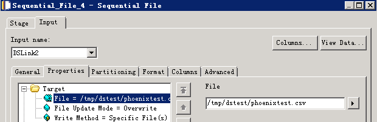

* 编译运行

  

  

### 写入Phoenix表数据

Phoenix插入语句是upsert into，不支持Insert into 语句，所以不能用JDBC Connector在运行时自动生成SQL语句，需要自己填写，否则会报错：

```
main_program: Fatal Error: The connector failed to prepare the statement: INSERT INTO us_population (STATE, CITY, POPULATION) VALUES (?, ?, ?). The reported error is: org.apache.phoenix.exception.PhoenixParserException: ERROR 601 (42P00): Syntax error. Encountered "INSERT" at line 1, column 1..
```

* 创建作业

  

* 修改配置

  

  

  

  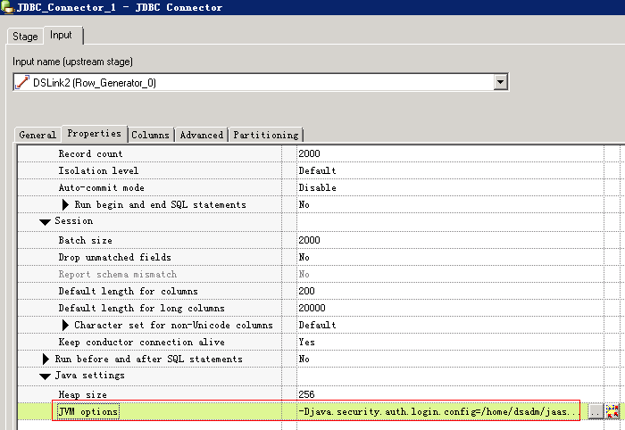

* 编译运行

  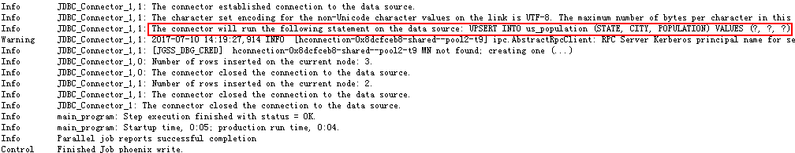

  

## 对接Fiber

对接Fiber需要先安装FI客户端

### 修改JDBC Driver配置文件

* 修改$DSHOME路径的isjdbc.config文件，CLASSPATH变量中添加Fiber jdbc driver及依赖包的路径，CLASS_NAMES变量中添加com.huawei.fiber.FiberDriver;org.apache.hive.jdbc.HiveDriver; org.apache.phoenix.jdbc.PhoenixDriver

  参考命令：
  ```
  su - dsadm
  cd $DSHOME
  vi isjdbc.config
  ```

  配置如下：

  ```
  CLASSPATH=/opt/IBM/InformationServer/ASBNode/lib/java/IShive.jar;/opt/mppdb/jdbc/gsjdbc4.jar;/opt/Progress/DataDirect/JDBC\_60/lib/mongodb.jar;/opt/ficlient/Fiber/lib/commons-cli-1.2.jar;/opt/ficlient/Fiber/lib/commons-logging-1.1.3.jar;/opt/ficlient/Fiber/lib/fiber-jdbc-1.0.jar;/opt/ficlient/Fiber/lib/hadoop-common-2.7.2.jar;/opt/ficlient/Fiber/lib/hive-beeline-1.2.1.spark.jar;/opt/ficlient/Fiber/lib/hive-common-1.2.1.spark.jar;/opt/ficlient/Fiber/lib/hive-jdbc-1.2.1.spark.jar;/opt/ficlient/Fiber/lib/jline-2.12.jar;/opt/ficlient/Fiber/lib/log4j-1.2.17.jar;/opt/ficlient/Fiber/lib/slf4j-api-1.7.10.jar;/opt/ficlient/Fiber/lib/slf4j-log4j12-1.7.10.jar;/opt/ficlient/Fiber/lib/super-csv-2.2.0.jar;

  CLASS_NAMES=com.ibm.isf.jdbc.hive.HiveDriver;org.postgresql.Driver;com.ddtek.jdbc.mongodb.MongoDBDriver;com.huawei.fiber.FiberDriver;org.apache.hive.jdbc.HiveDriver;org.apache.phoenix.jdbc.PhoenixDriver
  ```

### 修改Fiber配置文件

* DataStage使用IBM jdk，需要新建Fiber配置文件给DataStage使用

  ```
  cd /opt/ficlient/Fiber/conf
  cp fiber.xml fiber_ibm.xml
  ```

* 修改fiber_ibm.xml中phoenix,hive,spark各driver的以下两个参数：

  - java.security.auth.login.config 修改为 /home/dsadm/jaas.conf

  - zookeeper.kinit 修改为 /opt/IBM/InformationServer/jdk/jre/bin/kinit

* 文件/home/dsadm/jaas.conf的内容如下：

  ```
  Client {
      com.ibm.security.auth.module.Krb5LoginModule required
      credsType=both
      principal="test@HADOOP.COM"
      useKeytab="/home/dsadm/user.keytab";
  };
  ```

* 其它配置项参考FI产品文档Fiber客户端配置指导修改。

### 使用Hive Driver读取数据

* 创建作业

  

* 修改配置

  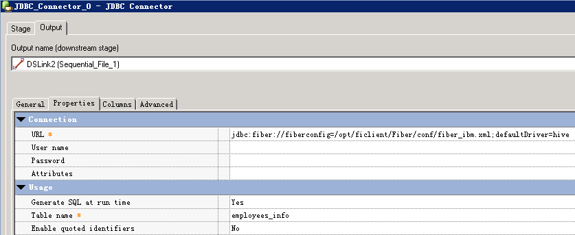

  URL参考：
  ```
  jdbc:fiber://fiberconfig=/opt/ficlient/Fiber/conf/fiber_ibm.xml;defaultDriver=hive
  ```

  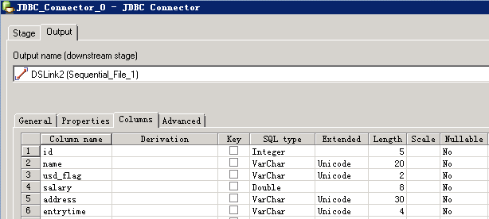

  

* 编译运行

  

  

### 使用Hive Driver写入数据

* 创建作业

  

* 修改配置

  

  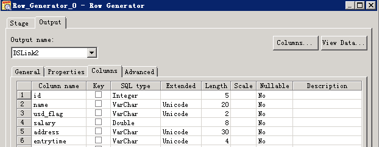

  

* 编译运行

  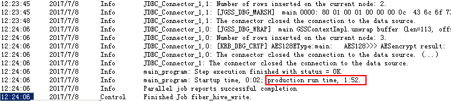

### 使用Spark Driver读取数据

* 创建作业

  

* 修改配置

  

  URL参考：
  ```
  jdbc:fiber://fiberconfig=/opt/ficlient/Fiber/conf/fiber_ibm.xml;defaultDriver=spark
  ```

  

  

* 编译运行

  

  

### 使用Phoenix Driver读取数据

* 创建作业

  

* 修改配置

  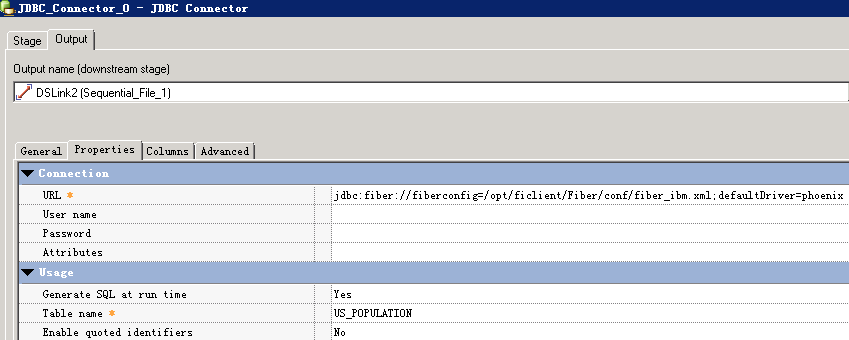

  URL参考：
  ```
  jdbc:fiber://fiberconfig=/opt/ficlient/Fiber/conf/fiber_ibm.xml;defaultDriver=phoenix
  ```

  

  

* 编译运行

  目前未能读取到数据，”The connector could not determine the value for the
  fetch size.”，问题正在确认中

  

### 使用Phoenix Driver写入数据

* 创建作业

  

* 修改配置

  

  

  

  URL参考：
  ```
  jdbc:fiber://fiberconfig=/opt/ficlient/Fiber/conf/fiber_ibm.xml;defaultDriver=phoenix
  ```

* 编译运行

  写入数据0行，问题正在确认中

  

## 对接Kafka

说明：kafka Connector不支持发送或者消费integer, float, double, numeric, decimal等数值类型的字段，需要转换成char, varchar, longvarchar等类型，否则会有如下报错：

```
main_program: APT_PMsectionLeader(2, node2), player 2 - Unexpected termination by Unix signal 9(SIGKILL).
```

### 安装kafka客户端

* kafka Connector需要配置Kafka client Classpath，可以在DataStage节点安装kafka客户端来获取kafka-client jar包。安装步骤参考FusionInsight产品文档。

* Kafka Client Classpath 需要提供kafka-client, log4j, slf4j-api 三个jar包的路径，如：
  ```
  /opt/ficlient/Kafka/kafka/libs/kafka-clients-0.10.0.0.jar;/opt/ficlient/Kafka/kafka/libs/log4j-1.2.17.jar;/opt/ficlient/Kafka/kafka/libs/slf4j-api-1.7.21.jar
  ```

### 发送消息到kafka

* 创建作业

  

* 修改配置

  RowGenerator 生成数据

  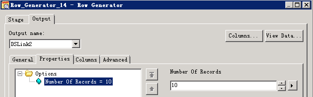

  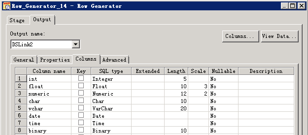

  transformer数据类型转换：

  

  Kafka配置：

  

* 编译运行

  

### 读取Kafka消息

* 创建作业

  

* 修改配置

  

  

  

* 编译运行

  查看读取的数据

  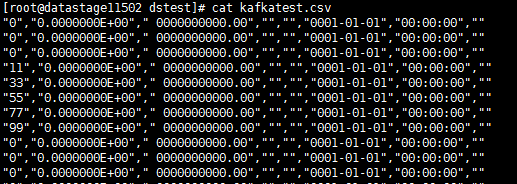

## 对接MPPDB

### 获取MPPDB JDBC Driver

* 从MPPDB发布包中获取，包名为Gauss200-OLAP-VxxxRxxxCxx-xxxx-64bit-Jdbc.tar.gz

* 解压后得到gsjdbc4.jar，上传到DataStage Server

### 修改JDBC Driver配置文件

* 修改$DSHOME路径的isjdbc.config文件，CLASSPATH变量中添加MPPDB Driver 的路径，CLASS_NAMES变量中添加org.postgresql.Driver

  ```
  su - dsadm
  cd $DSHOME
  vi isjdbc.config
  ```

  配置：
  ```
  CLASSPATH=/opt/IBM/InformationServer/ASBNode/lib/java/IShive.jar;/opt/mppdb/jdbc/gsjdbc4.jar;
  CLASS_NAMES=com.ibm.isf.jdbc.hive.HiveDriver;org.postgresql.Driver;
  ```

### 读取MPPDB表数据

* 创建作业

  

* 修改配置

  

  URL格式为： jdbc:postgresql://host:port/database

  

* 编译运行

  

  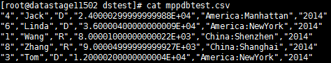

### 数据写入MPPDB表

* 创建作业

  

* 修改配置

  

  

  

  URL格式为： jdbc:postgresql://host:port/database

* 编译运行

  

* 查看MPPDB表数据：

  
