# Informatica BDM对接FusionInsight

## 适用场景

> Informatica 10.2.2  <--> FusionInsight HD 6.5 (HDFS/Hive)

## 简介

Informatica用于管理大数据工程的工具主要有Informatica Administrator、Infoormatica Analyst和Informatica Developer。

本文档主要描述Linux操作系统安装Informatica 10.2.2服务端（Informatica Administrator）并使用Oracle数据库管理域数据、连接数据等，在Window操作系统安装Informatica客户端Big Data Developuser（Informatica Developer其中一种工具）。Informatica服务端与FusionInsight HD的HDFS和Hive对接成功后，通过Informatica的Big Data Developer客户端实现Oracle数据库、HDFS、Hive三者之间数据互传。

本文档的描述使用的Informatic Server安装节点的IP为172.16.6.120，主机名为172-16-6-120。对接的FusionInsight HD集群节点的IP分别是172.16.4.21/172.16.4.22/172.16.4.23.

## 准备工作

* 登录FusionInsight Manager创建一个“人机”用户，例如：developuser，具体请参见FusionInsight HD产品文档的`管理员指南->系统设置->权限设置->用户管理->创建用户`章节。给developuser用户授予所有访问权限，包含但不限于HDFS、Hive、HBase。

* 已完成FusionInsight HD客户端安装，具体请参见FusionInsight HD产品文档的`应用开发指南->安全模式->安全认证->配置客户端文件`章节。

* 已将集群的节点主机名与IP的映射关系加入到windows的hosts文件中`C:\Windows\System32\drivers\etc\hosts`。

* Windows上已经安装好jdk1.8或者以上版本，并完成jdk环境变量配置。

* 将FusionInsight客户端HDFS、HIVE、HBASE以下相关的配置文件拷贝至`C:\ecotesting\hadoopConfig`目录下，并压缩为 **hadoopConfig.zip**。

  * `..\FusionInsight_Cluster_1_Services_ClientConfig\HDFS\config`的hdfs-site.xml、core-site.xml。

  * `..\FusionInsight_Cluster_1_Services_ClientConfig\Hive\config`的hive-site.xml、hivemetastore-site.xml。

  * `..\FusionInsight_Cluster_1_Services_ClientConfig\HBase\config`的hbase-site.xml。

  * `..\FusionInsight_Cluster_1_Services_ClientConfig\Yarn\config`的mapred-site.xml、yarn-site.xml。

## 安装Infomatica服务端

### 操作场景

在Linux上安装Infomatica Server。

### 前提条件

* 已完成准备工作。

* 安装节点上已安装好Oracle数据库。本指导文档安装版本为 **Oracle Database 12c Enterprise Edition Release 12.2.0.1.0 - 64bit Production**，非容器数据库，安装用户名为 **oracle** 并属于群组 **oinstall**，数据库SID为 **orcl**。

* 已获取Informatica服务端安装包，例如：informatica_1022_server_linux-x64.tar，并上传至安装节点的`/opt`目录下。

* 已获取Informatica的License，例如：**infa1022.key**，并上传至安装节点的`/opt`目录下。

### 操作步骤

#### 安装服务端

* 安装Informatica服务端需要连接Domain和Model_Repository_Service的数据库用户。登录oracle数据库，创建两个用户，分别命名为 **domain_user** 和 **mdl_user**。

  ```
  su - oracle
  sqlplus / as sysdba
  SQL> create tablespace rep_data datafile '/u01/app/oracle/oradata/orcl/rep_data_01.dbf' size 512m;
  SQL> create user domain_user identified by domain_user default tablespace rep_data temporary tablespace temp;
  SQL> create user mdl_user identified by mdl_user default tablespace rep_data temporary tablespace temp;
  SQL> grant dba to domain_user,mdl_user;
  SQL> exit

  ```

  

* 创建安装用户 **infa** 并归属于群组 **oinstall**。

  ```
  su - root
  useradd -g oinstall -d /home/infa infa
  echo "Huawei@123" | passwd --stdin infa

  ```

  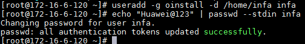

* 使用 **root** 用户解压informatica_1022_server_linux-x64.tar至`/opt/informatica`，设置拥有者为infa用户并赋予755的操作权限。

  ```
  su - root
  mkdir -p /opt/informatica
  tar -xvf /opt/informatica_1022_server_linux-x64.tar -C /opt/informatica
  chown -R infa:oinstall /opt/informatica
  chmod -R 755 /opt/informatica

  ```

  

* 修改 **infa** 用户的环境变量。

  ```
  su - infa
  vi ~/.bash_profile
  source ~/.bash_profile

  ```

  **添加环境变量如下所示：**

  ```
  PATH=$PATH:/u01/app/oracle/product/12.2.1/db_1/bin
  export PATH
  umask 022
  export ORACLE_BASE=/u01/app/oracle
  export ORACLE_HOME=/u01/app/oracle/product/12.2.1/db_1
  export ORACLE_SID=orcl
  export NLS_LANG=AMERICAN_AMERICA.AL32UTF8

  export INFA_CODEPAGENAME="UTF-8"
  export PATH=/opt/informatica/10.2.2/server/bin:$PATH
  export LD_LIBRARY_PATH=$ORACLE_HOME/lib:/opt/informatica/10.2.2/server/bin
  ```
  >说明：12.2.1为oracle版本号，10.2.2为Informatica的版本号。

  


* 使用infa用户登录启动图形化终端开始安装。

  ```
  su - root
  export display=:0.0
  xhost +
  su - infa
  export display=:0.0
  cd /opt/informatica
  ./install.sh

  ```

  >说明：执行 **xhost +** 命令时，确认返回“access control disabled, clients can connect from any host”，才能继续执行后面的命令。

  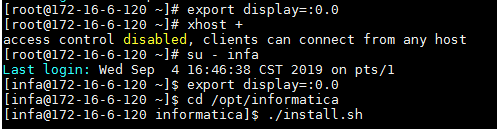

* 输入 **y** 选择继续安装，按 **Enter** 键进入下一步。

  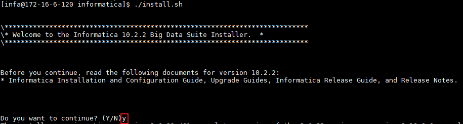

* 输入 **1** 选择“Install and configure Informatica Big Data suite products.”，按 **Enter** 键进入下一步。

  

* 输入 **3** 选择“Run the installer.”，按 **Enter** 键进入下一步。

  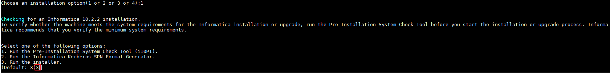

* 输入 **2** 选择“Yes”同意，按 **Enter** 键进入下一步。

  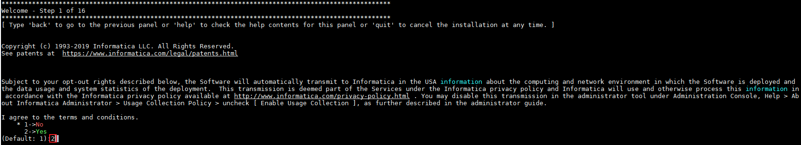

* 输入 **2** 选择“Yes”继续，按 **Enter** 键进入下一步。

  

* 输入 **1** 选择“Install Informatica domain services.”，按 **Enter** 键进入下一步。

  

* 输入 **2** 选择“Yes”继续安装，按 **Enter** 键进入下一步。

  

* 输入 **1** 选择“No”不激活Kerberos认证，按 **Enter** 键进入下一步。

  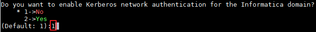

* 输入 **1** 选择“No”，按 **Enter** 键进入下一步。

  

* 输入License的路径，例如：**/opt/infa1022.key**，按 **Enter** 键，输入安装路径（确保和环境变量~/.bash_profile配置的路径一致），例如：**/opt/informatica/10.2.2**，按 **Enter** 键进入下一步。

  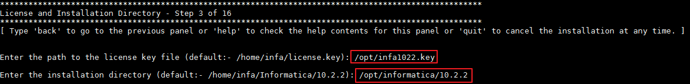

* 按 **Enter** 键开始安装。

  

* 等待安装进度100%后，步骤5的选择创建Domain，具体配置如下图所示：

  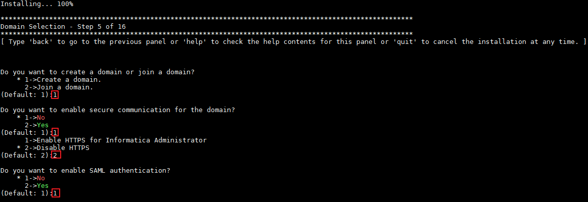

* 步骤6输入Domain的数据库配置信息，具体配置如下图所示：

  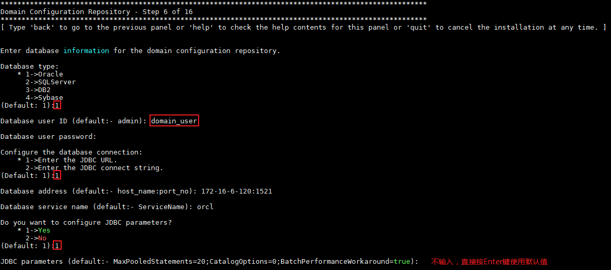

* 步骤7输入自定义密码 **Huawei@123**，按 **Enter** 键进入下一步。

  

* 步骤8输入Domain的配置信息，按 **Enter** 键进入下一步。

  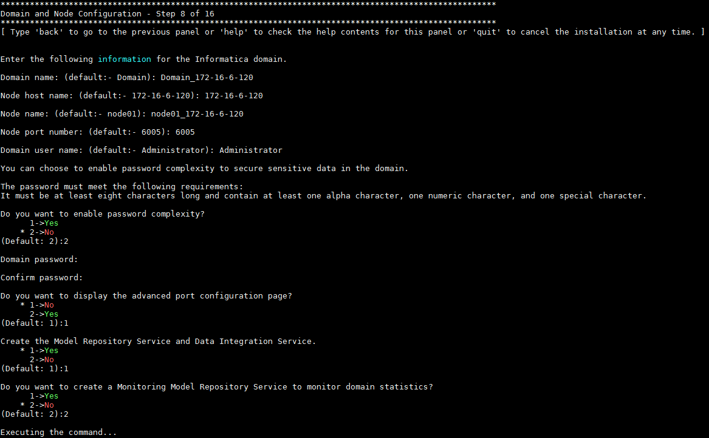

* 步骤8B输入Model Repository Service的数据库配置信息，具体配置如下图所示：

  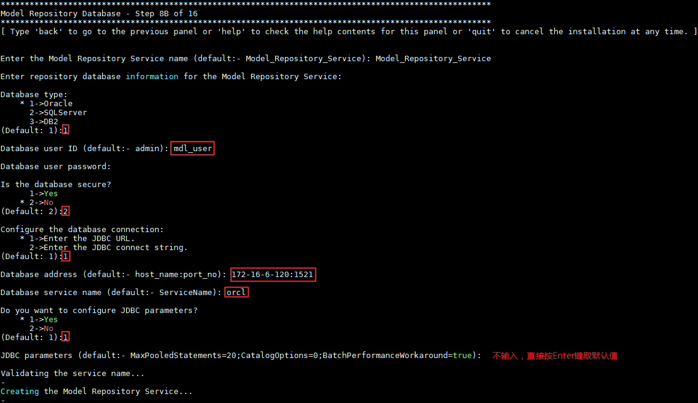

* 步骤9输入Data Integration Service的配置信息，选择不创建CCO连接，具体配置如下图所示：

  

* 按 **Enter** 键结束安装。

  

* 确认防火墙是关闭状态。

  

* 使用浏览器打开<http://172-16-6-120:6008>登录Informatica Administrator，登录用户名为 **Administrator**，密码为 **Huawei@123**，点击 **登录**。

  

* 登录成功。

  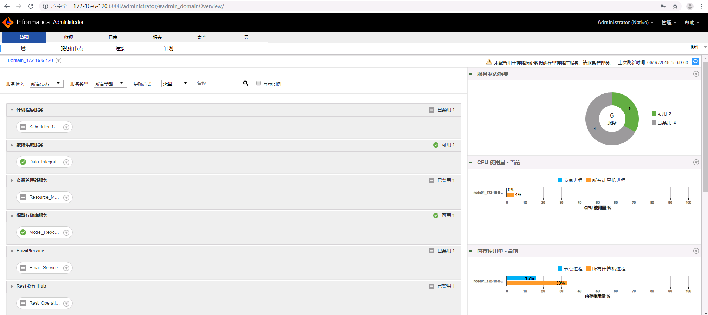

#### 配置Informatica Server

##### 配置Kerberos认证

* 登录FusionInsight Manager的`系统->用户->更多（developuser）->下载认证凭证`，下载developuser对应的认证凭证。解压后，将 **krb5.conf** 上传至Infomatica Server安装节点的`/opt`目录下。

* 登录Informatica Server安装节点，将 **krb5.conf** 复制到`$INFA_HOME/java/jre/lib/security`和`$INFA_HOME/services/shared/security`。命令执行示例如下所示：

  ```
  chown infa:oinstall /opt/krb5.conf
  cp /opt/krb5.conf /opt/informatica/10.2.2/services/shared/security/
  cp /opt/krb5.conf /opt/informatica/10.2.2/java/jre/lib/security/
  ```

##### 配置Data_Integration_Service

* 导航至`管理->服务和节点->Data_Integration_Service`。点击“执行选项”的编辑按钮，设置“Hadoop Kerberos服务主体名称”为 **developuser\@HADOOP.COM**，“Hadoop Kerberos Keytab”为 **/opt/user.keytab**，点解 **确定**，选择 **是，保存更改**。
  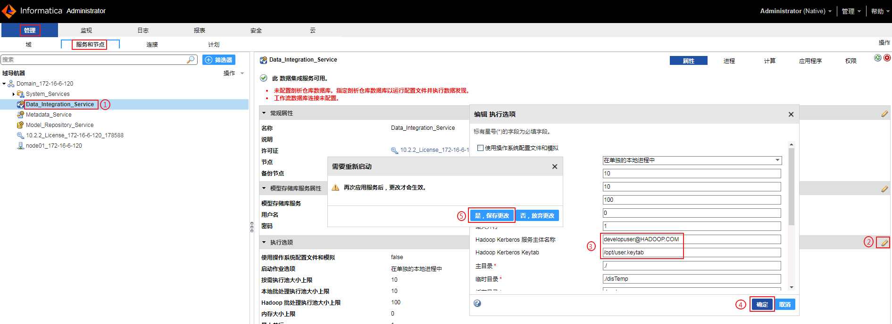

* 点击“Data_Integration_Service”的应用服务按钮，点击 **确定** 让修改生效。

  

##### 创建元数据访问服务

元数据访问服务是一项应用程序服务，它可让 Developer tool 访问 Hadoop 连接信息以导入和预览元数据。从Hadoop集群导入对象时，HBase、HDFS、Hive连接会使用元数据访问服务。

* 登录FusionInsight Manager的`系统->用户->更多（developuser）->下载认证凭证`，下载developuser对应的认证凭证。解压后，将 **user.keytab** 上传至Infomatica Server安装节点的`/opt`目录下。

* 使用浏览器登录<http://172-16-6-120:6008>，登录用户名为 **Administrator**，密码为 **Huawei@123**。

* 导航至`管理->服务和节点`，右键“Domain_172-16-6-120”，选择`新->元数据访问服务`。

  

* “名称”自定义为 **Metadata_Service**，“位置”默认为 **Domain_172-16-6-120**，“许可证”选择有效的License，“节点”选择 **node01_172-16-6-120**。

  

* 点击 **下一步**。

  

* “Hadoop Kerberos服务主体名称”输入 **developuser\@HADOOP.COM**，“Hadoop Kerberos Keytab”输入 **/opt/user.keytab**，点击 **完成**。

  

* 点击“Metadata_Service”右上角的按钮启用元数据访问服务。

  

##### 创建Informatica群集

  元数据访问服务是一项应用程序服务，它可让 Developer tool 访问 Hadoop 连接信息以导入和预览元数据。从Hadoop集群导入对象时，HBase、HDFS、Hive连接会使用元数据访问服务。

* 导航至`管理->连接`，右键“Domain_172-16-6-120->ClusterConfigurations”，选择`新->群集配置`。

  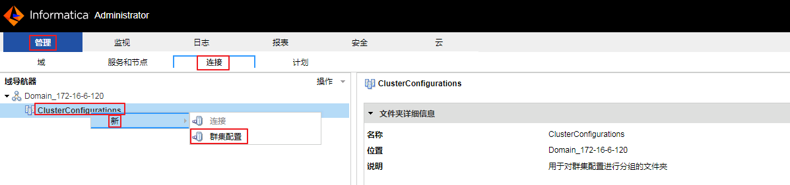

* “群集配置名称”自定义为 **FusionInsightHD**，“分发类型”选择 **Cloudera**，“导入群集配置的方法”选择 **从存档文件中导入**，上载配置存档文件选择`C:\ecotesting\hadoopConfig.zip`，勾选 **创建连接**，点击 **下一步**。

  

* 确认安装信息，点击 **完成**。

  

* 安装完成。

  

* 修改连接“HIVE_fusionginsighthd”以下共同属性。

  ```
  元数据连接字符串：jdbc:hive2://172.16.4.21:21066/default;saslQop=auth-conf;principal=hive/hadoop.hadoop.com@HADOOP.COM
  数据访问连接字符串：jdbc:hive2://172.16.4.21:21066/default;saslQop=auth-conf;principal=hive/hadoop.hadoop.com@HADOOP.COM
  HDFS上的Hive暂存目录：/user/hive/warehouse
  Hive暂存数据库名称：default
  ```
  >说明：如果需要向Hive写入数据，必须配置“HDFS上的Hive暂存目录”和“Hive暂存数据库名称”。

  

* 如果需要向Hive写入数据，必须将集成配置的 **hdfs_site_xml** 的 **dfs.client.failover.proxy.provider.hacluster** 的值修改为 **org.apache.hadoop.hdfs.server.namenode.ha.ConfiguredFailoverProxyProvider**。否则Mapping日志会返回类似“Class org.apache.hadoop.hdfs.server.namenode.ha.AdaptiveFailoverProxyProvider not found”的错误且写入失败。

  选择群集“FusionInsightHD”，点击 **hdfs_site_xml** 的编辑按钮，选中 **dfs.client.failover.proxy.provider.hacluster** 后点击 **编辑**，“覆盖的值”输入 **org.apache.hadoop.hdfs.server.namenode.ha.ConfiguredFailoverProxyProvider**，点击 **确定**。点击 **确定** 完成修改。

  

##### 创建Oracle连接

* 导航至`管理->连接`，右键“Domain_172-16-6-120”，选择`新->连接`。

  

* 选择 **Oracle**，点击 **确定**。

  

* “名称”和“ID”自定义为 **ORACLE**，“用户名”和“密码”都输入 **mdl_user**，点击 **下一步**。

  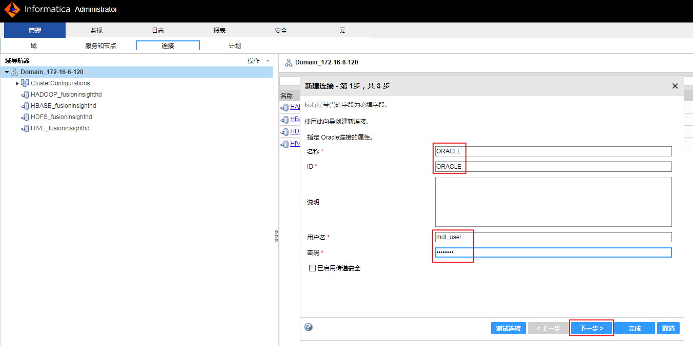

* “元数据访问属性”的“连接字符串”输入 **jdbc:informatica:oracle://172-16-6-120:1521;SID=orcl**，“数据访问属性”的“连接字符串”为 **orcl** 和 “代码页”选择 **UTF-8 encoding of Unicode**，点击 **下一步**。

  

* 点击 **测试连接** 返回 “连接测试成功”，点击 **完成**。

  

  

* 重启Informatica Server。关闭Informatica Server后，需要执行 **ps -ef | grep informatica** 检查所有的informatica进程都关闭后再启动Informatica Server。

  ```
  su - infa
  cd /opt/informatica/10.2.2/tomcat/bin
  ./infaservice.sh shutdown
  ps -ef | grep informatica
  ./infaservice.sh startup
  ```

  >说明:如果新建ORACLE连接后未重启过Informatica Server，在客户端Big Data Developer运行ORACLE关系型数据对象时，返回类似以下的错误：
  >
  >[LDTMCMN_0029] 由于以下错误，LDTM 无法完成请求: com.informatica.sdk.dtm.ExecutionException: [EdtmExec_00007] CMN_1022 Database driver error...
  >
  >CMN_1022 [Database driver event...Error occurred loading library [libclntsh.so.11.1: cannot open shared object file: No such file or directory]Database driver event...Error occurred loading library [libpmora8.so]]

##### 增加用户Administrator权限

* 导航至`安全->用户`，选中`用户->Native->Administrator`，点击`概览->编辑->组`，点击 **添加** 按钮将 **Operator** 添加至“分配的组” ，点击 **确定**。

  

  >说明：如果用户不属于Operator组，使用该用户执行mapping从连接中获取数据时，会返回类似于“没有针对连接 [ORACLE] (在域 [Domain_172-16-6-120] 中)的执行权限”的错误。
  >
  >

## 安装Big Data Developer客户端

### 操作场景

在Windows上安装Big Data Developer客户端。

### 前提条件

* 已完成准备工作。

* 已获取Informatica客户端安装包，例如：informatica_1022_client_winem-64t.zip。

### 操作步骤

#### 安装客户端

* 解压informatica_1022_client_winem-64t.zip后，双击 **install.bat**。选择`安装Informatica Developer版本10.2.2`，点击 **下一页**。

  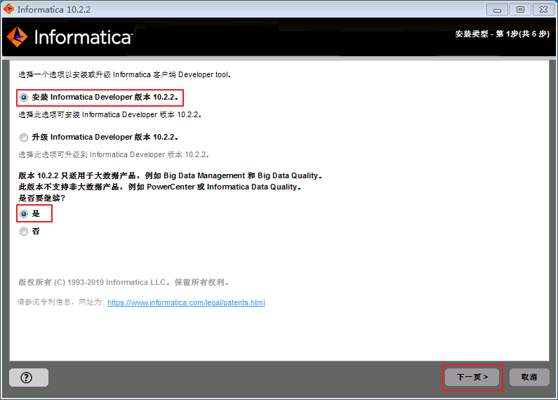

* 点击 **下一页**。

  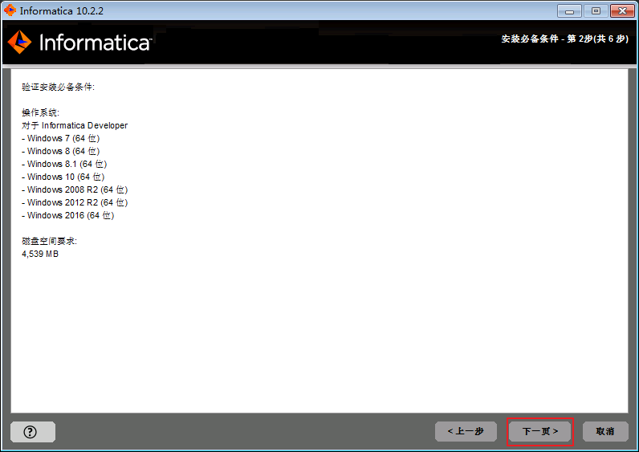

* 输入安装路径，默认安装路径为`C:\Informatica\10.2.2`，点击 **下一页**。

  

* 点击 **安装** 后等待安装完成。

  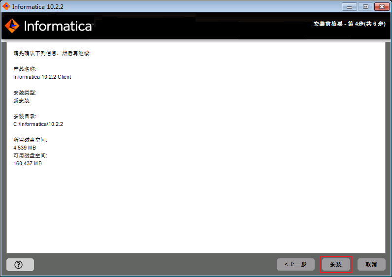

  

* 点击 **完成**。

  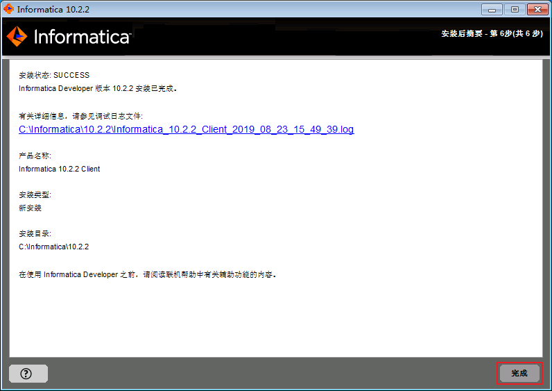

## Informatica BDM对接FusionInsight HD

### 操作场景

Informatica BDM对接FusionInsight HD的HDFS和Hive。通过Informatica的Big Data Developer客户端实现Oracle数据库与HDFS和Hive之间互相上传/下载数据、HDFS与Hive互相上传/下载数据、HDFS/Hive与本地之间互相上传下载数据。

### 前提条件

* 已安装Informatica服务端和Big Data Developer客户端。

* 已将FusionInsight集群的节点主机名与IP的映射关系加入到Informatica Server安装节点的`/etc/hosts`文件中。

  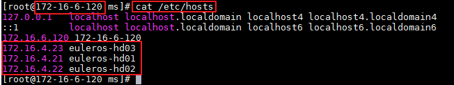

* 安装Infomatica服务端节点的时间与FusionInsight HD集群的时间要保持一致，时间差小于5分钟。

* 准备数据。

    * **本地**

      登录Informatica Server安装节点，在`/tmp`目录下创建文件 **user_local_to_hdfs.csv**，操作命令如下。并且将 **user_local_to_hdfs.csv** 拷贝至安装Big Data Developer客户端的window系统，例如`C:\`目录下。

      ```
      su - infa
      cd /tmp
      vi user_local_to_hdfs.csv
      ```

      

       **user_local_to_hdfs.csv文件内容如下所示：**

      ```
      id,name
      10,Andy-in-local
      11,Benny-in-local
      12,Tom-in-local
      ```

  * **HDFS文件系统**

    登录FusionInsight集群客户端，执行以下命令在HDFS文件系统的`/tmp`目录创建两个文件分别命名为 **user_hdfs_to_oracle.csv** 和 **user_hdfs_to_hive.csv**。

    ```
    cd /opt
    vi user_hdfs_to_oracle.csv
    vi user_hdfs_to_hive.csv
    hdfs dfs -put user_hdfs_to_* /tmp
    ```

    **user_hdfs_to_oracle.csv文件内容如下所示：**

    ```
    id,name
    20,Andy-in-hdfs
    21,Benny-in-hdfs
    22,Tom-in-hdfs
    ```

    **user_hdfs_to_hive.csv文件内容如下所示：**

    ```
    id,name
    30,Andy-in-hdfs
    31,Benny-in-hdfs
    32,Tom-in-hdfs
    ```  

  * **Hive数据库**

    登录FusionInsight集群客户端，使用beeline客户端创建两个表分别命名为 **user_hive_in** 和 **user_hive_out**。

    **创建user_hive_in表示例如下：**

    ```
    CREATE TABLE IF NOT EXISTS user_hive_in(id INT, name STRING);
    ```

    **创建user_hive_out表示例如下：**

    ```
    CREATE TABLE IF NOT EXISTS user_hive_out(id INT, name STRING);
    INSERT INTO user_hive_out VALUES (40,'Andy-in-hive');
    INSERT INTO user_hive_out VALUES (41,'Benny-in-hive');
    INSERT INTO user_hive_out VALUES (42,'Tom-in-hive');
    ```

  * **Oracle数据库**

    登录安装Informatica Server节点，Oracle数据库用户mdl_user使用sqlplus客户端创建两个表分别命名为 **user_oracle_in** 和 **user_oracle_out**。

    ```
    su - oracle
    sqlplus mdl_user/mdl_user
    ```

    **创建user_oracle_in表示例如下：**

    ```
    CREATE TABLE user_oracle_in(ID INTEGER PRIMARY KEY,NAME VARCHAR2(30));
    ```

    **创建user_oracle_out表示例如下：**

    ```
    CREATE TABLE user_oracle_out(ID INTEGER PRIMARY KEY,NAME VARCHAR2(30));
    INSERT INTO user_oracle_out VALUES (50,'Andy-in-oracle');
    INSERT INTO user_oracle_out VALUES (51,'Benny-in-oracle');
    INSERT INTO user_oracle_out VALUES (52,'Tom-in-oracle');
    ```

### 操作步骤

#### 建立项目

* 打开 **Big Data Developer**，点击 **文件->连接到存储库**。

  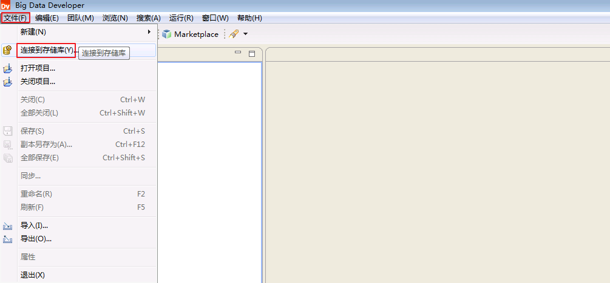

* 点击 **配置域**， 点击 **添加**，“域名”输入自定义名称为 **Domain_172-16-6-120**，“主机名”输入Informatica Server安装节点对应的主机名 **172-16-6-120**，“端口号”输入安装Informatica Server时指定的端口 **6005**，点击 **测试连接**，返回“连接成功”则表示主机名为172-16-6-120的域可用。点击 **确定** 并 **完成**。

  

* 点击 **浏览**，选择 **Domain_172-16-6-120.Model_Repository_Service**，点击 **下一步**。

  

* 输入“用户名”为 **Administrator**，“密码”为 **Huawei@123**，点击 **完成**。

  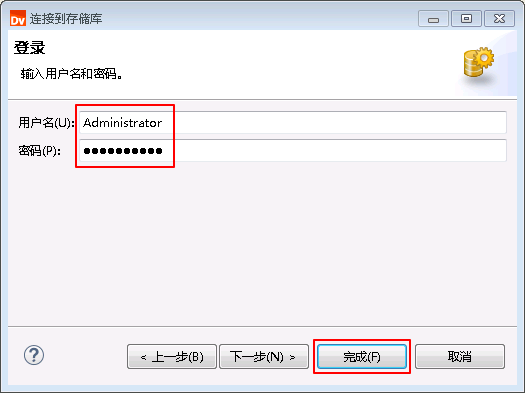

* 在“对象浏览器”下显示连接成功的存储库 **Model_Repository_Service （Administrator）**。

  

* 右键 **Model_Repository_Service （Administrator）** 选择 **新建->项目**。

  

* “名称”输入输入自定义名称 **fi_project**，点击 **下一步**。

  

* 点击 **完成**。

  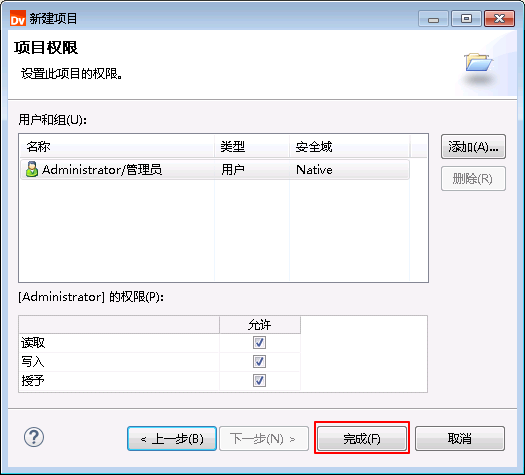

#### 创建关系数据对象

##### 创建关系数据对象 - Oracle

  * 右键 **fi_project**，选择 **新建->数据对象**。

    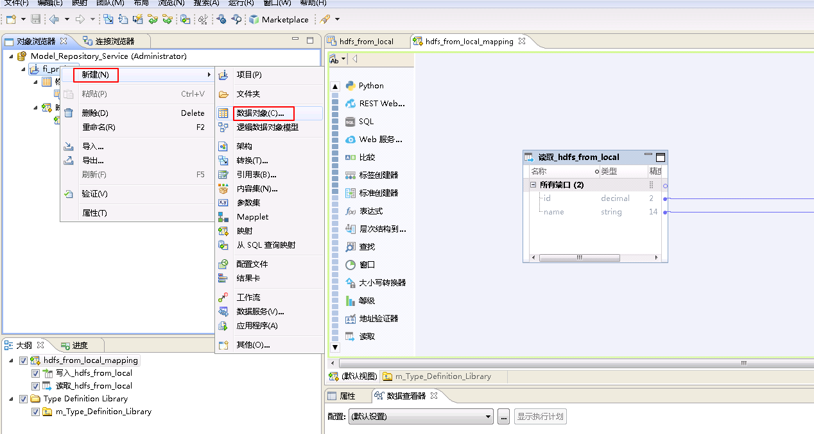

  * 选择 **关系数据对象**，点击 **下一步**。

    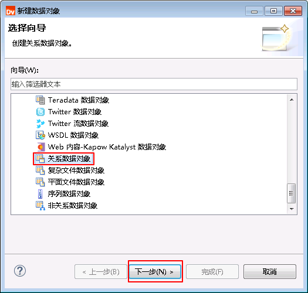

  * 点击“连接”的 **浏览** 按钮，选择连接 **ORACLE**。选择 **从现有资源创建数据对象**，点击“资源”的 **浏览** 按钮选择表 **USER_ORACLE_IN** 和 **USER_ORACLE_OUT**。点击 **完成**。

    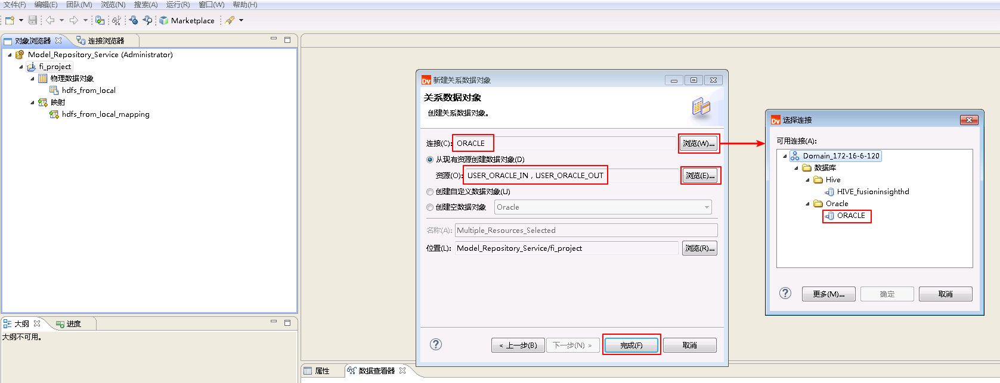

    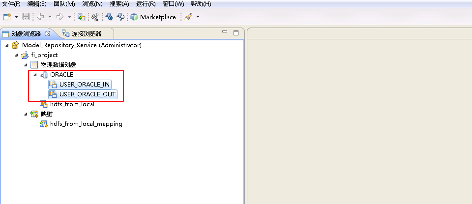

##### 创建关系数据对象 - Hive

  * 右键 **fi_project**，选择 **新建->数据对象**。

    

  * 选择 **关系数据对象**，点击 **下一步**。

    

  * 点击“连接”的 **浏览** 按钮，选择连接 **HIVE_fusionginsighthd**。选择 **从现有资源创建数据对象**，点击“资源”的 **浏览** 按钮选择表 **user_hive_in** 和 **user_hive_out**。点击 **完成**。

    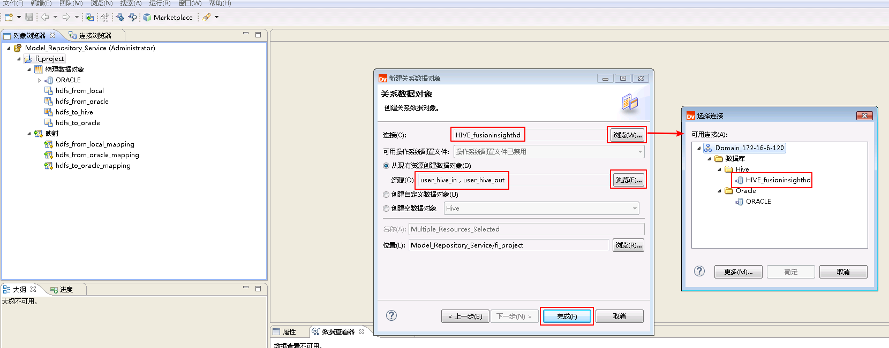

    

#### Informatica BDM对接FusionInsight HDFS

##### HDFS from Local

将安装Informatica Server节点的本地文件`/tmp/user_local_to_hdfs.csv`上传至FusionInsight HD的HDFS文件系统并命名为user_hdfs_from_local.csv。

* 右键 **fi_project**，选择 **新建->数据对象**。

  

* 选择 **平面文件数据对象**，点击 **下一步**。

  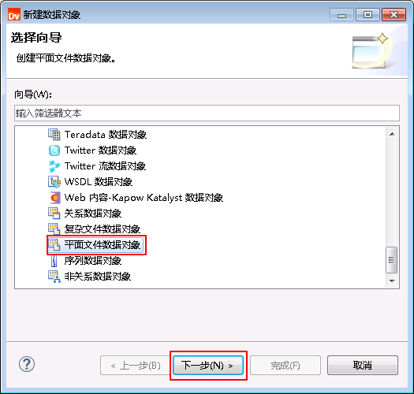

* 选择 **从现有平面文件创建** 并点击 **浏览** 选择 `C:\user_local_to_hdfs.csv`，“名称”自定义为 **hdfs_from_local**，点击 **下一步**。

  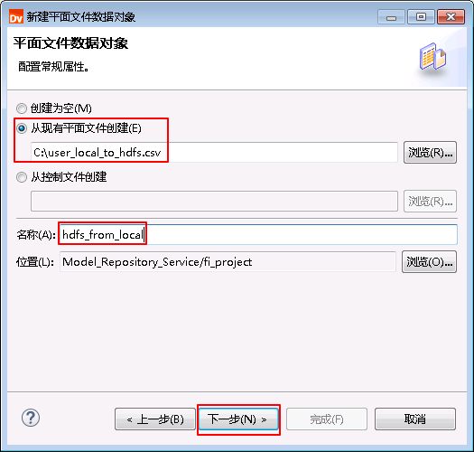

* “格式”选择 **带分隔符**，点击 **下一步**。

  

* “分隔符”选择 **逗号**，勾选 **导入第一行中的列名称**，其余保持默认选项，点击 **完成**。

  

* 选择数据对象 **hdfs_from_local**，设置 **高级** 属性后保存。

  设置 **运行时：读取** 的属性。“源文件名”为 **user_local_to_hdfs.csv**，“源文件目录” 为 **/tmp/**。

  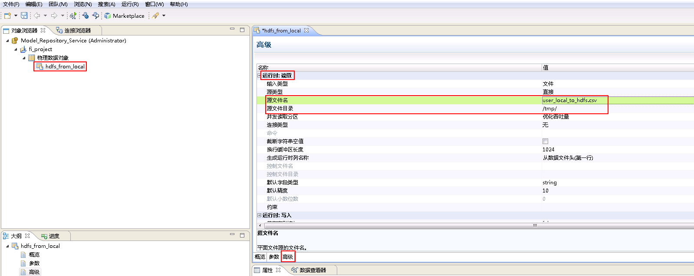

  设置 **运行时：写入** 的属性。“输出文件目录” 为 **/tmp/**，“输出文件名”为 **user_hdfs_from_local.csv**，“连接类型”选择 **Hadoop文件系统**，“连接名称”点击 **浏览** 选择 **HDFS_fusioninsighthd**。“Ctrl+s”保存。

  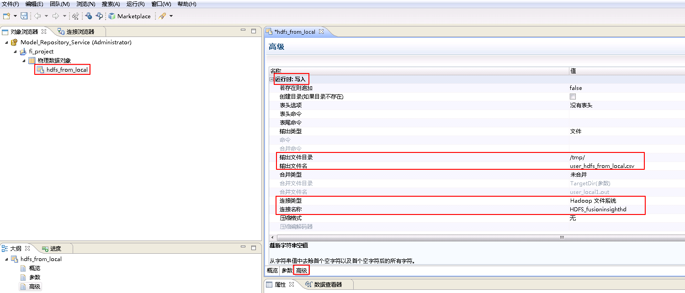

* 右键 **fi_project**，选择 **新建->映射**。

  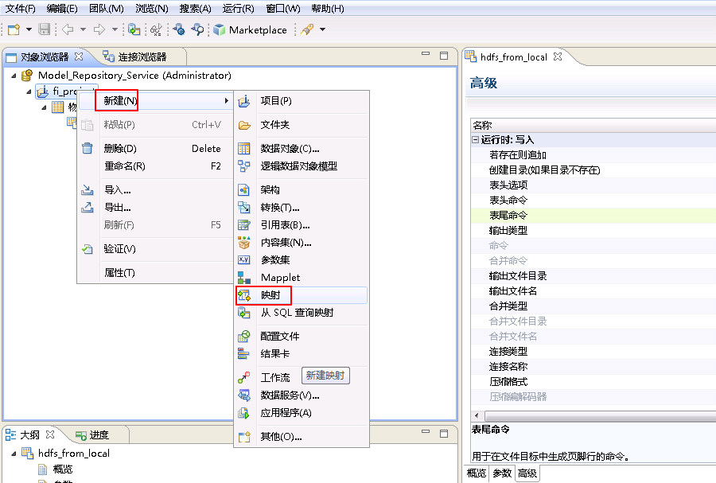

* “名称”自定义为 **hdfs_from_local_mapping**，点击 **完成**。

  

* 将“物理数据对象” **hdfs_from_local** 拖曳至“映射” **hdfs_from_local_mapping** 的 **默认视图** 中，并选择为 **读取**。

  

* 类似地将“物理数据对象” **hdfs_from_local** 拖曳至“映射” **hdfs_from_local_mapping** 的 **默认视图** 中，并选择为 **写入**。点击mapping的空白处确认 **属性->运行时->验证环境** 为 **本地**。

  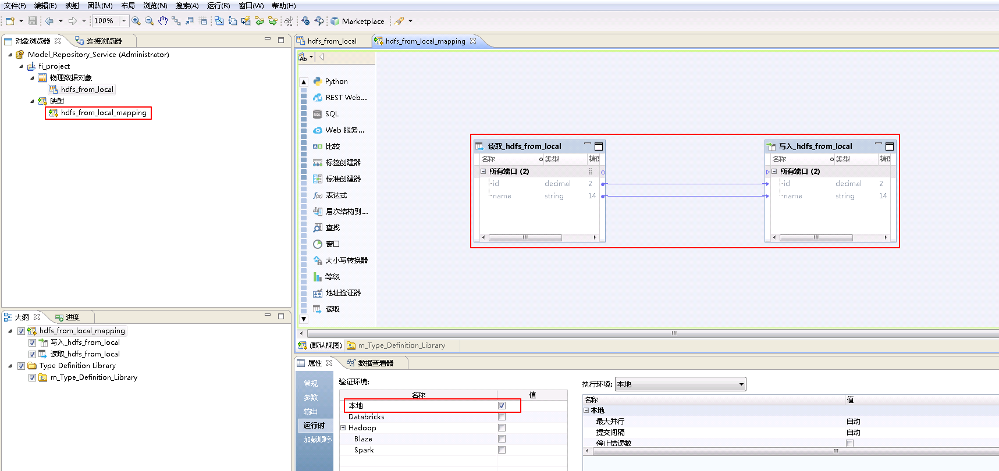

* 右键mapping的空白处，选择 **运行映射**。

  

* mapping运行成功之后，登录FusionInsight集群客户端，执行 `hdfs dfs -cat /tmp/user_hdfs_from_local.csv`查看mapping产生的文件“user_hdfs_from_local.csv”。

  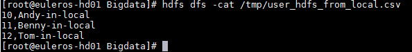

  >说明：如果mapping运行完成之后，没有写入数据或者mapping运行失败等，可以在Informatica Server安装节点查看mapping的运行日志。路径为$INFA_HOME/logs/node01_172-16-6-120/services/DataIntegrationService/disLogs/ms

##### HDFS from Oracle

获取Oracle数据库表USER_ORACLE_OUT的数据上传至FusionInsight HD的HDFS文件系统并命名为user_hdfs_from_oracle.csv。

* 参考创建“平面文件数据对象” **hdfs_from_local** 的操作步骤，创建“平面文件数据对象” **hdfs_from_oracle**。

  **hdfs_from_oracle**的 **高级** 属性中，不需要设置 **运行时：读取** 的相关参数。设置 **运行时：写入** 的属性：“输出文件目录” 为 **/tmp/**，“输出文件名”为 **user_hdfs_from_oracle.csv**，“连接类型”选择 **Hadoop文件系统**，“连接名称”点击 **浏览** 选择 **HDFS_fusioninsighthd**。“Ctrl+s”保存。

  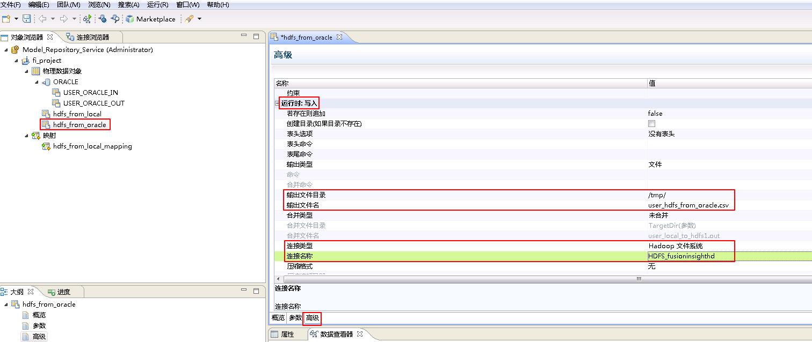

* 右键 **fi_project**，选择 **新建->映射**。

  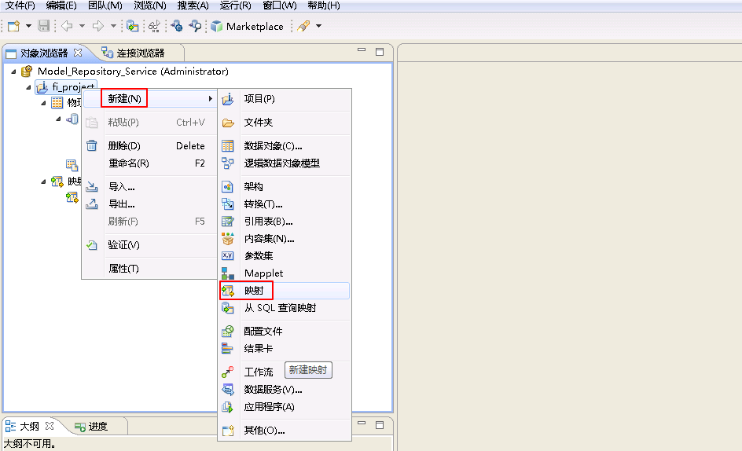

* “名称”自定义为 **hdfs_from_oracle_mapping**，点击 **完成**。

  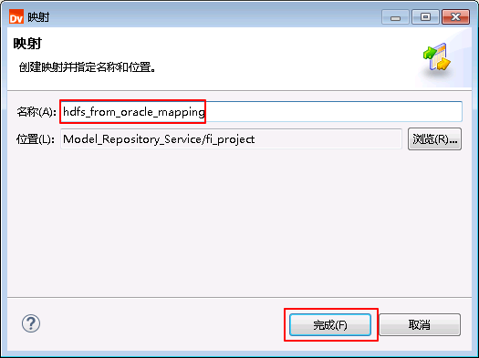

* “hdfs_from_oracle_mapping”的配置如下：

  将“物理数据对象” **ORACLE->USER_ORACLE_OUT** 拖曳至 **默认视图** 中，并选择为 **读取**。

  将“物理数据对象” **hdfs_from_oracle** 拖曳至 **默认视图** 中，并选择为 **写入**。

  将“读取_USER_ORACLE_OUT”和“写入_hdfs_from_oracle”对应的列连线。

  点击mapping的空白处确认 **属性->运行时->验证环境** 为 **本地**。

  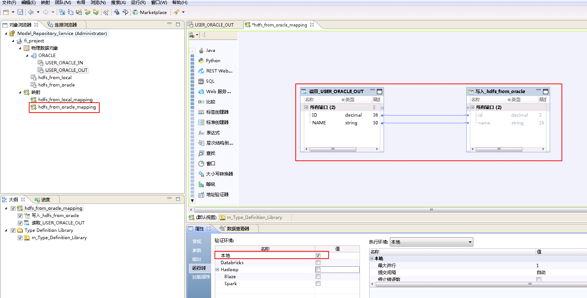

* 右键mapping的空白处，选择 **运行映射**。

  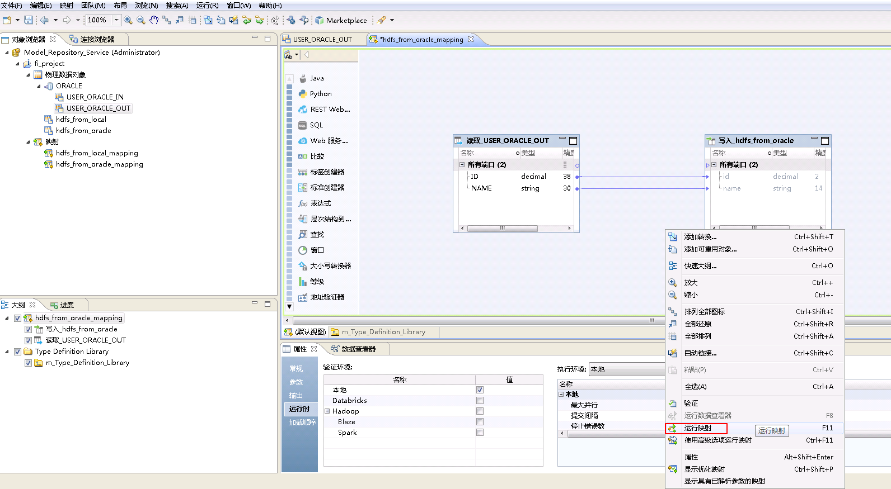

* mapping运行成功之后，登录FusionInsight集群客户端，执行 `hdfs dfs -cat /tmp/user_hdfs_from_oracle.csv`查看mapping产生的文件“user_hdfs_from_oracle.csv”。

  

  >说明：如果mapping运行完成之后，没有写入数据或者mapping运行失败等，可以在Informatica Server安装节点查看mapping的运行日志。路径为$INFA_HOME/logs/node01_172-16-6-120/services/DataIntegrationService/disLogs/ms

##### HDFS to Oracle

将FusionInsight HD的HDFS系统文件user_hdfs_to_oracle.csv数据上传至Oracle数据库表USER_ORACLE_IN。

* 参考创建“平面文件数据对象” **hdfs_from_local** 的操作步骤，创建“平面文件数据对象” **hdfs_to_oracle**。

  **hdfs_to_oracle**的 **高级** 属性中，不需要设置 **运行时：写入** 的相关参数。设置 **运行时：读取** 的属性：“源文件名”为 **user_hdfs_to_oracle.csv**，“源文件目录” 为 **/tmp/**，“连接类型”选择 **Hadoop文件系统**，“连接名称”点击 **浏览** 选择 **HDFS_fusioninsighthd**。

  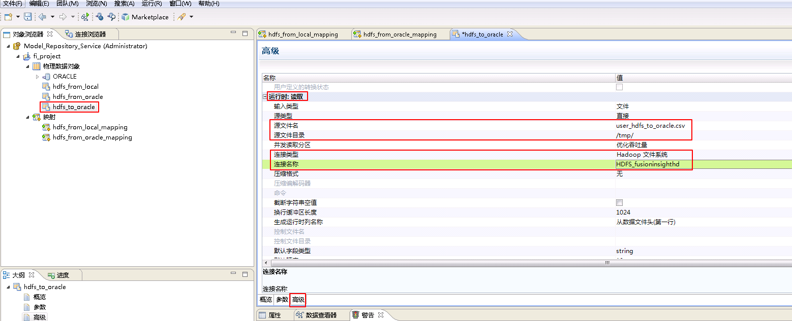

* 右键 **fi_project**，选择 **新建->映射**。

  

* “名称”自定义为 **hdfs_to_oracle_mapping**，点击 **完成**。

  

* “hdfs_to_oracle_mapping”的配置如下：

  将“物理数据对象” **hdfs_to_oracle** 拖曳至 **默认视图** 中，并选择为 **读取**。

  将“物理数据对象” **ORACLE->USER_ORACLE_IN** 拖曳至 **默认视图** 中，并选择为 **写入**。

  将“读取_hdfs_to_oracle”和“写入_USER_ORACLE_IN”对应的列连线。

  点击mapping的空白处确认 **属性->运行时->验证环境** 为 **本地**。

  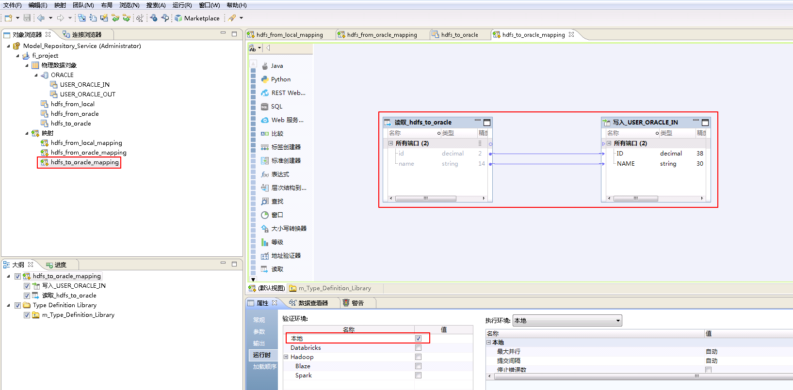

* 右键mapping的空白处，选择 **运行映射**。

  

* mapping运行成功之后，登录安装Informatica Server节点，Oracle数据库用户mdl_user使用sqlplus客户端查询表“USER_ORACLE_IN”数据。

  ```
  su - oracle
  sqlplus mdl_user/mdl_user
  select * from USER_ORACLE_IN;
  ```

  

  >说明：如果mapping运行完成之后，没有写入数据或者mapping运行失败等，可以在Informatica Server安装节点查看mapping的运行日志。路径为$INFA_HOME/logs/node01_172-16-6-120/services/DataIntegrationService/disLogs/ms

##### HDFS to Hive

将FusionInsight HD的HDFS系统文件user_hdfs_to_hive.csv数据上传至Hive数据库表user_hive_in。

* 参考创建“平面文件数据对象” **hdfs_from_local** 的操作步骤，创建“平面文件数据对象” **hdfs_to_hive**。

  **hdfs_to_hive**的 **高级** 属性中，不需要设置 **运行时：写入** 的相关参数。设置 **运行时：读取** 的属性：“源文件名”为 **user_hdfs_to_hive.csv**，“源文件目录” 为 **/tmp/**，“连接类型”选择 **Hadoop文件系统**，“连接名称”点击 **浏览** 选择 **HDFS_fusioninsighthd**。

  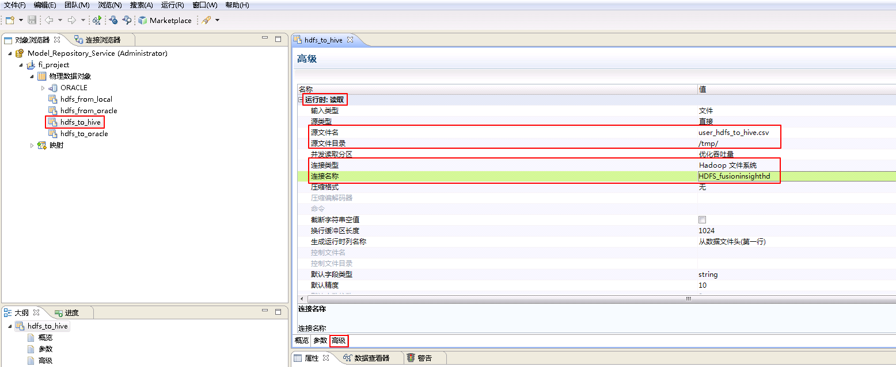

* 右键 **fi_project**，选择 **新建->映射**。

  

* “名称”自定义为 **hdfs_to_hive_mapping**，点击 **完成**。

  

* “hdfs_to_hive_mapping”的配置如下：

  将“物理数据对象” **hdfs_to_hive** 拖曳至 **默认视图** 中，并选择为 **读取**。

  将“物理数据对象” **HIVE_fusionginsighthd->user_hive_in** 拖曳至 **默认视图** 中，并选择为 **写入**。

  将“读取_hdfs_to_hive”和“写入_user_hive_in”对应的列连线。

  点击mapping的空白处确认 **属性->运行时->验证环境** 为 **本地**。

  

* 右键mapping的空白处，选择 **运行映射**。

  

* mapping运行成功之后，登录FusionInsight集群客户端，使用beeline客户端查询表 **user_hive_in** 数据。

  ```
  beeline
  select * from user_hive_in;
  ```

  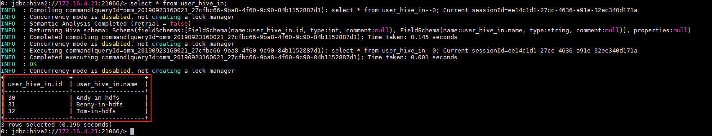

  >说明：如果mapping运行完成之后，没有写入数据或者mapping运行失败等，可以在Informatica Server安装节点查看mapping的运行日志。路径为$INFA_HOME/logs/node01_172-16-6-120/services/DataIntegrationService/disLogs/ms

#### Informatica BDM对接FusionInsight Hive

##### Hive to Local

将FusionInsight HD的Hive数据库表user_hive_out数据下载至安装Informatica Server节点的本地文件`/tmp/user_local_from_hive.csv`。

* 参考创建“平面文件数据对象” **hdfs_from_local** 的操作步骤，创建“平面文件数据对象” **hive_to_local**。

  **hive_to_local**的 **高级** 属性中，不需要设置 **运行时：读取** 的相关参数。设置 **运行时：写入** 的属性：“输出文件目录” 为 **/tmp/**，“输出文件名”为 **user_local_from_hive.csv**。

  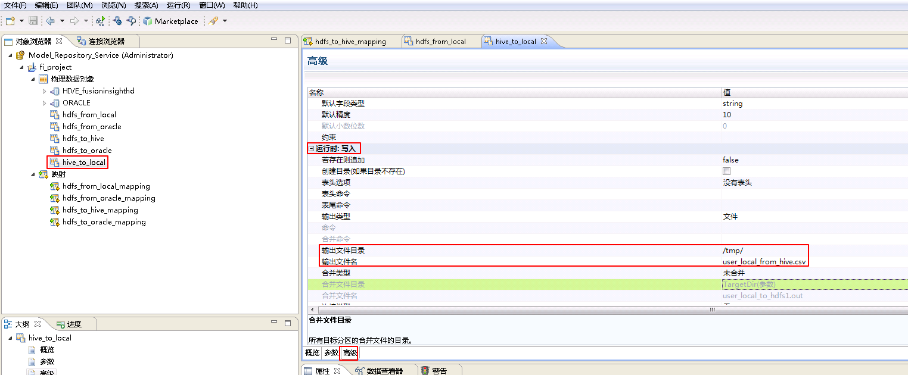

* 右键 **fi_project**，选择 **新建->映射**。

  

* “名称”自定义为 **hive_to_local_mapping**，点击 **完成**。

  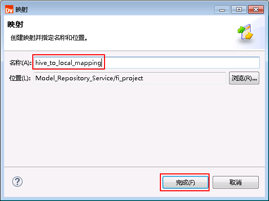

* “hive_to_local_mapping”的配置如下：

  将“物理数据对象” **HIVE_fusionginsighthd->user_hive_out** 拖曳至 **默认视图** 中，并选择为 **读取**。

  将“物理数据对象” **hive_to_local** 拖曳至 **默认视图** 中，并选择为 **写入**。

  将“读取_user_hive_out”和“写入_hive_to_local”对应的列连线。

  点击mapping的空白处确认 **属性->运行时->验证环境** 为 **本地**。

  

* 右键mapping的空白处，选择 **运行映射**。

  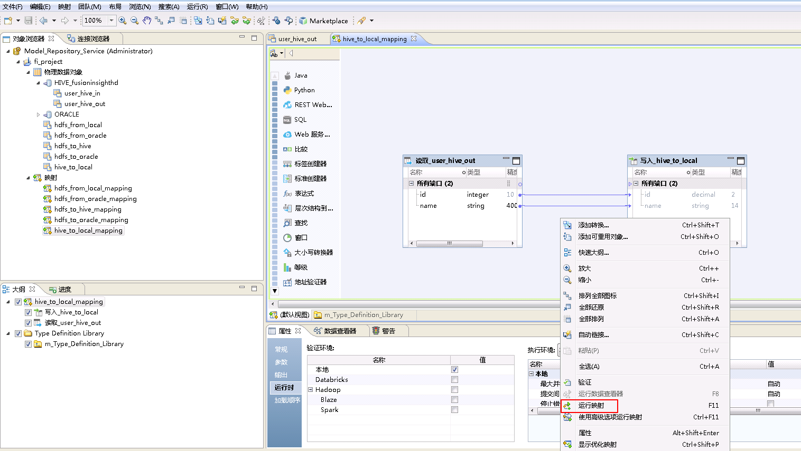

* mapping运行成功之后，登录Informatica Server安装节点，查看文件`/tmp/user_local_from_hive.csv`。

  ```
  cat /tmp/user_local_from_hive.csv
  ```

  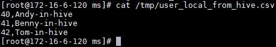

  >说明：如果mapping运行完成之后，没有写入数据或者mapping运行失败等，可以在Informatica Server安装节点查看mapping的运行日志。路径为$INFA_HOME/logs/node01_172-16-6-120/services/DataIntegrationService/disLogs/ms

##### Hive to Oracle

将FusionInsight HD的Hive数据库表user_hive_out数据上传至Oracle数据库表USER_ORACLE_IN。

* 右键 **fi_project**，选择 **新建->映射**。

  

* “名称”自定义为 **hive_to_oracle_mapping**，点击 **完成**。

  

* “hive_to_oracle_mapping”的配置如下：

  将“物理数据对象” **HIVE_fusionginsighthd->user_hive_out** 拖曳至 **默认视图** 中，并选择为 **读取**。

  将“物理数据对象” **ORACLE->USER_ORACLE_IN** 拖曳至 **默认视图** 中，并选择为 **写入**。

  将“读取_user_hive_out”和“写入_USER_ORACLE_IN”对应的列连线。

  点击mapping的空白处确认 **属性->运行时->验证环境** 为 **本地**。

  

* 右键mapping的空白处，选择 **运行映射**。

  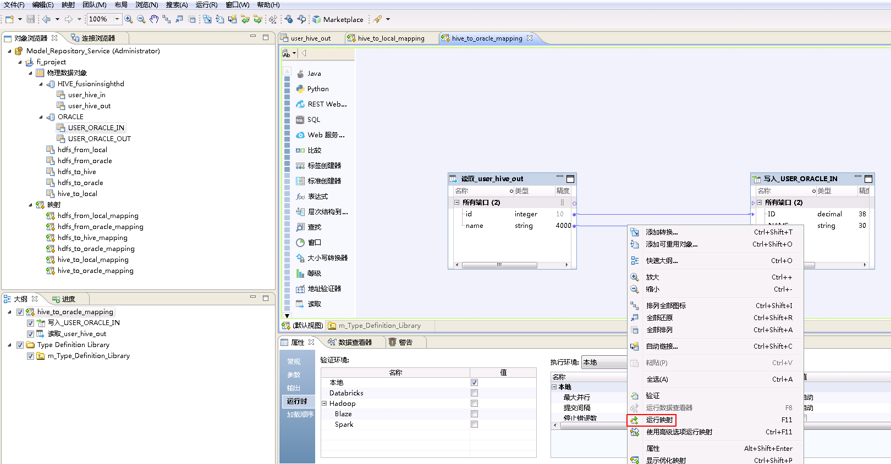

* mapping运行成功之后，登录安装Informatica Server节点，Oracle数据库用户mdl_user使用sqlplus客户端查询表“USER_ORACLE_IN”数据。

  ```
  su - oracle
  sqlplus mdl_user/mdl_user
  select * from USER_ORACLE_IN;
  ```

  

  >说明：如果mapping运行完成之后，没有写入数据或者mapping运行失败等，可以在Informatica Server安装节点查看mapping的运行日志。路径为$INFA_HOME/logs/node01_172-16-6-120/services/DataIntegrationService/disLogs/ms

##### Hive from Oracle

获取Oracle数据库表USER_ORACLE_OUT的数据上传至FusionInsight HD的Hive数据库表user_hive_in。

* 右键 **fi_project**，选择 **新建->映射**。

  

* “名称”自定义为 **hive_from_oracle_mapping**，点击 **完成**。

  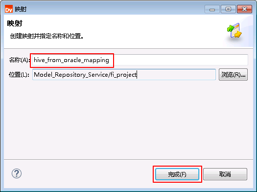

* “hive_from_oracle_mapping”的配置如下：

  将“物理数据对象” **ORACLE->USER_ORACLE_OUT** 拖曳至 **默认视图** 中，并选择为 **读取**。

  将“物理数据对象” **HIVE_fusionginsighthd->user_hive_in** 拖曳至 **默认视图** 中，并选择为 **写入**。

  将“读取_USER_ORACLE_OUT”和“写入_user_hive_in”对应的列连线。

  点击mapping的空白处确认 **属性->运行时->验证环境** 为 **本地**。

  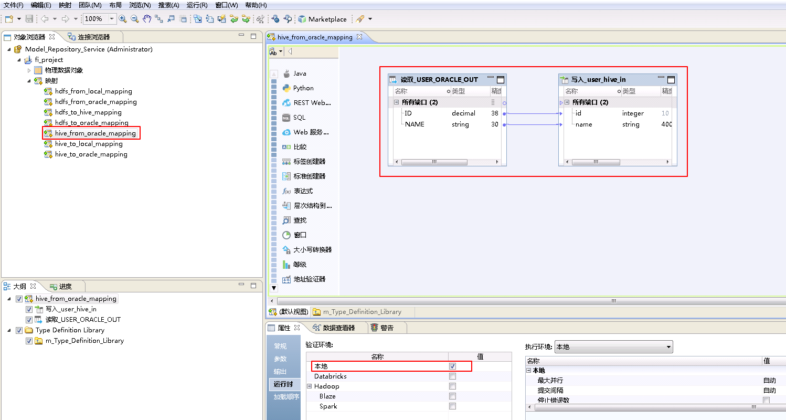

* 右键mapping的空白处，选择 **运行映射**。

  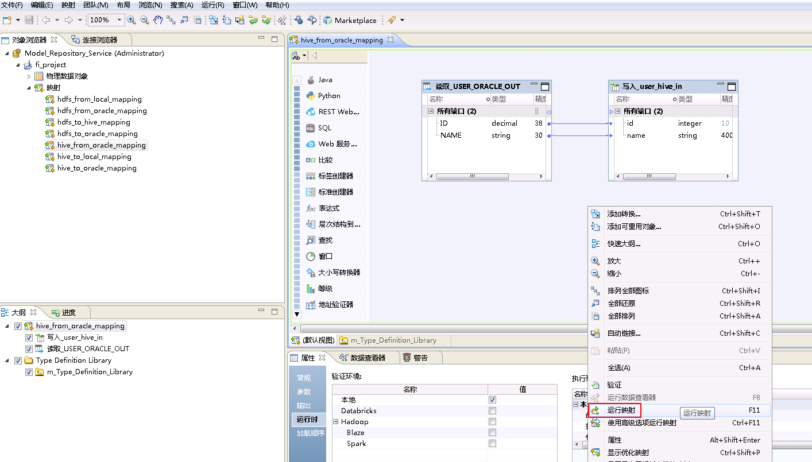

* mapping运行成功之后，登录FusionInsight集群客户端，使用beeline客户端查询表 **user_hive_in** 数据。

  ```
  beeline
  select * from user_hive_in;
  ```

  

  >说明：如果mapping运行完成之后，没有写入数据或者mapping运行失败等，可以在Informatica Server安装节点查看mapping的运行日志。路径为$INFA_HOME/logs/node01_172-16-6-120/services/DataIntegrationService/disLogs/ms

##### Hive to HDFS

将FusionInsight HD的Hive数据库表user_hive_out数据下载至HDFS文件系统的`/tmp/user_hdfs_from_hive.csv`。

* 参考创建“平面文件数据对象” **hdfs_from_local** 的操作步骤，创建“平面文件数据对象” **hive_to_hdfs**。

  **hive_to_hdfs**的 **高级** 属性中，不需要设置 **运行时：读取** 的相关参数。设置 **运行时：写入** 的属性：“输出文件目录” 为 **/tmp/**，“输出文件名”为 **user_hdfs_from_hive.csv**，“连接类型”选择 **Hadoop文件系统**，“连接名称”点击 **浏览** 选择 **HDFS_fusioninsighthd**。

  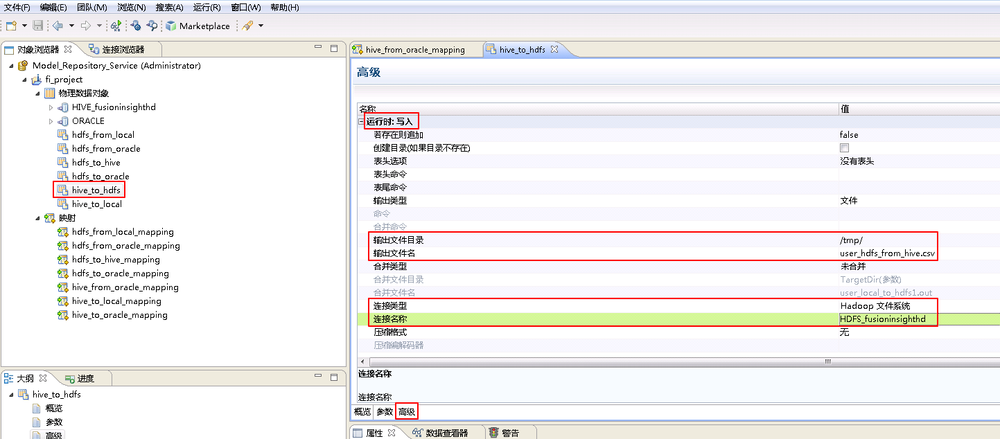

* 右键 **fi_project**，选择 **新建->映射**。

  

* “名称”自定义为 **hive_to_hdfs_mapping**，点击 **完成**。

  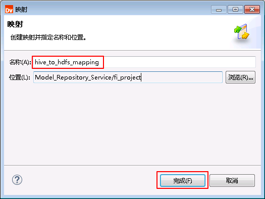

* “hive_to_hdfs_mapping”的配置如下：

  将“物理数据对象” **HIVE_fusionginsighthd->user_hive_out** 拖曳至 **默认视图** 中，并选择为 **读取**。

  将“物理数据对象” **hive_to_hdfs** 拖曳至 **默认视图** 中，并选择为 **写入**。

  将“读取_user_hive_out”和“写入_hive_to_hdfs”对应的列连线。

  点击mapping的空白处确认 **属性->运行时->验证环境** 为 **本地**。

  

* 右键mapping的空白处，选择 **运行映射**。

  

* mapping运行成功之后，登录FusionInsight集群客户端，执行 `hdfs dfs -cat /tmp/user_hdfs_from_hive.csv`查看mapping产生的文件“user_hdfs_from_hive.csv”。

  ```
  cat /tmp/user_hdfs_from_hive.csv
  ```

  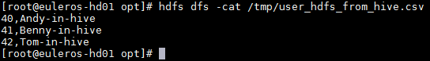

  >说明：如果mapping运行完成之后，没有写入数据或者mapping运行失败等，可以在Informatica Server安装节点查看mapping的运行日志。路径为$INFA_HOME/logs/node01_172-16-6-120/services/DataIntegrationService/disLogs/ms

## FAQ

  * **执行./infaservice.sh startup启动Infomatica Server时，返回ERROR: Node configuration file not accessible or invalid。**

    **【问题描述】**

    在执行./infaservice.sh startup启动infomatica server时，返回ERROR: Node configuration file not accessible or invalid。

    

    或者在$INFA_HOME/tomcat/bin目录执行./startup.sh启动tomcat后，没查询到java进程，在$INFA_HOME/tomcat/logs/catalina.out返回错误java.io.FileNotFoundException: null/isp/config/nodemeta.xml (No such file or directory)。

    

    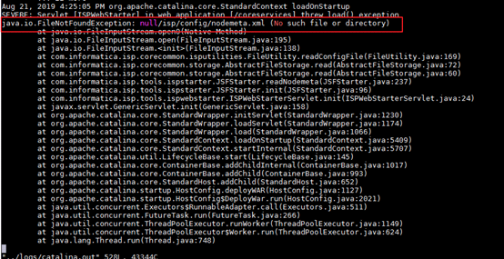

    **【解决方法】**

    问题原因：$INFA_HOME/isp/config/nodemeta.xml的所有者和所属组不正确。infa用户无法获取到nodemeta.xml。

    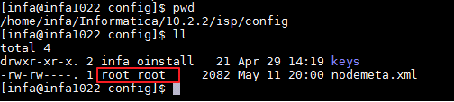

    root用户登录并切换至`$INFA_HOME/isp/config/`，执行 **chown -R infa:oinstall nodemeta.xml** 修改nodemeta.xml所有者为infa和所属用户组为oinstall。建议执行 **chown -R infa:oinstall /opt/informatica/10.2.2/** 修改Informatica Server所有文件的所有者为infa和所属用户组为oinstall。

    

* **向Hive数据库写入数据失败**

  **【问题描述】**

  运行mapping向Hive数据库的某一张表写入数据，查询目标表时，没有数据写入。

  **【解决方法】**

  如果向Hive表写入数据，确认以下两点是否已配置：

  * 配置HIVE连接以下两个属性的值：“HDFS上的Hive暂存目录”设置为 **/user/hive/warehouse**，“Hive暂存数据库名称”设置为 **default**。

    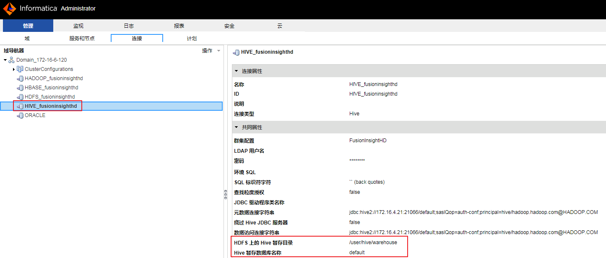

  * 将集成配置的 **hdfs_site_xml** 的 **dfs.client.failover.proxy.provider.hacluster** 的值修改为 **org.apache.hadoop.hdfs.server.namenode.ha.ConfiguredFailoverProxyProvider**。

    选择群集“FusionInsightHD”，点击 **hdfs_site_xml** 的编辑按钮，选中 **dfs.client.failover.proxy.provider.hacluster** 后点击 **编辑**，“覆盖的值”输入 **org.apache.hadoop.hdfs.server.namenode.ha.ConfiguredFailoverProxyProvider**，点击 **确定**。点击 **确定** 完成修改。

    
