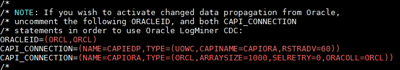
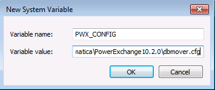
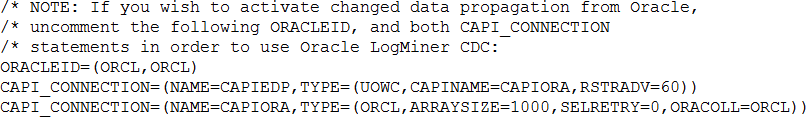
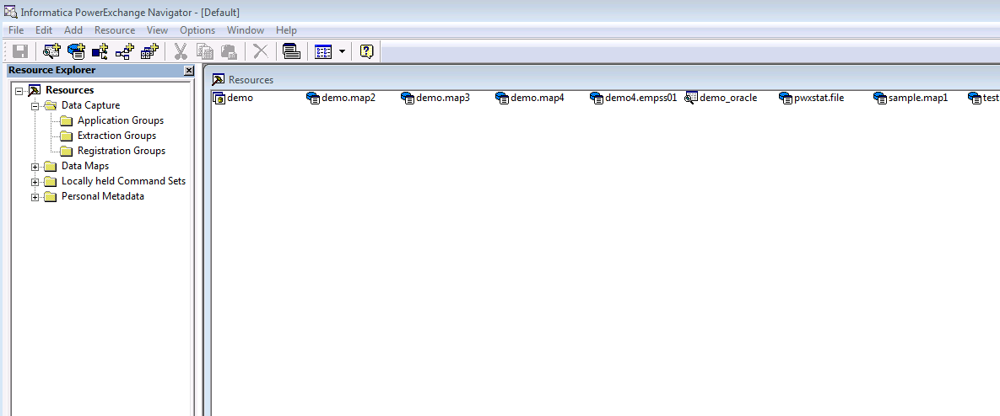
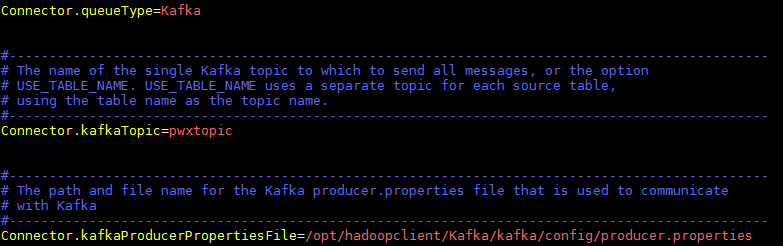

# Connection Instruction Between Informatica PowerExchange CDC and FusionInsight

## Succeeded Case

> Informatica PowerexChange CDC 10.2.0 <--> FusionInsight HD 6.5

## Environment Information

* Informatica PowerExchange CDC 10.2.0 Linux & Windows version
* Informatica PowerExchange Publisher 1.2.0
* Oracle database 11g
* jdk-7u71-linux-x64.rpm
* FusionInsight HD Kafka client

## Architecture
* A data source, oracle database
* One Linux machine, installed with Informatica PWX CDC, start the listener and logger service, then install the PWX Publisher which can transfer the log data captured by PWX CDC to the kafka topic.
* One Linux machine, installed with FusionInsight HD Kafka client, consume the data transferred from PWX Publisher
* (optional) One Windows machine, installed with PWX CDC, start the listener service, use navigator to see the data captured by PWX CDC.

### database configuration
      >This part can refer to the Informatica PowerExchange CDC user guide
      https://docs.informatica.com/data-integration/powerexchange-for-cdc-and-mainframe/10-2/_cdc-guide-for-linux-unix-and-windows_powerexchange-for-cdc-and-mainframe_10-2_ditamap/powerexchange_cdc_data_sources_1/oracle_cdc_with_logminer.html

  * login to the system as oracle user, use Sqlplus / as sysdba login to Oracle database, open Archive Log:
    ```sql
    SHUTDOWN IMMEDIATE;
    STARTUP MOUNT;
    ALTER DATABASE ARCHIVELOG;
    ALTER DATABASE OPEN;
    SHUTDOWN IMMEDIATE:
    STARTUP;
    archive log list;
    ```
    >Tips:Back up your database after both SHUTDOWN commands..

  * Set Up Oracle Minimal Global Supplemental Logging
    ```sql
    SELECT supplemental_log_data_min, force_logging FROM v$database;
    alter database add supplemental log data;
    alter database force logging;
    ALTER SYSTEM switch logfile;
    ```

  <!-- 创建LogMiner使用的表空间
     ```sql
     CREATE TABLESPACE "LOGMNRTS"
     NOLOGGING
     DATAFILE
     '/u01/app/oracle/oradata/orcl/LOGMNRTS.dbf' SIZE
     50M REUSE AUTOEXTEND
     ON NEXT  10M MAXSIZE  100M EXTENT MANAGEMENT LOCAL;

     EXECUTE SYS.DBMS_LOGMNR_D.SET_TABLESPACE('LOGMNRTS');
     ALTER PACKAGE SYS.DBMS_LOGMNR_D COMPILE BODY;
     ```
     -->

  * Copy the Oracle Catalog to the Archived Logs
    ```
      EXECUTE SYS.DBMS_LOGMNR_D.BUILD(options => sys.dbms_logmnr_d.store_in_redo_logs);
    ```
  * Define a CDC User and Grant User Privileges

    

  * create a test table and insert some data

    


## Install Informatica PWX CDC & PWX Publisher

### Install Informatica PWX CDC in Linux

  * Get the installation package `pwx1020_linux_em64t.tar`.
  * untar the package and run `./install.sh`, configure the installation path here is `/opt/PowerExchange/10.2.0`.

## Configure the environment

  * open environment file
      ```
      vi ~/.bash_profile
      ```
      add the following configuration

      ```
        export PWX_CONFIG=/opt/PowerExchange10.2.0/dbmover.cfg
        export PWX_HOME=/opt/PowerExchange10.2.0
        PATH=$PATH:$HOME/bin:/usr/lib/oracle/12.1/client64/bin:/opt/PowerExchange10.2.0
        export LD_LIBRARY_PATH=$ORACLE_HOME/lib:/opt/PowerExchange10.2.0
        export  NLS_LANG=AMERICAN_AMERICA.ZHS16GBK
      ```
    * run `source ~/.bash_profile`
    * run `dtlinfo`,check the installation

      

## Configure dbmover.cfg and pwxccl.cfg file
  * Configure `dbmover.cfg` as following
    * `nodeln` is the self defined listener node name

      

    * the second `ORCL` in ORACLEID is the database name to be listened.

      

    * CAPT_PATH is the CDC control file path, the path should be created previously

      

    * define the SVCNODE and CMDNODE name

      

  * Configure `pwxccl.cfg` as following
      - `CONDENSENAME` should be the same as `SVCNODE` in `dbmover.cfg`
      - DBID is the database SID
      - CAPTURE_NODE is the capture node name
      - CAPTURE_NODE_UID is the database user name
      - CAPTURE_NODE_PWD is the database user password

        

  * Start listener and logger services

    

    

## Use PWX CDC capture ORACLE log data

  ### install Informatica PWX CDC in Windows machine

  * Get the installation package and double click to install, add environment variable `PWX_CONFIG`,configured as the dbmover.cfg file in PWX

    

  * Configure `dbmover.cfg` file
    -  set listener name, add listener Information in server side

      
    - set the listened database name

      
    - set the control file path

      
  * start the listener

    
  * start Navigator

    

  * In Navigator create a new registeration group as following:

    

  * NEXT

    

  * chick next,we can see the test table created in oracle, double click the table name, choose all columns

    

    

  * chick next, change state to `active`, check box`run DDL immediately`, click finish

    


  * In Extraction Groups, double click the orcl11 created before, right click, add Extract Defination, set the map name and table name

    

    

  * click next, can see the capture created before

    

    click add, finish

    

  * click the icon, run row test, the captured data is shown as following

    

    

    

## Use PWX CDC publisher to connect Kafka
 ### Change kafka configuration file
  * Configure `producer.properties`, add the following configuration
   ```
    sasl.mechanism = GSSAPI
    key.serializer = org.apache.kafka.common.serialization.StringSerializer
    value.serializer = org.apache.kafka.common.serialization.ByteArraySerializer
    key.deserializer = org.apache.kafka.common.serialization.StringDeserializer
    value.deserializer = org.apache.kafka.common.serialization.StringDeserializer
   ```
  * Configure `jaas.conf` as following

    
  * create a kafka topic, named `pwxtopic`
    ```
    cd /opt/hadoopclient/Kafka/kafka/bin
     kafka-topics.sh --create --zookeeper 172.16.4.21:24002/kafka --partitions 2 --replication-factor 2 --topic pwxtopic
    ```

 ### Install Informatica PWX Publisher
  * Get the package `pwxcdcpub120_linux_x64.tar.gz`,untar it

  * Login as root，add the following configuration in `~/.bash_profile` file
   ```
    export PWXPUB_HOME=/opt/pwxcdcpub120_linux_x64
    export KAFKA_CLIENT_LIBS=/opt/hadoopclient/Kafka/kafka/libs
    export PWX_LICENSE=/opt/pwx1020.key
   ```
  * source the environment, kerberos认证
   ```
    source ~/.bash_profile
    source /opt/hadoopclien/bigdata_env
    kinit developuser
   ```
  * Copy all the files in directory `samples` to `instanceA/config`
    > Configuration for PWX Publisher can refer to the Informatica user guide https://docs.informatica.com/data-integration/powerexchange-cdc-publisher/1-1/user-guide/configuring-powerexchange-cdc-publisher.html

    - Configure `cdcPublisherAvro.cfg`

      
    - Configure `cdcPublisherCommon.cfg`

      
    - Configure `cdcPublisherKafka.cfg`, set kafka topic name and the properties file path

      
    - Configure `cdcPowerExchange.cfg`
      * Extract.pwxCapiConnectionName is the `CAPI_CONNECTION` in `dbmover.cfg` file
      * Extract.pwxExtractionMapSchemaName is the schema name in pwx extraction, here is `u8orcl`
      * Extract.pwxNodeLocation is pwx node name
      * Extract.pwxNodeUserId/Extract.pwxNodePwd and Extract.pwxXmapUserId/Extract.pwxXmappassword is database user name and pasword

      
      
      
      

   * Change the `PwxCDCPublisher.sh` file in installation path bin,add the following `RUN="$RUN -Djava.security.auth.login.config=/opt/hadoopclient/Kafka/kafka/config/jaas.conf"`

   

   * Start pwx CDC Publisher,run `sh PwxCDCPublisher.sh`

   

### Start kafka consumer
  * In FusionInsight HD Kafka client, run the following command to start consumer
    ```
    source /opt/hadoopclient/bigdata_env
    kinit developuser
    cd /opt/hadoopclient/Kafka/kafka/bin
    ./kafka-console-consumer.sh --bootstrapserver 172.16.4.21:21007,172.16.4.22:21007,172.16.4.23:21007 --topic pwxtopic --new-consumer --consumer.config ../config/consumer.properties
    ```
  * Insert data in oracle, the captured data in kafka is the following

    

    

  * Update data in oracle, the captured data in kafka is the following

    

    

  * Delete data in oracle, the captured data in kafka is the following

    

    

### Q&A
1.Failed to start pwxccl

A:Run the following script in oracle
```
exec SYS.DBMS_LOGMNR_D.BUILD(options => sys.dbms_logmnr_d.store_in_redo_logs);
```
Then grant C##PWX sysdba right
```
grant sysdba to C##PWX
```
