# Informatica PowerCenter对接FusionInsight HD

## 适用场景

> Informatica PowerCenter 10.2.0 <--> FusionInsight HD V100R002C80SPC200 (HDFS/Hive)
>
> Informatica PowerCenter 10.2.0 <--> FusionInsight HD 6.5 (HDFS/Hive)

## 环境信息

* Informatica Server 10.2.0 Linux
* Informatica PowerCenter Client 10.2.0
* Oracle database 11g
* FusionInsight HD 客户端

## 部署方案
* 一台Linux服务器，部署Informatica Server，并安装FusionInsight HD客户端
* 一台Windows机器，安装Informatica PowerCenter Client

## 环境准备
### 安装FusionInsight HD客户端
  * 安装FusionInsight客户端，安装目录为/opt/hadoopclient

  * 通过FusionInsight HD的管理页面创建一个“人机”用户，具体请参见《FusionInsight HD管理员指南》的 **创建用户** 章节。例如，创建用户developuser，并赋予HDFS,Hive所有权限，下载对应的秘钥文件,将krb5.confh和user.keytab文件上传到客户端节点的`/opt/`目录下

### 在Linux上安装Oracle database 以及 Informatica Server

  * 创建oracle 用户，安装oracle 数据库

  * 创建infa用户，使用`sqlplus / as sysdba`登录至oracle数据库中，执行以下sql语句

    ```
    create tablespace rep_data datafile '/u01/app/oracle/oradata/orcl/rep_data_01.dbf' size 512m ;
    create user pwc_user identified by pwc_user default tablespace rep_data temporary tablespace temp;
    create user mdl_user identified by mdl_user default tablespace rep_data temporary tablespace temp;
    create user domain_user identified by domain_user default tablespace rep_data temporary tablespace temp;
    grant dba to  domain_user,pwc_user,mdl_user;
    ```

  * 获取Informatica Server安装包并上传至节点,解压安装包之后，执行`./install.sh`，根据提示进行安装,这里安装目录为`/home/infa/Informatica/10.2.0`。

  * 安装完成后，Informatica Server会自行启动，在浏览器输入ip:6008端口，打开Administrator 管理界面，输入安装时设置的用户名密码进行登录。也可以通过以下命令启动或停止Informatica Server。

    ```
    su - infa
    /home/infa/Informatica/10.2.0/tomcat/bin/infaservice.sh startup
    /home/infa/Informatica/10.2.0/tomcat/bin/infaservice.sh shutdown
    ```

    >说明：如果使用非infa用户启动或者停止Informatica Server之后，会导致`/home/infa/Informatica/10.2.0`目录下一些文件的所有者发生变化，导致下一次启动或者停止失败。可执行 **chown -R infa:oinstall /home/infa/Informatica/10.2.0** 修复。

### Informatica Server配置
  * 创建PowerCenter 存储库
    - 在管理界面，domain下右键新建一个PowerCenter 存储库

      
    - 指定名称等信息，下一步

      
    - 指定数据库信息，完成

      
    - 点击右上角按钮启用存储库，并为存储库创建内容

      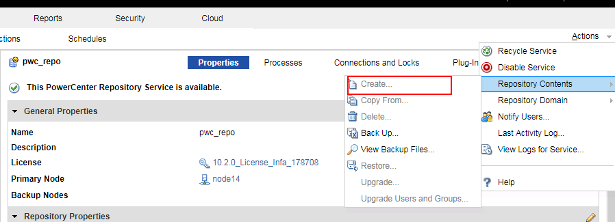

    - 在存储库属性中，修改操作类型为普通，并重启服务
      

  * 创建PowerCenter 数据集成服务
    - 在管理界面，domain下右键新建一个PowerCenter集成服务

      
    - 指定名称等信息，下一步

      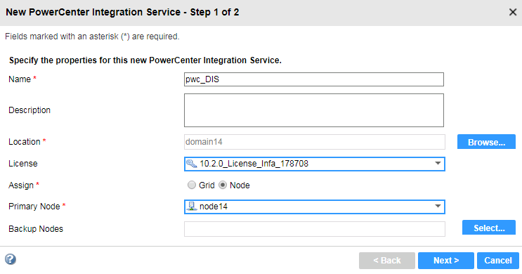
    - 指定存储库信息，点击完成，并启用服务

      

  * 在infa server创建developuser
    - 在安全页签下，创建一个用户，名为developuser，与Hadoop集群用户保持一致
      
    - 修改用户的优先级以及用户组
      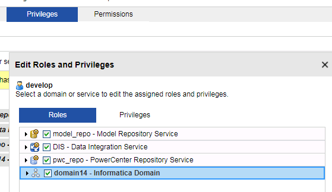

      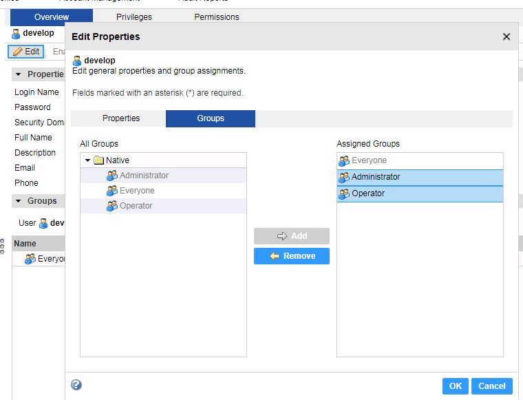

  * 在infa Server 进行Hadoop配置

    - 将`/opt`目录下的krb5.conf文件复制至`/etc`目录下以及informatica安装目录`${INFA_HOME}java/jre/lib/security/`下，并赋予infa用户改文件的读取权限

    - 以infa用户登录节点，创建配置文件目录，例如`/opt/pwx-hadoop/conf`

    - 在FusionInsight HD客户端中获取以下配置文件，放至`/opt/pwx-hadoop/conf`目录中，并修改文件权限至775

      ```
      cp /opt/hadoopclient/HDFS/hadoop/etc/hadoop/core-site.xml /opt/pwx-hadoop/conf
      cp /opt/hadoopclient/HDFS/hadoop/etc/hadoop/hdfs-site.xml /opt/pwx-hadoop/conf
      cp /opt/hadoopclient/Hive/config/hive-site.xml /opt/pwx-hadoop/conf
      cp /opt/hadoopclient/Yarn/config/mapred-site.xml /opt/pwx-hadoop/conf
      chmod -R 775 /opt/pwx-hadoop/conf
      chown infa:oinstall /opt/pwx-hadoop/conf/*
      ```

      

    - 执行以下命令进行Kerberos认证，并指定cache文件，infa用户需要对指定的路径有读写权限

      ```
      source /opt/hadoopclient/bigdata_env
      kinit -c /home/infa/krb5cc_developuser developuser
      chown infa:oinstall /home/infa/krb5cc_developuser
      ```

    - 修改`/opt/pwx-hadoop/conf`目录中的`core-site.xml`文件，添加如下配置

      ```
      <property>
      <name>hadoop.security.kerberos.ticket.cache.path</name>
      <value>home/infa/krb5cc_developuser</value>
      <description>Path to the Kerberos ticket cache. </description>
      </property>
      ```

    - 在Administrator 管理界面，为集成服务创建环境变量 **CLASSPATH=/opt/pwx-hadoop/conf**，并重启集成服务

      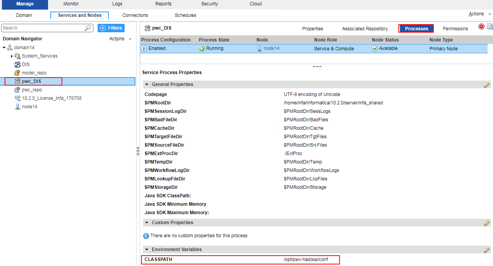

      >说明：如果使用FusionInsight HD提供的Hive ODBC驱动连接Hive，需要创建环境变量 **LD_PRELOAD=/usr/lib64/libodbchive.so**。
      >
      >

    - 删除
      `/home/infa/Informatica/10.2.0/services/shared/hadoop/hortonworks_2.5/lib/`目录下hive相关的jar包，并将`/opt/hadoopclient/Hive/Beeline/lib`下hive相关的jar包拷贝至该目录，并修改文件权限

      ```
        rm -f /home/infa/Informatica/10.2.0/services/shared/hadoop/hortonworks_2.5/lib/hive*
        cp /opt/hadoopclient/Hive/Beeline/lib/hive* /home/infa/Informatica/10.2.0/services/shared/hadoop/hortonworks_2.5/lib
        chown infa:oinstall /home/infa/Informatica/10.2.0/services/shared/hadoop/hortonworks_2.5/lib/hive*
      ```

### PowerCenter Client ~ From Oracle to HDFS/Hive

#### PowerCenter Repository Manager配置

  - 获取PowerCenter Client安装包，安装时选取PowerCenter Client,启动PowerCenter Repository Manager，选择菜单栏仓库->配置域，配置完成可以看到之前创建的存储库

      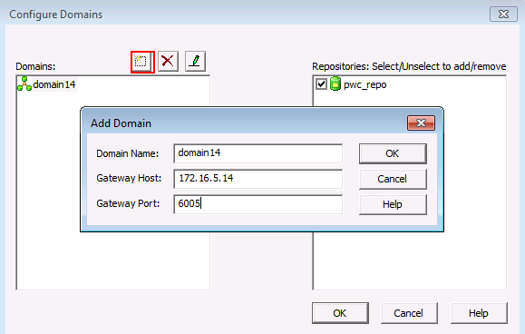

      

  - 双击存储库，输入密码，连接

      

  - 选择菜单栏文件夹,创建文件夹

      

      

#### PowerCenter Designer创建mapping

  - 打开PowerCenter Designer，右键刚才创建的文件夹，点击open，打开配置界面

      
  - 点击菜单栏Sources->import from databases，在ODBC数据源中创建sitDSN，填写数据库相关信息，测试连接

      

      

      
  - 选择刚才创建的数据源，填入数据库用户名密码，连接，可以看到数据库中的表

      
  - 选择target designer，拖入source中的表

      
  - 双击表，设置数据类型为Flat File

      

  - 在mapping设置页面，创建新的mapping，拖入source和target表，并连线

      

#### PowerCenter Workflow Manager运行workflow

  - 在菜单栏选择task,新建一个task,命名并选择刚才新建的map

      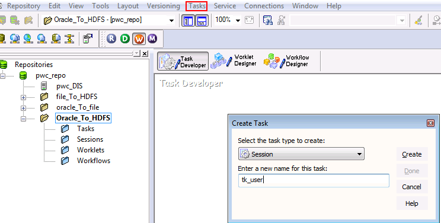

      

  - 新建一个workflow，拖入刚才新建的task，并连线

      

      

  - 在菜单栏connection中，新建一个application connection,选择Hadoop HDFS Connection

      

  - 具体信息填写如下

      ```
      HDFS Connection URI：hdfs://namenodeip:25000
      Hive URL : jdbc:hive2://172.16.4.21:21066/default;sasl.qop=auth-conf;auth=KERBEROS;principal=hive/hadoop.hadoop.com@HADOOP.COM;user.keytab=/opt/user.keytab;user.principal=developuser
      Hive User Name: developuser
      ```
      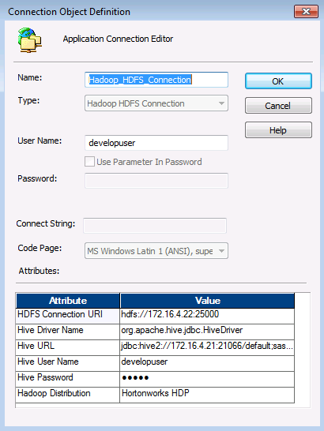

  - 双击刚才创建的task，在mapping选项卡，点击target，设置写入类型为`HDFS Flat Write`，并选择连接为刚才创建的connection，并在properties中进行如下配置

      

      

  - 保存当前workflow，右键，启动workflow

      

  - 在PowerCenter Workflow Monitor中可以看到任务执行情况

      

  - 在HDFS中可以看到导入的数据

       

  - 在task配置中勾选写入Hive表，填入之前创建的表名，运行workflow

       

  - 在Hive中可以看到表中的数据

      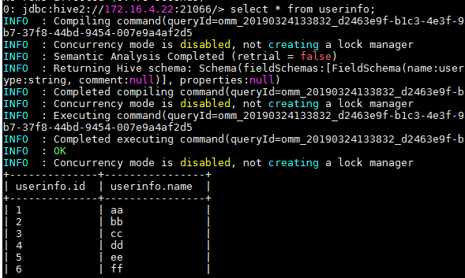

### PowerCenter Client ~ From Hive to Local

使用FusionInsight HD提供的Hive ODBC驱动对接并读取Hive表的数据下载至本地。

#### 安装FusionInsight HD的Hive ODBC驱动

* 从<https://support.huawei.com/enterprise/zh/cloud-computing/fusioninsight-tool-pid-21624171/software/250981134?idAbsPath=fixnode01%7C7919749%7C7941815%7C19942925%7C21624171>下载 **FusionInsight_Hive_ODBC_Driver_6.5.1.3.zip**。

* 参考产品手册`应用开发指南->安全模式->Hive开发指南->环境准备->配置ODBC样例工程->Linux环境`安装Hive ODBC驱动。注意以下几点：

  * FusionInsight_Hive_ODBC_Driver_6.5.1.3.zip版本的Hive ODBC不支持TaiShan平台，以及X86平台下的64位Windows操作系统、欧拉操作系统、SuSE 12.x、RedHat 7.x。

  * Hive ODBC安装完之后，需要执行 **ldd /usr/lib64/libodbchive.so** 确认没有包丢失。

    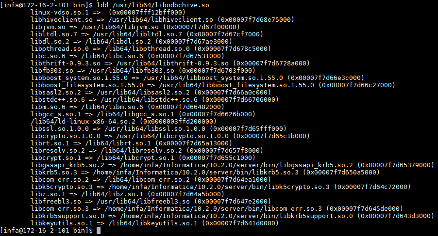

    >说明：如果ldd命令返回有包丢失，则需要创建对应的符号链接。例如：

    ```
    ln -s /opt/hadoopclient/JDK/jdk-8u201/jre/lib/amd64/server/libjvm.so /usr/lib64/libjvm.so
    ln -s /usr/lib64/libssl.so.1.0.2k /usr/lib64/libssl.so.1.0.0
    ln -s /usr/lib64/libcrypto.so.1.0.2k /usr/lib64/libcrypto.so.1.0.0
    ```

  * `/etc/odbc.ini`配置示例如下：

    ```
    [hivefi]
    DRIVER=/usr/lib64/libodbchive.so
    MODE=1
    HOST=172.16.4.181:24002,172.16.4.182:24002,172.16.4.183:24002
    PORT=24002
    DATABASE=default
    PRINCIPAL=hive/hadoop.hadoop.com@HADOOP.COM
    FRAMED=0
    NAMESPACE=hiveserver2
    KRB5PATH=/opt/krb5.conf
    JAASPATH=/opt/jaas.conf
    ```

  * 以下三个环境变量在`/etc/profile`中设置以便所有用户都能共享。

    ```
    export LD_LIBRARY_PATH=$LD_LIBRARY_PATH:/usr/local/lib:/usr/lib64
    export ODBCINI=/etc/odbc.ini
    export ODBCCLASSPATH=/usr/local/hiveodbc/jars/zookeeper-3.5.1.jar:/usr/local/hiveodbc/jars/slf4j-api-1.7.10.jar:/usr/local/hiveodbc/jars/log4j-1.2.17.jar:/usr/local/hiveodbc/jars/slf4j-log4j12-1.7.5.jar:/usr/local/hiveodbc/jars/zk-helper.jar:/usr/local/hiveodbc/jars/commons-logging-1.2.jar

    ```

* 使用Informatica提供的调试工具ssgodbc验证连接。

  ```
  su - infa
  kinit developuser
  export LD_PRELOAD=/usr/lib64/libodbchive.so
  /home/infa/Informatica/10.2.0/tools/debugtools/ssgodbc/linux64/ssgodbc.linux64 -d hivefi -u developuesr -p 'Huawei@123' -v
  ```

  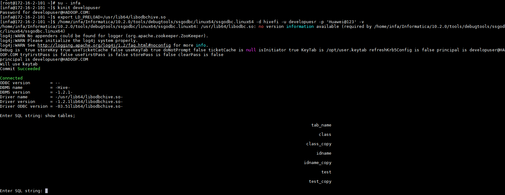

#### kinit认证方式配置

- 从<http://web.mit.edu/kerberos/dist/#kfw-4.0>下载对应操作系统架构的MIT Kerberos并安装。

- 设置Kerberos的配置文件。将用户的krb5.conf文件重命名为 **krb5.ini** 放在`C:\ProgramData\MIT\Kerberos5`目录下。

- 设置Kerberos票据的缓存文件

  * 在本地创建存放票据的目录，例如`C:\temp`。

  * 设置Windows的系统环境变量，变量名为`KRB5CCNAME`，变量值为`C:\temp\krb5cache`。

    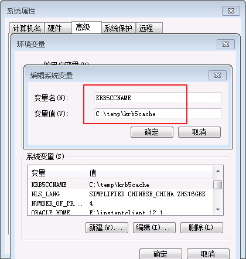

- 在Windows上进行认证

  打开MIT Kerberos，单击 **get Ticket** ，在弹出的MIT Kerberos: Get Ticket窗口中，**Pricipal** 输入用户名`developuser@HADOOP.COM`，**Password** 输入密码，单击 **OK**。

  

#### PowerCenter Repository Manager配置

- 以管理员身份运行PowerCenter Repository Manager并连接上存储库。选择菜单栏`文件夹->创建`新建文件夹 **Hive_to_Local**。

  

#### PowerCenter Designer创建mapping

- 登录FusionInsight客户端，使用beeline创建Hive表class并插入数据。

  ```
  CREATE TABLE IF NOT EXISTS class(id INT,name STRING);
  INSERT INTO class VALUES (1,'Class1');
  INSERT INTO class VALUES (2,'Class2');    
  INSERT INTO class VALUES (3,'Class3');
  ```

- 以管理员身份运行PowerCenter Designer，右键刚才创建的文件夹**Hive_to_Local**，点击open，打开配置界面。点击菜单栏`源->从数据库导入`，在ODBC数据源中选择 **Sample Cloudera Hive DSN**，点击右边的按钮。

  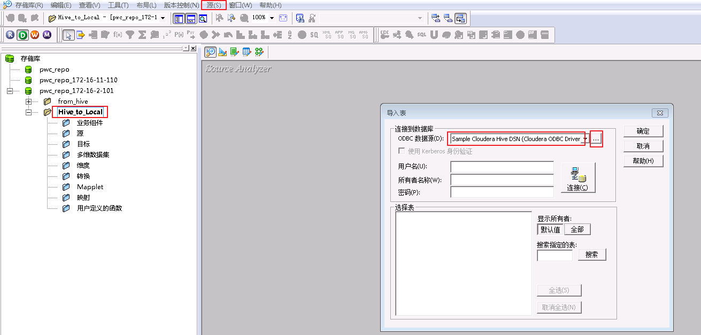

- 选择 **系统DSN->Sample Cloudera Hive DSN**，点击 **配置** 按钮。
  

- 配置Hive连接信息如下，点击 **Test** 按钮，返回连接成功。

  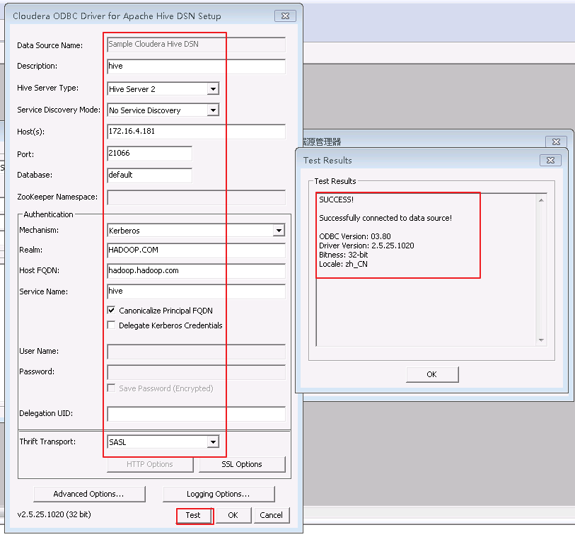

- 点击OK或者确定按钮返回`导入表`界面，填入用户名：developuser，所有者默认与用户名一致，输入developuser对应的密码，点击 **连接** 按钮。连接成功后，点击“显示所有者”下面的 **全部** 按钮，则会返回default数据库。选择default数据库表 **class**，点击 **确定** 按钮。

  

- 在`Hive_to_Local->源->Sample Cloudera Hive DSN`下可看到新增的源表class。

  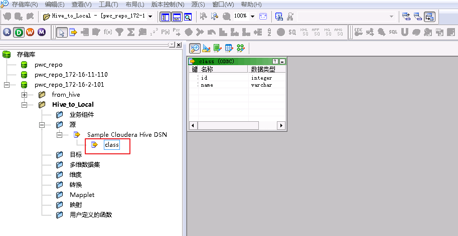

- 选择target designer，拖入source中的表class，则在`Hive_to_Local->目标`下看到class。

  

- 双击目标class，设置数据类型为Flat File。

  

- 点击 **mapping designer** 图标，点击菜单栏`映射->创建`，创建新的映射“mapping_hive_to_local”。

  

- 将源class和目标class拖入映射“mapping_hive_to_local”中并连线。

  

- 双击 **SQ_class** ，在“属性->Sql Query”中，“ODBC数据源”选择 **Sample Cloudera Hive DSN**，点击 **生成SQL** 按钮，然后确定。“Crtl+s”保存mapping。

  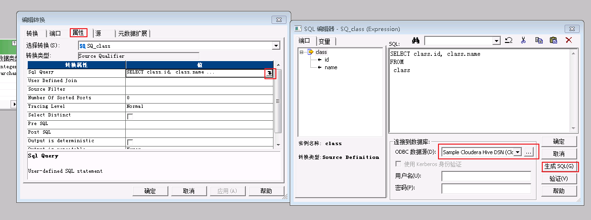

#### PowerCenter Workflow Manager运行workflow

- 以管理员身份运行PowerCenter Wrokflow，在菜单栏选择“任务->创建”，命名为“session_hive_to_local”，并选择映射“mapping_hive_to_local”，点击 **确定**。

  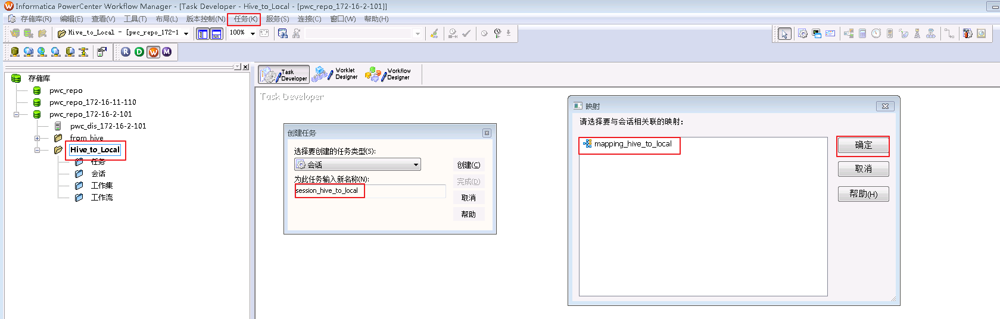


- 选择菜单栏“连接->关系”，点击 **新建**，选择 **ODBC** 后点击 **确定**。

  **连接对象定义如下：**

  ```
  名称：hivefi，自定义
  用户名：developuser
  密码：输入developuser的密码
  连接字符串：hivefi，需要和/etc/odbc.ini中设置的名称保持一致
  代码页：UTF-8 encoding of Unicode
  ```

  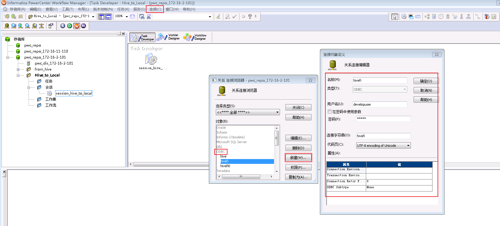

- 在“Task Developer”中双击会话“session_hive_to_local”，点击 **映射**，设置源SQ_class的连接值为 **hivefi**，目标class1的属性“Output file directory”为 **/home/infa**，“Output filename”为 **class.out**。

  

  

- 点击“Workflow Designer”，选择菜单栏“工作流”，点击 **新建**，新建一个工作流 **wkf_hive_to_local**，拖入会话“session_hive_to_local”，并与“启动”连线。

  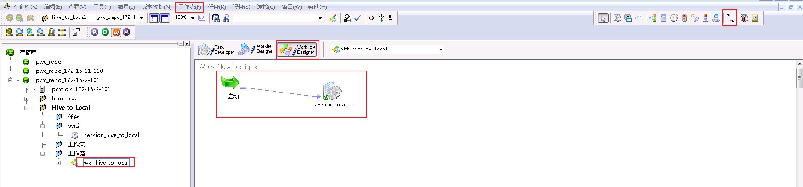

- “Ctrl+s”保存“wkf_hive_to_local”，右键“wkf_hive_to_local”选择 **启动工作流**。

- 在PowerCenter Workflow Monitor中可以看到任务执行成功。

  

- 登录Informatica安装节点查看从Hive表获取的数据存储于`/home/infa/class.out`。

  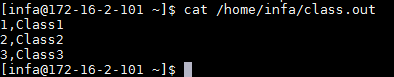
