# Knime 对接FusionInsight

## 适用场景

> Knime 3.6.1 <--> FusionInsight HD V100R002C80SPC200 (HDFS/Hive/Spark)
>
> Knime 4.1.0 <--> FusionInsight HD 6.5 (HDFS/Hive/Spark)

## 准备工作

* 登录FusionInsight Manager创建一个“人机”用户，例如：developuser，具体请参见FusionInsight HD产品文档的`管理员指南->系统设置->权限设置->用户管理->创建用户`章节。给developuser用户授予所有访问权限，包含但不限于HDFS、Hive、Spark2x。

* 登录FusionInsight Manager的`系统->用户->更多（developuser）->下载认证凭证`，下载developuser对应的认证凭证。解压后，将krb5.conf和user.keytab放在`C:\developuser\`目录下(developuser文件夹不存在则创建)。

* 登录FusionInsight Manager的`集群->更多->下载客户端`，选择“仅配置文件”下载集群的配置文件至本地并解压。并将解压后的`..\FusionInsight_Cluster_1_Services_ClientConfig_ConfigFiles\HDFS\config`目录的 **core-site.xml** 和 **hdfs-site.xml** 放在`C:\ecotesting\hadoopConfig`目录下。

  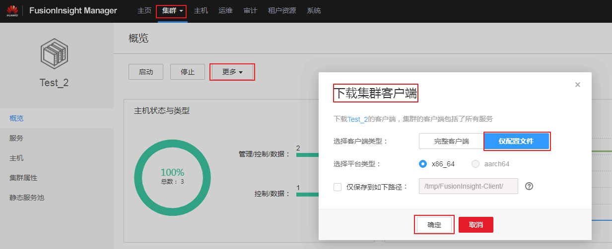

* 确认客户端机器的时间与FusionInsight HD集群的时间一致，时间差要小于5分钟。

* 安装并配置JDK

  * 安装JDK8

    

  * 新增系统环境变量`JAVA_HOME= C:\\Program Files\\Java\\jdk1.8.0_112`

  * 在系统环境变量PATH添加 `%JAVA_HOME%\bin;%JAVA_HOME%\jre\bin;`

## Knime安装和配置

### 下载Knime

  * 从Knime官网<https://www.knime.com/downloads/download-knime>下载操作系统对应的版本下载并安装。本文使用的是64位的Knime Analytics Platform for Windows (installer)。

      

<!-- ## 配置Windows的kerberos认证

  * 下载并安装MIT Kerberos

      下载网址：<http://web.mit.edu/kerberos/dist/#kfw-4.0>

      版本与操作系统位数保持一致，本文版本kfw-4.1-amd64.msi。

    * 确认客户端机器的时间与FusionInsight HD集群的时间一致，时间差要小于5分钟

    * 设置Kerberos的配置文件

      在FusionInsight Manager创建一个角色与“人机”用户，具体请参见《FusionInsight HD 管理员指南》的创建用户章节。角色需要根据业务需要授予Spark，Hive，HDFS的访问权限，并将用户加入角色。下载该用户对应的Kerberos认证文件，包括user.keytab以及krb5.conf文件，保存在本地。

    * 设置Kerberos票据的缓存文件

      * 创建存放票据的目录，例如“C:\temp”。
      * 设置Windows的系统环境变量，变量名为“KRB5CCNAME”，变量值为“C:\temp\krb5cc_tmp”。

        

    * 重启机器

  * 在Windows上进行认证

      * 使用Kerbers认证的用户名密码登录，用户名的格式为：用户名@Kerberos域名。

      * 打开MIT Kerberos，单击“get Ticket”，在弹出的“MIT Kerberos: Get Ticket”窗口中，“Pricipal”输入用户名，“Password”输入密码，单击“OK”,获得票据。

      
-->

### 安装Knime extension

  * 安装并启动Knime Analytics Platform，点击菜单栏`File->Install Knime extensions`。搜索`big data`，在结果中选择`KNIME Big Data Extensions`。然后点击`next`。

    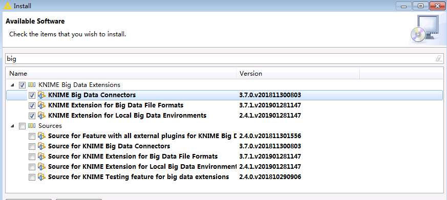

  * 选择`accept licence`，点击`finish`开始安装。

    

  * 在右下角可以看到安装进度。

    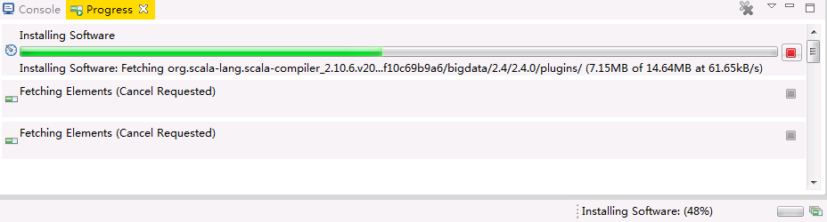

    >说明：由于网络原因安装失败时，可重复以上步骤直至安装成功为止。

  * 安装完成后重启Knime Analytics Platform。

### 配置Knime

  * 在Knime的安装目录中，修改配置文件“knime.ini”，在末尾添加以下内容：

    `-Djava.security.krb5.conf=C:\developuser\krb5.conf`

    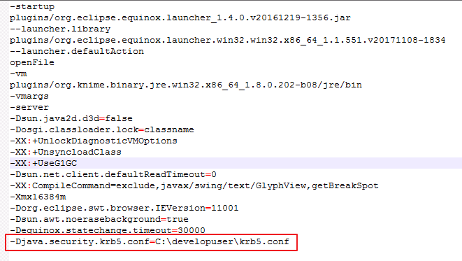

  * 重启Knime Analytics Platform，在菜单栏选择`File->Preferences->KNIME->Big Data->Hadoop`，在`Hadoop Configuration`中填入本地保存的HDFS的`hdfs-site.xml`和`core-site.xml`文件路径，点击`Apply and Close`保存配置。

    

  * 在菜单栏选择`File->Preferences->KNIME->Kerberos`，填入如下配置后点击`Apply and Close`保存配置。

    * “Kerberos Configuration”选择 **Use Kerberos client configuration file (krb5.conf)** 并输入文件路径 `C:\developuser\krb5.conf`

    * “How to log in”选择 **With keytab** 并填入kerberos认证用户名 **developuser** 和本地keytab文件的路径`C:\developuser\user.keytab`，

    

## Knime连接HDFS

### 前提条件

  - 已经完成Knime 3.6.1的安装

  - 已完成FusionInsight HD的安装，包含HDFS组件

  - 已完成本机的Kerberos认证

### 建立HDFS连接

  * 在Knime菜单栏中选择`File->New->New KNIME Workflow`，命名为“HDFSConnection”后保存。

    

    

  * 在Node Repository中搜索`hdfs`。

    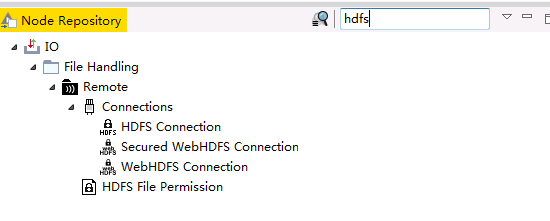

  * 将`HDFS Connection` 节点拖入“HDFSConnection”工作区。

    

  * 双击`HDFS Connection` 节点，填写配置如下：

    ```
    Host: HDFS的NameNode主节点IP
    Port: 25000
    Authentication: Kerberos
    ```

    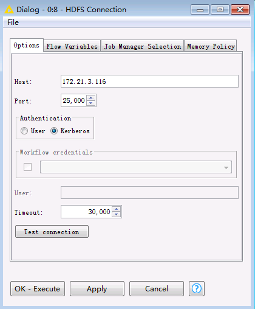

  * 点击`Test connection`，显示如下，表示连接成功。

    

  * 点击`OK`，保存配置。

### 读取HDFS文件

   * 在工作区中拖入`Download` 节点，将其与`HDFS Connection`相连。

    

   * 双击`Download` 节点，选择要从HDFS文件系统下载的文件（例如`/temp.csv`）以及文件的本地保存路径。

    

   * 点击`OK`，保存配置。

   * 点击菜单栏中的执行任务。

    >说明：如果需要重新执行任务，选中节点，右键选择“Reset”后该节点点即可重新执行。

   * 查看`temp.csv`已下载至本地指定目录。

    

### 上传文件至HDFS

  * 将要上传的文件放在本地的一个文件夹中，例如`C:\KnimeData`。

    

  * 在工作区中拖入`List Files`,`String to URI` 以及`Upload` 节点，将其进行如下连接。

    

  * 双击`List Files` 节点，选择要上传文件的本地路径，点击`OK`，保存配置。

    

  * 双击`Upload` 节点，选择在HDFS中文件保存的路径，点击`OK`，保存配置。

    

  * 点击菜单栏中的执行任务。

  * 在服务器上查看HDFS文件系统中所上传的文件。

    

## Knime连接Hive

### 前提条件

  - 已经完成Knime 3.6.1的安装

  - 已完成FusionInsight HD的安装，包含Hive组件

  - 已完成本机的Kerberos认证

### 建立Hive连接

  * 在Knime菜单栏中选择`File->New->New KNIME Workflow`，命名为“HiveConnection”后保存。

    

  * 在“HiveConnection”工作区中拖入一个`Hive Connector` 节点。

    

  * 双击`Hive Connector` 节点，填写配置如下：

    ```
    Hostname: Hive的HiveServer其中一个节点
    Port: 21066
    Parameter: principal=hive/hadoop.hadoop.com@HADOOP.COM;saslQop=auth-conf;auth=KERBEROS;
    Authentication: Use Kerberos
    ```

    

  * 点击`OK`，保存配置。

### 写入Hive表

  * 在工作区中拖入以下几个节点，并进行如下连接。

    

  * 双击`HDFS Connection` 节点，填写配置如下。点击`OK`保存配置。

    ```
    Host: HDFS的NameNode主节点IP
    Port: 25000
    Authentication: Kerberos
    ```

    

  * 双击`File Reader`节点，选择本地将要上传的文件，例如Knime工作区`C:\Users\wangna\knime-workspace`中已默认下载下来的`C:\Users\wangna\knime-workspace\Example Workflows\TheData\Basics\adult.csv`。点击`OK`保存配置。

    

  * 双击`Hive Loader`节点，选择文件要上传至服务器的路径以及表名，点击`OK`保存配置。

    

  * 点击菜单栏中的执行任务。

  * 在FusionInsight客户端使用beeline查看导入Hive中的表。

    

    

## Knime连接Spark2x

### 前提条件

  - 已经完成Knime 3.6.1的安装

  - 已完成FusionInsight HD客户端安装，具体请参见FusionInsight HD产品文档的`应用开发指南->安全模式->安全认证->配置客户端文件`章节。

    >说明：FusionInsight客户端安装目录为`/opt/hadoopclient`，且能使用spark-submit命令提交任务。

### 安装Spark Job Server

>说明：以下操作步骤以CentOS 7.x为例，其他操作系统请参考KNIME官方文档<https://download.knime.org/store/3.6/knime_extension_for_apache_spark_2.3.0.pdf>执行相应的命令。

  * 从<https://docs.knime.com/latest/bigdata_extensions_admin_guide/index.html#_overview>的“Spark Jobserver downloads”章节，根据集群以及操作系统版本获取对应的`Spark Job Server`安装包。基于FusionInsight HD 6.5.1的Spark2x的版本为2.3.2，故选择下载 **CDH 5.9 - 5.15 (Apache Spark 2.3)** ，下载文件名为 **spark-job-server-0.7.0.3-KNIME_spark-2.3_cdh.tar.gz**。

    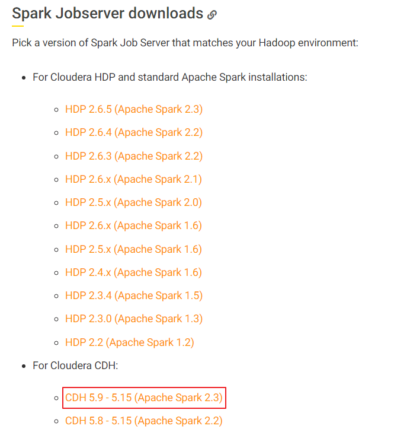

  * 将下载的 **spark-job-server-0.7.0.3-KNIME_spark-2.3_cdh.tar.gz** 上传至已安装FusionInsight HD客户端节点，例如`/opt`目录下。执行以下命令进行安装配置：

    ```
    LINKNAME=spark2-job-server
    tar -xvf /opt/spark-job-server-0.7.0.3-KNIME_spark-2.3_cdh.tar.gz -C /opt
    ln -s /opt/spark-job-server-0.7.0.3-KNIME_spark-2.3_cdh /opt/${LINKNAME}
    useradd -d /opt/${LINKNAME}/ -M -r -s /bin/false spark-job-server
    su -l -c "hdfs dfs -mkdir -p /user/spark-job-server ; hdfs dfs -chown -R spark-job-server /user/spark-job-server" spark-job-server
    chown -R spark-job-server:spark-job-server /opt/${LINKNAME} /opt/spark-job-server-0.7.0.3-KNIME_spark-2.3_cdh
    ```

    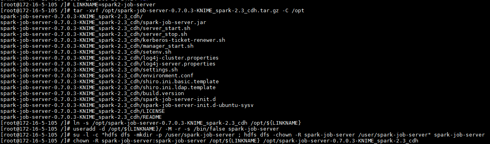

    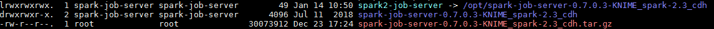

### 配置Spark Job Server

  * 将`C:\developuser\krb5.conf`上传至安装节点的`/etc`目录下。启动spark job server时调用“kerberos-ticket-renewer.sh”产生票据依赖于`/etc/krb5.conf`文件。

    

  * 将`C:\developuser\user.keytab`上传至安装节点的`/opt/spark2-job-server`目录下。

    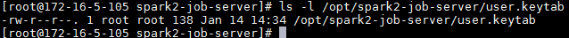

  * 修改`/opt/spark2-job-server/spark-job-server-init.d`设置Java和Spark运行的环境变量。在“jobserver_start()”开始处新增 **source /opt/hadoopclient/bigdata_env**。

    

  * 修改`/opt/spark2-job-server/environment.conf`文件。设置 **master = "yarn-client"** ，以yarn-client模式运行spark。

    

  * 修改`/opt/spark2-job-server/settings.sh`文件。

    * 设置SPARK_HOME。由于不存在目录`/opt/cloudera/parcels/SPARK2/`，故else语句的SPARK_HOME生效。在else语句中设置`SPARK_HOME=/opt/hadoopclient/Spark2x/spark`。

      

    * 将 **HADOOP_CONF_DIR** 的设置注释或删除。

      

      >说明：yarn-client模式运行spark需要从参数HADOOP_CONF_DIR设置的目录加载相应的环境变量和配置文件。启动spark job server(执行spark-job-server-init.d start或者systemctl start spark2-job-server)时执行命令“source /opt/hadoopclient/bigdata_env”已设置HADOOP_CONF_DIR为正确的值。因此需要将settings.sh文件中HADOOP_CONF_DIR设置的值注释以免将正确的值覆盖，导致错误。

    * 设置 **JOBSERVER_KEYTAB** 和 **JOBSERVER_PRINCIPAL**。

      ```
      export JOBSERVER_KEYTAB=/opt/spark2-job-server/user.keytab
      export JOBSERVER_PRINCIPAL=developuser@HADOOP.COM
      ```

      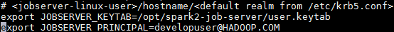

  * 登录FusionInsight Manager，修改HDFS的core-site.xml文件配置。

    * 主页面选择`集群->HDFS`，在左侧选择`配置->全部配置->自定义`，添加以下两个参数

      ```
      hadoop.proxyuser.spark-job-server.hosts = *
      hadoop.proxyuser.spark-job-server.groups = *
      ```

      

    * 保存配置，并重启HDFS以及依赖的服务。

### 启动和停止Spark Job Server

  * 设置从系统启动或停止Spark Job Server。

    ```
    ln -s /opt/spark2-job-server/spark-job-server-init.d /etc/init.d/spark2-job-server
    systemctl daemon-reload
    systemctl enable spark2-job-server
    ```

  * 启动Spark Job Server。

    ```
    systemctl start spark2-job-server
    ps -ef |grep spark2
    ```

    

    >说明：
    >
    > 启动Spark Job Server的另外一种方式是执行命令`/opt/spark2-job-server/spark-job-server-init.d start`
    >
    >在`/tmp`目录下可以查看缓存的票据和其他数据。
    >
    > 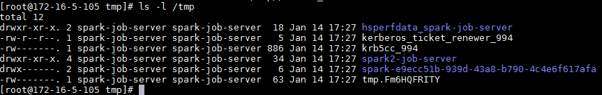
    >
    >在`/var/log/spark2-job-server`目录下可以查看运行的日志。
    >
    >

  * 启动后在浏览器中输入<http://ip:8090>，其中ip为安装节点的IP，返回以下界面则表示启动成功。

    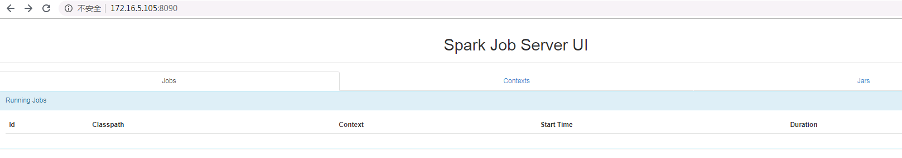

  * 停止Spark Job Server。

    ```
    systemctl stop spark2-job-server
    ```

### 建立Spark连接

  * 在Knime菜单栏中选择`File->New->New KNIME Workflow`，命名为“SparkContext”后保存。在工作区中拖入一个 **Create Spark Context** 节点和一个 **Destroy Spark Context** 节点并连接。

    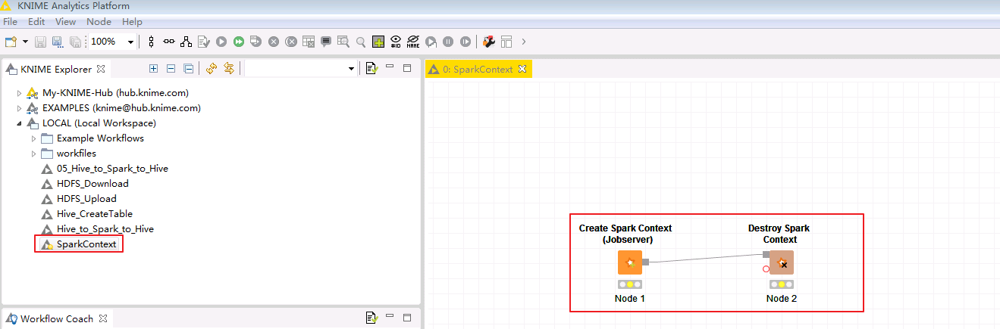

  * 双击 **Create Spark Context** 节点进行如下配置。

    - 在Context Settings页面

      - Spark version：选择集群中使用的Spark版本2.3

      - Context name：自定义Spark Context名字为knimeSparkContext

        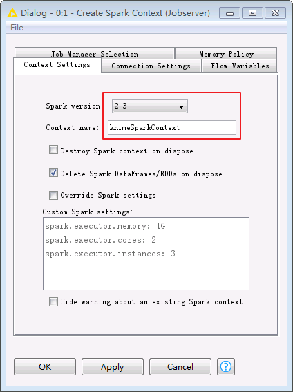

    - 在Connection Settings页面

      - Jobserver URL：<http://ip:8090/>，其中IP为Spark Job Server 所在节点IP

      - Authentication: None

        

    - 点击 **OK** 保存配置。

  * 点击菜单栏按钮，测试连接是否有错，若显示如下，表明节点配置无误。

    

  * 在浏览器中打开Jobserver URL中配置的地址，可以进入Spark Job Server UI界面，可以看到刚才建立的Spark Context，显示如下：

    

  * 登录Funsion Manager进入Yarn ResourceManager WebUI查看application的日志，FinalStatus显示为 **SUCCEEDED**。

    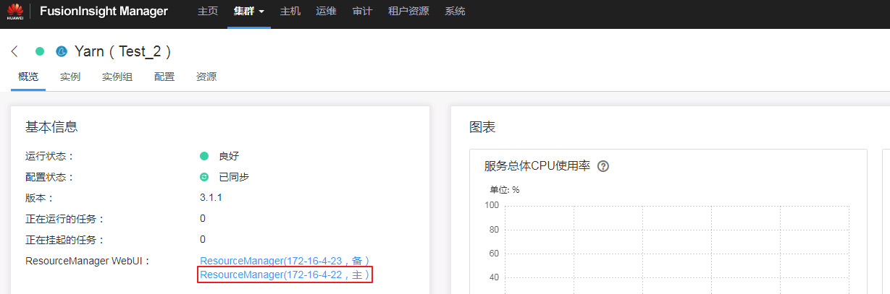

    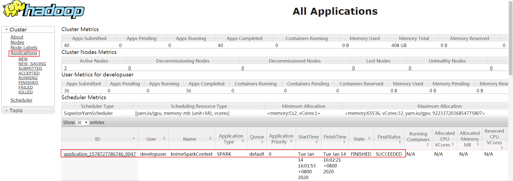

## Spark应用实例

Spark应用实例下载地址<https://www.knime.com/nodeguide/big-data/spark-executor>。

### Hive to Spark to Hive

  * 下载实例“Hive to Spark to Hive”，下载文件名为 **05_Hive_to_Spark_to_Hive.knwf**。

    

    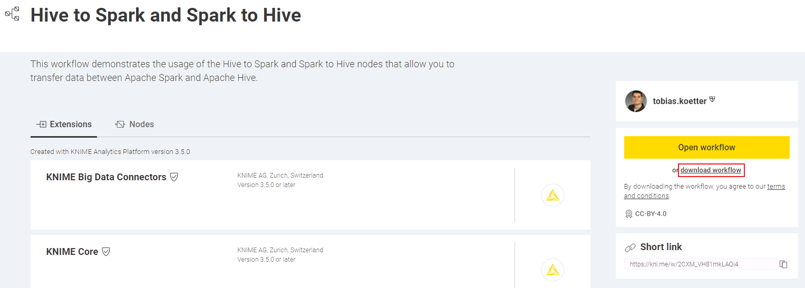

  * 点击KNIME Analytics Platform的菜单栏`File->Import KNIME Workflow`导入 **05_Hive_to_Spark_to_Hive.knwf**。

    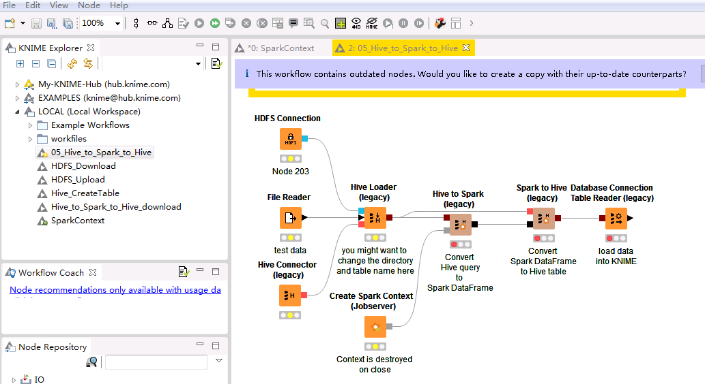

  * 双击`HDFS Connection` 节点，填写配置如下。点击`OK`保存配置。

    ```
    Host: HDFS的NameNode主节点IP
    Port: 25000
    Authentication: Kerberos
    ```

    

  * 双击`File Reader` 节点，选择将要上传的本地文件，例如Knime工作区`C:\Users\wangna\knime-workspace`中已默认下载下来的`C:\ecotesting\knime-workspace\Example Workflows\TheData\Customers\ContractData.csv`。点击`OK`保存配置。

    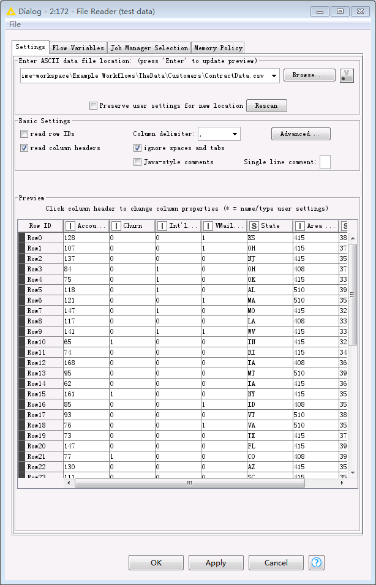

  * 双击`Hive Connector` 节点，填写配置如下。点击`OK`保存配置。

    ```
    Hostname: Hive的HiveServer其中一个节点的IP
    Port: 21066
    Parameter: principal=hive/hadoop.hadoop.com@HADOOP.COM;saslQop=auth-conf;auth=KERBEROS;
    Authentication: Use Kerberos
    ```

    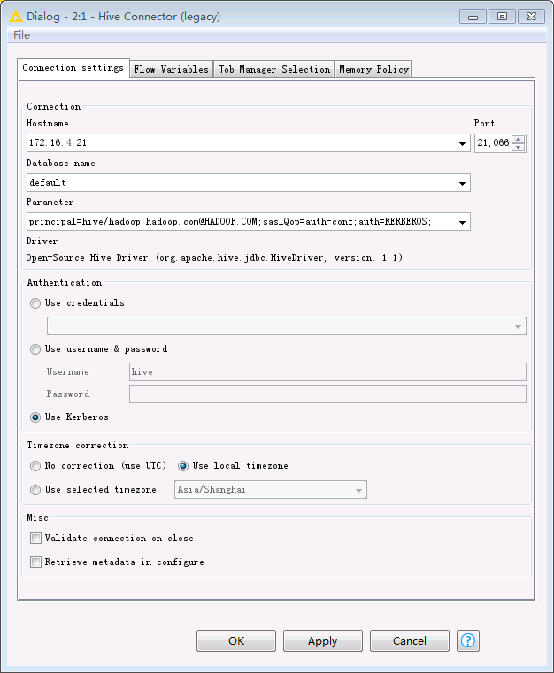

  * 双击`Hive Loader`节点，选择文件要上传至HDFS文件系统路径以及表名，点击`OK`保存配置。

    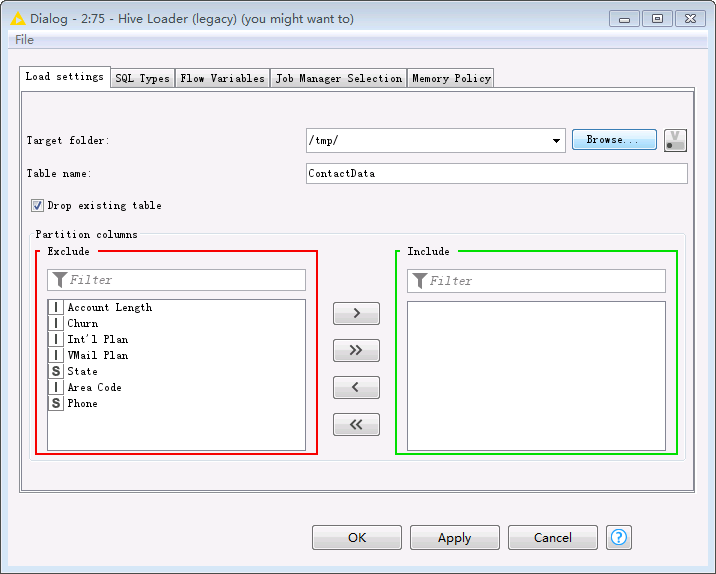

  * 双击 `Create Spark Context` 节点，填写配置如下。点击`OK`保存配置。

    - 在Context Settings页面

      - Spark version：选择集群中使用的Spark版本2.3

      - Context name：自定义Spark Context名字为knimeSparkContext

        

    - 在Connection Settings页面

      - Jobserver URL：<http://ip:8090/>，其中IP为Spark Job Server 所在节点IP

      - Authentication: None

        

  * `Hive to Spark`、`Spark to Hive`和`Database Connection Table Reader`保持默认配置不变。双击 `Spark to Hive` 节点可查看创建的Hive表的“Table name”为 **knimeTest**。

    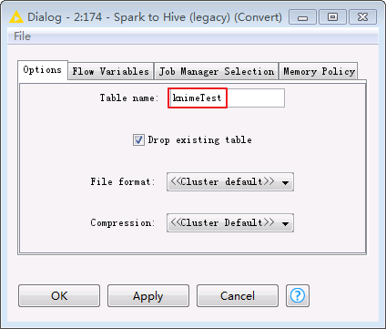

  * 点击菜单栏中的执行任务。

  * 登录Funsion Manager进入Yarn ResourceManager WebUI查看application的日志，State显示为 **RUNNING**。

    

  * 在FusionInsight客户端使用beeline查看导入Hive中的表。通过`Hive Loader`节点导入的表`contactdata`以及`Spark to Hive`节点导入的表`knimetest`均已导入Hive。

    ```
    select count(*) from contactdata;
    select count(*) from knimetest;
    ```
    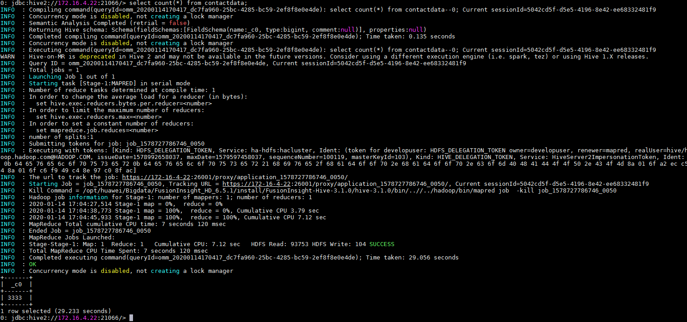

    

## FAQ

### **启动Spark Job Server时，返回kinit: command not found**

  **【问题描述】**

  执行/opt/spark2-job-server/spark-job-server-init.d start时返回 **kinit: command not found。**

  

  在Knime Analytics Platform中运行Create Spark Context(Jobserver)时失败，返回 **Possible reason: Incompatible Jobserver version, malconfigured Spark Jobserver。**

  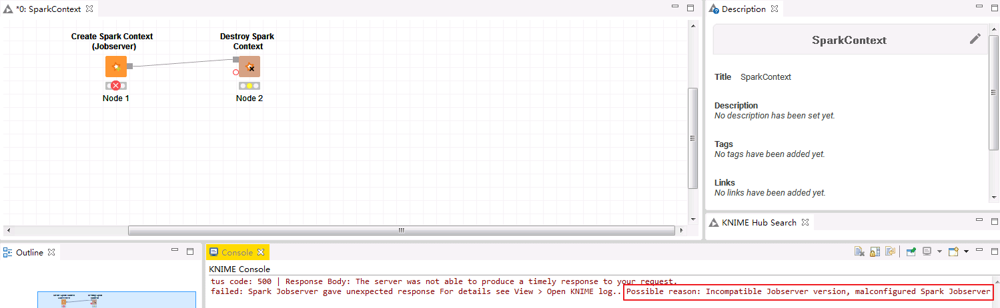

  查看运行日志/var/log/spark2-job-server/jobserver-knimeSparkContext7418932986808208865/spark-job-server.log返回以下错误：
  DestHost:destPort 172-16-4-22:26004 , LocalHost:localPort 172-16-5-105/172.16.5.105:0. **Failed on local exception: java.io.IOException: org.apache.hadoop.security.AccessControlException: Client cannot authenticate via:[TOKEN, KERBEROS]** , while invoking ApplicationClientProtocolPBClientImpl.getNewApplication over 167 after 2 failover attempts. Trying to failover after sleeping for 43502ms.

  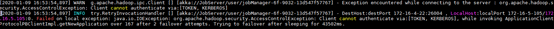

  **【问题分析】**

  从spark-job-server-init.d可以看出使用spark-job-server用户启动Spark Job Server。spark-job-server用户没有权限使用FusionInsight HD客户端安装的kinit。如果操作系统没有安装krb5-workstation，则会返回kinit: command not found，无法产生认证票据。

  

  **【解决方法】**

  方式一：执行`yum install krb5-workstation`安装krb5-workstation。

  方式二：在/opt/spark2-job-server/ spark-job-server-init.d的“jobserver_start()”开始处新增 **source /opt/hadoopclient/bigdata_env**。

  

### **运行Create Spark Context(Jobserver)时失败，返回Can't get Kerberos realm**

  **【问题描述】**

  当/opt/spark2-job-server/environment.conf设置master = "yarn-client"，在Knime Analytics Platform中运行Create Spark Context(Jobserver)时失败，返回 **Yarn application has already ended! It might have been killed or unable to launch application master.**

  

  登录Funsion Manager进入Yarn ResourceManager WebUI查看application的日志，返回错误如下：

  ```
  INFO SecurityManager: SecurityManager: authentication enabled; ui acls enabled; users  with view permissions: Set(admin, developuser); groups with view permissions: Set(); users  with modify permissions: Set(admin, developuser); groups with modify permissions: Set()
Exception in thread "main" java.lang.IllegalArgumentException: Can't get Kerberos realm
	at org.apache.hadoop.security.HadoopKerberosName.setConfiguration(HadoopKerberosName.java:65)
	at org.apache.hadoop.security.UserGroupInformation.initialize(UserGroupInformation.java:318)
	at org.apache.hadoop.security.UserGroupInformation.setConfiguration(UserGroupInformation.java:364)
	at org.apache.spark.deploy.SparkHadoopUtil.<init>(SparkHadoopUtil.scala:53)
	at org.apache.spark.deploy.SparkHadoopUtil$.instance$lzycompute(SparkHadoopUtil.scala:409)
	at org.apache.spark.deploy.SparkHadoopUtil$.instance(SparkHadoopUtil.scala:409)
	at org.apache.spark.deploy.SparkHadoopUtil$.get(SparkHadoopUtil.scala:430)
	at org.apache.spark.SecurityManager.<init>(SecurityManager.scala:259)
	at org.apache.spark.deploy.yarn.ApplicationMaster.<init>(ApplicationMaster.scala:69)
	at org.apache.spark.deploy.yarn.ApplicationMaster$.main(ApplicationMaster.scala:811)
	at org.apache.spark.deploy.yarn.ExecutorLauncher$.main(ApplicationMaster.scala:844)
	at org.apache.spark.deploy.yarn.ExecutorLauncher.main(ApplicationMaster.scala)
Caused by: java.lang.reflect.InvocationTargetException
	at sun.reflect.NativeMethodAccessorImpl.invoke0(Native Method)
	at sun.reflect.NativeMethodAccessorImpl.invoke(NativeMethodAccessorImpl.java:62)
	at sun.reflect.DelegatingMethodAccessorImpl.invoke(DelegatingMethodAccessorImpl.java:43)
	at java.lang.reflect.Method.invoke(Method.java:498)
	at org.apache.hadoop.security.authentication.util.KerberosUtil.getDefaultRealm(KerberosUtil.java:110)
	at org.apache.hadoop.security.HadoopKerberosName.setConfiguration(HadoopKerberosName.java:63)
	... 11 more
Caused by: KrbException: Cannot locate default realm
	at sun.security.krb5.Config.getDefaultRealm(Config.java:1029)
	... 17 more

  ```

  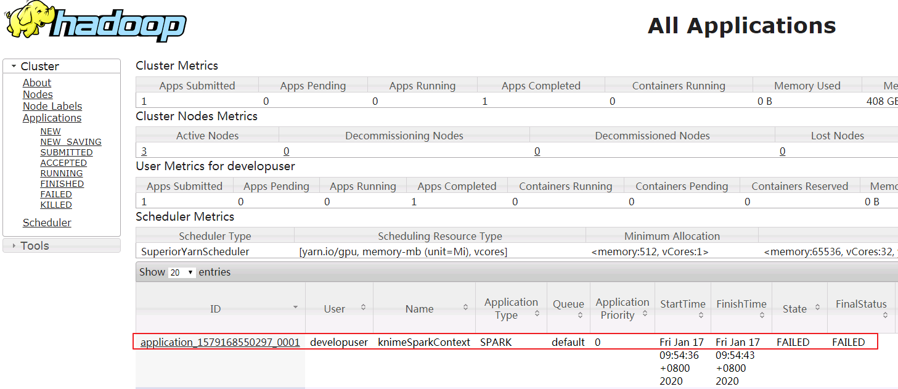

  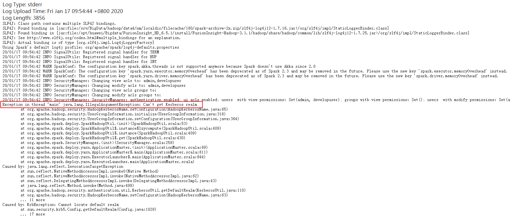

  **【问题分析】**

  yarn-client模式运行spark需要从参数HADOOP_CONF_DIR设置的目录加载相应的环境变量和配置文件，**该问题是由于HADOOP_CONF_DIR设置不正确引起的**。

  在Knime Analytics Platform中运行Create Spark Context(Jobserver)时，调用/opt/spark2-job-server/manager_start.sh提交spark任务。

  在manager_start.sh中使用FusionInsight客户端的spark-submit命令提交任务之前调用了/opt/spark2-job-server/setting.sh。在/opt/spark2-job-server/setting.sh默认设置HADOOP_CONF_DIR=/etc/hive/conf。**使用FusionInsight客户端的spark-submit提交任务时，环境变量HADOOP_CONF_DIR正确值应设置为/opt/hadoopclient/HDFS/hadoop/etc/hadoop。**

  **【解决方法】**

  在/opt/spark2-job-server/ spark-job-server-init.d的“jobserver_start()”开始处新增 **source /opt/hadoopclient/bigdata_env**。

  

  在/opt/spark2-job-server/setting.sh中 **将HADOOP_CONF_DIR的设置注释或者删除**。或者设置为正确的值 **HADOOP_CONF_DIR=/opt/hadoopclient/HDFS/hadoop/etc/hadoop**。

  
