# Oracle GoldenGate对接FusionInsight

## 适用场景

> Oracle GoldenGate 12.2 <--> FusionInsight HD V100R002C60U20 (HDFS/HBase/Flume/Kafka)
>
> Oracle GoldenGate 12.3 <--> FusionInsight HD V100R002C70SPC200 (HDFS/HBase/Flume/Kafka)
>
> Oracle GoldenGate 12.3 <--> FusionInsight HD V100R002C80SPC100 (HDFS/HBase/Flume/Kafka)
>
> Oracle GoldenGate 12.2 <--> FusionInsight HD 6.5 (HDFS/HBase/Flume/Kafka)

## 环境信息

### 软件信息

* Oracle GoldenGate 12.2.0.1.1 for Oracle database
* Oracle GoldenGate 12.2.0.1.1 for BigData
* Oracle database 12.1.0.2.0
* jdk-7u71-linux-x64.rpm
* FusionInsight V100R002C60U20

### 硬件信息

* 源端OGG VM: 162.1.115.68  Redhat6.5 （包含Oracle DB12c的数据库）
* 目标端OGG VM: 162.1.115.69 Redhat6.5（包含Hadoop的客户端）

### 拓朴结构

测试拓朴结构如下图所示：


### 测试表

源端测试表：

在源端Oracle的PDBORCL数据库的test用户下创建test1表，其中ID为主键


## OGG for Oracle安装

前置条件：完成oracle12c数据库的安装（IP：162.1.115.68）

软件版本：linuxamd64_12102_database_1of2.zip, linuxamd64_12102_database_1of2.zip

### 下载并安装OGG for Oracle

* 将fbo_ggs_Linux_x64_shiphome.zip上传至oracle客户端（ip：162.1.115.68）`/home/oracle`目录下，切换至oracle用户，解压生成bo_ggs_Linux_x64_shiphome目录。

  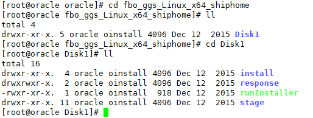

* 在`/home/oracle/fbo_ggs_Linux_x64_shiphome/Disk1`目录下，运行`./runInstaller`

  

  

  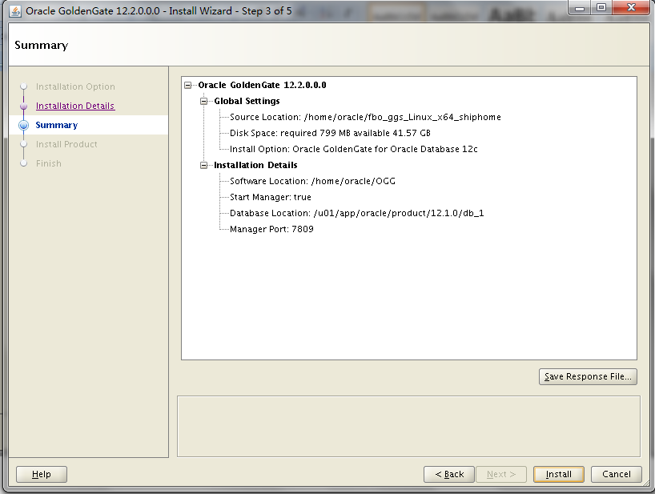

  

* 安装成功，/home/orcle/OGG/是OGG for Oracle的安装目录。

  

### 配置环境变量

* 切换到oracle用户

  ```
  su - oracle
  vi .bash_profile
  ```


* 文件.bash_profile内容如下：
  ```shell
  # .bash_profile
  # Get the aliases and functions
  if [ -f ~/.bashrc ]; then
          . ~/.bashrc
  fi

  # User specific environment and startup programs

  PATH=$PATH:$HOME/bin

  export PATH

  PATH=$PATH:$HOME/bin:/u01/app/oracle/product/12.1.0/db_1/bin
  export PATH
  umask 022
  export ORACLE_BASE=/u01/app/oracle
  export ORACLE_HOME=/u01/app/oracle/product/12.1.0/db_1
  export ORACLE_SID=orcl

  export LD_LIBRARY_PATH=$ORACLE_HOME/lib
    ```

  

* 运行OGG

  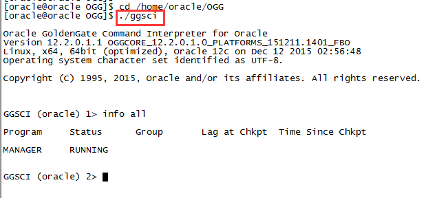

### 打开数据库归档及开启最小附加日志

* 使用Sqlplus / as sysdba登陆Oracle源端数据库后打开Archive Log:
  ```sql
  shutdown immediate;
  startup mount;
  alter database archivelog;
  alter database open;
  archive log list;
  ```

  

* 源端数据库打开数据库级最小附加日志及force logging：
  ```sql
  SELECT supplemental_log_data_min, force_logging FROM v$database;
  alter database add supplemental log data;
  alter database force logging;
  ```

* 切换日志以使附加日志生效：
  ```sql
  ALTER SYSTEM switch logfile;
  ```

  

* Enabling Oracle GoldenGate in the Database:
  ```sql
  show parameter enable_goldengate_replication;
  alter system set enable_goldengate_replication = true scope=both;
  ```

  

* 配置DB12c PDB的tnsname信息`vi $ORACLE_HOME/network/admin/tnsnames.ora`：

  

### 在数据库中创建ogg用户并赋予权限

* 使用`sqlplus / as sysdba`登陆数据库后创建ogg用户并赋予权限
  ```sql
  create user c##ogg identified by welcome1;
  grant dba to c##ogg container=all;
  grant create session, connect, resource to c##ogg container=all;
  grant alter any table to c##ogg container=all;
  grant alter system to c##ogg container=all;
  exec dbms_goldengate_auth.grant_admin_privilege('c##ogg',container=>'all');
  ```

  

### 配置GoldenGate 登陆数据库的别名

* 在GoldenGate中创建用户别名，用于登录Oracle数据库读取数据库日志：
  ```sql
  add credentialstore
  ALTER CREDENTIALSTORE ADD USER c##ogg PASSWORD welcome1 ALIAS ogg_src
  ```

* 这样就可以用别名ogg_src登陆数据库了：
  ```sql
  dblogin useridalias ogg_src
  ```

  

* C##ogg是Oracle DB12c的普通用户，可以访问多个数据库实例。

### 创建test用户和test1表

test用户是基于pdborcl数据库实例的：

* 登陆数据库
  ```
  Sqlplus / as sysdba
  ```

* 创建用户
  ```sql
  alter session set container=pdborcl;
  alter database open;
  create user test identified by welcome1;
  grant resource, connect to test;
  CREATE TABLESPACE test DATAFILE '/u01/app/oracle/oradata/orcl/pdborcl/test01.dbf' SIZE 500M UNIFORM SIZE 128k;
  alter user test quota unlimited on test;
  alter user test quota unlimited on users;
  ```

* 创建测试表
  ```sql
  conn test/welcome1@pdborcl;
  create table test1(id number primary key, name varchar2(50));
  ```

  

  

### 配置GoldenGate捕获进程

* 编辑eora.prm，在GGSCI命令行下运行edit param eora命令：

  ```
  GGSCI> edit param eora
  ```

  

  ```
  GGSCI> edit param mgr
  ```

  

  ```
  GGSCI> edit param phdfs
  ```

  

  ```
  GGSCI> edit param phbase
  ```

  

  ```
  GGSCI> edit param pkafka
  ```

  

  ```
  GGSCI> edit param pflume
  ```

  

* 编辑`diroby/eora.oby`文件，在GGSCI命令行下运行`shell vi diroby/eora.oby`命令：(shell之后接操作系统命令)

* 使用oracle用户创建diroby目录：

  ```
  cd /home/oracle/OGG/
  mkdir diroby
  ```

  ```
  GGSCI> shell vi diroby/eora.oby
  ```

  

  > **注意进程名eora和数据文件dirdat/eo的对应关系**

* 在GGSCI命令行下运行obey diroby/eora.oby命令，把捕获进程eora加入到管理者进程中：

  ```
  GGSCI> obey diroby/eora.oby
  ```

  

* 把捕获进程eora注册到pdborcl数据库中：

  ```
  GGSCI> dblogin useridalias ogg_src
  GGSCI> register extract eora database container(pdborcl)

  ```

  

* 为pdborcl.test下的所有表添加表级附加日志：

  ```
  GGSCI> add schematrandata pdborcl.test allcols
  ```

  

* 启动GoldenGate捕获进程eora:

  ```
  GGSCI> start eora
  ```

  

### 配置GoldenGate传输进程phdfs

配置GoldenGate传输进程phdfs，将OGG生成的数据文件传递给目标端GoldenGate
HDFS处理。

* 编辑phdfs.prm，在GGSCI命令行下运行`edit param phdfs`命令：

  

* 编辑`diroby/phdfs.oby`文件，在GGSCI命令行下运行`shell vi diroby/phdfs.oby`命令：(shell之后接操作系统命令)

  ```
  GGSCI> shell vi diroby/phdfs.oby
  ```

  

  > **注意进程名**phdfs**和数据文件dirdat/rs的对应关系**

* 在GGSCI命令行下运行`obey diroby/phdfs.oby`命令，把捕获进程phdfs加入到管理者进程中：

  ```
  GGSCI> obey diroby/phdfs.oby
  ```


* 启动GoldenGate捕获进程phdfs:

  ```
  GGSCI> start phdfs
  ```

  

### 配置GoldenGate传输进程phbase

配置GoldenGate传输进程phbase，将OGG生成的数据文件传递给目标端GoldenGate
HBASE处理。

* 编辑phbase.prm，在GGSCI命令行下运行`edit param phbase`命令：

  

编辑`diroby/phbase.oby`文件，在GGSCI命令行下运行`shell vi diroby/phbase.oby`命令：(shell之后接操作系统命令)

  ```
  GGSCI> shell vi diroby/phbase.oby
  ```

  

  > **注意进程名**phbase**和数据文件dirdat/se的对应关系**

* 在GGSCI命令行下运行`obey diroby/phbase.oby`命令，把捕获进程phbase加入到管理者进程中：

  ```
  GGSCI> obey diroby/phbase.oby
  ```

  

* 启动GoldenGate捕获进程phbase:

  ```
  GGSCI> start phbase
  ```

  

### 配置GoldenGate传输进程pflume

配置GoldenGate传输进程pflume，将OGG生成的数据文件传递给目标端GoldenGate
FLUME处理。

* 编辑pflume.prm，在GGSCI命令行下运行`edit param pflume`命令：

  

* 编辑`diroby/pflume.oby`文件，在GGSCI命令行下运行`shell vi diroby/pflume.oby`命令：(shell之后接操作系统命令)

  ```
  GGSCI> shell vi diroby/pflume.oby
  ```

  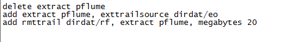

  > **注意进程名**pflume**和数据文件dirdat/rf的对应关系**

* 在GGSCI命令行下运行`obey diroby/pflume.oby`命令，把捕获进程pflume加入到管理者进程中：

  ```
  GGSCI> obey diroby/pflume.oby
  ```

  

* 启动GoldenGate捕获进程pflume:

  ```
  GGSCI> start pflume
  ```

  

### 配置GoldenGate传输进程pkafka

配置GoldenGate传输进程pkafka，将OGG生成的数据文件传递给目标端GoldenGate
Kafka处理。

* 编辑pkafka.prm，在GGSCI命令行下运行`edit param pkafka`命令：

  

* 编辑`diroby/pkafka.oby`文件，在GGSCI命令行下运行`shell vi diroby/pkafka.oby`命令：(shell之后接操作系统命令)

  ```
  GGSCI> shell vi diroby/pkafka.oby
  ```

  

  > **注意进程名**pkafka**和数据文件dirdat/rk的对应关系**

* 在GGSCI命令行下运行`obey diroby/pkafka.oby`命令，把捕获进程pkafka加入到管理者进程中：

  ```
  GGSCI> obey diroby/ pkafka.oby
  ```

  

* 启动GoldenGate捕获进程pkafka:

  ```
  GGSCI> start pkafka
  ```

  

### 查看GoldenGate进程运行状态

* 查看GoldenGate进程状态：(EORCL是与ELK对接的进程)

  ```
  GGSCI> info all
  ```

  

* 查看某个进程的详细信息：
  ```
  GGSCI> info eora detail
  ```

  

* 查看GoldenGate的统计信息：
  ```
  GGSCI> stats eora, latest
  ```

  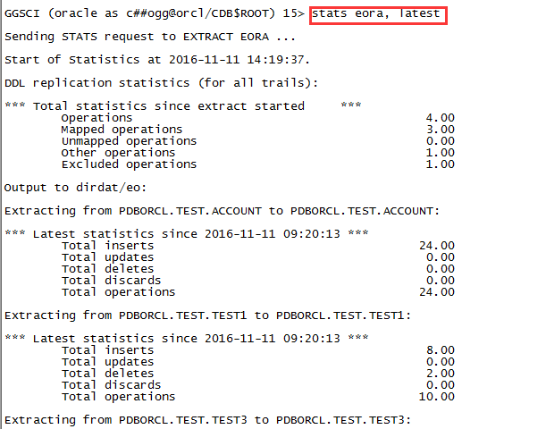

* 查看GoldenGate进程报告，用于定位问题：
  ```
  GGSCI> view report eora
  ```

  

## OGG for Bigdata安装

### 环境准备

* 下载安装FusionInsight客户端

* 在Bigdata客户端机器上（ip：162.1.115.69）按照FusionInsight产品文档安装FusionInsight客户端。将客户端JDK替换成1.7版本。

* 下载并安装oracle JDK1.7

  

  将krb5.conf放在/etc/目录下

* 下载并安装OGG for Bigdata

  将122011_ggs_Adapters_Linux_x64.zip上传至客户端/opt目录下：

  ```
  unzip 122011_ggs_Adapters_Linux_x64.zip
  ```

  

  将解压后的ggs_Adapters_Linux_x64.tar解压到/opt/OGG_HADOOP目录下：

  

* 配置环境变量

  更改环境变量，编辑根目录下`vi .bash_profile`
  ```bash
  # .bash_profile

  # Get the aliases and functions
  if [ -f ~/.bashrc ]; then
          . ~/.bashrc
  fi

  # User specific environment and startup programs
  export JAVA_HOME=/usr/java/jdk1.7.0_40
  #export JAVA_HOME=/usr/lib/jvm/java-1.7.0-openjdk-1.7.0.9.x86_64/jre
  export CLASSPATH=$CLASSPATH:$JAVA_HOME/lib:$JAVA_HOME/jre/lib
  PATH=$JAVA_HOME/bin:$PATH:$HOME/bin

  export PATH

  #export LD_LIBRARY_PATH=/usr/lib/jvm/java-1.7.0-openjdk-1.7.0.9.x86_64/jre/lib/amd64/server/libjvm.so:/usr/lib/jvm/java-1.7.0-openjdk-1.7.0.9.x86_64/jre/lib/amd64/server:/usr/lib/jvm/java-1.7.0-openjdk-1.7.0.9.x86_64/jre/lib/amd64/libjsig.so:/root/OGG_PostgreSQL/lib:$LD_LIBRARY_PATH

  export LD_LIBRARY_PATH=/usr/java/jdk1.7.0_40/jre/lib/amd64/server/libjvm.so:/usr/java/jdk1.7.0_40/jre/lib/amd64/server:/usr/java/jdk1.7.0_40/jre/lib/amd64/libjsig.so:/root/OGG_PostgreSQL/lib:$LD_LIBRARY_PATH

  export LD_LIBRARY_PATH=/usr/local/lib:$LD_LIBRARY_PATH
  ```

  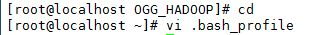

  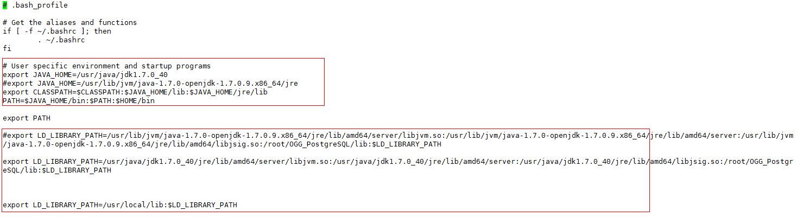

  Source环境变量，`source .bash_profile`.

  

  将`/opt/OGG_HADOOP/AdapterExamples/big-data`下的四个目录下的所有文件拷贝到`/opt/OGG_HADOOP/dirprm`目录下。

  

  

### 配置GoldenGate管理进程

* 编辑mgr.prm
  ```
  GGSCI> edit param mgr
  ```

  
  ```
  GGSCI>start mgr
  GGSCI>info all
  ```

  

### 配置GoldenGate HDFS 复制进程

* 编辑rhdfs.prm，在GGSCI命令行下运行`edit param rhdfs`命令：

  ```
  GGSCI> edit param rhdfs
  ```

  

* 编辑hdfs.props, 在GGSCI命令行下运行`shell vi dirprm/hdfs.props`命令：(shell之后接操作系统命令)

  ```
  GGSCI> shell vi dirprm/hdfs.props
  ```

  

* 需要在HDFS中创建/ogg1目录。

* 将hdfs.keytab文件拷贝到/opt/OGG_HADOOP/dirprm目录中：

  

* 把GoldenGate复制进程rhdfs加入到GoldenGate管理者进程中：

  ```
  GGSCI> add replicat rhdfs, exttrail dirdat/rs
  ```

  

  ```
  GGSCI>info all
  ```

  

  ```
  GGSCI>start rhdfs
  GGSCI>info all
  ```

  

### 配置GoldenGate HBase 复制进程

* 编辑rhbase.prm，在GGSCI命令行下运行`edit param rhbase`命令：

  ```
  GGSCI> edit param rhbase
  ```

  

* 编辑hbase.props, 在GGSCI命令行下运行`shell vi dirprm/hbase.props`命令：(shell之后接操作系统命令)

  ```
  GGSCI> shell vi dirprm/hbase.props
  ```

  

* 拷贝hbase.keytab和jaas.conf到`/opt/OGG_HADOOP/dirprm/`下：

  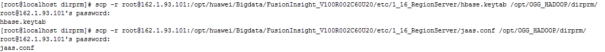

* jaas.conf 文件

  

* 把GoldenGate复制进程rhbase加入到GoldenGate管理者进程中：

  ```
  GGSCI> add replicat rhbase, exttrail dirdat/se
  ```

  

  ```
  GGSCI>start rhbase
  ```

  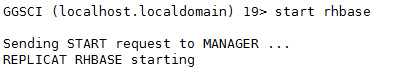

  ```
  GGSCI>info all
  ```

  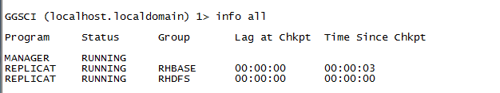

### 配置GoldenGate Kafka 复制进程

* 创建kafka消息，进入FusionInsight客户端`/opt/hadoopclient/Kafka/kafka/bin`

  

  Kafka创建消息：
  ```
  ./kafka-topics.sh --create --zookeeper 162.1.93.101:24002,162.1.93.102:24002,162.1.93.103:24002/kafka --replication-factor 1 --partitions 1 --topic test
  ```

  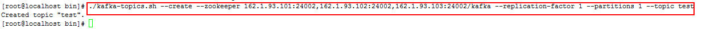

  Kafka查看消息：
  ```
  ./kafka-topics.sh --list --zookeeper  162.1.93.101:24002,162.1.93.102:24002,162.1.93.103:24002/kafka --topic test
  ```

  

  Kafka给消息授权：
  ```
  ./kafka-acls.sh --authorizer-properties zookeeper.connect=162.1.93.101:24002,162.1.93.102:24002,162.1.93.103:24002/kafka --add --operation All --allow-principal User:* --cluster --topic test
  ```

  

* 编辑rkafka.prm，在GGSCI命令行下运行`edit param rkafka`命令：

  ```
  GGSCI> edit param rkafka
  ```

  

* 编辑kafka.props, 在GGSCI命令行下运行`shell vi dirprm/kafka.props`命令：(shell之后接操作系统命令)

  ```
  GGSCI> shell vi dirprm/kafka.props
  ```

  

* 其中 **gg.handler.kafkahandler.BlockingSend** 属性控制同步和异步，默认false，异步。

  ```
  GGSCI> shell vi dirprm/custom_kafka_producer.properties
  ```

  

* 修改Kafka里的配置，将如下选项修改为True

  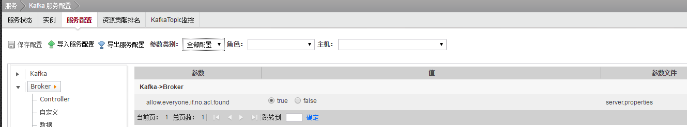

  

* 把GoldenGate复制进程rkafka加入到GoldenGate管理者进程中：

  ```
  GGSCI> add replicat rkafka, exttrail dirdat/rk
  ```

  

  ```
  GGSCI>start rkafka
  ```

  

  ```
  GGSCI>info all
  ```

  

### 配置GoldenGate Flume 复制进程

* 安装Flume客户端，配置非加密传输

  

  

* 配置Server的配置文件properties.properties

  

  

* 导出的properties.properties文件，增加如下配置：

  

* 可以在HDFS中增加/ogg/flume目录

* 将此properties.properties文件上传至FusionInsight。

  

* 编辑rflume.prm，在GGSCI命令行下运行`edit param rflume`命令：

  ```
  GGSCI> edit param rflume
  ```

  

* 编辑flume.props, 在GGSCI命令行下运行`shell vi dirprm/flume.props`命令：(shell之后接操作系统命令)

  ```
  GGSCI> shell vi dirprm/flume.props
  ```

  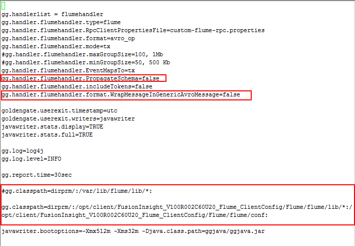

  gg.handler.flumehandler.PropagateSchema=false 控制DDL

  gg.handler.flumehandler.format.WrapMessageInGenericAvroMessage=false  相同SCHAME打包

  ```
  GGSCI> shell vi dirprm/custom-flume-rpc.properties
  ```

  

* 拷贝flume.keytab文件到`/opt/OGG_HADOOP/dirprm/`目录下

  

* 把GoldenGate复制进程rflume加入到GoldenGate管理者进程中：

  ```
  GGSCI> add replicat rflume, exttrail dirdat/rf
  ```

  

  ```
  GGSCI>start rflume
  ```

  

  ```
  GGSCI>info all
  ```

  

## 测试结果

### Oracle端启动所有的传输进程

* 确保所有传输进程均已经正常启动

  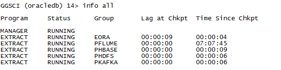

### 在Oracle数据库源端做Insert操作

  ```shell
  su – oracle
  source .bash_profile
  sqlplus test/welcome1@pdborcl
  ```

  

  

* 查看HDFS同步情况，`hadoop fs –ls /ogg1`

  

* 查看HBase同步情况

  ```
  hbase shell
  ```

  

* 查看kafka结果，进入kafka客户端`/opt/hadoopclient/Kafka/kafka/bin`

  执行以下命令：

  ```shell
  ./kafka-console-consumer.sh --zookeeper 162.1.93.101:24002,162.1.93.102:24002,162.1.93.103:24002/kafka --topic test --from-beginning
  ```

  

* 在HDFS中查看flume运行结果：查看/ogg/flume/下数据文件：

  


### 在Oracle数据库源端做Update操作

* 执行以下命令
  ```shell
  su – oracle
  source .bash_profile
  sqlplus test/welcome1@pdborcl
  ```

  

  

* 查看HDFS同步情况，`hadoop fs –ls /ogg1`

  

* 查看HBase同步情况

  ```
  hbase shell
  ```

  

* 查看kafka结果，进入kafka客户端`/opt/hadoopclient/Kafka/kafka/bin`

  执行以下命令：

  ```shell
  ./kafka-console-consumer.sh --zookeeper 162.1.93.101:24002,162.1.93.102:24002,162.1.93.103:24002/kafka --topic test --from-beginning
  ```

  

* 在HDFS中查看flume运行结果：查看/ogg/flume/下数据文件：

  

### 在Oracle数据库源端做Delete操作

* 执行以下命令
  ```shell
  su – oracle
  source .bash_profile
  sqlplus test/welcome1@pdborcl
  ```

  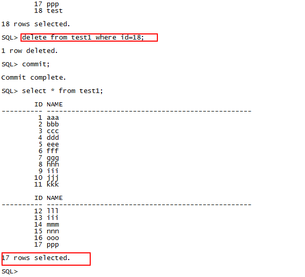

* 查看HDFS同步情况，hadoop fs –ls /ogg1

  

* 查看HBase同步情况

  ```shell
  hbase shell
  ```

  

* 查看kafka结果，进入kafka客户端`/opt/hadoopclient/Kafka/kafka/bin`

  执行以下命令：
  ```shell
  ./kafka-console-consumer.sh --zookeeper 162.1.93.101:24002,162.1.93.102:24002,162.1.93.103:24002/kafka --topic test --from-beginning
  ```

  

* 在HDFS中查看flume运行结果：查看/ogg/flume/下数据文件：

  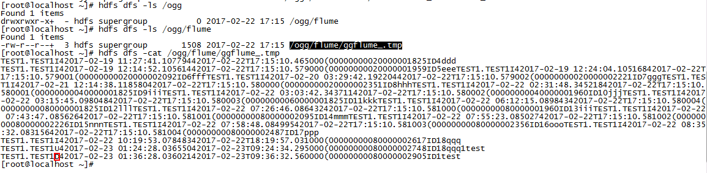
