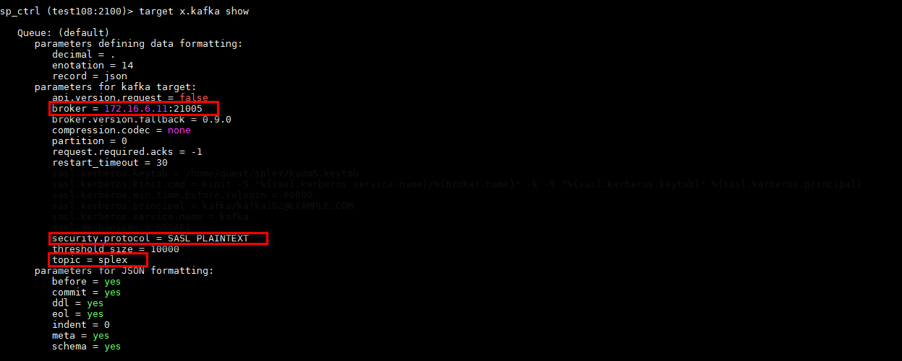
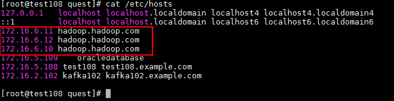
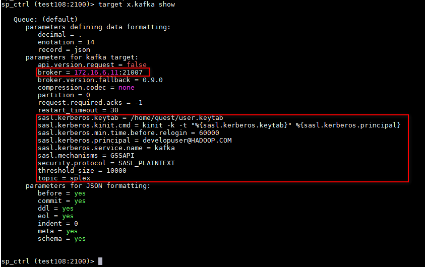
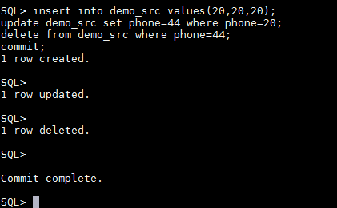
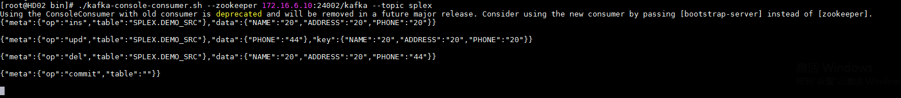

# SharePlex对接FusionInsight

## 适用场景

> SharePlex 9.2.1 <--> FusionInsight HD V100R002C80SPC200 (Kafka)
> SharePlex 9.2.1 <--> FusionInsight HD 6.5 (Kafka)

## 配置SharePlex上的kafka的post

根据对接模式不同，选择不同的对接方式

- 使用Kafka普通模式对接
- 使用Kafka安全模式对接

### 普通模式对接

1. 修改Kafka认证方式

   在FusionInsight服务端修改Kafka的配置参数`allow.everyone.if.no.acl.found`为 **True**，允许使用21005的普通接口进行对接

2. 配置SharePlex上的kafka的post配置

    ```
    target x.kafka set kafka broker = 172.16.6.11:21005
    target x.kafka set kafka security.protocol = PLAINTEXT
    target x.kafka set kafka topic = splex
    ```

    

### 安全模式对接

1. 修改/etc/hosts文件

   在SharePlex Linux for Open Target上修改hadoop集群所有的主机IP地址都对应到`hadoop.hadoop.com`,使得解析对应kafka service 的kerberos principal能够正确填写为`kafka/hadoop.hadoop.com@HADOOP.COM`

   

2. 配置SharePlex上的kafka的post配置

    ```
    target x.kafka set kafka broker = 172.16.6.11:21007
    target x.kafka set kafka sasl.kerberos.keytab = /home/quest/user.keytab
    target x.kafka set kafka sasl.kerberos.kinit.cmd = kinit -k -t "%{sasl.kerberos.keytab}" %{sasl.kerberos.principal}
    target x.kafka set kafka sasl.kerberos.min.time.before.relogin = 60000
    target x.kafka set kafka sasl.kerberos.principal = developuser@HADOOP.COM
    target x.kafka set kafka sasl.kerberos.service.name = kafka
    target x.kafka set kafka sasl.mechanisms = GSSAPI
    target x.kafka set kafka security.protocol = SASL_PLAINTEXT
    target x.kafka set kafka threshold_size = 10000
    target x.kafka set kafka topic = splex
    ```

    

## 启动kafka的post进程

执行`start post`

执行`show status`


## 验证Oracle的操作是否同步到Kafka

在Oracle端进行增删改操作



查看Kafka的Topic中是否上报对应的JSON消息


