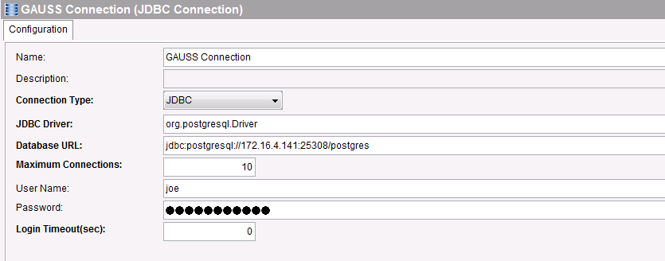
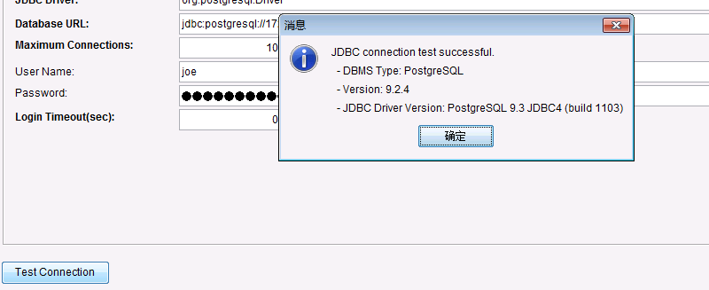

# TIBCO Business Works(BW) 5.13 对接GaussDB200

## 适用场景

>Tibco BW5.13 <--> GaussDB200

## 环境准备

  * 下载并安装Tibco BW5.13，参考Tibco官方文档
  https://docs.tibco.com/pub/activematrix_businessworks/5.13.0/doc/pdf/TIB_BW_5.13.0_installation.pdf?id=0
  * 安装完成后启动TIBCO Designer，创建一个新的空白工程

## 连接GaussDB
  * 获取GaussDB的驱动包gsjdbc4.jar，放在TIBCO安装目录`tpcl\version\jdbc`目录下，例如`C:\tibco\tpcl\5.10\jdbc`目录下

  * 在TIBCO Designer中，添加 一个新的process，这里取名为`getTable`

    

  * 在工程的`Shared Resources`中添加一个`JDBC Connection`，命名为`Gauss Connection`，并进行以下配置

    

    

    * JDBC Driver 为postgresql的驱动类名
    * Database URL为postgres连接字符串，格式为jdbc:postgresql://ip:port/postgresql,对于GaussDB，默认端口为25308
    * UserName和Password为数据库用户名密码

  * 点击`Test Connection`，弹出连接成功窗口
    

  * 双击进入`getTable`，从左侧的activity中拖入以下几个流程

    

  * 在`JDBC Query`中进行以下配置,点击右侧搜索标志，在弹出窗口中选择刚才创建的`GAUSS COnnection`,输入想要执行的SQL语句,这里是查询test表中的所有内容

    
      

  * 点击左下角`fetch`，会在Output页签中看到要查询的表的字段信息
    

  * 在左侧`tester`中点击执行按钮，选择`getTable`，`Load & Start Current`，可以看到任务执行成功。

   

   
  * 在`JDBC Query`的output中可以看到查询结果

    

  * 对于JDBC的其他操作，例如`JDBC Update，Call Procedure`配置类似，可参考TIBCO的官方文档
  http://tutorialspedia.com/jdbc-call-procedure-tutorial/
