# Talend对接FusionInsight

## 适用场景

> Talend 7.2.1 <--> FusionInsight MRS 8.0 (HDFS/HBase/Hive)

说明： talend 7.2.1版本不支持对接hetu

## 准备工作

* 登录FusionInsight Manager创建一个“人机”用户，例如：developuser，具体请参见FusionInsight HD产品文档的`管理员指南->系统设置->权限设置->用户管理->创建用户`章节。给developuser用户授予所有访问权限，包含但不限于HDFS、HIVE、HBASE。

* 登录FusionInsight Manager的`系统->用户->更多（developuser）->下载认证凭证`，下载developuser对应的认证凭证。解压后，将krb5.conf和user.keytab放在`E:\195config\`目录下(developuser文件夹不存在则创建)，复制krb5.conf文件并重命名为krb5.ini，放在`C:\Windows`目录下。

* 已完成FusionInsight HD客户端安装，具体请参见FusionInsight HD产品文档的`应用开发指南->安全模式->安全认证->配置客户端文件`章节。FusionInsight HD客户端解压于本地`E:\195config\FusionInsight_Cluster_1_Services_ClientConfig`

* Zookeeper的Kerberos认证需要指定jaas配置文件。创建连接zookeeper的jaas配置文件，如`E:\195config\jaas.conf`，内容格式如下：
  ```
  Client {
  com.sun.security.auth.module.Krb5LoginModule required
  useKeyTab=true
  keyTab="E:\195config/user.keytab"
  principal="developuser@HADOOP.COM"
  useTicketCache=false
  storeKey=true
  debug=true;
  };
  ```

* 本地`C:\Windows\System32\drivers\etc\hosts`已添加FusionInsight集群节点的IP与hostname的映射。

* 本地已安装Hadoop服务（可从<https://hadoop.apache.org/releases.html>下载Hadoop二进制），该项可选。如果本地没安装Hadoop服务，talend在运行过程中会出现与Hadoop相关的错误日志，但不影响实际运行结果。

## 安装Talend

### 操作场景
安装Talend Open Studio for Big Data

### 操作步骤

* 从<https://www.talend.com/products/big-data/big-data-open-studio/>下载Window版的Talend。

  

* 解压下载安装包，点击TOS_BD-win-x86_64.exe启动Talend Open Studio for Big Data。点击`我同意`。

  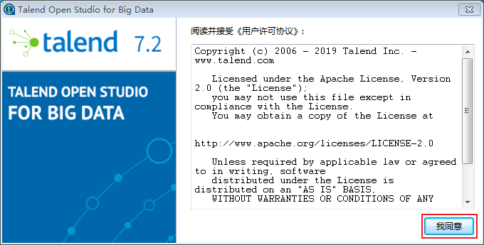

* 点击`完成`，默认创建Local_Project的工程。

  

* 选择安装必须的第三方库，点击`Finish`。

  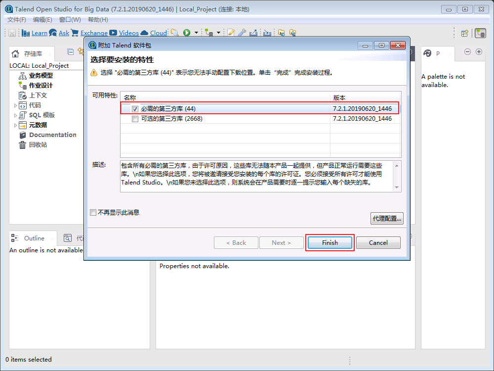

* 选择`我接受所选许可协议的条款`，点击`全部接受`。

  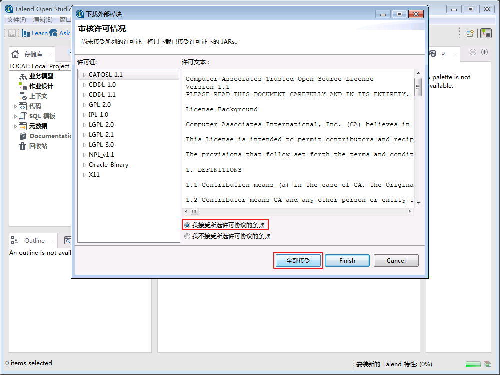

* 在右下角可看到安装进度。

  

## 创建Hadoop服务

### 操作场景

创建包含HDFS、HIVE服务的Hadoop集群

### 前提条件

* 已完成准备工作。

* 将FusionInsight客户端HDFS、HIVE以下相关的配置文件拷贝至`E:\195config\config`目录下。

  * `E:\195config\FusionInsight_Cluster_1_Services_ClientConfig\HDFS\config`的hdfs-site.xml、core-site.xml。

  * `E:\195config\FusionInsight_Cluster_1_Services_ClientConfig\Hive\config`的hive-site.xml、hivemetastore-site.xml。

  * `E:\195config\FusionInsight_Cluster_1_Services_ClientConfig\Yarn\config`的mapred-site.xml、yarn-site.xml。

### 操作步骤

#### 创建Hadoop集群

* 打开`Talend Open Studio for Big Data`，选择`元数据->Hadoop Cluster`，右键`Hadoop Cluster`选择`Create Hadoop Cluster`。

  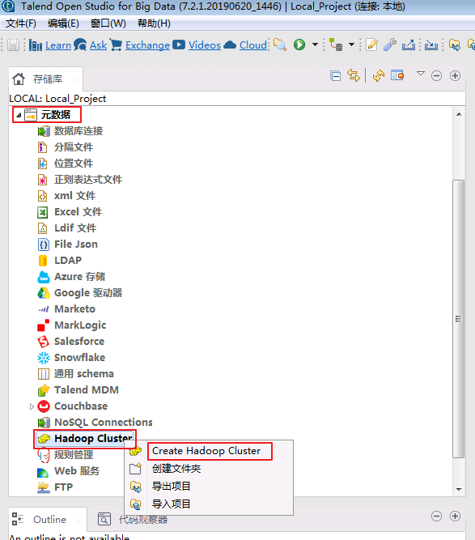

* “名称”输入“FusionInsight”，点击`Next`。

  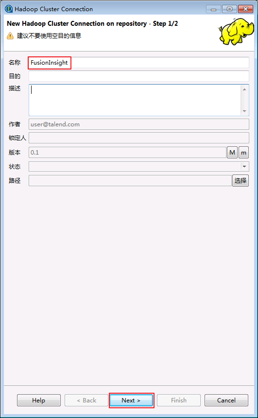

* 选择`从本地文件导入配置`，点击`Next`。

  

* 点击`浏览`，选择目录`E:\195config\config`，默认全选，点击`Finish`。

  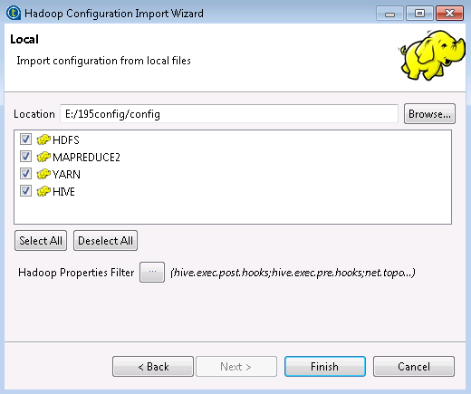

* 先修改Namenode URI的值为`hdfs://172.16.10.132:25000`，其中172.16.10.132为主namenode ip，然后“Distribution”选择`Custom - Unsuported`，点击下拉框右边的按钮导入HDFS、HIVE相关的jar包。

  

* 点击`Cancel`取消自动弹出的“导入自定义的定义”窗口。

  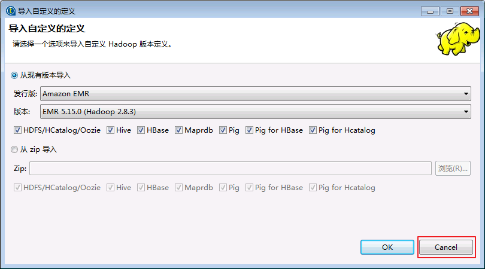

* 选择“HDFS/HCatalog/Oozie”，点击按钮添加HDFS相关的jar包。

  

* 选择`外部库`，点击`浏览`，选择`E:\195config\FusionInsight_Cluster_1_Services_ClientConfig\HDFS\FusionInsight-Hadoop-3.1.1.tar.gz\hadoop\share\hadoop\hdfs`目录下所有的jar包，点击`OK`导入jar包。

* 按照同样的方法，选择“HDFS/HCatalog/Oozie”，导入`E:\195config\FusionInsight_Cluster_1_Services_ClientConfig\HDFS\FusionInsight-Hadoop-3.1.1.tar.gz\hadoop\share\hadoop\common`和`E:\195config\FusionInsight_Cluster_1_Services_ClientConfig\HDFS\FusionInsight-Hadoop-3.1.1.tar.gz\hadoop\share\hadoop\common\lib`目录下所有的jar包。

  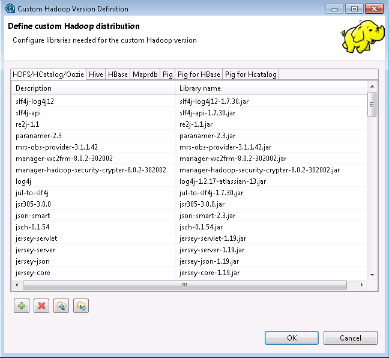

* 按照同样的方法，选择“Hive”，导入`E:\195config\FusionInsight_Cluster_1_Services_ClientConfig\Hive\jdbc`目录下所有的jar包。

  


* 配置Kerberos认证。“Custom->Authentication”选择`Kerberos`。

  * 勾选`Authentication->Enable Kerberos security`，输入信息如下：

    ```
    Namenode Principal = hdfs/hadoop.hadoop.com@HADOOP.COM
    资源管理器主体 = mapred/hadoop.hadoop.com@HADOOP.COM
    作业历史记录主体 = mapred/hadoop.hadoop.com@HADOOP.COM

    备注：
    Namenode Principal的取值为hdfs-site.xml的dfs.namenode.kerberos.principal的value值；
    资源管理器主体的取值为yarn-site.xml的yarn.resourcemanager.principal的value值；
    作业历史记录主体的取值为mapred-site.xml的mapreduce.jobhistory.principal的value值。
    ```

  * 勾选`Authentication->Use a keytab to authenticate`，输入信息如下：

    ```
    Principal = developuser
    Keytab = E:/195config/user.keytab

    备注：
    Principal为FusionInsight Manager的用户名，Keytab为用户developuser的认证凭据。
    ```

    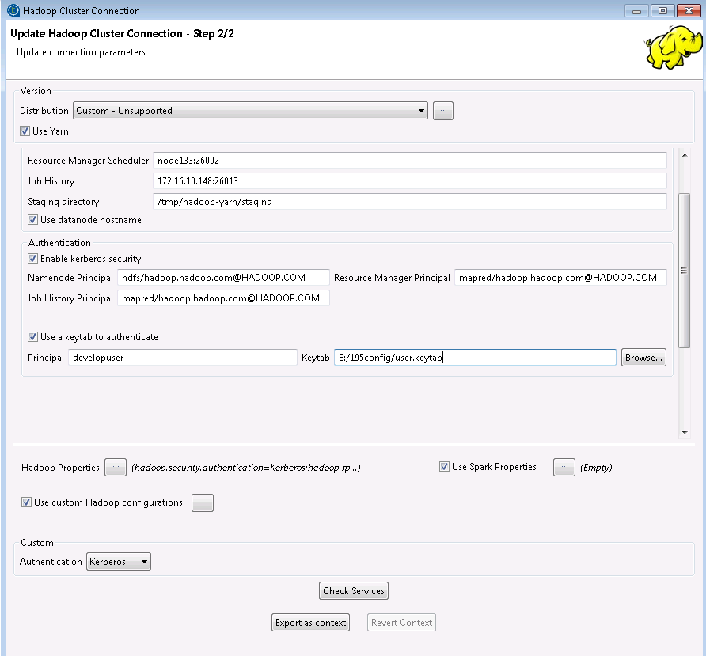

* 配置Hadoop属性，点击`Hadoop属性`右边的按钮。

  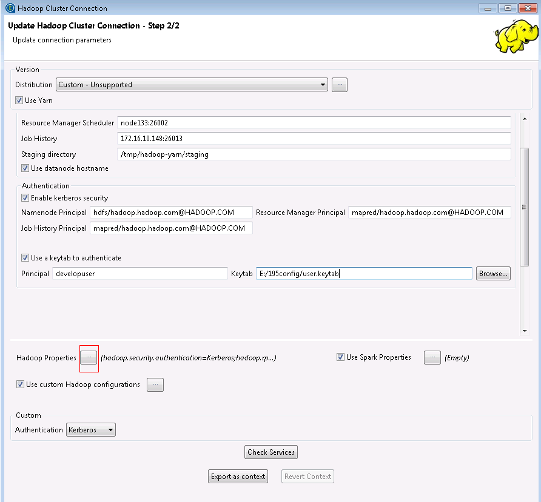

* 点击按钮，增加以下Hadoop属性。增加完毕，点击`OK`。

  * 增加core-site.xml的hadoop.security.authentication和hadoop.rpc.protection的属性及其对应的value值；

  * 增加hdfs-site.xml的dfs.namenode.rpc-address.hacluster.\*，dfs.ha.namenodes.hacluster、dfs.nameservices、dfs.client.failover.proxy.provider.hacluster的属性及其对应的value值。

  **配置示例如下：**

  ```
  hadoop.security.authentication = Kerberos
  hadoop.rpc.protection = privacy
  ```

  

* 确认默认勾选`使用自定义Hadoop属性`，点击`检查服务`。

  

* 检查返回100%，则Hadoop集群配置成功，点击`Close`。如果返回错误日志，则根据错误日志提示修正问题后，重新点击`检查服务`，直至检查返回100%。

  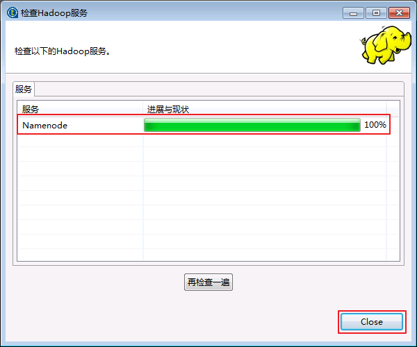

* 点击`Finish`，则可在`元数据->Hadoop Cluster`看到新建的“FusionInsight”集群，包含HDFS、HIVE服务。


#### 配置HIVE服务

* 选择`元数据->Hadoop Cluster->FusionInsight->Hive(1)->FusionInsight_HIVE`，右键`FusionInsight_HIVE`选择`Edit Hive`。

  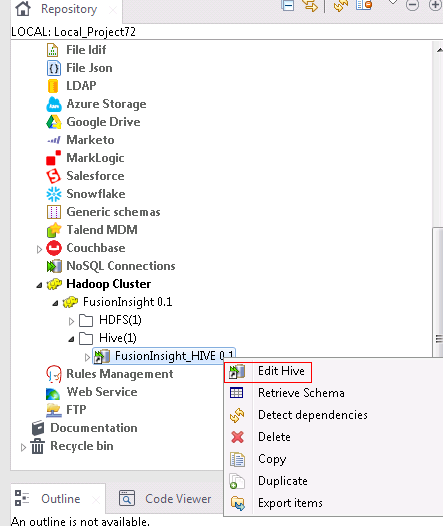

* 点击`Next`。

  

* 需要更新的配置如下，其余的保持不变。
  ```
  hive模式 = Standalone
  hive服务器版本 = Hive Server2 -- jdbc:hive2://
  登录名 = developuser
  密码 = Huawei@123
  服务器 = 172.16.10.131:24002,172.16.10.132:24002,172.16.10.133
  端口 = 24002
  DataBase = default
  附加JDBC设置 = ;serviceDiscoveryMode=zooKeeper;zooKeeperNamespace=hiveserver2;sasl.qop=auth-conf;auth=KERBEROS;user.principal=developuser;user.keytab=E:/195config/user.keytab

  说明：以上信息可根据JDBC方式连接Hive服务的配置填写。
  ```

  

* 点击`测试连接`，返回连接成功，点击`OK`，点击`Finish`完成配置。

  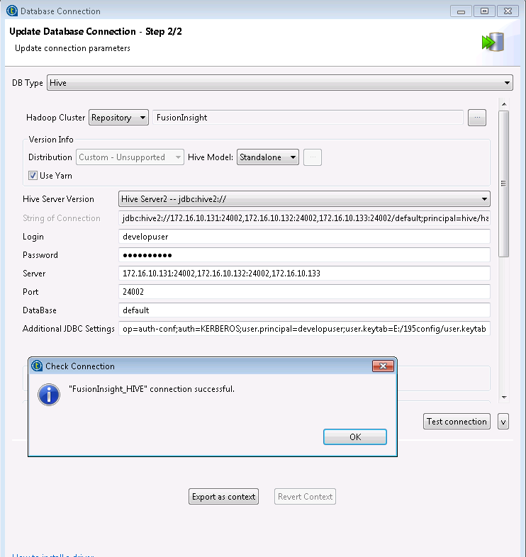

## Talend对接FusionInsight HDFS

### 操作场景

Talend中配置HDFS解析器，对接FusionInsight HDFS接口，并从Fusion Insight集群的HDFS文件系统下载文件至本地，或者将本地文件上传至Fusion Insight集群的HDFS文件系统。

### 前提条件

* 已完成准备工作

* 已完成Talend Open Studio for Big Data的安装

* 已创建包含HDFS服务的Hadoop集群

### HDFS Connection 操作步骤

  * 选择`作业设计`，右键选择`创建作业`。

    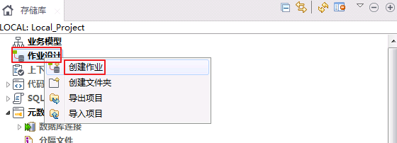

  * “名称”输入“hdfsConnection”，点击`Finish`。

    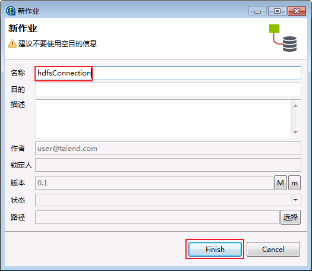

  * 选择作业`hdfsConnection`，在Palette面板输入“hdfsConnection”搜索，将搜索返回的“tHDFSConnection”组件拖至Disigner区。

    

  * 点击选中“tHDFSConnection_1”，切换至“组件”，“属性类型”选择`存储库`，点击右边的按钮选择`FusionInsight_HDFS`。如果提示“此组件tHDFSConnection需要至少安装一个外部jar。”，则点击`安装`。

    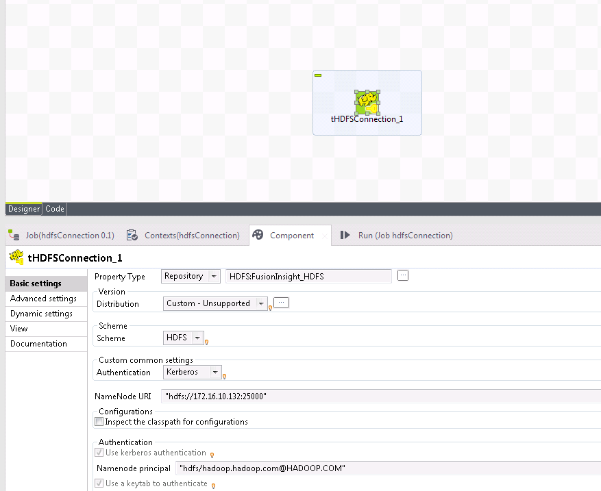

  * 点击`下载并安装所有可用的模块`。

    

  * 等待所有可用的模块下载并安装完之后，切换至“运行（作业hdfsConnection）”，点击`运行`按钮。返回结果如下图所示，则表示Talend对接FusionInsight HDFS成功。

    

### HDFS Get操作步骤

从Fusion Insight集群的HDFS文件系统下载文件至本地。

  * 登录FusionInsight集群客户端，执行`hdfs dfs -ls /tmp`命令确认`/tmp`目录已存在文件“getFromHdfs.csv”，内容随意。

    

  * 创建作业“hdfsGet”，加入tHDFSConnection、tHDFSGet组件。

    

  * 点击选中`tHDFSConnection_1`，右键选择`触发器->子作业正常时`，连接至tHDFSGet_1。

    

    

  * 点击选中`tHDFSConnection_1`组件，“属性类型”选择`存储库`，点击右边的按钮选择`FusionInsight_HDFS`。

    

  * 点击选中`tHDFSGet_1`组件，勾选`使用一个现有连接`，“组件列表”选择`tHDFSConnection_1`，“HDFS目录”选择`/tmp`，“本地目录”选择`C:/talend/testFile`(可选择任意的本地目录)，在“文件掩码”输入在HDFS的/tmp目录下需要获取的文件名称`getFromHdfs.csv`。

    

  * 切换至“运行（作业hdfsGet）”，点击`运行`按钮。返回结果如下图所示，则表示Talend从FusionInsight HDFS下载文件成功。

    

  * getFromHdfs.csv已下载至本地`C:\talend\testFile`。

    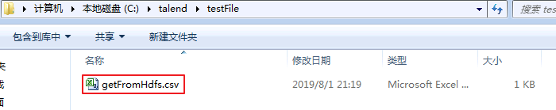


### HDFS Put 操作步骤

从本地上传文件至Fusion Insight集群的HDFS文件系统。

  * 创建作业“hdfsPut”，加入tHDFSConnection、tHDFSPut组件，tHDFSConnection_1的子作业正常时执行tHDFSPut_1。

    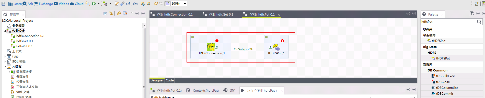

  * 点击选中`tHDFSConnection_1`组件，“属性类型”选择`存储库`，点击右边的按钮选择`FusionInsight_HDFS`。

    

  * 点击选中`tHDFSPut_1`组件，勾选`使用一个现有连接`，“组件列表”选择`tHDFSConnection_1`，“本地目录”选择`C:/talend/testFile`，“HDFS目录”选择`/tmp`，在“文件掩码”输入需要上传至HDFS文件系统的文件名称`putToHdfs.csv`。

  说明：`C:/talend/testFile/putToHdfs.csv`为本地已存在文件，内容随意。

    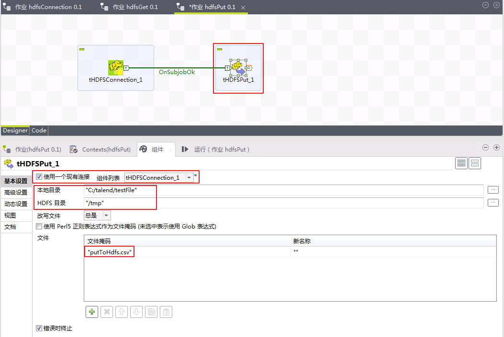

  * 切换至“运行（作业hdfsPut）”，点击`运行`按钮。返回结果如下图所示，则表示从Talend上传文件putToHdfs.csv至FusionInsight HDFS文件系统成功。

    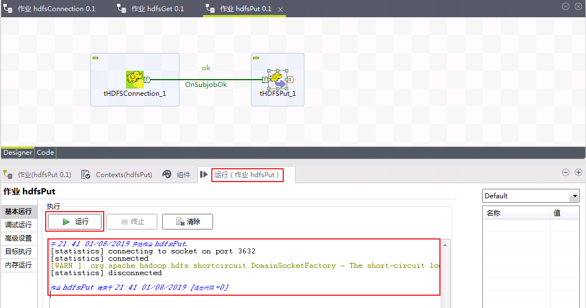

  * 登录FusionInsight集群客户端，执行`hdfs dfs -ls /tmp`命令检查putToHdfs.csv已上传至`/tmp`目录。

    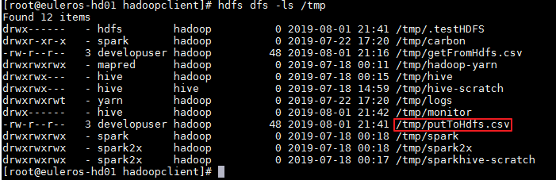

## Talend对接FusionInsight Hive

### 操作场景

Talend中配置JDBC解析器，对接FusionInsight Hive接口，进行建表、查表、插入数据等操作。

### 前提条件

* 已完成准备工作

* 已完成Talend Open Studio for Big Data的安装

* 已创建包含Hive服务的Hadoop集群和完成Hadoop集群的Hive服务配置。

### Hive Connection 操作步骤

  * 选择`作业设计`，右键选择`创建作业`。

    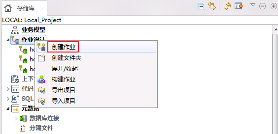

  * “名称”输入“hiveConnection”，点击`Finish`。

    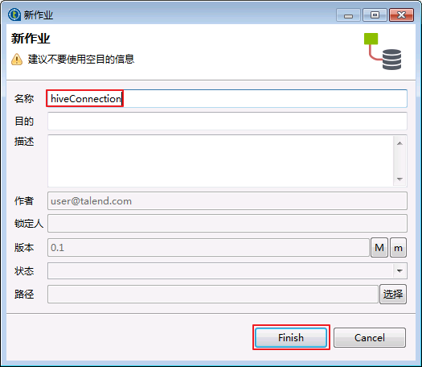

  * 选择作业`hiveConnection`，加入tHiveConnection、tHiveClose组件。

    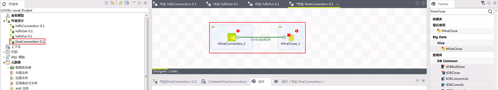

  * 点击选中“tHiveConnection_1”，切换至“组件”，“属性类型”选择`存储库`，点击右边的按钮选择`FusionInsight_HIVE`。

    

  * 点击选中“tHiveClose_1”，切换至“组件”，“组件列表”选择`tHiveConnection_1`。

    

  * 切换至“运行（作业hiveConnection）”，点击`运行`按钮。返回结果如下图所示，则表示Talend对接FusionInsight Hive成功。

    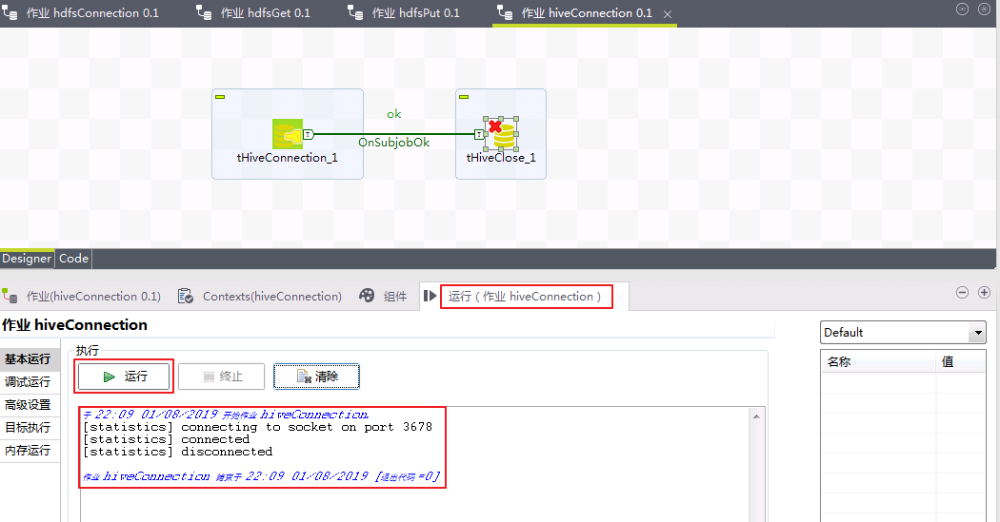

### Hive Create Table 操作步骤

使用Talend创建表talendHiveCreate，并将/tmp/putToHdfs.csv的数据传入表talendHiveCreate。

  * 登录FusionInsight集群客户端，执行`hdfs dfs -ls /tmp`命令确认`/tmp`目录已存在文件“putToHdfs.csv”。

    

    **putToHdfs.csv的内容如下(包含两列，两列之间用分号隔开)：**
    ```
    1;EcitQU
    2;Hyy6RC
    3;zju1jR
    4;R9fex9
    5;EU2mVq
    ```

  * 创建作业“hiveCreateTable”，加入tHiveConnection、tHiveCreateTable、tHiveLoad、tHiveClose组件，上一个组件的子作业正常时执行下一个组件。

    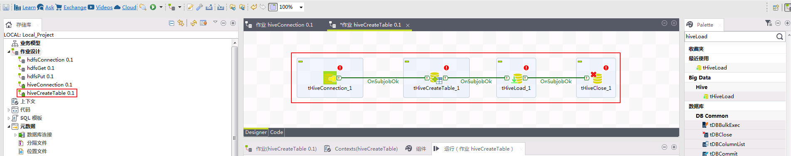

  * 点击选中“tHiveConnection_1”，切换至“组件”，“属性类型”选择`存储库`，点击右边的按钮选择`FusionInsight_HIVE`。

    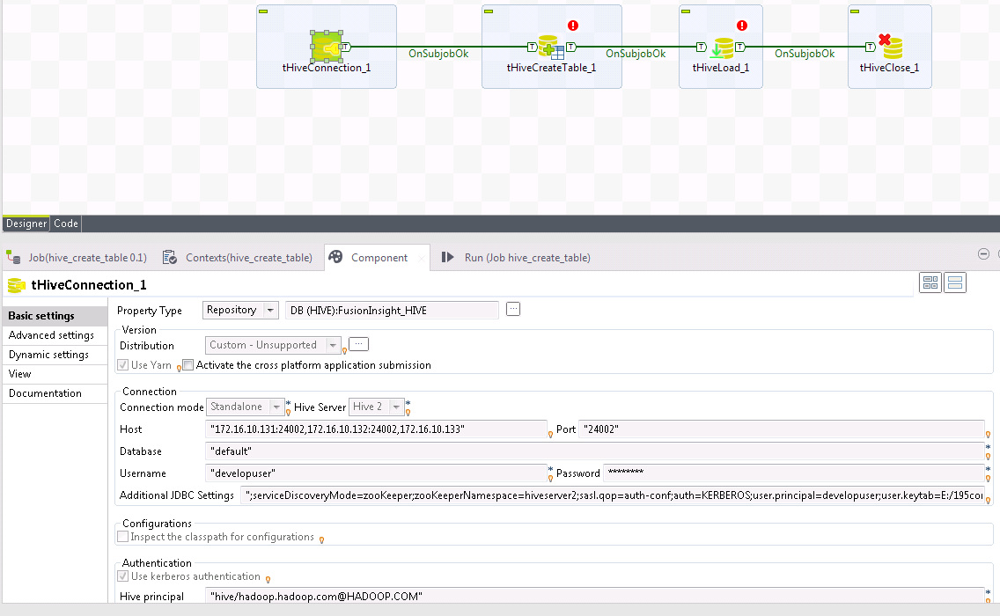

  * 点击选中“tHiveCreateTable_1”，勾选`使用一个现有连接`，“组件列表”选择`tHiveConnection_1`，点击“编辑schema”右边的按钮设计表结构为两列，列名分别id和name，“表名称”输入`talendHiveCreate`，“表操作”选择`如果表不存在则创建表`，“格式”选择`文本文件`，其余选项为默认。

    

  * 点击选中“tHiveLoad_1”，勾选`使用一个现有连接`，“组件列表”选择`tHiveConnection_1`，“加载操作”选择`加载`，“文件路径”输入`/tmp/putToHdfs.csv`，“表名称”输入`talendHiveCreate`，其余选项默认。

    

  * 点击选中“tHiveClose_1”，“组件列表”选择`tHiveConnection_1`。

    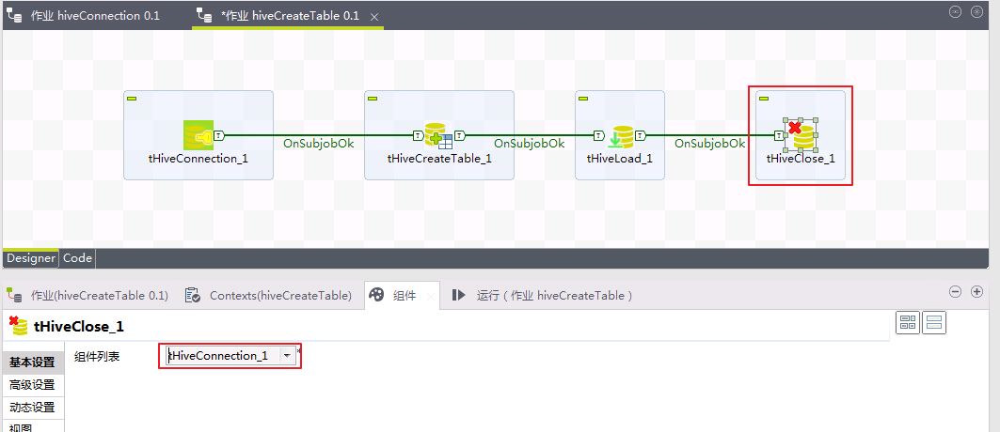

  * 切换至“运行（作业hiveCreateTable）”，点击`运行`按钮。返回结果如下图所示，则表示Talend使用Hive创建表talendHiveCreate，并将putToHdfs.csv的数据输入到表talendHiveCreate成功。

    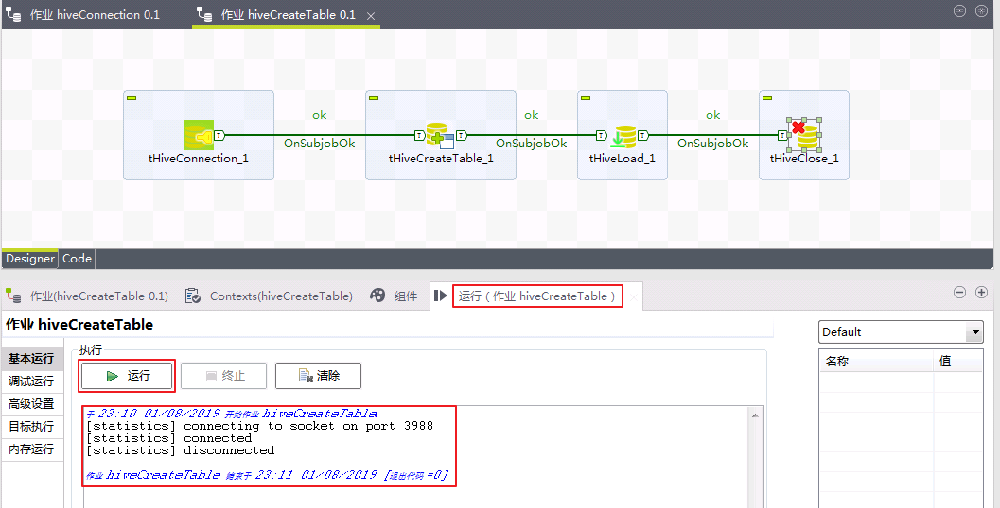

  * 登录FusionInsight集群客户端，使用beeline执行`select * from talendHiveCreate;`命令查询表`createdTableTalend`。

    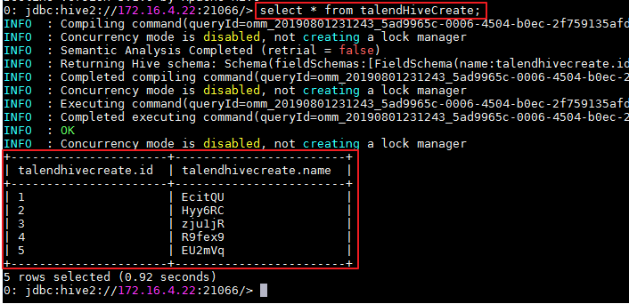

### Hive Input 操作步骤

使用Talend查询Hive表的数据。

  * 确认已存在表talendHiveCreate。登录FusionInsight集群客户端，使用beeline执行`select * from talendHiveCreate;`命令查询表`createdTableTalend`，返回数据如下。

    

  * 创建作业“hiveInput”，加入tHiveConnection、tHiveInput、tHiveClose、tLogRow组件，上一个组件的子作业正常时执行下一个组件。

    

  * 点击选中“tHiveConnection_1”，切换至“组件”，“属性类型”选择`存储库`，点击右边的按钮选择`FusionInsight_HIVE`。

    

  * 点击选中“tHiveInput_1”，勾选`使用一个现有连接`，“组件列表”选择`tHiveConnection_1`，点击“编辑schema”右边的按钮设计表结构为两列，列名分别id和name，“表名称”输入`talendHiveCreate`，“查询”输入`"select * from talendHiveCreate"`，其余选项默认。

    

  * 点击选中“tHiveClose_1”，“组件列表”选择`tHiveConnection_1`。

    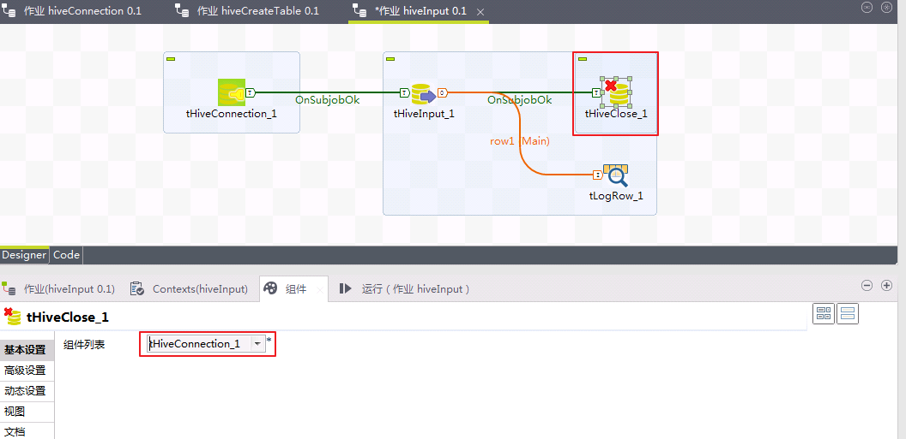

  * tLogRow组件使用默认配置。

  * 切换至“运行（作业hiveInput）”，点击`运行`按钮。返回结果如下图所示，则表示Talend查询表`createdTableTalend`数据成功。

    

### Hive Row 操作步骤

使用Talend插入数据至Hive表。

* 确认已存在表talendHiveCreate。登录FusionInsight集群客户端，使用beeline执行`select * from talendHiveCreate;`命令查询表`createdTableTalend`，返回数据如下。

  

* 创建作业“hiveRow”，加入tHiveConnection、tHiveRow、tHiveClose组件，上一个组件的子作业正常时执行下一个组件。

  

* 点击选中“tHiveConnection_1”，切换至“组件”，“属性类型”选择`存储库`，点击右边的按钮选择`FusionInsight_HIVE`。

  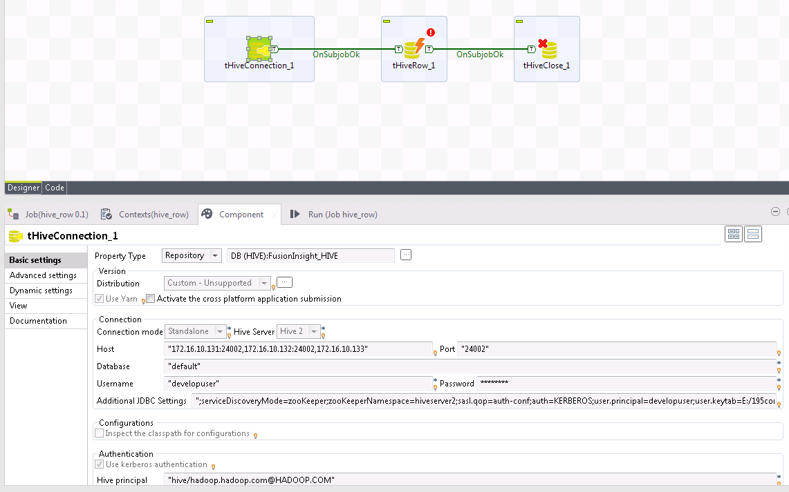

* 点击选中“tHiveRow_1”，勾选`使用一个现有连接`，“组件列表”选择`tHiveConnection_1`，点击“编辑schema”右边的按钮设计表结构为两列，列名分别id和name，“表名称”输入`talendHiveCreate`，“查询”输入`"insert into talendHiveCreate values(123,'shenzhen')"`，其余选项默认。

  

* 点击选中“tHiveClose_1”，“组件列表”选择`tHiveConnection_1`。

  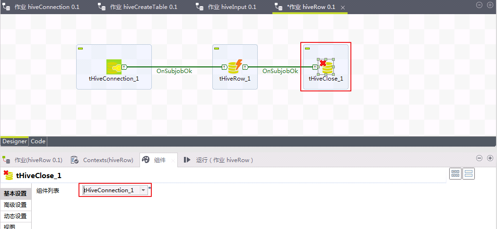


* 切换至“运行（作业hiveRow）”，点击`运行`按钮。返回结果如下图所示，则表示Talend插入表`createdTableTalend`数据成功。

  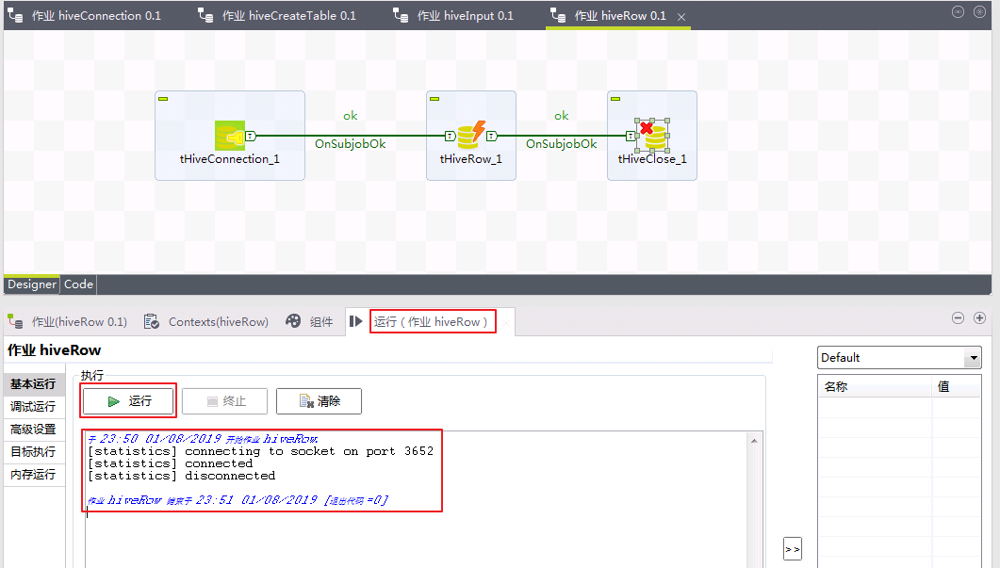

* 登录FusionInsight集群客户端，使用beeline执行`select * from talendHiveCreate;`命令查询表`createdTableTalend`，返回数据已包含新增的数据。

  

## Talend对接FusionInsight HBase

### 操作场景

Talend中配置HBase解析器，对的FusionInsight HBase接口，进行建表、查询、插入数据等操作。

### 前提条件

* 已完成准备工作

* 已完成Talend Open Studio for Big Data的安装

* 已在IntelliJ IDEA使用`Import project from external model ~ Eclipse`方式导入`C:\talend\FusionInsight_Cluster_1_Services_ClientConfig\HBase\hbase-example`，并且调测TestMain.java通过。

### HBase Connection 操作步骤

* 导出FusionInsight HD客户端中Hbase样例代码中的LoginUtil类。

  * 在IntelliJ IDEA打开`C:\talend\FusionInsight_Cluster_1_Services_ClientConfig\HBase\hbase-example`工程，选择`File > Project Structure...`菜单项。

    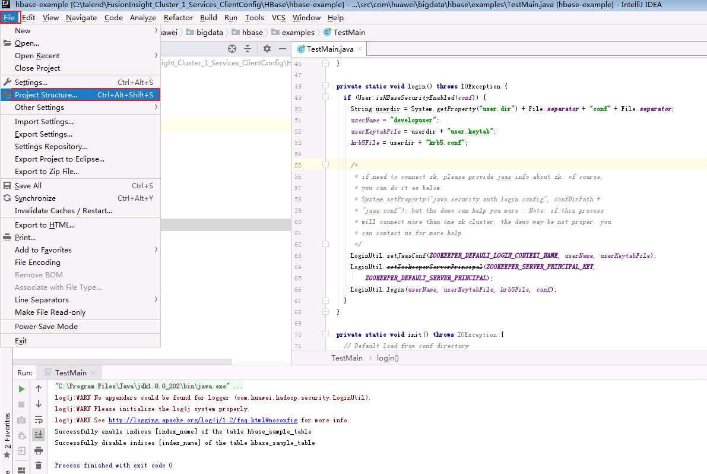

  * 选择`Artifacts->Add->JAR->Empty`。

    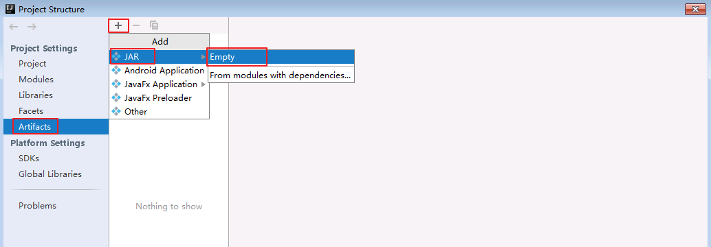

  * 导出jar包的名称设置为`hbase-loginUtil.jar`，“Output directory”选择`C:\talend\testFile`，双击“Available Elements”的`'hbase-example' compile output`将它加载到左边列表，点击`OK`。

    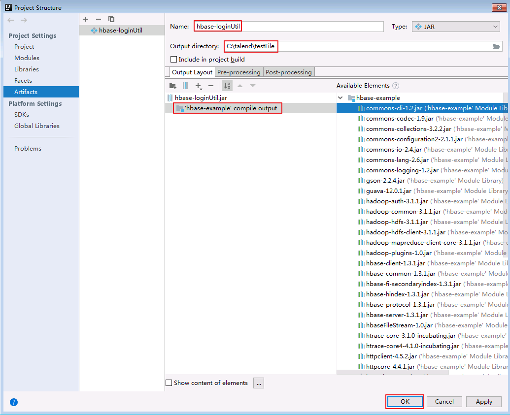

  * 选中“hbase-example”工程com.huawei.hadoop.security的LoginUtil.java，选择`Build->Build Artifacts...`

    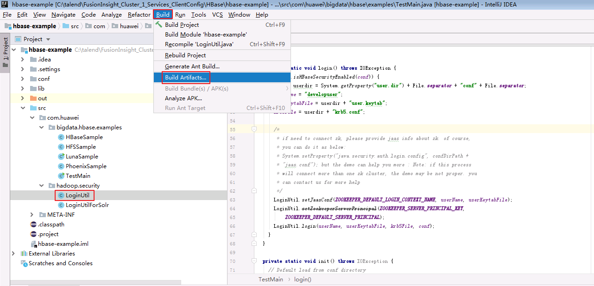

  * 选择`hbase-loginUtil.jar->Build`。

    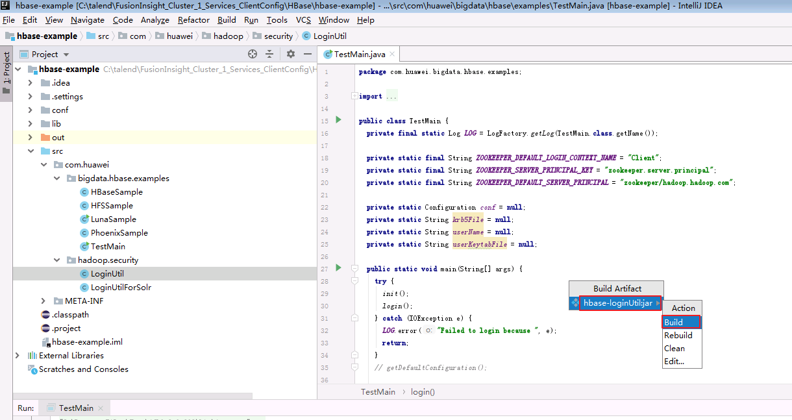

  * 编译完成后，在本地`C:\talend\testFile`产生“hbase-loginUtil2.jar”。

    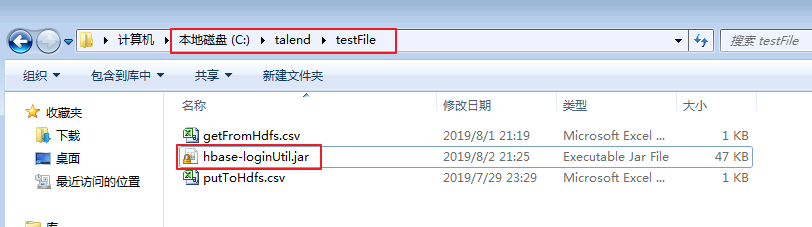

* 选择`作业设计`，右键选择`创建作业`。

  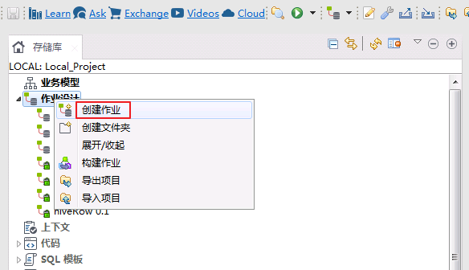

* “名称”输入“hbaseConnection”，点击`Finish`。

  

* 选择作业`hbaseConnection`，加入tLibraryLoad、tHBaseConnection、tJava、tHBaseClose组件，上一个组件的子作业正常时执行下一个组件。

  

* 点击选中“tLibraryLoad_1”，切换至“组件”，点击右边的按钮选择模块。在弹出窗口，选择`构建库（local m2/nexus）`，选择`安装一个新模块`并选择文件`C:\talend\testFile\hbase-loginUtil.jar`，然后点击`检测模块安装状态`，检测没问题则`OK`按钮激活，点击`OK`。

  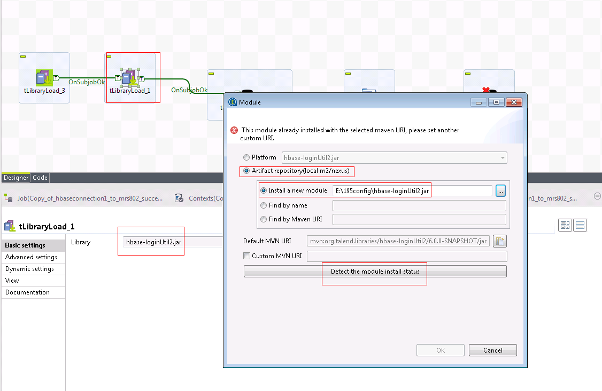

  注意：如果已经安装过，可以直接使用talend的mvn uri导入

  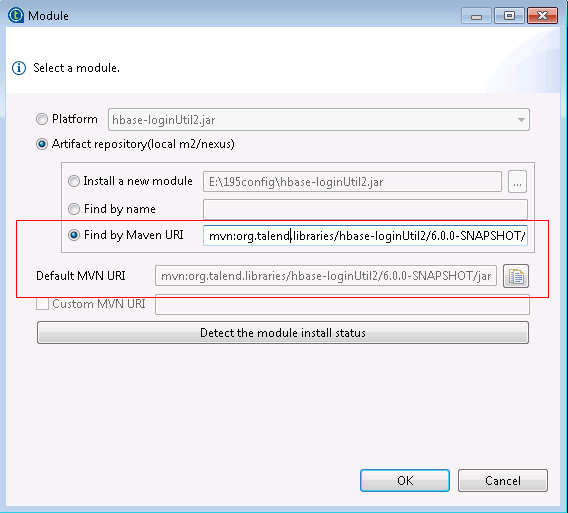

* 点击选中“tLibraryLoad_3”，切换至“组件”，点击右边的按钮选择模块。在弹出窗口，选择`构建库（local m2/nexus）`，选择`安装一个新模块`并选择文件`E:\195config\FusionInsight_Cluster_1_Services_ClientConfig\HBase\FusionInsight-HBase-2.2.3.tar.gz\hbase\lib\zookeeper-3.5.6-hw-ei-302002.jar`，然后点击`检测模块安装状态`，检测没问题则`OK`按钮激活，点击`OK`。

  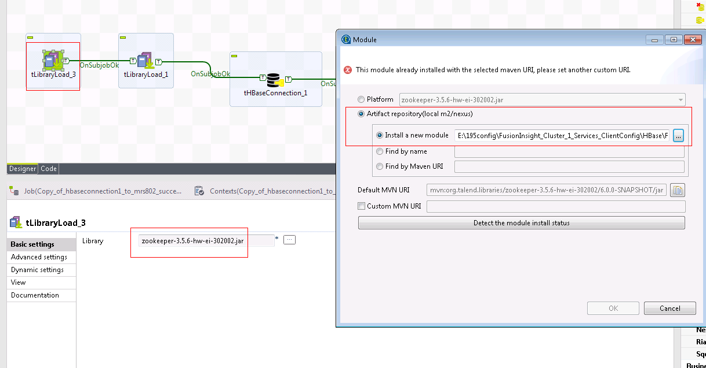

  注意：如果已经安装过，可以直接使用talend的mvn uri导入

  

* 点击选中“tHBaseConnection_1”，配置如下：

  

  选用cdh 6.1.1作为匹配版本对接

* 点击选中“tJava_1”。
  * 在“基本设置”的“代码”中输入HBase配置相关的代码。

    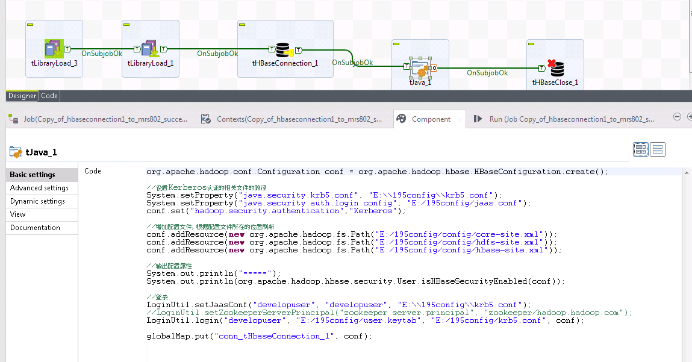

    **代码示例如下：**

    ```
    org.apache.hadoop.conf.Configuration conf = org.apache.hadoop.hbase.HBaseConfiguration.create();

    //设置Kerberos认证的相关文件的路径
    System.setProperty("java.security.krb5.conf", "E:\\195config\\krb5.conf");
    System.setProperty("java.security.auth.login.config", "E:/195config/jaas.conf");
    conf.set("hadoop.security.authentication","Kerberos");

    //增加配置文件，根据配置文件所在的位置刷新
    conf.addResource(new org.apache.hadoop.fs.Path("E:/195config/config/core-site.xml"));
    conf.addResource(new org.apache.hadoop.fs.Path("E:/195config/config/hdfs-site.xml"));
    conf.addResource(new org.apache.hadoop.fs.Path("E:/195config/config/hbase-site.xml"));

    //输出配置属性
    System.out.println("=====");
    System.out.println(org.apache.hadoop.hbase.security.User.isHBaseSecurityEnabled(conf));

    //登录
    LoginUtil.setJaasConf("developuser", "developuser", "E:\\195config\\krb5.conf");
    //LoginUtil.setZookeeperServerPrincipal("zookeeper.server.principal", "zookeeper/hadoop.hadoop.com");
    LoginUtil.login("developuser", "E:/195config/user.keytab", "E:/195config/krb5.conf", conf);

    globalMap.put("conn_tHbaseConnection_1", conf);
    ```

  * 在“tJava_1”的“高级设置”的“导入”输入`import com.huawei.hadoop.security.LoginUtil;`，

    

* 点击选中“tHBaseClose_1”，“组件列表”选择`tHBaseConnection_1`。

  

* 切换至“运行（作业hbaseConnection）”，点击`运行`按钮。首先先在Advanced settings下面自定义jvm参数，然后点击运行返回结果如下图所示，则表示Talend对接FusionInsight HBase成功。

  

  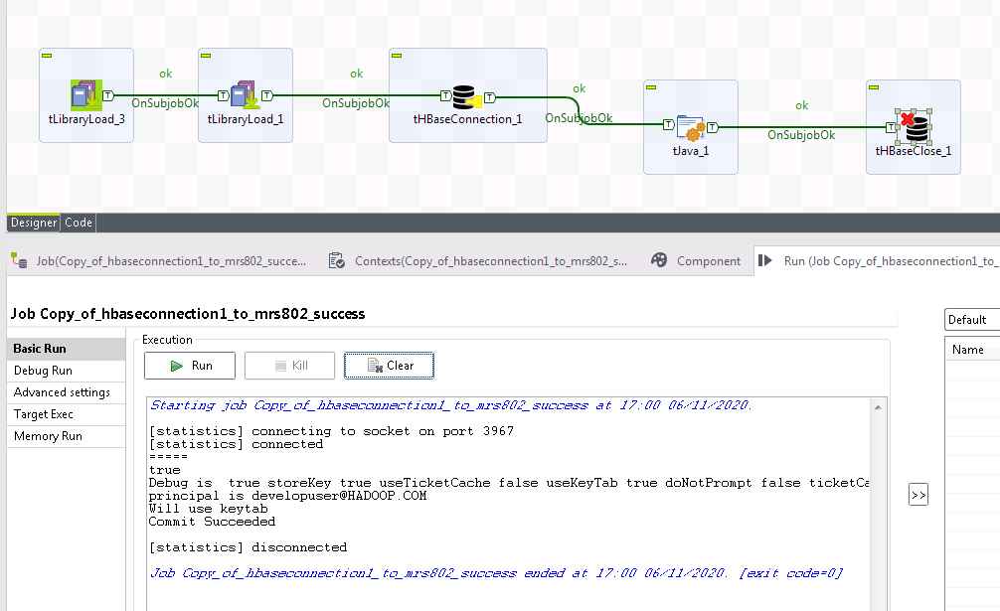

### HBase Input Output 操作步骤

Talend通过FusionInsight HBase接口对接成功后，创建表talendHbaseCreate，将本地`E:/soft/talend/putToHdfs.csv`的数据传入表talendHbaseCreate，并且从表talendHbaseCreate查询返回数据。

* 确认本地已存在`E:/soft/talend/putToHdfs.csv`。

  **putToHdfs.csv内容如下：**

  ```
  1;EcitQU
  2;Hyy6RC
  3;zju1jR
  4;R9fex9
  5;EU2mVq
  ```

* 创建作业“hbaseInputOutput”，加入tLibraryLoad、tHBaseConnection、tJava、tHBaseClose、tFileInputDelimited、tHBaseOutput、tHBaseInput、tLogRow组件，上一个组件的子作业正常时执行下一个组件。

  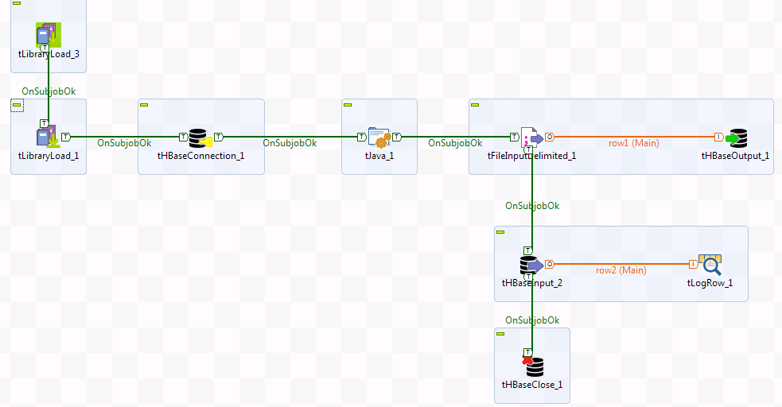

* tLibraryLoad、tHBaseConnection、tJava、tHBaseClose_1组件的配置请参考“HBase Connection 操作步骤”，tLogRow组件使用默认配置。

* 点击选中“tFileInputDelimited_1”，点击“编辑schema”右边的按钮设计schema为两列，列名分别id和name，“文件名/流”输入`E:/soft/talend/putToHdfs.csv`，其余选项保持默认。

  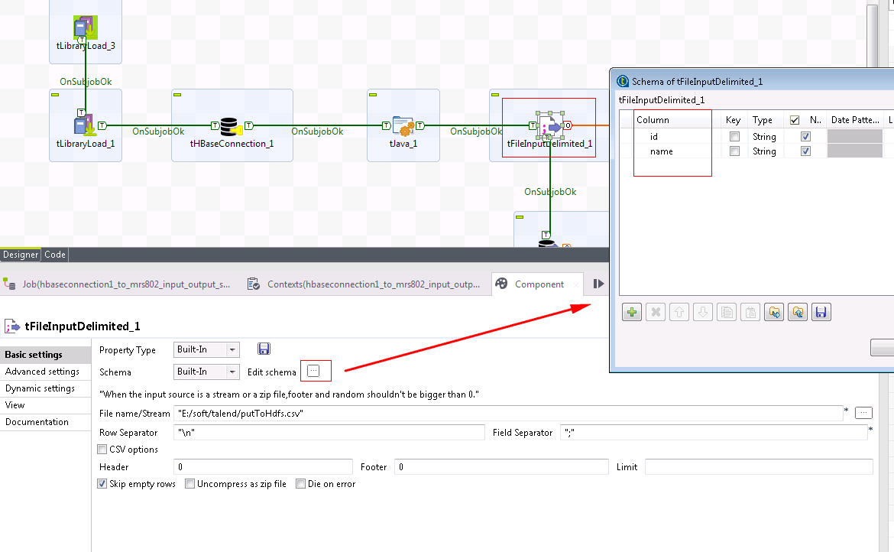

* 点击选中“tHBaseOutput_1”。

  * 在“高级配置”中，增加两列，列名分别为id和name，列名必须要用双引号包括，要不运行时会返回语法错误。

    

  * 在“基本配置”中，勾选`使用一个现有连接`，“组件列表”选择`tHBaseConnection_1`，“表名称”输入`talendHbaseCreate`，“表操作”选择`如果表不存在，则创建表`，输入id和name对应的“族名称”，“族名称”必须要用双引号包括，要不运行时会返回语法错误。

    

* 点击选中“tHBaseInput_1”，勾选`使用一个现有连接`，“组件列表”选择`tHBaseConnection_1`，“表名称”输入`talendhbase`，输入id和name对应的“族名称”，“族名称”必须要用双引号包括，点击“编辑schema”右边的按钮增加两列，列名分别id和name。

  

* 切换至“运行（作业hbaseInputOutput）”，点击`运行`按钮。返回结果如下图所示，则表示Talend对接FusionInsight HBase成功，且创建表talendHbaseCreate并将本地文件数据输入表talendHbaseCreate，并且从表talendHbaseCreate查询返回数据。

  

  

* 登录FusionInsight集群客户端，执行以下命令检查HBase表“talendHbaseCreate”。

  ```
  hbase shell
  scan 'talendhbase'
  ```

  

## FAQ

* **向FusionInsight HDFS文件系统上传或者下载文件时，返回Client cannot authenticate via:[TOKEN, KERBEROS]**

  **【问题描述】**

  使用Talend向FusionInsight HDFS文件系统上传或者下载文件时，上传或者下载的组件（例如tHDFSGet_1）采用“使用一个现有连接”，现有连接tHDFSConnection_1的属性类型是“存储库”时，运行时返回java.io.IOException: DestHost:destPort euleros-hd03:25000 , LocalHost:localPort user-PC/172.16.5.106:0. Failed on local exception: java.io.IOException: org.apache.hadoop.security.AccessControlException: Client cannot authenticate via:[TOKEN, KERBEROS]，且上传或者下载文件失败。

  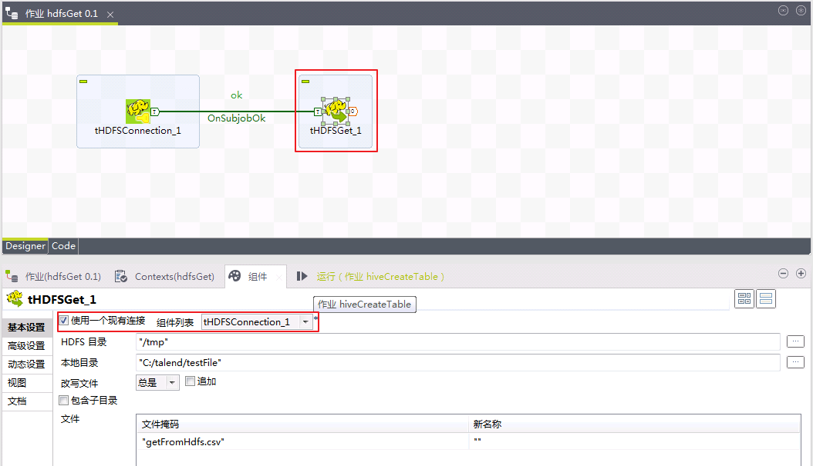

  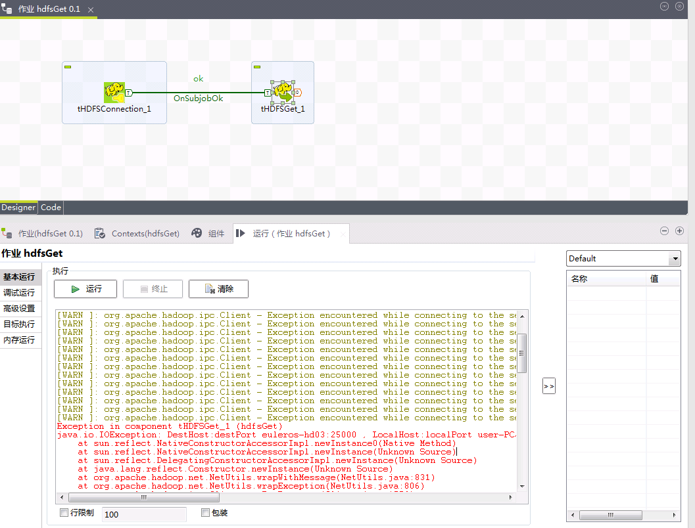

  **【解决方法】**

  tHDFSConnection_1使用的存储库FusionInsight_HDFS所属的Hadoop集群FusionInsight没有使用自定义的Hadoop配置。需要修改Hadoop集群FusionInsight使用自定义的Hadoop配置。
    * 选择`元数据->Hadoop Cluster->FusionInsight`，右键`FusionInsight`选择`Edit Hadoop Cluster`。

      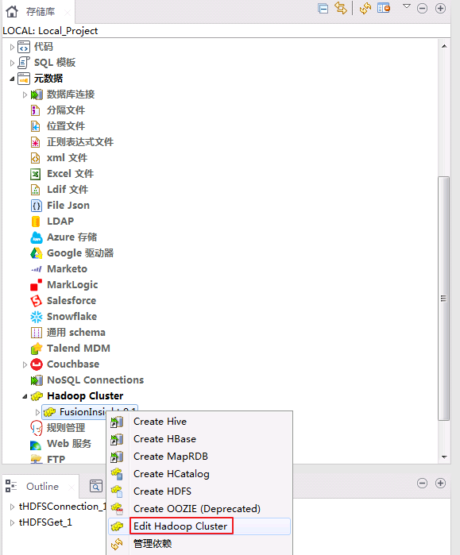

    * 勾选`使用自定义Hadoop配置`。
      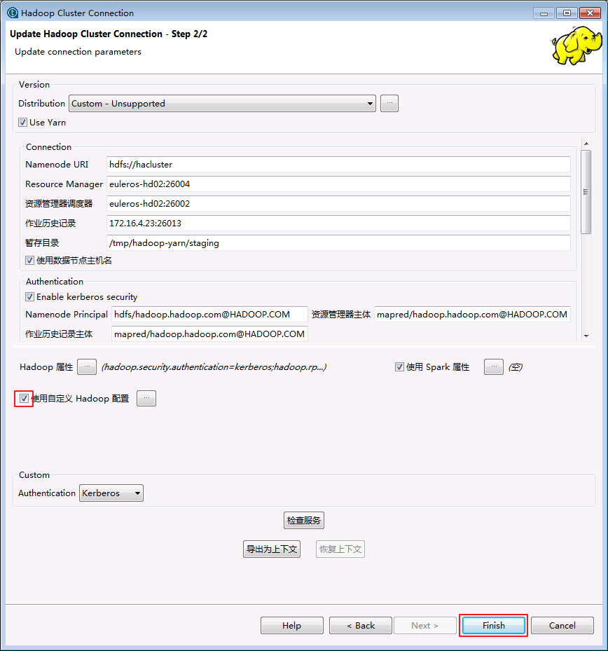

    * 点击`Yes`。

      

* **对接FusionInsight Hive接口创建表的时候返回Cannot modify dfs.client.use.datanode.hostname at runtime。**

  **【问题描述】**

  对接FusionInsight Hive接口创建表的时候，返回类似的错误：Error while processing statement: Cannot modify dfs.client.use.datanode.hostname at runtime. It is not in list of params that are allowed to be modified at runtime。可能涉及的有以下三个属性：`dfs.client.use.datanode.hostname、mapred.job.name、hive.query.name`。

  

  **【解决方法】**

  登录FusionInsight Manager，在Hive服务的配置参数hive.security.authorization.sqlstd.confwhitelist.append新增`|dfs\.client\.use\.datanode\.hostname|mapred\.job\.name|hive\.query\.name`，然后重启Hive服务。

  
