# streamsets对接FusionInsight

## 适用场景

>Streamsets 3.16.1 <--> FusionInsight HD 6.5 (HDFS/Hive/HBase/Kafka)
>
>Streamsets 3.16.1 <--> FusionInsight MRS 8.0 (HDFS/Hive/HBase/Kafka)

## MRS 8.0 对接说明

说明：

- 1: mrs8.0的组件版本接近streamsets里面hdp3.1版本，支持hdfs,hive,hbase的对接

  需要更改依赖如下：`/opt/streamsets/streamsets-datacollector-3.16.1/streamsets-libs/streamsets-datacollector-hdp_3_1-lib/lib`

  

  把hadoop-plugins-8.0.0-301001-SNAPSHOT.jar，zookeeper-3.5.6-hw-ei-301001-SNAPSHOT.jar，zookeeper-jute-3.5.6-hw-ei-301001-SNAPSHOT.jar导入到这个路径下，把之前的zookeeper-3.4.10.jar注释掉(具体Jar包名字可能有更改)

- 2： mrs8.0的kafka版本选用streamsets里面的Apache kafka 2.0.0

  需要更改依赖如下：`/opt/streamsets/streamsets-datacollector-3.16.1/streamsets-libs/streamsets-datacollector-apache-kafka_2_0-lib/lib`

  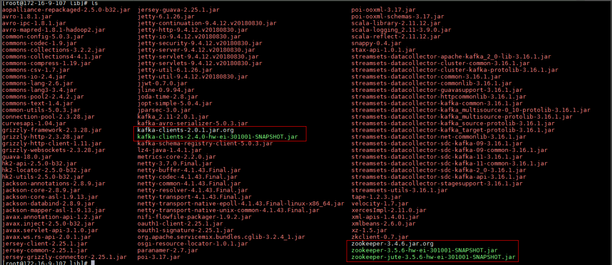

  把kafka-clients-2.4.0-hw-ei-301001-SNAPSHOT.jar，zookeeper-3.5.6-hw-ei-301001-SNAPSHOT.jar，zookeeper-jute-3.5.6-hw-ei-301001-SNAPSHOT.jar上述3个jar包拷贝过来，并且把kafka-client和zookeeper原来带的jar包注释掉（具体Jar包名字可能有更改）

## 安装streamsets
环境：172.16.2.121

### 操作场景

安装streamsets 3.16.1

### 前提条件

- 已完成FusionInsight HD和客户端的安装。

### 操作步骤

- 登陆streamsets官网下载安装包 https://streamsets.com/products/dataops-platform/data-collector/download/#download-sdc

  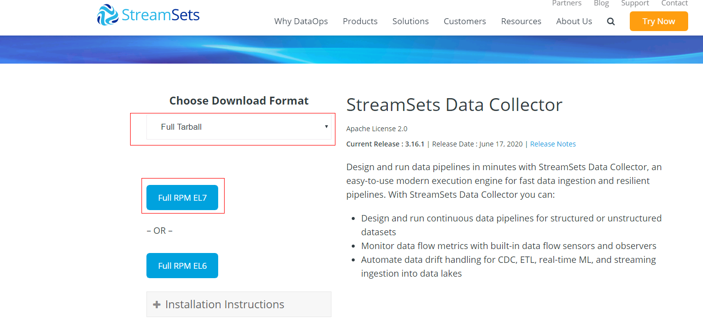

- 将下载好的安装包放到`/opt/streamsets`路径下，使用命令`tar -xvf streamsets-datacollector-all-3.16.1.tgz`解压安装包

- 参考官方介绍 https://streamsets.com/documentation/datacollector/3.16.x/help/datacollector/UserGuide/Installation/Installing_the_DC.html#task_bt1_zcp_kq

  配置`$SDC_DIST/libexec/sdc-env.sh`文件

  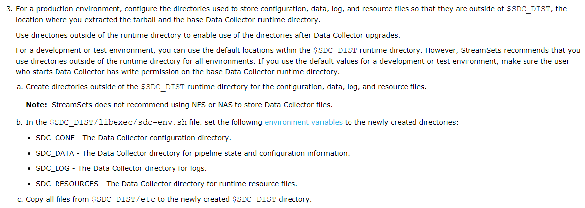

  比如配置`/opt/streamsets/streamsets-datacollector-3.16.1/libexec/sdc-env.sh`文件

  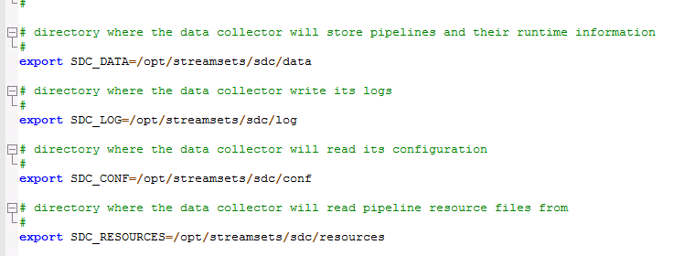

  并且将`/opt/streamsets/streamsets-datacollector-3.16.1/etc`路径下的所有配置文件拷贝到`/opt/streamsets/sdc/conf`路径下

  `cp /opt/streamsets/streamsets-datacollector-3.16.1/etc/* /opt/streamsets/sdc/conf/`

  注意：需提前创建好对应的路径，再配置

- 使用如下命令启动streamsets

  ```
  ulimit -n 32768
  bin/streamsets dc
  ```

- 登陆streamsets的web ui进行登陆，比如`http://172.16.2.121:18630/`

  注意：第一次登陆需要使用工作邮箱在streamsets官网注册，获取激活码，完成后使用默认用户admin, 默认密码admin进行登陆

  

  

## Kerberos认证相关配置

### 操作场景

配置streamsets与FI HD集群对接相关认证配置

### 前提条件

完成streamsets安装

### 操作步骤

说明：FI交互组件为Kafka, Hive, HDFS，配置时需要在streamsets选择相近的版本，下表为相近版本对应列表，根据此表找到streamsets对应版本依赖库路径，方便修改相关的jar包

| 组件 | 对应streamsets版本   |
| ----- | --------- |
| HDFS | HDP 3.1.0 |  
| Hive  | HDP 3.1.0 |
| HBase  | CDH 5.14.0 |
| Kafka  | Apache Kafka 1.1.0 |


配置步骤：

- 从FI Manager下载对应用户的认证文件user.keytab,krb5.conf并上传到streamsets主机的/opt路径下. 并且将krb5.conf文件放置到streamsets主机的/etc路径下，streamsets默认读取/etc/krb5.conf文件做认证服务

- 修改`$SDC_CONF/sdc.properties`配置文件，比如`/opt/streamsets/sdc/conf/sdc.properties`

  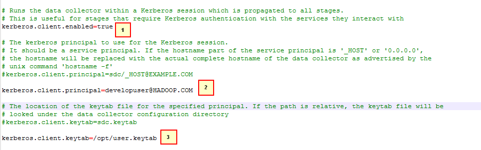

  其中第2条和第3条为Kerberos认证用户以及user.keytab文件，从FI Manager上获取，并保证developuser有kafka,hdfs,hive相关权限

- 使用如下命令在FI HD客户端中获取`hadoop-plugins-1.0.jar`并拷贝到`/opt/streamsets/streamsets-datacollector-3.16.1/streamsets-libs/streamsets-datacollector-hdp_3_1-lib/lib`路径下

  `cp /opt/125_651hdclient/hadoopclient/HDFS/hadoop/share/hadoop/common/lib/hadoop-plugins-1.0.jar /opt/streamsets/streamsets-datacollector-3.16.1/streamsets-libs/streamsets-datacollector-hdp_3_1-lib/lib`

- 使用如下命令在FI HD客户端中获取`zookeeper-3.5.1.jar`拷贝到`/opt/streamsets/streamsets-datacollector-3.16.1/streamsets-libs/streamsets-datacollector-hdp_3_1-lib/lib`路径下，并且把原来的`zookeeper-3.4.10.jar`注释掉

  ```
  mv /opt/streamsets/streamsets-datacollector-3.16.1/streamsets-libs/streamsets-datacollector-hdp_3_1-lib/lib/zookeeper-3.4.10.jar /opt/streamsets/streamsets-datacollector-3.16.1/streamsets-libs/streamsets-datacollector-hdp_3_1-lib/lib/zookeeper-3.4.10.jar.org
  cp /opt/125_651hdclient/hadoopclient/Hive/Beeline/lib/jdbc/zookeeper-3.5.1.jar /opt/streamsets/streamsets-datacollector-3.16.1/streamsets-libs/streamsets-datacollector-hdp_3_1-lib/lib/
  ```

  完成后检查：

  

- 找到streamsets启动jvm参数配置文件`/opt/streamsets/streamsets-datacollector-3.16.1/libexec/sdc-env.sh`做如下修改并保存：

  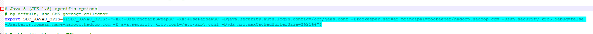

  增加参数内容为`-Djava.security.auth.login.config=/opt/jaas.conf -Dzookeeper.server.principal=zookeeper/hadoop.hadoop.com -Dsun.security.krb5.debug=false -Dkerberos.domain.name=hadoop.hadoop.com -Djava.security.krb5.conf=/etc/krb5.conf`

- 在/opt路径下创建jaas.conf文件，内容如下：

  

  ```
  Client {
    com.sun.security.auth.module.Krb5LoginModule required
    useKeyTab=true
    keyTab="/opt/user.keytab"
    storeKey=true
    useTicketCache=false
    principal="developuser@HADOOP.COM";
  };
  KafkaClient {
  com.sun.security.auth.module.Krb5LoginModule required
  useKeyTab=true
  principal="developuser@HADOOP.COM"
  keyTab="/opt/user.keytab"
  useTicketCache=false
  serviceName="kafka"
  storeKey=true
  debug=true;
  };
  ```

- 使用如下命令在FI HD客户端中获取`kafka-clients-1.1.0.jar`并拷贝到路径`/opt/streamsets/streamsets-datacollector-3.16.1/streamsets-libs/streamsets-datacollector-apache-kafka_1_1-lib/lib`路径下，并且把原来的`kafka-clients-1.1.0.jar`注释掉

  ```
  mv /opt/streamsets/streamsets-datacollector-3.16.1/streamsets-libs/streamsets-datacollector-apache-kafka_1_1-lib/lib/kafka-clients-1.1.0.jar /opt/streamsets/streamsets-datacollector-3.16.1/streamsets-libs/streamsets-datacollector-apache-kafka_1_1-lib/lib/kafka-clients-1.1.0.jar.org
  cp /opt/125_651hdclient/hadoopclient/Kafka/kafka/libs/kafka-clients-1.1.0.jar /opt/streamsets/streamsets-datacollector-3.16.1/streamsets-libs/streamsets-datacollector-apache-kafka_1_1-lib/lib/
  ```

  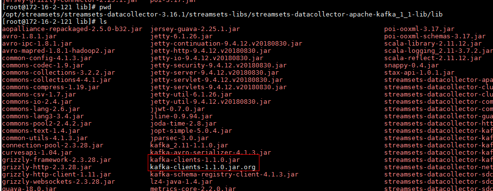

- 使用如下命令在FI HD客户端中获取`zookeeper-3.5.1.jar`拷贝到`/opt/streamsets/streamsets-datacollector-3.16.1/streamsets-libs/streamsets-datacollector-apache-kafka_1_1-lib/lib`路径下，并且把原来的`zookeeper-3.4.6.jar`注释掉

  ```
  mv /opt/streamsets/streamsets-datacollector-3.16.1/streamsets-libs/streamsets-datacollector-apache-kafka_1_1-lib/lib/zookeeper-3.4.6.jar /opt/streamsets/streamsets-datacollector-3.16.1/streamsets-libs/streamsets-datacollector-apache-kafka_1_1-lib/lib/zookeeper-3.4.6.jar.org
  cp /opt/125_651hdclient/hadoopclient/Kafka/kafka/libs/zookeeper-3.5.1.jar /opt/streamsets/streamsets-datacollector-3.16.1/streamsets-libs/streamsets-datacollector-apache-kafka_1_1-lib/lib/
  ```

  


- 使用如下命令在FI HD客户端中获取`zookeeper-3.5.1.jar`拷贝到`/opt/streamsets/streamsets-datacollector-3.16.1/streamsets-libs/streamsets-datacollector-cdh_5_14-lib/lib`路径下，并且把原来的`zookeeper-3.4.5-cdh5.14.0.jar`注释掉

  ```
  mv /opt/streamsets/streamsets-datacollector-3.16.1/streamsets-libs/streamsets-datacollector-cdh_5_14-lib/lib/zookeeper-3.4.5-cdh5.14.0.jar /opt/streamsets/streamsets-datacollector-3.16.1/streamsets-libs/streamsets-datacollector-cdh_5_14-lib/lib/zookeeper-3.4.5-cdh5.14.0.jar.org
  cp /opt/125_651hdclient/hadoopclient/Hive/Beeline/lib/jdbc/zookeeper-3.5.1.jar /opt/streamsets/streamsets-datacollector-3.16.1/streamsets-libs/streamsets-datacollector-cdh_5_14-lib/lib
  ```


- 创建路径`/opt/streamsets/hdfsconf`，在FI HD客户端中获取`core-site.xml, hdfs-site.xml, hive-site.xml, hbase-site.xml`拷贝到该路径下，并且做如下修改

  1. core-site.xml配置文件修改：

    

    其中172.16.4.123为hdfs主namenode的ip,端口为25000

  2. hdfs-site.xml配置文件修改：

    找到如下配置项，并且删除

    ```
    <property>
    <name>dfs.client.failover.proxy.provider.hacluster</name>
    <value>org.apache.hadoop.hdfs.server.namenode.ha.AdaptiveFailoverProxyProvider</value>
    </property>
    ```

完成后重启streamsets

## 对接HDFS

### 操作场景

配置streamsets对接HDFS，读、写数据

### 前提条件

完成streamsets安装，完成Kerberos认证相关配置

### 读取HDFS数据用例

- 新建一个数据流任务

  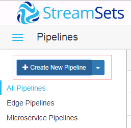

- 整个数据流如下：

  

  **注意（重要）**：经过测试，数据源端选择`Hadoop FS Standalone`. 如果数据源端选择`Hadoop FS`会遇到问题

- 在空白处单击鼠标左键，在General页签配置数据流执行模式为Standalone

  

- **Hadoop FS Standalone** 配置如下：

  - General页签

    

  - Connection页签

    

    注意：其中172.16.4.123为hdfs主namenode节点的ip

  - Files页签

    

  - Post processing页签未做修改

    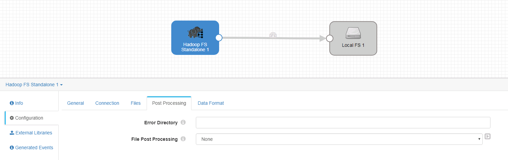

  - Data Format页签

    

- **Local FS** 配置如下：

  - 只修改Output Files页签

    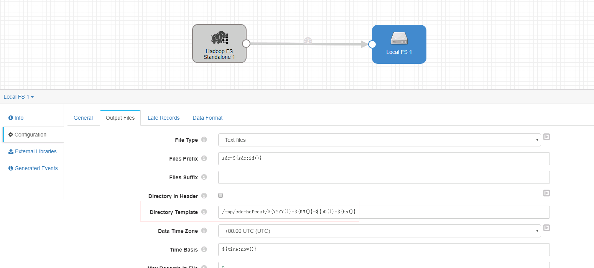

- 启动任务前，登陆集群hdfs路径`/tmp/out/test/`,并创建数据文件`test.txt`

  

- 启动任务流

  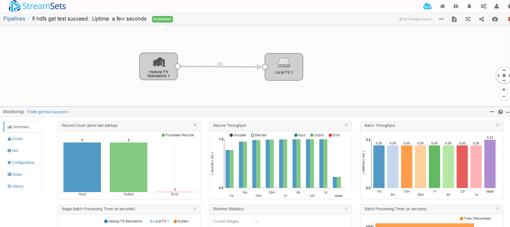

  注意：多次启动如果数据没有结果跟新，使用如下的启动方式

  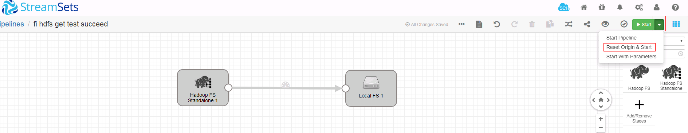

- 登陆后台对应路径检查结果：

  

### 写入HDFS数据用例

- 新建一个数据流任务

  

- 整个数据流如下：

  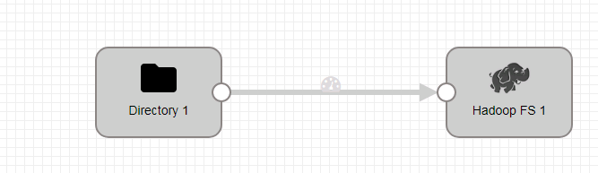

- 在空白处单击鼠标左键，在General页签配置数据流执行模式为Standalone

  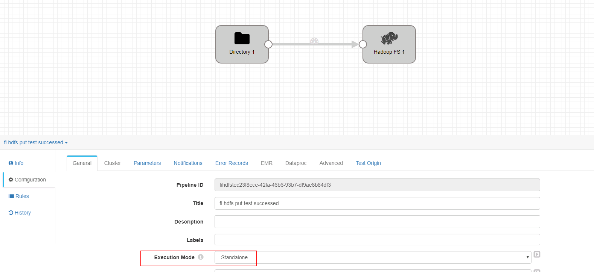

- **Directory** 配置

  - General页签

    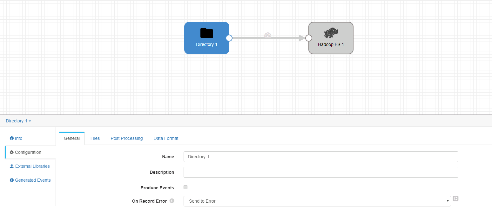

  - Files页签

    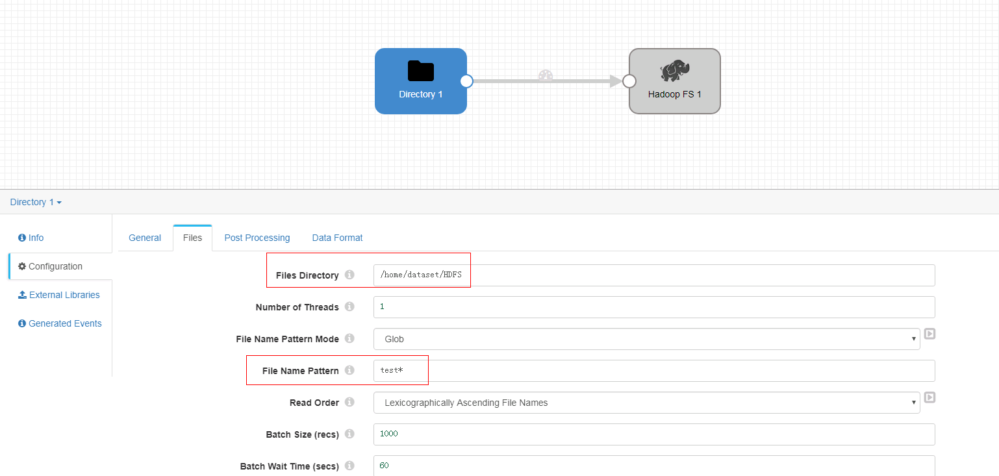

  - Post Processing页签未做修改

    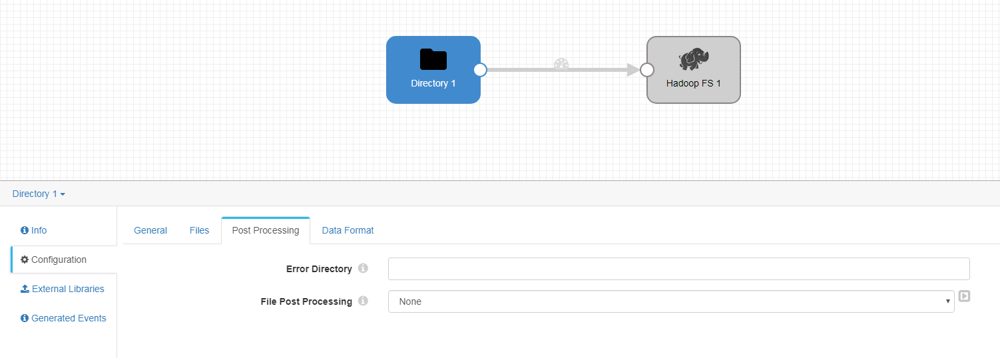

  - Data Format页签

    

- **Hadoop FS** 配置

    - General页签

      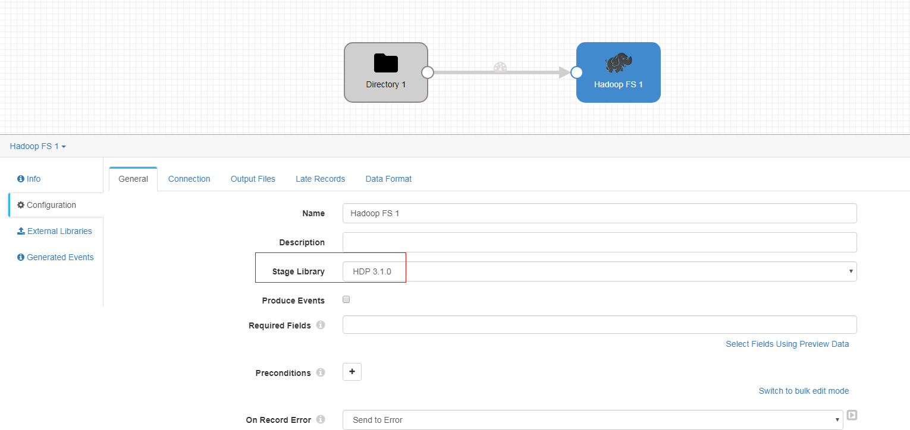

    - Connection页签

      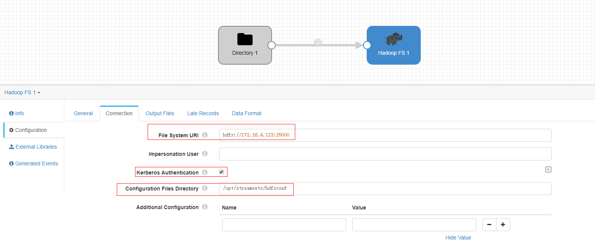

      注意：其中172.16.4.123为hdfs主namenode节点的ip

    - Output Files页签

      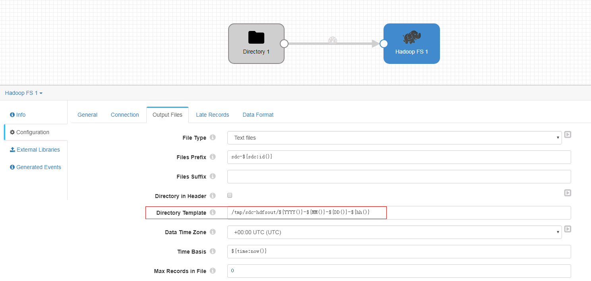

    - Late Records页签

      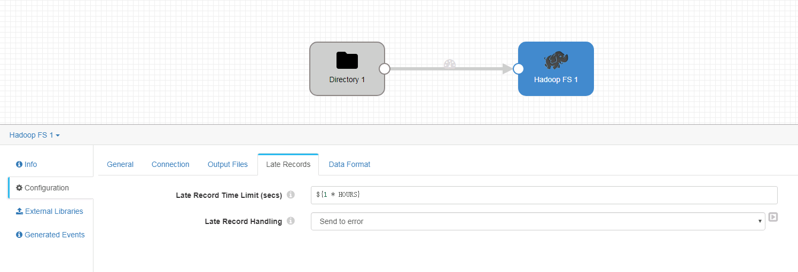

    - Data Format页签

      

- 测试前登陆主机后台准备上传数据文件：

  

- 启动数据流

  

- 登陆hdfs对应路径查看结果

  


## 对接Hive

### 操作场景

配置streamsets对接Hive，写入数据

说明：streamsets不提供hive作为直接数据源，本节只提供hive写入用例

### 前提条件

完成streamsets安装，完成Kerberos认证相关配置

### 写入Hive数据用例

- 新建一个数据流任务

  

- 整个数据流如下：

  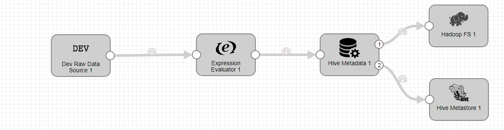

- **Dev Raw Data Source** 配置

  - General页签

    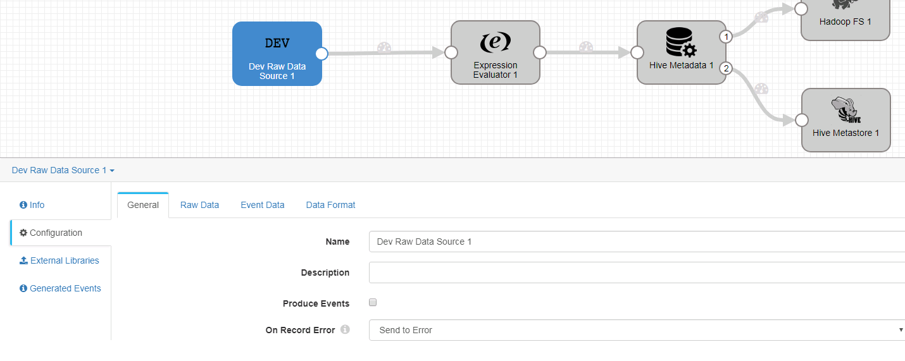

  - Raw Data页签

    

    ```
    {
        "firstname": "abc",
        "midname": "xyz",
        "lastname": "lmn"
    }
    ```

  - Event Data页签,未做配置

    

  - Data Format页签

    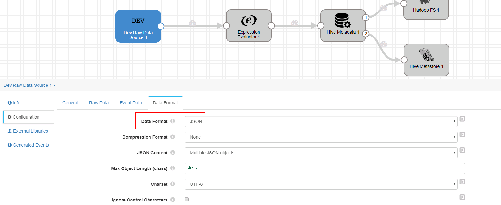

- **Expression Evaluator** 配置

  - General页签

    

  - Expressions页签

    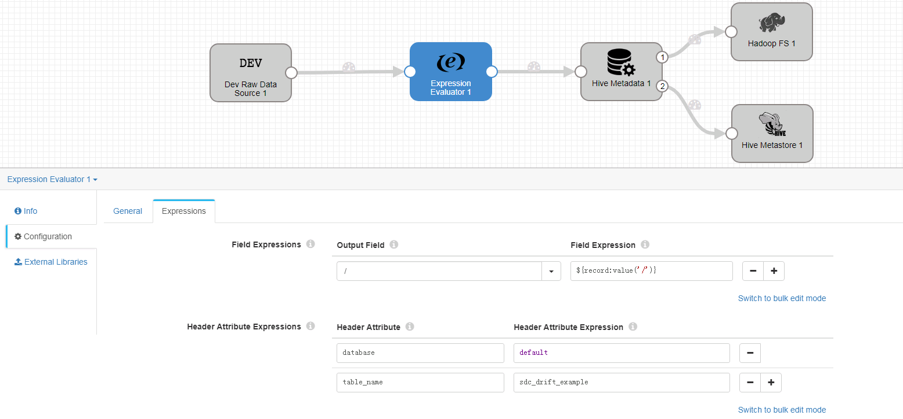

    ```
    database = default
    table_name = sdc_drift_example
    ```

- **Hive Metadata** 配置
  - General页签配置：

    

  - Hive页签配置：

    

    ```
    1. jdbc:hive2://172.16.4.121:24002,172.16.4.122:24002,172.16.4.123:24002/default;serviceDiscoveryMode=zooKeeper;zooKeeperNamespace=hiveserver2;sasl.qop=auth-conf;auth=KERBEROS;principal=hive/hadoop.hadoop.com@HADOOP.COM
    2. org.apache.hive.jdbc.HiveDriver
    3. /opt/streamsets/hdfsconf
    ```

  - Table页签配置

    

    ```
    1. ${record:attribute('database')}
    2. ${record:attribute('table_name')}
    ```

  - Advanced页签按默认配置，未做修改

    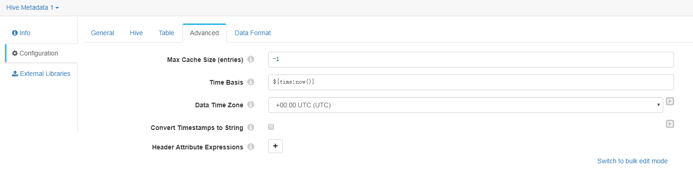

  - Data Format页签配置

    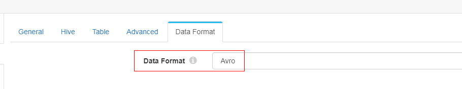

- **Hadoop FS** 配置

  - General页签配置

    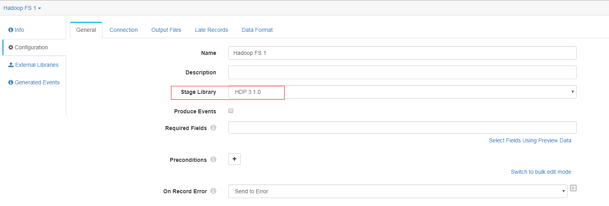

  - Connection页签配置

    

  - Output Files页签配置

    

  - Late Records页签配置

    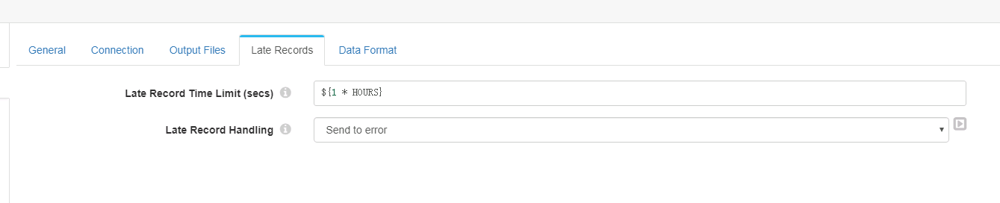

  - Data Format页签配置

    

- **Hive Metastore** 配置

  - General页签配置

    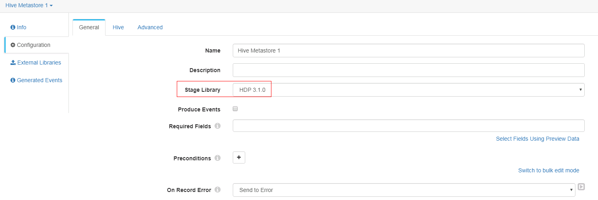

  - Hive页签配置

    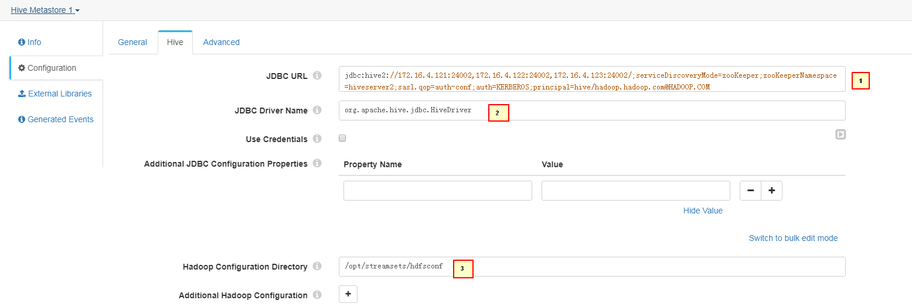

    ```
    1. jdbc:hive2://172.16.4.121:24002,172.16.4.122:24002,172.16.4.123:24002/;serviceDiscoveryMode=zooKeeper;zooKeeperNamespace=hiveserver2;sasl.qop=auth-conf;auth=KERBEROS;principal=hive/hadoop.hadoop.com@HADOOP.COM
    2. org.apache.hive.jdbc.HiveDriver
    3. /opt/streamsets/hdfsconf
    ```

  - Advanced页签配置

        

- hive表streamsets会自动创建，不需要提前创建改表

- 启动数据流

- beeline登陆Hive检查结果

  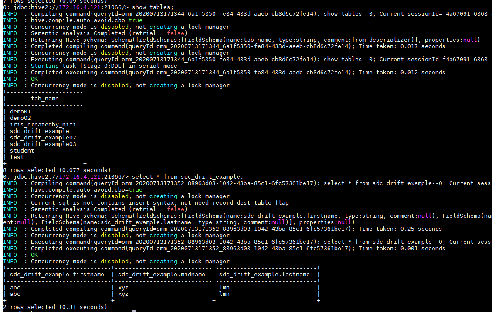

## 对接HBase

### 操作场景

配置streamsets对接HBase

注意：streamstes不提供HBase作为源端的功能，本节只提供HBase写入用例

### 前提条件

完成streamsets安装，完成Kerberos认证相关配置

### HBase相关配置

说明： FusionInisight 的HBase版本（1.3.1）与CDH 5.14.0 的HBase版本（1.2.0）相近, 已经修改了zookeeper-3.4.5-cdh5.14.0.jar 为FusionInsight的 zookeeper-3.5.1.jar. 但是版本还是有差异，需要导入Fusioninsight hbase相关jar包，避免发生依赖错误

参考如下链接安装外部依赖库,并导入FusionInsgiht HBase依赖： https://streamsets.com/documentation/datacollector/latest/help/datacollector/UserGuide/Configuration/ExternalLibs.html#concept_amy_pzs_gz


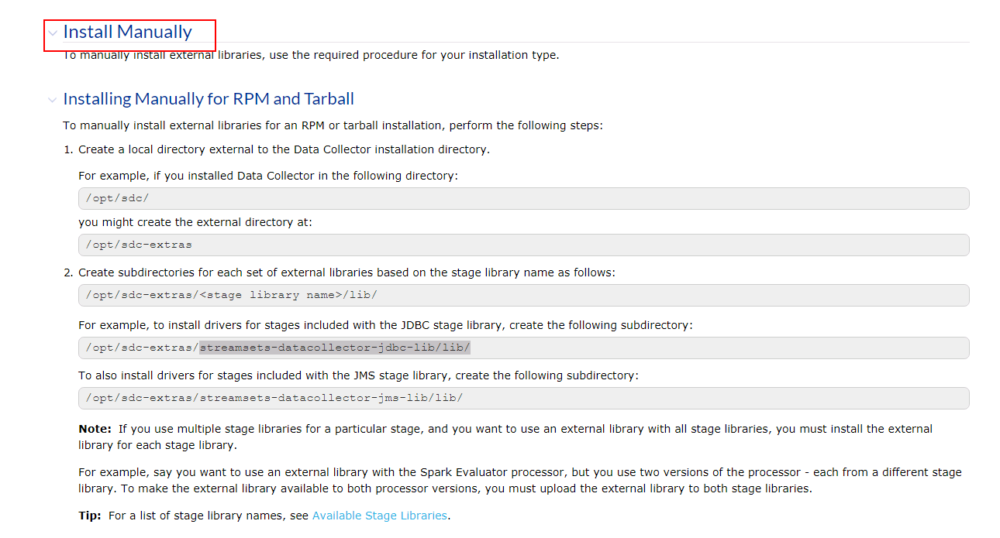

- 首先创建路径`/opt/streamsets/sdc/sdc-extras/streamsets-datacollector-cdh_5_14-lib/lib`

  `mkdir -p /opt/streamsets/sdc/sdc-extras/streamsets-datacollector-cdh_5_14-lib/lib`

- 将FusionInsight HBase相关依赖jar包拷贝到上一步创建的路径中

  ```
  cp /opt/125_651hdclient/hadoopclient/HBase/hbase/lib/*.jar /opt/streamsets/sdc/sdc-extras/streamsets-datacollector-cdh_5_14-lib/lib
  ```

- 修改配置文件`$SDC_CONF/sdc-security.policy`，比如`/opt/streamsets/sdc/conf/sdc-security.policy`,增加如下内容：

  ```
  // user-defined external directory
  grant codebase "file:///opt/streamsets/sdc/sdc-extras/-" {
    permission java.security.AllPermission;
  };
  ```

  


- (重要)关闭正在运行的streamsets, 先申明之前配置的环境变量`STREAMSETS_LIBRARIES_EXTRA_DIR`,再启动streamsets. 比如：

  ```
  export STREAMSETS_LIBRARIES_EXTRA_DIR="/opt/streamsets/sdc/sdc-extras"
  bin/streamsets dc
  ```

- 登陆streamsets的web界面，在**Package Manager**处的**External Libraries**检查相关依赖是否导入成功

  

### 写入HBase数据用例

- 新建一个数据流任务

  

- 整个数据流如下：

  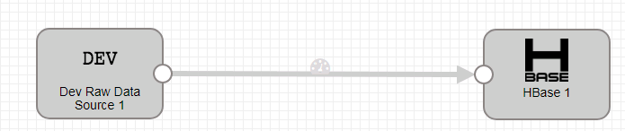

- **Dev Raw Data Source 1** 配置

  - General页签

    

  - Raw Data页签

    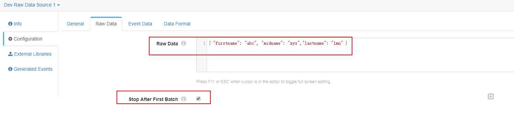

    `{ "firstname": "abc", "midname": "xyz","lastname": "lmn" }`

  - Event Data页签未作修改

    

  - Data Format页签

    

- **HBase** 配置

  - General页签

    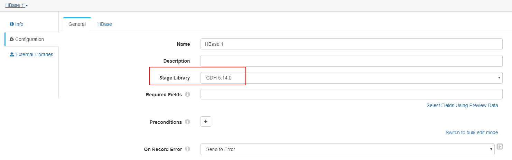

  - HBase页签

    

    

    ```
    1. host-172-16-4-121,host-172-16-4-122,host-172-16-4-123
    2. 24002
    3. /hbase
    4. streamsets1
    5. /firstname
    6. Text
    7. /firstname - data:firstname - Text
       /midname - data:midname - Text
       /lastname - data:lastname - Text
    8. /opt/streamsets/hdfsconf
    ```

- 测试前登陆hbase客户端，创建表streamsets1

  ```
  hbase shell
  create 'streamsets1','data'
  ```

- 启动数据流

  

- hbase客户端检查结果

  `scan 'streamsets1'`

  

## 对接Kafka安全模式

### 操作场景

配置streamsets对接Kafka，生产，消费数据

### 前提条件

完成streamsets安装，完成Kerberos认证相关配置

### 写入Kafka数据用例

- 新建一个数据流任务

  

- 整个数据流如下：

  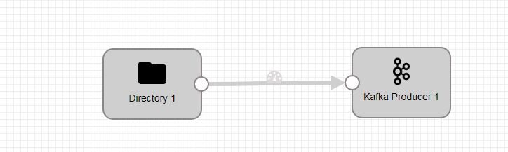

- **Directory** 配置：

  - General页签

    

  - Files页签

    

  - Post Processing页签未做修改

    

  - Data Format页签

    

- **Kafka Producer** 配置：

  - General页签

    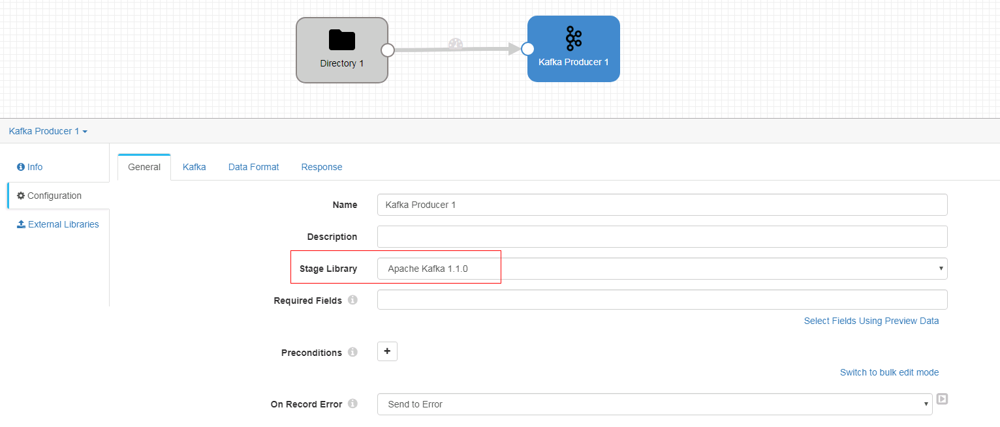

  - Kafka页签

    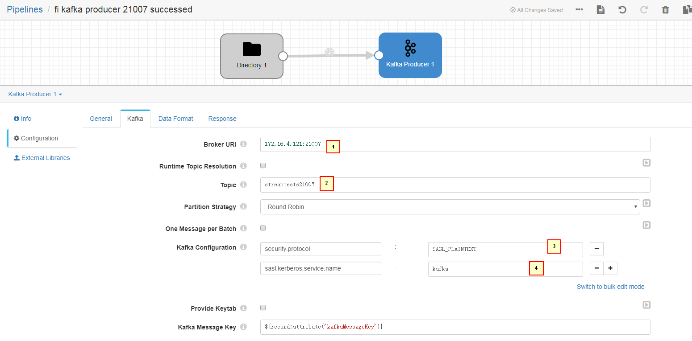

    ```
    1. 172.16.4.121:21007
    2. streamtests21007
    3. security.protocol = SASL_PLAINTEXT
    4. sasl.kerberos.service.name = kafka
    ```

  - Data Format页签

    

  - Response页签

    

- 启动数据流前，使用命令`bin/kafka-topics.sh --create --zookeeper 172.16.4.121:24002,172.16.4.122:24002,172.16.4.123:24002/kafka --partitions 2 --replication-factor 2 --topic streamtests21007`创建topic

- 使用如下命令启动kafka消费者

  `bin/kafka-console-consumer.sh --zookeeper 172.16.4.121:24002,172.16.4.122:24002,172.16.4.123:24002/kafka --topic streamtests21007`

- 启动任务流

  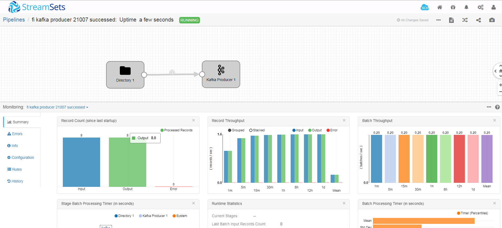

  对已启动过的任务，用如下方式重新启动

  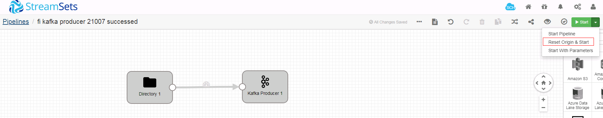

- 在kafka消费者检查结果

  


### 读取Kafka数据用例

- 新建一个数据流任务

  

- 整个数据流如下：

  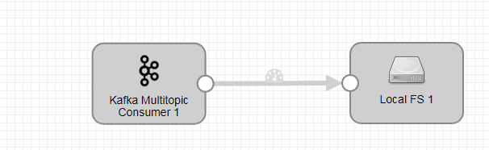

  **注意（重要）**：经过测试，数据源端选择`Kafka Multitopic Consumer`. 如果数据源端选择`Kafka Consumer`会遇到问题

- **Kafka Multitopic Consumer** 配置：

  - General页签

    

  - Connection页签

    

  - Data Format页签

    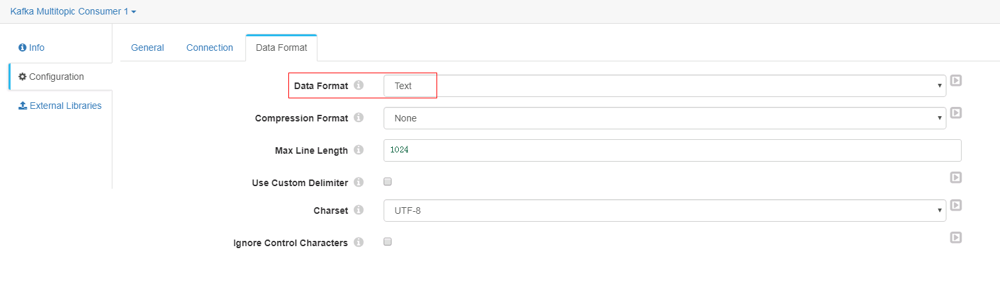

- **Local FS** 配置

  - General页签

    

  - Output Files页签

    

  - Late Records页签

    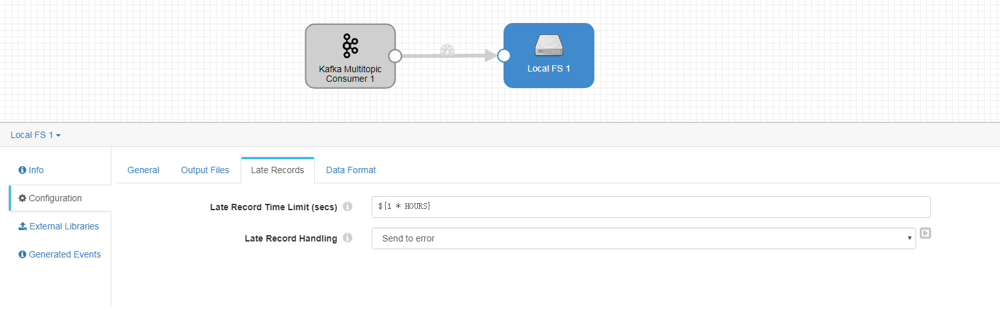

  - Data Format页签

    

- 启动数据流前，使用命令`bin/kafka-topics.sh --create --zookeeper 172.16.4.121:24002,172.16.4.122:24002,172.16.4.123:24002/kafka --partitions 2 --replication-factor 2 --topic streamtests21007test`创建topic

- 首先使用`bin/kafka-console-producer.sh --broker-list 172.16.4.121:21007,172.16.4.122:21007,172.16.4.123:21007 --topic streamtests21007test --producer.config config/producer.properties`启动kafka生产者

- 启动数据流，手动在前一步生产者中插入数据

  

  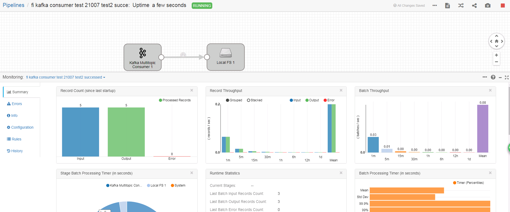  

- 登陆后台对应路径检查结果：

  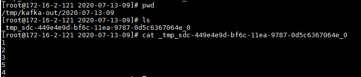


## streamsets最佳实践

### 操作场景

配置streamsets ETL数据流，从FI kafka读取数据，再写入FI Hive中

### 前提条件

完成streamsets安装，完成Kerberos认证相关配置，完成HDFS, Hive, Kafka用例测试

### 测试用例

新建一个数据流任务


整个数据流如下：


**Kafka Multitopic Consumer** 配置

- General页签配置：

  

- Connection页签配置：

  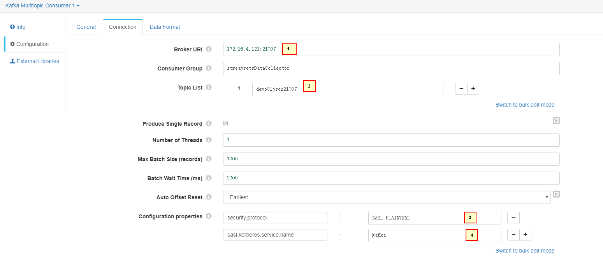

  ```
  1. 172.16.4.121:21007
  2. demo01json21007
  3. security.protocol = SASL_PLAINTEXT
  4. sasl.kerberos.service.name = kafka
  ```

- Data Format页签配置

  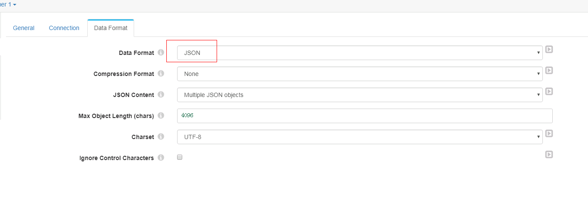

**Expression Evaluator** 配置

- General页签按默认配置，未做修改

  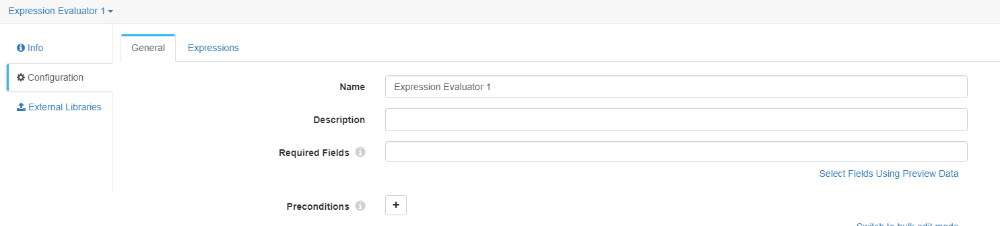

- Expressions页签配置：

  

  ```
  1. database = default
  2. table_name = sdc_drift_example03
  ```

**Hive Metadata** 配置
- General页签配置：

  

- Hive页签配置：

  

  ```
  1. jdbc:hive2://172.16.4.121:24002,172.16.4.122:24002,172.16.4.123:24002/default;serviceDiscoveryMode=zooKeeper;zooKeeperNamespace=hiveserver2;sasl.qop=auth-conf;auth=KERBEROS;principal=hive/hadoop.hadoop.com@HADOOP.COM
  2. org.apache.hive.jdbc.HiveDriver
  3. /opt/streamsets/hdfsconf
  ```

- Table页签配置

  

  ```
  1. ${record:attribute('database')}
  2. ${record:attribute('table_name')}
  ```

- Advanced页签按默认配置，未做修改

  

- Data Format页签配置

  

**Hadoop FS** 配置

- General页签配置

  

- Connection页签配置

  

- Output Files页签配置

  

- Late Records页签配置

  

- Data Format页签配置

  

**Hive Metastore** 配置

- General页签配置

  

- Hive页签配置

  

  ```
  1. jdbc:hive2://172.16.4.121:24002,172.16.4.122:24002,172.16.4.123:24002/;serviceDiscoveryMode=zooKeeper;zooKeeperNamespace=hiveserver2;sasl.qop=auth-conf;auth=KERBEROS;principal=hive/hadoop.hadoop.com@HADOOP.COM
  2. org.apache.hive.jdbc.HiveDriver
  3. /opt/streamsets/hdfsconf
  ```

- Advanced页签配置

  

**测试前准备**

- 使用FI HD客户端创建kafka相关topic demo01json21007

  `bin/kafka-topics.sh --create --zookeeper 172.16.4.121:24002,172.16.4.122:24002,172.16.4.123:24002/kafka --partitions 2 --replication-factor 2 --topic demo01json21007`


- hive表streamsets会自动创建，不需要提前创建改表

- 启动streamsets数据流

- 使用如下命令启动kafka producer并且插入数据

  `bin/kafka-console-producer.sh --broker-list 172.16.4.121:21007,172.16.4.122:21007,172.16.4.123:21007 --topic demo01json21007 --producer.config config/producer.properties`

  数据：
  ```
  { "firstname": "abc", "midname": "xyz","lastname": "lmn" }
  { "firstname": "abc1", "midname": "xyz1","lastname": "lmn1" }
  { "firstname": "abc2", "midname": "xyz2","lastname": "lmn2" }
  ```

  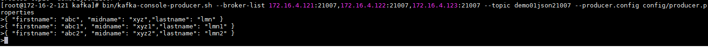

- 检查streamsets界面

  

- 后台检查hive表

  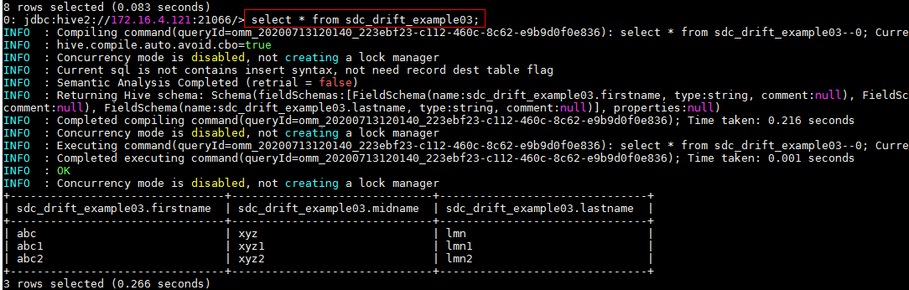

## FAQ

问题1

在做hive写入相关用例的时候（hive表写入用例，最佳实践用例），如果预先在hive表中建对应的表，发现工作流启动之后数据不能写入到hive表中，但是也没有报错

解决办法：

不要预先在hive中预先建表，由streamset自动建对应hive表，可以实现数据写入成功


问题2

在启动数据流之后，使用kafka producer插入数据时，streamsets报错

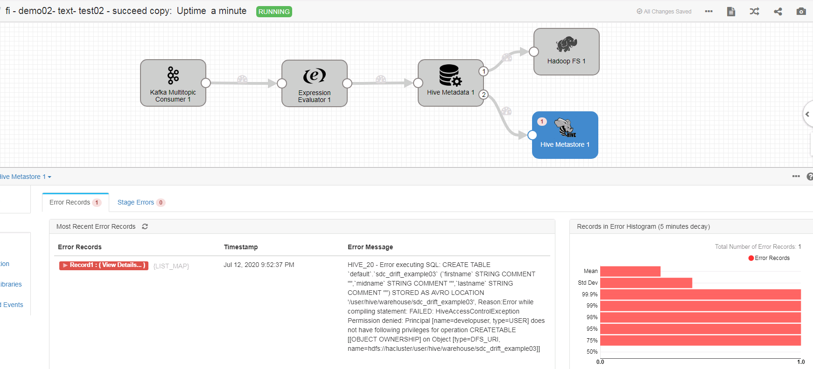

```
Reason:Error while compiling statement: FAILED: HiveAccessControlException Permission denied: Principal [name=developuser, type=USER] does not have following privileges for operation CREATETABLE [[OBJECT OWNERSHIP] on Object [type=DFS_URI, name=hdfs://hacluster/user/hive/warehouse/sdc_drift_example03]]
```

问题原因：streamsets会使用developuser创建表sdc_drift_example03，期间要在hdfs下创建对应路径，当前用户拥有的角色不具备操作HDFS权限。

解决办法：在OM管理界面System下Role Management中给对应的角色赋予相应的HDFS操作权限。


**注意**：如果该角色已经配置，重启streamsets即可
