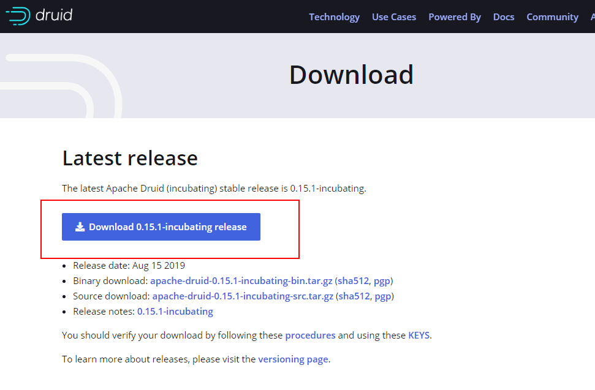
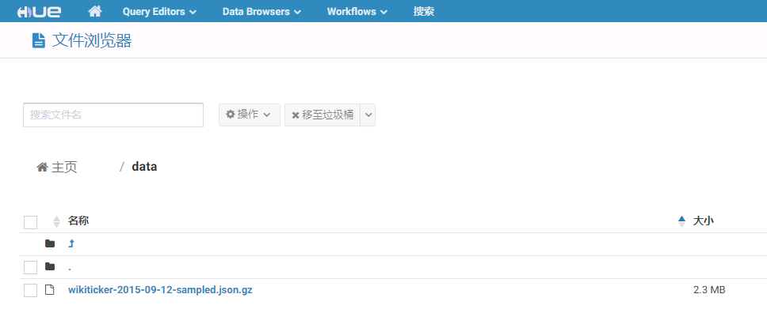
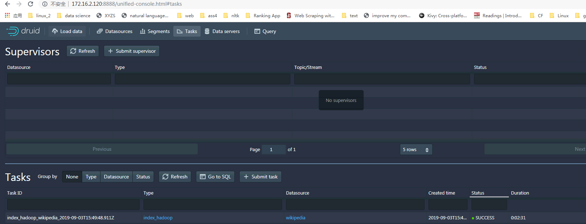
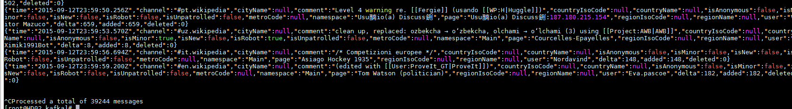

# Aapache Druid 0.15.1 对接FusionInsight

## 适用场景

> Aapache Druid 0.14.2 <--> FusionInsight HD 2.8
>
> Aapache Druid 0.15.1 <--> FusionInsight HD 2.8

## 前提条件

* 已完成FusionInsight集群的部署，版本FusionInsight HD 2.8

## 环境描述
FI HD主机三台： 172.16.6.10 - 12
Druid部署主机： 172.16.2.120

## 准备工作

### FI HD集群相关准备

- 参考产品文档完成FI HD客户端的安装

- 下载准备好的用户developuser相关的user.keytab以及krb5.conf文件

### 安装MySQL

- Druid 的元数据需要存储，本文选用自己搭建的MySQL数据库，下面介绍如何安装MySQL数据库

- 登录 https://downloads.mysql.com/archives/community/， 在 Product Version 中选择 5.7.27，Operating System请选择Linux-Generic，下载社区版MySQL软件包。

- 以root用户登录待安装的服务器

- 上传软件包并解压。
  - 以root用户通过sftp/ftp工具上传“mysql-5.7.24-linux-glibc2.12-x86_64.tar.gz”软件包到“/opt”目录 。
  - 进入opt目录，并解压缩软件包。
    ```
    cd /opt/
    tar -xzvf mysql-5.7.27-linux-glibc2.12-x86_64.tar.gz
    ```
  - 将解压后目录改名为mysql。
    ```
    mv mysql-5.7.27-linux-glibc2.12-x86_64 mysql
    ```

- 创建用户和用户组，并进行授权。
  - 添加mysql组。
    ```
    groupadd mysql
    ```
  - 添加mysql用户。
    ```
    useradd -d /home/mysql -s /bin/bash -g mysql -m mysql
    ```
  - 把mysql目录授权给mysql用户。
    ```
    chown -R mysql:mysql /opt/mysql
    ```
  - 在数据盘目录下（如/data01），创建mysql-data目录及子目录tmp。
    ```
    mkdir /opt/mysql-data
    mkdir /opt/mysql-data/tmp  
    mkdir /opt/mysql-data/log
    ```
  - 把mysql-data目录及子目录授权给mysql组中的mysql用户。
    ```
    chown -R mysql:mysql /opt/mysql-data
    ```
  - mysql-data目录的所属群组修改为mysql。
    ```
    chgrp -R mysql /opt/mysql-data
    ```

- 新建并编辑my.cnf文件。

  - 在mysql目录下新建并编辑my.cnf文件。
    ```
    vi /opt/mysql/my.cnf
    ```

    输入i进入编辑模式，按如下要求修改文件内容，修改完成后按Esc退出编辑模式，执行:wq!保存并退出。其中，“bind-address”参数请修改为MySQL服务器的地址。

    ```
    [mysqld]
    basedir = /opt/mysql
    bind-address = 172.16.2.120
    datadir = /opt/mysql-data/workdbs
    tmpdir = /opt/mysql-data/tmp/
    port = 3306
    socket =/opt/mysql/lib/mysql.sock
    lower_case_table_names=1
    character-set-server = utf8
    max_allowed_packet = 150M
    sql_mode=NO_ENGINE_SUBSTITUTION,STRICT_TRANS_TABLES,STRICT_ALL_TABLES
    log-error=/opt/mysql-data/log/mysql_3306.log
    max_connections=1000
    event_scheduler=ON
    [mysql]
    default-character-set = utf8
    socket =/opt/mysql/lib/mysql.sock
    ```


- 执行如下命令，修改my.cnf文件的属主。
  ```
  chown mysql:mysql /opt/mysql/my.cnf
  ```
- 拷贝my.cnf文件到etc目录下。
  ```
  cp -fr /opt/mysql/my.cnf /etc/my.cnf
  ```


- 修改系统配置文件profile。

  - 编辑etc目录下的“profile”文件。
    ```
    vi /etc/profile
    ```

  - 输入i进入编辑模式，在文件末尾添加如下内容：
    ```
    export PATH=$PATH:/opt/mysql/bin
    export PATH=$PATH:/etc/init.d添加完成后按Esc退出编辑模式，执行:wq!保存并退出。
    ```
  - 重新加载etc目录下的profile文件。
    ```
    source /etc/profile
    ```

- 将mysql.server复制到/etc/init.d/ 。
  ```
  cd /opt/mysql
  cp -a ./support-files/mysql.server /etc/init.d/mysql.server
  ```

- 初始化mysql
  ```
  cd /opt/mysql
  ./bin/mysqld --initialize --user=mysql --basedir=/opt/mysql/ --datadir=/opt/mysql-data/workdbs
  ```
  命令执行后，如无错误，不会有显示信息，查看日志文件“/opt/mysql-data/log/mysql_3306.log”，获取临时密码。
  ```
  cat /data01/mysql-data/log/mysql_3306.log
  ```

  


- 创建软连接。

  - 将mysql的安装目录软连接到local下面。
  ```
  ln -s /opt/mysql /usr/local/mysql
  ```
  - 将mysql.sock文件软连接到tmp下面
  ```
  ln -s /opt/mysql/lib/mysql.sock /tmp/mysql.sock
  ```


- 注册并设置mysql.server服务为开机自启动。
  ```
  systemctl enable mysql.server.service
  ```

- 查看MySQL状态。
  ```
  mysql.server status
  ```

- 在`opt/mysql/bin`目录下执行以下命令登录MySQL。
  ```
  cd /opt/mysql/bin
  mysql -u root -p
  ```
  按照提示信息输入记录的临时密码。

  Enter Password：登录成功后系统显示如下类似信息：


- 修改root用户密码。

  mysql> set password=password('Password');

  其中，单引号中的Password由用户自定义。

- 赋予任何主机访问数据的权限。
  ```
  mysql> grant all privileges on *.* to 'root'@'%' identified by 'Password' with grant option;
  ```
  其中，单引号中的Password由用户自定义。

- 使修改生效并使用数据库。
  ```
  mysql> flush privileges;
  mysql> use mysql;
  ```

- 使用如下命令创建druid元数据存储的database
  `mysql -u root -e "CREATE DATABASE druid CHARACTER SET utf8 COLLATE utf8_general_ci" -p`

- 完成安装，部署，退出MySQL数据库。
  ```
  mysql> exit
  ```

### 安装，部署Druid

- 登录如下网址选择相关Druid版本下载： https://druid.apache.org/downloads.html

  

- 上传软件包到/opt/druid目录下

  `tar -xvf apache-druid-0.15.1-incubating-bin.tar.gz` 解压安装包

  

- Druid 需要使用zookeeper服务作为自己本身distributed coordination服务的依赖，所以在使用druid之前需要提前部署zookeeper服务，本文使用开源zookeeper服务作为druid的依赖，而不使用FI HD本真的zookeeper服务

  - 登录druid安装目录

    `cd /opt/druid/apache-druid-0.15.1-incubating`

  - 下载开源的zookeeper，并且改名为zk
    ```
    curl https://archive.apache.org/dist/zookeeper/zookeeper-3.4.11/zookeeper-3.4.11.tar.gz -o zookeeper-3.4.11.tar.gz
    tar -xzf zookeeper-3.4.11.tar.gz
    mv zookeeper-3.4.11 zk
    ```

    


- 加载FI HD客户端环境

  `source /opt/hadoopclient/bigdata_env`

  检查druid安装主机同集群时间小于5分钟


- 使用如下命令启动druid

  `bin/start-micro-quickstart`

  

  待全部服务启动后，登录172.16.2.120:8888 web界面查看druid

  

  完成后 Ctrl+C 停止druid

### 配置druid对接FI HD集群HDFS

说明： 参考Druid官方文档，配置FI HD集群的HDFS服务为Druid的Deep Storage,并且使用FI HD的yarn服务以及Mapreduce服务来批量将存储在HDFS上的数据导入Druid数据库

Deep Storage相关文档连接： https://druid.apache.org/docs/latest/development/extensions-core/hdfs.html

Hadoop批处理数据导入相关文档连接：https://druid.apache.org/docs/latest/ingestion/hadoop.html


- 从FI HD集群客户端中获取到配置文件core-site.xml， hdfs-site.xml， mapred-site.xml， yarn-site.xml，做如下修改：

  - core-site.xml:

    将默认配置项
    ```
    <property>
    <name>fs.defaultFS</name>
    <value>hdfs://hacluster</value>
    </property>
    ```

    更改为主Namenode节点IP + 端口形式：
    ```
    <property>
    <name>fs.defaultFS</name>
    <value>hdfs://172.16.6.12:25000</value>
    </property>
    ```

  - hdfs-site.xml:

    删除如下这个配置项
    ```
    <property>
    <name>dfs.client.failover.proxy.provider.hacluster</name>
    <value>org.apache.hadoop.hdfs.server.namenode.ha.BlackListingFailoverProxyProvider</value>
    </property>
    ```

- 将上面步骤的core-site.xml， hdfs-site.xml， mapred-site.xml， yarn-site.xml配置文件拷贝到druid如下两个路径下：

  `/opt/druid/apache-druid-0.15.1-incubating/conf/druid/single-server/micro-quickstart/_common`


- 修改druid配置文件`/opt/druid/apache-druid-0.15.1-incubating/conf/druid/single-server/micro-quickstart/_common/common.runtime.properties`

  1.  增加 `druid.extensions.loadList=["druid-hdfs-storage",  "mysql-metadata-storage"]`

    

  2.  修改zookeeper配置项如下：

    ```
    druid.zk.service.host=localhost
    druid.zk.paths.base=/druid
    ```

    

  3.  Druid元数据存储改为之前配置好的MySQL数据库

    

  4.  配置hdfs Deep Storage相关参数：
    ```
    druid.storage.type=hdfs
    druid.storage.storageDirectory=hdfs://172.16.6.12:25000/druid120/segments
    ```

    

  5.  配置hadoop indexer以及kerberos认证相关参数：

    ```
    druid.indexer.logs.type=hdfs
    druid.indexer.logs.directory=hdfs://172.16.6.12:25000/druid120/indexing-logs
    druid.hadoop.security.kerberos.principal=developuser@HADOOP.COM
    druid.hadoop.security.kerberos.keytab=/opt/101hdclient/user.keytab
    ```

    

    其中developuser为集群创建的用户，user.keytab为下载的developuser认证文件


- 将下载的krb5.conf文件拷贝到druid服务器`/etc/`路径下（默认在此路径下读取krb5.conf文件）

  `cp /opt/user_keytabs/101keytab/krb5.conf /etc`

- 登录`/opt/druid/apache-druid-0.15.1-incubating/extensions/mysql-metadata-storage`路径，导入mysql连接驱动 mysql-connector-java-5.1.48.jar， 驱动jar包可在mysql官方网站获取

  

- 登录druid extension路径下找到druid-hdfs-storage依赖路径，改名备份

  ```
  cd /opt/druid/apache-druid-0.15.1-incubating/extensions
  mv druid-hdfs-storage/ druid-hdfs-storage-backup/
  ```

- 另行创建druid-hdfs-storage文件夹，从FI HD下载客户端， druid-hdfs-storage自带的jar包中收集并导入如下依赖jar包：

  注：hdfs相关jar包一定是从FI HD下载的客户端中获取

  ```
  apacheds-i18n-2.0.0-M15.jar
  apacheds-kerberos-codec-2.0.0-M15.jar
  api-asn1-api-1.0.0-M20.jar
  api-util-1.0.0-M20.jar
  asm-3.2.jar
  avro-1.7.4.jar
  commons-beanutils-1.7.0.jar
  commons-beanutils-core-1.8.0.jar
  commons-cli-1.2.jar
  commons-codec-1.4.jar
  commons-collections-3.2.2.jar
  commons-compress-1.16.jar
  commons-configuration-1.6.jar
  commons-daemon-1.0.13.jar
  commons-digester-1.8.jar
  commons-io-2.4.jar
  commons-lang-2.6.jar
  commons-logging-1.1.3.jar
  commons-net-3.1.jar
  curator-framework-4.1.0.jar
  curator-recipes-4.1.0.jar
  druid-hdfs-storage-0.15.1-incubating.jar
  dynalogger-V100R002C30.jar
  gson-2.2.4.jar
  guava-11.0.2.jar
  hadoop-annotations-2.7.2.jar
  hadoop-auth-2.7.2.jar
  hadoop-client-2.7.2.jar
  hadoop-common-2.7.2.jar
  hadoop-hdfs-2.7.2.jar
  hadoop-hdfs-client-2.7.2.jar
  hadoop-hdfs-colocation-2.7.2.jar
  hadoop-hdfs-datamovement-2.7.2.jar
  hadoop-hdfs-nfs-2.7.2.jar
  hadoop-mapreduce-client-app-2.7.2.jar
  hadoop-mapreduce-client-common-2.7.2.jar
  hadoop-mapreduce-client-core-2.7.2.jar
  hadoop-mapreduce-client-jobclient-2.7.2.jar
  hadoop-mapreduce-client-shuffle-2.7.2.jar
  hadoop-yarn-api-2.7.2.jar
  hadoop-yarn-client-2.7.2.jar
  hadoop-yarn-common-2.7.2.jar
  hadoop-yarn-server-common-2.7.2.jar
  hdfs-inode-provider-2.7.2.jar
  hdfs-nodelabel-provider-2.7.2.jar
  htrace-core-3.1.0-incubating.jar
  ```

- 登录`/opt/druid/apache-druid-0.14.2-incubating/hadoop-dependencies/hadoop-client`路径下，创建路径`2.7.2`

  ```
  cd /opt/druid/apache-druid-0.15.1-incubating/hadoop-dependencies/hadoop-client
  mkdir 2.7.2
  ```

  按照如下列表准备2.7.2路径下的依赖Jar包

  ```
  asm-3.2.jar
  avro-1.7.4.jar
  commons-cli-1.2.jar
  commons-codec-1.4.jar
  commons-daemon-1.0.13.jar
  commons-io-2.4.jar
  commons-lang-2.6.jar
  commons-logging-1.1.3.jar
  dynalogger-V100R002C30.jar
  guava-11.0.2.jar
  hadoop-annotations-2.7.2.jar
  hadoop-auth-2.7.2.jar
  hadoop-client-2.7.2.jar
  hadoop-common-2.7.2.jar
  hadoop-hdfs-2.7.2.jar
  hadoop-hdfs-client-2.7.2.jar
  hadoop-hdfs-colocation-2.7.2.jar
  hadoop-hdfs-datamovement-2.7.2.jar
  hadoop-hdfs-nfs-2.7.2.jar
  hadoop-mapreduce-client-app-2.7.2.jar
  hadoop-mapreduce-client-common-2.7.2.jar
  hadoop-mapreduce-client-core-2.7.2.jar
  hadoop-mapreduce-client-jobclient-2.7.2.jar
  hadoop-mapreduce-client-shuffle-2.7.2.jar
  hadoop-yarn-api-2.7.2.jar
  hadoop-yarn-client-2.7.2.jar
  hadoop-yarn-common-2.7.2.jar
  hadoop-yarn-server-common-2.7.2.jar
  hdfs-inode-provider-2.7.2.jar
  hdfs-nodelabel-provider-2.7.2.jar
  htrace-core-3.1.0-incubating.jar
  jackson-core-asl-1.9.13.jar
  jackson-mapper-asl-1.9.13.jar
  javaluator-3.0.1.jar
  jersey-core-1.9.jar
  jersey-server-1.9.jar
  jetty-6.1.26.jar
  jetty-util-6.1.26.jar
  jsr305-3.0.0.jar
  leveldbjni-all-1.8.jar
  log4j-1.2.17.jar
  netty-3.6.2.Final.jar
  netty-all-4.0.23.Final.jar
  ```

- 创建druid需要的spec文件并放到druid目录下：wikipedia-index-hadoop.json

  具体内容如下：
```
  {
    "type" : "index_hadoop",
    "spec" : {
      "dataSchema" : {
        "dataSource" : "wikipedia",
        "parser" : {
          "type" : "hadoopyString",
          "parseSpec" : {
            "format" : "json",
            "dimensionsSpec" : {
              "dimensions" : [
                "channel",
                "cityName",
                "comment",
                "countryIsoCode",
                "countryName",
                "isAnonymous",
                "isMinor",
                "isNew",
                "isRobot",
                "isUnpatrolled",
                "metroCode",
                "namespace",
                "page",
                "regionIsoCode",
                "regionName",
                "user",
                { "name": "added", "type": "long" },
                { "name": "deleted", "type": "long" },
                { "name": "delta", "type": "long" }
              ]
            },
            "timestampSpec" : {
              "format" : "auto",
              "column" : "time"
            }
          }
        },
        "metricsSpec" : [],
        "granularitySpec" : {
          "type" : "uniform",
          "segmentGranularity" : "day",
          "queryGranularity" : "none",
          "intervals" : ["2015-09-12/2015-09-13"],
          "rollup" : false
        }
      },
      "ioConfig" : {
        "type" : "hadoop",
        "inputSpec" : {
          "type" : "static",
          "paths" : "/data/wikiticker-2015-09-12-sampled.json.gz"
        }
      },
      "tuningConfig" : {
        "type" : "hadoop",
        "partitionsSpec" : {
          "type" : "hashed",
          "targetPartitionSize" : 5000000
        },
        "forceExtendableShardSpecs" : true,
        "jobProperties" : {
          "fs.default.name" : "hdfs://172.16.6.12:25000",
          "fs.defaultFS" : "hdfs://172.16.6.12:25000",
          "dfs.datanode.address" : "HD03",
          "dfs.client.use.datanode.hostname" : "true",
          "dfs.datanode.use.datanode.hostname" : "true",
          "yarn.resourcemanager.hostname" : "HD03",
          "yarn.nodemanager.vmem-check-enabled" : "false",
          "mapreduce.map.java.opts" : "-Duser.timezone=UTC -Dfile.encoding=UTF-8",
          "mapreduce.job.user.classpath.first" : "true",
          "mapreduce.reduce.java.opts" : "-Duser.timezone=UTC+0800 -Dfile.encoding=UTF-8",
          "mapreduce.map.memory.mb" : 1024,
          "mapreduce.reduce.memory.mb" : 1024
        }
      }
    },
    "hadoopDependencyCoordinates": ["org.apache.hadoop:hadoop-client:2.7.2"]
  }
```

- 登录FI HD集群,在HDFS的/data目录下传入数据文件 wikiticker-2015-09-12-sampled.json.gz， 该数据文件可以在`/opt/druid/apache-druid-0.15.1-incubating/quickstart/tutorial`下获取

  

  同时检查HDFS是否存在`/druid120/indexing-logs`以及`/druid120/segments`，若没有要创建好

  

- 使用命令`bin/start-micro-quickstart`启动druid

  

  待druid所有服务启动后，开启另一终端使用以下命令提交hadoop index作业，等待作业完成

  `bin/post-index-task --file /opt/druid/apache-druid-0.15.1-incubating/wikipedia-index-hadoop.json --url http://172.16.2.120:8081`

  

- 登录对接FI HD集群yarn服务查看任务：

  注：一次hadoop index作业会在yarn上起两个map reduce任务

  

- 登录druid web界面在Tasks面板下查看作业情况，日志：

  

  在Datasources下点击Go to SQL使用命令查询导入的数据：

  

  ```
  SELECT page, COUNT(*) AS Edits
  FROM wikipedia
  WHERE "__time" BETWEEN TIMESTAMP '2015-09-12 00:00:00' AND TIMESTAMP '2015-09-13 00:00:00'
  GROUP BY page ORDER BY Edits DESC
  LIMIT 10
  ```

  

### 配置druid对接FI HD集群Kafka普通模式

说明：参考Druid官方文档,使用druid的kafka index服务从kafka topic中导入流数据到druid中

参考文档：https://druid.apache.org/docs/latest/tutorials/tutorial-kafka.html


- 登陆对接集群的kafka客户端,使用命令`bin/kafka-topics.sh --create --zookeeper 172.16.6.10:24002,172.16.6.11:24002,172.16.6.12:24002/kafka --partitions 1 --replication-factor 1 --topic wikipedia21005`创建topic wikipedia21005

- 登陆druid主机，修改`/opt/druid/apache-druid-0.15.1-incubating/conf/druid/single-server/micro-quickstart/_common/common.runtime.properties`配置文件,增加druid-kafka-indexing-service

  

- 重启druid

- 登陆druid的web ui界面 http://172.16.2.120:8888/ 点击supervisor

  

- 添加一个新的supervisor

  

  输入的内容为
```
{
  "type": "kafka",
  "dataSchema": {
    "dataSource": "wikipedia21005",
    "parser": {
      "type": "string",
      "parseSpec": {
        "format": "json",
        "timestampSpec": {
          "column": "time",
          "format": "auto"
        },
        "dimensionsSpec": {
          "dimensions": [
            "channel",
            "cityName",
            "comment",
            "countryIsoCode",
            "countryName",
            "isAnonymous",
            "isMinor",
            "isNew",
            "isRobot",
            "isUnpatrolled",
            "metroCode",
            "namespace",
            "page",
            "regionIsoCode",
            "regionName",
            "user",
            { "name": "added", "type": "long" },
            { "name": "deleted", "type": "long" },
            { "name": "delta", "type": "long" }
          ]
        }
      }
    },
    "metricsSpec" : [],
    "granularitySpec": {
      "type": "uniform",
      "segmentGranularity": "DAY",
      "queryGranularity": "NONE",
      "rollup": false
    }
  },
  "tuningConfig": {
    "type": "kafka",
    "reportParseExceptions": false
  },
  "ioConfig": {
    "topic": "wikipedia21005",
    "replicas": 2,
    "taskDuration": "PT10M",
    "completionTimeout": "PT20M",
    "consumerProperties": {
      "bootstrap.servers": "172.16.6.11:21005,172.16.6.12:21005,172.16.6.10:21005"
    }
  }
}
```

  

  

- 登陆对接集群的kafka客户端，把测试数据wikiticker-2015-09-12-sampled.json上传到kafka客户端的/opt路径下：

  

- 使用如下命令往topic wikipedia21005写入数据
  ```
  cd /opt/hadoopclient/Kafka/kafka
  ./bin/kafka-console-producer.sh --broker-list 172.16.6.10:21005,172.16.6.11:21005,172.16.6.12:21005 --topic wikipedia21005 < /opt/wikiticker-2015-09-12-sampled.json --producer.config config/producer.properties
  ```

  

- 回到druid web ui

  

- 到druid datasource下检查结果：

  

- 点击Go to SQL使用命令查询导入的数据
  ```
  SELECT page, COUNT(*) AS Edits
  FROM wikipedia21005
  WHERE "__time" BETWEEN TIMESTAMP '2015-09-12 00:00:00' AND TIMESTAMP '2015-09-13 00:00:00'
  GROUP BY page ORDER BY Edits DESC
  LIMIT 10
  ```

  

- 切换回对接kafka客户端使用如下命令查看topic wikipedia21005里面的数据：

  `bin/kafka-console-consumer.sh --zookeeper 172.16.6.10:24002,172.16.6.11:24002,172.16.6.12:24002/kafka --topic wikipedia21005 --from-beginning`

  

### 配置druid对接FI HD集群Kafka安全模式

说明：Druid Kafka版本为2.1.0， FI HD版本最高为1.1.0，版本不适配所以暂不支持kafka安全模式对接
