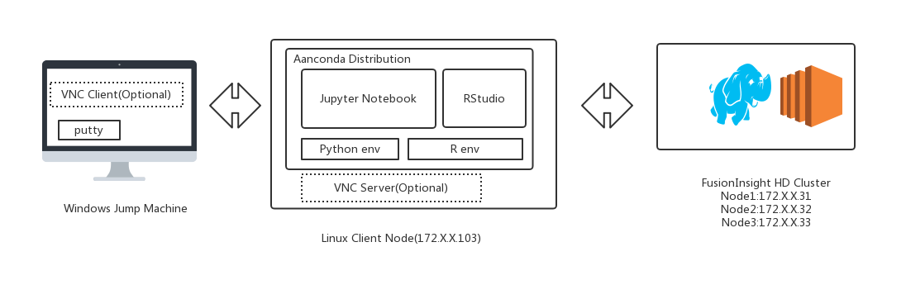
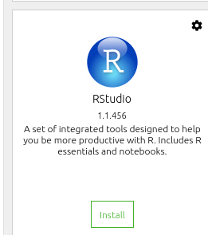
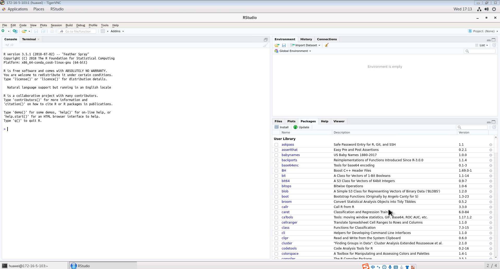
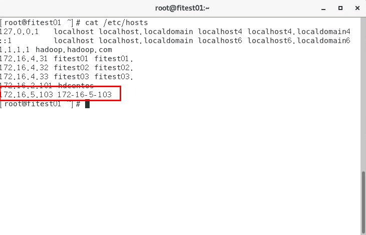
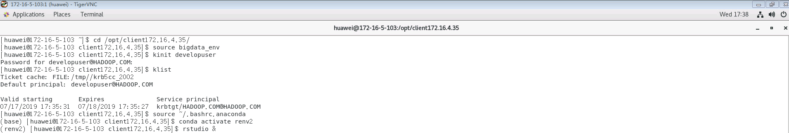
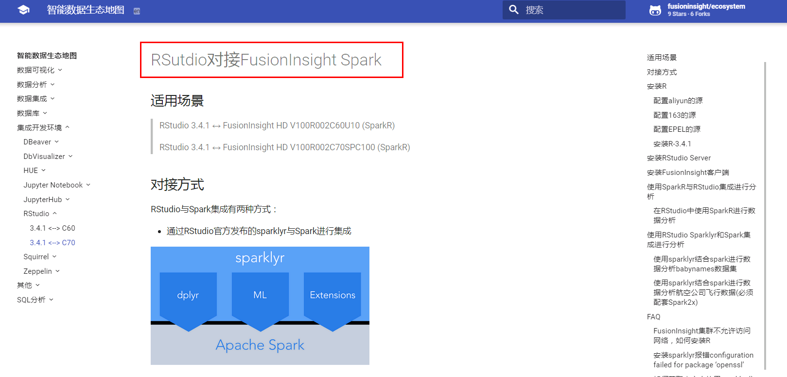
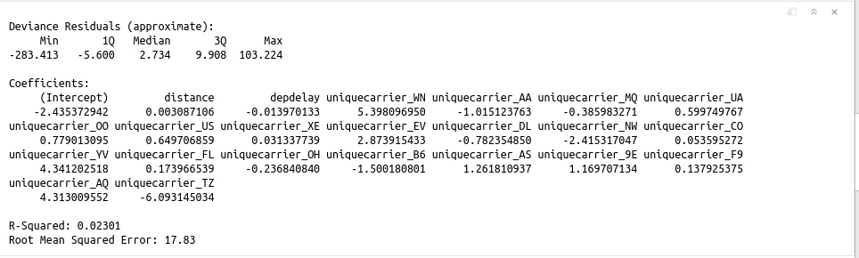
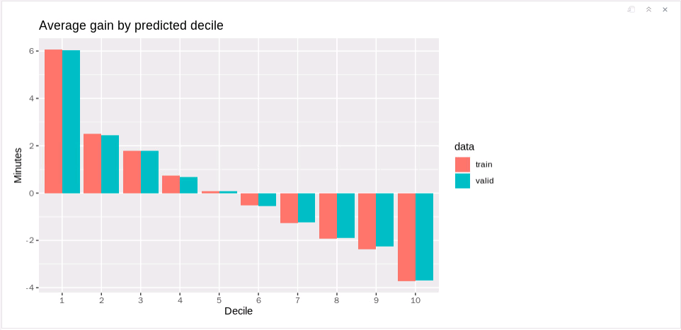
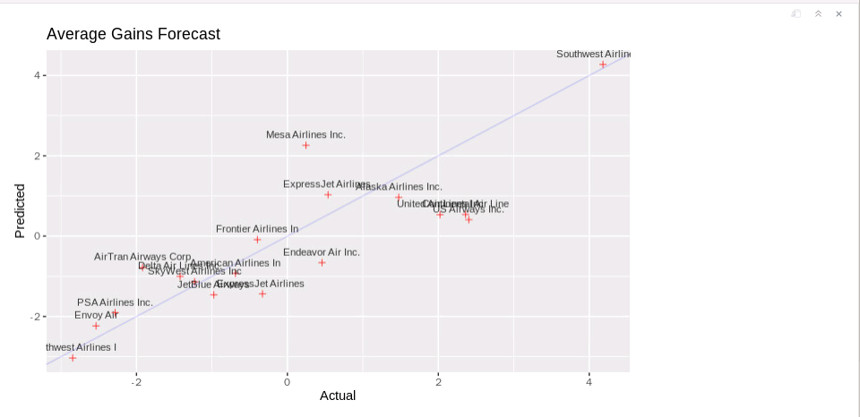
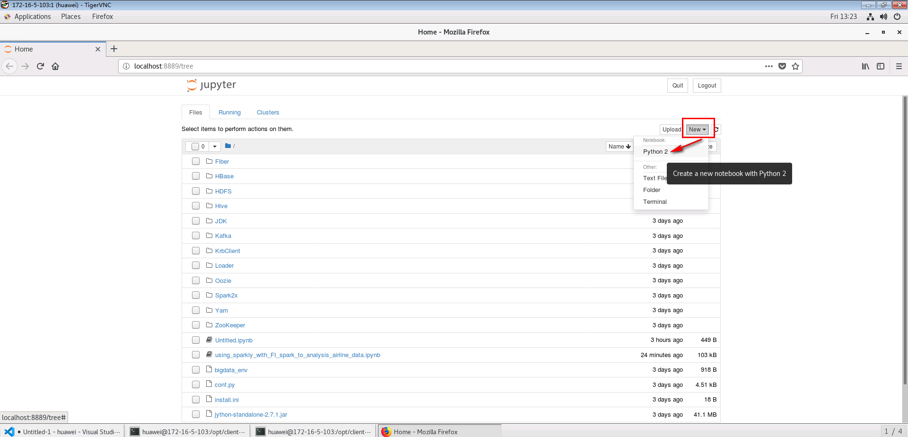

# Aanconda对接FusionInsight HD

## 适用场景

> Anaconda 2-2019.03-Linux-x86_64  <--> FusionInsight HD 6.5 (Spark2x)
>

## 产品介绍

**Anaconda**

Anaconda 是一个免费，易于安装的软件包管理器，环境管理器和python环境管理软件，其中包含1,000多个带有免费社区支持的开源软件包。 Anaconda可以部署在Windows，macOS以及Linux上。

更多信息请登录官网了解:[Anaconda](https://docs.anaconda.com/)


## 测试环境物理拓扑结构图

  


  说明：如果直接在带有图形界面的客户端主机工作，可以不用安装vnc客户端以及vnc Server

## 测试环境相关产品版本
* Anaconda2-2019.03-Linux-x86_64
* FusionInsight HD 6.5.1
* Spark 2.3.2
* R version 3.5.1 (2018-07-02)
* RStudio 1.1.456
* Python 2.7.16 |Anaconda, Inc.| (default, Mar 14 2019, 21:00:58)
* Jypyter Notebook 5.7.8


## Anaconda同FusionInsight HD交互的多种方式

(1) 使用R语言

* RStudio

    * **方案1：使用sparklyr在RStudio中以交互方式将R代码提交到HD Spark集群**

    说明：通过使用sparklyr来对航空公司航班进行数据分析，可查看在线demo http://rpubs.com/jinbnie/513252

    * **方案2: 使用SparkR在RStudio中以交互方式将R代码提交到HD Spark集群**

    说明:使用SparkR读取对接集群hive表里的数据

*	Jupyter Notebook

   * **方案3：使用sparklyr在jupyter notebook中以交互方式将R代码提交到HD Spark集群**

     说明: 与方案1的R代码一样，唯一的区别是交互环境换成了jupyter notebook

(2) 使用python语言

  * Jupyter Notebook

    * **方案4：在jupyter notebook中以交互方式将python代码提交到HD Spark集群**

    说明: 使用python接口，读取对接集群hdfs中的数据，完成一次经典的spark word count演示样例


##    前提条件
 * FusionInsight HD 6.5 环境安装完成
 * linux 客户端主机root权限
 * 测试环境相关windows跳板机，linux客户端主机以及对接FI HD集群网络互通


## 测试环境准备


**1. 在Linux客户端节点上安装和配置VNC服务器（如果可直接在GUI客户端环境中工作此步骤可省略）**

请参考： [How to Install and Configure VNC Server on CentOS 7](https://github.com/jinbonie/Tips4Tools/blob/master/vnc/README.md)


 **2.安装 Anaconda**

 参考Anaconda官方文档：https://docs.anaconda.com/anaconda/install/linux/

下载Anaconda安装包
```
wget https://repo.anaconda.com/archive/Anaconda2-2019.03-Linux-x86_64.sh
```

Enter the following to install Anaconda for Python 2.7:

使用如下命令安装Anaconda

`说明`

~/.bashrc 文件会在anaconda安装过程中初始化，请在安装前备份此配置文件


```
cp ~/.bashrc ~/.bashrc.bak
bash Anaconda2-2019.03-Linux-x86_64.sh

```


1.  安装程序将提示“In order to continue the installation process, please review the license agreement.”单击Enter以查看许可条款。

2.	滚动到许可条款的底部，然后输入“yes”以表示同意。

3.  安装程序提示您单击Enter接受默认安装位置，按CTRL-C取消安装，或指定备用安装目录。如果您接受默认安装位置，则安装程序将显示“PREFIX=/home/{username}/anaconda<2 or 3>”并继续安装。可能需要几分钟才能完成。

  注意： 推荐使用默认安装位置，如果使用非root用户进行交互，请安装在其他可访问的路径，比如/opt，否则之后会报关于用户权限的问题

4.  安装程序提示“Do you wish the installer to initialize Anaconda2 by running conda init?”推荐填写 “yes”。

5.	安装完成，会显示 “Thank you for installing Anaconda<2 or 3>!”
6.	完成后会提供一个PyCharm关于Anaconda的安装包链接 https://www.anaconda.com/pycharm.
7.	关闭并打开终端窗口，以使安装生效，

    ```
    mv ~/.bashrc ~/.bashrc.anaconda
    cp ~/.bashrc.bak ~/.bashrc
    source ~/.bashrc.anaconda
    ```


**3.创建R交互环境并且安装、运行RStudio**

参考：http://docs.anaconda.com/anaconda/navigator/tutorials/create-r-environment/


```
vi ~/.condarc
```

可以将如下内容添加到 ~/.condarc 文件中来增加conda相关包的下载速度

```
channels:
  - https://mirrors.ustc.edu.cn/anaconda/pkgs/main/
  - https://mirrors.ustc.edu.cn/anaconda/cloud/conda-forge/
  - https://mirrors.tuna.tsinghua.edu.cn/anaconda/pkgs/free/
  - defaults
show_channel_urls: true

```

启动 anaconda navigator

```
anaconda-navigator &
```


创建一个新的编译环境，比如起名为renv2

Python :2.7

R:r


回到Home, 安装 rstudio





启动 RStudio
```
conda env list
conda activate renv2
rstudio &
```



**4.安装 FusionInsight HD 客户端**

打开浏览器，登录FusionInsight Mananger，然后下载客户端


在Linux客户端节点上以root身份登录，运行下面的命令以安装HD客户端

```
su – root
scp root@172.16.4.32:/tmp/FusionInsight-Client/FusionInsight_Services_Client.tar /opt/FusionInsight_Services_Client172.16.4.35.tar
tar xvf FusionInsight_Services_Client172.16.4.35.tar
tar xvf FusionInsight_Services_ClientConfig.tar
cd FusionInsight_Services_ClientConfig/
./install.sh /opt/client172.16.4.35/

```


将客户端节点ip，主机名加入对接集群所有节点的/etc/hosts文件下，这一步的目的是起spark任务的时候，worker节点（集群节点）能够识别到driver主机（客户端节点）：



启动 RStudio

```
su - huawei
cd /opt/client172.16.4.35/
source bigdata_env
kinit developuser
klist

source ~/.bashrc.anaconda
conda activate renv2
rstudio &

```




## 方案1：使用sparklyr在RStudio中以交互方式将R代码提交到HD Spark集群

说明：通过使用sparklyr来对航空公司航班进行数据分析，可查看在线demo http://rpubs.com/jinbnie/513252


注意： 以下 7 步的源码可以在如下链接中获取：[RStudio](https://fusioninsight.github.io/ecosystem/zh-hans/Development/RStudio/)



第5,7步进行相关适配可以对接 FI HD 6.5(Spark 2.3.2).

**Step 1 安装相关包**

```
install.packages("sparklyr")
install.packages("dplyr")
install.packages("ggplot2")
install.packages("babynames")
install.packages("dygraphs")
install.packages("rbokeh")

```

**Step 2 连接spark**

```
library(sparklyr)
library(dplyr)
library(ggplot2)
options(bitmapType = 'cairo')
Sys.setenv(JAVA_HOME="/opt/client172.16.4.35/JDK/jdk-8u201")
Sys.setenv(SPARK_HOME="/opt/client172.16.4.35/Spark2x/spark")
spark_version_from_home(Sys.getenv("SPARK_HOME"))
Sys.setenv(SPARK_HOME_VERSION="2.3.2")
sc <- spark_connect(master =  "yarn-client", version = "2.3.2", spark_home = "/opt/client172.16.4.35/Spark2x/spark")

```


**Step 3 将提前建好的hive表存入缓存**

说明：具体数据准备的方法请参考生态地图->Rstudio->如何获取本文中使用sparklyr分析的源数据


```
#Use tbl_cache to load the flights table into memory. Caching tables will make analysis much faster. Create a dplyr reference to the Spark DataFrame.

# Cache flights Hive table into Spark
tbl_cache(sc, 'flights')
flights_tbl <- tbl(sc, 'flights')

# Cache airlines Hive table into Spark
tbl_cache(sc, 'airlines')
airlines_tbl <- tbl(sc, 'airlines')

# Cache airports Hive table into Spark
tbl_cache(sc, 'airports')
airports_tbl <- tbl(sc, 'airports')
```

**Step 4 建模**
```
#Filter the data to contain only the records to be used in the fitted model. Join carrier descriptions for reference. Create a new variable called gain which represents the amount of time gained (or lost) in flight.

# Filter records and create target variable 'gain'
model_data <- flights_tbl %>%
filter(!is.na(arrdelay) & !is.na(depdelay) & !is.na(distance)) %>%
filter(depdelay > 15 & depdelay < 240) %>%
filter(arrdelay > -60 & arrdelay < 360) %>%
filter(year >= 2003 & year <= 2007) %>%
left_join(airlines_tbl, by = c("uniquecarrier" = "code")) %>%
mutate(gain = depdelay - arrdelay) %>%
select(year, month, arrdelay, depdelay, distance, uniquecarrier, description, gain)

# Summarize data by carrier
model_data %>%
group_by(uniquecarrier) %>%
summarize(description = min(description), gain=mean(gain),
          distance=mean(distance), depdelay=mean(depdelay)) %>%
select(description, gain, distance, depdelay) %>%
arrange(gain)
```


**Step 5 训练模型**
```
#Predict time gained or lost in flight as a function of distance, departure delay, and airline carrier.

# Partition the data into training and validation sets
model_partition <- model_data %>%
sdf_random_split(train = 0.8, valid = 0.2, seed = 5555)

# Fit a linear model
ml1 <- model_partition$train %>%
ml_linear_regression(gain ~ distance + depdelay + uniquecarrier)

# Summarize the linear model
summary(ml1)
```




**Step 6 评估模型表现**
```
#Compare the model performance using the validation data.

# Calculate average gains by predicted decile
model_deciles <- lapply(model_partition, function(x) {
  ml_predict(ml1, x) %>%
    mutate(decile = ntile(desc(prediction), 10)) %>%
    group_by(decile) %>%
    summarize(gain = mean(gain)) %>%
    select(decile, gain) %>%
    collect()
})

# Create a summary dataset for plotting
deciles <- rbind(
  data.frame(data = 'train', model_deciles$train),
  data.frame(data = 'valid', model_deciles$valid),
  make.row.names = FALSE
)

# Plot average gains by predicted decile
deciles %>%
  ggplot(aes(factor(decile), gain, fill = data)) +
  geom_bar(stat = 'identity', position = 'dodge') +
  labs(title = 'Average gain by predicted decile', x = 'Decile', y = 'Minutes')

```




**Step 7  将预测可视化**
```
#Compare actual gains to predicted gains for an out of time sample.

# Select data from an out of time sample
data_2008 <- flights_tbl %>%
  filter(!is.na(arrdelay) & !is.na(depdelay) & !is.na(distance)) %>%
  filter(depdelay > 15 & depdelay < 240) %>%
  filter(arrdelay > -60 & arrdelay < 360) %>%
  filter(year == 2008) %>%
  left_join(airlines_tbl, by = c("uniquecarrier" = "code")) %>%
  mutate(gain = depdelay - arrdelay) %>%
  select(year, month, arrdelay, depdelay, distance, uniquecarrier, description, gain, origin,dest)

# Summarize data by carrier
carrier <- ml_predict(ml1, data_2008) %>%
  group_by(description) %>%
  summarize(gain = mean(gain), prediction = mean(prediction), freq = n()) %>%
  filter(freq > 10000) %>%
  collect

# Plot actual gains and predicted gains by airline carrier
ggplot(carrier, aes(gain, prediction)) +
  geom_point(alpha = 0.75, color = 'red', shape = 3) +
  geom_abline(intercept = 0, slope = 1, alpha = 0.15, color = 'blue') +
  geom_text(aes(label = substr(description, 1, 20)), size = 3, alpha = 0.75, vjust = -1) +
  labs(title='Average Gains Forecast', x = 'Actual', y = 'Predicted')
```



## 方案2: 使用SparkR在RStudio中以交互方式将R代码提交到HD Spark集群

说明：使用SparkR读取预存的hive表数据


启动 RStudio
```
cd /opt/client172.16.4.35/
source ~/.bashrc.anaconda
conda activate renv2
source bigdata_env
kinit developuser
klist
rstudio &

```
在RStudio中提交如下R代码

```
if (nchar(Sys.getenv("SPARK_HOME")) < 1) {
  Sys.setenv(SPARK_HOME="/opt/client172.16.4.35/Spark2x/spark")
}
library(SparkR, lib.loc = c(file.path(Sys.getenv("SPARK_HOME"), "R", "lib")))
sparkR.session(master = "yarn", sparkConfig = list(spark.driver.memory = "2g"),(spark.submit.deployMode="client"))

results <- sql("FROM airports SELECT id, name ")
head(results)
```


## 方案3：使用sparklyr在jupyter notebook中以交互方式将R代码提交到HD Spark集群

**step 1:启动 Jupyter Notebook**

```
cd /opt/client172.16.4.35/
source bigdata_env
kinit developuser
source ~/.bashrc.anaconda
conda env list
conda activate renv2
sudo chmod -R 777 /opt/client172.16.4.35
jupyter-notebook &

```

**step 2:创建一个新的 R Notebook**


**step 3:在Jupyter Notebook提交同方案1中相同的R代码，查看结果**


## **方案4：在jupyter notebook中以交互方式将python代码提交到HD Spark集群**

说明: 使用python接口，读取对接集群hdfs中的数据，完成一次经典的spark word count演示样例

**step 1:启动 PySpark**

```
cd /opt/client172.16.4.35/
source bigdata_env
kinit developuser
klist
source ~/.bashrc.anaconda
export PYSPARK_DRIVER_PYTHON="ipython"
export PYSPARK_DRIVER_PYTHON_OPTS="notebook"
pyspark --master yarn --deploy-mode client &

```

**step 2:创建一个新的Python Notebook**



**step3:在Jupyter Notebook中提交如下的python代码**

```
# spark-wordcount.py
from pyspark import SparkConf
from pyspark import SparkContext
conf = SparkConf()
conf.setAppName('spark-wordcount_from172.16.5.103')
sc = SparkContext(conf=conf)
distFile = sc.textFile('hdfs://hacluster/user/developuser/airlines.csv')
nonempty_lines = distFile.filter(lambda x: len(x) > 0)
print 'Nonempty lines', nonempty_lines.count()
words = nonempty_lines.flatMap(lambda x: x.split(' '))
wordcounts = words.map(lambda x: (x, 1)) \
                  .reduceByKey(lambda x, y: x+y) \
                  .map(lambda x: (x[1], x[0])).sortByKey(False)
print 'Top 100 words:'
print wordcounts.take(100)

```
查看结果:

