# DBeaver对接FusionInsight

## 适用场景

> DBeaver 6.3.4 <--> FusionInsight HD 6.5 (Hive/Phoenix/SparkSQL/Hetu)
>
> DBeaver 6.3.4 <--> FusionInsight MRS 8.0 (Hive/Phoenix/SparkSQL/Hetu)

## 文档说明

本文介绍了两种方式对接dbeaver和fusioninsight.

1. 使用通用jdbc接口的方式对接hive, hetu
2. 使用Fiber对接hive, spark2x, phoenix(HBase)

请根据实际情况选取合适的对接方式，如果只是对接hive, hetu使用通用jdbc的方式配置更容易，如果需要对接spark2x或者使用phoenix的方式对接HBase，请参考Fiber相关章节进行配置

## 准备工作

* （重要）检查windows环境jdk版本为1.8.0_251

  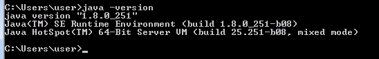

  注意：如果使用java 1.8.0_112版本进行配置,会出现不能同时访问pheonix,hive和spark2x的问题,建议更换高版本jdk

* 登录FusionInsight Manager创建一个“人机”用户，例如：developuser，具体请参见FusionInsight HD产品文档的`管理员指南->系统设置->权限设置->用户管理->创建用户`章节.给developuser用户授予所有访问权限，包含但不限于Spark2x、Hive、HBase.

* 已完成FusionInsight HD客户端安装，具体请参见FusionInsight HD产品文档的`应用开发指南->安全模式->安全认证->配置客户端文件`章节.

* 已将集群的节点主机名与IP的映射关系加入到windows的hosts文件中`C:\Windows\System32\drivers\etc\hosts`.

* 客户端机器的时间与FusionInsight HD集群的时间要保持一致，时间差小于5分钟.

* Windows上已经安装好jdk1.8或者以上版本，并完成jdk环境变量配置.

* Hive数据库已存在表student，数据类似于：

  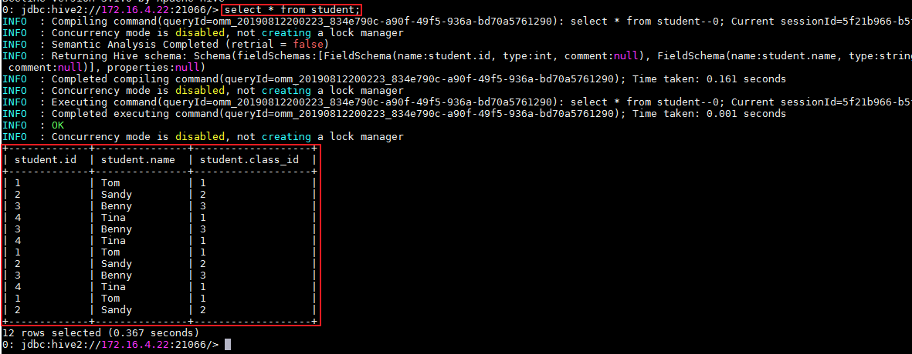

  **示例如下：**

  ```
  CREATE TABLE IF NOT EXISTS student(id INT, name STRING, class_id INT);
  INSERT INTO student VALUES (1,'Tom',1);
  INSERT INTO student VALUES (2,'Sandy',2);
  INSERT INTO student VALUES (3,'Benny',3);
  INSERT INTO student VALUES (4,'Tina',1);
  ```

## 安全认证相关配置

  参考产品文档MIT配置相关部分(第1步到第4步)

  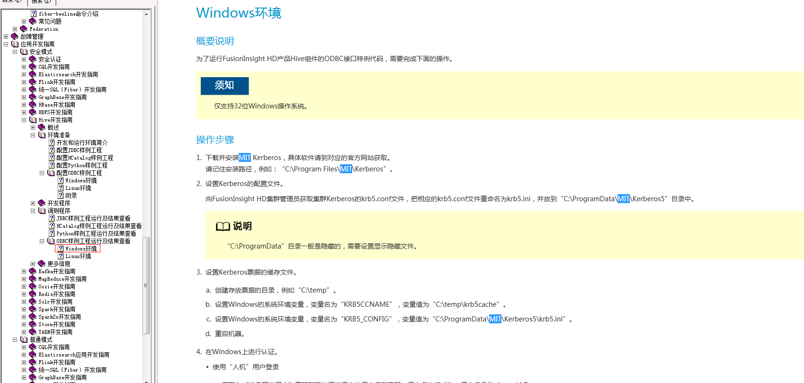

  - 从<http://web.mit.edu/kerberos/dist/#kfw-4.0>下载对应操作系统架构的MIT Kerberos并安装.

  - 从Manager下载认证用户的配置文件：user.keytab以及krb5.conf

  - 设置Kerberos的配置文件.将用户的krb5.conf文件重命名为 **krb5.ini** 放在`C:\Windows`目录下.

  - 设置Kerberos的配置文件.将用户的krb5.conf文件重命名为 **krb5.ini** 放在`C:\ProgramData\MIT\Kerberos5`目录下.

  - 设置Kerberos票据的缓存文件

    * 在本地创建存放票据的目录，例如`C:\temp`.

    * 设置Windows的系统环境变量，变量名为`KRB5CCNAME`，变量值为`C:\temp\krb5cache`.

      

    - 设置Windows的系统环境变量，变量名为`KRB5_CONFIG`，变量值为`C:\ProgramData\MIT\Kerberos5\krb5.ini`.

      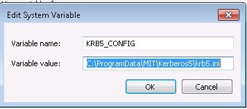

  - 重启跳板机

  - 在Windows上进行认证

    打开MIT Kerberos，单击 **get Ticket** ，在弹出的MIT Kerberos: Get Ticket窗口中，**Pricipal** 输入用户名`developuser@HADOOP.COM`，**Password** 输入密码，单击 **OK**.

    

  - 在`C:\ecotesting\Fiber\conf`目录下新建 **jaas.conf** 文件，内容如下所示：

    ```
    Client {
      com.sun.security.auth.module.Krb5LoginModule required
      useKeyTab=true
      keyTab="C:\\ecotesting\\Fiber\\conf\\user.keytab"
      principal="developuser"
      useTicketCache=false
      storeKey=true
      debug=true;
    };
    ```

    注意： 其中keyTab参数以及principal参数为对应的认证用户名以及认证文件路径

## 安装DBeaver

* 从<http://dbeaver.jkiss.org/download/>下载DBeaver软件，并完成安装.

* 指定DBeaver的JDK虚拟机.在DBeaver安装目录下，打开dbeaver.ini设置 **-vm** 参数的值，参数和值之间需要换行.

  **示例如下：**
  ```
  -vm
  C:\java64\jdk\bin

  配置文件最后加上：
  -Djava.security.auth.login.config=C:\\ecotesting\\Fiber\\conf\\jaas.conf
  -Dzookeeper.sasl.clientconfig=Client
  -Dzookeeper.auth.type=kerberos
  -Dzookeeper.server.principal=zookeeper/hadoop.hadoop.com
  ```

  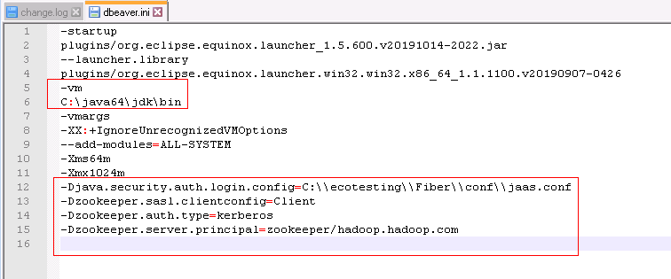

* 重启DBeaver.

  修改dbeaver.ini后需要重启DBeaver才生效.

## 使用自定义JDBC对接Hive

* 进入DBeaver界面，菜单选择`Database->DriverManager`，在弹出的对话框中点击 **New**.

  

- 新建的连接名字为FI-hive-test，连接信息如下,完成后点击OK

  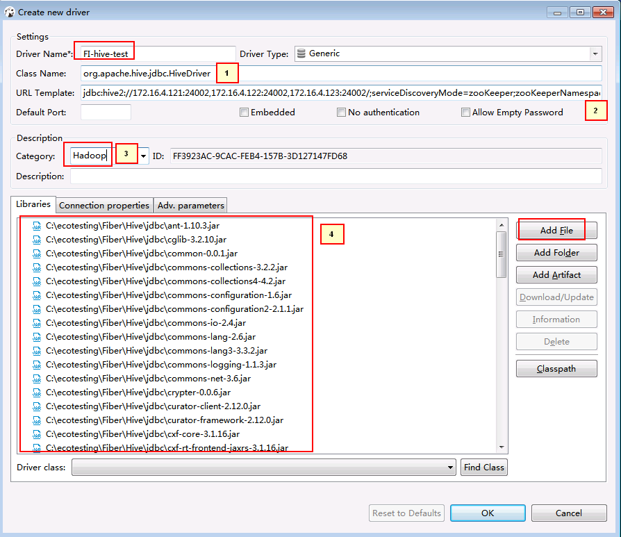

  ```
  1. org.apache.hive.jdbc.HiveDriver
  2. jdbc:hive2://172.16.4.121:24002,172.16.4.122:24002,172.16.4.123:24002/;serviceDiscoveryMode=zooKeeper;zooKeeperNamespace=hiveserver2;sasl.qop=auth-conf;auth=KERBEROS;principal=hive/hadoop.hadoop.com@HADOOP.COM
  3. Hadoop
  4. 点Add File在下载好的hive客户端lib中把所有jar包加进去
  ```

* 菜单栏选择`File->New->Database Connection`.点击 **Next**.

  

- 选择FI-hive-test点击NEXT

  

- 点击Finish

  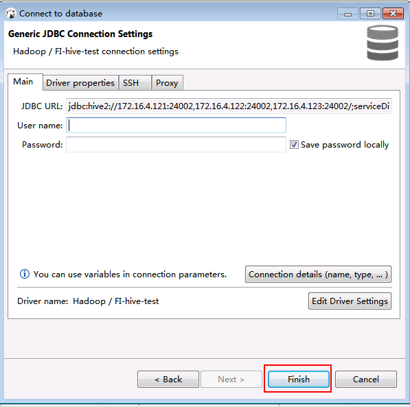

- 右键选择FI-hive-test点击Edit Connection

  

- 点击Test connection

  

- 查看结果数据

  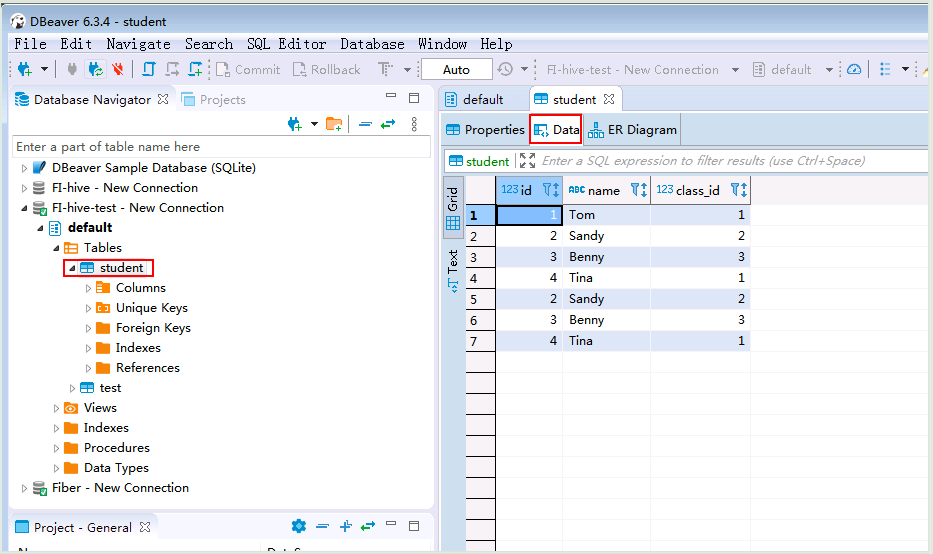

## 使用自定义JDBC对接Spark2x

- （重要 fi6.5.1）准备spark2x jdbc连接驱动jar包

  登陆linux端spark2x客户端找到jdbc相关依赖，比如：`/opt/145_651hdclient/hadoopclient/Spark2x/spark/jars/jdbc`

  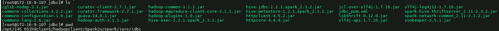

  将该路径下所有的jar包拷贝到windows本地目录，比如`E:\145config\spark2xjars`, 注意里面含有一个jdbc_pom.xml文件，需要删除

  

  继续登陆linux端spark2x客户端路径`/opt/145_651hdclient/hadoopclient/Spark2x/spark/jars`,分别找到如下4个jar包，拷贝到windows本地目录，比如`E:\145config\spark2xjars`

  ```
  log4j-1.2.17.jar
  woodstox-core-5.0.3.jar
  stax2-api-3.1.4.jar
  commons-configuration2-2.1.1.jar
  ```

  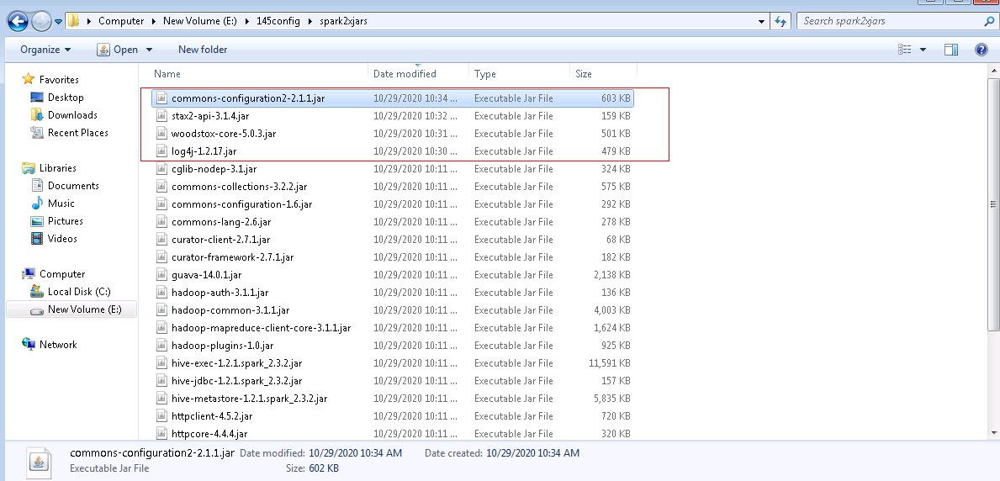

  说明: 如果是mrs8.0.2版本准备的依赖为：

  1.  登陆linux端spark2x客户端找到jdbc相关依赖，比如：`/opt/80_135_hadoopclient2/hadoopclient/Spark2x/spark/jars/jdbc`下所有依赖

  2. 继续登陆linux端spark2x客户端路径`/opt/80_135_hadoopclient2/hadoopclient/Spark2x/spark/jars`,分别找到如下5个jar包

  ```
  log4j-1.2.17-atlassian-13.jar
  commons-lang-2.6.jar
  woodstox-core-5.0.3.jar
  stax2-api-3.1.4.jar
  commons-configuration2-2.1.jar
  ```

* 进入DBeaver界面，菜单选择`Database->DriverManager`，在弹出的对话框中点击 **New**.

  


- 新建的连接名字为FI-spark2x-651-direct，连接信息如下,完成后点击OK

  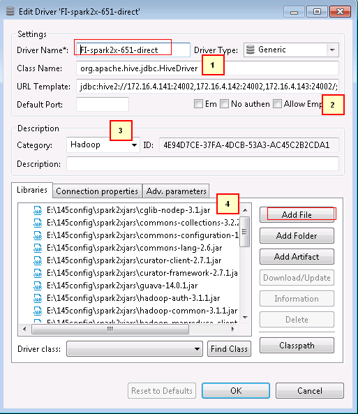

  ```
  1. org.apache.hive.jdbc.HiveDriver
  2. jdbc:hive2://172.16.4.141:24002,172.16.4.142:24002,172.16.4.143:24002/;serviceDiscoveryMode=zooKeeper;zooKeeperNamespace=sparkthriftserver2x;saslQop=auth-conf;auth=KERBEROS;principal=spark2x/hadoop.hadoop.com@HADOOP.COM;user.principal=developuser;user.keytab=E:/145config/user.keytab
  3. Hadoop
  4. 点Add File在上述步骤配置好的spark2x连接所有jar包加进去
  ```

  注意：连接url的user.principal=developuser;user.keytab=E:/145config/user.keytab这两个参数必须加上，并且保证正确

  连接url串，可在Linux客户端使用`spark-beeline`命令获取参考：

  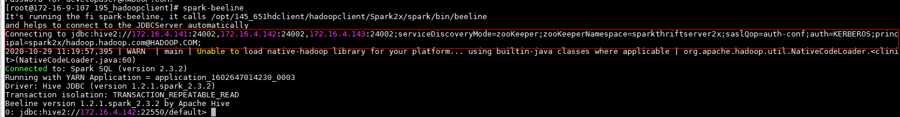

* 菜单栏选择`File->New->Database Connection`.点击 **Next**.

  

- 选择FI-spark2x-651-direct点击NEXT

  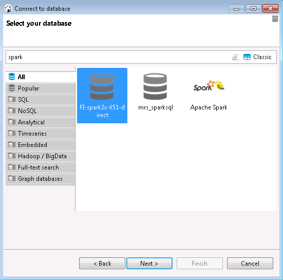

- 点击Finish

  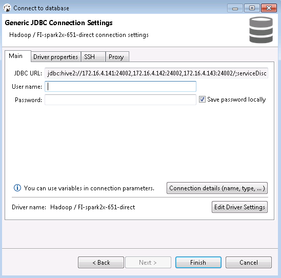

- 右键选择FI-spark2x-651-direct点击Edit Connection

  

- 点击Test connection

  

  mrs 8.0.2的测试结果如下：

  

- 查看结果数据

  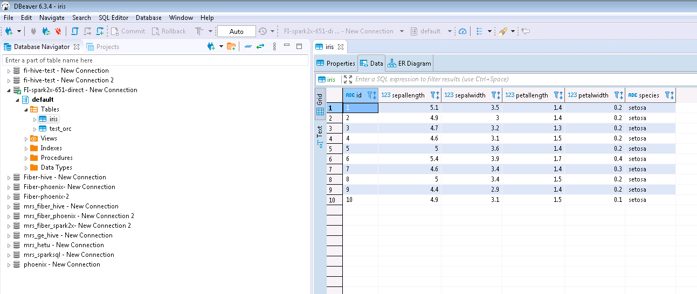

  mrs 8.0.2的测试结果如下：

  

## 使用自定义JDBC对接Hetu

- 创建hetu对接配置路径`C:\ecotesting\hetu-config`,准备一下认证文件

  

  其中`presto-jdbc-316.jar`为Hetu对接jdbc驱动jar包，在客户端中获得

  hetuserver.jks文件在服务端HSBroker下获得

  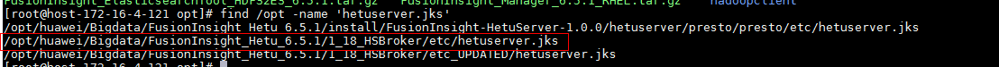

  user.keytab和krb5.conf文件为用户的认证文件，在manager上获得

* 进入DBeaver界面，菜单选择`Database->DriverManager`，在弹出的对话框中点击 **New**.

  

- 新建的连接名字为FI-hetu-test，连接信息如下,完成后点击OK

  

  ```
  1. io.prestosql.jdbc.PrestoDriver
  2. jdbc:presto://172.16.4.121:24002,172.16.4.122:24002,172.16.4.123:24002?serviceDiscoveryMode=zooKeeper&zooKeeperNamespace=hsbroker&deploymentMode=on_yarn&user=developuser&SSL=true&SSLTrustStorePath=C:/ecotesting/hetu-config/hetuserver.jks&KerberosConfigPath=C:/ecotesting/hetu-config/krb5.conf&KerberosPrincipal=developuser&KerberosKeytabPath=C:/ecotesting/hetu-config/user.keytab&KerberosRemoteServiceName=HTTP&KerberosServicePrincipalPattern=%24%7BSERVICE%7D%40%24%7BHOST%7D
  3. Hadoop
  4. 点Add File在下载好的hive客户端lib中把所有jar包加进去
  ```

  注意： jdbc连接串中含有用户名信息以及相关配置文件的路径，请根据实际情况配置


* 菜单栏选择`File->New->Database Connection`.点击 **Next**.

  

- 选择FI-hetu-test点击NEXT

  

- 点击Finish

  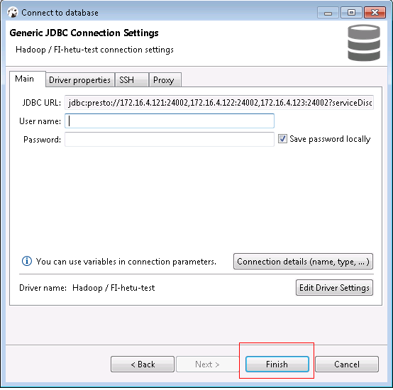

- 右键选择FI-hetu-test点击Edit Connection

  

- 点击Test connection

  

- 查看结果数据

  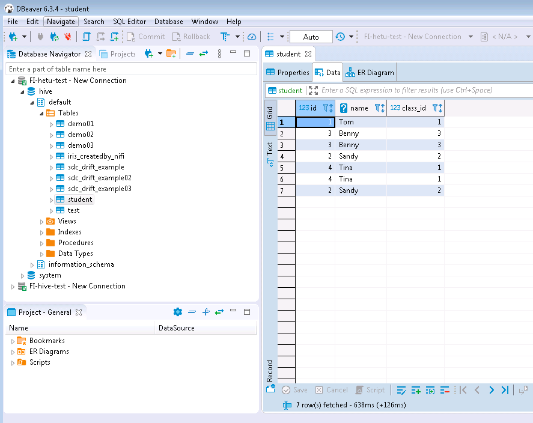

## Fiber 简介

SQL开发工具，如DbVisualizer、DBeaver、Squirrel是数据库开发的常用选择，虽然这些工具大多不提供原生Hive、SparkSQL、Phoenix的支持，但是通过它们支持的自定义JDBC的能力，我们可以与FusionInsignt提供的Fiber组件的JDBC接口进行对接，实现这Hive、SparkSQL、Phoenix组件的统一SQL查询.

* Fiber架构图

  

本文档主要描述在Window操作系统，DBeaver通过Fiber方式对接FusionInsight HD的Hive、Spark2x、Phoenix组件.


## Fiber认证方式配置

### 操作场景

Fiber的安全认证有kinit和keytab两种方式.具体参数配置说明可参考FusionInsight HD产品文档的`业务操作指南->统一SQL(Fiber)->客户端配置`章节.

### 前提条件

* 已完成准备工作.

* 将FusionInsight HD客户端的Fiber、Hive、Spark2x、HBase客户端文件夹，拷贝至本地新建目录`C:\ecotesting`.假设FusionInsight HD客户端安装于`/opt/hadoopclient`目录，则：

  * 将`/opt/hadoopclient/Fiber`拷贝至本地`C:\ecotesting`目录.

  * 将`/opt/hadoopclient/Hive`拷贝至本地`C:\ecotesting\Fiber`目录.

  * 将`/opt/hadoopclient/Spark2x`拷贝至本地`C:\ecotesting\Fiber`目录.

  * 将`/opt/hadoopclient/HBase`拷贝至本地`C:\ecotesting\Fiber`目录.

  

* 登录FusionInsight Manager的`系统->用户->更多（developuser）->下载认证凭证`，下载developuser对应的认证凭证.将用户的 **krb5.conf** 和 **user.keytab** 文件拷贝到`C:\ecotesting\Fiber\conf`目录下.

### 操作步骤


- 修改配置文件`C:\ecotesting\Fiber\conf\fiber.xml`.

  **Hive的JDBC配置示例：**
  ```
  <jdbc>
    <identify>hive</identify>
    <describe>hive jdbc configuration</describe>
    <driverClass>org.apache.hive.jdbc.HiveDriver</driverClass>
    <securityClass>com.huawei.fiber.DefaultAuthenticationCallback</securityClass>     
    <classPath>C:\\ecotesting\\Fiber\\Hive\\config;C:\\ecotesting\\Fiber\\Hive\\Beeline\\lib;C:\\ecotesting\\Fiber\\Hive\\Beeline\\conf</classPath>
    <jdbcUrl>jdbc:hive2://172.16.4.121:24002,172.16.4.122:24002,172.16.4.123:24002/;serviceDiscoveryMode=zooKeeper;zooKeeperNamespace=hiveserver2;sasl.qop=auth-conf;auth=KERBEROS;principal=hive/hadoop.hadoop.com@HADOOP.COM</jdbcUrl>
    <properties>
      <property>
        <name>java.security.krb5.conf</name>
        <value>C:\\ecotesting\\Fiber\\conf\\krb5.conf</value>
      </property>
      <property>
        <name>java.security.auth.login.config</name>
        <value>C:\\ecotesting\\Fiber\\conf\\jaas.conf</value>
      </property>
      <property>
        <name>zookeeper.server.principal</name>
        <value>zookeeper/hadoop.hadoop.com</value>
      </property>
      <property>
        <name>zookeeper.kinit</name>
        <value>C:\\java64\\jdk\\bin\\kinit.exe</value>
      </property>
    </properties>
  </jdbc>
  ```

  **Spark2x的JDBC配置示例：**
  ```
  <jdbc>
    <identify>Spark2x</identify>
    <describe>Spark2x jdbc configuration</describe>
    <driverClass>org.apache.hive.jdbc.HiveDriver</driverClass>
    <securityClass>com.huawei.fiber.DefaultAuthenticationCallback</securityClass>
    <classPath>C:\\ecotesting\\Fiber\\Spark2x\\spark\\conf;C:\\ecotesting\\Fiber\\Spark2x\\spark\\jars</classPath>
    <jdbcUrl>jdbc:hive2://172.16.4.121:24002,172.16.4.122:24002,172.16.4.123:24002;serviceDiscoveryMode=zooKeeper;zooKeeperNamespace=sparkthriftserver2x;saslQop=auth-conf;auth=KERBEROS;principal=spark2x/hadoop.hadoop.com@HADOOP.COM;</jdbcUrl>
    <properties>
  	<property>
  	  <name>java.security.krb5.conf</name>
  	  <value>C:\\ecotesting\\Fiber\\conf\\krb5.conf</value>
  	</property>
  	<property>
  	  <name>java.security.auth.login.config</name>
  	  <value>C:\\ecotesting\\Fiber\\conf\\jaas.conf</value>
  	</property>
  	<property>
  	  <name>zookeeper.server.principal</name>
  	  <value>zookeeper/hadoop.hadoop.com</value>
  	</property>
  	<property>
  	  <name>zookeeper.kinit</name>
  	  <value>C:\\java64\\jdk\\bin\\kinit.exe</value>
  	</property>
    </properties>
  </jdbc>
  ```

  **Phoenix的JDBC配置示例：**
  ```
  <jdbc>
    <identify>phoenix</identify>
    <describe>phoenix jdbc configuration</describe>
    <driverClass>org.apache.phoenix.jdbc.PhoenixDriver</driverClass>
    <securityClass>com.huawei.fiber.DefaultAuthenticationCallback</securityClass>
    <classPath>C:\\ecotesting\\Fiber\\HBase\\hbase\\lib;C:\\ecotesting\\Fiber\\HBase\\hbase\\conf</classPath>
    <jdbcUrl>jdbc:phoenix</jdbcUrl>
    <properties>
      <property>
        <name>java.security.krb5.conf</name>
        <value>C:\\ecotesting\\Fiber\\conf\\krb5.conf</value>
      </property>
      <property>
        <name>java.security.auth.login.config</name>
        <value>C:\\ecotesting\\Fiber\\conf\\jaas.conf</value>
      </property>
      <property>
        <name>zookeeper.server.principal</name>
        <value>zookeeper/hadoop.hadoop.com</value>
      </property>
      <property>
        <name>zookeeper.kinit</name>
        <value>C:\\java64\\jdk\\bin\\kinit.exe</value>
      </property>
    </properties>
  </jdbc>
  ```

- 对接Phoenix时，需要修改配置文件`C:\ecotesting\Fiber\HBase\hbase\conf\hbase-site.xml`在末尾新增属性 **hbase.myclient.keytab** 和 **hbase.myclient.principal**.

  ```
  <property>
    <name>hbase.myclient.keytab</name>
    <value>C:\\ecotesting\\Fiber\\conf\\user.keytab</value>
  </property>
  <property>
    <name>hbase.myclient.principal</name>
    <value>developuser</value>
  </property>
  ```

- 在`C:\ecotesting\Fiber\conf`目录下新建 **jaas.conf** 文件，示例如下（如果已配置可以略过此步）：
  ```
  Client {
    com.sun.security.auth.module.Krb5LoginModule required
    useKeyTab=true
    keyTab="C:\\ecotesting\\Fiber\\conf\\user.keytab"
    principal="developuser"
    useTicketCache=false
    storeKey=true
    debug=true;
  };
  ```

* 指定DBeaver的JDK虚拟机.在DBeaver安装目录下，打开dbeaver.ini设置 **-vm** 参数的值，参数和值之间需要换行（如果已配置可以略过此步）.

  **示例如下：**
  ```
  -vm
  C:\java64\jdk\bin

  配置文件最后加上：
  -Djava.security.auth.login.config=C:\\ecotesting\\Fiber\\conf\\jaas.conf
  -Dzookeeper.sasl.clientconfig=Client
  -Dzookeeper.auth.type=kerberos
  -Dzookeeper.server.principal=zookeeper/hadoop.hadoop.com
  ```

  

  完成后重启dbeaver配置生效

## DBeaver对接Fiber

### 操作场景

DBeaver通过Fiber方式对接FusionInsight HD的Hive、Spark2x、Phoenix组件.

### 操作步骤

#### DBeaver通过Fiber对接Hive

* 进入DBeaver界面，菜单选择`Database->DriverManager`，在弹出的对话框中点击 **New**.

  

* 填写基本信息如下：

  ```
  Driver Name：Fiber（自定义）
  Class Name：com.huawei.fiber.FiberDriver
  URL Template：jdbc:fiber://
  Default Port：2345（可随便写）
  Category: Hadoop
  ```
* 点击 **Add File** ，增加`C:\ecotesting\Fiber\lib`所有的jar包.

  

* 点击 **Connection properties**，增加两个属性.点击 **OK**.
  ```
  defaultDriver = hive
  fiberconfig = C:\\ecotesting\\Fiber\\conf\\fiber.xml
  ```

  

* 菜单栏选择`File->New->Database Connection`.点击 **Next**.

  

* 选择 **Fiber**，点击 **Next**.

  

* “User name”和“Password”可以不填写，点击 **Connection details (name,type,...)**.

  

* “Connection name”输入 **Hadoop - Fiber**.点击 **back**.

  

* 确认“defaultDirver”为 **hive**.其余选项保持默认.点击 **Finish**.

  

* 测试hive连接.

  * 右键`Database Navigator->Hadoop - Fiber`选择 **Edit Connection**.

    

  * 点击`Driver properties`确认“defaultDirver”为 **hive**，点击 **Test Connection ...**，返回使用的Server和Driver版本信息，则连接成功.点击 **OK** 关闭配置窗口.

    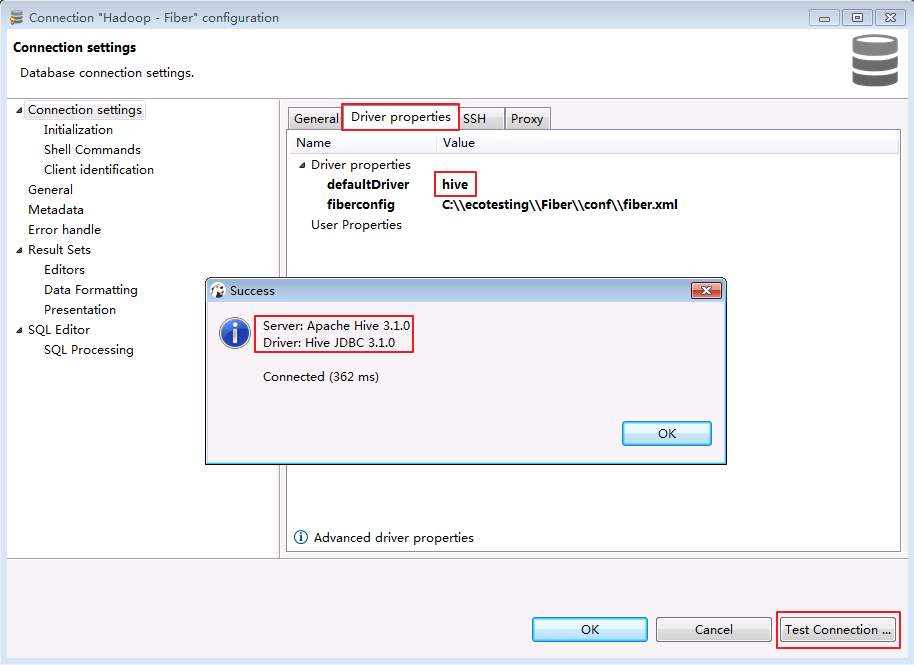

* 双击`Database Navigator->Hadoop - Fiber`，返回默认数据库 **default** 则表示通过Fiber连接Hive成功.

  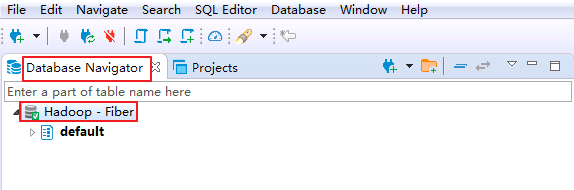

* 查看Hive表的数据.点击`default->tables->student`，在`Data`页面可查看student表数据.

  

* SQL查询Hive表的数据.

  * 在菜单栏选择`SQL Editor->New SQL Editor`.

    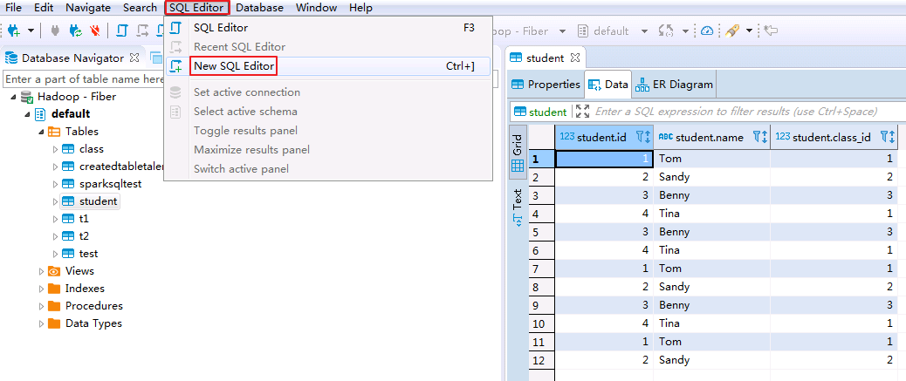

  * 输入查询语句，点击右三角执行脚本，返回查询表的数据.

    `SELECT * FROM student;`

    

* 向Hive表test插入数据

  * 在SQL Editor中输入以下脚本创建存储格式为textfile，分隔符为“,”的表 **test**.表的存储格式必须为 **textfile**，否则不能使用LOAD DATA方式向表插入数据.

    `CREATE TABLE IF NOT EXISTS test (id string, name STRING) ROW FORMAT DELIMITED FIELDS TERMINATED BY ',' STORED AS textfile;`

    

  * 登录FusionInsight集群客户端，编辑数据文件 **data_input.txt**，并执行 **hdfs dfs -put data_input.txt /tmp** 上传至集群的HDFS文件系统的/tmp/目录下.

    **data_input.txt内容如下：**

    ```
    1,Abbey
    2,Andy

    ```

    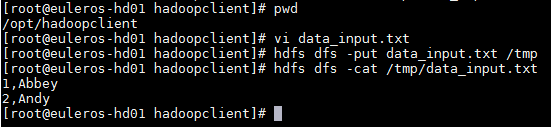

  * 在SQL Editor中输入以下脚本将data_input.txt数据导入表test.

    `LOAD DATA INPATH '/tmp/data_input.txt' OVERWRITE INTO TABLE test;`

    

  * 在SQL Editor中输入脚本查询表test.

    `SELECT * FROM test;`

    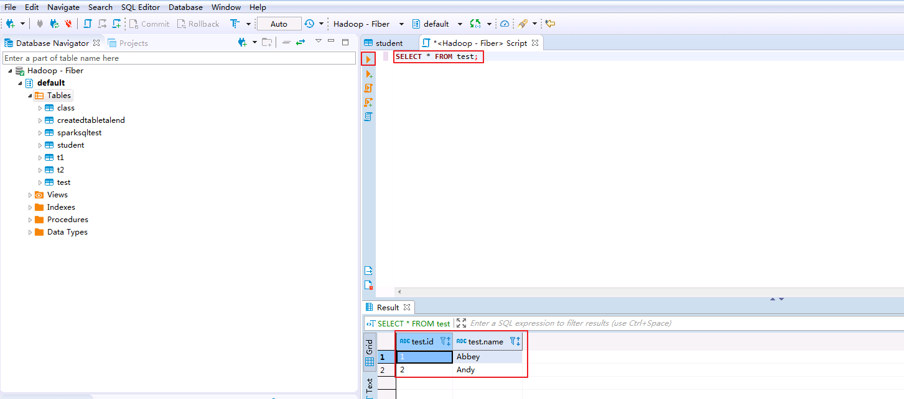

#### DBeaver通过Fiber对接Spark2x

* 右键`Database Navigator->Hadoop - Fiber`选择 **Edit Connection**.

  

* 点击`Driver properties`修改“defaultDirver”为 **spark2x**，点击 **Test Connection ...**，返回使用的Server和Driver版本信息，则连接成功.点击 **OK** 关闭提示窗口.

  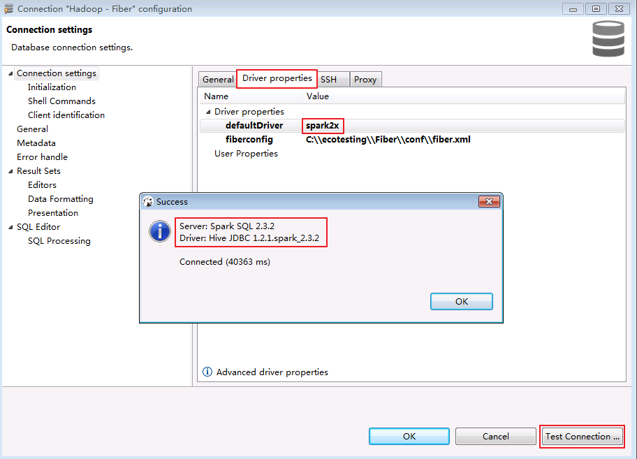

* 点击 **OK** 关闭配置窗口，弹出“Connection "Hadoop - Fiber" has changed. Do you want to reconnect?”，点击 **是**.

  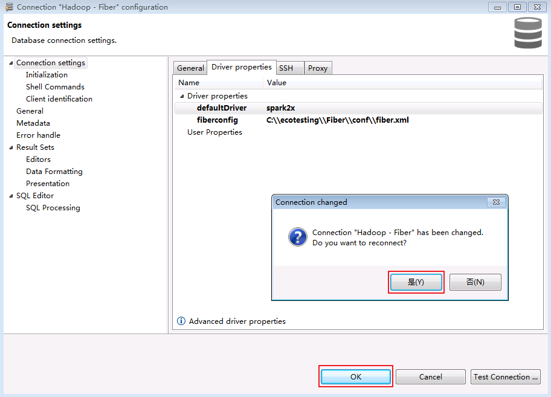

* 连接成功后，返回默认数据库 **default** 则表示通过Fiber连接Spark2x成功.

  

* 查看表的数据.点击`default->tables->student`，在`Data`页面可查看student表数据.

  

* SQL查询表的数据.

  * 在菜单栏选择`SQL Editor->New SQL Editor`.

    

  * 输入查询语句，点击右三角执行脚本，返回查询表的数据.

    `SELECT * FROM student;`

    

* 向表test插入数据

  * 登录FusionInsight集群客户端，编辑数据文件 **data_input.txt**，并执行 **hdfs dfs -put data_input.txt /tmp** 上传至集群的HDFS文件系统的/tmp/目录下.

    **data_input.txt内容如下：**

    ```
    3,Benny
    4,Miki

    ```

    

  * 在SQL Editor中输入以下脚本将data_input.txt数据导入表test.

    `LOAD DATA INPATH '/tmp/data_input.txt' OVERWRITE INTO TABLE test;`

    

  * 在SQL Editor中输入脚本查询表test.

    `SELECT * FROM test;`

    

#### DBeaver通过Fiber对接Phoenix  

* 右键`Database Navigator->Hadoop - Fiber`选择 **Edit Connection**.

  

* 点击`Driver properties`修改“defaultDirver”为 **phoenix**，点击 **Test Connection ...**，返回使用的Server和Driver版本信息，则连接成功.点击 **OK** 关闭提示窗口.

  

* 点击 **OK** 关闭配置窗口，弹出“Connection "Hadoop - Fiber" has changed. Do you want to reconnect?”，点击 **是**.

  

* 连接成功后，返回数据库 **SYSTEM** 则表示通过Fiber连接Phoenix成功.

  

* 登录FusionInsight集群客户端，执行hbase shell的“create_namespace”命令创建新的命名空间 **MY_NS**.

  `create_namespace 'MY_NS'`

  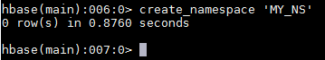

* 在菜单栏选择`SQL Editor->New SQL Editor`，SQL Editor中输入以下脚本创建表和数据，点击执行脚本.

  ```
  CREATE TABLE IF NOT EXISTS MY_NS.TEST (id integer not null primary key, name varchar);
  UPSERT INTO MY_NS.TEST VALUES(1,'John');
  UPSERT INTO MY_NS.TEST VALUES(2,'Tom');
  UPSERT INTO MY_NS.TEST VALUES(3,'Manson');
  UPSERT INTO MY_NS.TEST VALUES(4,'Aurora');
  ```

  

* 右键`Database Navigator->Hadoop - Fiber`选择 **Refresh** 则可看到新建的命名空间 **MY_NS**.

  

* 查看表的数据.点击`MY_NS->tables->TEST`，在`Data`页面可查看test表数据.

  

* SQL修改表的数据.在SQL Editor输入修改脚本并执行.

  `UPSERT INTO MY_NS.TEST VALUES(1,'Jessy');`

* SQL删除表的数据.在SQL Editor输入删除脚本并执行.

  `DELETE FROM MY_NS.TEST WHERE ID=4;`

* SQL查询表的数据.在SQL Editor输入查询脚本并执行.“ID=1”的“NAME”已被修改为“Jessy”，“ID=4”的记录已被删除.

  `SELECT * FROM MY_NS.TEST;`

  

## FAQ

  * **对接Phoenix时返回Driver: Fiber?**

    **【问题描述】**

    对接Phoenix时，点击 **Test Connection** ，没有正确返回Server和Driver的版本.

    

    **【查看问题原因】**

    首先登陆后台查看日志`C:\Users\haoxi\AppData\Roaming\DBeaverData\workspace6\.metadata\dbeaver-debug.log`查看日志：

    

    ```
    java.sql.SQLException: Can not connect to driver: org.apache.phoenix.jdbc.PhoenixDriver. Message: ERROR 103 (08004): Unable to establish connection.
    	at com.huawei.fiber.FiberConnection.getConnection(FiberConnection.java:881)
    	at com.huawei.fiber.FiberConnection.getConnection(FiberConnection.java:650)
    ```

    **【解决方法】**

    确认是否已指定DBeaver的JDK虚拟机.在DBeaver安装目录下，打开dbeaver.ini设置 **-vm** 参数的值，参数和值之间需要换行.

    **示例如下：**
    ```
    -vm
    C:\Program Files\Java\jdk1.8.0_202\bin

    ```

    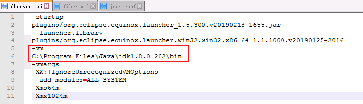
