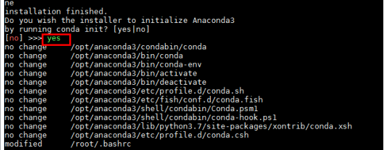
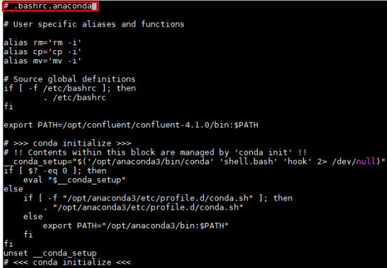
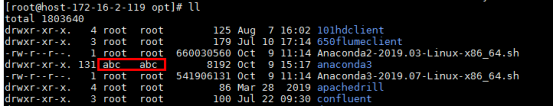
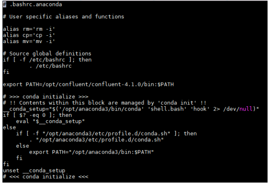
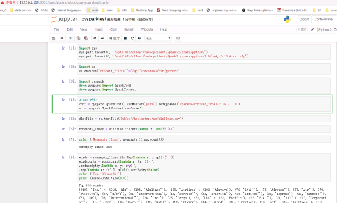

# JupyterHub对接FusionInsight

## 适用场景

> JupyterHub 1.0.0 <--> FusionInsight HD V100R002C80SPC200 (Spark2x)

> JupyterHub 1.0.0 <--> FusionInsight HD 6.5 (Spark2x)

> JupyterHub 1.0.0 <--> FusionInsight MRS 8.0 (Spark2x)

说明：
1.  相较于Jupyter Notebook, JupyterHub能够支持多用户访问，可用于创建、管理、代理多个Jupyter Notebook 实例。具有扩展性和可定制性。JupyterHub默认使用python3内核，所以在安装JupyterHub之前要先安装Anaconda3

2.  FI HD集群默认安装的python版本为2.x，使用pyspark时会在worker节点起python进程，所以如果要使用python3内核，需要在节点上安装python3环境。

JuypterHub主机：172.16.2.119

对接集群：172.16.6.10-12

## 安装Anaconda3

- 准备Anaconda3安装包到/opt路径下:

  

- 安装Anaconda3

  使用命令：bash Anaconda3-2019.07-Linux-x86_64.sh 安装

  回车查看License Agreement

  输入yes

  选择安装位置为/opt/anaconda3 回车安装(后续juypterhub 多用户不支持root用户登录，所以安装路径不要放在/root路径下)

  

  完成安装后如果选yes进行初始化

  

  会自动在 ~/.bashrc文件下写入anaconda3的初始化配置

  将更改后的.bashrc重命名为.bashrc.anaconda， 还是保持.bashrc文件为之前的内容

  

  

- 重复上述步骤《安装Anaconda3》在对接FI HD集群三个节点172.16.6.10-12都部署好anaconda3，安装路径都为`/opt/anaconda3`

## 安装JupyterHub

- 安装相关依赖
  ```
  yum install gcc
  yum install openssl openssl-devel
  yum install sqlite-devel
  ```
- JupyterHub安装步骤：

  `source ~/.bashrc.anaconda`

  可以使用清华的conda源加速
  ```
  conda config --add channels https://mirrors.tuna.tsinghua.edu.cn/anaconda/cloud/conda-forge  
  conda config --add channels https://mirrors.tuna.tsinghua.edu.cn/anaconda/pkgs/free/  
  conda config --add channels https://mirrors.tuna.tsinghua.edu.cn/anaconda/pkgs/main/  
  conda config --set show_channel_urls yes  
  ```

  使用如下命令安装JupyterHub

  `conda install -c conda-forge jupyterhub`

- 安装JupyterHub相关包

  `npm install -g configurable-http-proxy`

- 增加用户abc,用于登录:
  ```
  useradd abc
  passwd abc 设置用户abc的登陆密码为Huawei@123
  ```

  

- 生成JupyterHub配置文件
  ```
  mkdir /etc/jupyterhub
  jupyterhub --generate-config -f /etc/jupyterhub/jupyterhub_config.py
  ```

  `vi /etc/jupyterhub/jupyterhub_config.py`修改如下参数：

  ```
  c.JupyterHub.ip = '172.16.2.119'
  c.JupyterHub.port = 8001
  c.Authenticator.whitelist = {'root','abc'}
  c.Authenticator.admin_users = {'root','abc'}
  c.JupyterHub.statsd_prefix = 'jupyterhub'
  ```
- 修改/opt/anaconda3的所属用户，使得创建用户abc有权限

  `chown abc:abc -R /opt/anaconda3/`

  

- 使用abc用户登录，将root用户的~/.bashrc.anaconda文件内容拷贝到abc用户的 ~ 路径下

  完成后`su - abc`

  `vi ~/.bashrc.anaconda`内容应与root用户的一样：

  

- 以用户abc登陆,之后启动JupyterHub
  ```
  su - abc
  source ~/.bashrc.anaconda
  source /opt/101hdclient/hadoopclient/bigdata_env
  kinit
  jupyterhub --config=/etc/jupyterhub/jupyterhub_config.py --ip=172.16.2.119 --port=8001 --no-ssl
  ```

  

  浏览器打开JupyterHub的Web UI，输入用户名密码(abc/Huawei@123)

  


## 对接Spark2x

- 到如下链接获取需要的数据文件airlines.csv，并将数据文件上传到对接集群hdfs的/tmp路径下： https://github.com/beanumber/airlines/blob/master/data-raw/airlines.csv

- 新建一个notebook，下面为代码片段

  ```
  import sys
  sys.path.insert(0, '/opt/101hdclient/hadoopclient/Spark2x/spark/python/')
  sys.path.insert(0, '/opt/101hdclient/hadoopclient/Spark2x/spark/python/lib/py4j-0.10.4-src.zip')
  import os
  os.environ["PYSPARK_PYTHON"]="/opt/anaconda3/bin/python3"
  import pyspark
  from pyspark import SparkConf
  from pyspark import SparkContext
  # use this
  conf = pyspark.SparkConf().setMaster('yarn').setAppName('spark-wordcount_from172.16.2.119')
  sc = pyspark.SparkContext(conf=conf)
  distFile = sc.textFile('hdfs://hacluster/tmp/airlines.csv')
  nonempty_lines = distFile.filter(lambda x: len(x) > 0)
  print ('Nonempty lines', nonempty_lines.count())
  words = nonempty_lines.flatMap(lambda x: x.split(' '))
  wordcounts = words.map(lambda x: (x, 1)) \
  .reduceByKey(lambda x, y: x+y) \
  .map(lambda x: (x[1], x[0])).sortByKey(False)
  print ('Top 100 words:')
  print (wordcounts.take(100))
  sc.stop()
  ```

  

  说明：
  1.  `/opt/101hdclient/hadoopclient/Spark2x/spark/python/`为JupyterHub主机安装对接集群Spark2x客户端中的python路径
  2.  `/opt/101hdclient/hadoopclient/Spark2x/spark/python/lib/py4j-0.10.4-src.zip`为对接集群Spark2x客户端中的python的lib路径，具体的zip包与实际情况一致
  3.  `/opt/anaconda3/bin/python3`为python环境安装路径


  登陆对接集群后台yarn查看：

  
