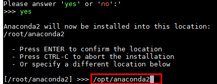
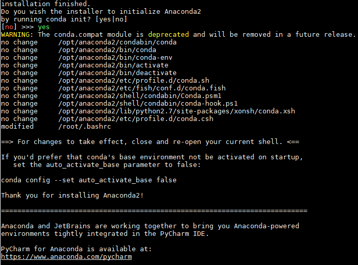
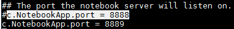
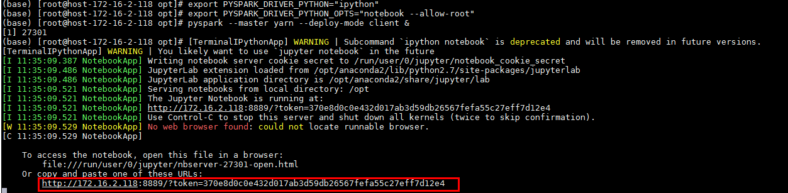
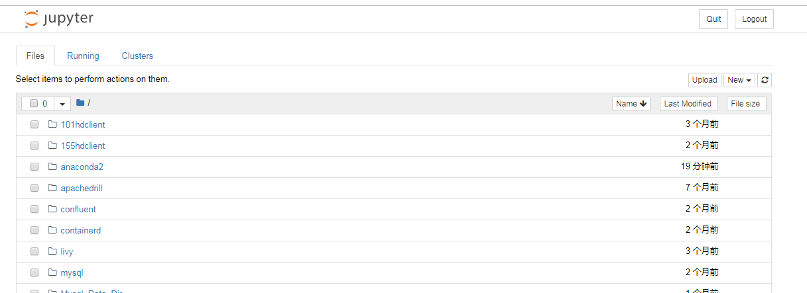
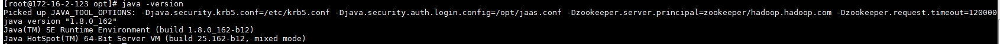
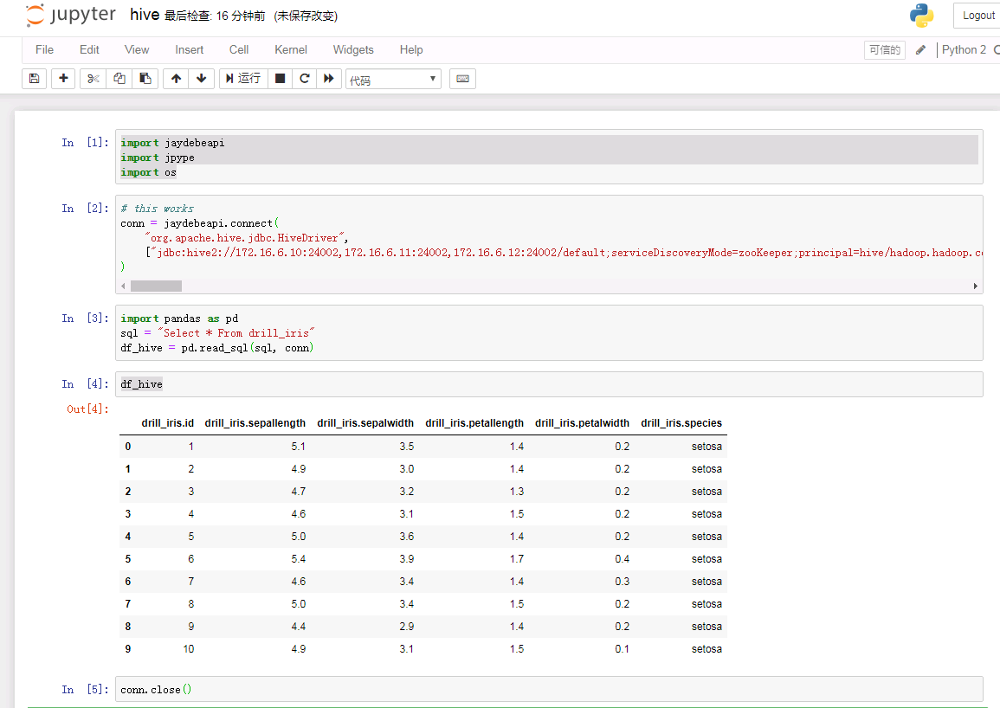
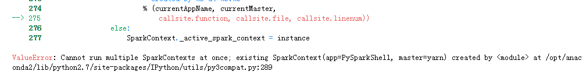

# Jupyter Notebook对接FusionInsight

## 适用场景

> Jupyter Notebook 5.7.8 <--> FusionInsight HD V100R002C80SPC200 (Hive/ELK/Spark2x)

> Jupyter Notebook 5.7.8 <--> FusionInsight HD 6.5 (Hive/ELK/Spark2x)

说明：Jupyter Notebook版本 基于Anaconda Python内核版本


## 安装Anaconda

参考Anaconda官方文档安装Linux对应的Anaconda：https://docs.anaconda.com/anaconda/install/linux/

- 使用命令`wget https://repo.anaconda.com/archive/Anaconda2-2019.03-Linux-x86_64.sh`下载linux相关的安装包

- 使用命令`bash Anaconda2-2019.03-Linux-x86_64.sh`开始安装

  1.  回车查看License Agreement
  2.  输入yes
  3.  选择安装位置不要选择默认位置，而设置为`/opt/anaconda2`

    

  4.  完成安装后选yes进行初始化, 会将初始化设置写入`~/.bashrc`文件中

    

- 使用命令`cp ~/.bashrc ~/.bashrc.anaconda`将初始化之后的`.basrc`文件复制，重命名为`.bashrc.anaconda`， 内容如下：

  

  红框部分为安装anaconda后加上的初始化配置

- 使用命令`vi ~/.bashrc`编辑`.bashrc`文件，将conda初始化部分删掉：

  

- 使用命令`source ~/.bashrc.anaconda`加载环境

- 使用命令`jupyter notebook --generate-config --allow-root`生成jupyter notebook的配置文件

  

- 使用命令`vi /root/.jupyter/jupyter_notebook_config.py`修改jupyter notebook的配置，具体如下：

  1.  改Ip为本机Ip

  

  2.  改端口（如果被占用）

  

  保存

- 在jupyter notebook主机安装对接集群的客户端，如果完成可以不做

- 使用如下命令启动jupyter notebook
  ```
  source /opt/hadoopclient/bigdata_env
  kinit developuser
  source ~/.bashrc.anaconda
  export PYSPARK_DRIVER_PYTHON="ipython"
  export PYSPARK_DRIVER_PYTHON_OPTS="notebook --allow-root"
  pyspark --master yarn --deploy-mode client &
  ```

  

  直接复制粘贴对应的地址访问jupyter notebook web UI：

  


## 对接Spark2x

说明：使用pySpark接口对接FI HD集群Spark2x组件

- 使用上一节命令启动jupyter notebook并进入weibUI

- 到如下链接获取需要的数据文件airlines.csv，并将数据文件上传到对接集群hdfs的/tmp路径下： https://github.com/beanumber/airlines/blob/master/data-raw/airlines.csv

- 新建一个notebook，输入python代码

  ```
  from pyspark import SparkConf
  from pyspark import SparkContext
  conf = SparkConf()
  conf.setAppName('spark-wordcount_from172.16.2.118')
  sc = SparkContext(conf=conf)
  distFile = sc.textFile('hdfs://hacluster/tmp/airlines.csv')
  nonempty_lines = distFile.filter(lambda x: len(x) > 0)
  print 'Nonempty lines', nonempty_lines.count()
  words = nonempty_lines.flatMap(lambda x: x.split(' '))
  wordcounts = words.map(lambda x: (x, 1)) \
  .reduceByKey(lambda x, y: x+y) \
  .map(lambda x: (x[1], x[0])).sortByKey(False)
  print 'Top 100 words:'
  print wordcounts.take(100)
  ```

  

  并且在对接集群的yarn上查看任务：

  

## 对接Hive

说明：配置jdbc接口，对接集群Hive

- 如果jupyter notebook已经启动，先停止

- 找到anaconda安装目录/bin/pip可执行文件，需要安装jdbc相关的两个python包，使用如下命令安装:
  ```
  ./pip install JPype1==0.6.3 --force-reinstall
  ./pip install JayDeBeApi==0.2 --force-reinstall
  ```
  

  

  注意：JPype1和JayDeBeApi版本必须同上述一致，不然会报版本匹配错误，已经安装这两个包的可以通过如下命令检查版本：

  ```
  ./pip freeze | grep JPype1
  ./pip freeze | grep JayDeBeApi
  ```

- 将对接集群认证文件user.keytab放到jupyter notebook主机/opt路径下用于连接Hive认证使用,将认证相关的krb5.conf文件放到/etc/路径下

- 在jupyter notebook主机/opt路径下新建jaas.conf配置文件，内容如下：
  ```
  Client {
  com.sun.security.auth.module.Krb5LoginModule required
  useKeyTab=true
  principal="developuser@HADOOP.COM"
  keyTab="/opt/user.keytab"
  useTicketCache=false
  storeKey=true
  debug=true;
  };
  ```

- 使用如下命令加载JVM参数：
  ```
  source /opt/hadoopclient/bigdata_env
  kinit developuser
  export JAVA_TOOL_OPTIONS="-Djava.security.krb5.conf=/etc/krb5.conf -Djava.security.auth.login.config=/opt/jaas.conf -Dzookeeper.server.principal=zookeeper/hadoop.hadoop.com -Dzookeeper.request.timeout=120000"
  ```   
  完成后使用命令`java -version`查看是否加载成功：

  


- 使用如下命令启动jupyter notebook
  ```
  source ~/.bashrc.anaconda
  export PYSPARK_DRIVER_PYTHON="ipython"
  export PYSPARK_DRIVER_PYTHON_OPTS="notebook --allow-root"
  pyspark --master yarn --deploy-mode client &
  ```

  说明： 如果不需要同Spark2x组件交互，可直接使用命令`jupyter notebook --allow-root`直接启动jupyter notebook

- 新建一个notebook，输入如下代码:

  ```
  import jaydebeapi
  import jpype
  import os
  # this worked
  conn = jaydebeapi.connect(
      "org.apache.hive.jdbc.HiveDriver",
      ["jdbc:hive2://172.16.6.10:24002,172.16.6.11:24002,172.16.6.12:24002/default;serviceDiscoveryMode=zooKeeper;principal=hive/hadoop.hadoop.com@HADOOP.COM;user.principal=developuser;user.keytab=/opt/user.keytab" , "developuser", "Huawei@123"], [ '/opt/hadoopclient/Hive/Beeline/lib/jdbc/' + 'commons-collections-3.2.2.jar','/opt/hadoopclient/Hive/Beeline/lib/jdbc/' + 'commons-configuration-1.6.jar', '/opt/hadoopclient/Hive/Beeline/lib/jdbc/' + 'commons-lang-2.6.jar','/opt/hadoopclient/Hive/Beeline/lib/jdbc/' + 'commons-logging-1.1.3.jar','/opt/hadoopclient/Hive/Beeline/lib/jdbc/' + 'curator-client-2.11.1.jar','/opt/hadoopclient/Hive/Beeline/lib/jdbc/' + 'curator-framework-2.11.1.jar','/opt/hadoopclient/Hive/Beeline/lib/jdbc/' + 'guava-14.0.1.jar','/opt/hadoopclient/Hive/Beeline/lib/jdbc/' + 'hadoop-auth-2.7.2.jar', '/opt/hadoopclient/Hive/Beeline/lib/jdbc/' + 'hadoop-common-2.7.2.jar','/opt/hadoopclient/Hive/Beeline/lib/jdbc/' + 'hadoop-mapreduce-client-core-2.7.2.jar','/opt/hadoopclient/Hive/Beeline/lib/jdbc/' + 'hive-common-1.3.0.jar','/opt/hadoopclient/Hive/Beeline/lib/jdbc/' + 'hive-exec-1.3.0.jar','/opt/hadoopclient/Hive/Beeline/lib/jdbc/' + 'hive-jdbc-1.3.0.jar','/opt/hadoopclient/Hive/Beeline/lib/jdbc/' + 'hive-metastore-1.3.0.jar','/opt/hadoopclient/Hive/Beeline/lib/jdbc/' + 'hive-serde-1.3.0.jar','/opt/hadoopclient/Hive/Beeline/lib/jdbc/' + 'hive-service-1.3.0.jar','/opt/hadoopclient/Hive/Beeline/lib/jdbc/' + 'hive-shims-0.23-1.3.0.jar','/opt/hadoopclient/Hive/Beeline/lib/jdbc/' + 'hive-shims-common-1.3.0.jar','/opt/hadoopclient/Hive/Beeline/lib/jdbc/' + 'httpclient-4.4.jar','/opt/hadoopclient/Hive/Beeline/lib/jdbc/' + 'httpcore-4.4.jar','/opt/hadoopclient/Hive/Beeline/lib/jdbc/' + 'libthrift-0.9.3.jar','/opt/hadoopclient/Hive/Beeline/lib/jdbc/' + 'log4j-1.2.17.jar','/opt/hadoopclient/Hive/Beeline/lib/jdbc/' + 'slf4j-api-1.7.5.jar','/opt/hadoopclient/Hive/Beeline/lib/jdbc/' + 'slf4j-log4j12-1.7.5.jar','/opt/hadoopclient/Hive/Beeline/lib/jdbc/' + 'zookeeper-3.5.1.jar']
  )
  import pandas as pd
  sql = "Select * From drill_iris"
  df_hive = pd.read_sql(sql, conn)
  df_hive
  conn.close()
  ```

  说明：jaydebeapi.connect()为jdbc连接方法，jaydebeapi.connect("Driver Main Class", ["Connecting URL", "User", "Password"], "Path to JDBC driver")，对接hive需要将客户端hive jdbc样例中所有的jar包都导进去

  


## 对接ELK

说明：配置jdbc接口，对接集群ELK

- ELK配置
  1.  创建数据库用户joe, 密码为Bigdata@123， 并赋予用户joe所有权限

  2.  创建HDFS表空间

  3.  创建数据库db_tpcds

  4.  创建一个名称为“hdfs_001”的表，插入数据

    

  5.  参考ELK产品文档《远程连接数据库》配置ELK白名单，能够访问jupyter notebook主机

- 如果jupyter notebook已经启动，先停止

- 找到anaconda安装目录/bin/pip可执行文件，需要安装jdbc相关的两个python包，使用如下命令安装:
  ```
  ./pip install JPype1==0.6.3 --force-reinstall
  ./pip install JayDeBeApi==0.2 --force-reinstall
  ```
  

  

  注意：JPype1和JayDeBeApi版本必须同上述一致，不然会报版本匹配错误，已经安装这两个包的可以通过如下命令检查版本：

  ```
  ./pip freeze | grep JPype1
  ./pip freeze | grep JayDeBeApi
  ```

- 使用如下命令启动jupyter notebook
  ```
  source /opt/hadoopclient/bigdata_env
  kinit developuser
  source ~/.bashrc.anaconda
  export PYSPARK_DRIVER_PYTHON="ipython"
  export PYSPARK_DRIVER_PYTHON_OPTS="notebook --allow-root"
  pyspark --master yarn --deploy-mode client &
  ```

  说明： 如果不需要同Spark2x组件交互，可直接使用命令`jupyter notebook --allow-root`直接启动jupyter notebook

- 将ELK JDBC驱动jar包 `gsjdbc4.jar` 放到jupyter notebook主机 `/opt`路径下

- 新建一个notebook，输入如下代码:
  ```
  import jaydebeapi
  import jpype
  jar = "/opt/gsjdbc4.jar" # location of the jdbc driver jar
  args='-Djava.class.path=%s' % jar
  jvm = jpype.getDefaultJVMPath()
  jpype.startJVM(jvm, args)
  # this worked
  conn = jaydebeapi.connect(
      'org.postgresql.Driver',
      ["jdbc:postgresql://172.16.6.10:25108/db_tpcds" , "joe", "Bigdata@123"], "/opt/gsjdbc4.jar"
  )
  import pandas as pd
  sql = "Select * From hdfs_001"
  df = pd.read_sql(sql, conn)
  df
  conn.close()
  ```

  


## F&Q

1.  在使用pySpark的时候遇到如下问题：

  

  ```
  ValueError: Cannot run multiple SparkContexts at once; existing SparkContext(app=PySparkShell, master=yarn) created by <module> at /opt/anaconda2/lib/python2.7/site-packages/IPython/utils/py3compat.py:289
  ```
  解决办法：
  运行`sc.stop()`

2.  连接ELK时候报错：

  

  解决办法：配置ELK白名单
