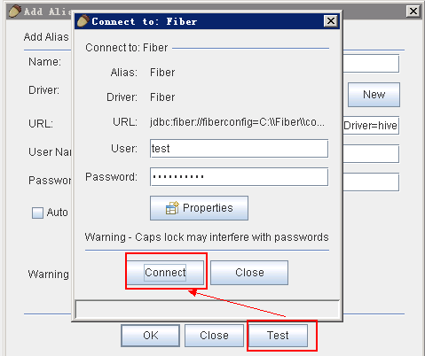
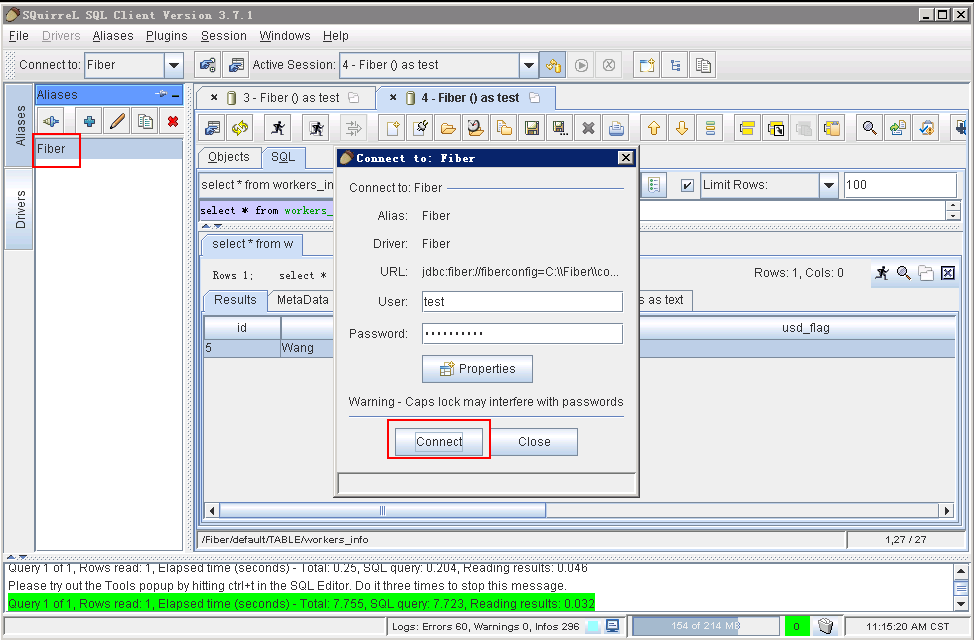
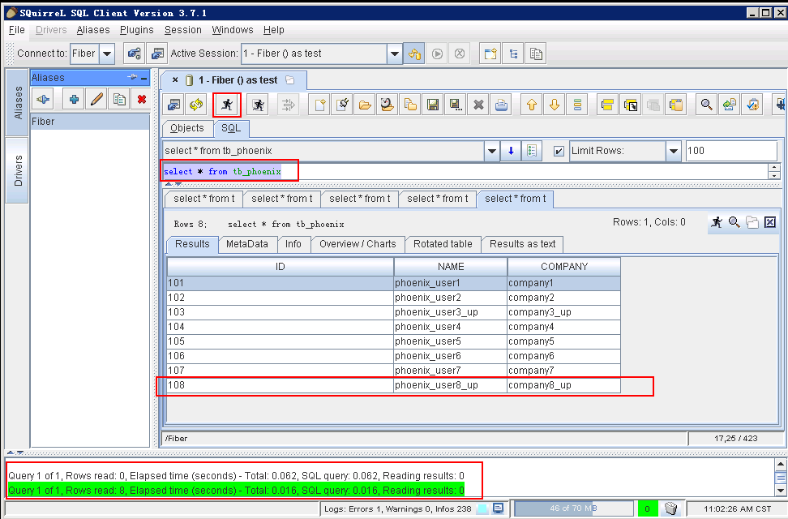

# Squirrel对接FusionInsight

## 适用场景

> Squirrel 3.7.1 <--> FusionInsight HD V100R002C60U20 (Hive/Phoenix/SparkSQL)
>
> Squirrel 3.8.0 <--> FusionInsight HD V100R002C70SPC200 (Hive/Phoenix/SparkSQL)

## 说明

SQL开发工具，如DbVisualizer、DBeaver、Squirrel是数据库开发的常用选择，虽然这些工具大多不提供原生Hive、SparkSQL、Phoenix的支持，但是通过它们支持的自定义JDBC的能力，我们可以与FusionInsignt提供的Fiber组件的JDBC接口进行对接，实现这Hive、SparkSQL、Phoenix组件的统一SQL查询。

* Fiber架构图

  

本文介绍了Squirrel与FusionInsight的Fiber对接的操作步骤

## Squirrel安装

* 安装jdk1.8，配置环境变量。

* 参考FusionInsight产品文档安装FusionInsight客户端，位置`/opt/hadoopclient`。

* 修改`C:\Windows\System32\drivers\etc\hosts`文件，加入FusionInsight集群信息。

  

* 在本地PC机上新建一个目录，将FusionInsight客户端下的fiber客户端文件夹Fiber拷贝至本地，例如`C:\Fiber`。

* 参考FusionInsight产品文档创建用户test，并赋予足够的权限，下载test的keytab文件user.keytab，拷贝到`C:\Fiber\conf\`文件夹下。

* 将FusionInsight客户端下jaas.conf文件和krb5.conf拷贝到`C:\Fiber\conf`目录下，文档内容如下，principal和keytab按实际填写：
  ```
  Client {
  com.sun.security.auth.module.Krb5LoginModule required
  useKeyTab=true
  keyTab="C:\\Fiber\\conf\\user.keytab"
  principal="test"
  useTicketCache=false
  storeKey=true
  debug=true;
  };
  ```

* 修改fiber.xml文件配置，位置`C:\Fiber\conf\fiber.xml`。

  Hive的JDBC连接：
  ```
  <jdbc>
    <identify>hive</identify>
    <describe>hive jdbc configuration</describe>
    <driverClass>org.apache.hive.jdbc.HiveDriver</driverClass>
    <securityClass>com.huawei.fiber.DefaultAuthenticationCallback</securityClass>

    <classPath>C:\\Fiber\\Hive\\config;C:\\Fiber\\Hive\\Beeline\\lib;C:\\Fiber\\Hive\\Beeline\\conf</classPath> <jdbcUrl>jdbc:hive2://162.1.93.103:24002,162.1.93.102:24002,162.1.93.101:24002/;serviceDiscoveryMode=zooKeeper;zooKeeperNamespace=hiveserver2;sasl.qop=auth-conf;auth=KERBEROS;principal=hive/hadoop.hadoop.com@HADOOP.COM;user.principal=test;user.keytab=C:/Fiber/conf/user.keytab</jdbcUrl>
    <properties>
      <property>
        <name>java.security.krb5.conf</name>
        <value>C:\\Fiber\\conf\\krb5.conf</value>
      </property>
      <property>
        <name>java.security.auth.login.config</name>
        <value>C:\\Fiber\\conf\\jaas.conf</value>
      </property>
      <property>
        <name>zookeeper.server.principal</name>
        <value>zookeeper/hadoop.hadoop.com</value>
      </property>
      <property>
        <name>zookeeper.kinit</name>
        <value>C:\\Program Files (x86)\\Java\\jdk1.8.0_112\\jre\\bin\\kinit.exe</value>
      </property>
    </properties>
  </jdbc>
  ```
  Spark的JDBC连接：
  ```
  <jdbc>
    <identify>spark</identify>
    <describe>spark jdbc configuration</describe>
    <driverClass>org.apache.hive.jdbc.HiveDriver</driverClass>
    <securityClass>com.huawei.fiber.DefaultAuthenticationCallback</securityClass>
    <classPath>C:\\Fiber\\Spark\\spark\\conf;C:\\Fiber\\Spark\\spark\\lib</classPath>
    <jdbcUrl>jdbc:hive2://ha-cluster/default;saslQop=auth-conf;auth=KERBEROS;principal=spark/hadoop.hadoop.com@HADOOP.COM;user.principal=test;user.keytab=C:/Fiber/conf/user.keytab</jdbcUrl>
    <properties>
      <property>
        <name>java.security.krb5.conf</name>
        <value>C:\\Fiber\\conf\\krb5.conf</value>
      </property>
      <property>
        <name>java.security.auth.login.config</name>
        <value>C:\\Fiber\\conf\\jaas.conf</value>
      </property>
      <property>
        <name>zookeeper.server.principal</name>
        <value>zookeeper/hadoop.hadoop.com</value>
      </property>
      <property>
        <name>zookeeper.kinit</name>
        <value>C:\\Program Files (x86)\\Java\\jdk1.8.0_112\\jre\\bin\\kinit.exe</value>
      </property>
    </properties>
  </jdbc>
  ```

  Phoenix的JDBC连接，需要增加属性 **hbase.myclient.keytab** 和 **hbase.myclient.principal**：
  ```
  <jdbc>
    <identify>phoenix</identify>
    <describe>phoenix jdbc configuration</describe>
    <driverClass>org.apache.phoenix.jdbc.PhoenixDriver</driverClass>
    <securityClass>com.huawei.fiber.DefaultAuthenticationCallback</securityClass>
    <classPath>C:\\Fiber\\HBase\\hbase\\lib;C:\\Fiber\\HBase\\hbase\\conf</classPath>
    <jdbcUrl>jdbc:phoenix:162.1.93.101,162.1.93.102,162.1.93.103:24002:/hbase</jdbcUrl>
    <properties>
      <property>
        <name>java.security.krb5.conf</name>
        <value>C:\\Fiber\\conf\\krb5.conf</value>
      </property>
      <property>
        <name>java.security.auth.login.config</name>
        <value>C:\\Fiber\\conf\\jaas.conf</value>
      </property>
  <property>
        <name>hbase.myclient.keytab</name>
        <value>C:\\Fiber\\conf\\user.keytab</value>
      </property>
  <property>
        <name>hbase.myclient.principal</name>
        <value>test</value>
      </property>
      <property>
        <name>zookeeper.server.principal</name>
        <value>zookeeper/hadoop.hadoop.com</value>
      </property>
      <property>
        <name>zookeeper.kinit</name>
        <value>C:\\Program Files (x86)\\Java\\jdk1.8.0_112\\jre\\bin\\kinit.exe</value>
      </property>
    </properties>
  </jdbc>
  ```

* 将Hive、Spark、Phoenix的JDBC配置中classPath中的文件拷贝至Fiber文件夹中。

  

* 下载Squirrel，地址：<http://www.squirrelsql.org/#installation>，选择Install jar of SQuirreL 3.7.1 for Windows/Linux/others，下载软件squirrel-sql-3.7.1-standard.jar

* 双击squirrel-sql-3.7.1-standard.jar安装

  

  

  

* 在这里可以选择要安装哪些环境，使用的数据库插件，语言包。

  

  

  

  

## Squirrel连接Fiber

使用SQuirreL SQL Client通过Fiber连接FusionInsight的Hive、SparkSQL、Phoenix组件。

* 打开SQuirreL SQL Client，选择Drivers，点击 **+**。

  

* 填写Driver信息，点击 **OK**。
  * Name：Fiber（自定义）
  * Example URL：jdbc:fiber://fiberconfig=C:\\Fiber\\conf\\fiber.xml;defaultDriver=hive
  * Extra Class Path：将Fiber/lib下的jar包都添加进来
  * ClassName：com.huawei.fiber.FiberDriver

  

* 可以看到添加完成的Driver Fiber。

  

## 对接Hive

* 点击 **Aliases**，点击 **+**

  

* 在弹出框中填写信息
  * Name：Fiber（自定义）
  * Driver：选择Fiber
  * User Name：test
  * Password：密码

  

* 点击 **Connect**

  

* 连接成功，点击 **OK**

  

* 点击 **Connect**

  

* 查看hive中数据表

  

  点击 **SQL面板**，编辑SQL语句，点击 **执行** 按钮，在下方可以看到查询结果。

  

* Hive增加数据：

  编辑数据文件data_input.txt，上传至集群的hdfs目录中，例如`/tmp/`下，文本内容如下：

  

  编辑脚本，点击 **执行** 按钮：

  ```
  load data inpath ‘/tmp/data_input.txt’ overwrite into table
  workers_info
  ```

  

  查看结果：

  

## 对接SparkSQL

* 将defaultDriver切换为spark，点击 **Test**

    

* 点击 **Connect**

    

* 连接成功，点击 **OK**

    

* 双击Fiber，点击 **Connet**，将driver切换为spark

    

* 可以看到数据表

    

* 点击 **SQL面板**，编辑SQL语句，点击 **执行** 按钮，在下方可以看到查询结果。

    

* Spark增加数据

  编辑数据文件data_input.txt，上传至集群的hdfs目录中，例如`/tmp/`下，文本内容如下：

  

  编辑脚本，点击 **执行** 按钮：

  ```
  load data inpath ‘/tmp/data_input.txt’ overwrite into table
  workers_info
  ```

  

  查看结果：

  

## 对接Phoenix

* 将defaultDriver切换为phoenix，点击 **Test**

  

* 点击 **Connect**

  

* 连接成功，点击 **OK**

  

* 双击 **Fiber**，点击 **Connect**，将driver切换为phoenix

  

* 可以看到数据phoenix表

  

* 点击 **SQL面板** ，编辑SQL语句，点击 **执行** 按钮，在下方可以看到查询结果。

  ```
  select * from tb_phoenix
  ```

  

* 点击 **SQL面板**，编辑SQL语句，向phoenix表中增加一条数据，点击 **执行** 按钮。
  ```
  UPSERT INTO TB_PHOENIX(Id, Name,Company) values (108,'phoenix_user8','company8')
  ```

  

* 查询结果：
  ```
  select * from tb_phoenix
  ```

  

* 点击 **SQL面板**，编辑SQL语句，删除一条数据，点击 **执行** 按钮。
  ```
  delete from TB_PHOENIX where ID=109;
  ```

  

* 查看结果：
  ```
  select * from tb_phoenix
  ```

  

* 点击 **SQL面板**，编辑SQL语句，更新一条数据，点击 **执行** 按钮。
  ```
  UPSERT INTO TB_PHOENIX(Id, Name,Company) values (108,'phoenix_user8_up','company8_up')
  ```

  

* 查看结果

  
