# SQuirreL对接FusionInsight

## 适用场景

> Squirrel 3.9.1 <--> FusionInsight HD 6.5 (Hive/Phoenix/SparkSQL)

## 简介

SQL开发工具，如DbVisualizer、DBeaver、SQuirreL是数据库开发的常用选择，虽然这些工具大多不提供原生Hive、SparkSQL、Phoenix的支持，但是通过它们支持的自定义JDBC的能力，我们可以与FusionInsignt提供的Fiber组件的JDBC接口进行对接，实现这Hive、SparkSQL、Phoenix组件的统一SQL查询。

* Fiber架构图

  

本文档主要描述在Window操作系统，SQuirreL通过Fiber方式对接FusionInsight HD的Hive、Spark2x、Phoenix组件。

## 准备工作

* 登录FusionInsight Manager创建一个“人机”用户，例如：developuser，具体请参见FusionInsight HD产品文档的`管理员指南->系统设置->权限设置->用户管理->创建用户`章节。给developuser用户授予所有访问权限，包含但不限于Spark2x、Hive、HBase。

* 已完成FusionInsight HD客户端安装，具体请参见FusionInsight HD产品文档的`应用开发指南->安全模式->安全认证->配置客户端文件`章节。

* 已将集群的节点主机名与IP的映射关系加入到windows的hosts文件中`C:\Windows\System32\drivers\etc\hosts`。

* 客户端机器的时间与FusionInsight HD集群的时间要保持一致，时间差小于5分钟。

* Windows上已经安装好jdk1.8或者以上版本，并完成jdk环境变量配置。

* Hive数据库已存在表student，数据类似于：

  

  **示例如下：**

  ```
  CREATE TABLE IF NOT EXISTS student(id INT, name STRING, class_id INT);
  INSERT INTO student VALUES (1,'Tom',1);
  INSERT INTO student VALUES (2,'Sandy',2);
  INSERT INTO student VALUES (3,'Benny',3);
  INSERT INTO student VALUES (4,'Tina',1);
  ```

## Fiber认证方式配置

### 操作场景

Fiber的安全认证有kinit和keytab两种方式。具体参数配置说明可参考FusionInsight HD产品文档的`业务操作指南->统一SQL(Fiber)->客户端配置`章节。

### 前提条件

* 已完成准备工作。

* 将FusionInsight HD客户端的Fiber、Hive、Spark2x、HBase客户端文件夹，拷贝至本地新建目录`C:\ecotesting`。假设FusionInsight HD客户端安装于`/opt/hadoopclient`目录，则：

  * 将`/opt/hadoopclient/Fiber`拷贝至本地`C:\ecotesting`目录。

  * 将`/opt/hadoopclient/Hive`拷贝至本地`C:\ecotesting\Fiber`目录。

  * 将`/opt/hadoopclient/Spark2x`拷贝至本地`C:\ecotesting\Fiber`目录。

  * 将`/opt/hadoopclient/HBase`拷贝至本地`C:\ecotesting\Fiber`目录。

  * 将`C:\ecotesting\Fiber\HBase\hbase\lib\phoenix-core-4.13.1-HBase-1.3.jar`拷贝至`C:\ecotesting\Fiber\lib`。

  

* 登录FusionInsight Manager的`系统->用户->更多（developuser）->下载认证凭证`，下载developuser对应的认证凭证。将用户的 **krb5.conf** 和 **user.keytab** 文件拷贝到`C:\ecotesting\Fiber\conf`目录下。

### 操作步骤

#### 使用kinit认证方式配置

- 从<http://web.mit.edu/kerberos/dist/#kfw-4.0>下载对应操作系统架构的MIT Kerberos并安装。

- 设置Kerberos的配置文件。将用户的krb5.conf文件重命名为 **krb5.ini** 放在`C:\ProgramData\MIT\Kerberos5`目录下。

- 设置Kerberos票据的缓存文件

  * 在本地创建存放票据的目录，例如`C:\temp`。

  * 设置Windows的系统环境变量，变量名为`KRB5CCNAME`，变量值为`C:\temp\krb5cache`。

    

- 在Windows上进行认证

  打开MIT Kerberos，单击 **get Ticket** ，在弹出的MIT Kerberos: Get Ticket窗口中，**Pricipal** 输入用户名`developuser@HADOOP.COM`，**Password** 输入密码，单击 **OK**。

  

- 在`C:\ecotesting\Fiber\conf`目录下新建 **jaas.conf** 文件，内容如下所示：

  ```
  Client {
    com.sun.security.auth.module.Krb5LoginModule required
    useKeyTab=false
    useTicketCache=true
    debug=true;
  };
  ```
- 修改配置文件`C:\ecotesting\Fiber\conf\fiber.xml`。

  **Hive的JDBC配置示例：**
  ```
  <jdbc>
    <identify>hive</identify>
    <describe>hive jdbc configuration</describe>
    <driverClass>org.apache.hive.jdbc.HiveDriver</driverClass>
    <securityClass>com.huawei.fiber.DefaultAuthenticationCallback</securityClass>     
    <classPath>C:\\ecotesting\\Fiber\\Hive\\config;C:\\ecotesting\\Fiber\\Hive\\Beeline\\lib;C:\\ecotesting\\Fiber\\Hive\\Beeline\\conf</classPath>
    <jdbcUrl>jdbc:hive2://172.16.4.21:24002,172.16.4.22:24002,172.16.4.23:24002/;serviceDiscoveryMode=zooKeeper;zooKeeperNamespace=hiveserver2;sasl.qop=auth-conf;auth=KERBEROS;principal=hive/hadoop.hadoop.com@HADOOP.COM</jdbcUrl>
    <properties>
      <property>
        <name>java.security.krb5.conf</name>
        <value>C:\\ecotesting\\Fiber\\conf\\krb5.conf</value>
      </property>
      <property>
        <name>java.security.auth.login.config</name>
        <value>C:\\ecotesting\\Fiber\\conf\\jaas.conf</value>
      </property>
      <property>
        <name>zookeeper.server.principal</name>
        <value>zookeeper/hadoop.hadoop.com</value>
      </property>
      <property>
        <name>zookeeper.kinit</name>
        <value>C:\\Program Files\\Java\\jdk1.8.0_202\\jre\\bin\\kinit.exe</value>
      </property>
    </properties>
  </jdbc>
  ```

  **Spark2x的JDBC配置示例：**
  ```
  <jdbc>
    <identify>Spark2x</identify>
    <describe>Spark2x jdbc configuration</describe>
    <driverClass>org.apache.hive.jdbc.HiveDriver</driverClass>
    <securityClass>com.huawei.fiber.DefaultAuthenticationCallback</securityClass>
    <classPath>C:\\ecotesting\\Fiber\\Spark2x\\spark\\conf;C:\\ecotesting\\Fiber\\Spark2x\\spark\\jars</classPath>
    <jdbcUrl>jdbc:hive2://172.16.4.21:24002,172.16.4.22:24002,172.16.4.23:24002/;serviceDiscoveryMode=zooKeeper;zooKeeperNamespace=sparkthriftserver2x;saslQop=auth-conf;auth=KERBEROS;principal=spark2x/hadoop.hadoop.com@HADOOP.COM</jdbcUrl>
    <properties>
  	<property>
  	  <name>java.security.krb5.conf</name>
  	  <value>C:\\ecotesting\\Fiber\\conf\\krb5.conf</value>
  	</property>
  	<property>
  	  <name>java.security.auth.login.config</name>
  	  <value>C:\\ecotesting\\Fiber\\conf\\jaas.conf</value>
  	</property>
  	<property>
  	  <name>zookeeper.server.principal</name>
  	  <value>zookeeper/hadoop.hadoop.com</value>
  	</property>
  	<property>
  	  <name>zookeeper.kinit</name>
  	  <value>C:\\Program Files\\Java\\jdk1.8.0_202\\jre\\bin\\kinit.exe</value>
  	</property>
    </properties>
  </jdbc>
  ```

  **Phoenix的JDBC配置示例：**
  ```
  <jdbc>
    <identify>phoenix</identify>
    <describe>phoenix jdbc configuration</describe>
    <driverClass>org.apache.phoenix.jdbc.PhoenixDriver</driverClass>
    <securityClass>com.huawei.fiber.DefaultAuthenticationCallback</securityClass>
    <classPath>C:\\ecotesting\\Fiber\\HBase\\hbase\\lib;C:\\ecotesting\\Fiber\\HBase\\hbase\\conf</classPath>
    <jdbcUrl>jdbc:phoenix</jdbcUrl>
    <properties>
      <property>
        <name>java.security.krb5.conf</name>
        <value>C:\\ecotesting\\Fiber\\conf\\krb5.conf</value>
      </property>
      <property>
        <name>java.security.auth.login.config</name>
        <value>C:\\ecotesting\\Fiber\\conf\\jaas.conf</value>
      </property>
      <property>
        <name>zookeeper.server.principal</name>
        <value>zookeeper/hadoop.hadoop.com</value>
      </property>
      <property>
        <name>zookeeper.kinit</name>
        <value>C:\\Program Files\\Java\\jdk1.8.0_202\\jre\\bin\\kinit.exe</value>
      </property>
    </properties>
  </jdbc>
  ```

#### 使用keytab认证方式配置

- 在`C:\ecotesting\Fiber\conf`目录下新建 **jaas.conf** 文件，示例如下：
  ```
  Client {
    com.sun.security.auth.module.Krb5LoginModule required
    useKeyTab=true
    keyTab="C:\\ecotesting\\Fiber\\conf\\user.keytab"
    principal="developuser"
    useTicketCache=false
    storeKey=true
    debug=true;
  };
  ```

- 修改配置文件`C:\ecotesting\Fiber\conf\fiber.xml`。

  **Hive的JDBC配置示例：**

  ```
  <jdbc>
    <identify>hive</identify>
    <describe>hive jdbc configuration</describe>
    <driverClass>org.apache.hive.jdbc.HiveDriver</driverClass>
    <securityClass>com.huawei.fiber.DefaultAuthenticationCallback</securityClass>     
    <classPath>C:\\ecotesting\\Fiber\\Hive\\config;C:\\ecotesting\\Fiber\\Hive\\Beeline\\lib;C:\\ecotesting\\Fiber\\Hive\\Beeline\\conf</classPath>
    <jdbcUrl>jdbc:hive2://172.16.4.21:24002,172.16.4.22:24002,172.16.4.23:24002/;serviceDiscoveryMode=zooKeeper;zooKeeperNamespace=hiveserver2;sasl.qop=auth-conf;auth=KERBEROS;principal=hive/hadoop.hadoop.com@HADOOP.COM;user.principal=developuser;user.keytab=C:/ecotesting/Fiber/conf/user.keytab</jdbcUrl>
     <properties>
      <property>
        <name>java.security.krb5.conf</name>
        <value>C:\\ecotesting\\Fiber\\conf\\krb5.conf</value>
      </property>
      <property>
        <name>java.security.auth.login.config</name>
        <value>C:\\ecotesting\\Fiber\\conf\\jaas.conf</value>
      </property>
      <property>
        <name>zookeeper.server.principal</name>
        <value>zookeeper/hadoop.hadoop.com</value>
      </property>
      <property>
        <name>zookeeper.kinit</name>
        <value>C:\\Program Files\\Java\\jdk1.8.0_202\\jre\\bin\\kinit.exe</value>
      </property>
    </properties>
  </jdbc>
  ```

  **Spark2x的JDBC配置示例：**
  ```
  <jdbc>
    <identify>Spark2x</identify>
    <describe>Spark2x jdbc configuration</describe>
    <driverClass>org.apache.hive.jdbc.HiveDriver</driverClass>
    <securityClass>com.huawei.fiber.DefaultAuthenticationCallback</securityClass>
    <classPath>C:\\ecotesting\\Fiber\\Spark2x\\spark\\conf;C:\\ecotesting\\Fiber\\Spark2x\\spark\\jars</classPath>
    <jdbcUrl>jdbc:hive2://172.16.4.21:24002,172.16.4.22:24002,172.16.4.23:24002/;serviceDiscoveryMode=zooKeeper;zooKeeperNamespace=sparkthriftserver2x;saslQop=auth-conf;auth=KERBEROS;principal=spark2x/hadoop.hadoop.com@HADOOP.COM;user.principal=developuser;user.keytab=C:/ecotesting/Fiber/conf/user.keytab</jdbcUrl>
    <properties>
  	<property>
  	  <name>java.security.krb5.conf</name>
  	  <value>C:\\ecotesting\\Fiber\\conf\\krb5.conf</value>
  	</property>
  	<property>
  	  <name>java.security.auth.login.config</name>
  	  <value>C:\\ecotesting\\Fiber\\conf\\jaas.conf</value>
  	</property>
  	<property>
  	  <name>zookeeper.server.principal</name>
  	  <value>zookeeper/hadoop.hadoop.com</value>
  	</property>
  	<property>
  	  <name>zookeeper.kinit</name>
  	  <value>C:\\Program Files\\Java\\jdk1.8.0_202\\jre\\bin\\kinit.exe</value>
  	</property>
    </properties>
  </jdbc>
  ```

  **Phoenix的JDBC配置示例：**
  ```
  <jdbc>
    <identify>phoenix</identify>
    <describe>phoenix jdbc configuration</describe>
    <driverClass>org.apache.phoenix.jdbc.PhoenixDriver</driverClass>
    <securityClass>com.huawei.fiber.DefaultAuthenticationCallback</securityClass>
    <classPath>C:\\ecotesting\\Fiber\\HBase\\hbase\\lib;C:\\ecotesting\\Fiber\\HBase\\hbase\\conf</classPath>
    <jdbcUrl>jdbc:phoenix:172.16.4.21,172.16.4.22,172.16.4.23:24002:/hbase</jdbcUrl>
    <properties>
      <property>
        <name>java.security.krb5.conf</name>
        <value>C:\\ecotesting\\Fiber\\conf\\krb5.conf</value>
      </property>
      <property>
        <name>java.security.auth.login.config</name>
        <value>C:\\ecotesting\\Fiber\\conf\\jaas.conf</value>
      </property>
  	  <property>
        <name>zookeeper.server.principal</name>
        <value>zookeeper/hadoop.hadoop.com</value>
      </property>
      <property>
        <name>zookeeper.kinit</name>
        <value>C:\\Program Files\\Java\\jdk1.8.0_202\\jre\\bin\\kinit.exe</value>
      </property>
    </properties>
  </jdbc>
  ```

- 对接Phoenix时，需要修改配置文件`C:\ecotesting\Fiber\HBase\hbase\conf\hbase-site.xml`新增属性 **hbase.myclient.keytab** 和 **hbase.myclient.principal**。

  ```
  <property>
    <name>hbase.myclient.keytab</name>
    <value>C:\\ecotesting\\Fiber\\conf\\user.keytab</value>
  </property>
  <property>
    <name>hbase.myclient.principal</name>
    <value>developuser</value>
  </property>
  ```

## SQuirreL对接Fiber

### 操作场景

SQuirreL SQL Client通过Fiber方式对接FusionInsight HD的Hive、Spark2x、Phoenix组件。

### 前提条件

* 从<http://www.squirrelsql.org/#installation>下载与本地系统相对应的SQuirreL软件（例如：Install jar of SQuirreL 3.9.1 for Windows/Linux/others）。双击下载的jar包启动安装，可按照默认选项完成安装。

  

### 操作步骤

#### SQuirreL通过Fiber对接Hive

* 打开SQuirreL SQL Client，选择`Drivers`，点击 **+**。

  

* 填写Driver信息，点击 **OK** 。

  **填写信息示例如下：**

  ```
  Name: Fiber（自定义）
  Example URL：jdbc:fiber://fiberconfig=C:\\ecotesting\\Fiber\\conf\\fiber.xml;defaultDriver=hive
  Extra Class Path: 点击Add按钮将C:\ecotesting\Fiber\lib目录下所有的jar包加入
  Class Name：com.huawei.fiber.FiberDriver（添加jar包后，点击List Drivers按钮然后从下拉框中选择）

  ```

  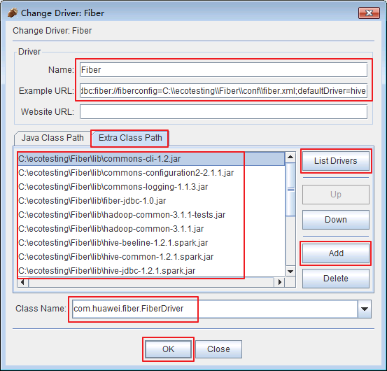

* 添加完成的Driver Fiber。

  

* 点击 **Aliases**，点击 **+**。在弹出框中填写信息示例如下所示：

  ```
  Name: Fiber（自定义）
  Driver：选择Fiber
  User Name: developuser（可不填写）
  Password：密码（可不填写）

  ```

  

* 依次点击 **Test** ， **Connect**，返回“Connection successful”后，点击 **确定** 。

  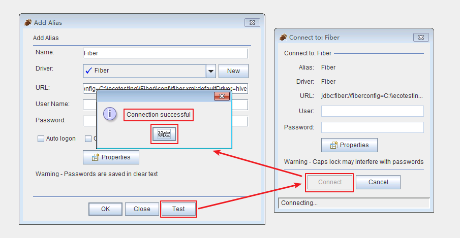

* 点击 **OK** 。

  

* 点击 **Connect** 。

  

* 返回默认数据库 **default** 则表示通过Fiber连接Hive成功。

  

* 直接查看表数据。点击`default->TABLE->student`，在`Content`页面可查看student表数据。

  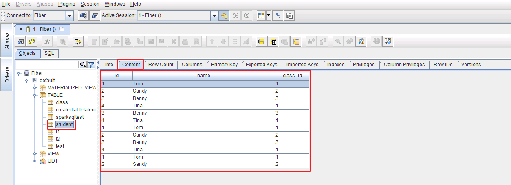

* SQL查询Hive表的数据。点击 **SQL** ，输入查询语句后执行。

  `SELECT * FROM student;`

  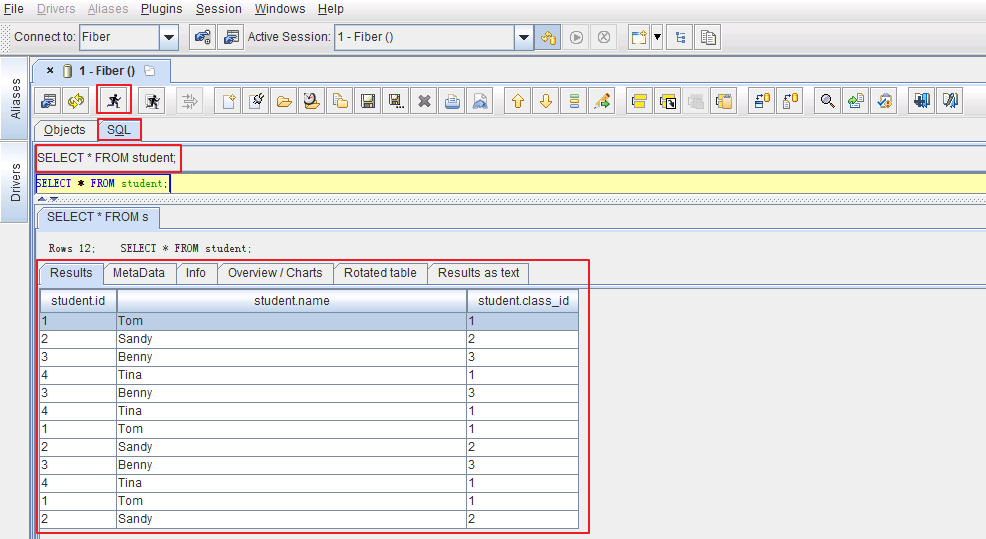

* 向Hive表SQL_TEST插入数据

  * 输入以下脚本创建存储格式为textfile，分隔符为“,”的表 **SQL_TEST**。表的存储格式必须为 **textfile**，否则不能使用LOAD DATA方式向表插入数据。

    `CREATE TABLE IF NOT EXISTS SQL_TEST (id string, name STRING) ROW FORMAT DELIMITED FIELDS TERMINATED BY ',' STORED AS textfile;`

    

  * 登录FusionInsight集群客户端，编辑数据文件 **data_input.txt**，并执行 **hdfs dfs -put data_input.txt /tmp** 上传至集群的HDFS文件系统的/tmp/目录下。

    **data_input.txt内容如下：**

    ```
    1,Abbey
    2,Andy

    ```

    

  * 输入以下脚本将data_input.txt数据导入表SQL_TEST。

    `LOAD DATA INPATH '/tmp/data_input.txt' OVERWRITE INTO TABLE SQL_TEST;`

    

  * 输入脚本查询表SQL_TEST。

    `SELECT * FROM SQL_TEST;`

    

#### SQuirreL通过Fiber对接Spark2x

* 选择 `Aliases->Fiber`，点击修改Fiber的defaultDriver属性。

  

* 将defaultDriver修改为 **spark2x**，依次点击 **Test** ， **Connect**，返回“Connection successful”后，点击 **确定** 。

  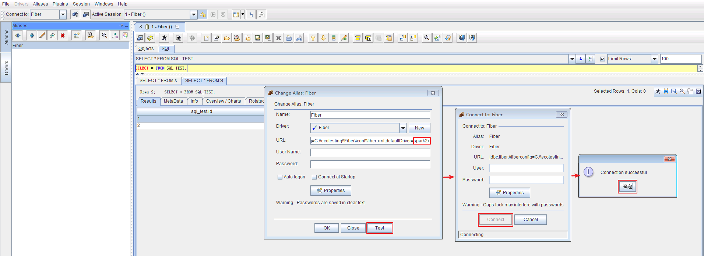

* 点击 **OK** 。

  

* 双击 **Fiber** ，点击 **Connect** 。

  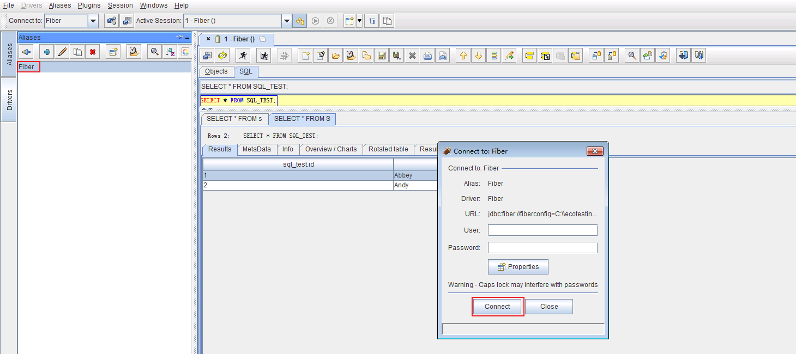

* 如果返回“Session startup time hint”，则点击 **Close** 。

  

* 如果没有返回默认数据库 **default** ，点击按钮“Refresh Object Tree and Database Meta Data Cache”，则会返回默认数据库 **default** 。通过Fiber连接Spark2x成功。

  

* 直接查看表数据。点击`default->TABLE->student`，在`Content`页面可查看student表数据。

  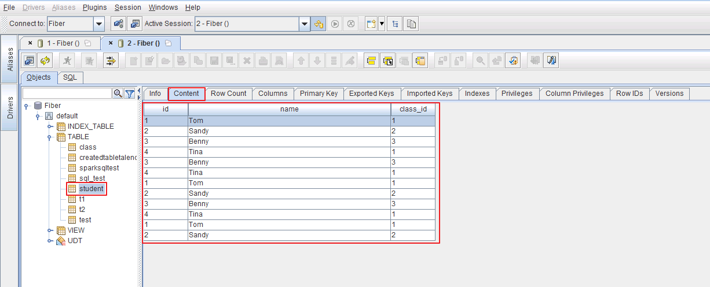

* SQL查询Hive表的数据。点击 **SQL** ，输入查询语句后执行。

  `SELECT * FROM student;`

  

* 表SQL_TEST插入数据

  * 登录FusionInsight集群客户端，编辑数据文件 **data_input.txt**，并执行 **hdfs dfs -put data_input.txt /tmp** 上传至集群的HDFS文件系统的/tmp/目录下。

    **data_input.txt内容如下：**

    ```
    3,Benny
    4,Miki

    ```

    

  * 输入以下脚本将data_input.txt数据导入表SQL_TEST。

    `LOAD DATA INPATH '/tmp/data_input.txt' OVERWRITE INTO TABLE SQL_TEST;`

    

  * 输入脚本查询表SQL_TEST。

    `SELECT * FROM SQL_TEST;`

    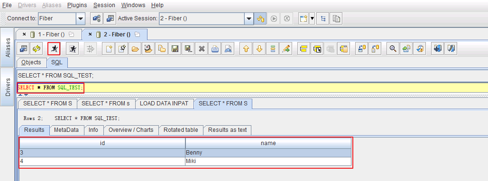

#### SQuirreL通过Fiber对接Phoenix

* 选择 `Aliases->Fiber`，点击修改Fiber的defaultDriver属性。

  

* 将defaultDriver修改为 **phoenix**，依次点击 **Test** ， **Connect**，返回“Connection successful”后，点击 **确定** 。

  

* 点击 **OK** 。

  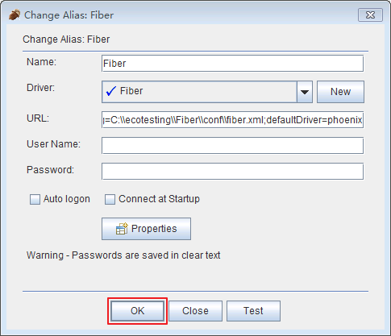

* 双击 **Fiber** ，点击 **Connect** 。

  

* 连接成功后，返回数据库 **SYSTEM** 则表示通过Fiber连接Phoenix成功。

  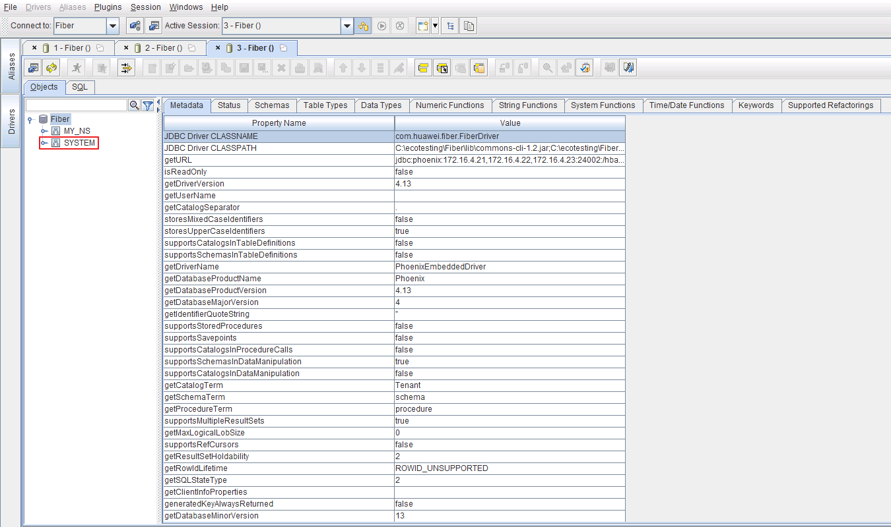

* SQL操作表数据。

    * 如果不存在自定义的命名空间空间“MY_NS”，则登录FusionInsight集群客户端，执行hbase shell的“create_namespace”命令创建新的命名空间 **MY_NS**。

      `create_namespace 'MY_NS'`

      

    * 创建表和数据。点击 **SQL** ，输入查询语句后执行。

      ```
      CREATE TABLE IF NOT EXISTS MY_NS.SQL_TEST (id integer not null primary key, name varchar);
      UPSERT INTO MY_NS.SQL_TEST VALUES(1,'John');
      UPSERT INTO MY_NS.SQL_TEST VALUES(2,'Tom');
      UPSERT INTO MY_NS.SQL_TEST VALUES(3,'Manson');
      UPSERT INTO MY_NS.SQL_TEST VALUES(4,'Aurora');
      ```

      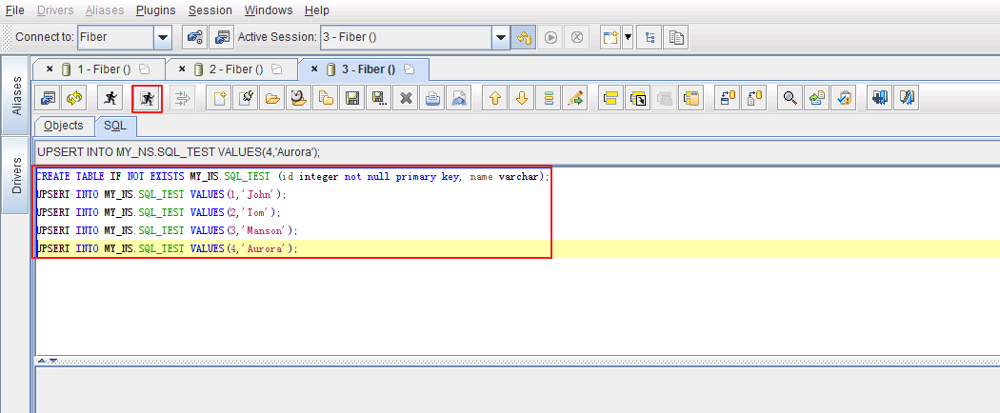

    * SQL查询表数据。编辑SQL如下，点击 **执行** 按钮。

      `select * from MY_NS.SQL_TEST;`

      

    * SQL修改表的数据。编辑SQL如下，点击 **执行** 按钮。

      `UPSERT INTO MY_NS.SQL_TEST VALUES(1,'Jessy');`

    * SQL删除表的数据。编辑SQL如下，点击 **执行** 按钮。

      `DELETE FROM MY_NS.SQL_TEST WHERE ID=4;`

    * 编辑SQL如下，点击 **执行** 按钮。“ID=1”的“NAME”已被修改为“Jessy”，“ID=4”的记录已被删除。

      `select * from MY_NS.SQL_TEST;`

      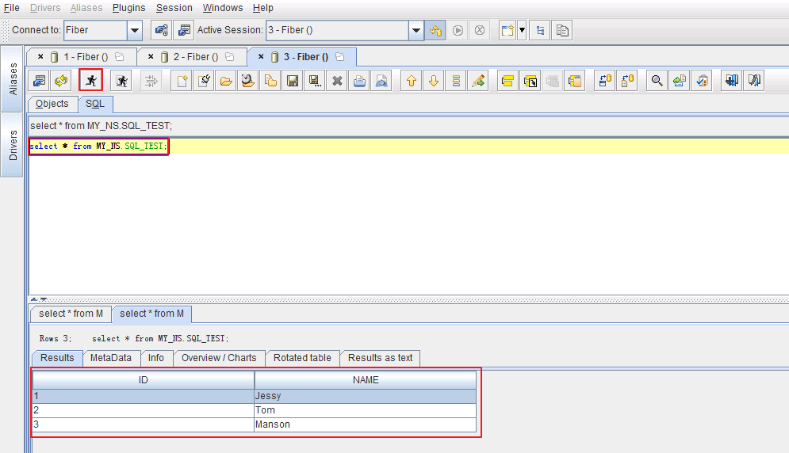

* 直接查看表数据。点击`Objects->Fiber->MY_NS->TABLE->SQL_TEST->Content`查看SQL_TEST表数据。

  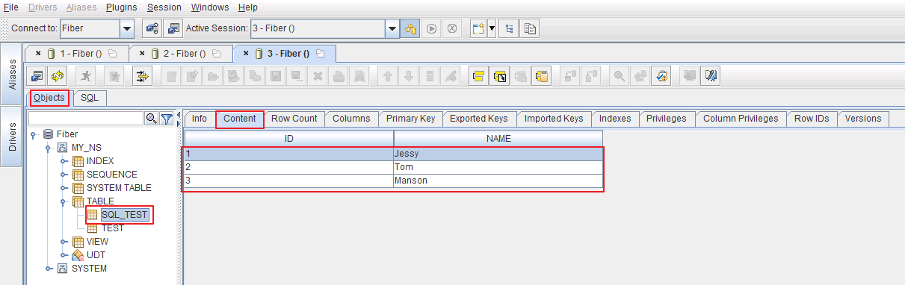
