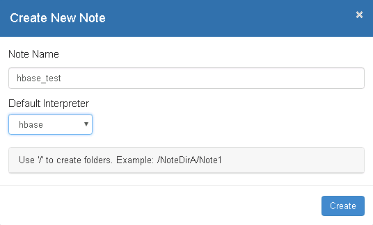
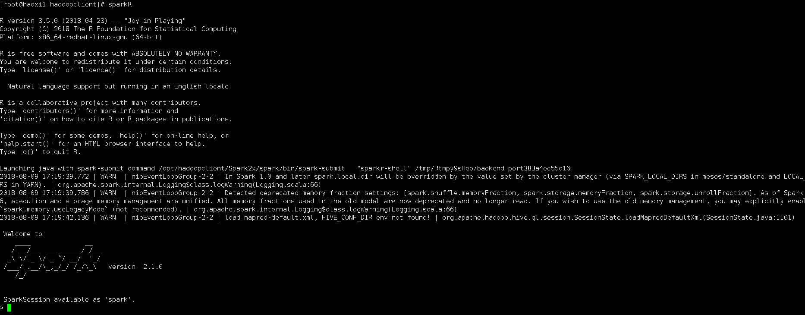
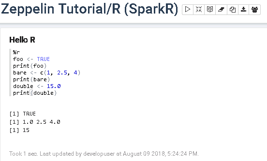
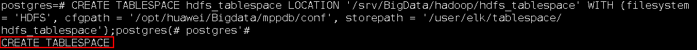
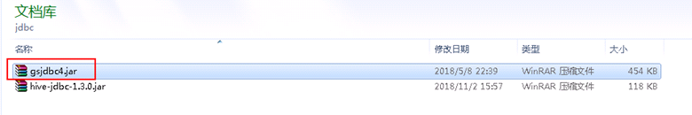

# Zeppelin对接FusionInsight HD

## 适用场景

> Zeppelin 0.8.0 <--> FusionInsight HD V100R002C80SPC200 (HBase/Hive/Spark/SparkR)

## 安装Zeppelin

### 操作场景

安装Zeppelin0.8.0

### 前提条件

- 已完成FusionInsight HD和客户端的安装。

### 操作步骤

- 安装Zeppelin 0.8.0,在网址`https://zeppelin.apache.org/download.html`下载安装包，使用WinSCP导入主机并用`tar -zxvf zeppelin-0.8.0-bin-all.tgz`安装生成zeppelin-0.8.0-bin-all目录。

  


- 启动和停止Zeppelin
  ```
  bin/zeppelin-daemon.sh start
  bin/zeppelin-daemon.sh stop
  ```
  

- 执行source命令到客户端，获取java配置信息
  ```
  source /opt/hadoopclient/bigdata_env
  echo $JAVA_HOME

  ```
  

- 配置Zeppelin环境变量，在profile文件中加入如下变量
  ```
  vi /etc/profile
  export ZEPPELIN_HOME = /usr/zeppelin/zeppelin-0.8.0-bin-all
  export PATH = $ZEPPELIN_HOME/bin:$PATH

  ```

- 编辑zeppelin-env.sh文件，位置`/usr/zeppelin/zeppelin-0.8.0-bin-all/conf`
  ```
  cd /usr/zeppelin/zeppelin-0.8.0-bin-all/conf/
  cp zeppelin-env.sh.template zeppelin-env.sh
  vi zeppelin-env.sh
  ```

  加入如下内容：
  ```
  export JAVA_HOME=/opt/hadoopclient/JDK/jdk1.8.0_162
  ```
- 编辑zeppelin-site.xml文件，位置`/usr/zeppelin/zeppelin-0.8.0-bin-all/conf`
  ```
  cp zeppelin-site.xml.template zeppelin-site.xml
  ```

  将zeppelin-site.xml中端口8080替换成18081（可自定义，也可以不改）
  ```
  sed -i 's/8080/18081/' zeppelin-site.xml
  ```
  

- 运行zeppelin
  ```
  cd /usr/zeppelin/zeppelin-0.8.0-bin-all
  bin/zeppelin-daemon.sh start
  ```

- 在浏览器中输入地址zeppelin_ip:18081登陆，zeppelin_ip为安装zeppelin的虚拟机IP
  

- 根据产品文档创建用户developuser，并赋予足够权限，下载用户developuser的keytab文件user.keytab，上传至`/usr/zeppelin/zeppelin-0.8.0-bin-all`目录下

- 编辑zeppelin-site.xml文件，将zeppelin.anonymous.allowed参数的true修改为false
  


- 编辑shiro.ini文件，位置/usr/zeppelin/zeppelin-0.8.0-bin-all/conf/shiro.ini
  ```
  cp shiro.ini.template shiro.ini
  vi shiro.ini
  ```
  [urls]authc表示对任何url访问都需要验证
  

  [users]下增加用户developuser，密码Huawei@123，权限admin
  

- 重启zeppelin
  ```
  cd /usr/zeppelin/zeppelin-0.8.0-bin-all
  bin/zeppelin-daemon.sh restart
  ```

  

- 使用账户developuser登陆zeppelin
  

## Zeppelin连接Hive
### 操作场景

Zeppelin中配置JDBC解析器，对接Hive的JDBC接口。

### 前提条件

- 已经完成Zeppelin 0.8.0的安装；

- 已完成FusionInsight HD和客户端的安装，包含Hive组件。

### 操作步骤
- 将`/opt/hadoopclient/Hive/Beeline/lib/`下的jar包拷贝至`/usr/zeppelin/zeppelin-0.8.0-bin-all/interpreter/jdbc/`目录下。

- 将从新拷贝过来的jar包的属主和权限修改为和`/usr/zeppelin/zeppelin-0.8.0-bin-all/interpreter/jdbc/`下原有的jar包相同
  ```
  chown 502:wheel *.jar
  chmod 644 *.jar
  ```
- 编辑zeppelin-env.sh文件，位置`/usr/zeppelin/zeppelin-0.8.0-bin-all/conf/`，加入以下三个配置内容
  ```
  export JAVA_HOME=/opt/hadoopclient/JDK/jdk1.8.0_162
  export ZEPPELIN_INTP_JAVA_OPTS="-Djava.security.krb5.conf=/opt/developuser/krb5.conf -Djava.security.auth.login.config=/usr/zeppelin/zeppelin-0.8.0-bin-all/conf/jaas.conf -Dzookeeper.server.principal=zookeeper/hadoop.hadoop.com -Dzookeeper.request.timeout=120000"
  export HADOOP_CONF_DIR=/opt/hadoopclient/HDFS/hadoop/etc/hadoop
  ```
- 从FusionInsight客户端下载用户developuser的user.keytab和krb5.conf文件，将krb5.conf文件放在`/opt/developuser/`下

- 在`/usr/zeppelin/zeppelin-0.8.0-bin-all/conf/`路径下新建hbase的认证文件jaas.conf，内容如下:
  ```
  Client {
  com.sun.security.auth.module.Krb5LoginModule required
  useKeyTab=true
  keyTab="/opt/developuser/user.keytab"
  principal="developuser"
  useTicketCache=false
  storeKey=true
  debug=true;
  };
  ```
  > 其中用户为在FusionInsight Manager中创建的developuser用户，将developuser的keytab文件user.key放在/opt/developuser/目录下

- 登陆Zeppelin，选择右上角菜单中的 Interpreter

  


- 选择JDBC，点击 **edit** 编辑，修改default.driver和default.url参数，点击 **save** 保存
    ```
    default.driver：org.apache.hive.jdbc.HiveDriver
    default.url：jdbc:hive2://172.21.3.103:24002,172.21.3.101:24002,172.21.3.102:24002/;serviceDiscoveryMode=zooKeeper;principal=hive/hadoop.hadoop.com@HADOOP.COM;user.principal=developuser;user.keytab=/opt/developuser/user.keytab
    ```
    

- 重启zeppelin。
  ```
  source /opt/hadoopclient/bigdata_env
  kinit –kt /opt/developuser/user.keytab developuser
  cd /usr/zeppelin/zeppelin-0.8.0-bin-all
  bin/zeppelin-daemon.sh restart
  ```
- 页面选择Notebook -> Create new note

  

- 自定义note名称，例如hive_test

  

- 编辑note，点击右侧“执行”按钮。
  ```
  %jdbc
  Show tables;
  ```
  ```
  %jdbc
  select * from t2
  ```

- 查看结果


## Zeppelin连接HBase

### 操作场景

Zeppelin中配置Hbase解析器，对接Hbase

### 前提条件

- 已经完成Zeppelin 0.8.0的安装

- 已完成FusionInsight HD和客户端的安装，包含HBase组件

### 操作步骤

- 将`/usr/zeppelin/zeppelin-0.8.0-bin-all/interpreter/hbase/`目录下旧的jar包移走
  ```
  cd /usr/zeppelin/zeppelin-0.8.0-bin-all/interpreter/hbase
  mkdir hbase_jar
  mv hbase*.jar hbase_jar
  mv hadoop*.jar hbase_jar
  mv zookeeper-3.4.6.jar hbase_jar
  ```


- 将`/opt/hadoopclient/HBase/hbase/lib/`以下的jar包拷贝至`/usr/zeppelin/zeppelin-0.8.0-bin-all/interpreter/hbase/`目录下
  ```
  cp /opt/hadoopclient/HBase/hbase/lib/hbase-*.jar /usr/zeppelin/zeppelin-0.8.0-bin-all/interpreter/hbase
  cp /opt/hadoopclient/HBase/hbase/lib/hadoop-*.jar /usr/zeppelin/zeppelin-0.8.0-bin-all/interpreter/hbase
  cp /opt/hadoopclient/HBase/hbase/lib/zookeeper-*.jar /usr/zeppelin/zeppelin-0.8.0-bin-all/interpreter/hbase
  cp /opt/hadoopclient/HBase/hbase/lib/dynalogger-V100R002C30.jar /usr/zeppelin/zeppelin-0.8.0-bin-all/interpreter/hbase

  ```

- 编辑zeppelin-env.sh文件，位置/usr/zeppelin/zeppelin-0.8.0-bin-all/conf，加入以下三个配置内容
  ```
  export JAVA_HOME=/opt/hadoopclient/JDK/jdk1.8.0_162
  export ZEPPELIN_INTP_JAVA_OPTS="-Djava.security.krb5.conf=/opt/developuser/krb5.conf -Djava.security.auth.login.config=/usr/zeppelin/zeppelin-0.8.0-bin-all/conf/jaas.conf -Dzookeeper.server.principal=zookeeper/hadoop.hadoop.com -Dzookeeper.request.timeout=120000"
  export HBASE_HOME=/opt/hadoopclient/HBase/hbase
  ```
- 从FusionInsight客户端下载用户developuser的user.keytab和krb5.conf文件，将krb5.conf文件放在`/opt/developuser`下

- 在`/usr/zeppelin/zeppelin-0.8.0-bin-all/conf/`路径下新建hbase的认证文件jaas.conf，内容如下:
  ```
  Client {
  com.sun.security.auth.module.Krb5LoginModule required
  useKeyTab=true
  keyTab="/opt/developuser/user.keytab"
  principal="developuser"
  useTicketCache=false
  storeKey=true
  debug=true;
  };
  ```
  > 其中用户为在FusionInsight Manager中创建的developuser用户，将developuser的keytab文件user.key放在/opt/developuser/目录下

- 登陆Zeppelin，选择右上角菜单中的 Interpreter

  

- 选择hbase，点击 edit 编辑，修改hbase.home参数，点击 save 保存
  `hbase.home：/opt/hadoopclient/HBase/hbase`

  

- 重启zeppelin。
  ```
  source /opt/hadoopclient/bigdata_env
  kinit –kt /opt/developuser/user.keytab developuser
  cd /usr/zeppelin/zeppelin-0.8.0-bin-all
  bin/zeppelin-daemon.sh restart
  ```
- 页面选择Notebook -> Create new note

  

- 自定义note名称，例如hbase_test

  

- 编辑note，点击右侧“执行”按钮
  ```
  %hbase
  create 'test4', 'cf'
  put 'test4', 'row1', 'cf:a', 'value1'
  ```
  

- 在FusionInsight的客户端下可以看到创建的hbase表test4和数据

  

## Zeppelin连接Spark

### 操作场景

Zeppelin中配置Spark解析器

### 前提条件

- 完成Zeppelin0.8.0的安装；
- 已完成FusionInsight HD和客户端的安装，包含Spark2x组件。
- 参考[http://zeppelin.apache.org/docs/latest/interpreter/spark.html](http://zeppelin.apache.org/docs/latest/interpreter/spark.html)

### 操作步骤

- 将`/opt/client/FusionInsight_Services_ClientConfig/Spark2x/FusionInsight-Spark2x-2.1.0.tar.gz/spark/jars`路径下所有的jar包拷贝至`/usr/zeppelin/zeppelin-0.8.0-bin-all/interpreter/spark`

- 将`/opt/client/FusionInsight_Services_ClientConfig/Spark2x/FusionInsight-Spark2x-2.1.0.tar.gz/spark/jars`路径下`libfb303-0.9.3.jar`和`libthrift-0.9.3.jar`两个jar包拷贝至`/usr/zeppelin/zeppelin-0.8.0-bin-all/interpreter/spark/dep`路径下

- 确保`/usr/zeppelin/zeppelin-0.8.0-bin-all/lib/interpreter`路径下有且仅有`libthrift-0.9.3.jar`这个版本的jar包

- 编辑zeppelin-env.sh文件，位置/opt/zeppelin-0.7.3/conf，加入以下内容
  ```
  export MASTER=yarn-client
  export SPARK_HOME=/opt/hadoopclient/Spark2x/spark
  export HADOOP_CONF_DIR=/opt/hadoopclient/HDFS/hadoop/etc/hadoop
  ```
- 登陆Zeppelin，选择右上角菜单中的 Interpreter

  

- 选择Spark，点击 **edit** 编辑，将 master 参数改为 yarn-client，并且检查zeppelin.spark.useHiveContext项，使其值为false，点击 **save** 保存

  

  

- 重启zeppelin。
  ```
  source /opt/hadoopclient/bigdata_env
  kinit –kt /opt/developuser/user.keytab developuser
  cd /usr/zeppelin/zeppelin-0.8.0-bin-all
  bin/zeppelin-daemon.sh restart
  ```
- 执行zeppelin的spark样例代码，参考网址
  `https://www.zepl.com/viewer/notebooks/aHR0cHM6Ly9yYXcuZ2l0aHVidXNlcmNvbnRlbnQuY29tL2hvcnRvbndvcmtzLWdhbGxlcnkvemVwcGVsaW4tbm90ZWJvb2tzL21hc3Rlci8yQTk0TTVKMVovbm90ZS5qc29u/`
  >样例代码需要访问Internet上的资源，所以保证zeppelin所在的节点可以联网，检测是否能打开以下链接

  

  


- 执行zeppelin的spark样例代码Zeppelin Tutorial -> Matplotlib (Python • PySpark)

  安装python-matplotlib

  `yum install python-matplotlib`

  安装Anaconda2-4.4

  `wget https://repo.continuum.io/archive/Anaconda2-4.4.0-Linux-x86_64.sh
sh Anaconda2-4.4.0-Linux-x86_64.sh`

  配置环境变量PATH，将python换成安装Anaconda安装目录中的python

  `export PATH=/root/anaconda2/bin/:$PATH`
  `sh Anaconda2-4.4.0-Linux-x86_64.sh`

  在zeppelin的界面中，选择右上角的 Interpreter

  选择Spark，点击 **edit** 编辑，将 zeppelin.pyspark.python 参数改为Anaconda安装目录中的python，点击 **save** 保存

  

  执行zeppelin的pyspark样例代码Zeppelin Tutorial -> Matplotlib (Python • PySpark)

  

## Zeppelin连接SparkR

### 操作场景

Zeppelin中配置Spark解析器，连接SparkR

### 前提条件

- 完成Zeppelin0.8.0的安装；
- 已完成FusionInsight HD和客户端的安装，包含Spark2x组件。
- 参考[http://zeppelin.apache.org/docs/latest/interpreter/spark.html](http://zeppelin.apache.org/docs/latest/interpreter/spark.html)

### 操作步骤

- 由于Spark的Executor上也需要执行R，所以除了在Zeppelin的节点上安装R以外，所有FusionInsight集群节点上也要安装同版本的R，安装步骤如下：

  > 不同OS配置yum源时下载的文件路径有所不同，下面以Redhat6.6安装R为例


* 配置Redhat6.6的yum源

  ```
  cd ~
  rpm -aq | grep yum | xargs rpm -e --nodeps
  wget http://mirrors.163.com/centos/6/os/x86_64/Packages/python-iniparse-0.3.1-2.1.el6.noarch.rpm
  wget http://mirrors.163.com/centos/6/os/x86_64/Packages/yum-metadata-parser-1.1.2-16.el6.x86_64.rpm
  wget http://mirrors.163.com/centos/6/os/x86_64/Packages/yum-3.2.29-81.el6.centos.noarch.rpm
  wget http://mirrors.163.com/centos/6/os/x86_64/Packages/yum-plugin-fastestmirror-1.1.30-40.el6.noarch.rpm
  wget http://mirrors.163.com/centos/6/os/x86_64/Packages/python-urlgrabber-3.9.1-11.el6.noarch.rpm
  rpm -ivh python-iniparse-0.3.1-2.1.el6.noarch.rpm
  rpm -ivh yum-metadata-parser-1.1.2-16.el6.x86_64.rpm
  rpm -U python-urlgrabber-3.9.1-11.el6.noarch.rpm
  rpm -ivh yum-3.2.29-81.el6.centos.noarch.rpm yum-plugin-fastestmirror-1.1.30-40.el6.noarch.rpm
  cd /etc/yum.repos.d/
  wget http://mirrors.163.com/.help/CentOS6-Base-163.repo
  sed -i 's/$releasever/6/g' /etc/yum.repos.d/CentOS6-Base-163.repo
  yum clean all
  yum makecache
  ```
  > 如果遇到源yum-plugin-fastestmirror无法下载时，可在网址`https://rpmfind.net/linux/rpm2html/search.php?query=yum-plugin-fastestmirror`下选择相应的版本代替下载安装

- 配置EPEL的源

  Redhat 6.x 使用下面命令安装
  ```
  rpm -Uvh https://mirrors.tuna.tsinghua.edu.cn/epel//6/x86_64/epel-release-6-8.noarch.rpm
  ```

- 更新cache
  ```
  yum clean all
  yum makecache
  ```

- 执行`yum install R` 安装R的相关的包

- 执行`R`，检查R是否可用

  正常启动如下图所示

  

- FusionInsight客户端下测试是否可以使用sparkR
  ```
  source /opt/hadoopclient/bigdata_env
  kinit developuser
  sparkR
  ```

  

- 参考[http://zeppelin.apache.org/docs/0.7.3/interpreter/r.html#using-the-r-interpreter ](http://zeppelin.apache.org/docs/0.7.3/interpreter/r.html#using-the-r-interpreter )在R的命令行中安装sparkR样例需要的R的libraries

  ```
  install.packages('devtools')
  install.packages('knitr')
  install.packages('ggplot2')
  install.packages(c('devtools','mplot','googleVis'))
  install.packages('data.table')
  install.packages('sqldf')
  install.packages('glmnet')
  install.packages('pROC')
  install.packages('caret')
  install.packages('sqldf')
  install.packages('wordcloud')
  ```
- 在zeppelin的界面中，选择右上角的 Interpreter
- 选择Spark，点击 **edit** 编辑，将 zeppelin.R.cmd 参数改为R的启动文件，点击 **save** 保存

  

- 重启zeppelin。
  ```
  source /opt/hadoopclient/bigdata_env
  kinit –kt /opt/developuser/user.keytab developuser
  cd /usr/zeppelin/zeppelin-0.8.0-bin-all
  bin/zeppelin-daemon.sh restart
  ```
- 在Zeppelin中执行Zeppelin Tutorial -> R (SparkR)样例

  

  

## Zeppelin连接Apache Livy

### 操作场景

Zeppelin中配置Livy解析器，连接Livy

### 前提条件

- 完成Zeppelin0.8.0的安装；
- 已完成FusionInsight HD和客户端的安装，包含Spark2x组件。
- 完成Apache Livy 0.5.0的安装

>可参考《Apache Livy对接FusionInsight》对接文档完成Apache Livy的安装

### 操作步骤

- 用如下命令启动Livy服务
  ```
  cd /usr/livy/livy-0.5.0-incubating-bin
  bin/livy-server start
  ```

  

  

- 登陆Zeppelin，选择右上角菜单中的 Interpreter

  

- 选择livy，点击 **edit** 编辑zeppelin.livy.url的值为`http://172.21.3.43:8998`（可以不更改），点击 **save** 保存
  

- 页面选择Notebook -> Create new note

  

- 自定义note名称，例如livy_connection_test

  


- 在Zeppelin中执行Spark样例代码
  ```
  val NUM_SAMPLES = 100000;
      val count = sc.parallelize(1 to NUM_SAMPLES).map { i =>
        val x = Math.random();
        val y = Math.random();
        if (x*x + y*y < 1) 1 else 0
      }.reduce(_ + _);
  println("Pi is roughly " + 4.0 * count / NUM_SAMPLES)
  ```

  

- 在Zeppelin中执行PySpark样例代码  
  ```
  %livy.pyspark
  import random
  NUM_SAMPLES = 100000
  def sample(p):
    x, y = random.random(), random.random()
    return 1 if x*x + y*y < 1 else 0

  count = sc.parallelize(xrange(0, NUM_SAMPLES)).map(sample).reduce(lambda a, b: a + b)
  print "Pi is roughly %f" % (4.0 * count / NUM_SAMPLES)
  ```  
  

- 在Zeppelin中执行SparkR样例代码
  ```
  %livy.sparkr

  hello <- function( name ) {
      sprintf( "Hello, %s", name );
  }
  hello("livy")
  ```
    

## Zeppelin连接FusionInsight Elk
### 操作场景
Zeppelin中配置JDBC解析器，连接FusionInsight Elk

### 前提条件

- 完成Zeppelin0.8.0的安装；
- 已完成FusionInsight HD和客户端的安装，包含Elk组件。

### 操作步骤
- 第一步： 后台登录FusionInsight Elk, 创建登录用户， 分配用户权限， 创建数据库， 测试数据表
  -  以omm用户身份登录CN所在服务器（172.21.3.101 集群主节点），执行`source /opt/huawei/Bigdata/mppdb/.mppdbgs_profile`命令启动环境变量

  - 使用`gsql -d postgres -p 25108`连接数据库

    

  - 创建数据库用户**joe**, 密码为**Bigdata@123**

    `CREATE USER joe WITH PASSWORD "Bigdata@123";`

    

    用下面这个命令将系统权限授权给用户或者角色

    `GRANT ALL PRIVILEGES TO joe;`

  - 创建HDFS表空间。

    `CREATE TABLESPACE hdfs_tablespace LOCATION '/srv/BigData/hadoop/hdfs_tablespace' WITH (filesystem = 'HDFS', cfgpath = '/opt/huawei/Bigdata/mppdb/conf', storepath = '/user/elk/tablespace/ hdfs_tablespace');`

    当结果显示为如下信息，则表示创建成功。

    CREATE TABLESPACE

    

  -  创建数据库。

    `CREATE DATABASE db_tpcds;`

    当结果显示为如下信息，则表示创建成功。

    CREATE DATABASE

    

    创建完db_tpcds数据库后，就可以按如下方法退出postgres数据库，使用新用户连接到此数据库执行接下来的创建表等操作。当然，也可以选择继续在默认的postgres数据库 下做后续的体验。

    ```
    \q
    gsql -d db_tpcds -p 25108 -U joe -W Bigdata@123
    ```

    

  - 创建一个名称为“hdfs_001”的表。

    `CREATE TABLE hdfs_001(id int,name varchar2(20) ) WITH (orientation=orc,version=0.12,compression=no) TABLESPACE hdfs_tablespace;`

  -	使用INSERT命令插入数据。

    插入一行数据：

    `INSERT INTO hdfs_001 (id,name ) VALUES (1, 'Administration');`

    插入多行数据：

    `INSERT INTO hdfs_001 (id,name ) VALUES (1, 'Administration'),(2, 'Marketing'), (2, 'Purchasing');`

    

  - 检查结果

    `Select * from hdfs_001`

    

- 第二步： 配置集群Elk远程连接

  - 以omm用户身份登录CN所在服务器（172.21.3.101 集群主节点），执行`source /opt/huawei/Bigdata/mppdb/.mppdbgs_profile`命令启动环境变量

  - 配置客户端认证方式，允许客户端以 **joe** 用户连接到本机，此处远程连接禁止使用 **omm** 用户。 例如，下面示例中配置允许IP地址为 **172.16.52.190** 的客户端访问集群本机。

    ` gs_guc set -Z coordinator -N all -I all -h "host all joe 172.16.52.190/32 sha256" `

    

    使用“joe”用户前，需先本地连接数据库，并在数据库中使用如下语句建立“joe”用户。
    -Z coordinator表示实例类型为coordinator。
    -N all表示集群的所有主机。
    -I all表示主机的所有实例。
    -h 表示指定需要在“pg_hba.conf”增加的语句。
    all表示允许客户端连接到任意的数据库。
    joe 表示连接数据库的用户。
    172.16.52.190/32表示只允许IP地址为10.10.0.30的主机连接。在使用过程中，请根据用户的网络
进行配置修改。
    sha256表示连接时jack用户的密码使用sha256算法加密。

  - 配置listen_addresses

    使用命令 ` gs_guc set -N all -I all -Z coordinator -c "listen_addresses = '*'" `

    

  - 执行如下命令重启集群。

    `gs_om -t stop && gs_om -t start`

    

- 第三步： 配置zeppelin JDBC 接口对接 FusionInsight elk

  - 在FusionInsight HD客户端中找到Elk的jdbc驱动：

    驱动程序：Gauss200-OLAP-V100R007C10-REDHAT-64bit-Jdbc.tar.gz

    驱动类：org.postgresql.Driver

    具体位置为：C:\FusionInsightHD\FusionInsight_Services_ClientConfig\Elk

    

    驱动jar包的名字叫 **gsjdbc4.jar**

    

  - 将找到的这个 **gsjdbc4.jar** 驱动文件使用WinSCP工具拷贝到 `/usr/zepplein/zeppelin-0.8.0-bin-all/interpreter/jdbc`路径下， 并且使用 下面命令更改驱动权限。

   ```
   chown 502:wheel gsjdbc4.jar

    chmod 755 gsjdbc4.jar
   ```

   

  - 启动Zeppelin, 配置 JDBC interpreter如下:

    

    ```
    1: default.driver = org.postgresql.Driver
    2: default.password = Bigdata@123
    3: default.url = jdbc:postgresql://172.21.3.101:25108/db_tpcds
    4: default.user = joe

    ```

  - 检查结果：

    
