# Zeppelin对接FusionInsight HD

## 适用场景

> Zeppelin 0.8.1  <--> FusionInsight HD 6.5 (HBase/Hive/Spark2x/GaussDB)


## 概述

**Appache Zeppelin** 是一个提供交互数据分析,数据可视化等功能的web笔记本。支持多种语言，包括 Scala、Python、SparkSQL、 R、Hive、 Markdown、Shell等等

**FusionInsight HD** 是企业级的分布式大数据处理系统，对外提供大容量的数据存储、分析查询和实时流式数据处理分析能力。

本文档介绍以FusionInsight HD为后端，Zeppelin为前端，用SQL,Scala,Python,R等语言对接HD组件Hive,HBase,Spark2x,GaussDB进行交互数据分析的方法。

## 测试环境物理拓扑结构

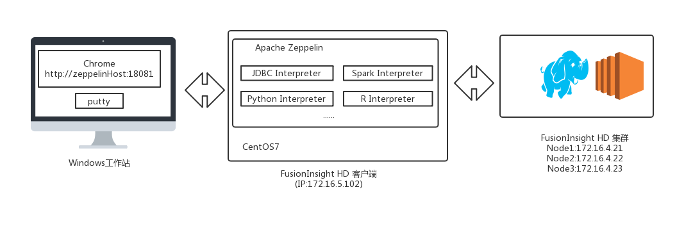


## 安装Fusioninsight HD客户端

参考 产品文档 **软件安装**> **初始配置** > **配置客户端** > **安装客户端** 章节。
文档假定已创建用户developuser，并赋予足够权限，下载developuser用户凭证文件user.keytab，上传至`/opt/developuser/`目录下；完整客户端假定安装在`/opt/hadoopclient/`。
## 安装Zeppelin

### 操作场景
安装Zeppelin0.8.1
### 前提条件

- 已完成FusionInsight HD和客户端的安装。

### 操作步骤

- 安装Zeppelin

在网址`https://zeppelin.apache.org/download.html`下载安装包，

 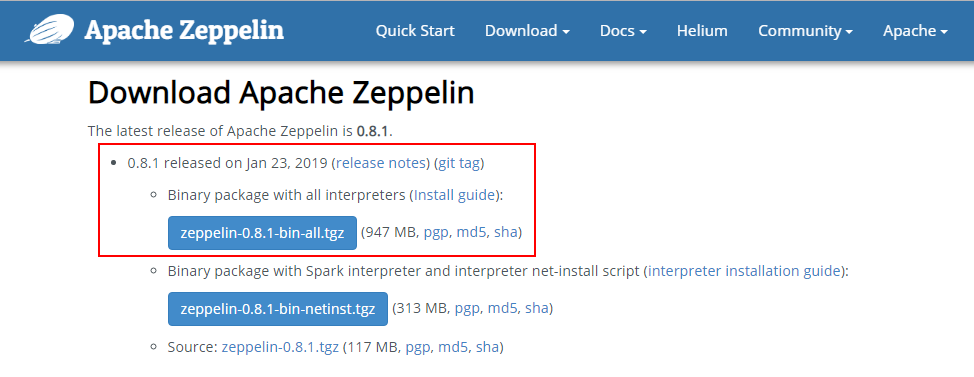

 - 使用WinSCP等工具导入主机并用以下命令安装生成/usr/zeppelin目录。
   ```
   tar -zxvf zeppelin-0.8.1-bin-all.tgz
   mv zeppelin-0.8.1-bin-all /usr/zeppelin
   ```


- 配置Zeppelin环境变量，在profile文件中加入如下变量
  ```
  vi /etc/profile
  export ZEPPELIN_HOME=/usr/zeppelin
  export PATH=$ZEPPELIN_HOME/bin:$PATH


  ```
- 导入环境变量
  ```
  source /etc/profile
  ```

- 编辑zeppelin-env.sh文件，加入JAVA_HOME,位置`/usr/zeppelin/conf`

  ```
  cd /usr/zeppelin/conf/
  cp zeppelin-env.sh.template zeppelin-env.sh
  source /opt/hadoopclient/bigdata_env
  echo $JAVA_HOME
  echo "export JAVA_HOME=/opt/hadoopclient/JDK/jdk-8u201">>zeppelin-env.sh

  ```

     

- 编辑zeppelin-site.xml文件，位置`/usr/zeppelin/conf`,将zeppelin.server.port 8080替换成18081（可自定义，也可以不改）；将zeppelin.anonymous.allowed参数的true修改为false
  ```
  cd /usr/zeppelin/conf
  cp zeppelin-site.xml.template  zeppelin-site.xml
  vi zeppelin-site.xml
  ```

  ```
  <property>
  <name>zeppelin.server.port</name>
  <value>18081</value>
  <description>Server port.</description>
  </property>
  ```


    ```
    <property>
    <name>zeppelin.anonymous.allowed</name>
    <value>falase</value>
    <description>Anonymous user allowed by default</description>
    </property>
    ```


- 编辑shiro.ini文件，位置/usr/zeppelin/conf/shiro.ini,增加用户developuser
  ```
  cp shiro.ini.template shiro.ini
  vi shiro.ini
  ```

  [users]下增加用户developuser，密码Huawei@123，权限admin

  ```
  developuser = Huawei@123, admin
  ```

    


- 升级zeppelin的libthrift-0.9.2至libthrift-0.9.3（或以上）版本。
  >说明：zeppelin0.8.1源码打包的是libthrift-0.9.2.jar，运行后面的样例会出现错误`java.lang.NoSuchMethodError: com.facebook.fb303.FacebookService$Client.sendBaseOneway(Ljava/lang/String;Lorg/apache/thrift/TBase;)V`


  ```
  source /opt/hadoopclient/bigdata_env
  cd /opt/hadoopclient/Hive/Beeline/lib/jdbc
  jar xvf libthrift-0.9.3.jar org/apache/thrift/TServiceClient.class
  javap -p org/apache/thrift/TServiceClient.class
    ```
    ```
  source /opt/hadoopclient/bigdata_env
  cd /usr/zeppelin/interpreter/spark/
  jar xvf spark-interpreter-0.8.1.jar org/apache/thrift/TServiceClient.class
  javap -p org/apache/thrift/TServiceClient.class
  find /usr/zeppelin -name "libthrift*.jar"
  cp -r /usr/zeppelin /usr/zeppelin_bakup
  find /usr/zeppelin  -name "libthrift*.jar" | xargs rm -f {} \;
  find /usr/zeppelin -name "libthrift*.jar"
  cp /opt/hadoopclient/Hive/Beeline/lib/jdbc/libthrift-0.9.3.jar /usr/zeppelin/lib/interpreter/
  cp /opt/hadoopclient/Hive/Beeline/lib/jdbc/org/apache/thrift/TServiceClient.class /usr/zeppelin/interpreter/spark/org/apache/thrift/TServiceClient.class
  jar uvf spark-interpreter-0.8.1.jar org/apache/thrift/TServiceClient.class

  ```
  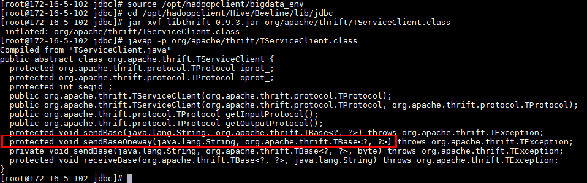

  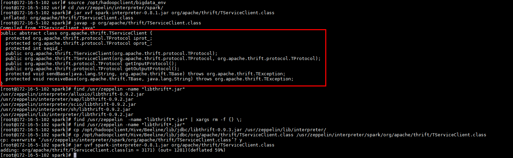

- 运行zeppelin(并检查启动参数)
    ```
    zeppelin-daemon.sh start
    ps ef | grep /opt/hadoopclient/JDK/jdk-8u201

    ```
    

- 关闭防火墙,允许端口18081(此为测试环境，生产环境建议采取更安全措施)
   ```
    systtemctl stop firewalld
    ```
 - 在浏览器中输入地址zeppelin_ip:18081，用developuser登陆。zeppelin_ip为安装zeppelin的HD客户端IP


## Zeppelin连接HBase

### 操作场景

Zeppelin中配置Hbase解析器，对接Hbase

### 前提条件

- 已经完成Zeppelin 0.8.1的安装

- 已完成FusionInsight HD和客户端的安装，包含HBase组件

### 操作步骤
- 对接HBase前，确认客户端hbase shell能连接HBase
  ```
  source /opt/hadoopclient/bigdata_env
  hbase shell
  ```
  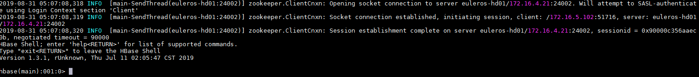

- 将`/usr/zeppelin/interpreter/hbase/`目录下旧的jar包移走
  ```
  cd /usr/zeppelin/interpreter/hbase
  mkdir hbase_jar
  mv hbase*.jar hbase_jar
  mv hadoop*.jar hbase_jar
  mv zookeeper-3.4.6.jar hbase_jar
  ```


- 将`/opt/hadoopclient/HBase/hbase/lib/`以下的jar包拷贝至`/usr/zeppelin/interpreter/hbase/`。
  ```
  \cp -f /opt/hadoopclient/HBase/hbase/lib/*.jar /usr/zeppelin/interpreter/hbase/

  ```

- 新建Java Authentication Authorization Service认证文件`/usr/zeppelin/conf/jaas.conf`，内容如下:
  ```
  Client {
  com.sun.security.auth.module.Krb5LoginModule required
  useKeyTab=true
  keyTab="/opt/developuser/user.keytab"
  principal="developuser"
  useTicketCache=false
  storeKey=true
  debug=true;
  };
  ```
- 编辑zeppelin-env.sh文件，位置/usr/zeppelin/conf，加入以下三个配置内容
  ```
  export JAVA_HOME=/opt/hadoopclient/JDK/jdk-8u201
  export ZEPPELIN_INTP_JAVA_OPTS="-Djava.security.krb5.conf=/opt/developuser/krb5.conf -Djava.security.auth.login.config=/usr/zeppelin/conf/jaas.conf -Dzookeeper.server.principal=zookeeper/hadoop.hadoop.com -Dzookeeper.request.timeout=120000"
  export HBASE_HOME=/opt/hadoopclient/HBase/hbase
  ```

- 编辑interpreter.json，位置`/usr/zeppelin/conf/interpreter.json`,修改hbase.home。

  ```
    "hbase.home": {
          "name": "hbase.home",
          "value": "/opt/hadoopclient/HBase/hbase",
          "type": "string"
        },
  ```
- 重启zeppelin。
  ```
  source /opt/hadoopclient/bigdata_env
  kinit –kt /opt/developuser/user.keytab developuser
  zeppelin-daemon.sh restart
  ```

- 登陆Zeppelin，确认hbase配置。选择右上角菜单中的 Interpreter

  

- 选择hbase

  


- 页面选择Notebook -> Create new note

  

- 自定义note名称，例如hbase_test

  

- 编辑note，点击右侧“执行”按钮
  ```
  %hbase
  create 'test6', 'cf'
  put 'test6', 'row1', 'cf:a', 'value1'
  ```
  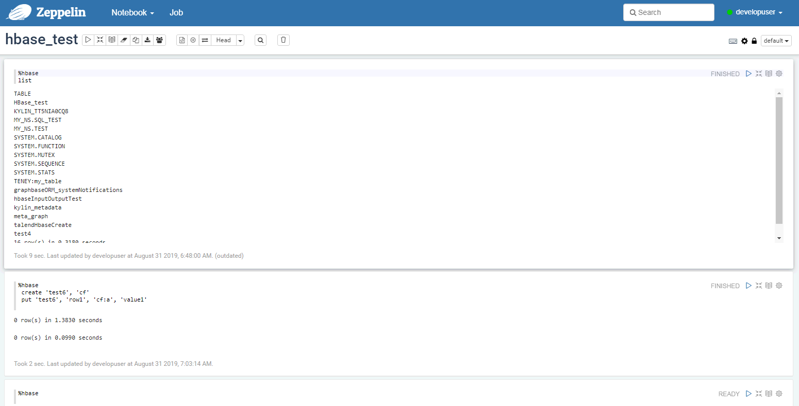


- 在FusionInsight的客户端下可以看到创建的hbase表test4和数据


## Zeppelin连接Hive
### 操作场景

Zeppelin中配置JDBC解析器，对接Hive的JDBC接口。

### 前提条件

- 已经完成Zeppelin 0.8.1的安装；
- 已完成FusionInsight HD，包含Hive组件。
- 根据产品文档完成客户端的安装，创建用户developuser，并赋予足够权限，下载用户developuser的keytab文件user.keytab，上传至`/opt/developuser/`目录下

### 操作步骤
- 对接前，确认HD自带beeline客户端可连接hive

  ```
  source /opt/hadoopclient/bigdata_env
  beeline
  ```
  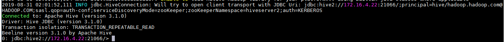

- 新建Java Authentication Authorization Service认证文件`/usr/zeppelin/conf/jaas.conf`，内容如下:
  ```
  Client {
  com.sun.security.auth.module.Krb5LoginModule required
  useKeyTab=true
  keyTab="/opt/developuser/user.keytab"
  principal="developuser"
  useTicketCache=false
  storeKey=true
  debug=true;
  };
  ```


- 编辑zeppelin-env.sh文件，位置`/usr/zeppelin/conf/zeppelin-env.sh`，配置ZEPPELIN_INTP_JAVA_OPTS等内容
  ```
  export JAVA_HOME=/opt/hadoopclient/JDK/jdk-8u201
  export ZEPPELIN_INTP_JAVA_OPTS="-Djava.security.krb5.conf=/opt/developuser/krb5.conf -Djava.security.auth.login.config=/usr/zeppelin/conf/jaas.conf -Dzookeeper.server.principal=zookeeper/hadoop.hadoop.com -Dzookeeper.request.timeout=120000"

  ```


- 复制 Hive JDBC 相关jar包至zeppelin

  ```
  cd /opt/hadoopclient/Hive/Beeline/lib/jdbc
  \cp -f hive-jdbc-3.1.0.jar hive-service-rpc-3.1.0.jar hive-service-3.1.0.jar curator-client-2.12.0.jar curator-framework-2.12.0.jar zookeeper-3.5.1.jar guava-19.0.jar hive-common-3.1.0.jar hive-shims-common-3.1.0.jar hive-standalone-metastore-3.1.0.jar hadoop-common-3.1.1.jar woodstox-core-asl-4.4.1.jar woodstox-core-5.0.3.jar stax2-api-3.1.4.jar commons-collections-3.2.2.jar commons-configuration2-2.1.1.jar hadoop-auth-3.1.1.jar hive-serde-3.1.0.jar /usr/zeppelin/interpreter/jdbc/

  ```


- 查询CLIENT HIVE URI
  ```
  source /opt/hadoopclient/bigdata_env
  echo $CLIENT_HIVE_URI
  ```
  

- 编辑interpreter.json，位置`/usr/zeppelin/conf/interpreter.json`,修改JDBC default.url,default.driver.
  >说明:default.url为$CLIENT_HIVE_URI的值，注意字符等号=在json文件中为\u003；default.driver为org.apache.hive.jdbc.HiveDriver

  ```
    "jdbc": {
          "id": "jdbc",
          "name": "jdbc",
          "group": "jdbc",
          "properties": {
            "default.url": {
              "name": "default.url",
              "value": "jdbc:hive2://172.16.4.21:24002,172.16.4.22:24002,172.16.4.23:24002/;serviceDiscoveryMode\u003dzooKeeper;zooKeeperNamespace\u003dhiveserver2;sasl.qop\u003dauth-conf;auth\u003dKERBEROS;principal\u003dhive/hadoop.hadoop.com@HADOOP.COM",
              "type": "string"
            },
            "default.driver": {
              "name": "default.driver",
              "value": "org.apache.hive.jdbc.HiveDriver",
              "type": "string"
            },

    ```

  

- 重启zeppelin。
  ```
  source /opt/hadoopclient/bigdata_env
  kinit –kt /opt/developuser/user.keytab developuser
  zeppelin-daemon.sh restart
  ```
- 登陆Zeppelin，确认jdbc的配置。选择右上角菜单中的 Interpreter

  


- 选择JDBC

  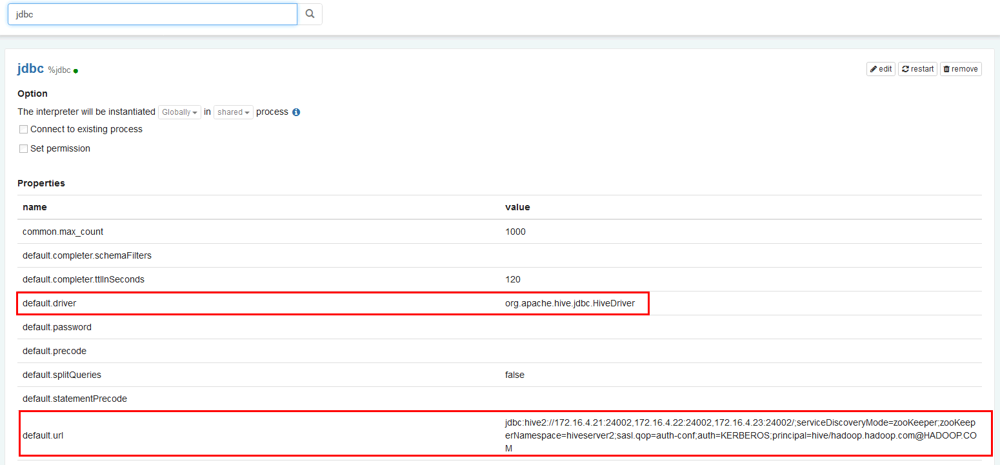


- 页面选择Notebook -> Create new note

  

- 自定义note名称，例如hive_test

  

- 编辑note，点击右侧“执行”按钮。
  ```
  %jdbc
  Show tables;
  ```
  ```
  %jdbc
  select * from t2
  ```
- 导入预定义的hive notebook,`import note`,选择json文件 [zeppelin_notebook_hive_test.json](assets/Zeppelin_0.8.1/zeppelin_notebook_hive_test.json)
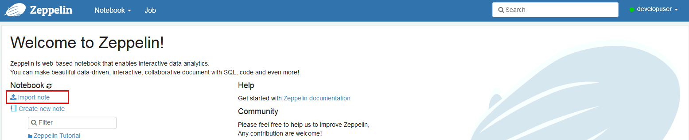
- 点击右侧“执行”(Shift+Enter)按钮，查看结果

  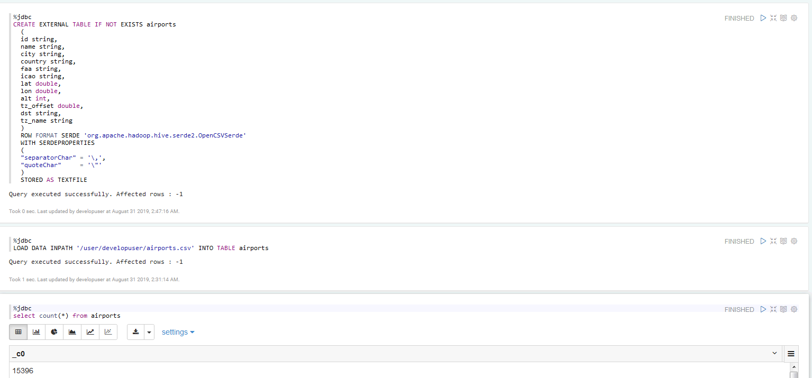


## Zeppelin连接Spark

### 操作场景

Zeppelin中配置Spark解析器

### 前提条件

- 完成Zeppelin0.8.1的安装；
- 已完成FusionInsight HD和客户端的安装，包含Spark2x组件。

### 操作步骤
- 对接Spark前，确认客户端工具spark-beeline能连接Spark
  ```
  source /opt/hadoopclient/bigdata_env
  kinit -kt /opt/developuser/user.keytab developuser
  spark-beeline
  ```
  

- 将`/opt/hadoopclient/Spark2x/spark/jars`路径下所有的jar包拷贝至`/usr/zeppelin/interpreter/spark`

  ```
  cp /opt/hadoopclient/Spark2x/spark/jars/*.jar /usr/zeppelin/interpreter/spark/
  ```

- 编辑zeppelin-env.sh文件，位置`/usr/zeppelin/conf`，加入以下内容

  ```
  export JAVA_HOME=/opt/hadoopclient/JDK/jdk-8u201
  export MASTER=yarn-client
  export SPARK_HOME=/opt/hadoopclient/Spark2x/spark
  export HADOOP_CONF_DIR=/opt/hadoopclient/HDFS/hadoop/etc/hadoop
  ```

 - 关闭防火墙(提交spark任务时，能方便访问Spark Driver所在节点的端口)
    ```
      systemctl stop firewalld
    ```

- 登陆Zeppelin，选择右上角菜单中的 Interpreter

  

- 选择Spark，点击 **edit** 编辑，将 master 参数改为 yarn-client，并且检查zeppelin.spark.useHiveContext项，使其值为false，点击 **save** 保存

  

  


- 使用yarn-client模式，还需要将客户端的主机名与IP的映射关系添加到Yarn ResourceManager节点(本文即HD的3台主机节点）的hosts文件中。（另一种方式是在ZEPPELIN_INTP_JAVA_OPTS中添加-Dspark.driver.host=172.16.5.102）

    ```
    echo "172.16.5.102 172-16-5-102">>/etc/hosts

    ```
- 重启zeppelin。
  ```
  source /opt/hadoopclient/bigdata_env
  kinit –kt /opt/developuser/user.keytab developuser
  zeppelin-daemon.sh restart
  ```
- 执行zeppelin的spark样例代码，参考网址
  `https://www.zepl.com/viewer/notebooks/aHR0cHM6Ly9yYXcuZ2l0aHVidXNlcmNvbnRlbnQuY29tL2hvcnRvbndvcmtzLWdhbGxlcnkvemVwcGVsaW4tbm90ZWJvb2tzL21hc3Rlci8yQTk0TTVKMVovbm90ZS5qc29u/`
  >样例代码需要访问Internet上的资源，所以保证zeppelin所在的节点可以联网
 - 或者导入预定义的notebook, Zeppelin页面选择`import note`,选择json文件 [zeppelin_notebook_spark_test.json](assets/Zeppelin_0.8.1/zeppelin_notebook_spark_test.json)
 - 点击右侧“执行”(Shift+Enter)按钮，查看结果
 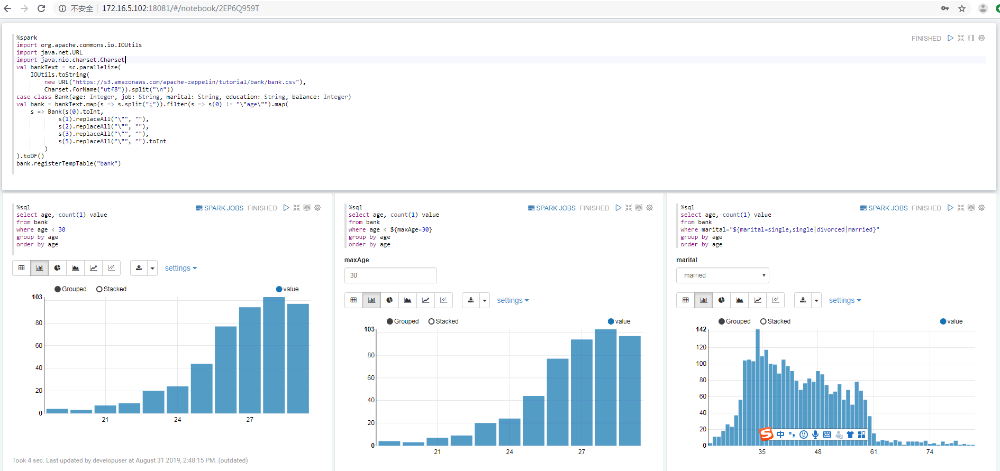


 - （可选）查看zeppelin启动参数
    ```
    ps -ef | grep org.apache.zeppelin
    ```
- 执行zeppelin的spark样例代码Zeppelin Tutorial -> Matplotlib (Python • PySpark)


  安装Anaconda2

  ```
  wget https://repo.anaconda.com/archive/Anaconda2-2019.07-Linux-x86_64.sh
  sh Anaconda2-2019.07-Linux-x86_64.sh
  ```

  安装matplotlib

  ```
  conda install matplotlib
  ```

  在zeppelin的界面中，选择右上角的 Interpreter

  选择Spark，点击 **edit** 编辑，将 zeppelin.pyspark.python 参数改为Anaconda安装目录中的python，点击 **save** 保存

  

  执行zeppelin的pyspark样例代码Zeppelin Tutorial -> Matplotlib (Python • PySpark)
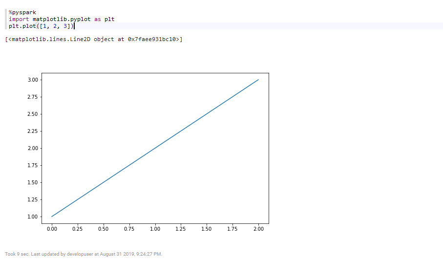


## Zeppelin连接SparkR

### 操作场景

Zeppelin中配置Spark解析器，连接SparkR

### 前提条件

- 完成Zeppelin0.8.1的安装；
- 已完成FusionInsight HD和客户端的安装，包含Spark2x组件。
- 参考[http://zeppelin.apache.org/docs/latest/interpreter/spark.html](http://zeppelin.apache.org/docs/latest/interpreter/spark.html)

### 操作步骤

- 在Zeppelin的节点上安装R。

  ```
  yum install R R-devel libcurl-devel openssl-devel libxml2-devel
  ```
  >由于Executor需要执行R，采用yarn-client模式，所以在Zeppelin的节点上安装R。HD集群节点不需要R,因为有SparkR

 - 执行`R`，检查R是否可用。正常启动如下图所示
    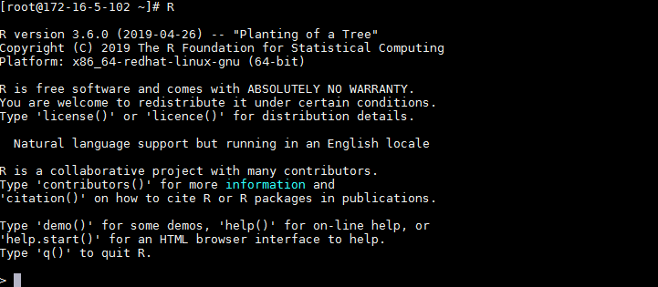

- 在R的命令行中安装R interpreter的libraries，参考[http://zeppelin.apache.org/docs/0.8.1/interpreter/r.html ](http://zeppelin.apache.org/docs/0.8.1/interpreter/r.html )

- 在R的命令行中安装后面样例工程所需的libraries

  ```
    options(repos=structure(c(CRAN="https://mirrors.tuna.tsinghua.edu.cn/CRAN/")))
    install.packages('devtools')
    install.packages("sparklyr")
    install.packages("dplyr")
    install.packages("ggplot2")
    install.packages("babynames")
    install.packages("dygraphs")
    install.packages('knitr')
    install.packages("rbokeh")

    ```
- FusionInsight客户端下测试是否可以使用sparkR
  ```
  source /opt/hadoopclient/bigdata_env
  kinit developuser
  sparkR
  ```
  
- 编辑zeppelin-env.sh文件，位置`/usr/zeppelin/conf`，加入以下内容
  ```
    export JAVA_HOME=/opt/hadoopclient/JDK/jdk-8u201
    export MASTER=yarn-client
    export SPARK_HOME=/opt/hadoopclient/Spark2x/spark
    export HADOOP_CONF_DIR=/opt/hadoopclient/HDFS/hadoop/etc/hadoop
  ```

- 在zeppelin的界面中，选择右上角的 Interpreter 选择Spark，点击 **edit** 编辑，将 zeppelin.R.cmd 参数改为R的启动文件，master 改为yarn-client ，zeppelin.spark.useHiveContext改为false 点击 **save** 保存

  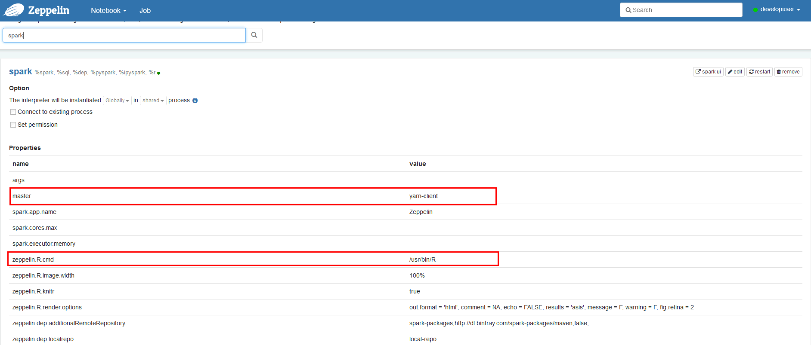

- 使用yarn-client模式，还需要将客户端的主机名与IP的映射关系添加到Yarn ResourceManager节点(本文即HD的3台主机节点）的hosts文件中

    ```
    echo "172.16.5.102 172-16-5-102">>/etc/hosts

    ```

- 重启zeppelin。
  ```
  source /opt/hadoopclient/bigdata_env
  kinit –kt /opt/developuser/user.keytab developuser
  zeppelin-daemon.sh restart
  ```
- 在Zeppelin新建notebook
  ```
  %r
  if (nchar(Sys.getenv("SPARK_HOME")) < 1) {
    Sys.setenv(SPARK_HOME="/opt/hadoopclient/Spark2x/spark")
  }
  library(SparkR, lib.loc = c(file.path(Sys.getenv("SPARK_HOME"), "R", "lib")))

  results <- sql("FROM airports SELECT id,name")
  head(results)
  ```
- 点击右侧“执行”(Shift+Enter)按钮，查看结果

  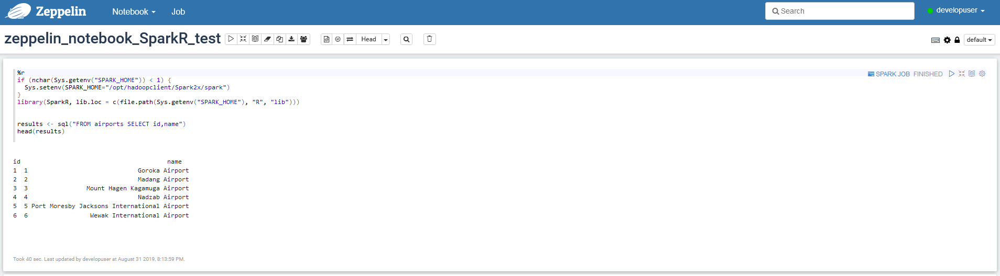


- 导入预定义的notebook, Zeppelin页面选择`import note`,选择json文件 [zeppelin_notebook_sparklyr_test.json](assets/Zeppelin_0.8.1/zeppelin_notebook_sparklyr_test.json)
  >说明：本样例使用库sparklyr连接SparkR

 - 点击右侧“执行”(Shift+Enter)按钮，查看结果

   


## Zeppelin连接GaussDB200
### 操作场景
Zeppelin中配置JDBC解析器，连接GaussDB200

### 前提条件

- 完成Zeppelin0.8.1的安装；
- 已完成FusionInsight HD和客户端的安装;
- 已完成GaussDB200的安装。

### 操作步骤
- 第一步： 后台登录GaussDB200, 创建登录用户， 分配用户权限， 创建数据库
  -  以omm用户身份登录CN所在服务器（172-16-4-143 集群主节点），执行`source ${BIGDATA_HOME}/mppdb/.mppdbgs_profile`命令启动环境变量

  - 使用`gsql -d postgres -p 25308`连接数据库
  


  - 创建数据库用户**developuser**, 密码为**Bigdata@123**

    `CREATE USER developuser WITH PASSWORD "Bigdata@123";`


   -  用下面这个命令将系统权限授权给用户或者角色

      `GRANT ALL PRIVILEGES TO developuser;`


  -  创建数据库。

      `CREATE DATABASE db_tpcds;`


    创建完db_tpcds数据库后，就可以按如下方法退出postgres数据库，使用新用户连接到此数据库执行接下来的创建表等操作。当然，也可以选择继续在默认的postgres数据库 下做后续的体验。

    ```
    \q
    gsql -d db_tpcds -p 25308 -U developuser -W Bigdata@123
    ```

    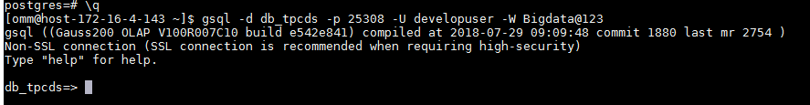


- 第二步： 配置GaussDB200远程连接

  - 以omm用户身份登录CN所在服务器（172-16-4-143 集群主节点），执行`source ${BIGDATA_HOME}/mppdb/.mppdbgs_profile`命令启动环境变量

  - 配置客户端认证方式，允许客户端以 **developuser** 用户连接到本机，此处远程连接禁止使用 **omm** 用户。 例如，下面示例中配置允许IP地址为 **172.16.5.103** 的客户端访问集群本机。

    ` gs_guc set -Z coordinator -N all -I all -h "host all developuser 172.16.5.103/32 sha256" `    
    -Z coordinator表示实例类型为coordinator。
    -N all表示集群的所有主机。
    -I all表示主机的所有实例。
    -h 表示指定需要在“pg_hba.conf”增加的语句。
    all表示允许客户端连接到任意的数据库。
    developuser 表示连接数据库的用户。
    172.16.5.103/32表示只允许IP地址为10.10.0.30的主机连接。在使用过程中，请根据用户的网络
进行配置修改。
sha256表示连接时jack用户的密码使用sha256算法加密。

  - 查看配置是非生效，vi /srv/BigData/mppdb/data1/coordinator/pg_hba.conf

    


  - 使用如下命令查看CN目前的listen_addresses配置。

     ```
      gs_guc check -Z coordinator -I all -c "listen_addresses"
    ```
    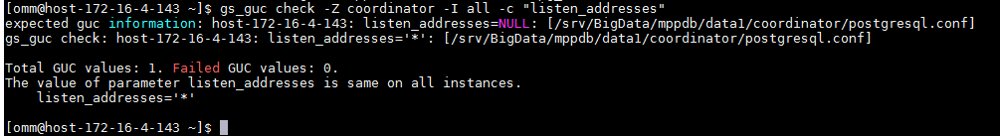

  - 配置listen_addresses

    使用命令 ` gs_guc set -N all -I all -Z coordinator -c "listen_addresses = '*'" `


- 第三步： 配置zeppelin JDBC 接口对接 GaussDB200

  - 根据相关文档下载GaussDB200的jdbc驱动：

    驱动程序：gsjdbc200.jar

    驱动类：com.huawei.gauss200.jdbc.Driver


  - 将 **gsjdbc200.jar** 驱动文件使用WinSCP等工具拷贝到 `/usr/zepplein/interpreter/jdbc`路径下


  - 配置 JDBC interpreter，vi /usr/zepplein/conf/interpreter.json


    ```
    1: default.driver = com.huawei.gauss200.jdbc.Driver
    2: default.password = Bigdata@123
    3: default.url = jdbc:postgresql://172.21.3.101:25108/db_tpcds
    4: default.user = developuser

    ```

    ```
    "jdbc": {
      "id": "jdbc",
      "name": "jdbc",
      "group": "jdbc",
      "properties": {
        "default.url": {
          "name": "default.url",
          "value": "jdbc:gaussdb://172.16.4.143:25308/db_tpcds",
          "type": "string"
        },
        "default.driver": {
          "name": "default.driver",
          "value": "com.huawei.gauss200.jdbc.Driver",
          "type": "string"
        },
        "zeppelin.jdbc.principal": {
          "name": "zeppelin.jdbc.principal",
          "value": "",
          "type": "string"
        },
        "default.completer.ttlInSeconds": {
          "name": "default.completer.ttlInSeconds",
          "value": "120",
          "type": "number"
        },
        "default.password": {
          "name": "default.password",
          "value": "Bigdata@123",
          "type": "password"
        },
        "default.completer.schemaFilters": {
          "name": "default.completer.schemaFilters",
          "value": "",
          "type": "textarea"
        },
        "default.splitQueries": {
          "name": "default.splitQueries",
          "value": false,
          "type": "checkbox"
        },
        "default.user": {
          "name": "default.user",
          "value": "developuser",
          "type": "string"
        },

    ```
  - 重启zeppelin。
    ```
    source /opt/hadoopclient/bigdata_env
    kinit –kt /opt/developuser/user.keytab developuser
    zeppelin-daemon.sh restart
    ```
   - 导入预定义的notebook, Zeppelin页面选择`import note`,选择json文件[zeppelin_notebook_GaussDB200_test.json](assets/Zeppelin_0.8.1/zeppelin_notebook_GaussDB200_test.json)


  - 点击右侧“执行”(Shift+Enter)按钮，查看结果


## FAQ

### 如何获取本文中使用sparklyr分析的源数据

* 执行以下shell脚本获取待分析的数据(或者直接用浏览器访问http://stat-computing.org/dataexpo/2009 来下载)
  ```shell
  # Make download directory
  mkdir /tmp/flights

  # Download flight data by year
  for i in {2006..2008}
    do
      echo "$(date) $i Download"
      fnam=$i.csv.bz2
      wget -O /tmp/flights/$fnam http://stat-computing.org/dataexpo/2009/$fnam
      echo "$(date) $i Unzip"
      bunzip2 /tmp/flights/$fnam
    done

  # Download airline carrier data
  wget --no-check-certificate -O /tmp/airlines.csv http://www.transtats.bts.gov/Download_Lookup.asp?Lookup=L_UNIQUE_CARRIERS

  # Download airports data
  wget --no-check-certificate -O /tmp/airports.csv https://raw.githubusercontent.com/jpatokal/openflights/master/data/airports.dat
  ```

* 将下载下来的/tmp/flights目录以及/tmp/airlines.csv，/tmp/airports.csv文件上传到HDFS的/user/developuser目录中，然后在Hive中创建三张表，将数据加载到对应的表中

  ```
  hdfs dfs -mkdir /user/developuser/flights
  hdfs dfs -put flights/* /user/developuser/flights/
  hdfs dfs -put airlines.csv /user/developuser/
  hdfs dfs -put airports.csv /user/developuser/
  ```

  ```sql
  CREATE EXTERNAL TABLE IF NOT EXISTS flights
  (
    year int,
    month int,
    dayofmonth int,
    dayofweek int,
    deptime int,
    crsdeptime int,
    arrtime int,
    crsarrtime int,
    uniquecarrier string,
    flightnum int,
    tailnum string,
    actualelapsedtime int,
    crselapsedtime int,
    airtime string,
    arrdelay int,
    depdelay int,
    origin string,
    dest string,
    distance int,
    taxiin string,
    taxiout string,
    cancelled int,
    cancellationcode string,
    diverted int,
    carrierdelay string,
    weatherdelay string,
    nasdelay string,
    securitydelay string,
    lateaircraftdelay string
  )
  ROW FORMAT DELIMITED
  FIELDS TERMINATED BY ','
  LINES TERMINATED BY '\n'
  STORED AS TEXTFILE
  TBLPROPERTIES("skip.header.line.count"="1");
  ```

  ```sql
  LOAD DATA INPATH '/user/developuser/flights/2006.csv' INTO TABLE flights;
  LOAD DATA INPATH '/user/developuser/flights/2007.csv' INTO TABLE flights;
  LOAD DATA INPATH '/user/developuser/flights/2008.csv' INTO TABLE flights;
  ```

  ```sql
  CREATE EXTERNAL TABLE IF NOT EXISTS airlines
  (
  Code string,
  Description string
  )
  ROW FORMAT SERDE 'org.apache.hadoop.hive.serde2.OpenCSVSerde'
  WITH SERDEPROPERTIES
  (
  "separatorChar" = '\,',
  "quoteChar"     = '\"'
  )
  STORED AS TEXTFILE
  tblproperties("skip.header.line.count"="1");
  ```

  ```sql
  LOAD DATA INPATH '/user/developuser/airlines.csv' INTO TABLE airlines;
  ```

  ```sql
  CREATE EXTERNAL TABLE IF NOT EXISTS airports
  (
  id string,
  name string,
  city string,
  country string,
  faa string,
  icao string,
  lat double,
  lon double,
  alt int,
  tz_offset double,
  dst string,
  tz_name string
  )
  ROW FORMAT SERDE 'org.apache.hadoop.hive.serde2.OpenCSVSerde'
  WITH SERDEPROPERTIES
  (
  "separatorChar" = '\,',
  "quoteChar"     = '\"'
  )
  STORED AS TEXTFILE;
  ```

  ```sql
  LOAD DATA INPATH '/user/developuser/airports.csv' INTO TABLE airports;


  ```
