# Apache Airflow对接FusionInsight

## 适用场景

> Apache Airflow 1.10.6 <--> FusionInsight HD 6.5.1 (hive)


## 测试环境描述

Apache Airflow安装主机： 172.16.2.121
对接FI HD集群： 172.16.5.161-163

## 安装anaconda

参考jupyternotebook或者jupyterhub文档，完成anaconda环境的安装。这里选用的是Python2版本的安装。因为Python3版本在后续的安装airflow kerberos的时候会报错。

python3 安装问题单： https://issues.apache.org/jira/browse/AIRFLOW-5033

## 安装airflow

- 在安装好的anaconda的bin路径下`/opt/anaconda2/bin`，输入如下命令`pip install apache-airflow`开始安装airflow

- 使用如下命令安装相关的依赖
  ```
  yum install gcc-c++ python-devel.x86_64 cyrus-sasl-devel.x86_64
  yum install cyrus-sasl-devel cyrus-sasl-gssapi cyrus-sasl-md5 cyrus-sasl-plain
  ```
- 安装完成后输入如下命令继续安装airflow对kerberos, hive，gcp的额外特性

  ```
  pip install apache-airflow[kerberos,hive,gcp]
  ```

  具体介绍请参见airflow文档：https://airflow.apache.org/docs/stable/installation.html


- 启动airflow:

  - 使用如下命令初始化airflow关联的数据库

    `airflow initdb`

    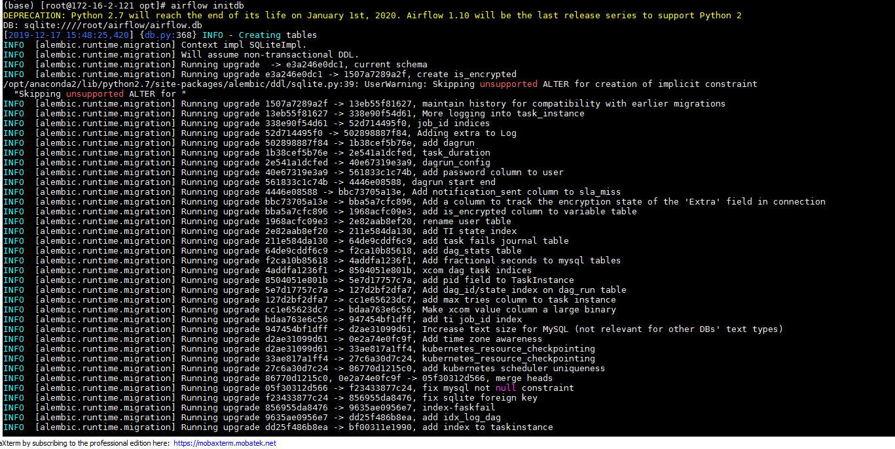

  - 使用如下命令启动airflow的网络服务`airflow webserver -p 8080`

    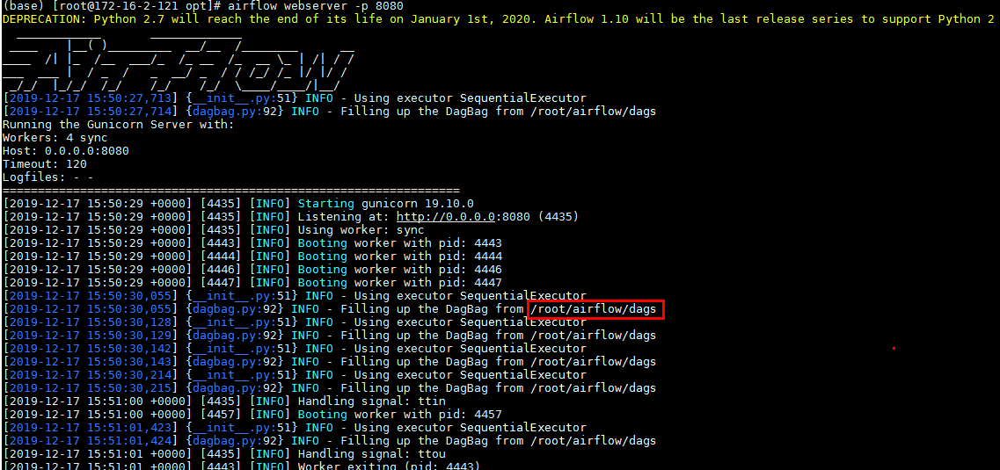

    可以看到启动后airflow默认的home路径为/root/airflow

  - 打开另外一个终端，`source ~/.bashrc.anaconda2`初始完环境变量后，使用如下命令启动airflow的scheduler服务`airflow scheduler`

    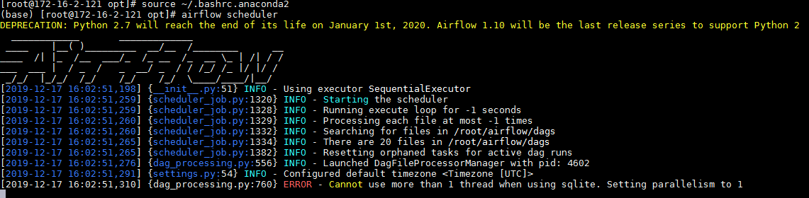

    注意：遇到如图报错不影响使用

  - 登陆airflow的webUI检查:

    


## kerberos相关配置

- 停止已经启动的airflow

- 登陆对接集群FI HD manager创建测试用户airflow，并且下载对应的user.keytab文件以及krb5.conf文件。将user.keytab文件重命名为airflow.keytab文件

  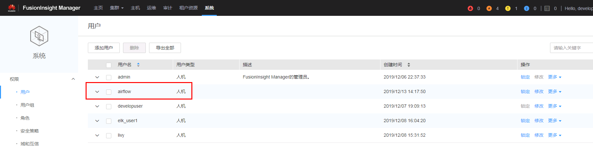


- 将上一步获得的airflow.ketab文件和krb5.conf文件拷贝到airflow主机的/opt路径

- 登陆路径/root/airflow修改配置文件airflow.cfg：

  1.  修改kerberos相关配置

    

    ```
    [kerberos]
    ccache = /tmp/krb5cc_0
    # gets augmented with fqdn
    principal = airflow
    reinit_frequency = 3600
    kinit_path = /opt/165_651hdclient/hadoopclient/KrbClient/kerberos/bin/kinit
    keytab = /opt/airflow.keytab
    ```

    其中`/opt/165_651hdclient/hadoopclient/KrbClient/kerberos/bin/kinit`为对接集群客户端对应的kinit文件

  2.  修改security相关你配置：

    

- airflow的调度会使用dag文件，需要在`/root/airflow`路径下创建一个新的`dags`文件夹：

    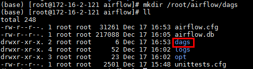


## airflow中hive相关connection配置

说明（重要）：本节测试3种可以和hive连接的方式，第1种和第2中需要更改airflow主机/etc/hosts文件，所以不能与其他的连接方式兼容（比如hdfs），在实际运用中推荐使用jdbc的连接方式来进行连接。

### airflow中hive metastore connection配置

- 重启airflow

- 重新打开一个终端，初始化环境变量（source ~/.bashrc.anaconda2），输入以下命令增加一个hive metastore的connection：

  ```
  airflow connections --add \
  --conn_id metastore_cluster1 \
  --conn_type 'hive_metastore' \
  --conn_host '172.16.4.162' \
  --conn_port 21088 \
  --conn_extra '{"authMechanism":"GSSAPI", "kerberos_service_name":"hive"}'
  ```

  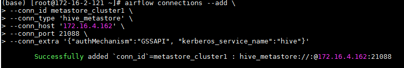

  注意：metastore_cluster1为airflow的conn_id，后续配置dag时需用到，不能与已有的conn_id重名

- 可登陆airflow的webUI检查增加的hive metastore connection配置：

  

  

  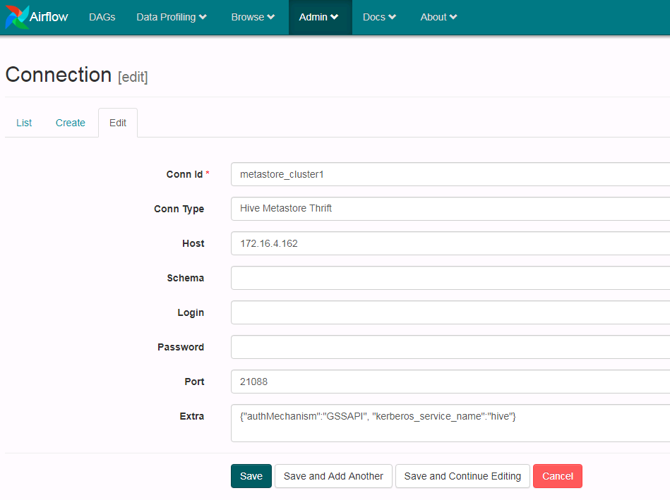

- 修改airflow主机的/etc/hosts文件:

  

  注意：需要将对应连接的主机名之前的注释掉，改成hadoop.hadoop.com


- 在终端输入`python`进行验证

  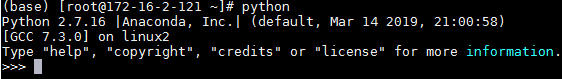

  输入代码：
  ```
  from airflow.hooks import hive_hooks
  hm = hive_hooks.HiveMetastoreHook(metastore_conn_id='metastore_cluster1')
  hm.get_databases()
  t=hm.get_table(db='default', table_name='iris')
  t.tableName
  [col.name for col in t.sd.cols]
  ```

  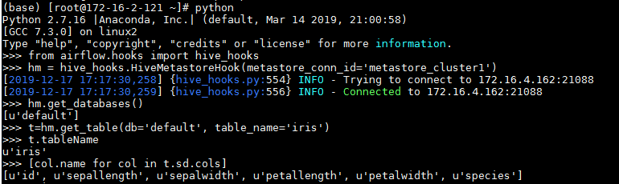

### airflow中hiveserver2 connection配置

- 重启airflow

- 重新打开一个终端，初始化环境变量（source ~/.bashrc.anaconda2），输入以下命令增加一个hiveserver2的connection：

  ```
  airflow connections --add \
  --conn_id hiveserver2_test \
  --conn_type 'hiveserver2' \
  --conn_host '172.16.4.162' \
  --conn_port 21066 \
  --conn_extra '{"authMechanism":"KERBEROS", "kerberos_service_name":"hive"}'
  ```

  

  注意：hiveserver2_test为airflow的conn_id，后续配置dag时需用到，不能与已有的conn_id重名

- 登陆airflow的webUI检查增加的hiveserver2 connection配置：

  

  

  做如下增加修改并保存：

  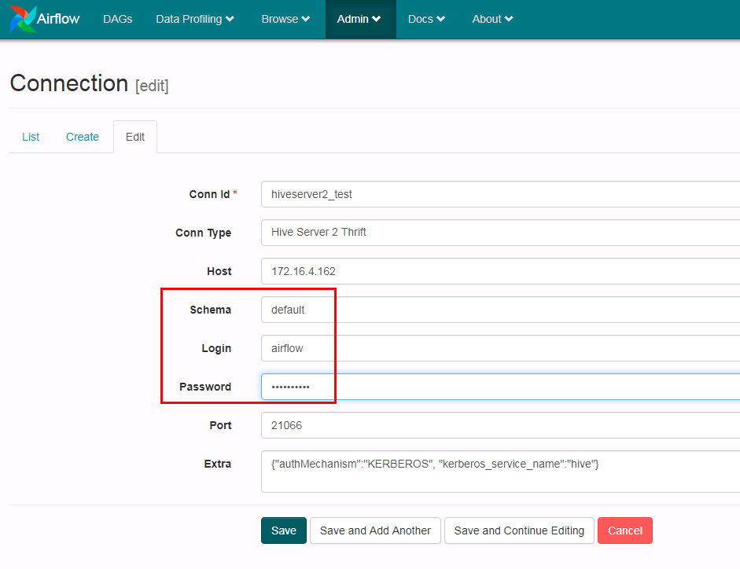

- 在终端输入`python`进行验证

  

  输入代码：

  ```
  from airflow.hooks import hive_hooks
  hh = hive_hooks.HiveServer2Hook(hiveserver2_conn_id='hiveserver2_test')
  sql = "SELECT * FROM default.iris"
  len(hh.get_records(sql))
  hh.get_records(sql)
  ```

  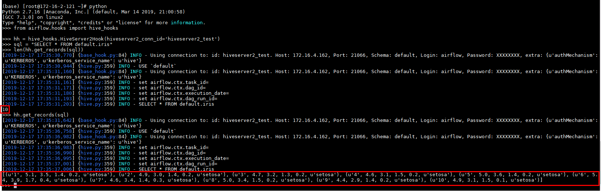

### airflow中jdbc connection对接hive配置

- 执行如下命令
  ```
  source /opt/165_651hdclient/hadoopclient/bigdata_env
  kinit airflow
  ```

- 配置`/opt/jaas.conf`文件

  

- 使用如下命令导入jvm参数：
  `export JAVA_TOOL_OPTIONS="-Djava.security.krb5.conf=/etc/krb5.conf -Djava.security.auth.login.config=/opt/jaas.conf -Dzookeeper.server.principal=zookeeper/hadoop.hadoop.com -Dzookeeper.request.timeout=120000"`

- 重启airflow

- 重新打开一个终端，初始化环境变量（source ~/.bashrc.anaconda2），输入以下命令增加一个jdbc的connection名字叫做hive_jdbc：

  ```
  airflow connections --add \
  --conn_id hive_jdbc \
  --conn_type 'jdbc'
  ```

- 登陆airflow的webUI配置hive_jdbc，参考图配置好参数点save保存

  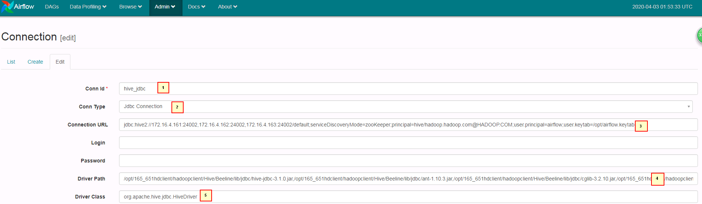

  ```
  1. hive_jdbc
  2. Jdbc Connection
  3. jdbc:hive2://172.16.4.161:24002,172.16.4.162:24002,172.16.4.163:24002/default;serviceDiscoveryMode=zooKeeper;principal=hive/hadoop.hadoop.com@HADOOP.COM;user.principal=airflow;user.keytab=/opt/airflow.keytab
  4. /opt/165_651hdclient/hadoopclient/Hive/Beeline/lib/jdbc/hive-jdbc-3.1.0.jar,/opt/165_651hdclient/hadoopclient/Hive/Beeline/lib/jdbc/ant-1.10.3.jar,/opt/165_651hdclient/hadoopclient/Hive/Beeline/lib/jdbc/cglib-3.2.10.jar,/opt/165_651hdclient/hadoopclient/Hive/Beeline/lib/jdbc/common-0.0.1.jar,/opt/165_651hdclient/hadoopclient/Hive/Beeline/lib/jdbc/commons-collections-3.2.2.jar,/opt/165_651hdclient/hadoopclient/Hive/Beeline/lib/jdbc/commons-collections4-4.2.jar,/opt/165_651hdclient/hadoopclient/Hive/Beeline/lib/jdbc/commons-configuration-1.6.jar,/opt/165_651hdclient/hadoopclient/Hive/Beeline/lib/jdbc/commons-configuration2-2.1.1.jar,/opt/165_651hdclient/hadoopclient/Hive/Beeline/lib/jdbc/commons-io-2.4.jar,/opt/165_651hdclient/hadoopclient/Hive/Beeline/lib/jdbc/commons-lang-2.6.jar,/opt/165_651hdclient/hadoopclient/Hive/Beeline/lib/jdbc/commons-lang3-3.3.2.jar,/opt/165_651hdclient/hadoopclient/Hive/Beeline/lib/jdbc/commons-logging-1.1.3.jar,/opt/165_651hdclient/hadoopclient/Hive/Beeline/lib/jdbc/commons-net-3.6.jar,/opt/165_651hdclient/hadoopclient/Hive/Beeline/lib/jdbc/crypter-0.0.6.jar,/opt/165_651hdclient/hadoopclient/Hive/Beeline/lib/jdbc/curator-client-2.12.0.jar,/opt/165_651hdclient/hadoopclient/Hive/Beeline/lib/jdbc/curator-framework-2.12.0.jar,/opt/165_651hdclient/hadoopclient/Hive/Beeline/lib/jdbc/cxf-core-3.1.16.jar,/opt/165_651hdclient/hadoopclient/Hive/Beeline/lib/jdbc/cxf-rt-frontend-jaxrs-3.1.16.jar,/opt/165_651hdclient/hadoopclient/Hive/Beeline/lib/jdbc/cxf-rt-transports-http-3.1.16.jar,/opt/165_651hdclient/hadoopclient/Hive/Beeline/lib/jdbc/FMS-v1r2c60-20160429.jar,/opt/165_651hdclient/hadoopclient/Hive/Beeline/lib/jdbc/guava-19.0.jar,/opt/165_651hdclient/hadoopclient/Hive/Beeline/lib/jdbc/hadoop-auth-3.1.1.jar,/opt/165_651hdclient/hadoopclient/Hive/Beeline/lib/jdbc/hadoop-common-3.1.1.jar,/opt/165_651hdclient/hadoopclient/Hive/Beeline/lib/jdbc/hadoop-mapreduce-client-core-3.1.1.jar,/opt/165_651hdclient/hadoopclient/Hive/Beeline/lib/jdbc/HA-v1r2c60-20160429.jar,/opt/165_651hdclient/hadoopclient/Hive/Beeline/lib/jdbc/hive-common-3.1.0.jar,/opt/165_651hdclient/hadoopclient/Hive/Beeline/lib/jdbc/hive-metastore-3.1.0.jar,/opt/165_651hdclient/hadoopclient/Hive/Beeline/lib/jdbc/hive-serde-3.1.0.jar,/opt/165_651hdclient/hadoopclient/Hive/Beeline/lib/jdbc/hive-service-3.1.0.jar,/opt/165_651hdclient/hadoopclient/Hive/Beeline/lib/jdbc/hive-service-rpc-3.1.0.jar,/opt/165_651hdclient/hadoopclient/Hive/Beeline/lib/jdbc/hive-shims-0.23-3.1.0.jar,/opt/165_651hdclient/hadoopclient/Hive/Beeline/lib/jdbc/hive-shims-common-3.1.0.jar,/opt/165_651hdclient/hadoopclient/Hive/Beeline/lib/jdbc/hive-standalone-metastore-3.1.0.jar,/opt/165_651hdclient/hadoopclient/Hive/Beeline/lib/jdbc/httpclient-4.5.2.jar,/opt/165_651hdclient/hadoopclient/Hive/Beeline/lib/jdbc/httpcore-4.4.4.jar,/opt/165_651hdclient/hadoopclient/Hive/Beeline/lib/jdbc/jackson-annotations-2.9.8.jar,/opt/165_651hdclient/hadoopclient/Hive/Beeline/lib/jdbc/jackson-core-2.9.8.jar,/opt/165_651hdclient/hadoopclient/Hive/Beeline/lib/jdbc/jackson-core-asl-1.9.13.jar,/opt/165_651hdclient/hadoopclient/Hive/Beeline/lib/jdbc/jackson-databind-2.9.8.jar,/opt/165_651hdclient/hadoopclient/Hive/Beeline/lib/jdbc/jackson-jaxrs-1.9.13.jar,/opt/165_651hdclient/hadoopclient/Hive/Beeline/lib/jdbc/jackson-mapper-asl-1.9.13.jar,/opt/165_651hdclient/hadoopclient/Hive/Beeline/lib/jdbc/javax.annotation-api-1.2.jar,/opt/165_651hdclient/hadoopclient/Hive/Beeline/lib/jdbc/javax.ws.rs-api-2.0.1.jar,/opt/165_651hdclient/hadoopclient/Hive/Beeline/lib/jdbc/jdbc_pom.xml,/opt/165_651hdclient/hadoopclient/Hive/Beeline/lib/jdbc/jettison-1.1.jar,/opt/165_651hdclient/hadoopclient/Hive/Beeline/lib/jdbc/jsch-0.1.54.jar,/opt/165_651hdclient/hadoopclient/Hive/Beeline/lib/jdbc/libthrift-0.9.3.jar,/opt/165_651hdclient/hadoopclient/Hive/Beeline/lib/jdbc/log4j-1.2.17.jar,/opt/165_651hdclient/hadoopclient/Hive/Beeline/lib/jdbc/mockito-all-1.10.19.jar,/opt/165_651hdclient/hadoopclient/Hive/Beeline/lib/jdbc/netty-all-4.1.17.Final.jar,/opt/165_651hdclient/hadoopclient/Hive/Beeline/lib/jdbc/om-controller-api-0.0.1.jar,/opt/165_651hdclient/hadoopclient/Hive/Beeline/lib/jdbc/om-monitor-plugin-0.0.1.jar,/opt/165_651hdclient/hadoopclient/Hive/Beeline/lib/jdbc/pms-v1r2c60-20160429.jar,/opt/165_651hdclient/hadoopclient/Hive/Beeline/lib/jdbc/protobuf-java-2.5.0.jar,/opt/165_651hdclient/hadoopclient/Hive/Beeline/lib/jdbc/slf4j-api-1.7.10.jar,/opt/165_651hdclient/hadoopclient/Hive/Beeline/lib/jdbc/slf4j-log4j12-1.7.5.jar,/opt/165_651hdclient/hadoopclient/Hive/Beeline/lib/jdbc/spring-aop-4.3.20.RELEASE.jar,/opt/165_651hdclient/hadoopclient/Hive/Beeline/lib/jdbc/spring-beans-4.3.20.RELEASE.jar,/opt/165_651hdclient/hadoopclient/Hive/Beeline/lib/jdbc/spring-context-4.3.20.RELEASE.jar,/opt/165_651hdclient/hadoopclient/Hive/Beeline/lib/jdbc/spring-core-4.3.20.RELEASE.jar,/opt/165_651hdclient/hadoopclient/Hive/Beeline/lib/jdbc/spring-expression-4.3.20.RELEASE.jar,/opt/165_651hdclient/hadoopclient/Hive/Beeline/lib/jdbc/stax2-api-3.1.4.jar,/opt/165_651hdclient/hadoopclient/Hive/Beeline/lib/jdbc/stax-api-1.0-2.jar,/opt/165_651hdclient/hadoopclient/Hive/Beeline/lib/jdbc/woodstox-core-5.0.3.jar,/opt/165_651hdclient/hadoopclient/Hive/Beeline/lib/jdbc/woodstox-core-asl-4.4.1.jar,/opt/165_651hdclient/hadoopclient/Hive/Beeline/lib/jdbc/xercesImpl-2.9.1.jar,/opt/165_651hdclient/hadoopclient/Hive/Beeline/lib/jdbc/xmlpull-1.1.3.1.jar,/opt/165_651hdclient/hadoopclient/Hive/Beeline/lib/jdbc/xmlschema-core-2.2.3.jar,/opt/165_651hdclient/hadoopclient/Hive/Beeline/lib/jdbc/xpp3_min-1.1.4c.jar,/opt/165_651hdclient/hadoopclient/Hive/Beeline/lib/jdbc/xstream-1.4.10.jar,/opt/165_651hdclient/hadoopclient/Hive/Beeline/lib/jdbc/zookeeper-3.5.1.jar
  5. org.apache.hive.jdbc.HiveDriver
  ```

- 在终端输入`python`进行验证

  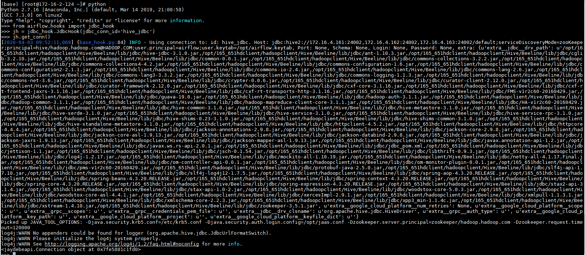

  

  输入代码：

  ```
  from airflow.hooks import jdbc_hook
  jh = jdbc_hook.JdbcHook(jdbc_conn_id='hive_jdbc')
  jh.get_conn()
  jh.get_records("select * from test")
  ```

## airflow中hetu相关connection配置

### airflow中jdbc connection对接hetu配置

- 执行如下命令
  ```
  source /opt/165_651hdclient/hadoopclient/bigdata_env
  kinit airflow
  ```

- 配置`/opt/jaas.conf`文件

  

- 使用如下命令导入jvm参数：
  `export JAVA_TOOL_OPTIONS="-Djava.security.krb5.conf=/etc/krb5.conf -Djava.security.auth.login.config=/opt/jaas.conf -Dzookeeper.server.principal=zookeeper/hadoop.hadoop.com -Dzookeeper.request.timeout=120000"`

- 重启airflow

- 重新打开一个终端，初始化环境变量（source ~/.bashrc.anaconda2），输入以下命令增加一个jdbc的connection名字叫做hetu：

  ```
  airflow connections --add \
  --conn_id hetu \
  --conn_type 'jdbc'
  ```

- 登陆airflow的webUI配置hetu，参考图配置好参数点save保存

  

  ```
  1. hetu
  2. Jdbc Connection
  3. jdbc:presto://172.16.4.161:24002,172.16.4.162:24002,172.16.4.163:24002/hive/default?serviceDiscoveryMode=zooKeeper&zooKeeperNamespace=hsbroker&deploymentMode=on_yarn&SSL=true&SSLTrustStorePath=/opt/hetuserver.jks&KerberosConfigPath=/opt/krb5.conf&KerberosPrincipal=airflow&KerberosKeytabPath=/opt/airflow.keytab&KerberosRemoteServiceName=HTTP&KerberosServicePrincipalPattern=%24%7BSERVICE%7D%40%24%7BHOST%7D
  4. /opt/presto-jdbc-316.jar
  5. io.prestosql.jdbc.PrestoDriver
  ```

- 在终端输入`python`进行验证

  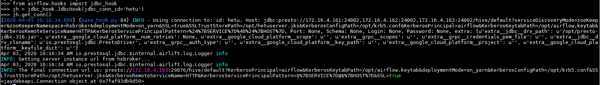

  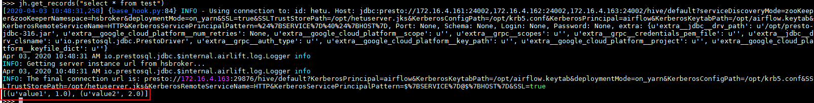

  输入代码：

  ```
  from airflow.hooks import jdbc_hook
  jh = jdbc_hook.JdbcHook(jdbc_conn_id='hetu')
  jh.get_conn()
  jh.get_records("select * from test")
  ```


## airflow中hdfs相关connection配置

### 配置airflow中webhdfs connection配置

- 因为此次使用webhdfs的http连接方式对接集群，首先先检查集群配置项是否符合要求：

  登录FusionInsight Manager页面，单击“集群 > 待操作集群的名称 > 服务 > HDFS > 配置 >全部配置”，在“搜索”框里搜索“dfs.http.policy”，然后勾选“HTTP_AND_HTTPS”，单击“保存”，单击“更多 > 重启”重启HDFS服务

  如果已经配置略过此步骤

- 重启airflow

- 重新打开一个终端，初始化环境变量（source ~/.bashrc.anaconda2），输入以下命令增加一个hdfs的connection名字叫做webhdfs_fusioninsight1：

  ```
  airflow connections --add \
  --conn_id webhdfs_fusioninsight1 \
  --conn_type 'hdfs'
  ```

  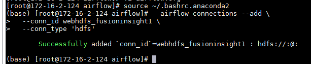

  输入代码：

  ```
  from airflow.hooks import webhdfs_hook
  whdfs = webhdfs_hook.WebHDFSHook(webhdfs_conn_id='webhdfs_fusioninsight1')
  whdfs.get_conn()
  ```

- 登陆airflow的webUI配置webhdfs_fusioninsight1，参考图配置好参数点save保存

  

- 下面在airflow主机创建路径`/opt/loadfile`,创建一个`iris.txt`文件内容：

  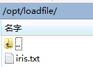

  ```
  1,5.1,3.5,1.4,0.2,setosa
  2,4.9,3,1.4,0.2,setosa
  3,4.7,3.2,1.3,0.2,setosa
  4,4.6,3.1,1.5,0.2,setosa
  5,5,3.6,1.4,0.2,setosa
  6,5.4,3.9,1.7,0.4,setosa
  7,4.6,3.4,1.4,0.3,setosa
  8,5,3.4,1.5,0.2,setosa
  9,4.4,2.9,1.4,0.2,setosa
  10,4.9,3.1,1.5,0.1,setosa
  ```


- 在终端输入`python`进行验证

  

  输入代码：

  ```
  from airflow.hooks import webhdfs_hook
  whdfs = webhdfs_hook.WebHDFSHook(webhdfs_conn_id='webhdfs_fusioninsight1')
  whdfs.get_conn()
  ```

  下面测试一下数据导入的样例，接着上面的命令继续输入

  `whdfs.load_file('/opt/loadfile/','/tmp/')`

  

  登陆集群hdfs的/tmp路径检查：

  


## 配置airflow中的DAG

说明：airflow使用dag来控制调度，实际上是一个`.py`文件，使用时需要编写任务流的py文件后再执行

- 登陆airflow主机`/opt/airflow/dags`路径，新建一个hivetest.py文件，内容如下：

  ```
  #!/usr/bin/env python
  # -*- coding: utf-8 -*-

  from datetime import datetime, timedelta
  from airflow.operators.python_operator import PythonOperator, BranchPythonOperator
  from airflow import DAG
  from airflow.operators.bash_operator import BashOperator
  from airflow.operators.hive_operator import HiveOperator
  from airflow.hooks import hive_hooks

  def test_select_conn():
  	from airflow.hooks.hive_hooks import HiveServer2Hook
  	hook = hive_hooks.HiveServer2Hook(hiveserver2_conn_id='hiveserver2_test')
  	sql = """SELECT * FROM iris"""
  	records = hook.get_records(sql)
  	return records

  default_args = {
      'owner': 'airflow',
      'start_date': datetime(2019, 1, 21),

  }

  dag = DAG(
      'hive_server_run_test', default_args=default_args,
      schedule_interval='@once')

  t1 = BashOperator(
      task_id='print_date',
      bash_command='date',
      dag=dag)

  t2 = BranchPythonOperator(
      task_id='hive_server_run',
      python_callable=test_select_conn,
      dag=dag)

  t2.set_upstream(t1)
  ```

  注意:该任务流有两个动作，第一个是t1，在命令行中输入data命令打印出当前时间，第二个动作是t2，打印出`select * from iris`查询语句，两个动作有对应的task_id


- 参考airflow官方文档：https://airflow.apache.org/docs/stable/tutorial.html

  使用命令`airflow test hive_server_run_test hive_server_run 2019-12-17`检查hive连接:

  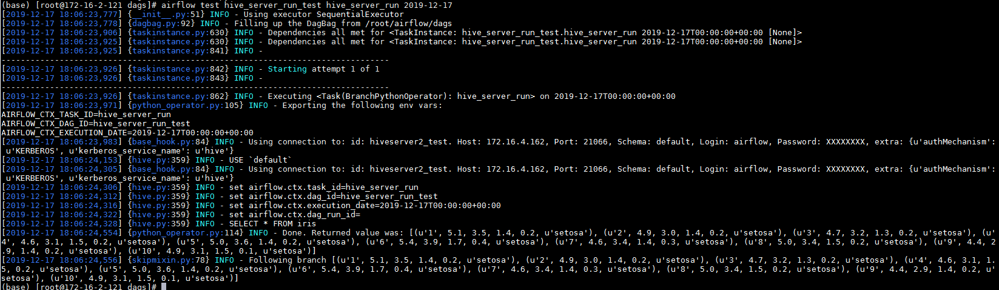

  其中hive_server_run_test是dag id, hive_server_run是 task id

- 上述test步骤测试成功之后，使用命令`airflow backfill hive_server_run_test -s 2019-12-17 -e 2019-12-17`提交任务：

  

  去webUI检查：

  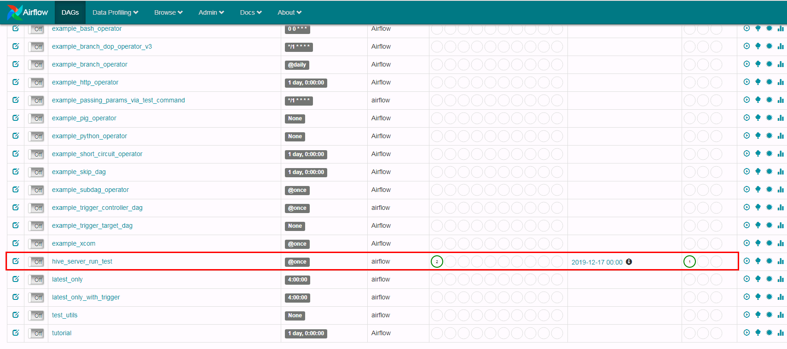

  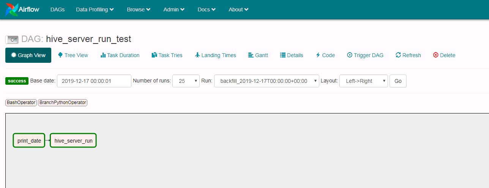

  点击print_data以及hive_server_run日志查看结果：

  print_data:

  

  

  hive_server_run:

  

  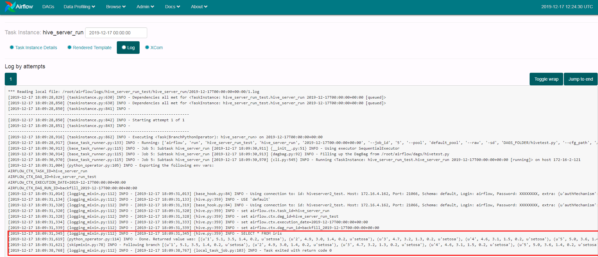


# FAQ

1.  在《安装airflow》的时候输入`pip install apache-airflow`会遇到错误：

  

  需要把marshmallow重新装成2.18.0的版本，使用命令`./pip install marshmallow==2.18.0 --force-reinstall` 在anaconda2的bin目录下重新安装正确版本问题解决

2.  在《安装airflow》的时候输入`pip install apache-airflow[kerberos,hive,gcp]`会遇到错误：

  

  问题在于 "#include <sasl/sasl.h>"没有安装成功，参考 https://blog.csdn.net/coder_gray/article/details/77189002， 看include缺的是什么就安装什么，输入`yum install gcc-c++ python-devel.x86_64 cyrus-sasl-devel.x86_64`先安装yum依赖，完了之后再重新执行`pip install apache-airflow[kerberos,hive,gcp]`问题解决


3.  在《airflow中hive相关connection配置》中调试的时候，输入`hm.get_databases()`遇到报错：

  

  thrift.transport.TTransport.TTransportException: Could not start SASL: Error in sasl_client_start (-4) SASL(-4): no mechanism available: No worthy mechs found

  这个问题是python依赖的问题，参考：https://stackoverflow.com/questions/30705576/python-cannot-connect-hiveserver2/30707252

  安装命令：`sudo yum install cyrus-sasl-devel cyrus-sasl-gssapi cyrus-sasl-md5 cyrus-sasl-plain` 安装外依赖后问题解决


4. 在做webhdfs的时候使用python命令在后台调测遇到问题：

  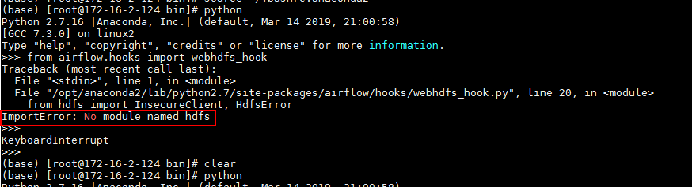

  `ImportError: No module named hdfs`

  解决办法:

  去/opt/anaconda2/bin下面使用命令`pip install hdfs`后重新执行程序问题解决


5. 在验证jdbc链接的时候遇到报错：

  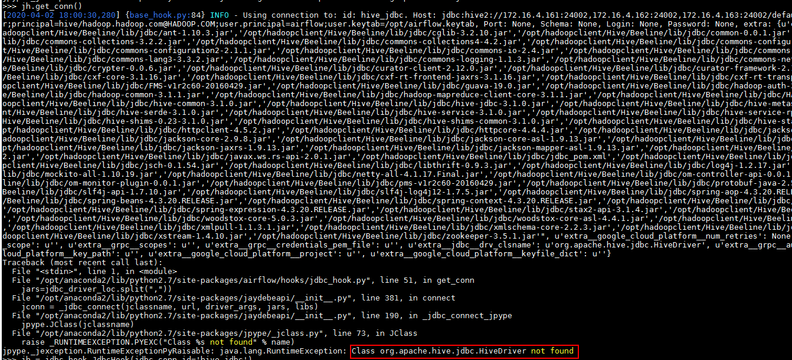

  找不到jdbc驱动主类，并且在配置上已经制定了正确的jar包路径

  解决办法：

  参考 https://www.reddit.com/r/dataengineering/comments/aqfvug/airflow_issues_setting_up_a_jdbc_connection_to/

  

  在使用python命令后台测试前 `kinit /opt/hadoopclient/bigdata_env` 在测试问题解决
