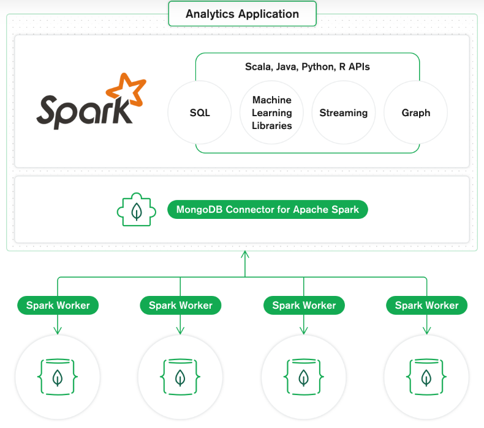
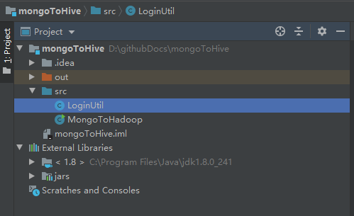
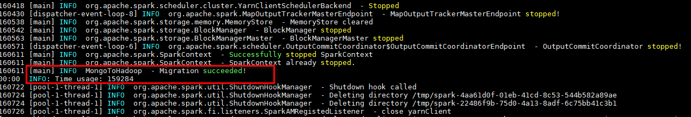

# Mongo数据迁移到hadoop最佳实践

## 概述

* 从Mongo同步数据到FusionInsight常用的几种方式存在的挑战：

  1. MongoDB Connector for Hadoop

    * 该方式最大的问题在于需要在hive连接MongoDB时明文存储MongoDB的链接串和密码，存在安全风险，在重视数据安全的公司，不符合安全要求。

  2. 通过下载Mongo的BSON文件，然后加载到Hadoop

    * 该方式对源端服务器造成较大性能压力，且文件需要中转，操作过程比较复杂。

  3. 使用ROMA FDI

    * 性能较差,ROMA定位并不是高性能的ETL工具，不适合大批量数据同步，且不能支持嵌套的文档。


## 推荐方案

  * 方案示意图如下：

    

    该实践来自于华为消费者BG，使用16并发，同步速度可以达到500万行/分，理论上并发结点增加，性能可以进一步提升。

    1. 首先将MongoDB密码存放到hadoop credential provider中，避免了密码明文显示的问题。

    2. 通过MongoDB Connector for Apache Spark对接MongoDB,读取MongoDB数据为Spark DataFrame，利用Spark SQL写入到Hive表中。Spark SQL基于内存处理和分布式架构，插入性能高。

    3. 核心组件为MongoDB Connector for Apache Spark，[点击查看相关介绍](https://docs.mongodb.com/spark-connector/master/),结合CBG场景需求，编写了一个工具，通过简单配置即可实现MongoDB向Hive的数据同步。

        

      * 注意对应的配套版本，华为FusionInsight Spark2x使用的Spark版本为2.3.2，对应的MongoDB Connector for spark 版本为2.3.3

        


## 操作步骤

### 环境准备

  * 执行以下命令写入Mongo密码到Hadoop credential中.

    ```
    export HADOOP_CREDSTORE_PASSWORD=huawei #可自定义
    hadoop credential create mongodb20201   -provider jceks://hdfs/mongo2020/secret20201.jceks #hdfs存放keystore的路径，可自定义
    ```

  * 下载jar包并上传到hadoop client端，如/root路径下

    mongo-spark-connector_2.11-2.3.2.jar [点击下载](https://repo1.maven.org/maven2/org/mongodb/spark/mongo-spark-connector_2.11/2.3.2/mongo-spark-connector_2.11-2.3.2.jar)

    mongo-java-driver-3.8.2.jar [点击下载](https://repo1.maven.org/maven2/org/mongodb/mongo-java-driver/3.8.2/mongo-java-driver-3.8.2.jar)


  * 创建连接配置文件,如/root/conf.properties

    ```
    userPrincipal=developuser #kerberos认证用户
    userKeytabPath=/confAndCredentials/user.keytab #Keytab文件路径
    krb5ConfPath=/confAndCredentials/krb5.conf #krb5.conf文件
    mongoUsername=mongodb2020 #mongodb
    mongoHost=172.16.13.112 #mongodb服务器地址
    mongoPort=27017 #mongodb服务端口
    mongoDB=sparkdb #mongodb待同步数据库名称
    mongoCollections=colls #mongodb待同步数据集名称
    conditions=       #过滤条件，如_id<xxx
    jceksPath=jceks://hdfs/mongo2020/secret2020.jceks #jceks路径
    MongoColumns=_id,title,description,likes,by #需要同步的mongodb的列
    hiveDB=sparkdb #需要写入的hive数据库的名称
    hiveTable=mongotable #需要写入的hive数据表的名称
    partColumn=  #hive表分区列名称，如果为空，表示无分区列
    partValue=2020  #分区列值

    ```

  * 获取kerberos认证文件，用于spark2x的kerberos认证

    使用开发者账号登录FusionInsight Manager，点右上角 ***下载认证凭据*** ，将获取的krb5.conf和user.keytab文件上传到hadoop client端，如/confAndCredentials/路径下。

  * 创建log4j配置文件，如/root/log4j.properties

    ```
    # This sets the global logging level and specifies the appenders
    log4j.rootLogger=INFO, theConsoleAppender

    # settings for the console appender
    log4j.appender.theConsoleAppender=org.apache.log4j.ConsoleAppender
    log4j.appender.theConsoleAppender.layout=org.apache.log4j.PatternLayout
    ```


### 编译jar工具包

  * 使用intellij idea 创建java工程，名称为MongoToHive

  * 在src文件夹下，粘贴LoginUtil.java[(下载)](https://github.com/fusioninsight/ecosystem/blob/zh-hans/docs/Other/BestPractises/LoginUtil.java)和MongoToHadoop.java[(下载)](https://github.com/fusioninsight/ecosystem/blob/zh-hans/docs/Other/BestPractises/MongoToHadoop.java)文件

    

  * 在 ***File*** -> ***project structure*** ->***libirary*** 中添加spark2x示例工程下的全部jar包(*FusionInsight_Cluster_1_Services_ClientConfig\Spark2x\FusionInsight-Spark2x-2.3.2.tar.gz\spark\jars*)，以及mongo spark connector和mongo-jar-driver jar包。

  * 在 ***File*** -> ***project structure*** ->***Artifacts*** -> ***jar*** -> ***Form Modules with dependencies*** -> ***OK***

    最终配置如下：

    

  * 点击菜单栏中的 ***build*** -> ***build Artifacts*** -> ***build*** ,完成打包

  * 上传生成的jar包到hadoop client 上，如放在/root目录下。

### 执行迁移命令

  * 执行以下命令，实现数据迁移

    ```
    export HADOOP_CREDSTORE_PASSWORD=huawei
    source /opt/hadoopclient/bigdata_env
    kinit developuser
    spark-submit --class MongoToHadoop --master yarn --deploy-mode client --jars /root/mongo-spark-connector_2.11-2.3.2.jar,/root/mongo-java-driver-3.8.2.jar   --driver-java-options "-Dlog4j.configuration=file:/root/log4j.properties" --num-executors 8 /root/mongoToHive.jar /root/conf.properties append

    ```

    部分参数说明：
    * --num-executors *指定spark并发数*
    * /root/mongoToHive.jar  *表示打包的jar包路径*
    * /root/conf.properties  *表示迁移配置文件路径*
    * append  *表示数据插入到hive表中的模式，包括overwrite和append两种模式，overwrite会先truncate目标表后再插入,append是直接插入方式，如果是分区表，则只会重写当前分区的数据，不会重写其他分区数据。*

    执行完成后，显示如下内容：

    
