# NIFI介绍

  * NIFI是一个易用、可扩展、高可靠的数据处理和分发系统。提供图形化界面和大量内置数据处理器，支持多种数据类型的路由、转换。NIFI在华为FusionInsight解决方案中定位为流式数据集成工具，在功能上可替代Flume。

  * NIFI主要价值特性如下：

    * 基于web界面的图形化工具，支持拖拉拽的形式快速实现数据处理。

    * 高可靠

      * 数据传输高可靠，确保数据传输

      * 高吞吐、低延迟

      * 动态优先级调整

      * 回压

    * 数据血缘，实现数据全链路的追踪能力

    * 高扩展

      * 支持自定义开发processor

      * 支持快速开发和测试

    * 高安全

      * 支持SSL、SSH、HTTPS 等类型的数据加密传输

      * 支持多租户的鉴权

    * NIFI架构

      

      * NIFI运行在JVM中，主要组件如下：

        * Web Server：主要用于提供基于http协议的命令和控制API

        * Flow Controller: 是Operation的大脑，提供extentions运行的线程，并且调度extensions何时接收入和处理数据。

        * FlowFile Repository: NiFi用于追踪数据流中flowfile的状态。默认方法是使用Write-Ahead Log技术(简单普及下，WAL的核心思想是：在数据写入库之前，先写入到日志.再将日志记录变更到存储器中。)写到指定磁盘目录。

        * Content Repository: 给定FlowFile的实际内容字节存储的地方。Content Repository的实现是可插拔的。默认方法是一种相当简单的机制，它将数据块存储在文件系统中。可以指定多个文件系统存储位置，以便获得不同的物理分区以减少任何单个卷上的争用。(所以环境最佳实践时可配置多个目录，挂载不同磁盘，提高IO)。

        * Provenance Repository: 存储所有事件数据的地方。Provenance Repository的实现是可插拔的，默认实现是使用一个或多个物理磁盘卷。在每个位置内的事件数据都是被索引并可搜索的。


# Minifi介绍

  MiNiFi是NiFi的子项目，是一个轻量级的agent，主要用于数据收集。主要有以下几个特征：

  * 轻量级，软件包比较小，资源占用少

  * 集中管理agent

  * 生成数据血缘

  * 和NiFi集成用于流式数据处理。

# NiFi安装

## NIFI集群安装

  * NIFI支持单机以及集群模式安装 ，推荐使用集群模式安装，提供高可靠性以及更高的数据处理和分发能力。

    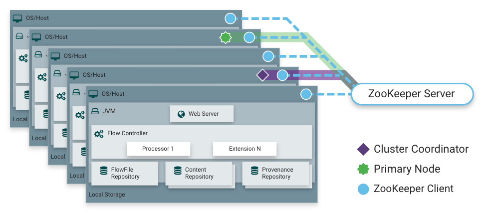

    从NiFi 1.0版本开始，采用了zero-master零主群集模式。 NiFi集群中的每个节点都对数据执行相同的任务，但是每个节点操作的是不同的数据集。 Apache ZooKeeper选择一个节点作为集群协调器coordinator，由ZooKeeper自动处理故障转移。 所有群集节点均向群集协调器报告心跳和状态信息。 集群协调器根据节点的状态以连接或者断开节点。此外，每个群集都有一个主节点master，该节点由ZooKeeper选择。 可以通过任何节点的用户界面访问集群管理器，针对集群的任何更改都将复制到集群中的所有节点，这种架构允许任何一个节点成为集群的访问入口。

  * 环境准备

    * 本次测试使用的系统及软件版本如下：

      * zookeeper: apache-zookeeper-3.5.5 [点击下载](http://apache.communilink.net/zookeeper/zookeeper-3.5.5/apache-zookeeper-3.5.5-bin.tar.gz)

      * NiFi: 1.10.0 [点击下载](https://archive.apache.org/dist/nifi/1.10.0/nifi-1.10.0-bin.tar.gz)

      * JDK 1.8 [点击下载](http://83.103.170.157/apps/java/jdk_1.8/jdk-8u231-linux-x64.rpm)

      * 至少3台vm: CENTOS 7.3 64bit 硬盘不低于100GB

        * vm1~vm3: 172.16.13.120/122/123

      * MiNiFi：java版本 0.5.0  [点击下载](https://www.apache.org/dyn/closer.lua?path=/nifi/minifi/0.5.0/minifi-0.5.0-bin.tar.gz)


## jdk安装

  * 上传已下载jdk文件到3个节点，执行以下命令完成jdk安装：

    ```
    rpm -ivh jdk-8u231-linux-x64.rpm
    ```

## zookeeper安装

    * 上传下载的zookeeper软件apache-zookeeper-3.5.5-bin.tar.gz到vm1的/opt目录下，执行以下命令解压文件，并拷贝到另外2个节点。


      ```
      cd /opt
      tar -zxvf apache-zookeeper-3.5.5-bin.tar.gz
      mv apache-zookeeper-3.5.5-bin zookeeper-3.5.5
      scp -r zookeeper-3.5.5/ root@172.16.13.122:/opt/
      scp -r zookeeper-3.5.5/ root@172.16.13.123:/opt/
      ```

    * zookeeper配置

      执行以下命令生成zookeeper配置文件zoo.cfg

      ```
      cp zoo_sample.cfg zoo.cfg
      ```

      修改zoo.cfg文件内容，参考如下：

      ```
        # The number of milliseconds of each tick
        tickTime=2000
        # The number of ticks that the initial
        # synchronization phase can take
        initLimit=10
        # The number of ticks that can pass between
        # sending a request and getting an acknowledgement
        syncLimit=5
        # the directory where the snapshot is stored.
        # do not use /tmp for storage, /tmp here is just
        # example sakes.
        dataDir= /zookeeperData
        # the port at which the clients will connect
        clientPort=2181
        # the maximum number of client connections.
        # increase this if you need to handle more clients
        #maxClientCnxns=60
        #
        # Be sure to read the maintenance section of the
        # administrator guide before turning on autopurge.
        #
        # http://zookeeper.apache.org/doc/current/zookeeperAdmin.html#sc_maintenance
        #
        # The number of snapshots to retain in dataDir
        #autopurge.snapRetainCount=3
        # Purge task interval in hours
        # Set to "0" to disable auto purge feature
        #autopurge.purgeInterval=1
        server.1=172.16.13.120:2888:3888
        server.2=172.16.13.122:2888:3888
        server.3=172.16.13.123:2888:3888
      ```

      3台服务器的zoo.cfg配置文件相同。

      在zoo.cfg 配置文件dataDir设置的路径下，执行以下命令创建myid文件：

      ```
      mkdir /zookeeperData
      cd /zookeeperData
      echo "1" > myid
      ```

      在vm2中执行以下命令创建myid文件

      ```
      mkdir /zookeeperData
      cd /zookeeperData
      echo "2" > myid
      ```
      在vm3中执行以下命令创建myid文件

      ```
      mkdir /zookeeperData
      cd /zookeeperData
      echo "3" > myid
      ```


    * zookeeper 启动

      分别在3个节点,执行以下命令，启动zookeeper

      ```
      cd /opt/zookeeper-3.5.5/bin/
      ./zkServer.sh start
      ```

    * zookeeper 验证

      分别在3个节点上执行以下命令，查看zookeeper状态及角色

      ```
      cd /opt/zookeeper-3.5.5/bin
      ./zkServer.sh status
      ```
      结果如下图：

      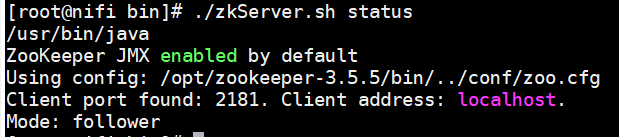

      其中一个节点的角色为leader,另外两个节点的角色为follower。


## NiFi安装

  * 上传已下载的nifi-1.10.0-bin.tar.gz文件到/opt目录下，执行以下命令，解压缩安装文件。

    ```
    cd /opt
    tar -zxvf nifi-1.10.0-bin.tar.gz
    ```

  * 在三个节点上分别修改/opt/nifi-1.10.0/conf/nifi.properties配置文件，包括以下内容,其中IP地址为对应结点的IP。

    ```
    # web properties #
    nifi.web.war.directory=./lib
    nifi.web.http.host=172.16.13.120
    nifi.web.http.port=18001
    ```

    ```
    # cluster node properties (only configure for cluster nodes) #
    nifi.cluster.is.node=true
    nifi.cluster.node.address=172.16.13.120
    nifi.cluster.node.protocol.port=28001
    ```

    ```
    nifi.cluster.load.balance.port=16342
    ```

    ```
    # zookeeper properties, used for cluster management #
    nifi.zookeeper.connect.string=172.16.13.120:2181,172.16.13.122:2181,172.16.13.123:2181
    nifi.zookeeper.connect.timeout=3 secs
    nifi.zookeeper.session.timeout=3 secs
    nifi.zookeeper.root.node=/nifi
    ```


  * 修改/opt/nifi-1.10.0/conf/state-management.xml配置文件，包括以下内容：

  ```
    <cluster-provider>
      <id>zk-provider</id>
      <class>org.apache.nifi.controller.state.providers.zookeeper.ZooKeeperStateProvider</class>
      <property name="Connect String">172.16.13.121:2181,172.16.13.122:2181,172.16.13.123:2181</property>
      <property name="Root Node">/nifi</property>
      <property name="Session Timeout">10 seconds</property>
      <property name="Access Control">Open</property>
    </cluster-provider>
  ```


  * 修改完成后，在三个节点执行以下命令，启动NiFi.

    ```
    sh /opt/nifi-1.10.0/bin/nifi.sh start
    ```
  * 登录验证

    登录http://172.16.13.123:18001/nifi，登录界面如下图，显示集群中有3个节点。

    

    点击右上角图标展开，选择 ***cluster*** 查看集群信息如下：

    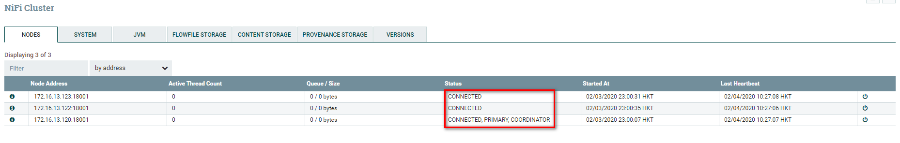

# 最佳实践

## 场景一：日志数据流式采集

  * 场景示意图如下：

    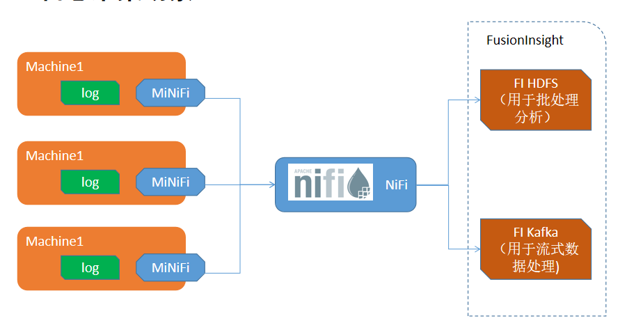

    通过MiNiFie从多个服务器实时采集日志文件，数据实时发送到NiFi中，通过NiFi将数据发送到Kafka和HDFS中，分别用于后续的流式数据处理以及批处理。基于拖拉拽的模式，可以快速实现数据采集流程，大幅减少了代码开发量。基于MiNiFi的轻量级Agent，可以实现对源端性能影响最小。

### 环境准备

#### Minifi安装

  * 准备一台tomcat服务器，在tomcat服务器上，安装MiNiFi，实时采集MiNiFi日志，将日志传入NiFi中，通过NiFi写入HDFS归档并写入Kafka进行流式数据处理。

  * 参考之前jdk安装步骤，在tomcat服务器上安装jdk1.8

  * 下载MiNiFi，[点击下载](https://www.apache.org/dyn/closer.lua?path=/nifi/minifi/0.5.0/minifi-0.5.0-bin.tar.gz)

  * 下载MiNiFi-toolkit 转换工具 [点击下载](
http://apache.communilink.net/nifi/minifi/0.5.0/minifi-toolkit-0.5.0-bin.tar.gz
)

  * 将下载的MiNiFi及MiNiFi-toolkit上传到/opt路径下。

  * 执行以下命令完成解压

  ```
  tar -zxvf minifi-0.5.0-bin.tar.gz
  tar -zxvf minifi-toolkit-0.5.0-bin.tar.gz
  ```


#### tomcat安装

  * 准备一台centos 服务器用于安装tomcat及测试，本次使用的tomcat 服务器ip是172.16.11.121

  * 执行以下命令下载并安装tomcat服务

    ```
    wget http://mirror-hk.koddos.net/apache/tomcat/tomcat-8/v8.5.50/bin/apache-tomcat-8.5.50.tar.gz
    mv apache-tomcat-8.5.50.tar.gz /opt/
    cd /opt/
    tar -zxvf apache-tomcat-8.5.50.tar.gz
    mv apache-tomcat-8.5.50 tomcat
    cd tomcat/
    sh bin/catalina.sh start
    ```
  * 通过浏览器访问http://172.16.11.121:8080，访问结果如下：

    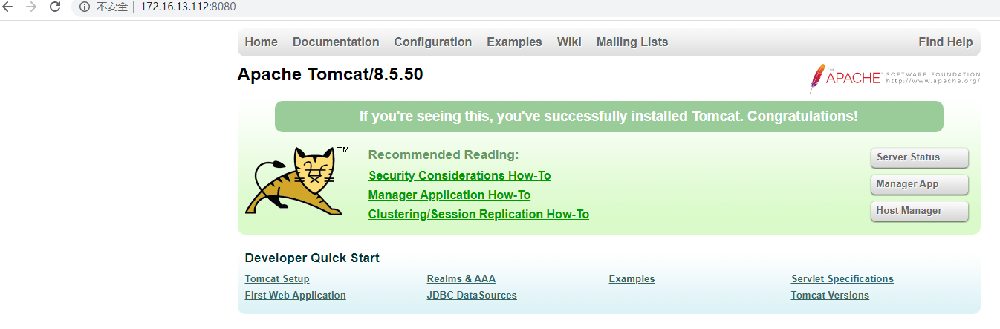


  * 在tomcat服务器文件/opt/tomcat/logs/localhost_access_log.2020-02-04.txt中，包括了当前最新的访问记录。

### NiFi配置

  * 在NiFi集群上，配置nifi.properties文件，需要配置site to site内容，开启站点接收服务和端口，参考配置如下：

    ```
    # Site to Site properties
    nifi.remote.input.host=172.16.13.120
    nifi.remote.input.secure=false
    nifi.remote.input.socket.port=10000
    nifi.remote.input.http.enabled=true
    nifi.remote.input.http.transaction.ttl=30 sec
    nifi.remote.contents.cache.expiration=30 secs
    ```

  * 重启NiFi服务。

### 创建数据流及模板

  * 在NiFi中，创建一个名称为"From MiNiFi"的input port，同时创建一个FI Hdfs以及FI Kafka Processor，对接FI 过程可以参考以下指导。[点击查看](https://github.com/fusioninsight/ecosystem/blob/zh-hans/docs/Data_Integration/Apache_NiFi.md)

    创建成功后如下图：

    

  * 在NiFi中，创建一个Process　Group，双击进入process group，创建一个tailfile Processor和一个remote process group ，并建立连接，如下图:

    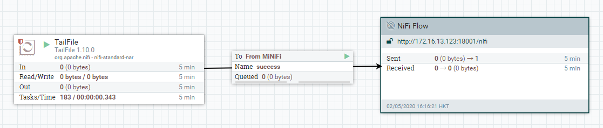

    TailFile参考配置：

    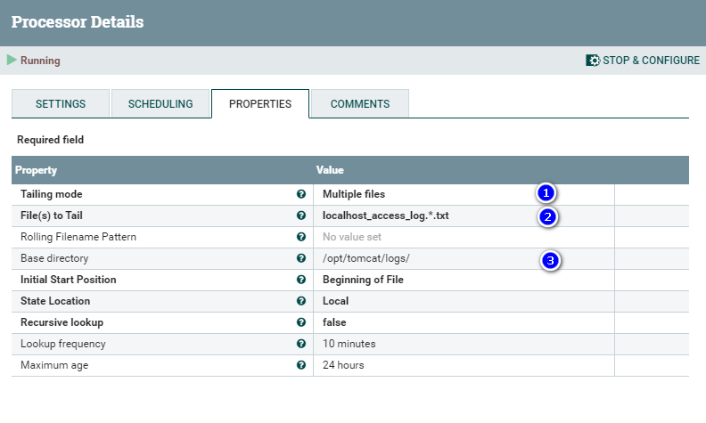

    Remote Proces Group参考配置：

    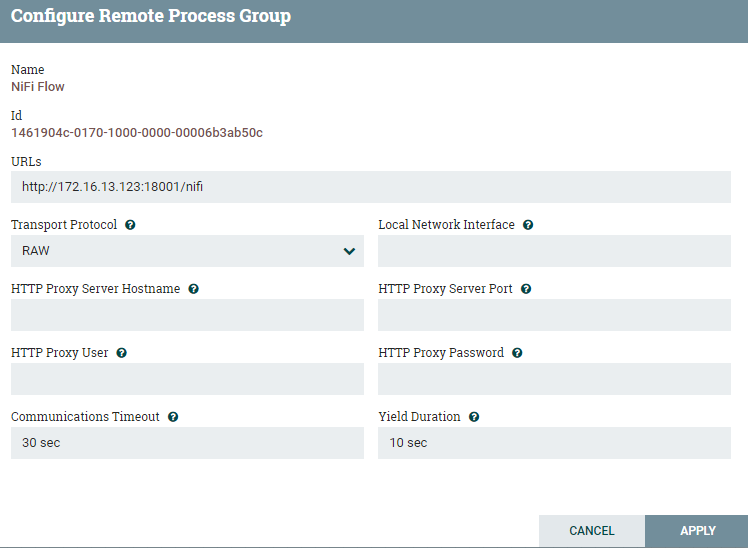

  * 选中Process group中组件，点击左侧按钮创建模板。该模板创建以后导入到MiNiFi中，作为MiNiFI中运行的配置文件。

    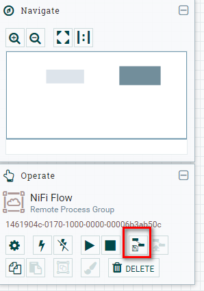

    创建成功后，在右侧菜单 ***templates*** 中，下载相应的模板。

  * 上传模板到安装了MiNiFi的tomcat服务器上，***需要修改xml对应的encoding-version为1.2,此处程序有个Bug，如果不修改，后续转换格式时会报错***。

    

  * 执行以下命令，将其从xml格式转换成yml格式，并拷贝到MiNiFi的配置文件目录中。

    ```
    sh /opt/minifi-toolkit-0.5.0/bin/config.sh transform nifitemplate.xml config.yml
    cp config.yml /opt/minifi-0.5.0/conf/
    ```

  * 启动MiNiFi

    执行以下命令启动MiNiFi

    ```
    sh /opt/minifi-0.5.0/minifi.sh start
    ```

### 数据验证

  * 配置完成后，整体拓扑图如下：

    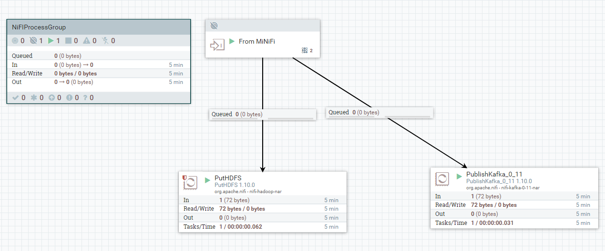

  * 通过访问tomcat首页，将在tomcat日志中生成一条访问记录。查看hdfs中是否生成对应的日志文件。如下图：

    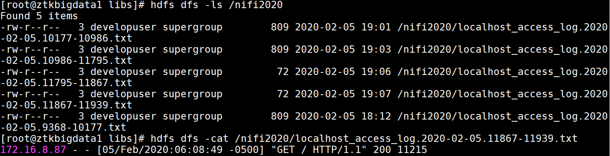

  * 通过以下命令，查看kafka topic接收的数据。

    ```
    kafka-console-consumer.sh --topic testtopic -bootstrap-server 172.16.11.21:21007,172.16.11.22:21007,172.16.11.23:21007 --consumer.config /opt/hadoopclient/Kafka/kafka/config/consumer.properties
    ```

    结果如下图，说明Nifi已将相关日志实时发送到Kafka Topic中。

    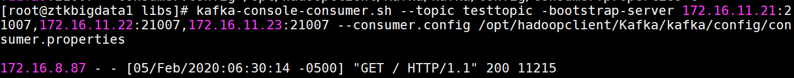

## 场景二: 医疗行业HL7格式数据集成

### 场景介绍

  * 本场景演示将HL7格式数据通过NiFi转换成json格式，并存储到hdfs以及kafka中，用于日志归档、批处理以及流式数据处理。

  * 整体场景如下图：

    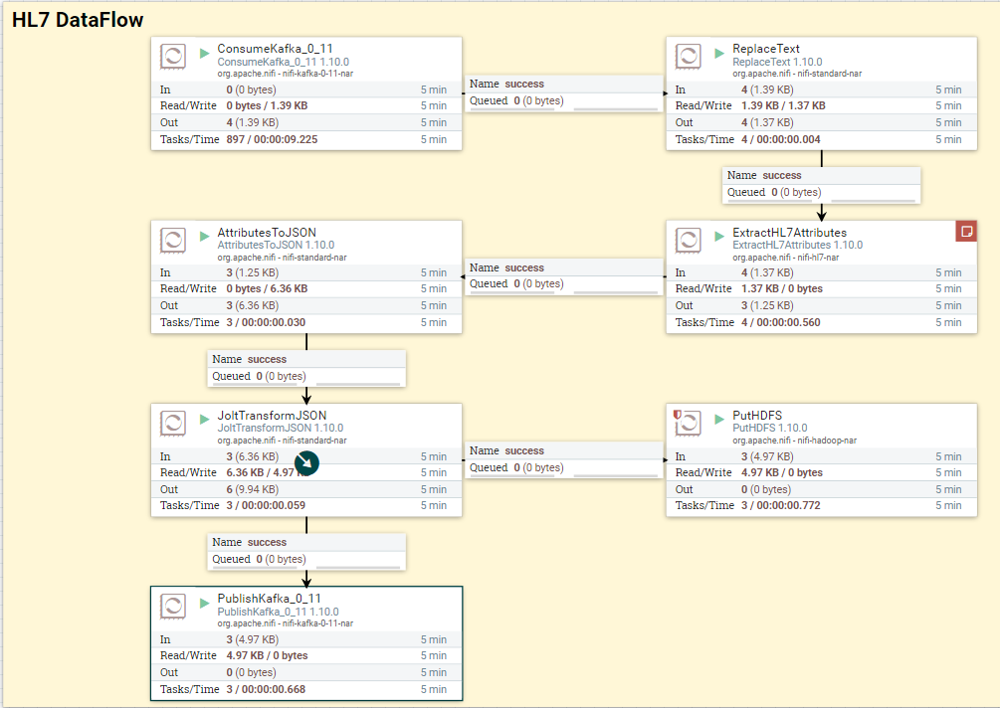

    首先模拟HL7格式测试数据，将测试数据发布到Kafka中，NiFi通过consumeKafka processor接收测试数据，并通过ExtractHL7Attributes processor解析相关属性，并利用NiFi内置算子，将接收的kafka将数据最终转换成json格式，并存储到FusionInsight HDFS中，同时将Json格式的数据发往Kafka进行流式数据处理。

### 数据流准备

  * 创建kafka topic。

    在hadoop client机器上执行以下命令，创建topic

    ```
    kafka-topics.sh --create --zookeeper 172.16.11.21:24002/kafka --partitions 6 --replication-factor 2 --topic h7topic1;
    kafka-topics.sh --create --zookeeper 172.16.11.21:24002/kafka --partitions 6 --replication-factor 2 --topic h7topic2
    ```

  * NiFi数据流配置：

    ***ConsumeKafka*** 配置参考下图：

    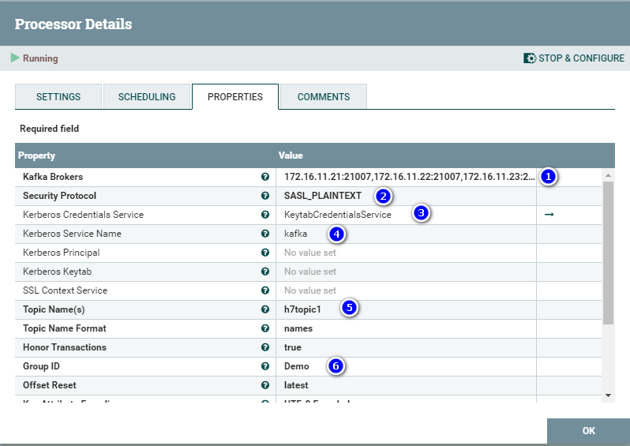

    ```
    Kafka Brokers: 172.16.11.21:21007,172.16.11.22:21007,172.16.11.23:21007
    Security Protocol: SASL_PLAINTEXT
    Kerberos Credentials Service: KeytabCredentialsService
    Kerberos Service Name: kafka
    Topic Name: h7topic1 #之前创建的kafka topic名称
    Group ID: Demo #可自定义
    ```

    ***ReplcaeText*** 配置参考下图：

    

    ```
    Search Value: <cr>
    Replacement Value: ${literal('\r\n')}
    ```

    ***ExtractHL7Attributes*** 配置参考下图：

    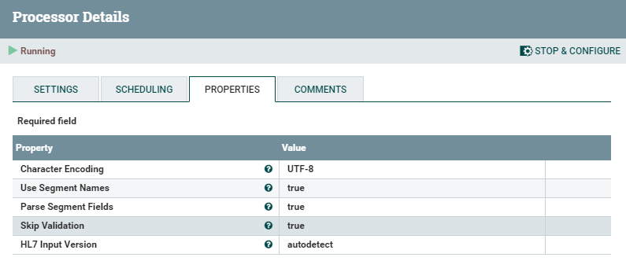

    ***AttributeToJson*** 配置参考下图：

    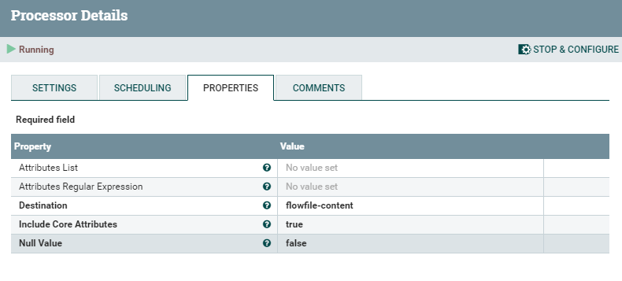

    ***JoltTransformJson*** 配置参考下图：

    

    ```
    Jolt Specification:
    {
    	"OBX_1.UserDefinedAccessChecks": "OBX_1.UserDefinedAccessChecks",
    	"OBR_1.OrderingProvider.FamilyName": "OBR_1.OrderingProvider.FamilyName",
    	"MSH.MessageControlID": "MSH.MessageControlID",
    	"OBX_1.ObservationIdentifier.Text": "OBX_1.ObservationIdentifier.Text",
    	"MSH.SendingApplication.NamespaceID": "MSH.SendingApplication.NamespaceID",
    	"OBR_1.UniversalServiceIdentifier.Text": "OBR_1.UniversalServiceIdentifier.Text",
    	"MSH.ReceivingApplication.NamespaceID": "MSH.ReceivingApplication.NamespaceID",
    	"MSH.ProcessingID.ProcessingID": "MSH.ProcessingID.ProcessingID",
    	"uuid": "uuid",
    	"PID.SSNNumberPatient": "PID.SSNNumberPatient",
    	"OBR_1.FillerOrderNumber.EntityIdentifier": "OBR_1.FillerOrderNumber.EntityIdentifier",
    	"path": "path",
    	"PID.PatientAccountNumber.ID": "PID.PatientAccountNumber.ID",
    	"PID.DateOfBirth": "PID.DateOfBirth",
    	"PD1.PatientPrimaryCareProviderNameIDNo.IDNumber": "PD1.PatientPrimaryCareProviderNameIDNo.IDNumber",
    	"PID.Sex": "PID.Sex",
    	"MSH.MessageType.MessageType": "MSH.MessageType.MessageType",
    	"OBX_1.ReferencesRange": "OBX_1.ReferencesRange",
    	"OBR_1.OrderingProvider.IDNumber": "OBR_1.OrderingProvider.IDNumber",
    	"PD1.PatientPrimaryCareProviderNameIDNo.FamilyName": "PD1.PatientPrimaryCareProviderNameIDNo.FamilyName",
    	"OBX_1.Units.NameOfCodingSystem": "OBX_1.Units.NameOfCodingSystem",
    	"OBX_1.Units.Identifier": "OBX_1.Units.Identifier",
    	"filename": "filename",
    	"PID.PatientName.GivenName": "PID.PatientName.GivenName",
    	"OBX_1.ObservationSubID": "OBX_1.ObservationSubID",
    	"PD1.PatientPrimaryCareProviderNameIDNo.GivenName": "PD1.PatientPrimaryCareProviderNameIDNo.GivenName",
    	"OBR_1.PlacerOrderNumber.NamespaceID": "OBR_1.PlacerOrderNumber.NamespaceID",
    	"MSH.MessageType.TriggerEvent": "MSH.MessageType.TriggerEvent",
    	"PD1.PatientPrimaryCareProviderNameIDNo.AssigningAuthority": "PD1.PatientPrimaryCareProviderNameIDNo.AssigningAuthority",
    	"OBR_1.ResultStatus": "OBR_1.ResultStatus",
    	"PID.PatientName.FamilyName": "PID.PatientName.FamilyName",
    	"MSH.EncodingCharacters": "MSH.EncodingCharacters",
    	"MSH.VersionID": "MSH.VersionID",
    	"kafka.partition": "kafka.partition",
    	"OBR_1.UniversalServiceIdentifier.Identifier": "OBR_1.UniversalServiceIdentifier.Identifier",
    	"OBR_1.ObservationDateTime": "OBR_1.ObservationDateTime",
    	"OBR_1.ScheduledDateTime": "OBR_1.ScheduledDateTime",
    	"OBX_1.ObservationIdentifier.Identifier": "OBX_1.ObservationIdentifier.Identifier",
    	"OBR_1.OrderingProvider.GivenName": "OBR_1.OrderingProvider.GivenName",
    	"OBR_1.SetIDObservationRequest": "OBR_1.SetIDObservationRequest",
    	"OBR_1.ResultsRptStatusChngDateTime": "OBR_1.ResultsRptStatusChngDateTime",
    	"OBR_1.PlacerOrderNumber.EntityIdentifier": "OBR_1.PlacerOrderNumber.EntityIdentifier",
    	"OBX_1.NatureOfAbnormalTest": "OBX_1.NatureOfAbnormalTest",
    	"OBX_1.SetIDOBX": "OBX_1.SetIDOBX",
    	"MSH.FieldSeparator": "MSH.FieldSeparator",
    	"PD1.PatientPrimaryCareProviderNameIDNo.MiddleInitialOrName": "PD1.PatientPrimaryCareProviderNameIDNo.MiddleInitialOrName",
    	"OBX_1.Units.Text": "OBX_1.Units.Text",
    	"OBX_1.ValueType": "OBX_1.ValueType",
    	"kafka.offset": "kafka.offset",
    	"PID.PatientIDInternalID.ID": "PID.PatientIDInternalID.ID",
    	"kafka.topic": "kafka.topic",
    	"OBX_1.ObservationValue": "OBX_1.ObservationValue",
    	"OBR_1.OrderingProvider.MiddleInitialOrName": "OBR_1.OrderingProvider.MiddleInitialOrName"
    }

    ```

    ***PutHDFS*** 参考配置如下图：

    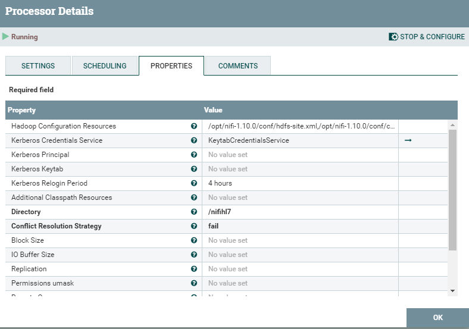

    ```
    hadooop Configuration Resource: /opt/nifi-1.10.0/hdfs-site.xml,/opt/nifi-1.10.0/conf/core-site.xml
    Kerberos Credentials Service: KeytabCredentialsService
    Directory: /nifihl7 #s可自定义
    ```

    ***PublishKafka*** 参考配置如下图：

    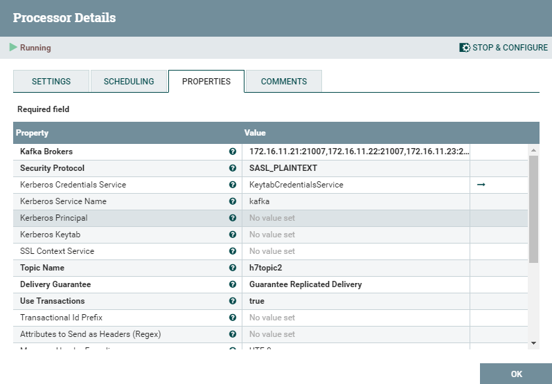

    ```
    Kafka Brokers: 172.16.11.21:21007,172.16.11.22:21007,172.16.11.23:21007
    Security Protocol: SASL_PLAINTEXT
    Kerberos Credentials Service: KeytabCredentialsService
    Kerberos Service Name: kafka
    Topic Name: h7topic2 #之前创建的kafka topic名称
    ```

### 数据测试

  * 开启两个hadoop client命令行窗口，在窗口一中执行以下命令：

    ```
    bin/kafka-console-producer.sh --broker-list 172.16.11.21:21007,172.16.11.22:21007,172.16.11.23:21007 --topic h7topic1 --producer.config config/producer.properties
    ```

    在窗口二中执行以下命令：

    ```
     kafka-console-consumer.sh --topic h7topic2 -bootstrap-server 172.16.11.21:21007,172.16.11.22:21007,172.16.11.23:21007 --consumer.config /opt/hadoopclient/Kafka/kafka/config/consumer.properties
    ```

    在窗口一中粘贴以下数据,该数据为模拟的HL7数据格式。

    ```
    MSH|^~\&|XXXXXX||HealthOrg01||||ORU^R01|Q1111111111111111111|P|2.3|<cr>PID|||000000001||SMITH^JOHN||19700101|M||||||||||999999999999|123456789|<cr>PD1||||1234567890^LAST^FIRST^M^^^^^NPI|<cr>OBR|1|341856649^HNAM_ORDERID|000000000000000000|648088^Basic Metabolic Panel|||20150101000100|||||||||1620^Johnson^John^R||||||20150101000100|||M|||||||||||20150101000100|<cr>OBX|1|NM|GLU^Glucose Lvl|159|mg/dL|65-99^65^99|H|||F|||20150101000100|

    ```

    如下图：

    

    在窗口二中查看结果，发现已经读取到转换成json格式的数据，数据加载到kafka中成功，可以用于后续的流式数据处理，如flink等。

    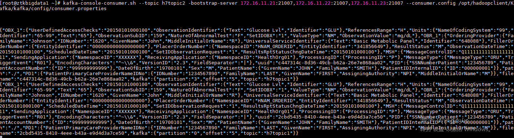

    查看在 hdfs 中存储的文件，如下图，已经查询到对应的文件，该数据可以做为原始数据归档，以及批量数据分析。

    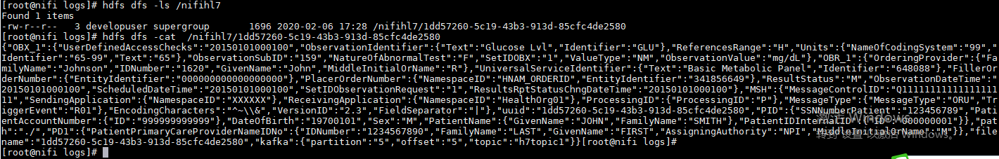


## 场景三：IOT场景实现MQTT数据集成到Kafka和hdfs

### 场景介绍

  * 本场景模拟NiFi接收IOT MQTT格式数据，并存储到hdfs以及kafka中，用于后续的流式处理和数据归档。

  * 场景示意图如下：

    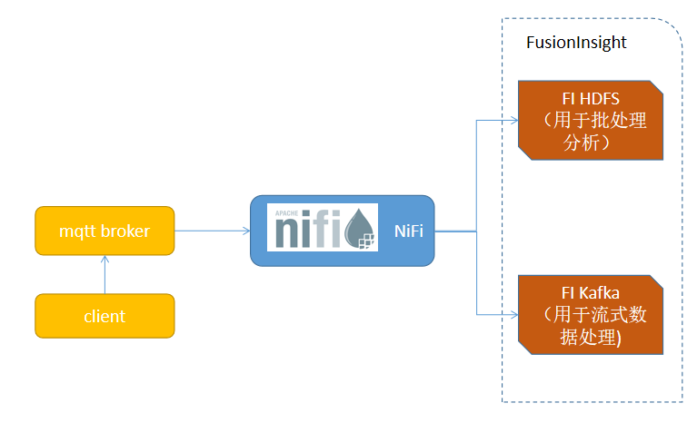

### 环境准备

  * 本场景通过在Linux Centos上安装mosquitto模拟IOT broker，通过IoT Broker将数据转发到NiFi，用于后续将数据存储到HDFS或者kafka，用于归档、批处理或者流式计算。

  * 通过以下命令，在centos服务器上安装mqtt:

    ```
    yum -y install eple-release
    yum -y install mosquitto
    systemctl start mosquitto
    systemctl enable mosquitto
    yum install python-pip
    pip install paho-mqtt
    useradd huawei
    mosquitto_passwd -c /etc/mosquitto/passwd huawei
    ```

  * 修改配置文件/etc/mosquitto/mosquitto.conf，禁用MQTT匿名登录。

    ```
    allow_anonymous false
    password_file /etc/mosuitto/passwd
    ```

  * 执行以下命令重启mosquitto服务

    ```
    systemctl restart mosquitto
    ````

  * 在hadoop client上执行以下命令，创建kafka topic

    ```
    kafka-topics.sh --create --zookeeper 172.16.11.21:24002/kafka --partitions 6 --replication-factor 2 --topic mqtttopic
    ```

### 数据流准备

  * 创建如下NiFI数据流，如下图：

    

    ***ConsumeMQTT*** Processor参考配置如下图：

    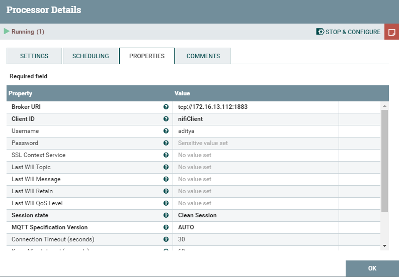

    ***PutHdfs*** Processor参考配置如下图：

    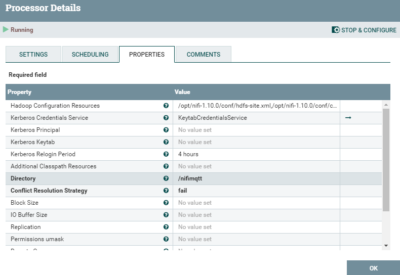


    ```
    hadooop Configuration Resource: /opt/nifi-1.10.0/hdfs-site.xml,/opt/nifi-1.10.0/conf/core-site.xml
    Kerberos Credentials Service: KeytabCredentialsService
    Directory: /nifimqtt
    ```

    ***PublishKafka*** Processor参考配置如下：

    

    ```
    Kafka Brokers: 172.16.11.21:21007,172.16.11.22:21007,172.16.11.23:21007
    Security Protocol: SASL_PLAINTEXT
    Kerberos Credentials Service: KeytabCredentialsService
    Kerberos Service Name: kafka
    Topic Name: mqtttopic #之前创建的kafka topic名称
    ```

### 数据验证

  * 在hadoop client中执行以下命令，监听kafka topic的输出。

    ```
     kafka-console-consumer.sh --topic testtopic -bootstrap-server 172.16.11.21:21007,172.16.11.22:21007,172.16.11.23:21007 --consumer.config /opt/hadoopclient/Kafka/kafka/config/consumer.properties
    ```

  * 在mqqtt客户端，创建mqttpublish.py文件，内容如下：

    ```
    import paho.mqtt.publish as publish
    import time

    auth = {
            'username': 'huawei',
            'password': 'huawei'
    }

    for i in range(10):
            publish.single('test', payload='Test message %d' % i, auth=auth, hostname='172.16.13.112',port=1883)
            time.sleep(1)

    ```

  * 执行以下命令，发送消息到MQtt Brokers

    ```
    python mqttpublish.py
    ```

  * 查看kafka consumer显示的输出结果，如下图：

    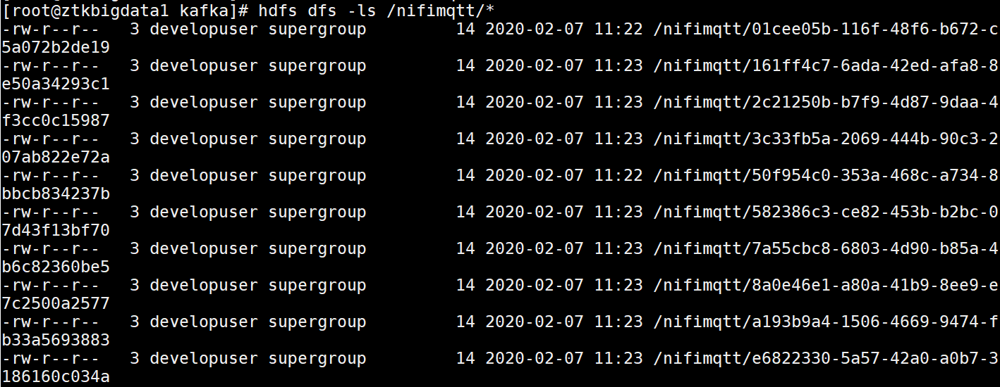

  * 查看hdfs文件

    

  * mqtt数据已成功同步到kafka和hdfs，验证完成。


## 问题记录

###  提示找不到lzc.ZCodec类

  * Failed to write to HDFS due to java.lang.IllegalArgumentException: Compression codec com.huawei.hadoop.datasight.io.compress.lzc.ZCodec not found.: java.lang.IllegalArgumentException: Compression codec com.huawei.hadoop.datasight.io.compress.lzc.ZCodec not found.


    


    ```
    <property>
    <name>io.compression.codec.lzc.class</name>
    <value>com.huawei.hadoop.datasight.io.compress.lzc.ZCodec</value>
    </property>

    ```

    ```
    <property>
    <name>io.compression.codecs</name>
    <value>org.apache.hadoop.io.compress.BZip2Codec,org.apache.hadoop.io.compress.DefaultCodec,org.apache.hadoop.io.compress.DeflateCodec,org.apache.hadoop.io.compress.Lz4Codec,org.apache.hadoop.io.compress.SnappyCodec,org.apache.hadoop.io.compress.GzipCodec,org.apache.hadoop.io.compress.ZStandardCodec,com.huawei.hadoop.datasight.io.compress.lzc.ZCodec</value>
    </property>

    ```
    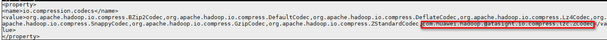


## 提示认证失败

   验证是否需要替换zookeeper版本，理论上来说是需要替换的。
