#  FusionInsight集成ROMA实践

## ROMA介绍

### ROMA简介

  * ROMA是多云时代的融合集成平台，源自华为10+年数字化转型实践，聚焦A（Application）、B（Business）、C（Cloud）、D（Device）四类集成场景，提供快速、简单的消息、数据、服务、设备集成能力，简化企业上云，支持云上云下、跨区域集成，打通IT与OT，连接企业与生态伙伴，助力行业数字化转型。

    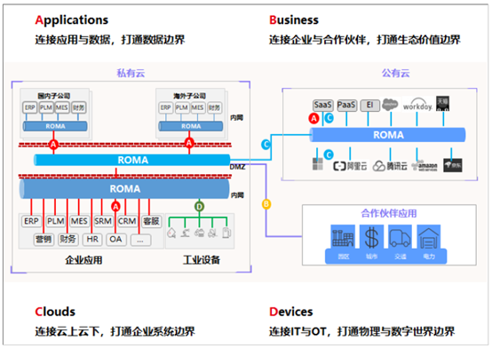

  * ROMA致力于解决行业在向数字化转型的过程中面临的难题：

    1. 缺少统一的设备信息集成途径；

    2. 数据格式多样化，难以传输和集成；

    3. 缺少与合作伙伴分享数据和后端服务的便捷途径；

    4. 缺少云上云下跨网络的安全信息通道。

### ROMA定位

  * ROMA定位为便捷的集成平台，提供数据接入、数据集成以及数据服务API构建的能力。ROMA不是传统的ETL工具，提供相比ETL工具更为丰富的数据源支持类型以及更为丰富的功能。ROMA不是大数据平台，ROMA支持将来自不同系统的多种类型及格式的数据同步到FusionInsight，实现IT和OT数据汇聚，经过FusionInsight数据分析后的数据导入到数据集市，ROMA通过APIC LiveData 对外提供Restful的数据服务接口。

    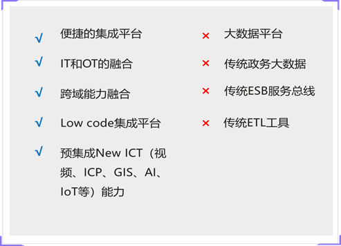

### ROMA组件及功能介绍

  * ROMA 主要由四大组件组成：

    1. FDI: 旨在解决多种数据源的快速灵活集成能力，实现任意时间、任意地点、任意系统之间实现实时数据订阅和定时增量数据迁移。FDI是FusionInsight数据集成使用的最主要的功能组件，通过FDI实现多种数据源实时或者增量同步到数据湖。


    2. LINK:设备集成服务，使用MQTT标准协议连接设备，实现设备快速接入、数据采集等物联网应用。用户可以在控制台配置规则引擎，实现设备将Topic级别的消息转发到不同的服务中，如消息队列服务（MQS）和FI KAFKA等。同时支持配置使用类SQL的规则语言对转发的消息进行处理和筛选，满足不同业务对转发数据内容的要求，实现业务逻辑与应用程序的低耦合。

    3. 服务集成：API集成服务实现API开发编排，支持函数API以及数据API，支持通过编写SQL脚本的方式，将数据库提供的数据服务转换为REST API的能力。

    4. MQS消息集成服务：提供了消息管理能力

### ROMA FDI支持的数据源

  * ROMA FDI支持的数据源如下：

    


## ROMA安装配置

### 版本配套关系

  * FusionInsight 6.5.1配套的ROMA版本为 ROMA 20.0.RC1

### 安装指导文档

  * 参考以下链接访问ROMA产品文档：[点击访问 ](https://support.huawei.com/hedex/hdx.do?docid=EDOC1100117349&lang=zh)

### 安装规划

  * 安装规划可参考ROMA文档章节：“安装与调测”->“软件安装”->“安装概述”->”安装规划”。ROMA安装部署有3种组网模式，区别和选用建议如下：

| 部署模式       | 部署方案描述                                                                                                                    | 选用建议                             |
|:---------------|:--------------------------------------------------------------------------------------------------------------------------------|:-------------------------------------|
| 8VM基础组网    | 最小基础部署模式，包含Foundation、APIC、FDI、MQS、统一运维等基础能力，FDI-READER和FDI-WRITER采用单机部署。                      | 适用于测试环境                       |
| 13VM高可靠组网 | 相比基础组网，FDI-READER和FDI-WRITER各使用2台VM进行集群部署模式，提供负载均衡能力，支持更高的数据访问能力。注：不包括Link组件。 | 适用于不需要Link组件的生产环境       |
| 20VM高可靠组网 | 相比13VM高可靠组网模式，增加了7个节点用于部署LINK服务                                                                           | 需要使用LINK组件的生立环境选用该方案 |


### 安装注意事项

  * 参考ROMA产品文档 **安装调测** 章节进行安装。

  * **安装注意事项：** ROMA产品文档 **安装调测**-> **软件安装** -> **安装ROMA** 章节步骤 **12** 中，提供了配置FusionInsight 6.5.1 依赖包的指导。FI Hive、FI HDFS及FI Kafka 需要的依赖包见ROMA安装文档 **安装与调测** -> **软件安装** ->**安装前准备**->**获取软件包**。

  * 其中fihdfsreader/fihdfswriter依赖的FusionInsight HD 6.5.1 清单如下,相比ROMA产品文档 中涉及新增部分见斜体内容：

    *	commons-collections-3.2.2.jar
    *	commons-configuration2-2.1.1.jar
  	* hadoop-auth-3.1.1.jar
    * hadoop-common-3.1.1.jar
    * hadoop-hdfs-3.1.1.jar
    * hadoop-hdfs-client-3.1.1.jar
    * hadoop-hdfs-httpfs-3.1.1.jar
    *	htrace-core4-4.1.0-incubating.jar
    *	protobuf-java-2.5.0.jar
    *	re2j-1.1.jar
    *	stax2-api-3.1.4.jar
    *	woodstox-core-5.0.3.jar
    *	***zookeeper-3.5.1.jar***
    *	***hadoop-mapreduce-client-core-3.1.1.jar***

  * fihivereader/fihiverwriter依赖的FusionInsight HD 6.5.1 清单如下,相比ROMA产品文档 中涉及新增部分见斜体内容：

    * commons-configuration2-2.1.1.jar
    * hadoop-auth-3.1.1.jar
    * hadoop-common-3.1.1.jar
    * hadoop-hdfs-3.1.1.jar
    * hadoop-hdfs-client-3.1.1.jar
    * hadoop-hdfs-httpfs-3.1.1.jar
    * hive-common-3.1.0.jar
    * hive-jdbc-3.1.0.jar
    * hive-metastore-3.1.0.jar
    * hive-serde-3.1.0.jar
    * hive-service-3.1.0.jar
    * hive-service-rpc-3.1.0.jar
    * hive-shims-common-3.1.0.jar
    * hive-standalone-metastore-3.1.0.jar
    * htrace-core4-4.1.0-incubating.jar
    * protobuf-java-2.5.0.jar
    * re2j-1.1.jar
    * stax2-api-3.1.4.jar
    * woodstox-core-5.0.3.jar
    * commons-collections-3.2.2.jar
    * ***hive-exec-3.1.0.jar***
    * ***zookeeper-3.5.1.jar***
    * ***commons-collections-3.2.2.jar***
    * ***hadoop-mapreduce-client-core-3.1.1.jar***

    对应jar包在FusionInsight 6.5.1中的位置如下表：

| jar文件名                              | 获取路径                                                                            |
|:---------------------------------------|:------------------------------------------------------------------------------------|
| hive-exec-3.1.0.jar                    | /opt/hadoopclient/Hive/Beeline/lib/hive-exec-3.1.0.jar                              |
| zookeeper-3.5.1.jar                    | /opt/hadoopclient/ZooKeeper/zookeeper/zookeeper-3.5.1.jar                           |
| commons-collections-3.2.2.jar          | /opt/hadoopclient/HDFS/hadoop/share/hadoop/common/lib/commons-collections-3.2.2.jar |
| hadoop-mapreduce-client-core-3.1.1.jar | /opt/hadoopclient/Hive/Beeline/lib/hadoop-mapreduce-client-core-3.1.1.jar           |

  * 替换FusionInsight使用的guava版本,从guava 28替换成guava 26版本.

    * guava 26版本下载地址：[点击下载](
https://github.com/google/guava/releases/download/v26.0/guava-26.0-jre.jar),下载后放到VM5 fihivereader/fihdfsreader/fikafkareader以及VM6 fihivewriter/fihdfswriter/fikafkawriter目录下，删除原guava-28 jar包。

    * 修改guava-26.0-jre.jar的所有者及权限：

      ```
      chown romafdi:users guava-26.0-jre.jar
      chmod 755 guava-26.0-jre.jar
      ```

    * 重启fi reader/writer服务使jar包替换生效，以下为替换hivewriter guava版本后重启服务的命令，重启hdfs/hive/kafa的reader和writer的命令类似，替换 *tomcat-fihivewriter* 为对应路径即可。

      ```
      su - romafdi
      cd /data01/fdi/tomcat-fihivewriter/bin
      sh catalina.sh stop;sh catalina.sh star
      ```

## ROMA对接FusionInsight配置指导

### ROMA FDI对接HIVE

  * ROMA FDI添加HIVE数据源参数说明

    <style> table th:first-of-type{width:100px;}</style>
    | 参数名称 | 配置参考     |
    | :------------- | :------------- |
      | 应用名称       | 下拉选项中选择用户的应用名。<br>说明： 若没有应用名可以关联，则在ROMA Portal菜单栏，选择“当前应用名 > 应用注册”，注册用户的应 用名。
       |数据源名称|用户自定义。例如“roma_fihive_test”。数据源添加成功后，在创建集成任务时，可以在下拉选项中自动关联到数据源名称。|
       数据源类型|	数据库的类型，选择“FI Hive”。|
       地区 |	数据库所在的地域，例如“shenzhen”。|
       HDFS目录|	临时HDFS文件存放路径。<br>例如“/user/ico_ipass/”。|
       FI HD用户名 |	用户认证名称。例如“ioc_ipass”。
       | 版本号 |	FI HD的版本号。例如“FI HD V100R002C80U20”。|
       上传配置文件	| 包含用户认证文件（krb5.conf、user.keytab）、Hive客户端配置文件（fihiveclient.properties）和HDFS客户端配置文件（core-site.xml、hdfs-site.xml）。将5个文件一起直接压缩成ZIP包，例如“FIHive_dqf_ioc_ipass.zip”。<br> 用户认证文件的下载方法： <br>       <ol>         <li> 登录FusionInsight Manager。 </li><li> 单击“系统设置”，进入系统设置页面。<li> 选择“系统设置 > 配置 > 权限配置 > 用户管理”。<li> 在对应用户的最右侧“操作”列，单击下载用户凭据</ol> <br> Hive、HDFS客户端配置文件的下载方法：        <ol>        <li> 登录FusionInsight Manager。        <li> 单击“服务管理”，进入服务页面。        <li> 单击需要的FI服务，进入“服务 > Hive 服务状态”页面。        <li> 单击“下载客户端”，进入“下载客户端”页面。        <li> 设置“客户端类型”为“仅配置文件”。        <li> 单击“确定”。        </ol><br>        从Fi Hive下载文件中获取到hiveclient.properties文件，并改文件名为fihiveclient.properties。从HDFS下载文件中获取core-site.xml、hdfs-site.xml文件。|

       * 参考配置如下图：

          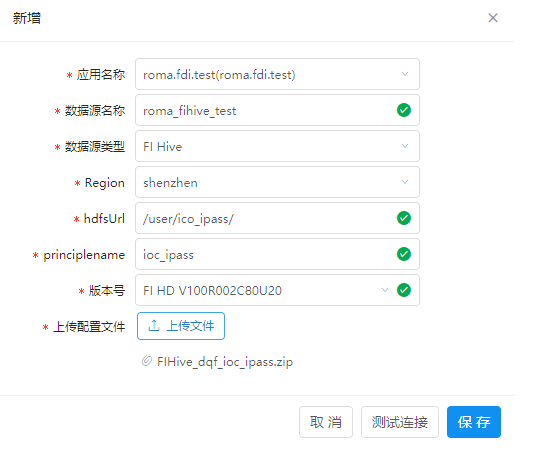

### ROMA FDI对接HDFS


| 参数名称                      | 配置参考                                                                                                                                                                      |
|:------------------------------|:------------------------------------------------------------------------------------------------------------------------------------------------------------------------------|
| 应用名称                      | 下拉选项中选择用户的应用名。 若没有应用名可以关联，则在ROMA Portal菜单栏，选择“当前应用名 > 应用注册”，注册用户的应用名。                                                     |
| 数据源名称                    | 用户自定义。例如“roma_fihdfs_test”。<br>数据源添加成功后，在创建集成任务时，可以在下拉选项中自动关联到数据源名称。                                                            |
| 数据源类型                    | 数据库的类型，选择“FIHDFS”。                                                                                                                                                  |
| Region                        | 数据库所在的地域，例如“shenzhen”                                                                                                                                              |
| hdfsUrl	临时HDFS文件存放路径。 | 例如“/user/ico_ipass/”。                                                                                                                                                      |
| principlename                 | 用户认证名称。例如“eip_fdi_hdfs”。                                                                                                                                            |
| 版本号                        | FI HD的版本号。例如“FI HD V100R002C80U20”,注:由于后端实际使用的是FI 6.5.1 jar文件,选择该版本可以支持对接FI 6.5.1                                                              |
| 上传配置文件                  | 包含用户认证文件（krb5.conf、user.keytab）和HDFS客户端配置文件（core-site.xml、hdfs-site.xml）。将4个文件一起直接压缩成ZIP包，例如“eip_fdi_hdfs.zip”。获取方法和FI Hive类似。 |

  * 配置参考下图：

    

### ROMA FDI对接KAFKA

| 参数名称     | 如何配置                                                                                                                                                                                                                                                                                                                                                                                                                                                                                          |            |                                |
|:-------------|:--------------------------------------------------------------------------------------------------------------------------------------------------------------------------------------------------------------------------------------------------------------------------------------------------------------------------------------------------------------------------------------------------------------------------------------------------------------------------------------------------|:-----------|:-------------------------------|
| 应用名称     | 下拉选项中选择用户的应用名。<br> 说明： 若没有应用名可以关联，则在ROMA Portal菜单栏，选择“当前应用名 > 应用注册”，注册用户的应用名。                                                                                                                                                                                                                                                                                                                                                              |            |                                |
| 数据源名称   | 用户自定义。例如“roma_fikafka_test”。<br>数据源添加成功后，在创建集成任务时，可以在下拉选项中自动关联到数据源名称。                                                                                                                                                                                                                                                                                                                                                                               | 数据源类型 | 数据库的类型，选择“FI Kafka”。 |
| Region       | 数据库所在的地域，例如“shenzhen”。                                                                                                                                                                                                                                                                                                                                                                                                                                                                |            |                                |
| 证书名称     | 访问Kafka服务器的证书名（即访问kafka机器的机机用户名）。例如“ioc”。                                                                                                                                                                                                                                                                                                                                                                                                                               |            |                                |
| --------     | -------------------------------------------------------------------                                                                                                                                                                                                                                                                                                                                                                                                                               |            |                                |
| 上传配置文件 | 包含用户认证文件（krb5.conf、user.keytab）和客户端配置文件（fikafka-producer.properties、fikafka-consumer.properties）。例如“FIKafka_ioc.zip”。获取方法和FI Hive类似，下载后需解压配置文件，重命名producer.properties、consumer.properties 为fikafka-producer.properties、fikafka-consumer.properties,从“fikafka-producer.properties”文件中拷贝如下内容到“fikafka-consumer.properties”文件中：bootstrap.servers = 192.168.1.178:21007,192.168.1.125:21007,192.168.1.243:21007,192.168.1.133:21007 |            |                                |


## ROMA 对接FusionInsight HDFS、Hive及Kafka示例场景

### 示例场景说明

  * 示例目的

    通过端到端的功能示例，让用户了解ROMA的主要功能及使用场景。主要示例以下几方面的能力：

    1. ROMA支持IOT接入的能力：LINK组件支持接入MQTT协议设备。

    2. ROMA支持多种数据源接入到 FusionInsight HIVE/HDFS, 包括API、IOT、MQS、jdbc等。

    3. 通过ROMA LiveData API服务，示例快速开放数据服务接口能力。

    4. 通过不同应用间的数据汇聚到数据湖，示例ROMA跨系统集成的能力。     

    5. ROMA FDI编排服务提供轻量级的自定义数据转换的能力。

  * 示例场景

    示例场景模拟了用电管理系统和客户关系管理系统，通过ROMA分别获取客户关系管理系统中的用户信息和用电管理系统中的电表信息并写入到HIVE中，经过Hive分析后，将数据导入到gauss数据库，并以REST API接口方式提供用电数据查询服务。

    主要步骤：

    1. 通过模拟电表（MQTT协议 IOT设备），被Link接管并通过ROMA MQS 消息服务实时发送消息，消息数据通过ROMA FDI转换写入到 HIVE表中。在插入HIVE前，通过FDI编排插件增加用电数据上报时间。

    2. 构造txt文件格式的电表历史数据并通过FDI导入HIVE中。

    3. 构造开放客户关系管理系统中的Mysql 数据为REST API，通过FDI导入Hive中。

    4. 在Hive表中进行分析以后，将数据存入GaussDB。

    5. 通过ROMA LiveData ，开放数据查询Restful API。

### 示例准备过程

#### 测试数据准备

  *　模拟客户关系管理数据库中的客户信息。准备一台mysql服务器，创建customer_info表，包括用户ID，用户姓名，用户家庭住址，用户电表设备ID。

    ```
    create database roma_customer;
    use roma_customer;
    create table customer_info(id int primary key auto_increment, user_name varchar(20), address varchar(50), device_id varchar(10));
    insert into customer_info(user_name,address,device_id) values('matt','dongguan b4','meter02');
    insert into customer_info(user_name,address,device_id) values('justin','shenzhen e1','meter02');
    insert into customer_info(user_name,address,device_id) values('haoxi','chengdu u9','meter03');
    ```

  * 在支持sftp的linux服务器上准备电表数据，以txt文件格式存放，各列数据通过分号 **;** 分隔，主要包括设备ID字段，数据采集日期，采集值。

    ```
    mkdir /elechistorydata
    vi /elechistorydata/history.txt
    插入以下内容：
    meter01;20190101;101
    meter01;20190115;115
    meter01;20190130;130
    meter01;20190201;201
    meter01;20190215;215
    meter01;20190229;229
    meter01;20190301;301
    meter01;20190315;315
    meter01;20190330;330
    meter01;20190401;401
    meter01;20190415;415
    meter01;20190430;430
    meter02;20190101;101
    meter02;20190115;115
    meter02;20190130;130
    meter02;20190201;201
    meter02;20190215;215
    meter02;20190228;229
    meter02;20190301;301
    meter02;20190315;315
    meter02;20190330;330
    meter02;20190401;401
    meter02;20190415;415
    meter02;20190430;430
    meter03;20190101;101
    meter03;20190115;115
    meter03;20190130;130
    meter03;20190201;201
    meter03;20190215;215
    meter03;20190229;229
    meter03;20190301;301
    meter03;20190315;315
    meter03;20190330;330
    meter03;20190401;401
    meter03;20190415;415
    meter03;20190430;430
    ```

  * 创建hive table用以存放电表上报数据。

    ```
    create database elect;
    use elect;
    create table elect_table(device_id string,upload_date date, elect_value int);
    ```

  * 创建当月测试数据，在FI 客户端上执行以下命令:

    ```
    beeline -e "insert into elect.elect_table values('meter01',date_sub(current_date,dayofmonth(current_date)-1),500)";
    beeline -e "insert into elect.elect_table values('meter02',date_sub(current_date,dayofmonth(current_date)-1),500)";
    beeline -e "insert into elect.elect_table values('meter03',date_sub(current_date,dayofmonth(current_date)-1),500)";
    ```

  * 创建hive table用以存放客户信息

    ```
    use elect;
    create table customer_info(id int,user_name varchar(20),address varchar(20), device_id varchar(20));
    ```

### 发布客户关系管理系统中的数据为数据API服务

#### 注册应用

  * 点击左上角应用列表下拉条，点击 **应用注册**。

  * 在弹出页面输入应用注册信息,点击 ***提交*** 完成注册。分别注册CRMusers数据源和Electricity.name应用。

    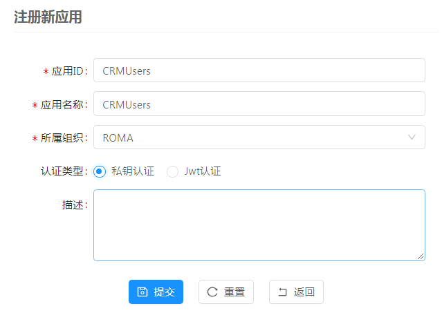

#### 创建LiveData数据源

  * 在ROMA左侧导航树选择“服务集成 > Live Data > 资源管理 > 数据源管理”。单击新建，创建数据源，参考配参考配置如下图：

    

    点击 **连接测试**，验证是否连通。验证成功后，点击 **提交**，完成数据源创建。

#### 创建/测试/部署/授权API

  * 在ROMA左侧导航树选择“服务集成 > Live Data > API设计”。单击“新建”，设置API基本信息。配置参考下图：

    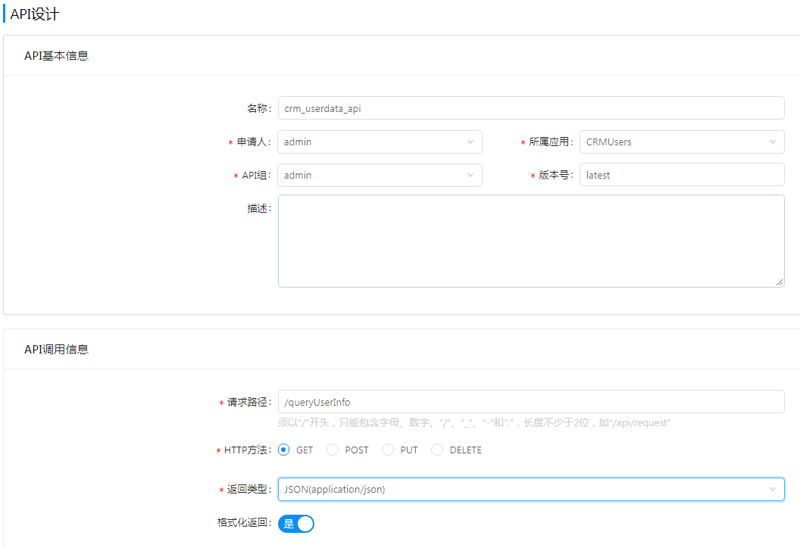

    配置完成后，点击提交，选择 **进入开发** 模式，选择 **数据开发**，选择 **数据API** 。

    数据源信息参考如下配置：

    

    点击提交，选择 **进入测试**，保持默认值，点击测试API，查看测试结果。

    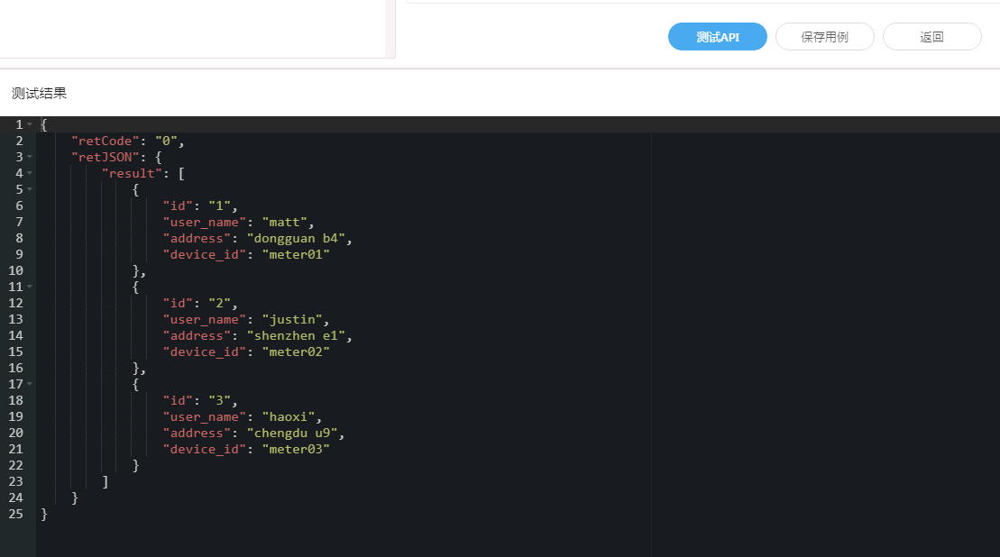

    在ROMA左侧导航树选择“服务集成 > Live Data > API部署”，选择对应API,右侧点击部署图标，保持默认配置，完成部署。


    在ROMA左侧导航树选择“服务集成 > API 网关 > API授权”。选择对应API,点击授权图标，授权给用电管理系统应用，如Electricity.name

    在ROMA左侧导航树选择“服务集成 > API 网关 > API测试”。在“data_api”API的最右侧“操作”列，单击调测图标，进入“API测试”页面。“请求路径”即API的对外发布地址。

    


### 集成API数据到 Hive表中。

#### 创建API数据源

  * 新增加API数据源，内容参考下图：

    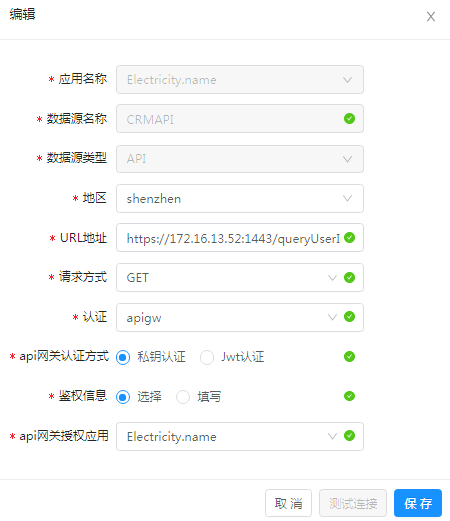

#### 创建API数据同步到hive的任务

  * 在左侧导航中，选择FDI **任务管理** -> **创建任务** ->**表单模式**，

  * 选择对应的API数据源和hivewriter，填入相关的参数信息：

    源端配置参考下图：

    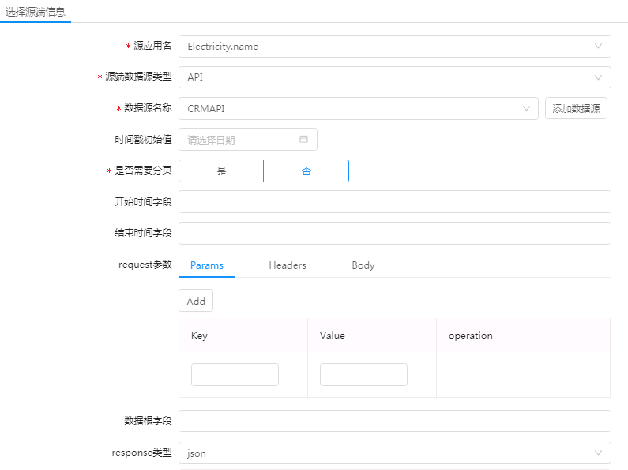

    其中涉及metaData格式转换的内容，可以参考以下内容：

    ```
    [{"name":"id","type":"integer","path":"retJSON.result[i].id","format":""},{"name":"user_name","type":"string","path":"retJSON.result[i]..user_name","format":""},{"name":"address","type":"string","path":"retJSON.result[i].address","format":""},{"name":"device_id","type":"string","path":"retJSON.result[i].device_id","format":""}]
    ```

    目标端配置信息参考下图：

    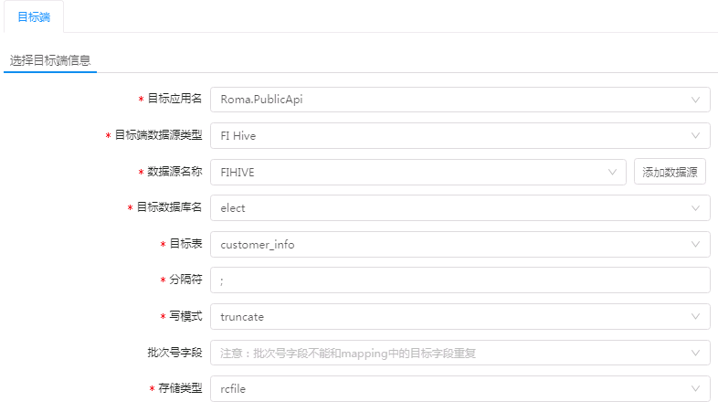

    映射关系如下：

    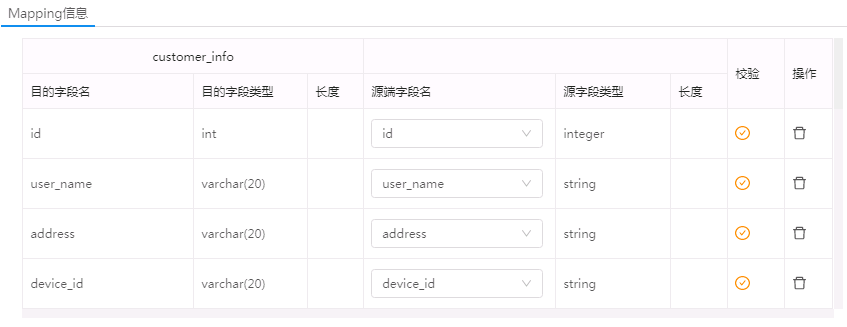

    配置成功后，点击保存，保存成功后，启动任务。查看任务详细，来自客户关系管理系统的数据已经通过API和FDI，实现数据同步到Hive表中。

    

### 使用FDI加载历史数据到hive表中

  * 完成添加HIVE和HDFS数据源后，在Roma FDI中创建任务，如果数据量较少可直接从ftp导入FI Hive，如果数据量较大，需要使用FusionInsight Loader或者toolkits工具将数据批量导入FI中。

  * 创建FTP数据源,可参考如下配置

    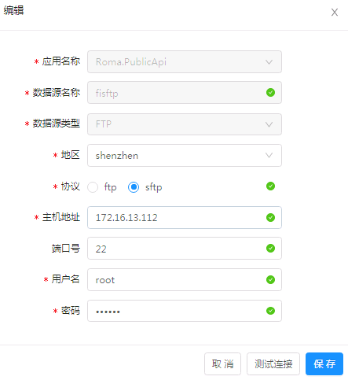

  * 创建迁移任务

    选择定时任务类型,源端配置参考如下:


    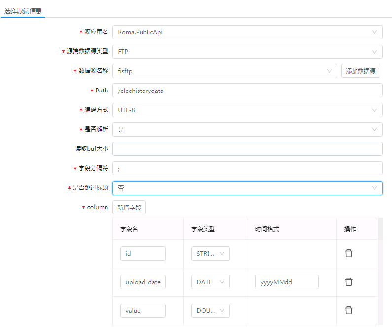

    目标端和映射配置参考下图,点击保存完成配置.

    

    任务列表中,点击手动调度,触发任务,查看任务执行结果.如下图，任务执行成功。将文本类型历史数据成功导入到 FI Hive中。

    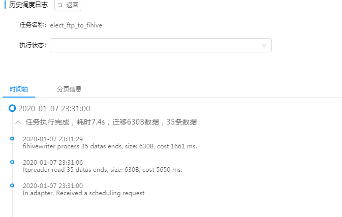


### 模拟IOT设备，将实时增量数据同步到FI HIVE表中

#### MQS创建TOPIC

  * 创建ROMA平台接收消息的Topic，并将Topic发布及订阅到应用中。

  * 创建Topic创建接收IOT平台消息的Topic。

  * 在ROMA Portal左侧导航树中，选择“消息集成 > 消息队列服务 MQS > Topic管理”。

  * 单击“创建Topic”，进入“新增Topic”页面,创建名称T_ElectricityMeter的Topic。

    ```
    Topic名称：T_ElectricityMeter
    所属应用：Electricity.name
    ```
  * 单击“保存”。

#### 发布Topic

  * 发布Topic至roma.link.test应用中。

    1. 在ROMA Portal左侧导航树中，选择“消息集成 > 消息队列服务 MQS > Topic管理”。

    2. 在“Topic名称”中输入“T_ElectricityMeter”，单击“查询”。

    3. 在Topic的“操作”列，单击“发布”，进入“发布”页面。配置发布信息，“发布应用”选择“Electricity.name”,

    4. 单击“发布”，页面提示“保存任务成功”。

#### 订阅应用

  * 订阅Topic至roma.link.test应用中。

    1. 在ROMA Portal左侧导航树中，选择“消息集成 > 消息队列服务 MQS > Topic管理”。

    2. 在“Topic名称”中输入“T_ElectricityMeter”，单击“查询”。

    3. 在Topic的“操作”列，单击“订阅”，进入“订阅”页面。

    4. 配置订阅信息，“订阅应用”选择“Electricity.name”

    5. 单击“保存”，页面提示“保存任务成功”。

#### LINK接入模拟设备

##### 添加应用实例

  * 每个部署在ROMA服务器的LINK Connector组件，均在ROMA Portal存在一个Connector实例，在创建设备时选择该实例，以使实体设备连接到该Connector。给Connector实例添加应用（可添加多个），该应用下的设备可以使用该Connector连接设备。

  1. 在ROMA Portal左侧导航树中，选择“设备集成 > 设备集成LINK > 系统管理 > 实例管理”。

  2. 在实例管理页面中查找到的对应实例的“操作”列，单击“查看实例应用”。在弹出的“实例应用管理”页面单击“添加实例应用”。选择可使用该Connector实例的应用，本例中选择Electricity.name应用。

##### 创建模型

  1. 在ROMA Portal左侧导航树中，选择选择“设备集成 > 设备集成LINK > 系统管理 > 模型管理”，进入界面。

  2. 单击“创建模型”按钮，界面弹出“创建模型”对话框。

  3. 填写模型信息，根据本模型内使用的产品、设备用途等自定义模型名称，例如Voltage。

  4. 填写完成后，单击“保存”，模型创建完成。

  5. 单击“模型详情”，新增一个名为status的服务，和名为id和value的属性。

##### 创建产品（网关产品）

  1. 在ROMA上部菜单栏，选择进入应用。

  2. 在ROMA Portal左侧导航树中，选择“设备集成 > 设备集成LINK > 产品管理 ”。

  3. 单击“创建产品”按钮，界面弹出“创建产品”对话框。

  4. 根据使用的实体网关设备的信息填写产品信息。

   * 配置参考下图:

      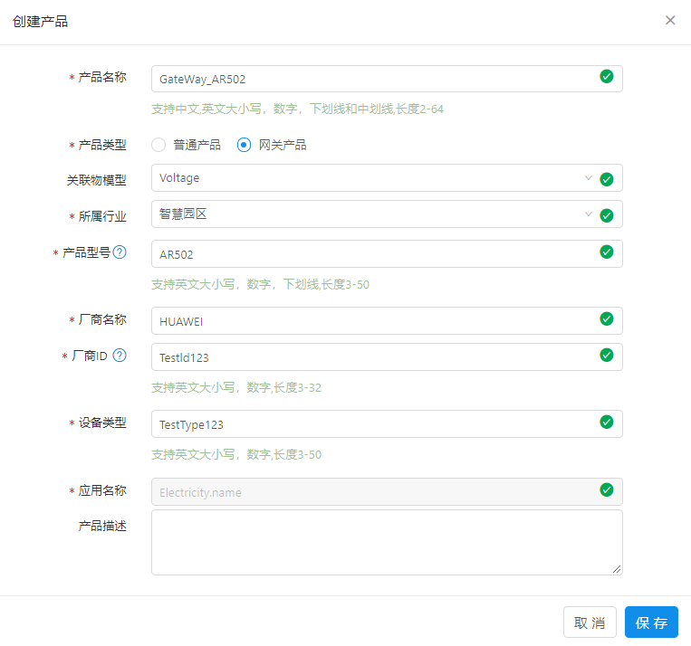

##### 创建产品（普通产品）

  1. 在ROMA Portal中创建普通产品。

  2. 在ROMA Portal左侧导航树中，选择“设备集成 > 设备集成LINK > 产品管理 ”。

  3. 单击“创建产品”按钮，界面弹出“创建产品”对话框。填写产品信息，物模型选择前面创建“环境监测模型”，如下图。

  4.  配置参考下图:

    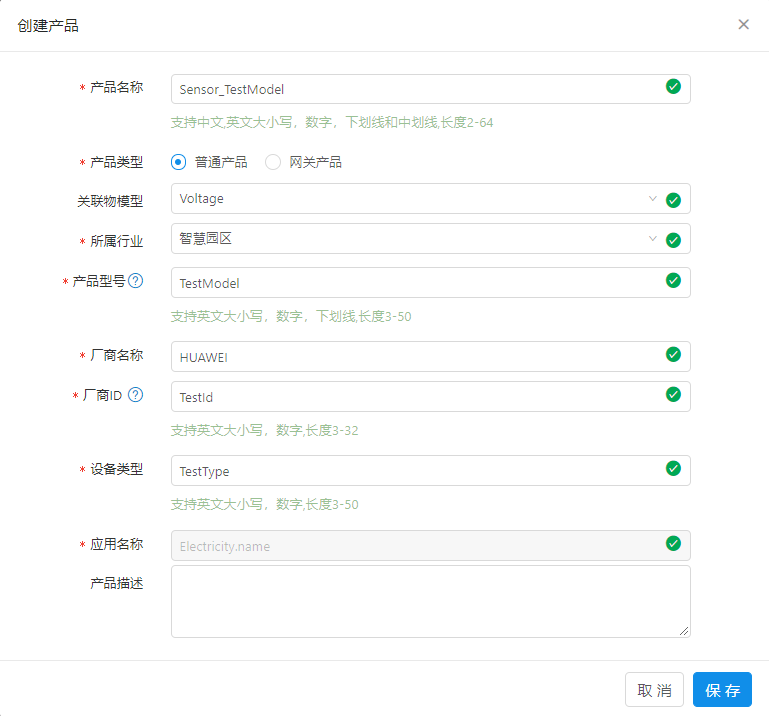

  5.  填写完成后，单击“保存”，产品创建完成。

##### 创建网关设备

  1. 在ROMA Portal左侧导航树中，选择“设备集成 > 设备
  集成LINK > 设备管理 ”。

  2. 单击“创建设备”按钮，界面弹出“创建设备”对话框。

  3. 填写设备信息，产品选择前面创建的“环保”，设备标签根据实际情况填写相关联的。

  4. 填写完成后，单击“保存”，设备创建完成。

  5. 在“设备详情”页面，选择“子设备管理”页签，可以看到网关子设备列表还没有子设备。

##### 模拟上线网关和电子设备

  1. 下载网关设备模拟程序,下载地址: [点击下载]()

  2. 启动Eclipse程序。

  3. 导入Demo工程。

  4. 在菜单栏中依次选择“File > Import > General > Existing Projects into Workspace”，单击“Next”，导入本地Demo工程。

  

  导入后目录格式如下:

  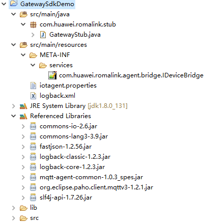

  在RUN Configuration中配置启动主函数,参考如下配置:

  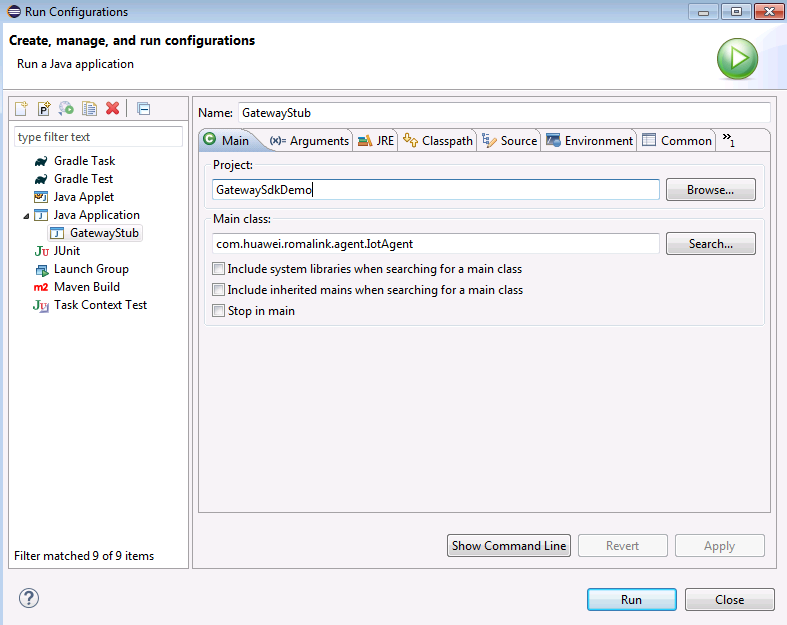

  修改GatawayStub.java的start方法内容,主要替换内容包括DeviceInfo中的配置信息,以及设备ID.

    ```
    DeviceInfo(null, "TestId", "TestType", "TestModel", "HUAWEI");
    childDevice.setDeviceIdentifier("meter01");
    ```

    ```
    public void start() {
          // TODO Auto-generated method stub
          //分别替换如下加黑字段为普通产品的厂商ID，设备类型，设备型号，厂商名称。
          DeviceInfo childDevice = new DeviceInfo(null, "TestId", "TestType", "TestModel", "HUAWEI");
         //替换meter01为子设备1的名称。
          childDevice.setDeviceIdentifier( "meter01");
          context.registerDevice(childDevice, resp -> {
              if (resp.getResult() == ResponseResult.fail) {
                  LOG.error("Failed to register device:{}", resp.getMessage());
                  return;
              }
              DeviceStatus deviceStatus1 = new DeviceStatus();
           //替换meter01为子设备1的名称。
              deviceStatus1.setDeviceIdentifier("meter01");
              deviceStatus1.setConnectStatus(DeviceConnStatus.online);
              context.changeDeviceConnectStatus(deviceStatus1, onlineResp -> {
                  if (onlineResp.getResult() == ResponseResult.fail) {
                      LOG.error("Failed to change device state:{}", resp.getMessage());
                      return;
                  }

    //                schduler.scheduleAtFixedRate(() -> {
    //                    JSONObject report = new JSONObject();
    //                    report.put("id", random.nextInt());
    //                    report.put("value", dateFormater.format(new Date()));
    //                    context.propertyReport(childDevice, "status", report);
    //                }, 1, 10, TimeUnit.SECONDS);
                });
            });

            // TODO Auto-generated method stub
            //  DeviceInfo childDevice = new DeviceInfo(null, "TestId", "TestType", "TestModel", "HUAWEI");
              //替换meter02为子设备2的名称。
              childDevice.setDeviceIdentifier("meter02");
              context.registerDevice(childDevice, resp -> {
                  if (resp.getResult() == ResponseResult.fail) {
                      LOG.error("Failed to register device:{}", resp.getMessage());
                      return;
                  }
                  DeviceStatus deviceStatus2 = new DeviceStatus();
                //替换meter02为子设备2的名称。
                  deviceStatus2.setDeviceIdentifier("meter02");
                  deviceStatus2.setConnectStatus(DeviceConnStatus.online);
                  context.changeDeviceConnectStatus(deviceStatus2, onlineResp -> {
                      if (onlineResp.getResult() == ResponseResult.fail) {
                          LOG.error("Failed to change device state:{}", resp.getMessage());
                          return;
                      }

    //                  schduler.scheduleAtFixedRate(() -> {
    //                      JSONObject report = new JSONObject();
    //                      report.put("id", random.nextInt());
    //                      report.put("value", dateFormater.format(new Date()));
    //                      context.propertyReport(childDevice, "status", report);
    //                  }, 1, 10, TimeUnit.SECONDS);
                  });
              });

            // TODO Auto-generated method stub
            //  DeviceInfo childDevice = new DeviceInfo(null, "TestId", "TestType", "TestModel", "HUAWEI");
                //替换meter03为子设备3的名称。
               childDevice.setDeviceIdentifier("meter03");
              context.registerDevice(childDevice, resp -> {
                  if (resp.getResult() == ResponseResult.fail) {
                      LOG.error("Failed to register device:{}", resp.getMessage());
                      return;
                  }
                  DeviceStatus deviceStatus3 = new DeviceStatus();
               //替换meter03为子设备3的名称。
                  deviceStatus3.setDeviceIdentifier("meter03");
                  deviceStatus3.setConnectStatus(DeviceConnStatus.online);
                  context.changeDeviceConnectStatus(deviceStatus3, onlineResp -> {
                      if (onlineResp.getResult() == ResponseResult.fail) {
                          LOG.error("Failed to change device state:{}", resp.getMessage());
                          return;
                      }

    //                  schduler.scheduleAtFixedRate(() -> {
    //                      JSONObject report = new JSONObject();
    //                      report.put("id", random.nextInt());
    //                      report.put("value", dateFormater.format(new Date()));
    //                      context.propertyReport(childDevice, "status", report);
    //                  }, 1, 10, TimeUnit.SECONDS);
                  });
              });

        }
      ```

  * 修改iotagent.properties配置参数,配置参考如下:

    

  * 右键单击“GatewaySdkDemo”，选择“Run as> Java Application”。

  * 单击“OK”，等待执行。执行成功后如下图：

    

  * 在ROMA Portal查看网关设备和网关子设备是否已经上线。

##### 配置规则引擎

  * 在ROMA Portal左侧导航树中，选择“设备集成 > 设备集成LINK > 规则引擎 ”。

  * 单击“创建规则”按钮，界面弹出“创建规则”对话框。自定义填规则名称，例如meter_rule_01。

  * 在规则引擎列表，单击“操作”列的“管理”。在弹出的“规则详情”页面的“数据源端”区域，单击“新增”，配置规则引擎的数据源端。

    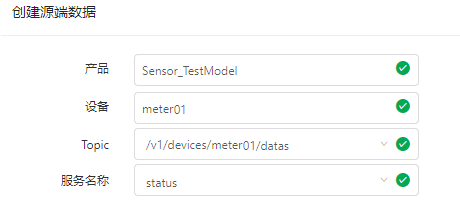

    配置完成后，单击“保存”。

    增加目标端：

    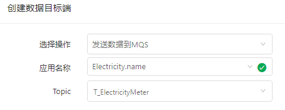

    配置完成后，单击“保存”。规则引擎配置完成。

    参考以上步骤配置规则引擎meter_rule_02和meter_rule_03。

##### 模拟发送消息


  * 打开Eclipse程序。

  * 修改GatawayStub.java文件中的start方法如下：

      ```
     public void start() {
         //分别替换如下加黑字段为普通产品厂商ID，设备类型，设备型号，厂商名称。
          DeviceInfo childDevice = new DeviceInfo(null, "TestId", "TestType", "TestModel", "HUAWEI");
    //替换meter01为子设备1的名称。
     childDevice.setDeviceIdentifier("meter01");
        JSONObject report1 = new JSONObject();
        //替换为设备名称和具体的电压值。
        report1.put("id", "meter01");
       report1.put("value", "700");
        context.propertyReport(childDevice, "status", report1);
    //替换meter02为子设备2的名称。
        childDevice.setDeviceIdentifier("meter02");
        JSONObject report2 = new JSONObject();
        //替换为设备名称和具体的电压值。
        report2.put("id", "meter02");
       report2.put("value", "710");
        context.propertyReport(childDevice, "status", report2);
    //替换meter03为子设备3的名称。
        childDevice.setDeviceIdentifier("meter03");
        JSONObject report3 = new JSONObject();
        //替换为设备名称和具体的电压值。
        report3.put("id", "meter03");
       report3.put("value", "720");
        context.propertyReport(childDevice, "status", report3);
       }右键单击“GatewaySdkDemo”，选择“Run as> Java Application”。

     ```

  * 单击“OK”，等待执行。执行完成后。将发送三个电表的数据到ROMA。


  * 在ROMA Portal左侧导航树中，选择“设备集成 > 设备集成LINK > 设备管理 ”。

  *  分别在子设备meter01、meter02、meter03的设备详情中选择“设备日志 > 消息内容查询”查看收到的消息内容。

##### 查看MQS中发送的消息

  * 在ROMA Portal左侧导航树中，选择“消息集成 > 消息队列服务MQS > 消息查询 ”。

  * 在“Topic名称”中输入“T_ElectricityMeter”，单击“查询”。

  * 在对应Topic的“操作”列，单击“内容”。查看接收到的消息内容。

#### FDI采集实时用电数据

  * 通过以上步骤，已完成模拟IOT设备实时发送数据到MQS消息服务，但发送的数据只有2个字段，相比hive中的表，缺少一个时间字段，本示例通过FDI编排特性，实现数据从MQS中抽取后加载到hive表前，增加当前系统时间字段。

  * 创建FDI任务，选择编排模式，选用实时同步模式

    

  * 读节点拖选MQS到编布,写节点拖选FI Hive，画布上完成连线，配置读写节点信息。

    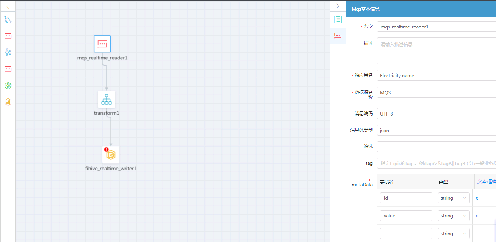

    

  * 配置转换节点信息，选择脚本模式。添加如下代码，完成了源和目标端数据字段的映射，并增加了时间字段，记录了每一条记录产生的时间。

    ```
    targetObj = {};
    targetObj.id = sourceObj.id;
    targetObj.value = sourceObj.value;
    var date = new Date();
    var year = date.getFullYear().toString();
    var mon = (date.getMonth()+1).toString();
    var day = date.getDate().toString();
    if(parseInt(mon) < 10){
      mon = "0" + mon;
    }
    if(day < 10){
      day = "0" + day;
    }
    targetObj.upload_date = year+"-"+mon+"-"+day;
    return targetObj;
    ```

  * 点击保存，完成任务配置。

  * 参考模拟发送消息步骤通过eclipse发送测试消息。

  * 查看hive表，数据已成功插入，如下表所示，2020-01-08为新插入的3条实时采集数据。

    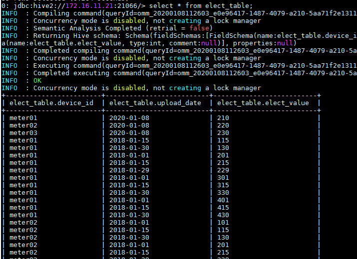

  * 至此，完成了实时IOT设备数据实时同步到FI hive的模拟。

### 在Hive表执行数据分析，并将结果导入到mysql


  * 在Hive beeline模式下，创建shell脚本并执行，完成数据分析。

    ```
    touch elect_anaysis.sh
    chmod a+x elect_anaysis.sh
    脚本内容如下：
    #!/bin/bash
    beeline -e "create table elect.analysis(name string,year int,month int,value int);"
    for i in 2019 2020
    do
    for j in 1 2 3 4
    do sql="insert into elect.analysis(name,year,month,value)  select a.user_name,$i,$j,max(b.elect_value)-min(b.elect_value) from elect.customer_info a, elect.elect_table b where a.device_id=b.device_id and year(b.upload_date) = $i and month(b.upload_date) = $j group by a.user_name;"
    beeline -e "$sql"
    done
    done
    beeline -e "select * from elect.analysis";
    ```

    * 在mysql数据库中创建表,用来存放经过hive分析过的数据。在生产环境中，如果数据量较大，推荐将Hive分析过的数据存放到GaussDB A中。

      ```
      create table user_elects(user_name varchar(20),year int,month int,elect_value int);
      ```
    * 创建FDI任务，定期同步hive分析表中的结果到mysql表中。配置参考下图:

      

      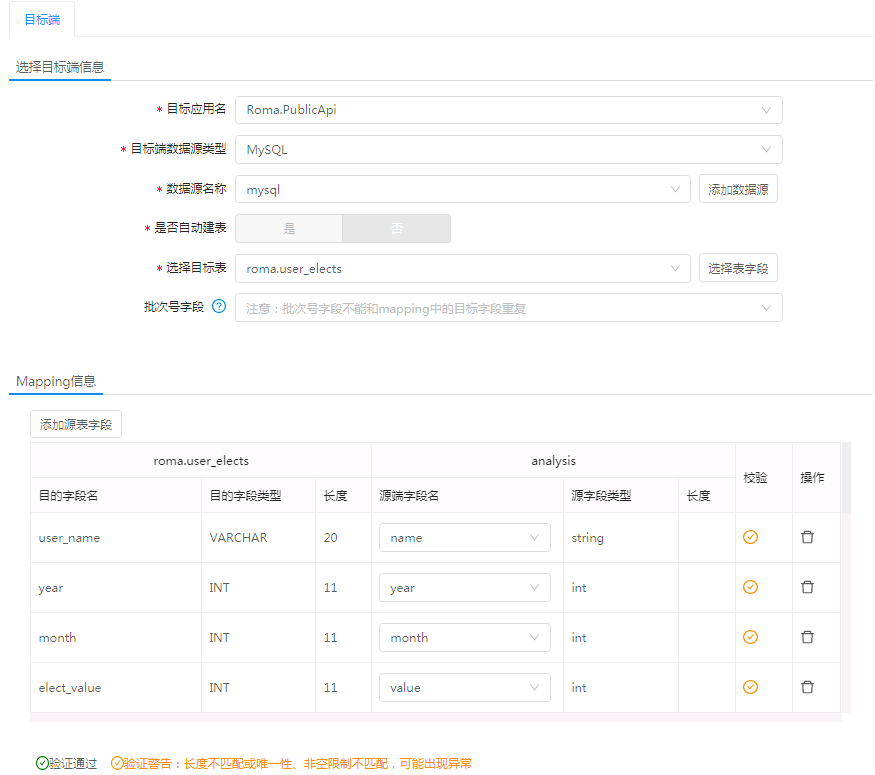

      保存后，手动调度任务，完成数据同步，同步完成后在mysql中查看数据。

      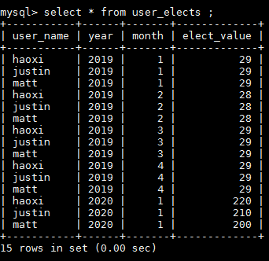

      如图所示，可以查看到用户每月的用电情况。

    * 可以通过为表创建索引等，加速查询速度。

      ```
      create index index_uym on user_elects(user_name,year,month);
      ```

### 通过LiveData API，开放数据服务。

  * 参考章节 *发布客户关系管理系统中的数据为数据API服务* 过程，对外提供数据查询APi,包括通过姓名查历史数据，以及通过姓名或者姓名+年+月组合查询的接口。

  如下为用例验证结果：

  1. 查询用户所有的用电记录，结果如下图：

      

  2. 查询用户在2020年1月的用电记录，结果如下图：

      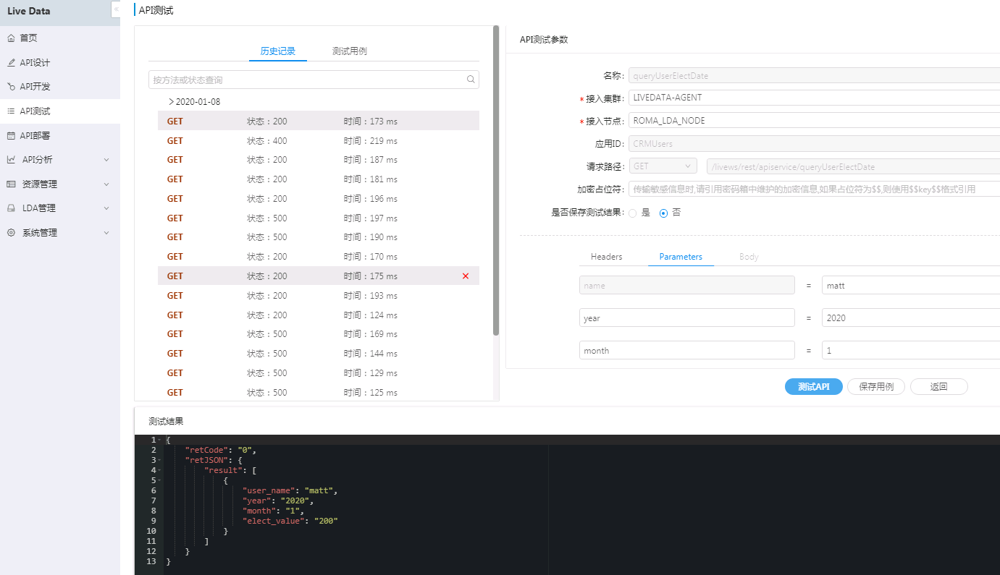

  * 至此，示例验证完成，通过ROMA采集电表记录，并结合历史数据和实时数据，通过FI HIVE进行分析统计用户每月用电情况，并通过livedata API开放了数据查询接口。
