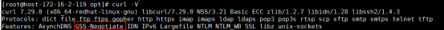
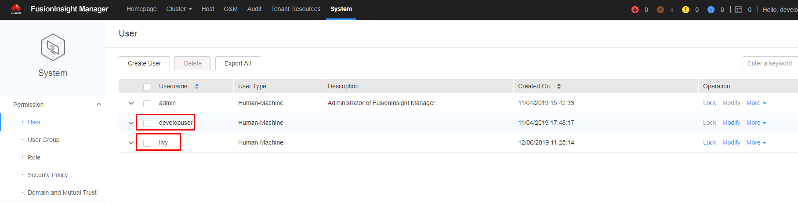
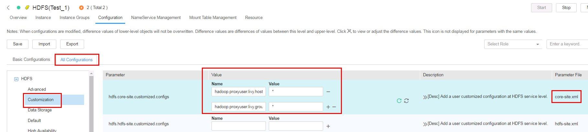
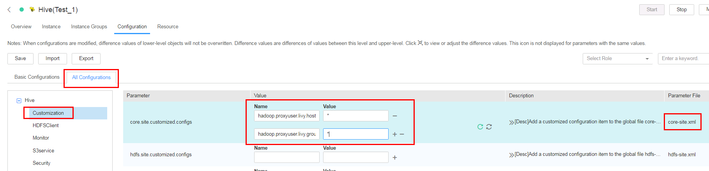
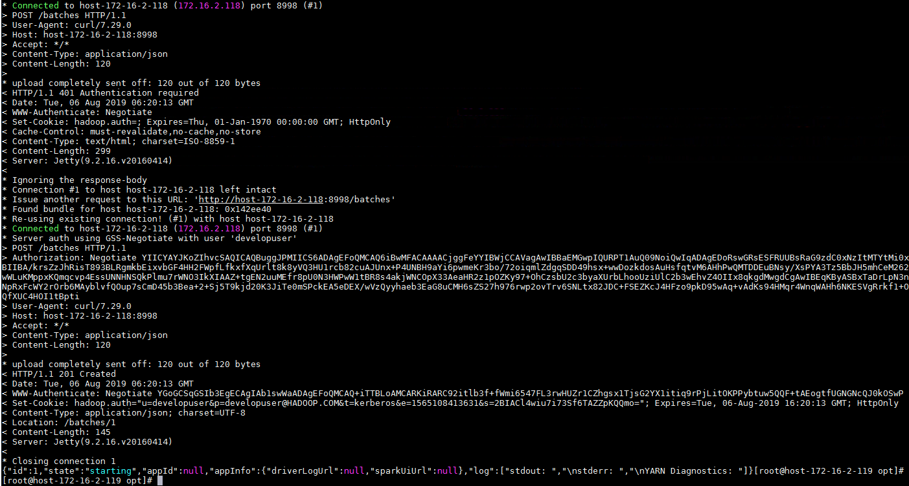
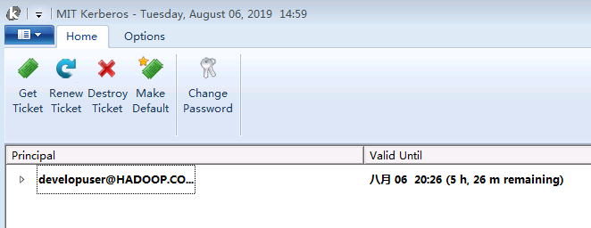

# Connection Instruction between Apache Livy and FusionInsight

## Succeeded Case

> Apache Livy 0.6.0-incubating <--> FusionInsight HD 6.5.1 (Spark2.x)
>
> Apache Livy 0.5.0-incubating <--> FusionInsight HD V100R002C80SPC200 (Spark2.x)

## Deploy the externally verified livy service and submit tasks using session and batch methods

### Scenario Description

In some complex scenarios, access control is required for users who submit tasks. The livy service supports Kerberos SPNEGO authentication for external access. The following is a specific test scenario

- Connection with FI HD cluster: 172.16.6.10-12, three-node deployment

- Apache Livy server side： 172.16.2.118, Install the FI HD client on this node and complete the download and installation of Livy by referring to the previous chapter.

- Client: 172.16.2.119, Submit a task request using the curl command on this node. You need to install an FI HD client and check whether curl supports SPNEGO authentication by using the command 'curl -V'

  

Two authenticated users are used in this scenario, user developuser, and user livy

- User livy is the user who needs to actually submit a spark task request to the FI HD cluster for the livy service

- User developuser is the user used by the client to submit tasks to the Livy server

- The entire business process is actually the proxy user developuser submits the spark task to the FI HD cluster in the name of the user livy, but before the task is performed, the user developuser needs to pass the Kerberos authentication of the FI HD cluster. In this way, the Apache Livy server access control is implemented

### Kerberos authentication-related configuration

- Log in to the FI HD manager to create the users developuser, livy to be used in the test. And download the user livy authentication information (user.keytab, krb5.conf)

  


- Log in to kadmin with the FI HD client, and create a new principal for FI HD's Kerberos authentication to the Livy HTTP service. The principal is "HTTP/host-172-16-2-118". host-172-16-2-118 is the hostname of the node where Apache Livy is deployed.

  

  When you execute the command "kadmin –p kadmin/admin", the initial password is "Admin@123", and the new password must be kept in mind after modification.

  Pass the generated http2.keytab (keytab file name can be customized) authentication file to the /opt path of the livy server and use the "kinit -kt" command to check whether the authentication is successful

  `kinit -kt /opt/http2.keytab HTTP/host-172-16-2-118@HADOOP.COM`

  

  Use the command "kdestroy" to clear the cached notes when done

- To log in to the cluster, click Service Management-> Yarn-> Service Configuration-> Select All Configuration-> Custom. Add the following configuration under the corresponding parameter file as core-site.xml:

  

  ```
  hadoop.proxyuser.livy.hosts = *
  hadoop.proxyuser.livy.groups = *
  ```

- Follow the same method above to add the same configuration to the core-site.xml file on both hdfs and hive service:

  

  

### Client related checks

- Use "curl -V" command to check if client curl command supports Kerberos Spnego

  

- Install the corresponding client for FI HD cluster

- Check that client time and cluster time are less than 5 minutes

### Livy server configuration

- Install the corresponding client for FI HD cluster

- Check that client time and cluster time are less than 5 minutes

- Check the livy.conf file configuration

  

  Note：

  1. "livy.file.local-dir-whitelist=/opt/". This configuration parameter is to use the livy batch method to submit the task locally, you need to open the whitelist of the local path.

  2. launch.kerberos.* related configuration parameters are  required for Livy to actually interact with the FI HD cluster

  3. auth.kerberos.* related configuration parameters are used for external access control to livy web UI


- Check the livy-client.conf file configuration

  

- Check the livy-env.sh file configuration

  

- Check spark-blacklist.conf file configuration

  

- Add the following configuration to the log4j.properties file to adjust the log level (optional)

  ```
  log4j.logger.org.eclipse.jetty=DEBUG
  ```

### Submit tasks using Livy session

The livy session mode corresponds to the spark console interactive mode. The spark task is submitted and ran by using the detailed code


- Log into the livy server and use `bin / livy-server start` to start the livy service

  

  Open Livy-end livy-root-server.out log to see if livy starts successfully

  

- Log in to the client (172.16.2.119) and use `kinit developuser` to enter a password to obtain a ticket

  


- Use the following command to start a pyspark session in livy

  `curl --negotiate -k -v -u developuser : -X POST --data '{"kind": "pyspark"}' -H "Content-Type: application/json" http://host-172-16-2-118:8998/sessions`

  


- Submit a piece of code for session/0 using the following command

  `curl --negotiate -k -v -u developuser : -X POST -H 'Content-Type: application/json' -d '{"code":"1 + 1"}' http://host-172-16-2-118:8998/sessions/0/statements`

  

- Use the following command to view the results:

  `curl --negotiate -k -v -u : http://host-172-16-2-118:8998/sessions/0/statements | python -m json.tool`

  

- Use the following command to close the session

  `curl --negotiate -k -v -u : http://host-172-16-2-118:8998/sessions/0 -X DELETE`

  

- Log in to the connected cluster's yarn view the results:

  

- Besides, after the client (172.16.2.119) completes the curl command submission task, you can use klist to view the ticket information:

  

  You can see that the ticket authentication ticket will be updated HTTP/host-172-16-2-118@HADOOP.COM

### Submit task example using Livy batch(1)

The livy batch mode corresponds to the spark-submit interactive mode. The spark task is submitted and ran by using a compiled jar package or a completed py file.

This example calculates the pi value by submitting a jar package locally using yarn client mode

- Log in to the client (172.16.2.119) and use `kinit developuser` to enter a password to obtain a ticket.

- Find the test jar package spark-examples_2.11-2.1.0.jar in the FI HD client and transfer it to the /opt/ path of the livy server

  

- Submit the spark task on the client (172.16.2.119) with the following command

  `curl --negotiate -k -v -u developuser : -X POST --data '{"file": "file:/opt/spark-examples_2.11-2.1.0.jar", "className": "org.apache.spark.examples.SparkPi", "args": ["100"]}' -H "Content-Type: application/json" http://host-172-16-2-118:8998/batches`

  

- Open the livy-root-server.out log to see the results:

  

- Log in to the yarn to view the results:

  

### Submit task example using Livy batch(2)

This example calculates the pi value by submitting a py file locally using yarn client mode

- Log in to the client (172.16.2.119) and use `kinit developuser` to enter a password to obtain a ticket.

- Create a py2.py file and upload it to the /opt/ path of the Livy server. The specific content is as follows：

```
import sys
from random import random
from operator import add

from pyspark.sql import SparkSession


if __name__ == "__main__":
    """
        Usage: pi [partitions]
    """
    spark = SparkSession\
        .builder\
        .appName("PythonPi")\
        .getOrCreate()

    partitions = int(sys.argv[1]) if len(sys.argv) > 1 else 2
    n = 100000 * partitions

    def f(_):
        x = random() * 2 - 1
        y = random() * 2 - 1
        return 1 if x ** 2 + y ** 2 <= 1 else 0

    count = spark.sparkContext.parallelize(range(1, n + 1), partitions).map(f).reduce(add)
    print("Pi is roughly %f" % (4.0 * count / n))

    spark.stop()
```

  

- Submit the spark task on the client (172.16.2.119) with the following command

  `curl --negotiate -k -v -u developuser : -X POST --data '{"file": "file:/opt/pi2.py" }' -H "Content-Type: application/json" http://host-172-16-2-118:8998/batches`

  

- Open the livy-root-server.out log to see the results:

  

- Log in to the yarn to view the results:

  

### Submit task example using Livy batch(3)

This example uses the yarn cluster mode to submit a jar package under the cluster hdfs path and run it to calculate the pi value.

- Log in to the client (172.16.2.119) and use `kinit developuser` to enter a password to obtain a ticket.

- Modify the livy.conf file configuration to:

  

- Upload the jar package in the /tmp path of the HDFS connected to the FI HD cluster

  

- Restart Livy

- Submit the spark task on the client (172.16.2.119) with the following command

  `curl --negotiate -k -v -u developuser : -X POST --data '{"file": "/tmp/spark-examples_2.11-2.1.0.jar", "className": "org.apache.spark.examples.SparkPi", "args": ["100"]}' -H "Content-Type: application/json" http://host-172-16-2-118:8998/batches`

  

- Open the livy-root-server.out log to see the results:

  

- Log in to the yarn to view the results:

  

  

### Submit task example using Livy batch(4)

This example uses the yarn cluster mode to submit a jar package under the local path of the cluster and run it to calculate the pi value.

- Log in to the client (172.16.2.119) and use `kinit developuser` to enter a password to obtain a ticket.

- Because you use the yarn cluster to submit the jar package locally, you do not know in advance which cluster node the worker is in, so put the jar package spark-examples_2.11-2.1.0.jar in the /home path of each cluster node:

  

  

  

- Submit the spark task on the client (172.16.2.119) with the following command

  `curl --negotiate -k -v -u developuser : -X POST --data '{"file": "local:/home/spark-examples_2.11-2.1.0.jar", "className": "org.apache.spark.examples.SparkPi", "args": ["100"]}' -H "Content-Type: application/json" http://host-172-16-2-118:8998/batches`

  

- Open the livy-root-server.out log to see the results:

  

- Log in to the yarn to view the results:

  

  

### Configure Kerberos Spnego on Windows jump machine to log in livy web UI

The authentication mechanism of the Windows jump machine (172.16.2.111) accessing Livy web UI is the same as that of the client (172.16.2.119) using curl command to access Livy server and submit spark task.

- Product documentation -> Application Development Guide -> Security Mode -> Spark2x Development Guide -> Preparing the Environment -> Preparing for the HiveODBC Development Environment -> Windows Environment -> Finish the first 4 steps

  

- Configure JCE

  Download the Java Cryptography Extension (JCE) from the java official website, then decompress it to %JAVA_HOME%/jre/lib/security and replace the corresponding file.

  

- Check if the hostname of the livy server is added to the hosts file:

  

- Configure Firefox

  Firefox under windows needs to adjust the following parameters by visiting the `about:config` page:

  1. `network.negotiate-auth.trusted-uris` is set to trusted addresses

  2. `network.auth.use-sspi` is set to disable sspi authentication protocol

  

  

- Authentication with MIT Kerberos

  

- Login to Livy's web ui address http://host-172-16-2-118:8998/ui

  

- Submit the task using the previous sample and check it on Livy web ui

  

  

- Check the service ticket generated by MIT Kerberos

  
